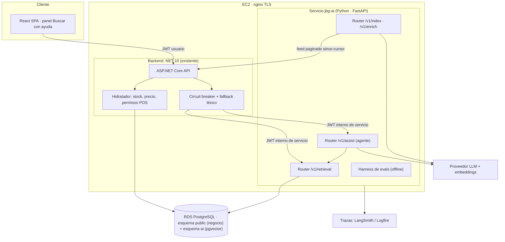

> ⚠️ **VARIANTE PARA EQUIPO DE 3 DESARROLLADORES — NO ES EL PLAN VIGENTE.**
> ⚠️ **DESACTUALIZADA desde la v3 (3 ago 2026):** no incorpora el consenso con la revisión de la PR #4 ni las especificaciones v2 (`materials[]`, `ProductFamily`, inventario asistido, prefiltro blando). Si el equipo creciera a tres personas, hay que rehacerla partiendo de la v3, no usarla tal cual.
> El documento a seguir es [proyecto-final-diseno-rag-joiabagur.md](proyecto-final-diseno-rag-joiabagur.md), dimensionado para **2 desarrolladores**.
> Esta variante se conserva por si el equipo creciera a tres personas. Su descomposición en changes es [proyecto-final-plan-changes-openspec-3devs.md](proyecto-final-plan-changes-openspec-3devs.md).
> **Diferencias principales frente al plan vigente:** incluye argumentario por POS como servicio, agente de reposición opcional, medición del reranking, caché semántico, `AiUsageLog` como entidad .NET, trazado con LangSmith/Logfire, golden set de 80-100 consultas y despliegue en la semana 4 (no en la 2).

---

# Proyecto Final de Máster — Diseño del sistema de IA para Joiabagur PV

**Documento:** diseño conceptual + estrategia de datos + plan de ejecución
**Dominio:** Joiabagur PV (gestión de puntos de venta de joyería)
**Fecha de entrega del PF:** 3 de septiembre de 2026
**Rama de entrega:** `finalproject-[INICIALES]` *(placeholder: sustituir por las iniciales del equipo)*
**Equipo:** *(placeholder: nombres completos de los integrantes, obligatorio en el README)*

---

## 0. Resumen ejecutivo

Construimos un **buscador semántico de catálogo con venta asistida** para operadores de joyería, servido por un **microservicio RAG en Python** sobre **pgvector**, integrado en el backend .NET existente de Joiabagur PV y desplegado en la misma infraestructura AWS que ya tiene la aplicación en producción.

Cuatro decisiones estructurales, todas justificadas más abajo:

1. **El corpus no existe todavía y ese es el verdadero proyecto.** El catálogo real de una joyería es texto pobre (`"Anillo plata 925 T12"`). Un RAG sobre eso no aporta nada. La fase de **enriquecimiento de catálogo** no es un preámbulo: es la construcción del corpus, y es donde vive la ingeniería de prompts y la extracción estructurada.
2. **Dos índices, no uno.** Índice de **entidades** (1 producto = 1 documento, sin chunking) para búsqueda/desambiguación, e índice de **conocimiento comercial** (materiales, cuidados, tallas, guiones de venta, políticas — sí chunkeado) para que la capa de generación responda con citas verificables. Enrutado entre ambos.
3. **La IA nunca es fuente de verdad de stock ni de precio.** El servicio Python devuelve identificadores, scores y razones; el backend .NET **hidrata** precio, stock y permisos desde PostgreSQL antes de responder al operador. Esto no es solo un principio: se convierte en un **test automático** del harness de evaluación.
4. **CAG entra, pero acotado.** No como camino de producción, sino como **baseline v0 medible** (catálogo de un POS entero en contexto) contra el que demostrar empíricamente que el RAG compensa, más un **caché semántico** de consultas frecuentes. Ver §6.7.

**Veredicto sobre las especificaciones funcionales existentes:** se **adaptan con rediseño arquitectónico**. El criterio de dominio es bueno y se conserva casi entero; la capa técnica propuesta (módulo IA dentro del monolito .NET) es incompatible con el Proyecto Final y se sustituye; faltan dos piezas obligatorias (agentes y evaluación) y sobra ~60 % del alcance funcional para el plazo disponible.

**Restricción dura que condiciona todo el plan:** quedan **~4,7 semanas** desde hoy (1 de agosto) hasta el 3 de septiembre, en agosto. El plan de §11 está construido con líneas de corte explícitas.

---

## 1. Punto de partida verificado en el repositorio

Todo lo siguiente está comprobado en el código, no asumido.

| Área | Estado real | Implicación para el PF |
|---|---|---|
| Backend | .NET 10, arquitectura en capas (Domain / Infrastructure / Application / API), EF Core, PostgreSQL, JWT, Serilog, 18 controllers | Base sólida; el servicio de IA se acopla por HTTP, no por código |
| Modelo de dominio | `Product` (SKU, Name, Description, Price, CollectionId, IsActive), `Collection`, `Inventory` (Product×POS, Quantity, IsActive), `InventoryMovement`, `Sale` (precio congelado, POS, operador, método de pago), `PointOfSale`, `User`/`UserPointOfSale`, `Return`, `ProductPhoto` | Todas las señales que necesita el RAG (stock por POS, rotación, ventas) ya existen y son consultables |
| Búsqueda actual | `GET /api/products/search` → SKU exacto + nombre parcial, máx. 50 resultados, filtrado por POS asignados para operadores ([ProductsController.cs:92](../../backend/src/JoiabagurPV.API/Controllers/ProductsController.cs#L92)) | Es el **baseline léxico** contra el que mediremos, y el **fallback** cuando la IA no responda |
| IA existente | Reconocimiento **visual** de producto: `ProductPhotoEmbedding` (MobileNetV2, 1280 dims, guardado como **JSON en texto**), inferencia con TensorFlow.js en el navegador, entrenamiento y `ModelMetadata`/`ModelTrainingJob` | **No se toca.** Es otro problema (imagen) y otro espacio vectorial. Coexisten dos índices; el README debe explicar por qué |
| pgvector | **No instalado.** No hay ninguna referencia en el backend | Instalarlo es trabajo nuevo (extensión en RDS + esquema propio del servicio Python) |
| Datos en el repo | El seeder solo crea el admin y los métodos de pago. **No hay datos de catálogo, inventario ni ventas versionados** | Sin export de producción anonimizado, **todo el corpus es sintético**. Ver §7 |
| Despliegue | AWS EC2 + nginx (TLS) + Docker + RDS PostgreSQL + S3 + ECR + GitHub Actions con OIDC. Producción viva en `pv.joiabagur.com` | El requisito de "URL pública" del PF está prácticamente resuelto: añadimos un contenedor más |
| Metodología | OpenSpec (`openspec/specs`, `openspec/changes`) ya en uso por el equipo | El trabajo del PF puede entregarse como *changes* OpenSpec: coherencia y evidencia de proceso |
| Frontend | React 19 + Vite + TypeScript + Metronic, `src/pages/sales/` con flujo manual y `scan.tsx` | Punto de inserción natural del panel "Buscar con ayuda" |

**Lo que no he podido verificar (asunción a validar en la semana 0):** el volumen y la riqueza del catálogo real en producción, y si es posible exportarlo. El diseño de datos de §7 **no depende** de ello: funciona 100 % sintético y mejora si hay export real.

---

## 2. Análisis crítico de [`joiabagur-ia-especificaciones-funcionales.md`](joiabagur-ia-especificaciones-funcionales.md)

Esta sección precede deliberadamente al diseño porque lo condiciona.

### 2.1. Lo que es útil y se conserva tal cual

| Idea de las specs | Por qué es valiosa para el PF |
|---|---|
| **Principio 2**: la IA no es fuente de verdad de stock ni precio | Es la decisión arquitectónica más importante del proyecto y la que separa un demo de un sistema. La convertimos en el patrón *retrieve → hydrate* (§6.8) y en un eval determinista (§9.3) |
| **Principio 5**: control por POS | Ya implementado en el repo; se traslada al retriever como filtro **pre-ranking obligatorio**, no como post-filtro. Es el "filtrado contextual" de S10 aplicado a seguridad |
| **`ProductAiProfile` con `AiConfidence`, `ReviewStatus`, `SourceHash`** | Es exactamente extracción estructurada + guardrails + idempotencia (S4/S11). `SourceHash` da reindexado incremental gratis. Se adopta entero |
| **`SourceText` controlado y reproducible + modelo de embedding versionado** | Es la disciplina de reindexación/versionado de S11. Se adopta entero |
| **Variantes S/M/L y `VariantGroupKey`** | Es *el* caso donde el sistema aporta valor diferencial y medible (error de selección de talla en hoteles). Se convierte en una categoría propia del golden set |
| **`ProductSearchEvent`** | Telemetría de consulta→selección. Base de la evaluación online y del futuro reranking aprendido |
| **Ranking híbrido** (§5.5 specs) | Alineado con búsqueda híbrida (S10), aunque la fórmula concreta hay que recortarla |
| **Tabla 7.3** (cuándo generativa, cuándo embeddings, cuándo reglas SQL) | Criterio excelente y poco común. Se conserva íntegra como matriz de decisión del proyecto |
| **`AiUsageLog`** | Control de coste por feature; alineado con "cuánto cuesta un agente" (S12) |

### 2.2. Lo que es parcialmente útil: qué se conserva y qué se recorta

| Idea | Se conserva | Se recorta / difiere | Motivo |
|---|---|---|---|
| Ranking híbrido de 7 términos (§5.5 specs) | 3 señales: léxico/SKU, semántica, disponibilidad en POS + 2 penalizaciones (stock 0, variante ambigua) | `score_rotacion_pos`, `score_prioridad_comercial` como pesos libres | No hay datos para calibrar 7 pesos en 5 semanas. Con golden set se calibran 3; siete pesos sin evidencia es numerología |
| Funcionalidad 3 completa (6 subfuncionalidades de inventario) | **Sustitutos** (reutiliza el retriever, coste marginal ≈ 0) y **argumentario por POS** (1 documento por POS, alimenta el contexto del asistente) | Reposición y packing list → opcionales con línea de corte; **traslados y liquidación → fuera** | Sustitutos y argumentario multiplican el valor del índice ya construido. Traslados/liquidación son un producto de analítica de inventario, no de RAG |
| Modelo de datos (14 tablas propuestas) | 2 tablas nuevas en .NET (`ProductAiProfile`, `ProductSearchEvent`) + esquema `ai` propio del servicio Python | `ProductFamily`, `ProductFamilyMember`, `ProductRecommendation`, `InventoryPolicy`, `InventoryPackingList*`, `InventoryRecommendationAlternative` | Sobreespecificación. `VariantGroupKey` en el perfil + agrupación en tiempo de consulta cubre el 100 % del caso sin dos tablas y sin migración adicional (resuelve la "decisión abierta 4") |
| ~25 endpoints sugeridos | 6 endpoints .NET + 5 del servicio Python (§6.8) | El resto | Un contrato pequeño y estable se defiende mejor ante un evaluador que 25 firmas sin implementar |
| `ProductRecommendation` persistida y precomputada | Solo para *overrides* manuales del admin | Precomputar similitudes producto×producto | El retriever ya calcula similitud en línea en milisegundos sobre ~1-2k filas. Precomputar es caché prematura con coste de invalidación |
| KPIs de negocio (§4.10, §5.11, §6.9 specs) | Se **instrumentan** (eventos, latencias, rank de selección) | Se **no se miden** como resultado del PF | Sin tráfico real ni A/B, "ticket medio asistido vs no asistido" no es medible en 5 semanas. Instrumentar sí; prometer números, no |

### 2.3. Lo que no aporta o entra en conflicto

1. **Arquitectura §7.1 — "módulo IA dentro del monolito .NET" con `IAiTextProvider` / `IAiEmbeddingProvider` en C#.** Conflicto directo con el requisito de implementar los servicios RAG en Python, y con todo el instrumental del máster (pgvector desde Python, RAGAS, LangGraph, trazado con LangSmith/Logfire). Además obligaría a reimplementar en C# lo que en Python es una dependencia. **Se rediseña** a microservicio (§6.2).
2. **"Fuera de alcance: agentes autónomos" (línea 6 de las specs).** El PF exige capa agéntica. La tensión es aparente: lo que las specs prohíben es que un agente **escriba** stock sin aprobación humana, no la existencia de un agente. Resolución: **agente con tools de solo lectura + human-in-the-loop para toda escritura** (§8). Se respeta el espíritu de la spec y se cumple el PF.
3. **Ausencia total de evaluación.** Las specs tienen KPIs de negocio pero ni una métrica de sistema: no hay golden set, ni recall, ni faithfulness, ni comparación entre configuraciones. Es el hueco más grave respecto al PF, donde "evals reales, no solo pruebas manuales" es criterio explícito de destacar. **Se añade** §9 como componente de primera clase.
4. **Ceguera respecto a los datos.** Las specs asumen que el catálogo ya contiene texto suficiente para embeber. No es cierto: el `SourceText` de ejemplo de §4.7 de las specs ya incluye campos que *aún no existen* (`Estilo`, `Ocasiones`, `Aliases`). Es decir, el corpus se crea, no se recupera. Esto reordena las prioridades: **datos primero** (§7).
5. **Roadmap de 5 fases sin fechas ni criterio de corte.** Inservible con 4,7 semanas. **Se sustituye** por §11.
6. **KPIs no medibles y flujo de aprobación por lotes en UI de admin.** El flujo "admin revisa producto a producto" de §4.5 no escala a 1.000 productos ni cabe en el plazo. Se sustituye por **revisión por excepción**: se auto-aprueba lo que supera umbral de confianza y validación de esquema; solo se enruta a revisión humana lo dudoso (patrón de guardrails de S4).

### 2.4. Tensiones explícitas y cómo se resuelven

| Tensión | Resolución adoptada |
|---|---|
| Specs: "IA dentro del monolito .NET" ↔ PF: RAG en Python | Microservicio Python (`jbg-ai`), contrato HTTP, sin acoplamiento de código |
| Specs: "fuera de alcance agentes autónomos" ↔ PF: agentes obligatorios | Agente de solo lectura + HITL en escrituras |
| Specs: amplitud de inventario (6 subfuncionalidades) ↔ 4,7 semanas | Núcleo = búsqueda + venta asistida + sustitutos; inventario recortado con línea de corte |
| Specs: 14 tablas y 25 endpoints ↔ MVP defendible | 2 tablas .NET + esquema `ai` + 11 endpoints |
| Specs: "datos reales" ↔ repo sin datos y catálogo real pobre | Generación sintética masiva y documentada como decisión de ingeniería (§7), no como parche |
| PF: "datos reales del dominio" ↔ corpus sintético | El **dominio** es real (producto en producción, modelo de datos real, operativa real). Los **datos** son sintéticos y trazables, con export real opcional. Se declara abiertamente en el README |

### 2.5. Veredicto

> **Adaptar con rediseño arquitectónico.** Se conserva el criterio funcional y de producto de las specs (que es bueno y específico del dominio), se sustituye íntegramente su capa técnica, se añaden las dos piezas obligatorias que faltan (agentes y evaluación) y se recorta el alcance funcional a lo que cabe con solidez en el plazo.

---

## 3. Qué construimos y qué no

| # | Capacidad | Estado | Justificación |
|---|---|---|---|
| 1 | **Enriquecimiento de catálogo** (extracción estructurada → `ProductAiProfile` → documento indexable) | Núcleo | Es la construcción del corpus. Sin esto no hay RAG |
| 2 | **Búsqueda semántica híbrida por POS** (dos índices, filtros duros, threshold, abstención) | Núcleo | Corazón del PF |
| 3 | **Venta asistida** (desambiguación de variantes, argumentario con citas, avisos) | Núcleo | Es la capa de generación con atribución verificable |
| 4 | **Agente asistente de venta** (tools de solo lectura, enrutado, guardrails, HITL) | Núcleo | Requisito del PF; añade la capa de decisión sobre el pipeline |
| 5 | **Sustitutos cuando no hay stock** | Núcleo (coste marginal) | Reutiliza el mismo retriever con filtro invertido |
| 6 | **Evaluación offline** (golden set, ablations, RAGAS, validador anti-alucinación) | Núcleo | Requisito del PF y criterio de "destaca" |
| 7 | **Argumentario comercial por POS** | Recomendado | 1 documento por POS; alimenta ranking y contexto. Barato |
| 8 | **Agente de reposición** (propuestas batch con aprobación) | Opcional, línea de corte semana 4 | Demuestra segundo agente + HITL. Se cae primero si hay retraso |
| 9 | Packing list, traslados, liquidación, rotación | **Fuera** | Analítica de inventario, no RAG. Se mencionan como próximos pasos |
| 10 | Reconocimiento visual, try-on, fine-tuning | **Fuera** | Ya existe (visual) o no aporta al aprobado |

---

## 4. El problema de recuperación, bien planteado

Conviene nombrarlo con precisión porque cambia el diseño respecto al proyecto de referencia del máster (estimador de software sobre presupuestos):

- **No hay documentos largos que trocear.** Un producto es una entidad con ~15 atributos y un texto de 40-120 palabras. **Chunking = ninguno** para el índice de catálogo: 1 producto = 1 documento. Trocear aquí sería un error importado de otro dominio.
- **La consulta es corta, coloquial y con jerga mixta** (`"anillo erizo talla M"`, `"algo dorado para regalo de menos de 80"`). Combina intención semántica, restricciones duras (precio, talla, POS) y a veces términos literales (SKU, nombre propio de la pieza). **Búsqueda híbrida obligatoria** (S10): lo semántico solo diluiría "ERIZO-M".
- **El resultado no es una respuesta en prosa: es un conjunto ordenado de entidades** más una explicación. La generación es la capa fina, no la gruesa.
- **Sí hay un segundo corpus con forma de documento**: conocimiento comercial de joyería (materiales y alergias, cuidados, equivalencias de talla, guiones de venta, política de devoluciones). Ese sí se trocea, y es lo que permite respuestas fundamentadas **con citas** y medir *faithfulness* de verdad.

De ahí la arquitectura de **multi-índice con enrutado** (S10): el clasificador de intención decide si la consulta va a catálogo, a conocimiento, o a ambos.

---

## 5. Arquitectura objetivo



**Reglas de propiedad de datos, sin excepciones:**

| Recurso | Propietario | Quién escribe | Quién lee |
|---|---|---|---|
| `public.*` (catálogo, stock, ventas, usuarios) | .NET | .NET | .NET |
| `ProductAiProfile`, `ProductSearchEvent` | .NET | .NET (tras revisión/auto-aprobación) | .NET, y Python vía feed HTTP |
| `ai.*` (documentos, embeddings, proyecciones, evals) | Python | **Solo** Python | Python |
| Stock y precio mostrados al operador | .NET | — | Siempre desde `public.*`, nunca desde `ai.*` |

Python **nunca** escribe en `public` y **nunca** lee de `public` por SQL: consume feeds HTTP paginados del .NET. Es una regla más estricta de lo necesario, y es deliberada: hace el sistema explicable en una frase y elimina el acoplamiento de esquema entre dos lenguajes.

---

## 6. Diseño del sistema RAG

### 6.1. Pipeline de enriquecimiento (construcción del corpus)

```text
Producto (SKU, nombre, descripción, precio, colección, fotos)
  → normalización determinista (limpieza, unidades, tallas por regex)
  → extracción estructurada con LLM (JSON schema estricto, temperatura 0)
  → validación: esquema + vocabularios cerrados + reglas de coherencia
  → confianza por campo → auto-aprobado | revisión humana | rechazado
  → ProductAiProfile (.NET) + SourceText canónico + SourceHash
  → embedding (solo si cambia SourceHash) → ai.product_document
```

Puntos de diseño que se defienden en el README:

- **Vocabularios cerrados** para `piece_type`, `material`, `stone_type`: el modelo elige de una lista, no inventa. Reduce la varianza y hace el filtrado estructural fiable.
- **Confianza por campo, no global.** `AiConfidence` agregada oculta que la talla es dudosa mientras el material es obvio. Se guarda un mapa `{campo: confianza}` y se enruta a revisión solo por los campos críticos (talla, material, precio implícito).
- **Revisión por excepción** (§2.3.6): con ~1.000 productos, revisar todo a mano no cabe. Auto-aprobación con umbral + muestreo humano del 10 % para estimar la tasa de error real.
- **Idempotencia por `SourceHash`**: reindexar es barato y determinista; regenerar embeddings sin cambio de fuente está prohibido por construcción.
- **Versionado de embeddings**: `embedding_model` + `embedding_version` por fila; una migración de modelo se hace en columna nueva, nunca sobrescribiendo (S11).

### 6.2. Esquema conceptual del índice (`ai`, pgvector)

```text
ai.product_document              -- 1 fila por producto, sin chunking
  product_id (uuid, PK)          -- referencia lógica a public.products
  sku, name, collection_name, price, price_band
  piece_type, material, stone_type, size_label, variant_group_key
  color_tags[], style_tags[], occasion_tags[], search_aliases[]
  doc_text            text       -- SourceText canónico (lo que se embebe)
  source_hash         char(64)
  embedding           vector(1536)
  tsv                 tsvector   -- to_tsvector('spanish', ...)
  is_active           bool
  embedding_model, embedding_version, indexed_at

ai.knowledge_document / ai.knowledge_chunk   -- corpus comercial, sí chunkeado
  doc_type: cuidado | material | talla | guion_venta | politica | faq
  content, chunk_index, metadata jsonb, embedding vector(1536), tsv

ai.pos_projection                -- proyección de disponibilidad y rotación
  pos_id, product_id, is_assigned, qty_bucket (0 | 1-2 | 3+)
  sales_30d, sales_90d, last_sale_at, refreshed_at

ai.pos_profile                   -- argumentario comercial por POS
  pos_id, period, metrics jsonb, summary_text, generated_at, model

ai.query_log, ai.eval_run, ai.eval_case, ai.eval_result
```

Índices: **HNSW con `vector_cosine_ops`** sobre ambas columnas `embedding` (alineado con el operador `<=>` de la query — el antipatrón silencioso de S8), **GIN** sobre `tsv` y sobre `metadata`, B-tree sobre `variant_group_key`, `piece_type`, `price_band`.

**`qty_bucket`, no cantidad exacta.** La proyección se refresca cada N minutos y puede estar desfasada; guardar el número exacto invitaría a mostrarlo. Guardando un *bucket* solo puede usarse como **señal de ranking**, nunca como dato de pantalla. La cantidad real la pone siempre .NET al hidratar. Es una restricción de diseño que hace imposible el error, en vez de prohibirlo por convención.

### 6.3. Recuperación

Orden de operaciones, y el orden importa:

1. **Filtros duros pre-ranking** (seguridad y corrección, nunca post-filtro): producto activo, asignado y activo en el POS del solicitante, rol del usuario. Un post-filtro sobre top-k rompe el recall silenciosamente.
2. **Filtros estructurales** derivados de la consulta: banda de precio, tipo de pieza, talla, colección. Extraídos por un **reformulador** que separa la consulta en `{texto_semántico, filtros}` (S9).
3. **Búsqueda híbrida**: vectorial (`<=>` sobre HNSW) + léxica (`ts_rank` en español, más *boost* de coincidencia exacta de SKU/nombre), fusionadas con **RRF** — sin necesidad de normalizar escalas incomparables.
4. **Threshold + abstención**: por debajo del umbral de similitud no se devuelve nada y se marca `low_confidence: true`. Devolver cero es información válida, no un fallo. El umbral se fija mirando la distribución empírica de distancias sobre el golden set, no por intuición.
5. **Señales de negocio como reordenación suave**: disponibilidad en el POS (`qty_bucket`) y rotación reciente. Pesos calibrados contra el golden set, no elegidos a ojo.
6. **Reranking cross-encoder: NO por defecto.** Con ~1.000 entidades y consultas cortas, la hipótesis es que no compensa. Se implementa como *flag* y se **mide** (§9.2). Si el golden set dice que sube nDCG@5 lo suficiente para justificar la latencia, se activa; si no, el README explica por qué se descartó. Descartarlo con datos vale más que activarlo sin ellos.

### 6.4. Generación y atribución

La respuesta al operador es **estructurada**, no prosa libre:

- `groups[]`: candidatos agrupados por `variant_group_key`, con la talla destacada.
- `reason` por candidato: qué señales coincidieron (frase corta, plantilla + LLM).
- `pitch`: argumentario de venta, **anclado** al perfil del producto y, si aplica, a chunks del corpus de conocimiento, con `citations[]`.
- `warnings[]`: variantes ambiguas, confirmar talla, stock crítico.
- `clarification_question`: si la consulta es ambigua, se pregunta en vez de adivinar.

**Toda afirmación numérica sobre stock o precio se inyecta desde .NET tras la generación**, mediante *placeholders* que el modelo no puede rellenar. El validador de §9.3 comprueba que no aparece ningún número que no venga del hidratador.

### 6.5. Guardrails

| Riesgo | Control |
|---|---|
| Alucinación de stock/precio | *Placeholders* + validador determinista + eval automático |
| Producto de otro POS filtrado | Filtro duro pre-ranking + test de integración con dos operadores distintos |
| Consulta fuera de dominio ("¿qué tiempo hace?") | Clasificador de intención → respuesta de rechazo cortés, sin llamada al retriever |
| Inyección de prompt en la consulta del operador | Consulta tratada como dato, nunca como instrucción; salida validada contra JSON schema |
| Fuga de datos entre POS por caché | Clave de caché incluye `pos_id` y `role`. Sin excepción |
| Coste descontrolado | `AiUsageLog` por feature, límite por usuario/día, caché semántico |

### 6.6. Observabilidad

Trazas por petición (LangSmith o Logfire, decisión de la semana 0) con `trace_id` propagado desde .NET: consulta original, consulta reformulada, filtros aplicados, candidatos y scores por rama, decisión del agente, tools invocadas, tokens y coste, latencia por etapa. Sin esto, depurar "por qué salió ese producto" es imposible, y esa pregunta la hará el evaluador.

### 6.7. CAG: qué papel juega y por qué acotado

El catálogo completo (~1.000 productos × ~200 tokens) son ~200k tokens: demasiado para meterlo en cada consulta. Pero **el catálogo de un solo POS** (100-250 productos) son 20-50k tokens, perfectamente cacheables con *prompt caching*. Eso hace de CAG un **prototipo v0 legítimo y honesto** para este dominio, no un hombre de paja.

Se usa en dos sitios, ninguno de ellos el camino de producción:

1. **Baseline v0 del harness de evaluación.** Mismo golden set, mismas métricas, comparado contra el RAG en calidad, latencia y coste por consulta. Esto convierte la narrativa "escalamos de CAG a RAG" del enunciado en **una tabla con números** en vez de una afirmación. Es la forma más barata de justificar empíricamente la arquitectura elegida.
2. **Caché semántico de consultas frecuentes** (S4): en un hotel, los operadores repiten consultas. Un caché por `(pos_id, embedding de consulta)` con umbral de similitud alto ahorra latencia y coste reales.

CAG **no** se usa como vía de recuperación en producción: no filtra por stock, no escala al catálogo completo y su coste por consulta es un orden de magnitud mayor. Eso también se dice en el README, con la tabla que lo demuestra.

### 6.8. Integración Python ↔ .NET

**Contratos del servicio Python** (todos internos, nunca expuestos al navegador):

| Endpoint | Entrada (resumen) | Salida (resumen) |
|---|---|---|
| `POST /v1/retrieval/products` | `query`, `pos_id`, `top_k`, `filters`, `mode` | `results[{product_id, sku, score, match_reasons, debug}]`, `low_confidence`, `trace_id` |
| `POST /v1/retrieval/substitutes` | `product_id`, `pos_id`, `exclude_out_of_stock` | igual, más `similarity_signals` |
| `POST /v1/assist/sale` | `query`, `pos_id`, `user_role`, `history?` | `intent`, `groups[]`, `pitch`, `citations[]`, `warnings[]`, `clarification_question?`, `usage` |
| `POST /v1/enrich/products` | lote de productos crudos | lote de perfiles propuestos + confianza por campo |
| `POST /v1/index/sync` · `GET /v1/index/status` | `since` cursor / — | contadores de upsert, drift de índice |
| `GET /health`, `GET /v1/evals/runs` *(solo dev)* | — | estado, últimos resultados de eval |

**Contratos del backend .NET** (los que consume el frontend, con JWT de usuario):

`POST /api/ai/search` · `GET /api/ai/products/{id}/substitutes` · `GET /api/ai/products/{id}/sales-assist` · `POST /api/ai/search-events` · `POST /api/ai/catalog/enrich-batch` (admin) · `PUT /api/ai/catalog/{id}/profile/review` (admin).

**Reglas de integración:**

- **Autenticación**: el frontend nunca habla con Python. .NET → Python con un **JWT interno de servicio** (HS256, TTL corto, secreto en SSM) que transporta `user_id`, `role`, `pos_id` y `trace_id`. Python **valida y aplica** ese scope; no confía en parámetros sueltos del body. Red interna Docker; el puerto de Python no se publica en nginx.
- **Hidratación**: Python devuelve `product_id` + scores + razones. .NET resuelve precio, stock exacto, foto y permisos, y **descarta** cualquier candidato que ya no cumpla las reglas (la proyección puede estar desfasada; la verdad no).
- **Frescura**: `ai.pos_projection` se refresca cada 5-10 min vía feed HTTP; `ai.product_document` se actualiza por *push* de .NET al aprobar un perfil, más una sincronización completa nocturna. El desfase máximo tolerado se documenta.
- **Latencia objetivo**: retrieval p95 < 500 ms; assist p95 < 3,5 s (con *streaming* de la parte generada).
- **Degradación**: timeouts (0,8 s retrieval / 5 s assist), reintento único, circuit breaker con Polly. Si el circuito abre, .NET responde con el **buscador léxico existente** y `ai_available: false`; la UI muestra resultados normales sin bloque de asistencia. **El sistema nunca se cae por culpa de la IA.** Feature flag por POS para despliegue progresivo.

---

## 7. Datos: qué es real, qué se genera y para qué

Esta es la sección con más peso de ingeniería del proyecto.

### 7.1. Inventario de datos reales

| Fuente | Disponibilidad | Uso |
|---|---|---|
| Modelo de datos y semántica de negocio (entidades, reglas, roles, flujo de venta) | **Real y verificado** en el repo | Define esquemas, filtros, permisos y todo el diseño |
| Catálogo de producción (`pv.joiabagur.com`) | **Probable pero no verificado**; requiere export | Semilla de realismo: distribución de precios, nomenclatura real de SKU, colecciones, longitud típica de descripciones |
| Fotos de producto (S3) | Reales si hay export | No se usan en este PF (el índice visual ya existe y es otro problema) |
| Textos comerciales de la joyería (cuidados, materiales, garantía) | A pedir al negocio | Semilla del corpus de conocimiento |

**Postura declarada:** el sistema se diseña para funcionar **sin** el export. Si llega, se usa como *semilla estadística y de estilo* para el generador sintético, no como corpus directo (evita bloqueos por disponibilidad y por privacidad).

### 7.2. Estrategia de generación: mundo determinista, texto con IA

El error clásico es pedirle a un LLM que genere ventas e inventario: salen filas plausibles e **internamente incoherentes** (productos que se venden donde no tienen stock, estacionalidad que no cuadra, sumas que no cierran). El criterio adoptado separa dos responsabilidades:

- **LLM → lo textual y lo semántico**: nombres de pieza, descripciones, alias de búsqueda, argumentarios, corpus de conocimiento, consultas de operador en lenguaje natural.
- **Código determinista con semilla fija → lo numérico y lo relacional**: red de POS, matriz de propensión producto×POS, simulación de ventas (proceso de Poisson con estacionalidad y perfil por hotel), movimientos de inventario, stock resultante.

Así el histórico de ventas es **coherente por construcción** con el catálogo y el stock, que es exactamente lo que necesitan las señales de rotación, los sustitutos y el argumentario por POS. Todo el generador vive en `ai-service/data/generators/`, con semilla, versionado y reproducible con un comando.

### 7.3. Datasets a generar

| # | Dataset | Volumen orientativo | Campos conceptuales | Alimenta |
|---|---|---|---|---|
| D1 | **Catálogo sintético** | 900-1.200 productos, ~350 familias con variantes S/M/L | sku, nombre, descripción (40-120 pal.), precio (15-450 €), colección (8-12), activo | Índice de catálogo, todo lo demás |
| D2 | **Perfiles IA de producto** | = D1 | piece_type, material, stone_type, size_label, variant_group_key, color/style/occasion tags, aliases, pitch, hint, cuidados, confianza por campo | Filtros estructurales, desambiguación, pitch |
| D3 | **`SourceText` + embeddings** | = D1 (×2 versiones de modelo para probar migración) | doc_text canónico, source_hash, vector 1536 | Búsqueda vectorial |
| D4 | **Corpus de conocimiento comercial** | 60-120 documentos → 300-600 chunks | tipo (cuidado/material/talla/guion/política/faq), título, contenido, metadatos | Generación con citas, faithfulness |
| D5 | **Red de POS** | 10-14 POS (1 tienda central + hoteles) | nombre, código, tipo, perfil de clientela, estacionalidad | Filtros, argumentario, simulación |
| D6 | **Inventario por POS** | 5.000-9.000 filas | product_id, pos_id, quantity, is_active | Filtro duro, sustitutos, señal de ranking |
| D7 | **Histórico de ventas** | 15.000-25.000 ventas sobre 14-18 meses | producto, POS, operador, precio congelado, cantidad, fecha, método de pago | Rotación, argumentario, evals de sustitutos |
| D8 | **Consultas de operador** | 400-600 sintéticas | texto, POS, intención, dificultad, ruido (faltas, abreviaturas, jerga) | Calibración de umbral, pruebas de carga, caché |
| D9 | **Golden set de evaluación** | 80-100 consultas etiquetadas a mano | consulta, POS, productos relevantes (graduado 0-2), respuesta esperada, categoría | Todas las métricas de recuperación |
| D10 | **Casos adversarios** | 30-40 | fuera de dominio, inyección, stock 0, consulta imposible, PII | Guardrails, tasa de abstención |
| D11 | **Eventos de búsqueda** | 3.000-6.000 | consulta, resultados, producto seleccionado, rank, duración | Métricas de negocio simuladas, futuro reranking |

**Volumen total del índice vectorial: ~1.500-1.800 vectores.** Pequeño, y conviene decirlo: pgvector con HNSW aquí es holgado, la decisión no se justifica por escala sino por operación (una sola base de datos, filtros SQL nativos, cero infraestructura nueva) — y el README debe señalar dónde estaría el techo si el catálogo creciera ×100.

### 7.4. Realismo dirigido: el ruido es el producto

Un catálogo sintético "limpio" produce métricas infladas y un sistema que falla el primer día. Se inyecta deliberadamente lo que hace difícil el problema real:

- **Familias visualmente confundibles**: 3-5 variantes por familia con diferencias solo de talla o acabado (el caso que causa errores de venta).
- **Descripciones pobres**: ~30 % de productos con descripción vacía o de 3 palabras, para probar el enriquecimiento con poca señal.
- **Nomenclatura inconsistente de SKU**: 3-4 convenciones mezcladas, como en cualquier catálogo con historia.
- **Colisiones semánticas**: productos distintos con texto casi idéntico (se verifica que ningún par supere cosine 0,97; si lo hace, es un duplicado y se corrige).
- **Consultas realistas**: faltas de ortografía, abreviaturas, castellano/catalán mezclado, consultas de una sola palabra y consultas con tres restricciones a la vez.
- **Estacionalidad y perfil por hotel**: el POS de playa vende otra cosa en agosto que la tienda de ciudad en diciembre.

### 7.5. Calidad, privacidad y trazabilidad

- **Puertas de calidad automáticas** antes de indexar: unicidad de SKU, precio en rango, vocabulario cerrado respetado, cobertura de tags ≥ 90 %, distribución de tipos de pieza dentro de bandas esperadas, sin colisiones semánticas, sin campos vacíos obligatorios. Falla la puerta → falla el pipeline.
- **Muestreo humano del 10 %** de los perfiles generados para estimar la tasa de error real del enriquecimiento; ese número va al README.
- **PII**: el modelo de dominio **no almacena datos de cliente final** (`Sale` no tiene cliente), lo que reduce drásticamente el riesgo. Los únicos datos personales son los de operadores; en los datasets sintéticos son ficticios, y si se hace export real se anonimizan usuarios y correos antes de salir de producción. Ningún dato personal entra en el índice vectorial ni en un prompt. Esto se documenta como decisión GDPR explícita, no como omisión.
- **Trazabilidad**: cada dataset lleva `generator_version`, `seed`, `model`, `generated_at`. Un evaluador debe poder regenerar el corpus entero con un comando y obtener lo mismo.

---

## 8. Capa agéntica

### 8.1. Por qué un agente y no solo un pipeline

Un pipeline fijo (`reformular → recuperar → generar`) resuelve la consulta directa. No resuelve estas tres, que son el día a día en un hotel:

- *"Algo parecido a este anillo pero más barato"* → requiere resolver el producto de referencia, extraer sus atributos, buscar con filtro de precio invertido.
- *"El ERIZO-M no tiene stock"* → requiere consultar disponibilidad y, según el resultado, pivotar a sustitutos o a otra variante.
- *"Un regalo para una boda, unos 60 euros"* → requiere decidir si preguntar (¿para quién? ¿estilo?) o buscar ya.

El número de pasos y su orden dependen del resultado del paso anterior: es la definición de cuándo un pipeline necesita capa de decisión (S12). El agente es **un solo agente con tools**, no un multiagente: no hay dominios suficientemente separados como para justificar supervisor y handoffs, y añadirlos sería complejidad sin retorno.

### 8.2. Tools (todas de solo lectura)

| Tool | Qué hace | Contrato |
|---|---|---|
| `buscar_catalogo` | Búsqueda híbrida filtrada por POS | `(texto, filtros, top_k) → candidatos` |
| `consultar_disponibilidad` | Stock real vía .NET (fuente de verdad) | `(product_ids, pos_id) → disponibilidad` |
| `listar_variantes` | Familia completa por `variant_group_key` | `(product_id) → variantes` |
| `buscar_sustitutos` | Similitud con filtro de disponibilidad | `(product_id, pos_id) → sustitutos + señales` |
| `consultar_conocimiento` | RAG sobre corpus comercial | `(pregunta) → chunks + citas` |
| `perfil_punto_venta` | Argumentario del POS | `(pos_id) → perfil` |
| `pedir_aclaracion` | Termina el turno preguntando | `(pregunta, opciones) → fin` |

Diseño de tools según S12: nombres en el lenguaje del dominio, esquemas estrictos, descripciones que dicen **cuándo usar y cuándo no**, errores como datos (`{"error": "sin_resultados", "sugerencia": ...}`) y no como excepciones.

### 8.3. Control del bucle y HITL

- **Presupuesto duro**: máximo 5 iteraciones y 6 llamadas a tools por consulta; superado, responde con lo que tenga y marca `partial: true`.
- **Ninguna tool escribe.** La única acción con efecto es "seleccionar para venta", que **devuelve un borrador** y lo confirma el operador en el flujo de venta existente del repo. Es el HITL de S14 aplicado con la mínima complejidad posible: la interrupción es la propia UI.
- **Agente de reposición (opcional)**: batch nocturno que genera propuestas `InventoryRecommendation` en estado `Proposed`; el admin aprueba o rechaza. El LLM redacta el motivo; **los números los calcula SQL**, siguiendo la tabla 7.3 de las specs.
- **Orquestación**: bucle manual con function calling en la v1; se migra a LangGraph solo si el flujo llega a necesitar ramificación con estado y reanudación. La decisión se documenta con el criterio de S13 (no adoptar framework por defecto).

---

## 9. Evaluación

Sin esta sección el proyecto no aprueba con solidez. Es también donde más barato se compra la diferencia entre "aprueba" y "destaca".

### 9.1. Golden set

80-100 consultas etiquetadas **a mano** por dos personas del equipo, con relevancia graduada (0/1/2) sobre un *pool* de candidatos generado por la unión de todas las configuraciones a comparar (*pooling*: evita premiar a la configuración que se usó para construir el set). Distribución por categorías:

| Categoría | Nº | Qué mide |
|---|---:|---|
| Descripción natural | 30 | Recuperación semántica pura |
| Variante / talla | 12 | Desambiguación (el caso de negocio crítico) |
| Precio / ocasión / regalo | 12 | Filtros estructurales extraídos de texto |
| Sustituto / sin stock | 10 | Retriever invertido + señal de disponibilidad |
| Léxico exacto (SKU, nombre propio) | 8 | Rama léxica del híbrido |
| Ambigua → requiere aclaración | 8 | Decisión del agente |
| Fuera de dominio / imposible | 10 | Abstención y guardrails |

### 9.2. Ablations: la tabla que justifica la arquitectura

Mismo golden set, cinco configuraciones, tres ejes (calidad, latencia, coste):

| Config | Descripción |
|---|---|
| **v0-lexico** | Buscador actual del repo (SKU + nombre) — línea base honesta |
| **v0-cag** | Catálogo del POS entero en contexto, sin retrieval |
| **v1-vectorial** | Solo pgvector + threshold |
| **v2-hibrido** | Vectorial + léxico (RRF) + filtros duros |
| **v3-hibrido+señales** | v2 + disponibilidad/rotación (+ reranking como flag a medir) |

Métricas: **Recall@5, nDCG@5, MRR, Precision@3**, tasa de abstención correcta, % de consultas sin resultado, **p50/p95 de latencia** y **coste por consulta**. Objetivos de aceptación para v3: Recall@5 ≥ 0,85 en categorías 1-3; nDCG@5 ≥ 0,75; abstención correcta ≥ 0,80; p95 de retrieval < 500 ms.

### 9.3. Evaluación de la generación

- **RAGAS** (faithfulness, answer relevancy, context precision, context recall) sobre el subconjunto de consultas que producen argumentario con citas.
- **Validador anti-alucinación determinista** (no LLM-as-judge): recorre la respuesta final, extrae toda cifra de precio y stock, y comprueba que coincide exactamente con lo que devolvió el hidratador .NET. **Umbral de aceptación: 0 fallos.** Es el eval que convierte el principio 2 de las specs en garantía verificable, y es barato, rápido y no discutible.
- **Verificación de citas**: toda afirmación del corpus de conocimiento debe apuntar a un `chunk_id` existente y realmente recuperado.

### 9.4. Evaluación del agente

30-40 escenarios multi-turno con éxito definido (producto correcto, variante correcta, aclaración pedida cuando tocaba). Métricas: *task success rate*, tools invocadas vs esperadas, número de pasos, coste medio por consulta, tasa de escalado a aclaración.

### 9.5. Regresión e iteración de prompts

Los prompts viven versionados en `ai-service/prompts/` (`v1`, `v2`, …), y **cada versión guarda su ejecución del harness**. El README muestra la progresión (qué se cambió, qué métrica se movió). Eso es exactamente la "evidencia de iteración en el código" que el enunciado valora, y sale gratis si se hace desde el primer día. El harness se ejecuta con un comando y en CI sobre el subconjunto barato.

---

## 10. Despliegue

Reutilizamos la infraestructura existente; no montamos nada nuevo.

1. `docker-compose` gana un servicio `jbg-ai` (FastAPI + uvicorn), en la red interna de la EC2. **No se publica en nginx**; solo el backend .NET lo alcanza.
2. RDS: `CREATE EXTENSION vector`, esquema `ai`, usuario propio con permisos solo sobre `ai`. Migraciones con Alembic, independientes de EF Core.
3. Secretos (API key del proveedor LLM, secreto del JWT interno) en **SSM Parameter Store**, como el resto.
4. Nuevo workflow de GitHub Actions `deploy-ai-service.yml` siguiendo el patrón OIDC + ECR ya existente.
5. `GET /health` con verificación de conectividad a base de datos, proveedor de embeddings y estado del índice; expuesto en el dashboard de admin.
6. **Evidencia para el evaluador**: URL pública ya viva (`pv.joiabagur.com`) con usuario demo de solo lectura, **más** vídeo de 2-3 min del flujo principal, **más** `docker compose up` reproducible en local con corpus sintético incluido. El enunciado pide una; damos las tres, porque un evaluador sin credenciales no puede probar nada.

**Coste estimado del proyecto entero** (enriquecimiento de ~1.000 productos + embeddings + evals repetidos + demo): del orden de decenas de euros con modelo de embeddings pequeño y modelo de generación económico. Se instrumenta con `AiUsageLog` y se reporta en el README.

---

## 11. Plan de trabajo (1 agosto → 3 septiembre 2026)

Equipo sugerido de 3 personas. Con 2, se cae la fase 8 (agente de reposición) y se reduce el golden set a 60 consultas.

| Rol | Responsabilidad principal |
|---|---|
| **R1 — RAG/Python** | Servicio `jbg-ai`, indexación, retriever, agente, prompts |
| **R2 — Backend/Integración** | Endpoints .NET, hidratación, seguridad, degradación, despliegue, panel en la SPA |
| **R3 — Datos/Evaluación** | Generadores, corpus, golden set, harness, RAGAS, documentación |

| Semana | Fechas | Objetivo | Hito verificable |
|---|---|---|---|
| **S0** | 1-3 ago | Cierre de decisiones (proveedor de embeddings, observabilidad, alcance final). Rama `finalproject-[XX]`. Esqueleto del servicio + docker-compose + pgvector en local. **Contratos congelados** | `GET /health` responde y el equipo trabaja en paralelo sin bloquearse |
| **S1** | 4-10 ago | **Datos y corpus.** Generadores D1/D5/D6/D7. Pipeline de enriquecimiento (D2). Corpus de conocimiento (D4). Esquema `ai` + indexación (D3) | ~1.500 vectores indexados; consulta vectorial devuelve resultados sensatos |
| **S2** | 11-17 ago | **Recuperación y medición.** Híbrido + filtros + threshold. Golden set (D9) etiquetado. Harness + baselines v0-lexico y v0-cag | **Tabla de ablations v0→v2 con números reales**. Umbral fijado con datos |
| **S3** | 18-24 ago | **Agente e integración.** Tools, guardrails, generación con citas. Endpoints .NET + hidratación + circuit breaker. Panel "Buscar con ayuda" en la SPA | Flujo extremo a extremo desde la UI, con degradación probada apagando el servicio |
| **S4** | 25-31 ago | **Cierre y despliegue.** Sustitutos + argumentario por POS. Opcional: agente de reposición. Despliegue en EC2. RAGAS + validador anti-alucinación. Iteración de prompts v2 | Sistema desplegado y accesible; **tabla final de ablations v0→v3** |
| **S5** | 1-3 sep | **Congelación.** README completo, diagramas, limitaciones, vídeo 2-3 min, `v1.0-final-[XX]`, entrega | Entrega enviada el 3 de septiembre |

**Líneas de corte, en este orden** (si a final de S3 hay retraso): 1) agente de reposición → fuera; 2) argumentario por POS → generado offline y fijo, sin endpoint; 3) reranking → no se implementa, se documenta como descartado por medición; 4) golden set 100 → 60 consultas; 5) panel SPA → integrado en la búsqueda existente en vez de pantalla nueva.

**Lo que nunca se recorta**, porque es lo que se evalúa: corpus + índice, retriever híbrido con filtros, un agente con tools, el harness de evaluación con la tabla de ablations, el despliegue y el README.

### Riesgos

| Riesgo | Prob. | Impacto | Mitigación |
|---|---|---|---|
| Agosto: vacaciones y disponibilidad irregular del equipo | Alta | Alto | Contratos congelados en S0 → trabajo desacoplado; líneas de corte definidas de antemano |
| Datos sintéticos demasiado fáciles → métricas infladas | Alta | Alto | Ruido dirigido (§7.4); golden set etiquetado por personas distintas de quien generó los datos |
| El enriquecimiento produce metadatos pobres con descripciones vacías | Media | Alto | Vocabularios cerrados + confianza por campo + muestreo humano; degradar a nombre+colección cuando no hay señal |
| Etiquetar el golden set consume más de lo previsto | Media | Medio | *Pooling* + interfaz mínima de etiquetado + tope de 2 h por persona; recortar a 60 consultas |
| Latencia del assist inaceptable en móvil | Media | Medio | *Streaming*, retrieval y generación desacoplados (los resultados se pintan antes que el argumentario) |
| Deriva entre `ai.pos_projection` y la realidad | Media | Bajo | `qty_bucket` en vez de cantidad + hidratación obligatoria en .NET |
| Fricción para instalar pgvector en RDS | Baja | Medio | Verificar en S0; alternativa: contenedor Postgres+pgvector dedicado en la misma EC2 |
| Coste de LLM por reejecutar evals | Baja | Bajo | Caché de resultados por hash de configuración; subconjunto barato en CI |

---

## 12. Limitaciones que el README debe declarar

Un proyecto que las nombra vale más que uno que las esconde; el enunciado lo dice explícitamente.

1. **El corpus es mayoritariamente sintético.** El dominio, el modelo de datos y la operativa son reales; los productos, ventas y consultas están generados. Se explica el porqué y cómo se regenera.
2. **No hay validación con usuarios reales.** Los KPIs de negocio están instrumentados pero no medidos; hacen falta semanas de tráfico y un A/B.
3. **El golden set es pequeño y hecho por el propio equipo.** Sesgo conocido; mitigado con *pooling* y etiquetado cruzado, no eliminado.
4. **Dos espacios vectoriales conviven** (visual MobileNetV2 y textual): no se fusionan. La fusión multimodal es trabajo futuro, no una omisión.
5. **El agente no escribe nada.** Toda acción con efecto pasa por el operador o el admin. Es una decisión, no una carencia.
6. **La proyección de disponibilidad puede estar desfasada minutos**; por eso nunca se muestra y solo pondera el ranking.

**Próximos pasos naturales:** reranking aprendido con los `ProductSearchEvent` reales; inventario inteligente completo (traslados, packing list, liquidación); fusión de la señal visual con la textual en el mismo ranking; evaluación online con A/B por POS.

---

## 13. Checklist de entrega del Proyecto Final

- [ ] Rama `finalproject-[INICIALES]` con README y código funcional
- [ ] README con: dominio y problema, diagrama de arquitectura y decisiones justificadas, descripción de CAG/RAG/agentes/evaluación/despliegue, instrucciones de arranque local y acceso público, limitaciones y próximos pasos, **integrantes del equipo**
- [ ] URL pública activa con usuario demo **y** vídeo de 2-3 min del flujo principal
- [ ] Tabla de ablations v0→v3 con métricas, latencia y coste, reproducible con un comando
- [ ] Prompts versionados con evidencia de iteración y su impacto medido
- [ ] `docker compose up` reproducible con corpus sintético incluido
- [ ] Tag de release `v1.0-final-[INICIALES]` (recomendado)
- [ ] Acceso al TA si el repositorio es privado
- [ ] Entrega enviada por el canal indicado antes del **3 de septiembre de 2026**
