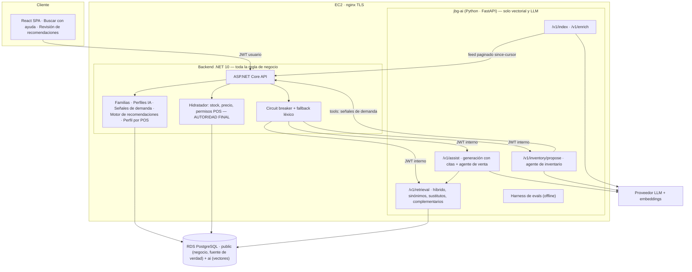

# Proyecto Final de Máster — Diseño del sistema de IA para Joiabagur PV

**Versión:** 3 — consenso tras la revisión de la [PR #4](https://github.com/skydr4g0n-it/joiabagur-pv/pull/4) y las [especificaciones funcionales v2](joiabagur-ia-especificaciones-funcionales-v2.md)
**Documento:** diseño conceptual + estrategia de datos + plan de ejecución
**Dominio:** Joiabagur PV (gestión de puntos de venta de joyería)
**Fecha de entrega del PF:** 3 de septiembre de 2026 — *sin margen asumido*
**Rama de entrega:** `finalproject-[INICIALES]` *(placeholder)*
**Equipo:** **2 desarrolladores**, ambos trabajando indistintamente en Python y .NET/frontend
**Descomposición ejecutable:** [proyecto-final-plan-changes-openspec.md](proyecto-final-plan-changes-openspec.md)

---

## 0. Resumen ejecutivo

Construimos un **buscador semántico de catálogo con venta asistida** para operadores de joyería, más un **agente de inventario que propone reposiciones y traslados con aprobación humana**, servidos por un microservicio RAG en Python sobre pgvector e integrados en el backend .NET existente.

### Qué cambia respecto a la versión anterior

La revisión del compañero es acertada en casi todo y **se acepta en bloque** la parte de modelo de datos y disciplina. Los cambios estructurales:

| Cambio | Origen |
|---|---|
| `material` → **`materials[]`** en todo el pipeline (extracción, filtros, `SourceText`, evaluación) | Revisión, decisión 3 |
| `variant_group_key` → **`ProductFamily` + `ProductFamilyMember`** como entidad explícita y editable | Revisión, decisión 2 |
| **No se persiste texto comercial generado por IA** en el perfil del producto: fuera `SalesPitchShort`, `OperatorHint`, `CareInstructions`, `SearchAliases` | Revisión, decisión 4 |
| **Revisión humana híbrida**: campos sensibles siempre revisados si son inferidos; tags comerciales auto-aprobables | Revisión, decisión 5 |
| **La proyección de inventario nunca excluye**: prefiltro blando + sobre-recuperación; .NET decide | Revisión, decisión 11 |
| **Toda regla de negocio vive en .NET.** Python solo hace lo que necesita el espacio vectorial y el LLM | Revisión, decisión 9 |
| **Entra inventario**: reposición, traslados, rotación/stock parado, sustitutos y aprobación manual | Revisión, decisión 6 |
| **Entra argumentario por POS** como perfil calculado periódicamente y almacenado estructurado | Revisión, decisión 7 |
| **Entran complementarios** por reglas + co-ocurrencia de ventas | Revisión, decisión 8 |

### Las tres decisiones que no acepto tal cual

Las dos primeras están **⏳ pendientes de acuerdo** y se cierran en conversación, no en este documento. Ambas van planteadas de forma que la discusión sea sobre el intercambio, no sobre el gusto.

1. **⏳ `SearchAliases` fuera, sí — pero hace falta un sustituto.** Sin alias, la rama léxica no encuentra "sortija" cuando el producto se llama "anillo". La solución no es persistir alias por producto (tiene razón: es texto IA por producto, con deriva), sino un **diccionario de sinónimos del dominio, único, curado a mano** (~40-60 entradas), aplicado en expansión de consulta. Cumple su principio y resuelve mejor el problema (§7.4).
   **Si no hay acuerdo:** se implementa igual **tras un flag**, se mide con la categoría de sinónimos del golden set y se decide con el número, no con el argumento. Coste de discrepancia: cero.
2. **⏳ Packing list fuera del PF.** Es el único punto de su "mínimo" que no acepto: es la única pieza del bloque de inventario con **cero contenido de IA**, tiene una máquina de 6 estados con auditoría y está *aguas abajo* de las recomendaciones aprobadas, así que aplazarla no bloquea nada. En su lugar entra una **vista imprimible de recomendaciones aprobadas agrupadas por POS**.
   **Si no hay acuerdo:** entra, cuesta **+1,5-2 changes en la ola 4**, que ya es la más cargada, y arrastra el corte de **complementarios y rotación** (puntos 1 y 2 de §13.4). El intercambio es ese, y es una decisión de producto legítima: packing list a cambio de complementarios y detección de stock parado.
3. **Upselling y downselling fuera.** El margen es calculable (`ProductComponentAssignment.CostPrice`/`SalePrice` existen), así que es viable técnicamente, pero es estrategia de precio sin datos que la validen antes del 3 de septiembre. Este no está en discusión.

### Restricciones que gobiernan el documento

**Tiempo:** quedan **4,4 semanas** (3 de agosto → 3 de septiembre). **Equipo: dos personas.** El alcance acordado son **39 changes** de 2-3 h, es decir **~4,4 changes por persona y semana** sostenidos durante mes y medio de agosto. Es un ritmo alto y conviene decirlo ahora: §13.4 fija el orden de corte **antes** de empezar, no cuando falle.

> **Alcance de la entrega (respuesta a la decisión 1):** esto es **Fase 1 completa + Fase 3 parcial** de las especificaciones v2. Packing list (Fase 4), liquidación con descuentos, upsell/downsell y políticas de inventario configurables quedan **explícitamente fuera** y documentadas como fase posterior.

---

## 1. Punto de partida verificado en el repositorio

| Área | Estado real | Implicación |
|---|---|---|
| Backend | .NET 10, capas Domain/Infrastructure/Application/API, EF Core, PostgreSQL, JWT, Serilog, 18 controllers | El servicio de IA se acopla por HTTP, no por código |
| Modelo de dominio | `Product`, `Collection`, `Inventory` (Product×POS), `InventoryMovement`, `Sale` (precio congelado), `PointOfSale`, `User`/`UserPointOfSale`, `Return`, `ProductPhoto` | Todas las señales del RAG y del inventario ya existen |
| **Margen por producto** | `ProductComponent` + `ProductComponentAssignment` (`CostPrice`, `SalePrice`, `Quantity`) y `ComponentReportService` | El margen **es calculable**. Habilita "prioridad comercial" como señal futura; fuera de este alcance por tiempo, no por imposibilidad |
| Búsqueda actual | `GET /api/products/search` → SKU exacto + nombre parcial, máx. 50, filtrado por POS asignados ([ProductsController.cs:92](../../backend/src/JoiabagurPV.API/Controllers/ProductsController.cs#L92)) | Es el **baseline v0-lexico** y el **fallback** |
| **Tienda central** | **No existe** como concepto: `PointOfSale` solo tiene Name, Code, Address, Phone, Email, IsActive, AllowManualPriceEdit | **Bloquea las reglas de reposición y traslado.** Ver pregunta abierta en §14 |
| IA existente | Reconocimiento **visual**: `ProductPhotoEmbedding` (MobileNetV2 1280d en JSON), TF.js en navegador | No se toca. Otro problema, otro espacio vectorial |
| pgvector | **No instalado** | Trabajo nuevo: extensión en RDS + esquema propio |
| Datos versionados | Solo admin y métodos de pago en el seeder. **Sin catálogo, inventario ni ventas** | Sin export real, el corpus es sintético. Ver §8 |
| Despliegue | EC2 + nginx + Docker + RDS + S3 + ECR + GitHub Actions OIDC. Producción viva en `pv.joiabagur.com` | Añadimos un contenedor |
| Metodología | OpenSpec en uso | El trabajo se entrega como *changes* |
| Frontend | React 19 + Vite + TS + Metronic, `src/pages/sales/` con flujo manual y `scan.tsx` | Punto de inserción del panel de búsqueda |

---

## 2. Análisis crítico de las especificaciones funcionales v2

La v2 corrige la mayoría de lo que criticaba la versión anterior de este documento: `Materials[]`, familias explícitas, sin textos comerciales persistidos, avisos por reglas. Lo que sigue es lo que **queda por resolver**.

### 2.1. Lo que la v2 resuelve bien y se adopta sin cambios

`Materials[]` como array · `ProductFamily`/`ProductFamilyMember` editable · avisos calculados por reglas y no persistidos · principio 2 (IA no es fuente de verdad de stock/precio) · principio 5 (control por POS) · `SourceHash` e idempotencia · versionado de embeddings · separación embeddings visuales/semánticos · matriz §7.3 de cuándo usar generativa, embeddings o reglas · `InventoryRecommendation` con estados y aprobación humana.

### 2.2. Lo que sigue sin resolverse en la v2

| Punto | Problema | Resolución adoptada |
|---|---|---|
| **Arquitectura §7.1** sigue colocando todo en .NET (`Application/AiCatalog`, `AiSalesAssist`, `AiInventory`) | Incompatible con el requisito del PF de implementar RAG en Python, y con el instrumental del máster (pgvector desde Python, RAGAS) | Frontera precisa en §6: **.NET conserva toda la regla de negocio** (incluido el motor de inventario), Python solo espacio vectorial y LLM |
| **Sin capa de evaluación.** La v2 tiene KPIs de negocio pero ninguna métrica de sistema | El PF exige evals objetivas; es criterio explícito de "destaca" | §11 como componente de primera clase |
| **Sin agentes.** La v2 los excluye ("agentes que modifiquen stock sin aprobación humana") | El PF los exige. La tensión es aparente: lo prohibido es **escribir** sin aprobación | Agentes con tools de **solo lectura** + HITL en toda escritura (§9) |
| **Eliminar `SearchAliases` sin sustituto** deja ciega la rama léxica ante sinónimos | "sortija", "aro", "gargantilla" no aparecen en el catálogo | Diccionario de sinónimos del dominio, curado, en expansión de consulta (§7.4) |
| **`ProductFamily` sin definir quién la crea** (decisión abierta 4 de la v2) | Crear ~350 familias a mano es inviable | **Flujo mixto**: la IA propone familias por similitud, el admin aprueba o edita (§7.5) |
| **Ranking §5.5 con 8 términos** | No hay datos para calibrar 8 pesos en 4 semanas | 4 señales calibradas contra el golden set; el resto documentado (§7.6) |
| **`ProductRecommendation` precomputada** para Similar/Complementary/Substitute | Precomputar similitud es caché prematura: el retriever la calcula en milisegundos | La tabla existe **solo para curación manual** (complementarios configurados por el admin). Similar y sustituto se calculan en línea |
| **Sin concepto de tienda central** pese a que las reglas de reposición lo asumen | `PointOfSale` no distingue tipos | Pregunta abierta §14. Mitigación provisional: campo `IsSupplySource` en POS |
| **KPIs de negocio no medibles** antes del 3 de septiembre | Requieren tráfico real y A/B | Se **instrumentan**, no se prometen números |

### 2.3. Veredicto

> **Adoptar la v2 como especificación funcional de referencia**, con la frontera arquitectónica de §6, la capa de evaluación de §11 y los agentes de §9 como adiciones exigidas por el Proyecto Final. El alcance entregable es Fase 1 completa + Fase 3 parcial.

---

## 3. Respuesta punto por punto a la revisión de la PR

| # | Decisión pedida | Postura | Justificación | Coste |
|---|---|---|---|---|
| 1 | Alcance de la entrega | **Fase 1 + Fase 3 parcial**, declarado explícitamente | Con 2 personas y 4,4 semanas, comprometer las 5 fases sería mentir | — |
| 2 | Modelo de variantes | **`ProductFamily` + `ProductFamilyMember`**. Acepto | Tiene razón: una clave textual generada por IA se rompe ("anillo-erizo-mar" vs "anillo-erizo-de-mar"), no la puede corregir un admin y falla justo en el caso que queremos evitar. Además la entidad hace implementable la alerta de "productos parecidos sin familia" | +2 changes |
| 3 | `materials[]` | Acepto. `text[]` en el índice, `MaterialsJson` en .NET, **vocabulario cerrado**, filtro por solape (`&&`) con índice GIN | Un producto es "plata con baño de oro". Con un solo valor, el filtro por material da falsos negativos | +0 (dentro del enriquecimiento) |
| 4 | Campos reaparecidos | Acepto eliminar los cuatro del perfil. **⏳ Contrapropuesta pendiente de acuerdo para los alias** (§7.4) y una precisión sobre cuidados (§7.7) | Persistir texto IA por producto genera deriva y datos no revisables. Pero el problema que resolvían los alias sigue existiendo | +1 change |
| 5 | Revisión humana | **Híbrido, como propone**: `piece_type`, `materials`, `stone_type`, `size_label` y familia siempre revisados **si son inferidos**; tags comerciales auto-aprobados con confianza alta | Es su propuesta y es mejor que la mía. Ver §7.8 para cómo se demuestra sin dejar el corpus vacío | +0 |
| 6 | Alcance mínimo de inventario | **Reposición + sustitutos + traslados + stock parado/rotación + aprobación manual. ⏳ Packing list fuera, pendiente de acuerdo** | Todo lo que acepto tiene contenido de IA o HITL demostrable. La packing list es CRUD con máquina de 6 estados y auditoría, cero IA, y está aguas abajo: aplazarla no bloquea nada. En su lugar, vista imprimible de recomendaciones aprobadas por POS. Si entra, sale complementarios y rotación | +6 changes (+2 si entra packing list) |
| 7 | Argumentario por hotel | **Perfil periódico calculado y almacenado estructurado**, como propone | Es la opción correcta: barata, verificable contra métricas y reutilizable por ranking, sustitutos y reposición | +1,5 changes |
| 8 | Complementarios | **Reglas + co-ocurrencia de ventas + tabla de curación manual.** Upsell/downsell fuera | Complementario ≠ similar: distinto `piece_type`, colores y estilos compatibles, banda de precio, y co-venta histórica. El margen existe pero validar upselling requiere datos de negocio que no tendremos | +1 change |
| 9 | Python vs .NET | **Permanente, con frontera estrecha**: Python solo embeddings, índice vectorial, recuperación, generación y bucle agéntico. **Toda regla de negocio, cálculo y persistencia de negocio en .NET** | Reduce a la mitad los riesgos que señala (duplicación, sincronización, migraciones). Si algún día se consolida en .NET, solo se mueve la capa de recuperación | — |
| 10 | Propiedad y sincronización | Contrato explícito en §6.3: propietario por dato, quién inicia, altas/bajas/desactivaciones con **tombstones**, detección de divergencia, reintentos, versionado | Faltaba en mi versión anterior. Tiene razón | +0 (va en los feeds) |
| 11 | Frescura del inventario | **Acepto, y es su mejor aportación técnica.** La proyección pasa a ser prior de ranking; se sobre-recupera y **.NET decide** | Mi versión podía descartar un producto válido antes de que .NET lo viera, sin posibilidad de recuperarlo. Ver §7.6 | +0 |
| 12 | Datos de evaluación | **Aceptado y resuelto: corpus híbrido.** Habrá export real, de tamaño probablemente insuficiente, ampliado con sintético. Cada documento lleva `data_origin: real \| synthetic` y **toda métrica se reporta desglosada** | Es la respuesta correcta a su objeción: el golden set se ancla en lo real, lo sintético solo aporta volumen y estrés. Sin el desglose, los productos sintéticos —más limpios— inflarían los números. Medir errores de selección reales exige usuarios: fuera de plazo | +0,5 change |

---

## 4. Alcance acordado

| # | Capacidad | Estado | Justificación |
|---|---|---|---|
| 1 | Enriquecimiento de catálogo (`materials[]`, vocabulario cerrado, confianza por campo, revisión híbrida) | **Núcleo** | Es la construcción del corpus |
| 2 | `ProductFamily` + `ProductFamilyMember`, con propuesta asistida y aprobación humana | **Núcleo** | Desambiguación de variantes: el caso de negocio crítico |
| 3 | Búsqueda semántica híbrida por POS (dos índices, sinónimos, prefiltro blando, abstención) | **Núcleo** | Corazón del PF |
| 4 | Venta asistida (agrupación por familia, avisos por reglas, citas) | **Núcleo** | Capa de generación con atribución verificable |
| 5 | Agente asistente de venta (tools de solo lectura, guardrails, HITL) | **Núcleo** | Requisito del PF |
| 6 | Sustitutos por falta de stock | **Núcleo** | Reutiliza el retriever |
| 7 | Complementarios por reglas + co-ocurrencia | **Acordado** | Decisión 8 de la revisión |
| 8 | Perfil comercial por POS, calculado periódicamente | **Acordado** | Decisión 7 |
| 9 | Agente de inventario: reposición, traslados, rotación/stock parado, con aprobación | **Acordado** | Decisión 6. Segundo agente + HITL: sirve al producto y al PF |
| 10 | Evaluación (golden set, ablations, validador anti-alucinación, escenarios de agente) | **Núcleo** | Requisito del PF |
| 11 | Vista imprimible de recomendaciones aprobadas por POS | **Acordado (reducido)** | Sustituye a la packing list completa |
| 12 | Packing list con máquina de 6 estados y auditoría | **Fuera — fase posterior** | Cero IA, aguas abajo, no bloquea nada |
| 13 | Liquidación con descuentos, `InventoryPolicy` configurable | **Fuera** | Toca precios; requiere decisión de negocio y auditoría propia |
| 14 | Upsell / downsell / prioridad comercial por margen | **Fuera** | Viable (el margen existe) pero sin datos para validarlo antes del 3/9 |
| 15 | Reranking cross-encoder | **No implementado, protocolizado** | Con ~1.500 vectores la hipótesis es que no compensa. Se documenta cómo se mediría |
| 16 | Reconocimiento visual, try-on, fine-tuning | **Fuera** | Ya existe (visual) o no aporta |

---

## 5. El problema de recuperación, bien planteado

- **No hay documentos largos que trocear.** Un producto es una entidad con ~15 atributos y 40-120 palabras. **Chunking = ninguno** en el índice de catálogo.
- **La consulta es corta, coloquial y de jerga mixta**, y mezcla intención semántica, restricciones duras (precio, talla, materiales, POS) y términos literales (SKU). **Búsqueda híbrida obligatoria**: lo semántico diluiría "ERIZO-M".
- **Con `SearchAliases` fuera, la rama léxica necesita ayuda externa**: un diccionario de sinónimos del dominio en expansión de consulta (§7.4).
- **El resultado no es prosa: es un conjunto ordenado de entidades** agrupadas por familia, más una explicación. La generación es la capa fina.
- **Sí hay un segundo corpus con forma de documento**: conocimiento comercial general (materiales y alergias, equivalencias de talla, guiones de venta, política de devoluciones) — **general, no por producto**, que es exactamente lo que la revisión pide evitar. Ese sí se trocea y es lo que permite citas verificables.

---

## 6. Arquitectura y frontera de responsabilidad

### 6.1. Vista general



### 6.2. Qué vive dónde (respuesta a la decisión 9)

| Responsabilidad | Servicio | Motivo |
|---|---|---|
| Catálogo, precios, POS, permisos, inventario, ventas | **.NET** | Fuente de verdad transaccional |
| `ProductAiProfile`, `ProductFamily`, `ProductFamilyMember`, `ProductRecommendation` (curación manual) | **.NET** | Datos de negocio revisables por humanos |
| **Señales de demanda** (`sales_7/30/60d`, cobertura, días sin venta, stock en otros POS) | **.NET, en SQL** | Cálculos deterministas sobre datos transaccionales. Un LLM aquí solo introduce error |
| **Motor de recomendaciones de inventario** (reglas de reposición, traslado, rotación) | **.NET** | Reglas de negocio auditables y testeables sin LLM |
| `InventoryRecommendation` y su ciclo de aprobación | **.NET** | Escritura sensible con auditoría |
| Perfil comercial por POS (métricas) | **.NET, en SQL** | Métricas calculadas; el LLM solo redacta el resumen |
| Embeddings, índice vectorial, recuperación híbrida, sustitutos, complementarios | **Python** | Es el espacio vectorial |
| Generación con citas, guardrails, bucles agénticos | **Python** | Es la capa LLM |
| Evaluación offline | **Python** | Instrumental del máster (RAGAS, harness) |

**Regla de una frase:** *Python calcula parecidos y redacta; .NET calcula números y decide.*

### 6.3. Contrato de sincronización (respuesta a la decisión 10)

| Aspecto | Regla |
|---|---|
| **Propiedad** | `public.*` y las tablas IA de negocio son de .NET. `ai.*` es de Python. Python **nunca** escribe en `public` ni lo lee por SQL |
| **Quién inicia** | Python **tira** (`pull`) de feeds HTTP paginados con cursor `since`. .NET **empuja** una invalidación cuando se aprueba un perfil o cambia una familia |
| **Altas y cambios** | Upsert idempotente por `product_id`, guiado por `source_hash`. Sin cambio de hash no se recalcula embedding |
| **Bajas y desactivaciones** | El feed emite **tombstones** (`{product_id, deleted_at \| deactivated_at}`). Un producto desactivado sale del índice en la siguiente sincronización, y además el hidratador lo descarta al instante |
| **Detección de divergencia** | `GET /v1/index/status` compara conteo y hash agregado del índice contra el del feed; expone `drift_count` y `last_full_sync_at`. Sincronización completa nocturna que reconcilia |
| **Reintentos** | Backoff exponencial con tope; un lote fallido no bloquea el resto; los fallos quedan en `ai.sync_failure` para reintento manual |
| **Versionado** | `embedding_model` + `embedding_version` por fila. Cambiar de modelo se hace en **columna nueva**, nunca sobrescribiendo |
| **Frescura de inventario** | La proyección se refresca cada 5-10 min y **nunca excluye** (§7.6) |

### 6.4. Seguridad y degradación

- El frontend nunca habla con Python. .NET → Python con **JWT interno de servicio** (HS256, TTL corto, secreto en SSM) que transporta `user_id`, `role`, `pos_id`, `trace_id`. Python valida y aplica ese scope; no confía en el body. Red interna Docker, puerto no publicado en nginx.
- Timeouts (0,8 s retrieval / 5 s assist), reintento único, circuit breaker con Polly. Si el circuito abre, .NET responde con el **buscador léxico existente** y `ai_available: false`. **El sistema nunca se cae por culpa de la IA.** Feature flag por POS.

---

## 7. Diseño del sistema RAG

### 7.1. Pipeline de enriquecimiento

```text
Producto (SKU, nombre, descripción, precio, colección)
  → normalización determinista (limpieza, unidades, tallas por regex)
  → extracción estructurada con LLM (JSON schema estricto, temperatura 0)
  → validación: esquema + vocabularios cerrados + coherencia
  → confianza POR CAMPO → enrutado híbrido de revisión (§7.8)
  → ProductAiProfile (.NET) + SourceText canónico + SourceHash
  → embedding solo si cambia SourceHash → ai.product_document
```

`materials` se extrae como **lista** contra vocabulario cerrado (plata, acero, baño de oro, oro, latón, resina, cuero, perla cultivada…). El extractor devuelve `[]` si no hay evidencia, nunca inventa un material por defecto — y `[]` con confianza baja enruta a revisión.

### 7.2. Esquema del índice (`ai`, pgvector)

```text
ai.product_document              -- 1 fila por producto, sin chunking
  product_id (uuid, PK)
  sku, name, collection_name, price, price_band
  piece_type, materials text[], stone_type, size_label
  family_id uuid nullable, family_name, variant_label
  color_tags[], style_tags[], occasion_tags[]
  doc_text text                  -- SourceText canónico
  source_hash char(64)
  embedding vector(1536)
  tsv tsvector                   -- to_tsvector('spanish', ...)
  is_active bool
  embedding_model, embedding_version, indexed_at

ai.knowledge_document / ai.knowledge_chunk   -- conocimiento GENERAL, no por producto
  doc_type: material | talla | guion_venta | politica | faq
  content, chunk_index, metadata jsonb, embedding vector(1536), tsv

ai.pos_projection                -- prior de ranking, NUNCA filtro excluyente
  pos_id, product_id, is_assigned_hint, qty_bucket (0 | 1-2 | 3+)
  sales_30d, sales_90d, last_sale_at, refreshed_at

ai.co_occurrence                 -- señal de complementarios
  product_a, product_b, co_sales_count, last_seen_at

ai.sync_failure, ai.query_log, ai.eval_run, ai.eval_case, ai.eval_result
```

Índices: **HNSW `vector_cosine_ops`** sobre ambos `embedding` (alineado con el operador `<=>`; desalinearlo desactiva el índice en silencio), **GIN** sobre `tsv`, sobre `metadata` y **sobre `materials`** (filtro por solape), B-tree sobre `family_id`, `piece_type`, `price_band`.

**`qty_bucket`, no cantidad exacta.** La proyección puede estar desfasada; guardar el número exacto invitaría a mostrarlo. Con un *bucket* solo puede usarse como señal de ranking. La cantidad real la pone .NET.

### 7.3. Filtro por materiales

Con `materials[]`, el filtro deja de ser igualdad y pasa a ser **solape**: "algo de plata" recupera productos cuyo array contiene `plata`, aunque también tengan `baño de oro`. Dos semánticas, elegidas por consulta:

- **Contiene alguno** (`materials && ARRAY['plata']`) — comportamiento por defecto, el que espera un operador.
- **Contiene todos** (`materials @> ARRAY['plata','baño de oro']`) — cuando la consulta nombra varios.

La normalización de sinónimos de material ("plata de ley", "925", "sterling" → `plata`) se hace en el **vocabulario cerrado** durante la extracción, no en consulta.

### 7.4. Diccionario de sinónimos (sustituto de `SearchAliases`)

**Problema:** sin alias por producto, la rama léxica no encuentra "sortija" para un producto llamado "anillo", ni "gargantilla" para "collar".

**Propuesta:** un fichero **único y curado a mano** en el repositorio, ~40-60 entradas, versionado y revisable:

```yaml
anillo:    [sortija, aro de dedo, alianza]
pendiente: [aro, arete, pendientes, criolla]
collar:    [gargantilla, cadena, colgante]
pulsera:   [brazalete, esclava]
dorado:    [oro, color oro, baño de oro, gold]
```

Se aplica en **expansión de consulta** ("sortija plata" busca también "anillo plata"), nunca en indexación, para no contaminar los documentos. Ventajas frente a alias por producto: una sola lista, cero generación por IA, cero deriva, corregible en un commit y aplicable a productos futuros sin reindexar. **Su efecto se mide**: el golden set tiene una categoría de consultas con sinónimos y se compara con y sin diccionario.

### 7.5. Familias: flujo mixto (respuesta a la decisión abierta 4 de la v2)

Crear ~350 familias a mano es inviable, y dejarlas a la IA es lo que la revisión rechaza con razón. El flujo acordado:

1. **La IA propone**: agrupa candidatos por similitud de embedding (umbral alto) + mismo `piece_type` + raíz común de nombre, y genera propuestas con miembros y etiquetas de variante detectadas.
2. **El admin aprueba, edita o rechaza** en una pantalla de revisión por lotes. Al aprobar se crean `ProductFamily` y `ProductFamilyMember` reales, en .NET.
3. **La familia es editable después** sin tocar nada de IA: es una entidad de negocio.
4. **Alerta de huérfanos**: productos con similitud alta a una familia existente pero sin pertenecer a ella se listan como incidencia de calidad.

Esto convierte la exigencia del compañero en un uso legítimo del índice que ya construimos, y es un segundo caso de HITL demostrable para el PF.

### 7.6. Recuperación: prefiltro blando y sobre-recuperación (respuesta a la decisión 11)

El orden importa, y cambia respecto a la versión anterior:

1. **Filtros duros — solo los que no pueden estar obsoletos.** El `pos_id` del solicitante viene del token, no de la proyección: eso sí es duro. Nada más se excluye en Python.
2. **Filtros estructurales de la consulta**: banda de precio, tipo de pieza, talla, materiales (solape). Extraídos **por reglas** (`menos de 80`, `talla M`, nombres del vocabulario de materiales) con *fallback* a consulta cruda.
3. **Búsqueda híbrida**: vectorial (`<=>` sobre HNSW) + léxica (`ts_rank` español + expansión de sinónimos + *boost* de SKU/nombre exacto), fusionadas con **RRF**.
4. **Prior de disponibilidad, no filtro**: `qty_bucket = 0` o `is_assigned_hint = false` **penalizan** el score; nunca eliminan al candidato.
5. **Sobre-recuperación**: Python devuelve `top_k × 3` candidatos (tope 60) para que .NET tenga margen tras descartar.
6. **.NET decide**: el hidratador aplica la verdad — producto activo, `Inventory.IsActive` real, stock, precio, permisos — descarta lo inválido y **trunca a `top_k`**. Si tras hidratar quedan menos de los pedidos, .NET puede repedir con `top_k` mayor.
7. **Threshold y abstención**: por debajo del umbral no se devuelve nada y se marca `low_confidence: true`. Devolver cero es información válida.
8. **Reranking cross-encoder**: no se implementa; se documenta la hipótesis y el protocolo (§11.2).

Con esto, un producto válido **no puede** desaparecer por una proyección desfasada: como mucho baja de posición, y .NET siempre lo ve.

### 7.7. Generación, avisos y citas

La respuesta es **estructurada**, no prosa libre:

- `groups[]`: candidatos agrupados por **`family_id`**, con `variant_label` destacado.
- `reason` por candidato: qué señales coincidieron, construido desde datos (tipo, materiales, color, disponibilidad), no inventado.
- `warnings[]`: **calculados por reglas**, no persistidos ni generados libremente — existen variantes en la familia, falta `size_label`, stock crítico, familia con miembros sin stock.
- `pitch`: argumentario **generado en tiempo de consulta** desde metadatos aprobados y, si aplica, chunks del corpus de conocimiento con `citations[]`. **No se persiste.**
- `clarification_question` si la consulta es ambigua.

**Sobre los cuidados**: se elimina `CareInstructions` como atributo del producto, de acuerdo. Pero el conocimiento sobre cuidados **sí existe** en el corpus general (`doc_type: material`), donde es una ficha por material y no por producto — cumple el principio de la revisión y permite responder "¿este anillo se puede mojar?" con cita verificable.

**Toda cifra de precio o stock se emite como placeholder** (`{{price}}`, `{{stock}}`) que el modelo no puede rellenar; .NET los sustituye al hidratar y **rechaza la respuesta** si alguno queda sin resolver.

### 7.8. Revisión humana híbrida (respuesta a la decisión 5)

| Campo | Política |
|---|---|
| `piece_type`, `materials`, `stone_type`, `size_label`, pertenencia a familia | **Revisión obligatoria si el valor es inferido.** Si viene de un dato estructurado existente o de una regla determinista (regex de talla), se marca `source: rule` y no requiere revisión |
| `color_tags`, `style_tags`, `occasion_tags` | **Auto-aprobación** si la confianza supera el umbral; a revisión si no |
| Cualquier campo con confianza bajo umbral | Revisión |

**El problema operativo, dicho abiertamente:** con ~1.000 productos, "revisar todos los campos sensibles inferidos" son horas de trabajo humano que no tenemos antes del 3 de septiembre, y si solo se indexan perfiles aprobados el corpus queda vacío y no hay demo.

**Cómo se resuelve sin hacer trampa:** dos vías declaradas y distinguibles en los datos.

- **Vía revisada**: un lote de 120-150 productos pasa por la pantalla de revisión de verdad, cronometrado. De ahí sale un dato que va al README: **tiempo medio de revisión por producto y tasa de corrección real del extractor**. Es la evidencia de que el mecanismo funciona y de cuánto cuesta.
- **Vía masiva**: el resto se marca `review_state = auto_bulk`, se indexa y se distingue en toda métrica. El README dice explícitamente qué porcentaje del corpus está revisado por humanos.

Ningún número de evaluación mezcla ambas vías sin decirlo.

---

## 8. Datos

### 8.1. Datos reales y su dependencia

| Fuente | Disponibilidad | Uso |
|---|---|---|
| Modelo de datos y semántica de negocio | **Real y verificado** | Define esquemas, filtros, permisos, reglas |
| **Catálogo real e histórico de ventas 2026 anonimizado** | **Confirmado, de tamaño desconocido** | Núcleo del corpus y **ancla del golden set**. Se amplía con sintético hasta alcanzar volumen |
| Textos comerciales de la joyería (materiales, garantía, tallas) | A pedir al negocio | Semilla del corpus de conocimiento |
| Fotos de producto | Reales si hay export | No se usan (el índice visual ya existe y es otro problema) |

### 8.1.1. Corpus híbrido: cómo se combinan real y sintético

El export real llegará pero probablemente no dé el volumen necesario. La combinación no es "mezclar y olvidar": tiene tres reglas que protegen la validez de la evaluación.

1. **Todo documento lleva `data_origin: real | synthetic`**, tanto en `ai.product_document` como en el golden set. Es una columna, no un comentario.
2. **El generador sintético se calibra con lo real, no al revés.** Del export se extraen distribución de precios, longitud típica de descripción, convenciones de SKU, mezcla de materiales y tamaño medio de familia; el generador reproduce esas distribuciones. Así el sintético no es "más fácil" por accidente de estilo.
3. **Toda métrica se reporta desglosada: real, sintético y global.** Es la regla que evita el autoengaño. Los productos sintéticos son más limpios y regulares; si el Recall@5 global sale bien pero el de la porción real sale mal, el sistema no sirve y hay que verlo. **El número que va al README como resultado principal es el de la porción real.**

Y una regla sobre el golden set: **se etiqueta primero sobre productos reales** y solo se completa con sintéticos si no hay material suficiente para cubrir las 9 categorías. Si el export trae, por ejemplo, 200 productos, esos 200 sostienen la mayor parte de las 60-70 consultas.

**Postura:** el sistema funciona con cualquiera de los dos extremos; el diseño no depende del tamaño del export, solo la fuerza de la evidencia.

### 8.2. Estrategia: mundo determinista, texto con IA

- **LLM → lo textual y semántico**: nombres, descripciones, corpus de conocimiento, consultas de operador.
- **Código determinista con semilla → lo numérico y relacional**: red de POS, propensión producto×POS, simulación de ventas (Poisson con estacionalidad y perfil por hotel), inventario, movimientos, co-ocurrencia.

El histórico así generado es **coherente por construcción** con catálogo y stock, que es lo que necesitan rotación, sustitutos, complementarios, perfil por POS y reposición.

### 8.3. Datasets

| # | Dataset | Volumen | Novedades v3 | Alimenta |
|---|---|---|---|---|
| D0 | **Catálogo real anonimizado** | Desconocido | **Ancla del corpus y del golden set**; calibra las distribuciones de D1 | Índice, evaluación |
| D1 | Catálogo sintético | Hasta completar 900-1.200 con D0, ~350 familias | **`materials[]` multivalor** (~35 % con 2+ materiales); distribuciones calibradas con D0 | Índice |
| D2 | Perfiles IA | = D1 | `materials[]`, confianza por campo, `source: rule\|inferred` | Filtros, revisión |
| D3 | `SourceText` + embeddings | = D1 | Incluye familia y variante | Búsqueda vectorial |
| D4 | Familias | ~350 | **`ProductFamily` + miembros**, con 15 % de huérfanos deliberados | Desambiguación, alerta de calidad |
| D5 | Corpus de conocimiento | 30-45 docs → 150-250 chunks | Fichas **por material**, no por producto | Citas, faithfulness |
| D6 | Red de POS | 10-14 | **Marca de origen de suministro** (§14) | Filtros, perfil, reposición |
| D7 | Inventario por POS | 5.000-9.000 filas | — | Prior de ranking, sustitutos |
| D8 | Histórico de ventas | 15.000-25.000 / 14-18 meses | **Co-ocurrencia por operación de venta** | Rotación, perfil POS, complementarios, reposición |
| D9 | Diccionario de sinónimos | 40-60 entradas | **Nuevo**, curado a mano | Rama léxica |
| D10 | Consultas de operador | 300-400 | Categorías de sinónimos y multi-material | Calibración |
| D11 | **Golden set** | 60-70 etiquetadas a mano por ambos | + categorías sinónimo y materiales múltiples; **prioridad a productos reales**, con `data_origin` por caso | Métricas de recuperación |
| D12 | Casos adversarios | 20-25 | — | Guardrails |
| D13 | Escenarios de agente | 20-25 (venta) + 8-10 (inventario) | **Nuevo**: escenarios de inventario | Eval de agentes |

**Índice vectorial total: ~1.200-1.500 vectores.** Pequeño, y conviene decirlo: pgvector con HNSW es holgado aquí; la decisión se justifica por operación (una sola base de datos, filtros SQL nativos, cero infraestructura nueva), no por escala.

### 8.4. Realismo dirigido

Familias confundibles (3-5 variantes con diferencia solo de talla) · ~30 % de descripciones pobres · 3-4 convenciones de SKU mezcladas · **~35 % de productos multi-material** · **15 % de productos huérfanos de familia** para probar la alerta · colisiones semánticas verificadas (ningún par > 0,97 coseno) · consultas con faltas, abreviaturas y sinónimos · estacionalidad por hotel.

### 8.5. Calidad, privacidad y trazabilidad

- **Puertas de calidad** antes de indexar: unicidad de SKU, vocabulario cerrado respetado, `materials` no vacío salvo justificación, cobertura de tags ≥ 90 %, sin colisiones, sin obligatorios vacíos. Falla la puerta → falla el pipeline.
- **PII**: el modelo **no almacena datos de cliente final** (`Sale` no tiene cliente). Los únicos datos personales son de operadores: ficticios en sintético, anonimizados antes de salir de producción si hay export. Ningún dato personal entra en el índice ni en un prompt.
- **Trazabilidad**: cada dataset lleva `generator_version`, `seed`, `model`, `generated_at`; el corpus se regenera con un comando.

---

## 9. Capa agéntica

### 9.1. Dos agentes, ninguno escribe

| Agente | Qué decide | Tools (todas de lectura) | Salida |
|---|---|---|---|
| **Asistente de venta** (síncrono) | Si buscar, si pedir aclaración, si pivotar a sustitutos o variantes, si consultar conocimiento | `buscar_catalogo`, `consultar_disponibilidad` (.NET), `listar_familia`, `buscar_sustitutos`, `buscar_complementarios`, `consultar_conocimiento`, `perfil_punto_venta`, `pedir_aclaracion` | Resultados estructurados + borrador de venta que confirma el operador |
| **Agente de inventario** (batch) | Qué priorizar, qué sustituto proponer cuando no hay stock, cómo redactar el motivo | `senales_demanda` (.NET, SQL), `stock_por_pos` (.NET), `buscar_sustitutos`, `perfil_punto_venta` | `InventoryRecommendation` en estado **`Proposed`**; el admin aprueba |

**Los números nunca los calcula el LLM.** Las señales de demanda y las reglas de reposición son SQL en .NET; el agente prioriza, elige sustituto y redacta el motivo. Es exactamente la matriz §7.3 de las especificaciones v2.

### 9.2. Control del bucle y HITL

- Presupuesto duro: 5 iteraciones y 6 llamadas a tools por consulta; superado, responde con lo que tenga y marca `partial: true`.
- **Ninguna tool escribe.** La única acción con efecto en venta es "seleccionar para venta", que devuelve un borrador confirmado por el operador en el flujo existente. En inventario, toda recomendación nace `Proposed` y requiere aprobación explícita del admin.
- Orquestación: bucle manual con function calling. No se adopta LangGraph: no hay ramificación con estado ni reanudación que lo justifique. El punto de migración queda identificado.

---

## 10. Inventario asistido (alcance acordado)

### 10.1. Señales de demanda — .NET, en SQL

Por producto y POS: `sales_7d`, `sales_30d`, `sales_60d`, `current_stock`, `stock_in_other_pos`, `days_since_last_sale`, `avg_daily_sales_30d`, `estimated_days_to_stockout`, `is_top_seller_in_pos`. Deterministas, testeables sin LLM y reutilizadas por el ranking de búsqueda.

### 10.2. Reglas iniciales

| Tipo | Regla | Salida |
|---|---|---|
| `Replenish` | `current_stock = 0` y `sales_30d > 0` → prioridad alta; `estimated_days_to_stockout < 14` y `sales_30d ≥ 2` → media/alta | Producto, POS destino, cantidad, origen sugerido |
| `Transfer` | Destino con stock 0 y `sales_30d ≥ 2`; origen con stock ≥ 3 y `sales_60d = 0` | Origen, destino, cantidad |
| `Substitute` | Reposición no satisfacible por falta de stock global | Sustitutos del retriever con señales de similitud |
| `Rotate` | `stock > 0` y `days_since_last_sale > 90` → stock parado; si otro POS vende, sugerir traslado | POS destino sugerido |
| `Review` | Sin ventas y perfil IA incompleto | Revisar catálogo antes de decidir |

`Liquidate` **no se implementa**: toca precios y exige decisión de negocio y auditoría propias.

### 10.3. Perfil comercial por POS (decisión 7)

Calculado periódicamente en .NET desde ventas e inventario: `top_piece_types`, `top_materials`, `top_price_ranges`, `top_collections`, `average_ticket`, `best_selling`, `slow_moving`. Se almacena estructurado y el LLM **solo redacta el resumen a partir de esas métricas**, con un test que verifica que no menciona nada ausente del payload. Se consume en tres sitios: prior de ranking en búsqueda, priorización de sustitutos y ajuste de cantidades en reposición.

### 10.4. Aprobación y salida física

Pantalla de revisión con aprobar/rechazar por recomendación, señales visibles y motivo. Desde las aprobadas, **vista imprimible agrupada por POS destino** con SKU, nombre, foto, cantidad, origen y motivo — el 80 % del valor operativo de una packing list sin su máquina de estados. La packing list completa (Draft→Approved→Prepared→Delivered→Applied→Cancelled con auditoría) queda para fase posterior.

---

## 11. Evaluación

### 11.1. Golden set

**60-70 consultas** etiquetadas a mano **por las dos personas por separado, con conciliación de discrepancias**, con relevancia graduada (0/1/2) sobre un *pool* generado por la unión de todas las configuraciones (*pooling*).

| Categoría | Nº | Qué mide |
|---|---:|---|
| Descripción natural | 20 | Recuperación semántica pura |
| Variante / talla (familia) | 10 | Desambiguación: el caso crítico |
| **Materiales (incl. multi-material)** | 8 | Filtro por solape sobre `materials[]` |
| **Sinónimos** | 6 | Diccionario de expansión |
| Precio / ocasión / regalo | 8 | Filtros estructurales |
| Sustituto / sin stock | 6 | Retriever invertido |
| Léxico exacto (SKU, nombre) | 5 | Rama léxica |
| Ambigua → requiere aclaración | 5 | Decisión del agente |
| Fuera de dominio / imposible | 5 | Abstención y guardrails |

### 11.2. Ablations

| Config | Descripción |
|---|---|
| **v0-lexico** | Buscador actual del repo — **es la comparación "búsqueda actual vs semántica" que pide la decisión 12** |
| **v0-cag** | Catálogo del POS entero en contexto, sin retrieval |
| **v1-vectorial** | Solo pgvector + threshold |
| **v2-hibrido** | Vectorial + léxico (RRF) + **sinónimos** + filtros estructurales |
| **v3-señales** | v2 + disponibilidad, rotación y perfil de POS, con pesos calibrados |

Métricas: Recall@5, nDCG@5, MRR, P@3, abstención correcta, % sin resultado, p50/p95 y coste por consulta. Aceptación de v3: Recall@5 ≥ 0,85 en las tres primeras categorías; nDCG@5 ≥ 0,75; abstención correcta ≥ 0,80; p95 de retrieval < 500 ms.

**Cada métrica se reporta tres veces: sobre la porción real, sobre la sintética y global** (§8.1.1). El umbral de aceptación se aplica a **la porción real**; si el global cumple y el real no, la conclusión es que el corpus sintético es demasiado fácil, no que el sistema funcione.

> **Añadido el 2026-08-10, al diseñar C04.** Esta tabla es offline, sobre el golden set. Al decidir que `ProductSearchEvent` registre también las búsquedas **degradadas** —las que responde el buscador léxico existente cuando el circuito abre, §6.4— aparece de regalo una comparación **online** entre `v0-lexico` y la configuración en producción: mismo operador, mismas consultas reales, dos rutas distinguidas por la columna `SearchOrigin`. No sustituye a la tabla —no hay relevancia etiquetada— pero sí aporta lo que ninguna ablación offline puede: qué elige de verdad una persona con un cliente delante. El `p95` de recuperación queda además medido en producción y no solo en el harness, gracias a `RetrievalMs`. Sin esa columna, además, un periodo con el cortacircuitos abriéndose se leería como una degradación del ranking cuando la IA sencillamente no corrió.

**Reranking:** no se implementa. El README documenta la hipótesis (con ~1.500 entidades el cuello de botella es el corpus y el filtrado, no el orden dentro del top-20), el protocolo con el que se mediría (dos filas más en esta tabla, delta de nDCG@5 contra delta de p95) y el criterio de decisión.

### 11.3. Generación

- **Validador anti-alucinación determinista** (sin LLM juez): extrae toda cifra de precio/stock de la respuesta final y la contrasta con el hidratador. **Umbral: 0 fallos.** Es la pieza de evaluación con mejor retorno y convierte el principio 2 en garantía verificable.
- **RAGAS** (faithfulness, answer relevancy, context precision, context recall) sobre el subconjunto con citas.
- **Verificación de citas**: toda afirmación del corpus apunta a un `chunk_id` existente y realmente recuperado.
- **Test de fidelidad del perfil por POS**: el resumen no menciona métricas ausentes del payload.

### 11.4. Agentes

20-25 escenarios multi-turno de venta y 8-10 de inventario, con éxito definido. Métricas: *task success rate*, tools invocadas vs esperadas, pasos, coste medio, tasa de escalado. Más 20-25 casos adversarios con criterio de bloqueo por categoría.

### 11.5. Métricas del enriquecimiento

Del lote revisado a mano (§7.8): **tasa de corrección por campo** (cuántos `materials`, `piece_type`, `size_label` inferidos corrigió el humano) y **tiempo medio de revisión**. Son los números que dicen si el extractor sirve, y no existen sin la vía revisada.

### 11.6. Iteración de prompts

Prompts versionados en `ai-service/prompts/`; cada versión guarda su ejecución del harness. El README muestra qué se cambió y qué métrica se movió.

---

## 12. Despliegue

Se hace en la **ola 2**, no al final: con dos personas, descubrir un problema de infraestructura el 30 de agosto es fatal.

1. `docker-compose` gana el servicio `jbg-ai` en red interna de la EC2, **no publicado en nginx**.
2. RDS: `CREATE EXTENSION vector`, esquema `ai`, usuario propio. Alembic, independiente de EF Core. **Verificar que RDS lo admite en la ola 0.**
3. Secretos en SSM Parameter Store.
4. Workflow `deploy-ai-service.yml` con el patrón OIDC + ECR existente.
5. `/health` con conectividad a BD, proveedor y estado del índice; tarjeta en el dashboard de admin.
6. **Evidencia**: URL pública con usuario demo, vídeo de 2-3 min y `docker compose up` reproducible con corpus incluido.

**Coste estimado**: decenas de euros con modelo de embeddings pequeño y generación económica; instrumentado y reportado.

---

## 13. Plan de trabajo (3 agosto → 3 septiembre 2026)

### 13.1. Modelo de trabajo

**Sin roles fijos.** Las dos personas trabajan indistintamente en Python y .NET/frontend y **toman el siguiente change desbloqueado** de la ruta crítica. El detalle, con prerequisitos y ruta crítica marcada, está en [proyecto-final-plan-changes-openspec.md](proyecto-final-plan-changes-openspec.md).

Tres reglas que sustituyen a la coordinación por roles:

1. **Prioridad a la ruta crítica.** Si hay un change de ruta crítica libre, se coge ese antes que cualquier otro.
2. **Una sola migración EF Core activa a la vez.** Quien la abre lo anuncia y la mergea antes de que empiece otra.
3. **Contratos congelados el día 2** con test de *snapshot* de OpenAPI: cambiar el contrato rompe el build y se negocia, en vez de filtrarse.

### 13.2. Olas

| Ola | Fechas | Objetivo | Hito verificable |
|---|---|---|---|
| **O0** | 3-5 ago | Cimientos y **contratos congelados**. Esqueleto del servicio, cliente .NET con circuit breaker, verificación de pgvector en RDS | `GET /health` responde; nadie espera a nadie |
| **O1** | 6-12 ago | **Datos y modelo.** Generador de catálogo con `materials[]`, familias, enriquecimiento, esquema `ai`, entidades .NET (`ProductAiProfile`, `ProductFamily`), feeds con tombstones | ~1.000 perfiles generados y validados; familias propuestas |
| **O2** | 13-19 ago | **Slice vertical desplegado.** Indexador, recuperación, endpoint .NET con hidratación autoritativa, panel en la SPA, **servicio en producción** | Un operador busca en lenguaje natural desde `pv.joiabagur.com` con stock real |
| **O3** | 20-26 ago | **Calidad y medición.** Híbrido + sinónimos, prior de disponibilidad, corpus de conocimiento, **golden set (ambos)**, baselines, señales de negocio, sustitutos y complementarios | **Tabla de ablations v0→v3 con números reales** |
| **O4** | 27-31 ago | **Agentes e inventario.** Generación con citas y avisos por reglas, guardrails, agente de venta, señales de demanda, motor de recomendaciones, agente de inventario, pantallas de revisión, evals finales | Flujo completo en producción; validador anti-alucinación en verde; recomendaciones aprobables |
| **O5** | 1-3 sep | **Congelación.** README, diagramas, limitaciones, vídeo, tag, entrega | Entrega el 3 de septiembre |

### 13.3. Carga real

39 changes en 4,4 semanas entre 2 personas = **~4,4 changes por persona y semana**, unos 10-13 h semanales cada uno. Es sostenible solo si se empieza el 3 de agosto y no se acumula deuda. La ola 4 concentra agentes e inventario y es la más expuesta.

### 13.4. Orden de corte, fijado de antemano

Si el **26 de agosto** (fin de O3) no está la tabla de ablations y el sistema desplegado, se abandona en este orden:

1. **Complementarios** → se documenta como fase posterior; sustitutos ya cubren el caso de venta
2. **Rotación / stock parado** → el motor queda, se cae el tipo de recomendación
3. **RAGAS** → se conservan validador anti-alucinación y métricas de recuperación
4. **Traslados** → se conserva solo reposición
5. **Vista imprimible** → se aprueba desde la pantalla de revisión y se exporta a CSV
6. **Corpus de conocimiento** 30-45 → 15 documentos, manteniendo las citas
7. **Golden set** 70 → 45 consultas, **nunca renunciando al doble etiquetado**
8. **Agente de inventario** → las recomendaciones se generan por reglas puras sin capa agéntica ni redacción LLM

**Nunca se recorta:** corpus e índice, familias, retriever híbrido con prefiltro blando, hidratación autoritativa en .NET, agente de venta, harness con ablations, validador anti-alucinación, despliegue y README.

### 13.5. Riesgos

| Riesgo | Prob. | Impacto | Mitigación |
|---|---|---|---|
| **Equipo de dos sin holgura**: una baja de una semana se lleva el 25 % de la capacidad | Media | **Muy alto** | Slice vertical desplegado en O2; orden de corte fijado; ningún change bloquea a más de dos |
| **El alcance de inventario desborda la ola 4** | **Alta** | Alto | Las reglas y señales se entregan antes que el agente; si el agente no llega, las recomendaciones se generan por reglas y se documenta |
| **El export real llega tarde o es muy pequeño** | Media | Medio | El generador se calibra con lo que haya; si el export llega después de C24, el golden set se re-ancla sobre productos reales en una sesión adicional. Nunca se bloquea el desarrollo esperándolo |
| La revisión humana de 120-150 perfiles se alarga | Media | Medio | Pantalla de revisión por lotes con atajos; tope de 3 h por persona; el resto va a `auto_bulk` declarado |
| Datos sintéticos demasiado fáciles → métricas infladas | Alta | Alto | Ruido dirigido (§8.4); etiqueta el golden set quien no generó el corpus |
| Agosto: disponibilidad irregular | Alta | Alto | Contratos congelados en O0; trabajo desacoplado; pool de changes sin espera por rol |
| Fricción con pgvector en RDS | Baja | Alto | **Verificar en O0**; alternativa: contenedor Postgres+pgvector en la misma EC2 |

---

## 14. Preguntas abiertas que bloquean trabajo

| # | Pregunta | Estado | Resolución |
|---|---|---|---|
| 1 | **¿Existe una "tienda central" u origen de suministro?** | ✅ **Resuelto** | Sí. Se añade **`IsSupplySource bool` a `PointOfSale`** (una columna, migración en C19). Desbloquea las reglas de reposición y traslado de §10.2 |
| 2 | **¿Habrá export anonimizado de catálogo e histórico 2026?** | ✅ **Resuelto** | Sí, de tamaño desconocido y probablemente insuficiente. **Corpus híbrido** con `data_origin` y métricas desglosadas (§8.1.1). El golden set se ancla en lo real |
| 3 | **¿Diccionario de sinónimos en lugar de `SearchAliases`?** | ⏳ **Pendiente de acuerdo** | Se implementa tras flag y se decide con la categoría de sinónimos del golden set. Coste de discrepancia: cero |
| 4 | **¿Packing list fuera del PF?** | ⏳ **Pendiente de acuerdo** | Fuera, con vista imprimible en su lugar. Si entra: +1,5-2 changes en la ola 4 y salen complementarios y rotación |
| 5 | **Umbrales iniciales de reposición** (días de cobertura, mínimo por POS) | 🔹 No bloqueante | Configurables con valores por defecto: cobertura < 14 días, `sales_30d ≥ 2`. Se recalibran con datos |
| 6 | **¿Se captura feedback del admin sobre sustitutos?** | 🔹 No bloqueante | Se registra aceptado/rechazado en la recomendación; no se usa para reentrenar en esta fase |
| 7 | **¿Qué tamaño tiene el export real?** | 🔸 **A verificar antes del 10 de agosto** | Determina cuántas de las 60-70 consultas del golden set se pueden anclar en productos reales y cuánto sintético hay que generar. No cambia el diseño, sí la fuerza de la evidencia |

---

## 15. Limitaciones que el README debe declarar

1. **El corpus es híbrido**: una porción real anonimizada, ampliada con datos sintéticos calibrados sobre ella. El README declara el porcentaje exacto de cada origen y **reporta las métricas desglosadas**, con la porción real como resultado principal.
2. **Solo el 12-15 % de los perfiles está revisado por humanos**; el resto es `auto_bulk` y está marcado como tal en todas las métricas.
3. **No hay validación con usuarios reales.** Los KPIs de negocio están instrumentados, no medidos.
4. **El golden set es pequeño (60-70) y hecho por el equipo.** Mitigado con *pooling* y doble etiquetado, no eliminado.
5. **El reranking no se ha medido**, solo argumentado y protocolizado.
6. **Packing list, liquidación con descuentos, upsell/downsell y políticas de inventario configurables no están implementados** y se declaran como fase posterior.
7. **Dos espacios vectoriales conviven** (visual MobileNetV2 y textual): no se fusionan.
8. **Ningún agente escribe.** Toda acción con efecto pasa por el operador o el admin.
9. **La proyección de disponibilidad puede desfasarse minutos**; por eso solo pondera el ranking y nunca excluye.
10. **La telemetría de búsqueda no tiene política de retención** *(añadido el 2026-08-10, al diseñar C04)*. `ProductSearchEvent.SearchText` es texto libre escrito por un operador y se conserva indefinidamente; en un punto de venta de hotel puede recoger incidentalmente una referencia a un huésped. Las medidas adoptadas son proporcionadas al riesgo real —tope de 500 caracteres, el texto confinado a nivel `Debug` en los logs, y **ninguna ruta de lectura por API**: solo se consulta con SQL—, y no se aplica anonimización porque este texto nunca entra en el espacio vectorial ni se recupera semánticamente. La supresión por usuario queda operable: el enlace `Sale.SearchEventId` es `ON DELETE SET NULL`, así que borrar eventos no destruye ni bloquea ventas.

**Próximos pasos:** packing list completa; liquidación y políticas de inventario; prioridad comercial por margen (los datos existen en `ProductComponentAssignment`); reranking medido; reranking aprendido con `ProductSearchEvent` reales; fusión de señal visual y textual; evaluación online con A/B por POS.

---

## 16. Checklist de entrega

- [ ] Rama `finalproject-[INICIALES]` con README y código funcional
- [ ] README con dominio, arquitectura y decisiones justificadas, CAG/RAG/agentes/evaluación/despliegue, arranque local, **los dos integrantes**, limitaciones y próximos pasos
- [ ] URL pública con usuario demo **y** vídeo de 2-3 min
- [ ] Tabla de ablations v0→v3 reproducible con un comando
- [ ] Métricas de revisión humana del enriquecimiento (tasa de corrección y tiempo medio)
- [ ] Prompts versionados con evidencia de iteración
- [ ] `docker compose up` reproducible con corpus sintético
- [ ] Tag `v1.0-final-[INICIALES]`
- [ ] Acceso al TA si el repositorio es privado
- [ ] Entrega antes del **3 de septiembre de 2026**
