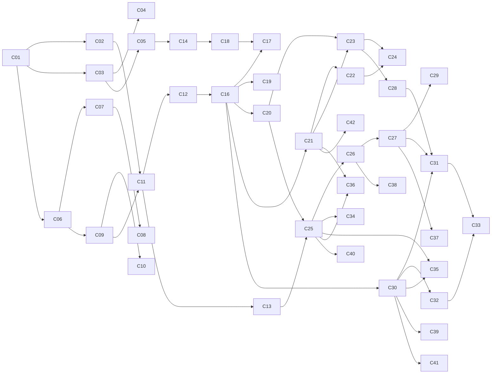

> ⚠️ **VARIANTE PARA EQUIPO DE 3 DESARROLLADORES — NO ES EL PLAN VIGENTE.**
> El documento a seguir es [proyecto-final-plan-changes-openspec.md](proyecto-final-plan-changes-openspec.md), dimensionado para **2 desarrolladores** (29 changes).
> Esta variante se conserva por si el equipo creciera a tres personas. Su documento de diseño es [proyecto-final-diseno-rag-joiabagur-3devs.md](proyecto-final-diseno-rag-joiabagur-3devs.md).
> **Diferencias principales frente al plan vigente:** 43 changes en vez de 29, tres roles (R1 RAG/Python · R2 Backend/Integración · R3 Datos/Evaluación), despliegue en la ola 4 en vez de la 2, y bloques adicionales que en el plan de 2 personas están fuera de alcance: reranking medido (C24), argumentario por POS como servicio (C34), `AiUsageLog` como entidad .NET (C39), caché semántico (C40), trazado con LangSmith/Logfire (C29) y agente de reposición (C44-C47).

---

# Proyecto Final — Descomposición en changes OpenSpec

**Documento hermano de:** [proyecto-final-diseno-rag-joiabagur-3devs.md](proyecto-final-diseno-rag-joiabagur-3devs.md)
**Ventana de ejecución:** 1 de agosto → 3 de septiembre de 2026
**Equipo de referencia:** 3 desarrolladores (R1 RAG/Python · R2 Backend/Integración · R3 Datos/Evaluación)
**Total:** 43 changes (35 núcleo + 8 opcionales con línea de corte)

---

## 1. Cómo se usa este documento

Cada entrada es **un change OpenSpec completo**, ejecutable de principio a fin en **una sesión de 2-3 horas**, siguiendo el ciclo del repositorio:

```text
/opsx:propose (proposal.md · design.md · tasks.md · specs/<capability>/spec.md)
  → /opsx:apply  (código + tests)
  → /opsx:verify (build + tests verdes + revisión de alcance)
  → /opsx:archive (openspec/changes/archive/YYYY-MM-DD-<change-id>/)
```

**Definition of Done común a los 43 changes** (no se repite en cada ficha):

- [ ] Artefactos OpenSpec creados y `openspec validate` en verde
- [ ] Código aplicado, `dotnet build` / `uv run pytest` / `npm run build` sin errores
- [ ] **Tests unitarios nuevos, verdes**, con la nomenclatura de la zona (§3)
- [ ] Tests existentes sin regresión
- [ ] Documentación afectada actualizada (`Documentos/`, `docs/`, README del servicio)
- [ ] Change archivado el mismo día

**Reglas transversales de testing** (aplican a todos):

- **Ninguna llamada real a un LLM ni a un proveedor de embeddings en tests unitarios.** Fakes inyectados + fixtures grabadas en `ai-service/tests/fixtures/`.
- Los tests que necesiten PostgreSQL usan Testcontainers (.NET, ya en uso) o `pytest-postgresql`/contenedor efímero con pgvector (Python).
- Generadores de datos: tests de **propiedades** (invariantes), no de valores concretos — la semilla fija hace el resto.
- Cobertura mínima esperada por change: la lógica nueva de dominio/servicio, no los DTOs.

---

## 2. Convenciones de nomenclatura

| Elemento | Convención | Ejemplo |
|---|---|---|
| ID de change | kebab-case, verbo primero | `add-vector-retrieval-endpoint` |
| Etiqueta de orden | `C01`…`C43` (solo en este documento) | `C16` |
| Capability OpenSpec | kebab-case, nueva o existente | `ai-retrieval`, `product-management` |
| Test .NET | `Method_Scenario_ExpectedResult` | `Search_WithPosFilter_ExcludesUnassigned` |
| Test frontend | `should [behavior] when [condition]` | `should show variant warning when family has siblings` |
| Test Python | `test_<unidad>_<escenario>_<esperado>` | `test_rrf_fuses_ranked_lists_preserving_top_hit` |

---

## 3. Zonas de código (base de la paralelización)

Dos changes son **paralelizables** si (a) ninguno es prerequisito del otro y (b) sus zonas de código no se solapan.

| Zona | Ruta | Dueño habitual |
|---|---|---|
| `PY-CORE` | `ai-service/src/jbg_ai/api/`, `config/` | R1 |
| `PY-DATA` | `ai-service/src/jbg_ai/data/generators/` | R3 |
| `PY-ENRICH` | `ai-service/src/jbg_ai/enrichment/` | R1/R3 |
| `PY-INDEX` | `ai-service/src/jbg_ai/indexing/` | R1 |
| `PY-RETR` | `ai-service/src/jbg_ai/retrieval/` | R1 |
| `PY-ASSIST` | `ai-service/src/jbg_ai/assist/` (agente, generación, guardrails) | R1 |
| `PY-EVAL` | `ai-service/src/jbg_ai/evals/`, `ai-service/evals/` | R3 |
| `NET-DOM` | `backend/src/JoiabagurPV.Domain/`, `Infrastructure/Data/` | R2 |
| `NET-APP` | `backend/src/JoiabagurPV.Application/` | R2 |
| `NET-API` | `backend/src/JoiabagurPV.API/Controllers/` | R2 |
| `FE` | `frontend/src/` | R2 |
| `INFRA` | `docker-compose.yml`, `.github/workflows/`, `terraform/`, `nginx` | R2 |
| `DOCS` | `docs/`, `Documentos/`, `README.md` | R3 |

---

## 4. Tabla maestra (orden cronológico estricto)

| # | Change ID | Zona | Prerequisitos | Paralelo con | Núcleo |
|---|---|---|---|---|---|
| **C01** | `init-ai-service-skeleton` | PY-CORE, INFRA | — | — | ✅ |
| **C02** | `add-pgvector-schema-foundation` | PY-INDEX, INFRA | C01 | C03 | ✅ |
| **C03** | `add-ai-service-api-contracts` | PY-CORE | C01 | C02 | ✅ |
| **C04** | `add-internal-service-auth` | PY-CORE | C03 | C05, C06 | ✅ |
| **C05** | `add-dotnet-ai-gateway-client` | NET-APP | C03 | C04, C06 | ✅ |
| **C06** | `add-synthetic-catalog-generator` | PY-DATA | C01 | C04, C05 | ✅ |
| **C07** | `add-synthetic-pos-and-inventory-generator` | PY-DATA | C06 | C09, C14, C15 | ✅ |
| **C08** | `add-synthetic-sales-history-simulator` | PY-DATA | C07 | C09, C14, C15 | ✅ |
| **C09** | `add-catalog-enrichment-pipeline` | PY-ENRICH | C06 | C07, C08, C14, C15 | ✅ |
| **C10** | `add-enrichment-quality-gates` | PY-ENRICH | C09 | C08, C11, C14 | ✅ |
| **C11** | `add-source-text-and-embedding-client` | PY-INDEX | C02, C09 | C08, C10, C15 | ✅ |
| **C12** | `add-product-document-indexer` | PY-INDEX | C11 | C13, C14, C15 | ✅ |
| **C13** | `add-knowledge-corpus-and-indexer` | PY-DATA, PY-INDEX | C11 | C12, C14, C15 | ✅ |
| **C14** | `add-product-ai-profile-entity` | NET-DOM, NET-APP, NET-API | C05 | C07-C13 | ✅ |
| **C15** | `add-product-search-event-tracking` | NET-DOM, NET-API | — | C07-C13 | ✅ |
| **C16** | `add-vector-retrieval-endpoint` | PY-RETR | C12 | C18 | ✅ |
| **C17** | `add-pos-projection-and-hard-filters` | PY-RETR, PY-INDEX | C16, C18 | C19, C20 | ✅ |
| **C18** | `add-dotnet-index-feed-endpoints` | NET-API, NET-APP | C14 | C16 | ✅ |
| **C19** | `add-query-reformulator` | PY-RETR | C16 | C17, C21 | ✅ |
| **C20** | `add-hybrid-search-rrf` | PY-RETR | C16 | C17, C21 | ✅ |
| **C21** | `add-eval-harness-and-golden-set` | PY-EVAL | C16 | C17, C19, C20 | ✅ |
| **C22** | `add-baseline-lexical-and-cag-configs` | PY-EVAL | C21 | C23 | ✅ |
| **C23** | `add-business-signals-ranking` | PY-RETR | C17, C20, C21 | C22 | ✅ |
| **C24** | `evaluate-cross-encoder-reranking` | PY-RETR, PY-EVAL | C22, C23 | C25 | ⚠️ |
| **C25** | `add-assist-generation-with-citations` | PY-ASSIST | C13, C20 | C24, C28, C30 | ✅ |
| **C26** | `add-guardrails-and-intent-router` | PY-ASSIST | C25 | C28, C30 | ✅ |
| **C27** | `add-sales-assistant-agent-loop` | PY-ASSIST | C25, C26 | C28, C30, C31 | ✅ |
| **C28** | `add-substitutes-retrieval` | PY-RETR | C23 | C25, C26, C27 | ✅ |
| **C29** | `add-python-tracing-and-cost-metrics` | PY-CORE | C27 | C31, C32 | ✅ |
| **C30** | `add-dotnet-ai-search-endpoint` | NET-API, NET-APP | C05, C16 | C25-C29 | ✅ |
| **C31** | `add-dotnet-assist-and-substitutes-endpoints` | NET-API, NET-APP | C27, C28, C30 | C29, C32 | ✅ |
| **C32** | `add-frontend-assisted-search-panel` | FE | C30 | C29, C31 | ✅ |
| **C33** | `add-frontend-assist-card-and-substitutes` | FE | C31, C32 | C34, C35 | ✅ |
| **C34** | `add-pos-sales-profile-generation` | PY-ASSIST, PY-DATA | C08, C25 | C33, C35, C36 | ⚠️ |
| **C35** | `add-hallucination-validator-eval` | PY-EVAL, NET-APP | C25, C30 | C34, C36, C37 | ✅ |
| **C36** | `add-ragas-generation-eval` | PY-EVAL | C21, C25 | C34, C35, C37 | ✅ |
| **C37** | `add-agent-scenario-eval` | PY-EVAL | C27 | C34, C35, C38 | ✅ |
| **C38** | `add-adversarial-eval-suite` | PY-EVAL | C26 | C34, C35, C37 | ✅ |
| **C39** | `add-dotnet-ai-usage-log` | NET-DOM, NET-APP | C30 | C34-C38, C41 | ⚠️ |
| **C40** | `add-semantic-response-cache` | PY-ASSIST | C25, C29 | C41, C42 | ⚠️ |
| **C41** | `add-ai-service-deployment` | INFRA | C30 | C34-C40 | ✅ |
| **C42** | `add-prompt-versioning-and-eval-ci` | PY-EVAL, INFRA | C21, C25 | C34-C40 | ✅ |
| **C43** | `finalize-pf-readme-and-evidence` | DOCS | todos | — | ✅ |

**Opcionales con línea de corte** (⚠️): C24, C34, C39, C40 y los cuatro changes del bloque de reposición (§6, C44-C47, fuera de la numeración principal). Se caen en el orden indicado en §7 si hay retraso.

---

## 5. Fichas de los changes

### Ola 0 — Cimientos (1-3 ago)

---

#### C01 · `init-ai-service-skeleton`

**Objetivo.** Crear el servicio Python `jbg-ai` vacío pero ejecutable: estructura de paquete con `uv`, FastAPI, configuración por entorno, `GET /health`, contenedor y entrada en `docker-compose`. Es la base sobre la que todo lo demás se apila.
**Zona.** PY-CORE, INFRA · **Prerequisitos.** ninguno · **Paralelo.** —
**Alcance.** `ai-service/` con `pyproject.toml` (uv), `src/jbg_ai/api/main.py`, `config/settings.py` (pydantic-settings), logging estructurado, `Dockerfile`, servicio en `docker-compose.yml` en red interna sin publicar puerto, `README.md` del servicio.
**Tests.** `test_health_returns_ok_with_version`; `test_settings_fail_fast_when_required_env_missing`; smoke de arranque de la app con `TestClient`.
**No incluye.** Nada de base de datos, ni endpoints de negocio.

---

#### C02 · `add-pgvector-schema-foundation`

**Objetivo.** Dejar la capa de persistencia del servicio lista: extensión `vector`, esquema `ai`, usuario dedicado, Alembic y las tablas vacías con sus índices.
**Zona.** PY-INDEX, INFRA · **Prerequisitos.** C01 · **Paralelo.** C03
**Alcance.** `CREATE EXTENSION vector`; esquema `ai`; migración inicial con `ai.product_document`, `ai.knowledge_document`, `ai.knowledge_chunk`, `ai.pos_projection`, `ai.pos_profile`; índices **HNSW `vector_cosine_ops`**, GIN sobre `tsv` y `metadata`, B-tree sobre `variant_group_key`/`piece_type`/`price_band`; pool de conexiones acotado (máx. 5, restricción del proyecto).
**Tests.** `test_migration_creates_vector_extension_and_ai_schema`; `test_hnsw_index_uses_cosine_operator_class` (consulta a `pg_indexes`, protege del antipatrón silencioso); `test_upgrade_downgrade_is_reversible`.
**No incluye.** Escritura de datos reales.

---

#### C03 · `add-ai-service-api-contracts`

**Objetivo.** **Congelar los contratos** de los 6 endpoints del servicio con modelos Pydantic y stubs que devuelven datos de ejemplo, para que .NET y frontend arranquen en paralelo sin esperar a la implementación.
**Zona.** PY-CORE · **Prerequisitos.** C01 · **Paralelo.** C02
**Alcance.** Routers `retrieval`, `assist`, `index`, `enrich` montados; modelos request/response completos (§6.8 del diseño); stubs deterministas tras flag `STUB_MODE`; OpenAPI exportado a `ai-service/openapi.json` versionado en git.
**Tests.** `test_retrieval_stub_matches_response_schema`; `test_assist_stub_returns_citations_field`; `test_openapi_snapshot_is_stable` (detecta cambios de contrato no intencionados).
**No incluye.** Lógica real. Los stubs se retiran change a change.

---

#### C04 · `add-internal-service-auth`

**Objetivo.** Que el servicio solo acepte llamadas del backend .NET, con el scope del usuario transportado y aplicado.
**Zona.** PY-CORE · **Prerequisitos.** C03 · **Paralelo.** C05, C06
**Alcance.** Dependencia FastAPI que valida JWT HS256 interno (TTL corto, secreto desde entorno/SSM), extrae `user_id`/`role`/`pos_id`/`trace_id` y los expone al handler; rechazo 401/403; `/health` exento.
**Tests.** `test_request_without_token_is_rejected`; `test_expired_token_is_rejected`; `test_pos_id_from_token_overrides_body_value` (**el body no manda**); `test_health_is_public`.

---

#### C05 · `add-dotnet-ai-gateway-client`

**Objetivo.** Cliente tipado en .NET hacia `jbg-ai`, con resiliencia desde el primer día: timeouts, reintento único, circuit breaker y firma del JWT interno.
**Zona.** NET-APP · **Prerequisitos.** C03 · **Paralelo.** C04, C06
**Alcance.** `IAiGatewayClient` + `AiGatewayClient` (typed `HttpClient`), políticas Polly (0,8 s retrieval / 5 s assist, breaker), emisión del JWT interno, propagación de `trace_id`, configuración en `appsettings` + SSM.
**Tests.** `SearchAsync_WhenServiceReturns200_MapsResponse`; `SearchAsync_WhenTimeout_ThrowsAiUnavailable`; `SearchAsync_WhenCircuitOpen_FailsFastWithoutCall`; `BuildToken_IncludesPosAndRoleClaims`. Con `HttpMessageHandler` falso, sin red.

---

### Ola 1 — Datos y corpus (4-10 ago)

---

#### C06 · `add-synthetic-catalog-generator`

**Objetivo.** Generar el catálogo sintético (D1) de forma determinista y con el ruido dirigido que hace realista el problema.
**Zona.** PY-DATA · **Prerequisitos.** C01 · **Paralelo.** C04, C05
**Alcance.** Generador con semilla → 900-1.200 productos, ~350 familias con variantes S/M/L, 8-12 colecciones, precios 15-450 €; ruido: ~30 % descripciones pobres, 3-4 convenciones de SKU, familias confundibles. Salida a JSONL versionado + carga opcional vía API .NET.
**Tests.** `test_generator_is_deterministic_for_same_seed`; `test_skus_are_unique`; `test_variant_families_share_group_key`; `test_price_distribution_within_expected_bands`; `test_poor_description_ratio_is_within_tolerance`.

---

#### C07 · `add-synthetic-pos-and-inventory-generator`

**Objetivo.** Red de puntos de venta (D5) e inventario por POS (D6) coherentes con el catálogo.
**Zona.** PY-DATA · **Prerequisitos.** C06 · **Paralelo.** C09, C14, C15
**Alcance.** 10-14 POS (1 central + hoteles) con perfil de clientela y estacionalidad; matriz de propensión producto×POS; 5.000-9.000 filas de inventario respetando `Inventory.IsActive` como marca de asignación.
**Tests.** `test_every_pos_has_assigned_products`; `test_inventory_quantity_never_negative`; `test_central_store_holds_superset_of_hotel_catalog`; `test_propensity_matrix_rows_sum_to_one`.

---

#### C08 · `add-synthetic-sales-history-simulator`

**Objetivo.** Histórico de ventas (D7) coherente por construcción con catálogo, stock y perfil de cada POS — el insumo de rotación, sustitutos y argumentario.
**Zona.** PY-DATA · **Prerequisitos.** C07 · **Paralelo.** C09, C14, C15
**Alcance.** Simulación Poisson con estacionalidad mensual y perfil por hotel; 15.000-25.000 ventas sobre 14-18 meses; movimientos de inventario derivados; precio congelado por venta.
**Tests.** `test_no_sale_without_stock_at_that_pos`; `test_seasonality_peaks_match_pos_profile`; `test_inventory_movements_reconcile_with_final_stock`; `test_simulation_is_deterministic_for_same_seed`.

---

#### C09 · `add-catalog-enrichment-pipeline`

**Objetivo.** Convertir un producto crudo en un `ProductAiProfile` propuesto mediante extracción estructurada, con vocabularios cerrados y confianza por campo.
**Zona.** PY-ENRICH · **Prerequisitos.** C06 · **Paralelo.** C07, C08, C14, C15
**Alcance.** Normalización determinista previa (tallas por regex, unidades); prompt v1 + JSON schema estricto a temperatura 0; vocabularios cerrados para `piece_type`/`material`/`stone_type`; confianza **por campo**; endpoint `POST /v1/enrich/products` (retira el stub).
**Tests.** Con LLM falso y fixtures: `test_extraction_rejects_value_outside_closed_vocabulary`; `test_size_regex_extracts_label_before_llm_call`; `test_low_confidence_field_flags_review`; `test_malformed_llm_json_raises_domain_error_not_crash`.

---

#### C10 · `add-enrichment-quality-gates`

**Objetivo.** Impedir que entre basura al índice: puertas automáticas de calidad y muestreo para estimar la tasa de error real.
**Zona.** PY-ENRICH · **Prerequisitos.** C09 · **Paralelo.** C08, C11, C14
**Alcance.** Validadores de lote (unicidad SKU, cobertura de tags ≥ 90 %, distribución de tipos en banda, obligatorios no vacíos); enrutado auto-aprobado/revisión/rechazado por umbral; informe de lote en JSON + muestreo del 10 %.
**Tests.** `test_batch_fails_when_tag_coverage_below_threshold`; `test_duplicate_sku_blocks_batch`; `test_sample_size_is_ten_percent_rounded_up`; `test_report_lists_each_failed_rule`.

---

#### C11 · `add-source-text-and-embedding-client`

**Objetivo.** `SourceText` canónico, `SourceHash` e idempotencia de embeddings. Es la pieza que hace barato y determinista todo el reindexado posterior.
**Zona.** PY-INDEX · **Prerequisitos.** C02, C09 · **Paralelo.** C08, C10, C15
**Alcance.** Constructor de `doc_text` con orden de campos fijo; `source_hash` SHA-256; cliente de embeddings con reintento, batching y caché por hash; columnas `embedding_model`/`embedding_version`.
**Tests.** `test_source_text_is_stable_for_same_profile`; `test_hash_changes_when_any_indexed_field_changes`; `test_embedding_not_recomputed_when_hash_unchanged`; `test_batch_client_respects_max_batch_size`.

---

#### C12 · `add-product-document-indexer`

**Objetivo.** Poblar `ai.product_document` y dejar el índice consultable y observable.
**Zona.** PY-INDEX · **Prerequisitos.** C11 · **Paralelo.** C13, C14, C15
**Alcance.** Upsert idempotente por `product_id`; `tsvector` con configuración `'spanish'`; `POST /v1/index/sync` (cursor `since`) y `GET /v1/index/status` (documentos, vectores, drift, última sincronización).
**Tests.** `test_upsert_is_idempotent_for_same_source_hash`; `test_tsvector_uses_spanish_configuration`; `test_status_reports_drift_when_documents_missing_embedding`; `test_deactivated_product_is_excluded_from_index`.

---

#### C13 · `add-knowledge-corpus-and-indexer`

**Objetivo.** Segundo índice: corpus de conocimiento comercial troceado, que es lo que permite generar con citas verificables.
**Zona.** PY-DATA, PY-INDEX · **Prerequisitos.** C11 · **Paralelo.** C12, C14, C15
**Alcance.** 60-120 documentos (cuidados, materiales, tallas, guiones, políticas, FAQ) generados/curados; chunking por secciones con solape controlado; indexación en `ai.knowledge_chunk` reutilizando el cliente de C11.
**Tests.** `test_chunker_preserves_section_titles_in_metadata`; `test_chunk_size_within_bounds`; `test_every_chunk_has_traceable_document_id`; `test_knowledge_search_returns_chunk_with_citation_id`.
**Conflicto.** Toca `PY-INDEX` como C12: usa `indexing/knowledge.py`, **no** modifica `indexing/products.py` ni `indexing/embeddings.py` (congelado en C11).

---

#### C14 · `add-product-ai-profile-entity`

**Objetivo.** Persistir en .NET el perfil IA revisable, con flujo de enriquecimiento por lote y revisión por excepción.
**Zona.** NET-DOM, NET-APP, NET-API · **Prerequisitos.** C05 · **Paralelo.** C07-C13
**Alcance.** Entidad `ProductAiProfile` (campos de §4.6 de las specs, recortados), migración EF Core, repositorio, `POST /api/ai/catalog/enrich-batch` y `PUT /api/ai/catalog/{id}/profile/review` (admin), auto-aprobación por umbral.
**Tests.** `EnrichBatch_AsOperator_Returns403`; `EnrichBatch_WhenGatewayUnavailable_ReturnsServiceUnavailable`; `Review_WhenApproved_SetsReviewerAndTimestamp`; `AutoApprove_WhenConfidenceAboveThreshold_SkipsManualReview`; test de migración con Testcontainers.

---

#### C15 · `add-product-search-event-tracking`

**Objetivo.** Telemetría de consulta→selección desde el primer día: sin ella no hay métricas de negocio ni reranking futuro.
**Zona.** NET-DOM, NET-API · **Prerequisitos.** ninguno · **Paralelo.** C07-C13
**Alcance.** Entidad `ProductSearchEvent` (consulta, filtros, resultados, seleccionado, rank, duración, POS, usuario), migración, `POST /api/ai/search-events`, índices por fecha y POS.
**Tests.** `Create_WithValidPayload_PersistsEvent`; `Create_WhenPosNotAssignedToUser_Returns403`; `Create_WithOversizedResultsJson_Truncates`; test de migración.

---

### Ola 2 — Recuperación y medición (11-17 ago)

---

#### C16 · `add-vector-retrieval-endpoint`

**Objetivo.** Primera recuperación real: vectorial pura con top-k, umbral y abstención explícita.
**Zona.** PY-RETR · **Prerequisitos.** C12 · **Paralelo.** C18
**Alcance.** `POST /v1/retrieval/products` real (retira el stub): embedding de consulta, `<=>` sobre HNSW, `top_k` por defecto 10, umbral configurable, `low_confidence: true` con lista vacía cuando nada supera el umbral.
**Tests.** `test_returns_empty_with_low_confidence_when_all_above_threshold`; `test_respects_top_k_limit`; `test_results_ordered_by_ascending_distance`; `test_query_embedding_is_cached_per_request`.

---

#### C17 · `add-pos-projection-and-hard-filters`

**Objetivo.** Aplicar los filtros duros **antes** del ranking (nunca como post-filtro) y mantener la proyección de disponibilidad por POS.
**Zona.** PY-RETR, PY-INDEX · **Prerequisitos.** C16, C18 · **Paralelo.** C19, C20
**Alcance.** Sincronización de `ai.pos_projection` desde el feed de C18 (`qty_bucket`, `sales_30d/90d`, `last_sale_at`); filtro pre-ranking por producto activo + asignado al POS + rol; marca de frescura de la proyección.
**Tests.** `test_products_not_assigned_to_pos_are_excluded_before_ranking`; `test_inactive_product_never_returned`; `test_projection_stores_bucket_not_exact_quantity`; `test_stale_projection_is_flagged_in_response`.

---

#### C18 · `add-dotnet-index-feed-endpoints`

**Objetivo.** Dar a Python su única vía de lectura de datos de negocio: feeds HTTP paginados con cursor.
**Zona.** NET-API, NET-APP · **Prerequisitos.** C14 · **Paralelo.** C16
**Alcance.** `GET /api/ai/index-feed/catalog?since=` (productos + perfil aprobado) y `GET /api/ai/index-feed/pos-availability?since=` (asignación, bucket de stock, ventas 30/90 d); paginación obligatoria (máx. 50), solo autenticación de servicio.
**Tests.** `CatalogFeed_WithSinceCursor_ReturnsOnlyChangedRows`; `CatalogFeed_ExcludesUnapprovedProfiles`; `PosAvailabilityFeed_ReturnsBucketNotExactQuantity`; `Feed_WithUserJwt_Returns403`.

---

#### C19 · `add-query-reformulator`

**Objetivo.** Separar la consulta del operador en `{texto_semántico, filtros estructurales}` para que precio, talla y tipo dejen de competir con la semántica.
**Zona.** PY-RETR · **Prerequisitos.** C16 · **Paralelo.** C17, C21
**Alcance.** Extractor híbrido: reglas/regex para lo barato (`menos de 80`, `talla M`) + LLM acotado para lo ambiguo; salida validada contra schema; *fallback* a consulta cruda si falla.
**Tests.** `test_extracts_price_ceiling_from_natural_phrase`; `test_extracts_size_label_and_removes_it_from_semantic_text`; `test_falls_back_to_raw_query_on_extraction_failure`; `test_never_invents_filter_absent_from_query`.

---

#### C20 · `add-hybrid-search-rrf`

**Objetivo.** Añadir la rama léxica y fusionar con RRF, para que "ERIZO-M" deje de diluirse en el vector.
**Zona.** PY-RETR · **Prerequisitos.** C16 · **Paralelo.** C17, C21
**Alcance.** Búsqueda `ts_rank` en español sobre `tsv`, *boost* de coincidencia exacta de SKU y de nombre, fusión Reciprocal Rank Fusion con `k` configurable, `match_reasons` por resultado indicando qué rama lo aportó.
**Tests.** `test_exact_sku_query_ranks_target_first`; `test_rrf_fuses_ranked_lists_preserving_top_hit`; `test_paraphrase_query_recovered_by_vector_branch_only`; `test_match_reasons_reflect_contributing_branch`.

---

#### C21 · `add-eval-harness-and-golden-set`

**Objetivo.** La pieza que convierte "parece que va mejor" en números. Golden set etiquetado + runner + métricas de recuperación.
**Zona.** PY-EVAL · **Prerequisitos.** C16 · **Paralelo.** C17, C19, C20
**Alcance.** Tablas `ai.eval_run/case/result`; golden set v1 (60-100 consultas, 7 categorías, relevancia graduada 0-2, construido por *pooling*); CLI `uv run evals run --config vX`; métricas Recall@5, nDCG@5, MRR, P@3, tasa de abstención, p50/p95, coste; informe markdown + JSON versionado.
**Tests.** `test_ndcg_matches_hand_computed_value_on_fixture`; `test_recall_at_k_counts_graded_relevance_correctly`; `test_run_is_reproducible_for_same_config_and_seed`; `test_report_includes_latency_percentiles`.

---

#### C22 · `add-baseline-lexical-and-cag-configs`

**Objetivo.** Las dos líneas base honestas contra las que se justifica la arquitectura: el buscador actual del repo y el prototipo CAG.
**Zona.** PY-EVAL · **Prerequisitos.** C21 · **Paralelo.** C23
**Alcance.** Config `v0-lexico` (replica SKU + nombre parcial del backend actual) y `v0-cag` (catálogo del POS en contexto, con *prompt caching*, sin retrieval); ambas ejecutables por el mismo runner y comparables en calidad, latencia y coste.
**Tests.** `test_lexical_baseline_matches_dotnet_search_semantics`; `test_cag_baseline_respects_context_budget`; `test_cost_per_query_is_recorded_for_each_config`.

---

#### C23 · `add-business-signals-ranking`

**Objetivo.** Incorporar disponibilidad y rotación como reordenación suave, con pesos **calibrados contra el golden set**, no elegidos a ojo.
**Zona.** PY-RETR · **Prerequisitos.** C17, C20, C21 · **Paralelo.** C22
**Alcance.** Señales `qty_bucket` y `sales_30d`; penalizaciones por stock cero y por variante ambigua; barrido de pesos sobre el golden set y fijación del ganador; el umbral de similitud se re-fija con la distribución empírica observada.
**Tests.** `test_out_of_stock_product_ranks_below_equivalent_in_stock`; `test_weights_load_from_config_not_hardcoded`; `test_ambiguous_variant_penalty_applies_only_within_family`; `test_calibration_sweep_is_reproducible`.

---

#### C24 · `evaluate-cross-encoder-reranking` ⚠️

**Objetivo.** Decidir el reranking **con datos**: implementarlo tras flag, medirlo y documentar la decisión (probablemente descartarlo).
**Zona.** PY-RETR, PY-EVAL · **Prerequisitos.** C22, C23 · **Paralelo.** C25
**Alcance.** Etapa de reranking desactivada por defecto; ejecución del harness con y sin ella; tabla de delta de nDCG@5 vs delta de latencia p95; decisión escrita en `design.md` del change y en el README.
**Tests.** `test_reranker_stage_is_noop_when_flag_disabled`; `test_reranked_order_differs_from_input_on_fixture`; `test_harness_reports_latency_delta_between_configs`.

---

### Ola 3 — Agente e integración (18-24 ago)

---

#### C25 · `add-assist-generation-with-citations`

**Objetivo.** Capa de generación: agrupación por variantes, motivo por candidato, argumentario fundamentado con citas y **placeholders** para toda cifra.
**Zona.** PY-ASSIST · **Prerequisitos.** C13, C20 · **Paralelo.** C24, C28, C30
**Alcance.** `POST /v1/assist/sale` real; agrupación por `variant_group_key` con talla destacada; `pitch` anclado al perfil y a chunks de conocimiento con `citations[]`; `warnings[]`; **prohibición estructural de emitir números de precio/stock** (se emiten `{{price}}`/`{{stock}}`).
**Tests.** `test_response_contains_no_literal_price_or_stock_number`; `test_citations_reference_retrieved_chunk_ids_only`; `test_variants_grouped_under_single_family_entry`; `test_returns_clarification_when_query_is_ambiguous`.

---

#### C26 · `add-guardrails-and-intent-router`

**Objetivo.** Que el sistema sepa cuándo no debe responder y no se deje instruir por la consulta.
**Zona.** PY-ASSIST · **Prerequisitos.** C25 · **Paralelo.** C28, C30
**Alcance.** Clasificador de intención (catálogo / conocimiento / ambos / fuera de dominio); rechazo cortés sin llamar al retriever; consulta tratada como dato; validación de la salida contra JSON schema con reintento único.
**Tests.** `test_out_of_domain_query_short_circuits_before_retrieval`; `test_prompt_injection_in_query_does_not_change_system_behavior`; `test_invalid_model_output_triggers_single_retry_then_safe_error`; `test_intent_router_sends_care_question_to_knowledge_index`.

---

#### C27 · `add-sales-assistant-agent-loop`

**Objetivo.** La capa de decisión: bucle con function calling, tools de solo lectura y presupuesto duro.
**Zona.** PY-ASSIST · **Prerequisitos.** C25, C26 · **Paralelo.** C28, C30, C31
**Alcance.** Tools `buscar_catalogo`, `consultar_disponibilidad`, `listar_variantes`, `buscar_sustitutos`, `consultar_conocimiento`, `perfil_punto_venta`, `pedir_aclaracion`; máx. 5 iteraciones / 6 llamadas; errores como datos; `partial: true` al agotar presupuesto; **ninguna tool escribe**.
**Tests.** `test_loop_stops_at_iteration_budget_and_flags_partial`; `test_tool_error_is_returned_as_data_not_exception`; `test_out_of_stock_query_triggers_substitutes_tool`; `test_no_registered_tool_performs_writes` (introspección del registro de tools).

---

#### C28 · `add-substitutes-retrieval`

**Objetivo.** Sustitutos cuando no hay stock, reutilizando el retriever con filtro invertido y señales explicables.
**Zona.** PY-RETR · **Prerequisitos.** C23 · **Paralelo.** C25, C26, C27
**Alcance.** `POST /v1/retrieval/substitutes`: similitud sobre el documento del producto origen, misma familia primero, filtro de disponibilidad en el POS destino, banda de precio próxima, `similarity_signals` por candidato.
**Tests.** `test_same_family_variant_ranks_first_when_available`; `test_excludes_out_of_stock_when_flag_enabled`; `test_price_difference_within_configured_band`; `test_source_product_never_returned_as_own_substitute`.

---

#### C29 · `add-python-tracing-and-cost-metrics`

**Objetivo.** Poder responder "por qué salió ese producto" — trazado por etapa y coste por consulta.
**Zona.** PY-CORE · **Prerequisitos.** C27 · **Paralelo.** C31, C32
**Alcance.** Integración de LangSmith o Logfire (decisión de C01); spans por etapa (reformulación, filtros, ramas, fusión, decisión del agente, tools, generación); `trace_id` propagado desde .NET; tokens y coste por petición.
**Tests.** `test_trace_id_from_header_is_propagated_to_all_spans`; `test_span_recorded_per_pipeline_stage`; `test_token_usage_accumulated_across_agent_iterations`; `test_tracing_disabled_does_not_break_request`.

---

#### C30 · `add-dotnet-ai-search-endpoint`

**Objetivo.** El endpoint que consume el frontend, con **hidratación** de precio/stock y degradación al buscador léxico existente.
**Zona.** NET-API, NET-APP · **Prerequisitos.** C05, C16 · **Paralelo.** C25-C29
**Alcance.** `POST /api/ai/search`: llama al gateway, hidrata desde PostgreSQL (precio, stock exacto, foto, permisos), **descarta** candidatos que ya no cumplen, feature flag por POS, `ai_available: false` + resultados léxicos cuando el circuito está abierto.
**Tests.** `Search_HydratesPriceAndStockFromDatabase_NotFromAiResponse`; `Search_WhenAiUnavailable_FallsBackToLexicalSearch`; `Search_DropsCandidateUnassignedToPos`; `Search_WhenFeatureFlagOff_UsesLegacySearch`; integración con Testcontainers.

---

#### C31 · `add-dotnet-assist-and-substitutes-endpoints`

**Objetivo.** Exponer venta asistida y sustitutos con la misma disciplina de hidratación.
**Zona.** NET-API, NET-APP · **Prerequisitos.** C27, C28, C30 · **Paralelo.** C29, C32
**Alcance.** `GET /api/ai/products/{id}/sales-assist` y `GET /api/ai/products/{id}/substitutes?pointOfSaleId=`; **sustitución de los placeholders** `{{price}}`/`{{stock}}` por valores reales; rechazo de la respuesta si queda algún placeholder sin resolver.
**Tests.** `SalesAssist_ReplacesPlaceholdersWithRealValues`; `SalesAssist_WhenPlaceholderUnresolved_ReturnsErrorInsteadOfRawTemplate`; `Substitutes_ExcludesProductsWithoutStockAtTargetPos`; `SalesAssist_AsOperatorOfAnotherPos_Returns403`.
**Conflicto.** Mismo controlador que C30 → **secuencial**, nunca en paralelo.

---

#### C32 · `add-frontend-assisted-search-panel`

**Objetivo.** El punto de entrada del operador: panel "Buscar con ayuda" integrado en el flujo de venta.
**Zona.** FE · **Prerequisitos.** C30 · **Paralelo.** C29, C31
**Alcance.** `ai-search.service.ts`; panel con input natural, filtros rápidos, POS preseleccionado; lista de resultados con foto, SKU, nombre, talla, precio, stock y motivo; estados de carga, vacío y degradado (`ai_available: false`); envío de `ProductSearchEvent`.
**Tests (Vitest + MSW).** `should render results with reason when search succeeds`; `should show legacy results banner when ai is unavailable`; `should emit search event when a result is selected`; `should show empty state when low confidence`.

---

#### C33 · `add-frontend-assist-card-and-substitutes`

**Objetivo.** Cerrar el flujo: card de venta asistida con desambiguación de variantes, sustitutos y salto al alta de venta existente.
**Zona.** FE · **Prerequisitos.** C31, C32 · **Paralelo.** C34, C35
**Alcance.** Card con argumentario, avisos y citas desplegables; bloque de variantes con talla destacada y confirmación explícita; bloque de sustitutos cuando `stock = 0`; botón "Seleccionar para venta" que **prellena** el flujo existente (`productId` por state, patrón ya usado en `scan.tsx`).
**Tests.** `should require size confirmation when family has multiple variants`; `should show substitutes block when selected product is out of stock`; `should navigate to sale page with productId when selecting`; `should render citations when pitch has sources`.

---

### Ola 4 — Cierre, evaluación y despliegue (25-31 ago)

---

#### C34 · `add-pos-sales-profile-generation` ⚠️

**Objetivo.** Argumentario comercial por POS derivado de métricas calculadas, nunca inventado.
**Zona.** PY-ASSIST, PY-DATA · **Prerequisitos.** C08, C25 · **Paralelo.** C33, C35, C36
**Alcance.** Cálculo SQL de señales por POS (tipos y materiales top, banda de precio frecuente, ticket medio, top sellers, lentos); redacción con LLM **solo** a partir de esas métricas; persistencia en `ai.pos_profile`; consumo por la tool `perfil_punto_venta`.
**Tests.** `test_profile_metrics_computed_from_sales_not_llm`; `test_narrative_mentions_only_metrics_present_in_payload`; `test_profile_regenerated_when_period_changes`; `test_pos_without_sales_produces_empty_profile_not_hallucination`.

---

#### C35 · `add-hallucination-validator-eval`

**Objetivo.** Convertir el principio "la IA no es fuente de verdad" en un test automático con umbral de **cero fallos**.
**Zona.** PY-EVAL, NET-APP · **Prerequisitos.** C25, C30 · **Paralelo.** C34, C36, C37
**Alcance.** Validador determinista (sin LLM juez) que extrae toda cifra de precio/stock de la respuesta final y la contrasta con lo devuelto por el hidratador; ejecución sobre el golden set; validador equivalente en .NET antes de responder al cliente.
**Tests.** `test_detects_injected_fake_price_in_response`; `test_passes_when_all_numbers_match_hydrator`; `test_ignores_numbers_that_are_sizes_or_skus`; .NET: `Response_WithUnverifiedNumber_IsRejected`.

---

#### C36 · `add-ragas-generation-eval`

**Objetivo.** Medir la calidad de la generación con métricas estándar, separando fallo de recuperación de fallo de generación.
**Zona.** PY-EVAL · **Prerequisitos.** C21, C25 · **Paralelo.** C34, C35, C37
**Alcance.** RAGAS (faithfulness, answer relevancy, context precision, context recall) sobre el subconjunto con citas; integración en el mismo runner e informe; `ground_truth` del golden set.
**Tests.** `test_ragas_runner_handles_empty_context_without_crashing`; `test_metrics_persisted_per_eval_run`; `test_subset_selection_only_includes_cited_answers`.

---

#### C37 · `add-agent-scenario-eval`

**Objetivo.** Evaluar al agente como agente: ¿resolvió la tarea, con qué tools y en cuántos pasos?
**Zona.** PY-EVAL · **Prerequisitos.** C27 · **Paralelo.** C34, C35, C38
**Alcance.** 30-40 escenarios multi-turno con éxito definido (producto correcto, variante correcta, aclaración cuando tocaba); métricas de *task success rate*, tools esperadas vs invocadas, pasos, coste medio, tasa de escalado.
**Tests.** `test_scenario_runner_replays_multi_turn_conversation`; `test_success_criteria_matches_expected_product_and_variant`; `test_tool_trace_compared_against_expected_sequence`.

---

#### C38 · `add-adversarial-eval-suite`

**Objetivo.** Verificar los guardrails con los 30-40 casos hostiles del dataset D10.
**Zona.** PY-EVAL · **Prerequisitos.** C26 · **Paralelo.** C34, C35, C37
**Alcance.** Suite con fuera de dominio, inyección de prompt, stock cero, consulta imposible, datos personales; criterio de aceptación por categoría; informe integrado.
**Tests.** `test_injection_cases_all_blocked`; `test_out_of_domain_cases_return_polite_refusal`; `test_suite_fails_build_when_block_rate_below_threshold`.

---

#### C39 · `add-dotnet-ai-usage-log` ⚠️

**Objetivo.** Coste por feature visible y acotado.
**Zona.** NET-DOM, NET-APP · **Prerequisitos.** C30 · **Paralelo.** C34-C38, C41
**Alcance.** Entidad `AiUsageLog` (feature, proveedor, modelo, tokens, coste estimado, usuario, fecha), migración, escritura desde el gateway, límite configurable por usuario/día, panel simple para admin.
**Tests.** `Gateway_OnSuccessfulCall_WritesUsageLog`; `Gateway_WhenDailyLimitExceeded_ReturnsQuotaError`; `UsageLog_EstimatesCostFromTokenCounts`.

---

#### C40 · `add-semantic-response-cache` ⚠️

**Objetivo.** Ahorro real de latencia y coste en consultas repetidas, con aislamiento estricto por POS.
**Zona.** PY-ASSIST · **Prerequisitos.** C25, C29 · **Paralelo.** C41, C42
**Alcance.** Caché por `(pos_id, role, embedding de consulta)` con umbral de similitud alto, TTL corto e invalidación al reindexar; métricas de acierto.
**Tests.** `test_cache_key_includes_pos_and_role`; `test_similar_query_within_threshold_hits_cache`; `test_cache_invalidated_after_reindex`; `test_never_serves_entry_from_another_pos`.

---

#### C41 · `add-ai-service-deployment`

**Objetivo.** Servicio desplegado en la EC2 existente, accesible solo desde el backend, con salud visible.
**Zona.** INFRA · **Prerequisitos.** C30 · **Paralelo.** C34-C40
**Alcance.** Dockerfile de producción, workflow `deploy-ai-service.yml` (OIDC + ECR, patrón existente), secretos en SSM, `CREATE EXTENSION vector` en RDS, red interna sin exposición en nginx, `/health` enriquecido y tarjeta de estado en el dashboard de admin.
**Tests.** Smoke post-deploy automatizado (`/health` con BD y proveedor OK); `Dashboard_ShowsAiServiceHealth`; validación del workflow en rama de prueba.

---

#### C42 · `add-prompt-versioning-and-eval-ci`

**Objetivo.** Dejar evidencia de iteración de prompts y proteger contra regresiones silenciosas.
**Zona.** PY-EVAL, INFRA · **Prerequisitos.** C21, C25 · **Paralelo.** C34-C40
**Alcance.** `ai-service/prompts/{enrichment,assist,reformulator}/vN.md` con changelog; cada versión guarda su ejecución del harness en `ai-service/evals/results/`; workflow de CI que ejecuta el subconjunto barato en cada PR y falla si una métrica cae por debajo del umbral.
**Tests.** `test_prompt_loader_resolves_configured_version`; `test_unknown_prompt_version_fails_fast`; `test_ci_subset_completes_within_time_budget`.

---

### Ola 5 — Entrega (1-3 sep)

---

#### C43 · `finalize-pf-readme-and-evidence`

**Objetivo.** Empaquetar la entrega para que un evaluador externo entienda, reproduzca y pruebe el sistema.
**Zona.** DOCS · **Prerequisitos.** todos · **Paralelo.** —
**Alcance.** README del PF (dominio y problema, diagrama, decisiones justificadas, CAG/RAG/agentes/evaluación/despliegue, arranque local, **integrantes**, limitaciones y próximos pasos); tabla final de ablations v0→v3; guion y grabación del vídeo de 2-3 min; usuario demo de solo lectura; `docker compose up` verificado desde cero; rama `finalproject-[INICIALES]` y tag `v1.0-final-[INICIALES]`.
**Tests.** Ensayo de reproducibilidad en máquina limpia (checklist ejecutada por alguien que no escribió el código) y `openspec validate --all`.

---

## 6. Bloque opcional — Agente de reposición ⚠️

Solo si a 31 de agosto el núcleo está cerrado. Es el primer bloque que se cae (§7).

| # | Change ID | Objetivo | Zona | Prereq. |
|---|---|---|---|---|
| **C44** | `add-inventory-recommendation-entity` | Entidad `InventoryRecommendation` (estados `Proposed/Approved/Rejected`), migración, repositorio | NET-DOM | C15 |
| **C45** | `add-demand-signal-service` | Cálculo **en SQL** de señales de demanda por producto/POS (velocidad, días a rotura, stock parado) | NET-APP | C44 |
| **C46** | `add-replenishment-agent-batch` | Agente batch que propone reposiciones; el LLM **solo redacta el motivo**, los números vienen de C45 | PY-ASSIST | C45, C27 |
| **C47** | `add-frontend-recommendations-review` | Pantalla de revisión con aprobar/rechazar (HITL) | FE | C46 |

---

## 7. Grafo de dependencias



---

## 8. Asignación por olas y paralelismo

| Ola | Fechas | R1 (RAG/Python) | R2 (Backend/Front) | R3 (Datos/Evals) |
|---|---|---|---|---|
| **0** | 1-3 ago | C01 → C03 → C04 | C05 | C02 |
| **1** | 4-10 ago | C09 → C10 → C11 → C12 | C14 → C15 | C06 → C07 → C08 → C13 |
| **2** | 11-17 ago | C16 → C19 → C20 → C23 | C18 → C17 | C21 → C22 |
| **3** | 18-24 ago | C25 → C26 → C27 → C28 | C30 → C31 → C32 → C33 | C24 → C29 |
| **4** | 25-31 ago | C34 → C40 | C39 → C41 | C35 → C36 → C37 → C38 → C42 |
| **5** | 1-3 sep | apoyo a C43 | vídeo y demo | C43 |

**Nota sobre la ola 1:** C06 es prerequisito de C07/C08/C09, así que R3 lo entrega el día 1 de la ola y R1 arranca C09 inmediatamente después. Mientras tanto R1 puede cerrar C04 si quedó pendiente.

### Pares que NO deben ejecutarse en paralelo aunque no haya dependencia lógica

| Par | Motivo |
|---|---|
| C30 ‖ C31 | Mismo controlador `AiController.cs` |
| C32 ‖ C33 | Misma página y servicio del frontend |
| C12 ‖ C11 | C12 depende del cliente de embeddings congelado en C11 |
| C14 ‖ C15 | Ambos añaden migración EF Core → colisión de orden de migraciones |
| C39 ‖ C44 | Ídem: dos migraciones simultáneas |
| C17 ‖ C23 | Ambos tocan el pipeline de ranking en `retrieval/` |
| C21 ‖ C22 | C22 extiende el runner creado en C21 |

**Regla operativa para migraciones EF Core:** solo un change con migración activo a la vez por rama; quien la crea avisa al equipo y la mergea antes de que empiece la siguiente.

---

## 9. Líneas de corte

Si a **31 de agosto** falta trabajo, se abandona en este orden exacto:

1. **C44-C47** (agente de reposición) — bloque completo
2. **C34** (argumentario por POS) → se degrada a fichero estático generado offline
3. **C24** (reranking) → no se implementa; se documenta como descartado por medición, que sigue siendo una conclusión válida
4. **C40** (caché semántico) y **C39** (`AiUsageLog`) → se mencionan como próximos pasos
5. **Golden set de C21** 100 → 60 consultas
6. **C33** → se fusiona en C32 con una card simplificada

**Nunca se recortan:** C01-C03, C05, C06, C09, C11, C12, C16, C20, C21, C25, C27, C30, C32, C41, C43. Son el conjunto mínimo que hace evaluable el Proyecto Final: corpus, índice, retriever híbrido, agente con tools, harness con ablations, despliegue y README.

---

## 10. Riesgos específicos de esta descomposición

| Riesgo | Mitigación |
|---|---|
| C03 se queda corto y los contratos cambian en la ola 3, invalidando C05/C30/C32 | Test de *snapshot* de OpenAPI (C03): cualquier cambio de contrato rompe el build y se negocia, no se filtra |
| C21 (golden set) se retrasa y bloquea C23/C24/C36 | Etiquetar en dos tandas: 40 consultas el primer día habilitan C23; el resto llega después |
| Dos migraciones EF Core simultáneas (C14/C15/C39/C44) | Regla de migración única activa (§8) |
| C09 depende de la calidad del prompt y puede consumir más de una sesión | El change entrega el pipeline con prompt v1; la iteración vive en C42, no aquí |
| C41 (despliegue) al final y aparecen sorpresas de infraestructura | Verificar `CREATE EXTENSION vector` en RDS durante la **ola 0**, aunque el change sea posterior |
| Cada change genera artefactos OpenSpec que consumen tiempo de sesión | `design.md` solo cuando hay decisión con alternativas reales; en el resto, `proposal` + `tasks` + spec delta |
