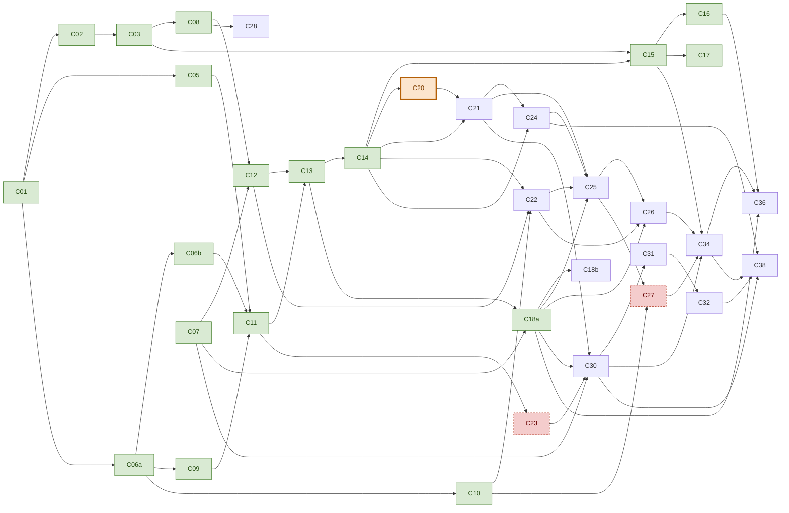

# Proyecto Final — Descomposición en changes OpenSpec

**Versión:** 3 — consenso tras la revisión de la [PR #4](https://github.com/skydr4g0n-it/joiabagur-pv/pull/4) y las [especificaciones funcionales v2](joiabagur-ia-especificaciones-funcionales-v2.md)
**Documento hermano de:** [proyecto-final-diseno-rag-joiabagur.md](proyecto-final-diseno-rag-joiabagur.md)
**Ventana:** arranque el 3 de agosto de 2026 · **prórroga abierta desde el 31 de agosto** — no hay fecha de entrega, el objetivo es entregar cuanto antes
**Equipo:** **1 desarrollador**, trabaja en Python, .NET y frontend
**Total:** 41 fichas (39 de la v3, más los partos de C06 y C18) · **36 vivas** tras anular la rama de C19 — **19 archivadas · 17 pendientes**

> **Dos supuestos de la versión 3 ya no valen, y conviene leer el resto del documento con eso puesto.** Se escribió para **dos personas** y con **entrega el 3 de septiembre de 2026**. Desde el 31 de agosto de 2026 hay **prórroga abierta** y el proyecto lo desarrolla **una sola persona**. En consecuencia: no se planifica por calendario ni por «carga por persona y semana», sino por **desbloqueo del grafo**; los marcadores 👥 son de una sola persona; y las olas del §5 se conservan como registro de lo ya ejecutado, no como plan.

---

## 0. Revisiones posteriores a la versión 3

Este documento se escribió antes de implementar. Cuando una sesión de diseño de un change concreto altera lo que su ficha decía, el cambio se registra aquí con fecha y motivo, y la ficha afectada se corrige en el sitio.

### 2026-08-31 — C18b, al explorar: su ficha describe un mundo que C18a ya no dejó en pie

**Los tres números que la ficha manda pintar están caducados, y el mecanismo que los produciría ya no los produce.** La ficha dice *«pintar la cola de revisión que C18a ya calcula: 15 miembros marcados, 4 grupos rechazados y 37 productos excluidos»*. Medido contra el Postgres local el mismo día que C18a se archivó:

| La ficha | Medido | Por qué |
|---|---|---|
| 15 miembros marcados | **0 recalculables** | Los 486 ya pertenecen a una familia y `build_candidate_groups` los excluye en su paso 1 por convergencia. Las marcas vivían **sólo en la respuesta de `suggest`**, y la decisión 3 de C18a fue no persistir propuestas |
| 4 grupos rechazados | **2** — `Alianzas Plata/oro` y `Cadena oro/plata` | `Encargos` y `Presión` salieron del índice con `ReviewStatus = Rejected` en el mismo lote: ya no son candidatos y su grupo no llega a formarse |
| 37 productos excluidos | **11** | 26 de los 37 estaban entre los 32 retirados |
| «una propuesta descartada reaparece» | **0 propuestas** | Se aplicaron las 156. `POST /v1/families/suggest` devuelve hoy lista vacía |

Construir C18b literalmente entregaría **una pantalla vacía** — cuarta aparición de la firma que este proyecto persigue desde C17, tras A1 en C04, B5 en C16 y el índice en C17. **La ficha se reencuadra:** el objeto de la pantalla son las **156 familias que nadie ha mirado** (las 156 llevan `Origin = AiApproved` con aprobador e instante de un lote que se disparó de una vez, y hay **cero** familias `Manual`) y los **682 productos activos sin familia**, de los que **671 tienen `piece_type`**.

**El hallazgo que hace pequeño el change: marcados y huérfanos son el mismo predicado.** Un miembro marcado es un producto **dentro** de una familia al que un extraño le gana a su peor hermano; un huérfano candidato es uno **fuera** al que le pasa lo mismo. Mismo cálculo, mismo objeto de revisión —el par `(producto, familia)`—, mismo veredicto humano: un endpoint, una consulta y una tabla, reutilizando `apply_relative_veto` con el universo de familias **persistidas** en vez de propuestas.

**Y la medición volvió a desmentir la hipótesis de partida, como en C18a.** Se entró suponiendo que el umbral relativo se dispararía en cientos sobre 671 huérfanos y que la **pureza de vecindad** sería más segura por estar acotada por construcción. Es al revés:

| `data_origin` | huérfanos | **A** · margen relativo > 0,02 | **B** · pureza ≥ 3 de 5 | A ∧ B |
|---|---|---|---|---|
| `real` | 216 | **21** | 19 | 6 |
| `synthetic` | 434 | **1** | **55** | 0 |

**A dispara 95 % sobre catálogo real; B, 74 % sobre sintético** — camina directo a la trampa que el `design.md` de C18a ya tenía escrita (*«fracasa en el sintético, donde `v2`/`v3`/`v4`/`v5` son casi-duplicados deliberados»*), nominando `Anillo Llama Eterna v3` → `Anillo llama eterna v2` y compañía. **A nomina y B ordena.** Curva del margen: `0 → 40` · `0,02 → 22` · `0,05 → 5` · `0,08 → 3`.

**La alerta no es sólo calidad de catálogo: diagnostica el agrupador.** Los primeros por margen tienen causa nombrable — `Pendientes botón erizo de mar S dorado` (0,109), `Colgante Lapa Mini Dorado` (0,096) y `Pendientes botón estrella de mar dorado` (0,056) quedaron fuera porque **`dorado` no figura en `materials`** de `vocabularies.yaml`, que sí tiene `baño de oro` con `chapado en oro` y `gold plated` como sinónimos. Y como el agrupador lee `name` y no `materials[]`, **el sinónimo recupera familias sin reenriquecer y sin salto de prompt**: va en C18b, no en `fix-enrichment-vocabulary-gaps`, cuya mitad de `piece_type.terms` sí exige `enrichment/v2`.

**Una familia contaminada es un imán.** `Colgante estrella de mar`, la que se comió un sintético, tiene peor hermano **0,778** frente a una media de 0,85–0,95, y atrae 4 de los 25 primeros por margen. Se corrige con orden y no con lógica: **auditar miembros antes que huérfanos** sube el listón y esos falsos positivos desaparecen solos.

| Lo que decía la ficha | Lo que la exploración obligó | Motivo |
|---|---|---|
| **Zona:** frontend + `Application/` | **Python + .NET + frontend, y con migración** | El endpoint de auditoría necesita los vectores, y **.NET no mapea el esquema `ai`** (cero referencias en `Infrastructure/`). El propio test que la ficha pide, `test_orphan_detection_...`, es de pytest. **Séptima vez** que la zona de una ficha se queda corta, tras C08, C07, C15, C16 y C17 |
| «lista de **descartes** persistente» de propuestas | **Veredictos sobre pares `(producto, familia)`** | Los tres objetos descartables no son equivalentes: una propuesta **no tiene clave estable** y hoy hay cero; un miembro marcado y un huérfano candidato **comparten clave**. Y esa misma fila **es el sello por ítem** que la decisión 7 de C18a aplazó aquí: una tabla responde a tres promesas |
| Sin migración *(C18 nunca fue 🗄️)* | **🗄️ — séptima migración del plan**, `FamilyReviewVerdict` | La contención **caducó**: anulados C19 y C29, el §12 ya sólo cuenta la de C27. Una tabla en `ai` reintroduciría *«un estado paralelo a .NET que nada invalida»*, porque `ai.product_document` es una proyección que se lapida y reconstruye |
| «el frontend es lo único nuevo» | Faltan además **`GET /api/product-families`** y **`DELETE /api/product-families/{id}`** | No hay listado: una pantalla que revisa 156 familias no puede enumerarlas. Y sin borrado, disolver una familia mala deja **una familia fantasma sin miembros** |
| Revisión sólo de lo marcado | **Se reaprueban las 156 ítem a ítem** | Es lo que produce la evidencia del renglón *«métricas de revisión humana»* del §16, que **hoy no tiene ninguna**: cero productos y cero familias han pasado por revisión real. Y revisar no mueve el corpus — sólo lo mueve **cambiar** |

**Y una consecuencia de reparto que conviene fijar aquí:** C18b y **C28** son la misma pantalla dos veces —ambas *frontend + `Application/`*, sólo administrador, revisión por lotes de salida de IA, y EP13 ya las agrupa—. C18b construye la **carcasa** y es su primer inquilino; C28 es el segundo. Lo que se extrae es **sólo lo que la ficha de C28 pide por escrito** (tabla editable, atajos de teclado, aprobación masiva, registro de quién revisó y qué cambió), nada conjeturado. Las dos alimentan la misma tabla del README: corrección del **agrupador** y corrección del **extractor**. *(Añadido el 1 sep, al cerrar C18b: la carcasa llega a C28 con **un hueco identificado y su caso de prueba** —crear una familia desde la pantalla, para las dos raíces degeneradas que la auditoría por vecindad no puede nominar—, más una mejora medida: **ponderar la nominación por la cohesión de la familia destino**, cuya precisión va de 0 % a 100 % según a quién apunte.)*

### 2026-08-31 — Prórroga abierta y equipo de uno: se deja de planificar por calendario

El proyecto pasa a tener **prórroga abierta**: no hay fecha de entrega, y el objetivo es entregar cuanto antes. Y lo desarrolla **una sola persona**, no dos.

Las dos cosas juntas invalidan tres mecanismos del documento, que se sustituyen en lugar de borrarse:

| Mecanismo de la v3 | Sustituto |
|---|---|
| Calendario por olas del §5 y «~4,4 changes por persona y semana» | **Orden por desbloqueo del grafo** (§4). Las olas se conservan como registro de lo ejecutado, no como plan |
| Reglas de asignación del §1 (anunciar antes de empezar, no coger el mismo change, repartir la mitad que desbloquea) | Sin objeto. Sobrevive la **regla de migración única activa**, que ahora es una regla de *rama*, no de persona |
| «Pares que NO deben ejecutarse en paralelo» (§5) | Sigue vigente **como conflicto de zona entre changes consecutivos**: dos changes que tocan el mismo fichero no se abren a la vez aunque los abra la misma persona |

Y una consecuencia que no es de proceso sino de contenido: **el doble etiquetado del golden set de C24 desaparece**. Su ficha lo daba por hecho «entre los dos, etiquetando por separado y conciliando», y el §6 lo declaraba irrenunciable — *«nunca renunciando al doble etiquetado»*. Con un solo etiquetador no existe, y el sustituto no es fingirlo: se etiqueta **una vez**, y el README declara la ausencia de acuerdo entre anotadores como limitación explícita del golden set en lugar de reclamar una mitigación que no se aplicó. La compensación asequible es de método, no de personas: *pooling* sobre la unión de configuraciones (que se mantiene) y **relectura diferida** de las consultas cuya relevancia se etiquetó con dudas.

### 2026-08-31 — Se anula C19 y toda su rama: C19, C29, C33, C35 y C37

**El motivo no es de plazo, es de contenido: C19 no aporta nada al sistema RAG, y el plan lo dice sin decirlo.**

El diseño afirma en su §10.1 que las señales de demanda son *«reutilizadas por el ranking de búsqueda»*. Es cierto del concepto y **falso del cableado**. La señal que pondera el retriever es `sales_30d` y `qty_bucket`, y llega por otro sitio:

```text
C25 ranking ──usa──▶ ai.pos_projection ──sincroniza──▶ /api/ai/index-feed/pos-availability
                        (C22: C10,C12,C14)              (C12 · archivado)
                                                        IndexFeedRepository.GetSalesAggregatesAsync
                                                        └── sales30d · sales90d · lastSaleAt
```

C22 depende de C10, C12 y C14. C25 depende de C21, C22 y C24. **Ninguno de los dos depende de C19.** La suma que necesita el RAG está implementada, archivada y es normativa desde `openspec/specs/index-feed/spec.md`. C19 habría construido una segunda copia de la misma agregación para otro consumidor — con el riesgo, además, de que las dos definiciones de `sales_30d` divergieran y el agente de inventario contradijera al ranking en la misma pantalla.

**Lo que C19 compraba de verdad era el segundo agente**, y el precio son cinco changes de los cuales tres no tienen ni una llamada a un LLM:

| Change | Zona | Contenido de IA |
|---|---|---|
| **C19** `add-demand-signal-service` | .NET 🗄️ | ninguno — agregación SQL |
| **C29** `add-inventory-recommendation-entity` | .NET 🗄️ | ninguno — motor de reglas |
| **C33** `add-pos-sales-profile` | .NET + Python | el LLM redacta el resumen |
| **C35** `add-inventory-agent-proposals` | Python | **el segundo agente** |
| **C37** `add-frontend-inventory-review-and-print` | Frontend | ninguno — pantalla y vista imprimible |

**Y el propio plan ya lo había decidido, en su otra versión.** [`proyecto-final-plan-changes-openspec-3devs.md`](proyecto-final-plan-changes-openspec-3devs.md) agrupa exactamente esta rama bajo *«§6. Bloque opcional — Agente de reposición ⚠️ · Solo si el núcleo está cerrado. Es el primer bloque que se cae»*, y su orden de corte empieza literalmente por ella. En esta versión la misma señal estaba repartida y por eso no se veía: **cuatro de los ocho cortes pre-acordados del §6 viven dentro de la rama** — Rotate de C29 (nº 2), Transfer de C29 (nº 4), vista imprimible de C37 (nº 5) y C35 entero (nº 8). Si esos cuatro se hubieran disparado, lo que quedaba en pie era una migración, un motor de reglas .NET y una pantalla de aprobación: todo el esfuerzo fuera de lo que el Proyecto Final evalúa.

**Lo que se pierde, exactamente y sin adornos:**

1. **De dos agentes se pasa a uno.** El asistente de venta (C30→C31→C32), que el diseño marca «Núcleo · Requisito del PF», se conserva entero.
2. **El agente de venta pierde una tool de ocho:** `perfil_punto_venta` era C33. **La ficha de C32 queda corregida en el sitio**; sin eso el agente arrancaría registrando una tool sin servicio detrás.
3. **C38 pierde** los 8-10 escenarios de agente de inventario y el test de fidelidad del perfil por POS. Conserva validador anti-alucinación, escenarios de venta, adversarios y RAGAS.
4. Los ítems **9** (agente de inventario) y **11** (vista imprimible) del alcance acordado del diseño pasan a fase posterior, junto a la packing list que ya estaba ahí.

**Lo que sobrevive es todo el RAG:** corpus híbrido, enriquecimiento y revisión humana, familias, índice y `source_hash`, recuperación híbrida con sinónimos y prefiltro blando, sustitutos, corpus de conocimiento con citas, generación con avisos por reglas, guardrails, agente de venta, endpoints .NET, frontend, golden set, ablations, validador, RAGAS y despliegue.

**Dos hallazgos de la sesión de exploración que conviene no perder**, porque son la puerta de entrada si algún día se resucita algo de esta rama:

- **C33 no necesitaba C19.** Su dependencia estaba sobre-especificada. Sus métricas (`top_piece_types`, `top_materials`, `top_price_ranges`, `top_collections`, `average_ticket`, `best_selling`, `slow_moving`) son agregados a nivel POS sobre `Sales` × `ProductAiProfile`, y lo único per-producto que necesitan —`sales_30d` y `lastSaleAt`— **ya lo calcula `GetSalesAggregatesAsync`**. No usa `IsSupplySource`, ni `stock_in_other_pos`, ni `estimated_days_to_stockout`, ni `is_top_seller_in_pos`, ni `sales_7d`, ni `sales_60d`. Si el núcleo cierra y sobra sesión, **C33 con prereq C08+C12 es un change suelto y sin migración** que devuelve la octava tool al agente de venta y da a §11.3 su test de fidelidad.
- **`sales_7d` estaba muerta al nacer, y se midió.** El mundo de C10 termina el 2026-08-23; medido el 2026-08-31 contra el reloj de pared, `sales_7d` es distinto de cero en **3 de 6.050** pares (producto, POS) activos — 0,05 %. Anclada al fin del mundo serían 443. Cualquier resucitación de las señales de demanda necesita **primero** decidir el reloj (`asOf` inyectado y `computedAsOf` declarado en la respuesta, como `projection_age_seconds` en C22), y no al revés.

**Cortes confirmados de antemano**, elegidos en la misma sesión y ya reordenados en el §6: **C27** (complementarios) y **C23 reducido a 15 documentos**. No están anulados — están pre-autorizados, y se disparan en ese orden si hace falta.

### 2026-08-31 — C18, al aplicar: el umbral del §7.5 no existe, y el plan se contradecía

**C18 se parte en C18a y C18b** por la regla 5: primero la mitad que desbloquea. C18a es el motor y el camino de escritura; C18b la pantalla y la alerta de huérfanos, que necesitan familias existentes para tener algo que revisar. Y **C18a entra en la lista de nunca-recortar**, porque el plan tenía una contradicción: declaraba irrecortables a C30 y C36 —cuyos tests de familia son `test_variants_grouped_by_family_id` y `should require variant confirmation when family has multiple members`— y recortable al único change que crea familias. Con cero familias esos dos tests pasan en vacío, que es la firma que este proyecto lleva persiguiendo desde C17.

El grafo del §4 tampoco dibujaba las aristas **C18→C25, C26, C30 y C36**. Ya están.

**Lo que la medición sobre los 1.200 vectores obligó a corregir del §7.5 del diseño.** Su enunciado —*«agrupa candidatos por similitud de embedding (umbral alto) + mismo `piece_type` + raíz común de nombre»*— **no funciona**: las poblaciones de «peor hermano» y «mejor extraño» se solapan (real 0,847–0,920 frente a 0,867–0,936), y dos familias sintéticas distintas por construcción llegan a quedar a **cinco milésimas**. Ningún corte absoluto las separa. Pero en relativo el vector es excelente —el vecino más próximo es hermano en 96,2 % de los miembros reales y 99,7 % de los sintéticos—, así que **la raíz del nombre agrupa y el embedding veta**, comparando contra las otras pertenencias propuestas y nunca contra una constante.

| Lo que decía la ficha | Lo que el apply obligó | Motivo |
|---|---|---|
| Umbral alto de similitud | **Veto relativo entre grupos**, margen 0,05 en configuración | Medido: no existe corte absoluto. Y la primera implementación, `mediana − k·MAD` contra el centroide, era una prueba *dentro* del grupo y disparaba al 16,9 % marcando al miembro menos típico de cada clúster |
| «raíz común de nombre» | Raíz **más fusión por material**, nunca stripping global | Quitar talla y material a la vez degenera `Anillo plata S/M/L/XL` a la raíz `anillo`, que absorbería cualquier otro «Anillo ‹material›» |
| El 1,7 % de la exploración | **3,1 %** (15 de 486 en 5 familias) | Aquella cifra se midió sobre familias de sufijo de talla solamente —24 reales en vez de 68— cuyos miembros son mucho más homogéneos. Más riqueza, más dispersión, más marcas |
| «pantalla de revisión que crea las familias» | La creación es de **C18a**, la pantalla de **C18b** | Sin partirlo, `family_id` seguiría nulo hasta que existiera un frontend |

**Y un matiz de mecanismo que sólo apareció al escribir el test.** El estampado de `Product.UpdatedAt` es la mitad de la historia: el watermark del feed es `greatest(Product, perfil, familia cuando es miembro actual)`, así que **crear** una familia lo mueve por el `UpdatedAt` de la propia familia. El estampado hace falta en el **reemplazo**, donde un producto que sale deja de unirse a la fila de familia. La regla —escribir siempre por `ProductFamilyService`— no cambia; el argumento correcto es que el servicio mantiene el watermark coherente en las **dos** direcciones.

**Decisiones que C18a deja planteadas y no resuelve:**

1. ~~**El doble etiquetado del golden set de C24.**~~ **Resuelto el 2026-08-31** *(ver la entrada de esa fecha sobre prórroga y equipo de uno)*: se etiqueta una vez, se conserva el *pooling*, se añade relectura diferida de las dudosas, y la ausencia de acuerdo entre anotadores se declara como limitación del golden set en el README en vez de reclamar una mitigación que no se aplicó.
2. **`Product.CollectionId` es una FK única y anulable**, pero la spec viva `product-family` justifica la distinción con las colecciones diciendo que un producto puede pertenecer *«to one of many unrelated collections»*. Ambas cardinalidades son 0..1. Los discriminadores reales, medidos: una colección abarca 1–154 productos (mediana 15) y **13–16 tipos de pieza**; una familia, 2–4 de **un solo tipo**.
3. **Las lagunas del vocabulario de enriquecimiento**, en **un solo change** y no tres. Ver la propuesta de abajo. ~~Escala métrica en el vocabulario de talla~~ → **descartado el 2026-08-31**: `Cadena Barbara oro 40/42/45 cm` no son tallas de una misma pieza sino **tres cadenas de longitud distinta**, y declararlas familia forzaría el modelo — la familia agrupa variantes de una pieza, no productos parecidos. Caerán juntas por proximidad de vector cuando alguien busque una cadena de esa colección, que es el comportamiento correcto sin pertenencia declarada.

### 2026-08-31 — Propuesta: `fix-enrichment-vocabulary-gaps` 🟢, un change y no tres

Sale de C18a y **corrige dos cosas que su propio informe dejó mal escritas.**

**La primera: el problema es tres veces más pequeño de lo que decía.** La limpieza de C18a se llevó 26 de los 37 productos con `piece_type` nulo. Quedan **once**: las nueve joyas sintéticas que el vocabulario no sabe nombrar —un cinturón de 1.300 €, cinco diademas de 340 a 1.040 €, dos gemelos y una «Joya del Zodiaco»— y los dos llaveros reales que se decidió conservar en el índice.

**La segunda: la premisa de «dar a C09 una salida *no es una pieza*» era falsa.** Esa salida ya existe — el prompt dice literalmente *«`piece_type`: un hiperónimo de la lista cerrada, **o null**»*. Lo que falta no es la opción sino **el encargo**: el prompt abre con *«Eres un extractor de atributos de joyería»* y no contempla que el catálogo contenga otra cosa. Ante `Arreglos oro` hace exactamente lo que se le pidió —extraer atributos de joyería de algo que menciona oro— y *collar* es una conjetura razonable. **No es un fallo del modelo sino una laguna del enunciado**, y se arregla con una línea, no con un cambio de contrato.

**Por qué un solo change.** Los dos arreglos tocan los mismos dos ficheros, exigen el mismo salto de versión de prompt y mueven el corpus por el mismo camino. Separarlos significa bumpear el prompt dos veces y mover el corpus dos veces, que es justo lo que C18a existe para no hacer.

**Alcance.** `piece_type.terms` += `diadema`, `gemelos`, `cinturon` y **`llavero`** —los dos conservados dejan de ser invisibles al filtro, y el cuarto término sale gratis—; prompt **`enrichment/v2`** con la lista nueva más la línea que advierte de servicios, consumibles y regalo; espejo `materials-vocabulary.ts` y su test de fijación; reenriquecer **sólo los once** con `ignoreHash`; una sola sincronización incremental.

**Fuera de alcance: reenriquecer los 1.200 con `v2`.** Serían ~1.200 llamadas y, peor, podría **reclasificar productos existentes** —algo hoy etiquetado `collar` podría pasar a `cinturon`— cambiando el comportamiento de búsqueda de forma difusa y sin que nadie lo pidiera.

**Coste.** Cuatro ficheros, once productos, **0,9 % del corpus**. Menos de media sesión: no hay algoritmo, ni migración, ni interfaz. **Lo que compra es filtro y búsqueda por tipo**, no familias: las nueve tienen nueve raíces distintas y ninguna agruparía con otra.

**Cuándo.** Mueve el corpus, así que **antes de la línea base de C24**, por el mismo argumento que ordenó C18a: `preprocessing_id` sigue siendo `source-text/v1` y no delataría el cambio.

**Riesgo a comprobar, no a suponer.** Reenriquecer con `v2` puede cambiar otros campos de esos once —materiales, etiquetas— además del tipo. Hay que mirar el diff completo, no sólo `piece_type`.

#### ¿Pueden convivir perfiles `v1` y `v2` en el catálogo? Sí, y el campo existe para eso

Conviene no confundir dos versionados que se parecen y no lo son:

| | `PromptVersion` | `embedding_version` |
|---|---|---|
| Dónde vive | `ProductAiProfiles`, lado .NET | `ai.product_document`, lado Python |
| Qué registra | qué prompt produjo los **atributos** | `modelo : dims : preprocessing_id` |
| ¿Llega al índice? | **No.** Ni al DTO del feed ni a `source_text.py` ni al `source_hash` | **Es** el índice |
| Mezclar versiones | **seguro y trazable** | **la corrupción silenciosa de S11** |

Mezclar `embedding_version` es comparar dos espacios geométricos: la base devuelve un número plausible que no significa nada, sin error. **Este change no lo toca**: la plantilla del documento no cambia, sólo el contenido de once filas.

Mezclar `PromptVersion` es otra cosa. Son dos poblaciones de atributos producidas con instrucciones distintas, comparables como dato, y **el campo se creó para hacer visible esa diferencia en lugar de evitarla** — el perfil problemático es el que no dice con qué prompt nació, no el que sí lo dice.

La única consecuencia real es de **informe, no de corrección**: las métricas que agregan sobre todo el corpus —tasa de corrección por campo de C28, métricas de enriquecimiento del §11.5— mezclarían dos poblaciones. Se resuelve **reportando por `PromptVersion`**, la misma disciplina que C24 ya aplica al reportar por `data_origin`. Estado a 2026-08-31: los 1.200 perfiles están en `enrichment/v1`.

### 2026-08-30 — C17, al cerrar: el riesgo se materializó, y no donde se esperaba

C17 quedó archivado con 86/86 tareas y el entorno vivo. La entrada de abajo advertía de que el change podía «terminar en verde y entregar una URL pública donde *Buscar con ayuda* no encuentra nada». **Ese riesgo se materializó, en una forma que la advertencia no anticipaba**: el índice llegó lleno —1.200 documentos, `drift_count = 0`— y aun así la búsqueda devolvía **200 con diez resultados plausibles** servidos por el camino **léxico**, porque C16 había dejado la búsqueda asistida tras una puerta de despliegue progresivo (`AiSearch:EnabledByDefault`, en `false`) que `compose.demo.yaml` no abría. Sin error, sin traza, y con resultados en pantalla.

Lo encontró la verificación de extremo a extremo —una búsqueda real por la URL pública, leyendo `aiAvailable` en vez del número de resultados—, que es exactamente para lo que la tarea 9.6 existía. **La lección se confirma con un matiz nuevo:** la firma no es sólo «llega vacío», es «llega **degradado y con apariencia de lleno**», que es peor porque ni siquiera un recuento lo delata.

Otros dos hallazgos del apply que afectan a changes anteriores:

- **C13 tenía un defecto de conformidad.** `of_product_ids` ordenaba los identificadores como el `Guid.CompareTo` del .NET *Framework* (con signo) cuando .NET Core compara sin signo, que equivale al orden de bytes. Los dos lados nunca coincidían y `drift_count` **no podía dar cero** con un índice real. La spec viva ya nombraba a .NET como referencia normativa, así que era el código el que la incumplía. La prueba que lo guardaba usaba dos UUID de la misma mitad del rango, donde ambos órdenes coinciden.
- **El presupuesto de recuperación, medido en la demo**: 170, 184 y 383 ms en llamadas calientes; **1707 ms** en una de cada cuatro. El de 2500 ms no se consume en el caso normal, pero volver a los 800 ms del §6.4 degradaría un cuarto de las búsquedas. Se mantiene, y la deuda del cliente de embeddings por petición sigue siendo de C21 o C22.

Detalle completo en `openspec/changes/archive/2026-08-30-add-ai-service-deployment/qa.md`.

### 2026-08-29 — C17, tras la sesión de exploración previa al proposal

La ficha de C17 se escribió dando por hecho que «producción» era un sitio al que este equipo puede desplegar. **No lo es: la cuenta AWS donde vive la tienda no es accesible**, su RDS contiene el catálogo real del negocio, y el script que despliega está horneado dentro de una instancia viva bajo `ignore_changes`. De las seis cosas que la ficha da por sentadas, **cinco no se sostienen**, y la sexta —el `/health` enriquecido— es justo lo que S15 y S16 desaconsejan por escrito. El detalle vive en [HU-AIENG-017](../Historias/AI-Eng/HU-AIENG-017.md) y en el ticket del change; aquí queda el resumen y la ficha corregida.

| Qué decía la ficha | Qué es en realidad | Por qué |
|---|---|---|
| **Zona:** infra | **Seis zonas:** `terraform/demo/`, `.github/workflows/`, la raíz (`compose.demo.yaml`, `deploy/demo/`, `.dockerignore`), `ai-service/`, `backend/` y `frontend/`. **Sigue sin migración:** C17 no es 🗄️ | El `/health` enriquecido es código Python, no infraestructura. Y la tarjeta del dashboard **no puede llamar al servicio desde el navegador** —es privado por diseño—, así que exige un endpoint .NET que lo proxee. Quinta vez que la zona de una ficha se queda corta, tras C08, C07, C15 y C16 |
| «Servicio **en producción** el 19 de agosto, alcanzable solo desde el backend» | **No hay acceso a la cuenta AWS de la tienda.** C17 levanta un **entorno de demo autocontenido en otra cuenta**, sin una sola arista hacia la de producción: ni Terraform, ni grupo de seguridad, ni IAM, ni workflow | La RDS de producción es la base de datos real de la joyería. Inyectar allí 764 productos sintéticos y 12 puntos de venta simulados no es una opción técnica sino un daño al negocio. La frontera de S15 se cumple igual —y con margen— en una cuenta separada |
| «`docker-compose` gana el servicio jbg-ai en la EC2» *(diseño §12.1)* | **En producción no hay docker-compose.** Se despliega con `docker run -d --name jpv-api -p 8080:8080` desde un heredoc dentro de `user_data`, con `lifecycle { ignore_changes = [user_data] }`. [`backend/docker-compose.prod.yml`](../../backend/docker-compose.prod.yml) existe pero es un camino muerto | El §12 se escribió sin leer [`user_data.sh`](../../terraform/templates/user_data.sh). En la demo **sí** hay compose, así que el §12.1 acaba siendo cierto — pero en otra máquina y por otro motivo |
| «`CREATE EXTENSION vector` en RDS» | **La demo no lleva RDS.** Postgres+pgvector en contenedor, con la misma imagen `pgvector/pgvector:pg15` que ya usa el compose local | Vuelve **irrelevante** la verificación que el propio plan marcaba como *tarea obligatoria fuera de código* y que nunca se ejecutó: *«verificar que RDS admite `CREATE EXTENSION vector`; si no, el plan B hay que saberlo hoy, no el 25 de agosto»*. Se adopta el plan B que el plan ya nombraba, y se gana simetría exacta con el entorno local |
| «red interna **sin exposición en nginx**» | **Caddy en contenedor**, no nginx en el host. La frontera queda escrita en el fichero: sólo el proxy declara `ports:` | Caddy emite y renueva el certificado solo. Elimina certbot, su cron, el heredoc de configuración y el paso manual posterior al DNS. La asimetría con producción no cuesta nada, precisamente porque la demo es deliberadamente otro sistema |
| «`/health` enriquecido (BD **y proveedor** OK)» | Enriquecido **sí**; con el proveedor **no**. `provider` informa de si la clave está **configurada**, nunca de si el proveedor responde | S15: *«si dependiera de que el proveedor de LLM responda, un hipo del proveedor haría que vuestro healthcheck fallara [...] un sistema que se autodestruye cada vez que el LLM tose»*. S16: *«el `/health` sigue siendo barato y tonto [...] no confundáis el latido con la vigilancia»*. Ninguno de los tres consumidores del latido necesita despertar al proveedor |
| «Smoke post-deploy» | **No puede alcanzar el servicio**: es privado por diseño y el runner de GitHub está fuera. Va por `aws ssm send-command` + `docker exec`, como el propio despliegue | |
| Nada sobre `design.md` | **C17 lleva `design.md`** | Veinte decisiones cerradas con alternativas defendibles y seis zonas. Sexta vez que la lista del §7 se queda corta, tras C08, C07, C15 y C16 |

**El hallazgo que gobierna el change: desplegar no es el problema, el dato lo es.** C17 puede terminar en verde —`/health` OK, smoke verde, `openspec validate --all --strict` en `0 failed`— y entregar una URL pública donde «Buscar con ayuda» no encuentra nada, nunca. Todo el corpus vive en el Docker local y el plan lo dice en tres sitios: *«INSERT local […] (Docker, no RDS)»*, *«RDS/producción»* en el fuera de alcance de C06b, y el runbook de C12 *«una persona, en local (y más adelante en demo)»*. Son 1.200 productos, 38 colecciones, 12 puntos de venta, 6.720 filas de inventario, 1.200 `ProductAiProfile` en `Approved` y 1.200 `ai.product_document` con sus vectores, y **ninguno de esos números existe fuera de un portátil**. El §16 pide como criterio de entrega *«URL pública con usuario demo y vídeo de 2-3 min»*: el entregable es exactamente la cosa que quedaría vacía. Es la tercera vez que aparece esta firma en el proyecto —A1 en C04, B5 en C16, y ahora el índice— y las tres comparten síntoma: compila, pasa, valida, y llega vacío a septiembre. **C17 se lleva el camino del dato, y no lo deja en un runbook.**

**El segundo hallazgo: hay dos valores que, mal puestos, mienten sin dar un solo error.** `STUB_MODE` en `true` devuelve fixtures con toda la apariencia de funcionar. Y un `JPV_EMBEDDING_MODEL` distinto del que generó los vectores compara dos espacios vectoriales como si fueran uno: la búsqueda devuelve ruido, con HTTP 200 y sin traza. Ninguno de los dos es un secreto, y de ahí sale la regla que gobierna la configuración del change: **se versionan en git como literales, no en el almacén de parámetros**, porque el almacén es un sitio donde alguien puede cambiar un valor sin revisión de código y estos dos exigen revisión de código y reindexado. Además se comprueban: `ai.product_document` guarda `embedding_model` **por fila** desde C13, así que el `/health` puede contrastar lo configurado contra lo indexado y pintar `model_mismatch` en la tarjeta del administrador. Es el fallo más silencioso del despliegue convertido en una línea roja.

**Decisiones cerradas en la sesión.**

| # | Tema | Decisión |
|---|---|---|
| 1 | Entorno | **EC2 de demo autocontenida** con Postgres+pgvector en contenedor, en **otra cuenta AWS**. Terraform en directorio y **estado propios**, de modo que un `apply` no pueda ni siquiera planificar un cambio sobre un recurso de la tienda |
| 2 | OIDC | Se **crea** el `aws_iam_openid_connect_provider` porque la cuenta es virgen. Queda escrito en `design.md` que es un **singleton por cuenta y emisor**: en una cuenta que ya tenga GitHub OIDC registrado hay que cambiar el `resource` por un `data`, o el `apply` falla con `EntityAlreadyExists` |
| 3 | Ramas | Trabajo en `c17-add-ai-service-deployment`, desde `ai-eng`. Despliegue desde **`demo`**, emparejada con un **GitHub Environment** homónimo, y confianza OIDC acotada a `repo:<org>/<repo>:environment:demo` — **más estricta que la de producción**, que confía en `:*`. `workflow_dispatch` para iterar sin ensuciar `demo` |
| 4 | Plugin de Compose | **Binario de la release con versión fijada** en `/usr/libexec/docker/cli-plugins/`. Ni `dnf install` (el nombre del paquete no está garantizado en AL2023) ni `latest` (rompe la reproducibilidad que S15 exige) |
| 5 | `user_data` | **Mínimo, cuatro pasos**, sin nada específico de la aplicación: instalar Docker y el plugin, arrancar Docker y el agente SSM, traer el compose y el script, ejecutarlo. AMI resuelta con `data "aws_ssm_parameter"` del alias público de AL2023, lo que **elimina `var.ami_id` y su paso manual** |
| 6 | Proxy y TLS | **Caddy en contenedor.** `${DEMO_HOSTNAME}` parametrizado: se arranca con un nombre `sslip.io` derivado de la IP elástica y se migra al dominio propio **cambiando un parámetro y redesplegando**. El dominio no bloquea el change |
| 7 | Compose | **`compose.demo.yaml` autocontenido en la raíz**, con los cuatro servicios. [`backend/docker-compose.yml`](../../backend/docker-compose.yml) **no se toca**: la spec viva `ai-service-dev-compose` **fija su ruta y su red literalmente** en dos requirements, y moverlo costaría un delta de spec, cinco documentos y el flujo diario de desarrollo |
| 8 | Frontera | **Sólo el proxy publica puertos** (80/443). `api`, `ai` y `postgres` sin `ports:`. Un error en el grupo de seguridad no puede exponer el servicio de IA **porque no hay puerto que exponer** |
| 9 | Secretos y ajustes | Taxonomía en cuatro clases: **A secreto** (SSM SecureString → entorno del proceso → `${VAR}`, **nunca a disco**), **B ajuste de entorno** (SSM String), **C ajuste de comportamiento** (**git**) y **D constante** (imagen). `environment:` explícito, **nunca `env_file:`** en el servicio de IA, conservando el motivo que ya razonaba el compose local |
| 10 | Los dos valores que mienten | `JPV_EMBEDDING_MODEL` (`openai/text-embedding-3-small`), `JPV_RETRIEVAL_DISTANCE_THRESHOLD` (0,65) y `STUB_MODE` (`false`) son **clase C: literales versionados**. Más la salvaguarda: el `/health` contrasta el modelo configurado contra el `DISTINCT embedding_model` del índice |
| 11 | Parejas de secretos | `JWT_SECRET` ↔ `AiGateway__JwtSecret` y la clave del feed salen de **un solo parámetro leído dos veces**, no de dos que puedan derivar. Derivar produce un **401 cuya causa el servicio tiene prohibido revelar** |
| 12 | Health | **Enriquecido en el sitio, cacheado ~10 s, sin llamar al proveedor.** Mantiene `dict[str, Any]`, así que **`openapi.json` no se regenera** y el contrato congelado sigue congelado. El disparador de la futura bifurcación queda escrito abajo |
| 13 | Health en .NET | `AiHealthController` en `api/ai/health`, sólo administrador, siguiendo el patrón «un controlador por capacidad» de C15, y **fuera del circuit breaker**: el trabajo de la sonda es diagnosticar precisamente cuando el camino principal está roto |
| 14 | Imágenes | **`Dockerfile.demo` nuevo e independiente** para API+SPA, con `VITE_API_BASE_URL=/api`. `Dockerfile.bundled` **intacto**: es el de producción. `ai-service/Dockerfile` se endurece en su sitio —usuario no-root, `uv` con versión fijada en lugar de `latest`, multietapa y `HEALTHCHECK`— porque **no tiene ningún consumidor en producción** |
| 15 | Base relativa | `VITE_API_BASE_URL=/api` funciona: la SPA se sirve desde `wwwroot/` del **mismo contenedor**, así que es mismo origen, y tanto `api.service.ts` como `image-url.ts` resuelven bien. La imagen de demo queda **agnóstica del hostname** y sirve incluso sobre una IP desnuda |
| 16 | Deprecaciones | `Dockerfile`, `Dockerfile.prod` y `backend/docker-compose.prod.yml` reciben cabecera de deprecado **y se corrige `backend/README.md`**, que hoy presenta un camino obsoleto como el de producción. Es la deuda que **el ticket de C03 ya asignó a C17** por escrito |
| 17 | `.dockerignore` | **Nuevo en la raíz.** El contexto de build de `Dockerfile.bundled` son hoy **~1 GB**: 711 MB de `node_modules`, 265 MB de `.venv`, 36 MB de `.git` y 30 MB de `data/` |
| 18 | Memoria | `mem_limit: 512m` en el contenedor de IA: un OOM mata **sólo** la IA y el breaker degrada a léxico, que es la degradación diseñada extendida a la capa de infraestructura. Más swap en el disco ya pagado. **`deploy.resources` no vale**: se ignora fuera de swarm |
| 19 | Camino del dato | `pg_dump` de `public` más `pg_dump -n ai` desde local, restaurar en la demo, y **un** `POST /v1/index/sync` de reconciliación con `drift_count = 0`. Los vectores viajan: no se re-facturan y son **fila a fila los mismos** sobre los que se calculan las métricas del README y la ablation del §11.2 |
| 20 | Usuarios de la demo | Se sustituye el personal real de la joyería —correos y hashes— por **cuentas de demo** (una de administrador y una de operador, para que se vean los dos dashboards y el embudo que sólo ve admin). **Los 436 SKU reales con sus precios sí se publican**, decisión de negocio tomada en la sesión |

**Cuándo se bifurca el `/health`, escrito de antemano.** Hoy uno solo, enriquecido y barato. Se parte en `/health` (liveness) y `/health/ready` (readiness) cuando se cumpla **cualquiera** de estas tres, y no antes: cuando algo pueda **reiniciar el contenedor** en función de la respuesta —un orquestador en lugar de un único host Docker, que es la condición que activa el bucle de autodestrucción de S15 y que hoy no se da porque `--restart unless-stopped` no reinicia por `unhealthy`—; cuando la parte cara **deje de ser cacheable barata**, por ejemplo si el estado del índice exigiera un recuento real sobre un corpus mucho mayor que 1.200 documentos; o cuando el servicio de IA **se despliegue a la cuenta real de la tienda**, donde la sonda deja de servir a una demo y pasa a gobernar la disponibilidad de un sistema con clientes. Al bifurcar, `/health/ready` es ruta nueva y por tanto **regenera `openapi.json`** y rompe `test_openapi_snapshot_is_stable`, que es lo correcto: la frontera se habrá movido y toca renegociarla. Anotado en `DEFERRED_TASKS.md` junto a la deuda de los 800 ms.

**Tres avisos que el ticket lleva en grande.** El volumen `jbg-demo-caddy-data` **guarda los certificados**: si se pierde en un redespliegue, Caddy los vuelve a pedir y Let's Encrypt limita a **cinco certificados duplicados por semana** — dos descuidos y la demo se queda sin HTTPS hasta la semana siguiente, con la entrega el 3 de septiembre; el script usa `up -d` y **jamás `down -v`**. `set -x` está **prohibido** en el tramo que lee parámetros `SecureString`, porque la salida de `aws ssm send-command` se conserva en el historial de SSM. Y cada variable requerida se valida con `:?`: una vacía no falla, arranca un contenedor que devuelve 401 a todo.

**Lo que C17 no puede hacer todavía, y no disimula.** El presupuesto de recuperación sigue en los **2500 ms temporales de C16** y en la demo, contra un proveedor a más latencia que un portátil, puede quedarse corto otra vez: C17 **mide y anota**, no arregla —el singleton del cliente de embeddings sigue siendo de C21 o C22—. El **arranque en frío** paga importación de LiteLLM más embedding frío en la primera consulta, así que el despliegue incluye una llamada de calentamiento antes de grabar nada. Y `aiAvailable: false` sigue sin distinguir circuito abierto de asistencia desactivada: decisión cerrada en C16, que C17 no reabre.

**Cortes que no se reabren:** la cuenta AWS de la tienda **no se toca en absoluto** —ni Terraform, ni grupo de seguridad, ni IAM, ni workflow, ni `jpv-deploy.sh`—; `Dockerfile.bundled` no se toca; `backend/docker-compose.yml` y la spec viva `ai-service-dev-compose` no se tocan; el contrato C02 no se toca y `openapi.json` no se regenera; C17 no abre migración, ni de EF Core ni de Alembic más allá del `upgrade head` que ya existe; y no se adelanta nada de C21 ni de C22.

### 2026-08-29 — C16, tras la sesión de exploración previa al proposal

La ficha de C16 se escribió cuando no existían ni el retriever ni el endpoint. Con C15 archivado se puede leer el contrato real, y **la ficha promete tres cosas que el código no puede dar hoy y una que no cabe en una sola zona**. El detalle vive en [HU-AIENG-016](../Historias/AI-Eng/HU-AIENG-016.md) y en el ticket del change; aquí queda el resumen y la ficha corregida.

| Qué decía la ficha | Qué es en realidad | Por qué |
|---|---|---|
| **Zona:** `frontend/src/` | **Tres zonas:** `frontend/src/` más dos tramos pequeños en `Application/` y `Tests/` del backend. **Sigue sin migración:** C16 no es 🗄️ | B5 exige enviar `searchEventId` en `CreateSaleRequest` / `BulkSaleLineRequest`, y **ninguno de los dos objetos de transferencia tiene el campo**. La columna `Sale.SearchEventId`, su índice y su clave foránea existen desde C04, pero el único sitio del repositorio que los escribe es un test de integración asignando la entidad a mano |
| B5 dado por implementable desde el navegador | **No lo es**, y detrás hay algo peor: la spec viva `ai-search-telemetry` declara la requirement *«Sale attribution is carried by the sale, not by the event»* con su escenario, archivada como cumplida, y **no se puede cumplir a través de la API** | Es la misma clase de defecto que A1: compila, los tests pasan, `openspec validate --all --strict` da verde y la columna llega vacía a la entrega. La diferencia es que aquí ya hay una spec archivada afirmando lo contrario, así que el síntoma no es la ausencia de un dato sino una spec que miente |
| «resultados con … **motivo**» | `match_reasons` es la cadena literal `["vector"]` para **todos** los resultados, fijada en [`retrieval/orchestrator.py`](../../ai-service/src/jbg_ai/retrieval/orchestrator.py) hasta que C21 añada la rama léxica | Renderizarla sería enseñarle al operador una palabra de ingeniería. Se sustituye por **insignia de origen + chips de materiales**, lo que exige devolver `materials` en `AssistedSearchResultDto`: los materiales ya llegan del retriever a .NET y `BuildResultsAsync` los descarta. Es una línea |
| «resultados con … **talla**» | Es `variantLabel`, y lo puebla **C18**, que no se ha ejecutado. Hoy es nulo en todas las filas | Se renderiza condicionalmente y aparece sola cuando C18 entre. No se inventa un sustituto ni se hidrata `ProductAiProfile.SizeLabel`, que sería rehacer trabajo de C15 |
| «los **tres** cero resultados» (B6) | **Son cuatro.** El contrato de C15 obliga a un estado que la ficha no menciona: **cuota de peticiones agotada**, que su spec exige distinguir explícitamente de «la IA no está disponible» | El límite es de 30 peticiones por minuto y por usuario. Confundirlo con la degradación haría que una cuota agotada se leyera en pantalla como una caída del servicio, y que un `debounce` mal ajustado pareciera un problema de infraestructura |
| Nada sobre `design.md` | **C16 lleva `design.md`** | Hay ocho decisiones con alternativas defendibles y un cruce de tres zonas. Cuarta vez que la lista del §7 se queda corta, tras C08, C07 y C15 |

**El hallazgo que gobierna el change: en este panel cada pulsación cuesta dinero, y eso decide el modelo de interacción.** El buscador de catálogo existente usa `useDebouncedCallback` y copiarlo aquí sería el camino natural; la aritmética lo desaconseja. La clave de la caché de candidatos de C15 incluye la cadena de consulta completa, así que **ningún prefijo acierta**: una consulta en lenguaje natural de treinta caracteres produce entre tres y seis peticiones con un `debounce` de 400 ms, y cada una factura un embedding que nadie llegó a leer. Con el límite de C15, un operador agota su cuota en **cinco o seis consultas**. Y el presupuesto de recuperación son 800 ms más hidratación, de modo que la sensación de «resultados mientras escribo» nunca estuvo disponible: no se renuncia a nada. Se elige **envío explícito** más un conjunto de consultas de ejemplo, que es además lo que S4 llama hornear el prompting en la interfaz en lugar de delegarlo en el usuario.

**El segundo hallazgo: los filtros duros se apilan y vacían la página.** El filtro de materiales de C14 es un solapamiento de conjuntos aplicado **antes** del umbral y del límite; la hidratación por punto de venta de C15 corta después, y ninguno de los dos es del panel. Con las coberturas de C10, un material poco frecuente —`perla`, `cuero`, `resina`— combinado con Fornells (0,22) produce página vacía casi con seguridad. De ahí dos consecuencias de interfaz: el estado «sin surtido» ofrece **quitar filtros** como primer remedio, no «reformula»; y la página corta **se declara en pantalla** en lugar de disimularse, porque es la línea base «antes» de la ablation de C22 en §11.2 contada al operador en una frase.

**Decisiones cerradas en la sesión.**

| # | Tema | Decisión |
|---|---|---|
| 1 | Atribución de venta (B5) | **C16 incluye el tramo .NET mínimo:** `Guid? SearchEventId` en los dos objetos de transferencia de venta y asignación en el servicio. Un identificador desconocido **o perteneciente a otro usuario** degrada la atribución a nula; la venta **nunca** falla. Sin migración: la columna es de C04 |
| 2 | Ubicación del panel | **Ruta propia** `/sales/new/assisted` y **tercera tarjeta** en `/sales`, con el patrón de `scan.tsx`: entrega por estado de navegación. Aísla el fichero que C36 va a ampliar y mantiene la arquitectura de información del hub de ventas |
| 3 | Disparo de la búsqueda | **Envío explícito** (Enter o botón) más 3-5 consultas de ejemplo. Los filtros rápidos **no disparan por sí solos**; cambiar de punto de venta limpia los resultados y no relanza |
| 4 | El «motivo» | **Insignia de origen + chips de materiales**, con `materials` añadido a `AssistedSearchResultDto`. El mapa de insignias queda preparado para que C21 añada `lexical` sin tocar el panel |
| 5 | Estados sin resultados | **Cuatro:** abstención, sin surtido en este punto de venta, degradado o desactivado, y cuota agotada. Más un quinto que no está vacío: **página corta**, declarada en pantalla |
| 6 | Vocabulario de materiales | **Constante en el frontend**, espejo de [`vocabularies.yaml`](../../ai-service/src/jbg_ai/enrichment/vocabularies.yaml), fijada por un test. Un endpoint que agregue los materiales realmente presentes en el surtido de ese punto de venta es mejor producto y **se anota para C28**: hoy costaría una consulta sobre documento JSON cruzada con inventario, en un change que ya cruza tres zonas |
| 7 | Embudo | Bloque colapsado **solo para administradores** con el identificador de correlación y `candidatos → supervivientes → mostrados`. Evidencia directa para §11 y para el checklist de §16, a coste casi nulo |
| 8 | Episodio de búsqueda | Un `searchSessionId` por **montaje del panel**. B2 existe para que las reformulaciones de una visita no cuenten como abandonos, y las reformulaciones ocurren dentro de la visita: dos visitas que acaban cada una en selección son dos episodios legítimos, no dos falsos abandonos |

**Lo que el panel no puede distinguir, y se acepta.** La respuesta trae `aiAvailable: false` tanto si el circuito está abierto como si la asistencia está desactivada en ese punto de venta. La telemetría **sí** los separa (`LexicalFallback` frente a `Disabled`); la API no. Para el operador el mensaje es el mismo —la búsqueda asistida no está sirviendo—, así que se deja como decisión consciente y escrita, en lugar de pedirle a C15 un discriminador que sólo cambiaría el texto de un aviso.

**Cortes que no se reabren:** el contrato C02 no se toca, `ai-service/` no se toca, C16 no abre migración, `/api/v1/products/search` se queda como está, y `C16 ‖ C36` sigue sin poder ejecutarse en paralelo.

### 2026-08-28 — C15, tras la sesión de exploración previa al proposal

La ficha de C15 se escribió cuando el retriever no existía. Con C13 y C14 archivados se puede leer el SQL real, y tres de las cosas que la ficha da por hechas no se sostienen. El detalle vive en [HU-AIENG-015](../Historias/AI-Eng/HU-AIENG-015.md) y en el ticket del change; aquí queda el resumen y la ficha corregida.

| Qué decía la ficha | Qué es en realidad | Por qué |
|---|---|---|
| «**repide con `top_k` mayor** si quedan pocos» | **Se elimina.** C15 pide `top_k = 20` → `min(20×3, 60) = 60` candidatos, el techo absoluto del contrato, en **una sola llamada** | El SQL de C14 aplica el umbral 0,65 **antes** del `LIMIT`. Si vuelven menos candidatos que el `overfetch`, ató el umbral y no el `LIMIT`: repedir devuelve **exactamente las mismas filas** cobrando un segundo embedding. Sólo aportaría algo con `top_k < 20`, y jamás por encima de 60 |
| «`ai_available: false` + **resultados léxicos**» con el buscador existente | **Buscador degradado nuevo**, acotado al POS de la búsqueda, con `to_tsvector('spanish', …)` calculado en consulta, **semántica OR** y orden por `ts_rank` | [`ProductService.SearchProductsAsync`](../../backend/src/JoiabagurPV.Application/Services/ProductService.cs) hace `Name.Contains(consulta)` sobre la cadena completa: ante *«un anillo de plata para regalar»* devuelve **la lista vacía, siempre**. Y filtra por *todos* los POS asignados, no por el de la búsqueda. Un fallback que nunca encuentra nada es una caída silenciosa con HTTP 200 |
| **Zona:** `API/Controllers/`, `Application/` | Igual, más `Tests/`. **No** `Infrastructure/`: C15 no lleva migración | Ninguna de las decisiones cerradas necesita esquema nuevo, y el plan contabiliza seis migraciones sin ninguna suya |
| Nada sobre `design.md` | **C15 lleva `design.md`** | Hay seis decisiones con alternativas defendibles y coste asimétrico. Tercera vez que la lista del §7 se queda corta, tras C08 y C07 |
| «Mismo controlador `AiController.cs`» (§5, pares que no van en paralelo) | **No existe `AiController.cs`.** El patrón real es un controlador por capacidad: `AiCatalogController`, `AiIndexFeedController`, `AiSearchEventsController`. C15 crea `AiSearchController` en `api/ai/search`, sin versión | El conflicto de zona **C15 ‖ C34 deja de ser el fichero del controlador** y pasa a ser el servicio de búsqueda compartido. Siguen sin poder ir en paralelo, por otro motivo |

**El hallazgo que gobierna el change: el filtro más selectivo del pipeline está al final, a un salto de red, y correlaciona con el ranking.** El §7.6 paso 1 sitúa el `pos_id` como filtro duro **en Python**. Pero C13 no indexó disponibilidad y C14 declara explícitamente que *«the search SQL does not filter by `pos_id`»*, difiriéndolo a C22. C15 vive en la ventana intermedia y sólo puede aplicarlo al hidratar, que es el paso 6.

Medido con el generador de C10 (`n_take = round(coverage × 1200)`, más `inactive_inventory_ratio_live_pos: 0.08`; la suma da 6.720, exactamente el inventario del informe):

| POS | cobertura | activos ≈ | supervivientes de 30 | de 60 |
|---|---|---|---|---|
| CIU-CENTRE (`op-ciutadella`) | 0,78 | 861 | 21,5 | 43 |
| MAO-AIR (`op-aeroport`) | 0,38 | 420 | 10,5 | 21 |
| **FORNELLS (`op-fornells`)** | **0,22** | **243** | **6,1** | **12,1** |

Con 30 candidatos, FORNELLS llena una página de 10 en el **~4 %** de las búsquedas. Y `collection_weights` sesga el surtido (`Tramontana` y `Caliza` a 3,5; `Filigrana` y `Cielo estrellado` a 0,3), así que el descarte **no es un adelgazamiento uniforme del 20 %**: correlaciona con la señal de ranking, y una consulta alineada con una colección que ese POS casi no tiene devuelve 0-2 resultados. Es el fallo que S10 describe como *«el filtro descartó 48 y la consulta entregó 2 sin ningún error visible»*, agravado. **Dos de los tres operadores de demo están en 0,38 o por debajo**, así que esto es el vídeo de la entrega, no un caso borde.

**Se acepta el corte y se mide**, en lugar de adelantar C22 fuera de zona. La tasa de llenado por POS es la línea base «antes» de la ablation de C22 en §11.2, y **se computa con lo que C04 ya persiste**: `% de búsquedas con ResultsCount < página`, agrupado por `PointOfSaleId`. Ninguna columna nueva. Distinguir la **abstención** (la IA no encontró nada) del **sin surtido** (la hidratación lo tiró todo) se resuelve uniendo por `TraceId` con el log `stage=search` de C14, que ya está obligado a emitir `low_confidence` y `candidates` — el cruce que la decisión 6 de HU-014 dejó previsto.

**Dos deudas que C15 anota y no paga.** La primera es de otro servicio: [`api/routers/retrieval.py`](../../ai-service/src/jbg_ai/api/routers/retrieval.py) construye un `LiteLlmEmbeddingClient` **por petición**, así que la caché RAM que C11 congeló nace vacía y muere con la respuesta — en retrieval **no hay ni un acierto en producción**. Tres líneas en `main.py` lo arreglan, y le tocan a **C21 o C22**, que ya trabajan en `retrieval/`; C15 no cruza a Python y mitiga por su lado con una caché de candidatos. La segunda: un índice GIN sobre `public."Products"` sólo tendrá sentido si el catálogo crece un orden de magnitud. Con 1.200 filas ese índice compraría lematización, no velocidad, y la lematización ya se obtiene sin él.

**Obligación heredada por C16.** Los tres «cero resultados» —abstención, sin surtido en este POS, y camino degradado— tienen que decirle cosas distintas al operador. Con un único `results: []` son indistinguibles, y el panel mentiría en dos de los tres casos.

### 2026-08-27 — C14 archivado

Change [`2026-08-27-add-vector-retrieval-endpoint`](../../openspec/changes/archive/2026-08-27-add-vector-retrieval-endpoint/). Spec viva: `vector-retrieval`. `POST /v1/retrieval/products` real (`STUB_MODE=false`); stub C02 si stub mode. Umbral `JPV_RETRIEVAL_DISTANCE_THRESHOLD` 0,65; hybrid/lexical = vector hasta C21. 503 si faltan key/DB/índice compatible. Sin `query_log`, sin regenerar OpenAPI, sin `embeddings.py`, sin `pos_id`.

### 2026-08-26 — C13 archivado

Change [`2026-08-26-add-product-document-indexer`](../../openspec/changes/archive/2026-08-26-add-product-document-indexer/). Spec viva: `product-document-indexer`. `POST /v1/index/sync` y `GET /v1/index/status` reales (`STUB_MODE=false`); stub C02 si stub mode. Keyset OpenAPI `since_id` / `cursor_id`. Mapa `sku_provenance.json` en `src/`. Alembic `text_provenance` + `sync_checkpoint`. Sin POS, sin `embeddings.py`, sin migración EF.

### 2026-08-26 — C12 archivado

Change [`2026-08-26-add-dotnet-index-feed-endpoints`](../../openspec/changes/archive/2026-08-26-add-dotnet-index-feed-endpoints/). Spec viva: `index-feed`. Feeds HTTP de catálogo (50) y POS (200) con API Key; 401 ante JWT de usuario o token C03. Tombstones por `kind`/`reason` (la ficha v3 nombraba `{deleted_at|deactivated_at}` y 403). Sin migración, sin push a `/v1/index/sync`. Runbook AutoBulk escrito, no ejecutado.

### 2026-08-22 — C06a archivado: corpus offline, no generador de servicio

La ficha original de C06a adjudicaba generadores en `ai-service/src/jbg_ai/data/generators/`, cliente LLM y migración Alembic de `text_provenance`. El change archivado [`2026-08-22-add-real-catalog-ingestion-and-text-assist`](../../openspec/changes/archive/2026-08-22-add-real-catalog-ingestion-and-text-assist/) entrega el resultado (JSONL de 436, dos ejes de procedencia, ingesta local de `Description`) por otro camino, documentado en su `design.md`:

| Ficha original | Apply cerrado |
|---|---|
| Zona `jbg_ai.data` + `prompts/` | Pipeline offline en [`scripts/catalog/`](../../scripts/catalog/) (`catalog-pipeline`: lectura, agrupación interna, reparto, redacción, validación, ingesta) |
| Cliente LLM en `ai-service` | Pasada de vendedor `catalog-assist/v2` en `assist.py` (plantillas deterministas, **sin** proveedor); `model: null` en el sidecar |
| Migración `text_provenance` | **C13** — C06a **no** es 🗄️ |
| JSONL on-demand | JSONL **commiteado**: [`data/catalog/real/generated/catalog-real-enriched.jsonl`](../../data/catalog/real/generated/catalog-real-enriched.jsonl) + sidecar `.meta.json` |
| ~10 % «sin descripción» / tier `empty` | Tier **`original`**: se deja la `Description` del xlsx (no se vacía ni se reescribe) |
| Semilla de familias en el JSONL | **No se emite.** Agrupación solo interna para el sorteo. C18 no lee este corpus |
| Ingesta | `UPDATE` local de `Description` por SKU; **0 unmatched**; 436 filas tocadas; identidad intacta |

**Artefactos de traza.** `generator_version` `c06a-assist/v2`, semilla `20260822`. Sidecar: 293 `rich` (67,20 %), 94 `sparse` (21,56 %), 49 `original` (11,24 %) — dentro de 70/20/10 ±3 pp. Procedencia: 387 `ai_assisted` / 49 `merchant`. Agrupación interna (no serializada): **354 grupos**, 44 multi-variante, 310 unarios (la referencia de exploración ~403/~23 era orientativa). Contrato de línea: `sku`, `name`, `description`, `price`, `collection_name`, `data_origin: real`, `text_provenance`, `text_quality_tier`. Tope `Description` 1000 caracteres. Spec viva: `real-catalog-corpus`. Informe: [`informes/c06a-catalog-enrichment-report.md`](informes/c06a-catalog-enrichment-report.md).

**Lo que esto deja escrito para C06b.** La zona `jbg_ai.data` **sigue vacía**: C06a no la inauguró. El JSONL real es el ancla de SKUs y de colecciones a no reutilizar (436 SKUs `SKU01`…, 28 colecciones). La voz v2 es **plantilla** —por eso huele a determinista—; C06b no reutiliza `assist.py`. `text_provenance` sigue sin columna: vive en JSONL hasta C13.

### 2026-08-22 — C06b, tras la sesión de exploración previa al proposal

La ficha v3 de C06b (y la fila de C06b en la tabla del 17 ago) mezclaba tres trabajos y copiaba cifras dimensionadas para un catálogo 100 % sintético. Con C06a archivado y el real en 436 productos / 354 grupos internos, esas cifras ya no significan lo mismo. Decisiones de la exploración:

| Ficha 17 ago | Ahora |
|---|---|
| Zona `jbg_ai.data.generators/` como generador determinista de servicio | Mismo paquete, **CLI** que no se importa desde `jbg_ai.api.main`. Ni FastAPI ni API .NET. C10, cuando llegue, se sienta al lado (mundo numérico, también CLI) |
| Calibrar precio, SKU, materiales y tamaño de familia al real | **No.** SKU lo reserva el código (sin colisión con C06a). Precio y copy los razona un **LLM**. Materiales multi-valor en la **prosa** (~35 %), no como `materials[]` en el JSONL |
| ~350 familias S/M/L y 15 % de huérfanos | **Fuera de C06b.** `Product` no tiene columna de familia; D4 es **C18**. Los sintéticos nacen huérfanos (204). Tallas en el nombre, si el LLM las escribe, son catálogo, no semilla |
| 900-1.200 productos, calibrados | Presupuesto **~1.200 totales** (436 + sintéticos; holgura, no cifra exacta) |
| JSONL versionado | JSONL + sidecar en `data/catalog/synthetic/generated/` **e `INSERT`** local de colecciones nuevas y productos (Docker, no RDS) |
| Tests de distribución de precio y ratio de huérfanos | Caen. Entran unicidad de SKU, ingesta sin tocar reales, tope 1000, LLM fake en pytest, settings sin API key obligatoria al boot |

Colecciones: **solo nuevas**, pensadas como brief de vitrina de hotel, aeropuerto/turista o tienda clásica — no un campo de canal en `Product`. Un par pueden seguir la temática menorquina; el resto divergen del mar saturado del real.

El grafo `C06b → C11` sigue siendo cierto **porque hay ingesta**: sin filas en `public."Products"`, el feed de C12 no ve el sintético.

### 2026-08-22 — C06b, longitud del copy alineada al real

La nota de calibración de la ficha («no se hereda la longitud de descripción») queda acotada: **precio y tamaño de familia siguen sin heredarse**; la **longitud del copy sí** se aproxima a las medias del JSONL C06a (`rich` ~289 / `sparse` ~115 / `original` ~14). El código declara el `text_quality_tier` **antes** del draft (`catalog-synth/v3`), recorta solo frases enteras y deja ~20 % de los `short` vacíos. Sidecar vigente: `c06b-synth/v3`. El JSONL sintético ya está generado (764).

### 2026-08-23 — C09 archivado

Change [`2026-08-23-add-catalog-enrichment-pipeline`](../../openspec/changes/archive/2026-08-23-add-catalog-enrichment-pipeline/). Spec viva: `catalog-enrichment-pipeline`. Extractor real en `jbg_ai.enrichment/` detrás de `POST /v1/enrich/products` cuando `STUB_MODE=false`; prompt `enrichment/v1`; LiteLLM temp 0; puertas de lote en auditor fuera del HTTP. `openapi.json` no se regeneró.

### 2026-08-23 — C06b archivado

Change [`2026-08-23-add-synthetic-catalog-augmentation`](../../openspec/changes/archive/2026-08-23-add-synthetic-catalog-augmentation/). Spec viva: `synthetic-catalog-corpus`. JSONL 764 + sidecar `c06b-synth/v3` / `catalog-synth/v3`. Ingesta local el 2026-08-22: `"Products"` 1200, `"Collections"` 38, `"ProductFamily*"` 0. GET familia sobre SKU440 → 204. `jbg_ai.data` queda inaugurada (CLI; `api.main` no la importa).

### 2026-08-17 — C06, tras la sesión de exploración previa al proposal: el export real sirve por tamaño y no por texto

El export llegó y se importó: **436 productos**. El plan se había preparado para que fuera **pequeño** —§14 pregunta 7 pregunta por su tamaño, §13.5 teme que sea insuficiente— y resultó ser de tamaño razonable (la mitad del objetivo de 900-1.200) pero **textualmente casi vacío**: 38,5 caracteres de media entre nombre y descripción, con 51 productos sin descripción ninguna.

Medido por campo que C09 tiene que extraer, el corpus no es pobre de forma uniforme, es **ciego a las etiquetas comerciales**:

| Campo | Evidencia en los 436 reales | |
|---|---|---|
| `piece_type` | 383 | **88 %** |
| `materials[]` | 384 | **88 %** |
| `size_label` | 66 | 15 % (por regex, como ya diseñaba C09) |
| `stone_type` | 34 | **8 %** |
| tags de color / estilo / ocasión | ~0 | **sin ninguna base** |

Eso destapa **dos contradicciones que ya estaban en el documento** y que nadie podía ver hasta tener el dato:

| # | Contradicción | Resolución |
|---|---|---|
| 1 | **C09 no puede aprobar su propia puerta.** §8.5 exige `cobertura de tags ≥ 90 %` y §7.1 exige «devuelve `[]` si no hay evidencia, nunca inventa». Sobre 38 caracteres sin vocabulario de estilo ni ocasión, ambas a la vez son insatisfacibles | La puerta baja a **70 % global** y se mide además **≥ 90 % sobre el estrato con texto asistido**. Ver la ficha de C09 |
| 2 | **C06 se contradice consigo mismo.** §8.1.1 regla 2 calibra el sintético con lo real «incluida la longitud típica de descripción»; §8.4 exige «~30 % de descripciones pobres». Calibrar sobre 15 caracteres da **100 %** pobres | El reparto de calidad deja de heredarse del real y se **declara**: ~70 % rico, ~20 % escueto, ~10 % sin descripción |

**C06 se parte en dos, y el motivo es de ruta crítica, no de calidad.** C09 se construye y prueba con LLM falso sobre fixtures: necesita *un* corpus, no *el* corpus. Los 900-1.200 sintéticos los necesitan C11, C10 y C24, no C09.

| Change | Alcance | Desbloquea |
|---|---|---|
| **C06a** `add-real-catalog-ingestion-and-text-assist` | Ingesta de los 436; asistencia de redacción; reparto de calidad; JSONL versionado | **C09 y C10** |
| **C06b** `add-synthetic-catalog-augmentation` | Ampliación a ~1.200 totales; colecciones nuevas; LLM+CLI; ingesta INSERT; **sin** familias (C18) | C11, C24 |

Partir no es recortar, así que la lista «nunca se recorta» del §13.4 no lo impide; y Python no tiene la regla de migración única, así que la revisión de Alembic que esto añade es barata.

**Tres decisiones de diseño que salen de la sesión:**

1. **`data_origin` confundía dos ejes independientes** —«¿el producto es real?» y «¿de dónde sale su texto?»— y por eso se rompía al mejorar el corpus. Se separa: `data_origin` sigue significando identidad del producto (SKU, precio y colección son reales y .NET manda sobre ellos) y aparece **`text_provenance`** (`merchant` | `ai_assisted` | `synthetic`). La regla 3 de §8.1.1 se reescribe sobre el eje nuevo.
2. **La unidad del reparto de calidad es la familia de variantes, nunca el producto suelto.** Si dentro de una familia una talla tiene texto rico y otra ninguno, el recuperador puede separarlas por riqueza de texto en vez de por talla — y la desambiguación de variantes son 10 de las 60-70 consultas del golden set, la categoría que §8.4 llama «el caso crítico». Medido: **403 grupos**, de los cuales 23 con variantes (56 productos) y 380 sueltos. Cuidado con leer «familia» como tipo de pieza: hay 37 tipos pero cuatro concentran el 78 %, y sortear por ahí daría *todos* los pendientes ricos y *todos* los colgantes vacíos.
3. **El texto asistido simula un reconocimiento multimodal que no existe y que el diseño excluyó.** §8.1 dice de las fotos «no se usan (el índice visual ya existe y es otro problema)», y se ha verificado que hay **0 fotos y 0 embeddings visuales** en la base. Sin fotos el modelo no puede saber cuántas piedras lleva una joya: expande lo que ya consta y acota por banda de precio lo que no. Esto **entra en §15 como limitación declarada**, no como detalle de implementación.

**Consecuencia sobre el resultado que publica el README.** §15 limitación 1 obliga a publicar la porción real como resultado principal, y §11.2 y C24 aplican ahí el umbral de aceptación. Con el texto real redactado por un LLM, ese número deja de decir lo que decía: la afirmación del proyecto pasa de «funciona sobre un catálogo real de joyería» a «funciona sobre un catálogo realista». Sigue siendo defendible, pero hay que escribirlo. Las métricas de **enriquecimiento** (§11.5, tasa de corrección por campo) sobreviven intactas —miden al extractor, no a la verdad—; las de **recuperación** son las que dejan de hablar del negocio real.

**Puerta que se deja abierta a coste cero.** El corpus original queda archivado (`.xlsx` y volcado `pg_dump` en `data/catalog/real/`, fuera de git). C24 admitirá un segundo `eval_run` sobre él, de modo que el delta «con asistencia − sin asistencia» siga siendo medible más adelante. Es el resultado más fuerte que este proyecto podría enseñar y perderlo era irreversible.

---

### 2026-08-17 — C07, al aplicar: la zona, una reserva para C18 y dos deudas que hereda C12

| Qué decía la ficha | Qué es en realidad | Por qué |
|---|---|---|
| **Zona:** `Domain/`, `Application/`, `API/Controllers/` | **Cinco carpetas:** más `Infrastructure/` (configuración EF y migración) y `Tests/` | Tercera vez que se corrige lo mismo, tras C04 y C08. **Un change 🗄️ siempre toca `Infrastructure/` y `Tests/`**; conviene darlo por supuesto en las tres fichas 🗄️ que quedan (C19, C27, C29) en lugar de volver a anotarlo |
| Nada sobre `design.md` | **C07 lleva `design.md`** | El §7 no se lo asigna, pero hay cinco decisiones con alternativas defendibles y coste asimétrico. Segunda vez que la lista del §7 se queda corta, tras C08 |
| `ProductFamily` (Name, Description) | **Más `Origin`, `ApprovedByUserId` y `ApprovedAt`**, nulables y sin uso en C07 | **C18 no está marcado 🗄️** y el plan cuenta seis migraciones, ninguna suya. Sin esta reserva tendría que abrir una séptima en plena Ola 3, compitiendo por el turno con C19, C27 y C29. Es la misma jugada que C08 hizo para C28, y por el mismo motivo |

**Obligaciones que C07 no puede cerrar y adjudica a C12 por escrito.** Las dos salen de que la pertenencia se declara como lista completa:

1. **Un producto que sale de una familia pierde su fila de miembro**, así que no queda ninguna marca temporal que le diga al feed `?since=` que ese producto debe reindexarse *sin* familia. Su documento conservaría la familia antigua indefinidamente.
2. **Renombrar una familia no toca ninguna fila de miembro**, y el índice denormaliza `family_name`, con lo que C11 se compromete a que el hash cambie.

Ninguna se resuelve dentro de C07: exigiría borrado lógico y una columna más para un mecanismo que el **§6.3 ya diseña en otro sitio** —*«.NET empuja una invalidación cuando se aprueba un perfil o cambia una familia»*—, y ese empujón es de C12. C07 deja preparados los índices sobre `UpdatedAt` de ambas tablas para que el feed pueda unir por familia y no solo por miembro. **C12 debe invalidar los productos que entraron y los que salieron, no solo los miembros actuales.**

**Lo que el apply enseñó y no estaba en ninguna ficha.** El reemplazo declarativo de miembros falla si las altas se declaran añadiéndolas a la colección de navegación de la familia: `BaseEntity` asigna el `Guid` en el constructor, así que EF toma al miembro nuevo por una fila existente y emite un `UPDATE` contra nada. Solo se manifiesta cuando una misma petición borra e inserta a la vez —reordenar variantes, intercambiar dos etiquetas—, nunca cuando solo añade o solo quita. Es un aviso para C18, C19 y C29, que van a mover colecciones hijas por el mismo camino.

---

### 2026-08-16 — C08, al aplicar: la ficha se quedaba corta en dos cosas

| Qué decía la ficha | Qué es en realidad | Por qué |
|---|---|---|
| **Zona:** `Domain/`, `Application/`, `API/Controllers/` | **Seis carpetas:** más `Infrastructure/` (configuración EF y migración), `Tests/` y **`ai-service/`** | Mismo error que la ficha de C04 tuvo que corregir. Un change 🗄️ siempre toca `Infrastructure/`, y este además cruza a Python |
| El contrato de `POST /v1/enrich/products` bastaba tal cual | **C08 lo renegocia** | Sus perfiles propuestos no llevaban `source` (`rule` \| `inferred`). Sin ese campo la decisión 5 —*sensible inferido → revisión; sensible por regla → no*— **no es implementable**, y dos de los cuatro tests `Routing_*` de la propia ficha no tendrían nada que distinguir. Se añaden además `piece_type`, `stone_type`, `size_label`, el desglose de `tags` en `color_tags`/`style_tags`/`occasion_tags` y `prompt_version` |

Renegociar aquí fue barato porque **C08 es el único consumidor que la ruta ha tenido nunca**: romperla no invalidó una sola línea. Hacerlo en C09 habría obligado a construir la entidad y el enrutado sobre una forma que ya se sabía insuficiente. El coste real fueron un snapshot regenerado y dos suites en verde, que es exactamente el mecanismo que C02 montó para este momento.

**Obligación heredada por C09.** El contrato ya declara `source` y `prompt_version`: el pipeline de enriquecimiento debe **producirlos de verdad**, marcando `rule` en la normalización determinista previa (talla por regex) y `inferred` en lo que salga del modelo. Si C09 devolviera todo como `inferred`, la revisión híbrida seguiría compilando y mandaría el catálogo entero a una cola que nadie tiene tiempo de vaciar.

**Consecuencia sobre C28.** No está marcado 🗄️ y el plan cuenta seis migraciones, así que C08 le reserva el almacenamiento de sus dos métricas: `ProposedProfileJson` (propuesta cruda inmutable, de la que sale la tasa de corrección por campo) y `ReviewDurationMs` (que mide el navegador y queda nulo en aprobación masiva). C28 no necesita abrir una séptima migración.

---

### 2026-08-15 — C05, al aplicar: dos lagunas del propio plan

La ficha de C05 se cumplió sin desviaciones, así que no se corrige. Pero implementarla dejó a la vista **dos huecos que no son de ningún change y que, sin registrar aquí, se pierden**:

| Laguna | Estado | Qué se ha hecho |
|---|---|---|
| **`ai.query_log`** aparece en el diseño §7.2 junto a las tablas de evaluación, pero **ninguna ficha la reclama**: las de evaluación son de C24 y esta no es de nadie | Sin adjudicar | C05 **no la crea**, a propósito y con el motivo escrito: no hay regla de migración única en Python, así que una segunda revisión de Alembic es barata, mientras que adivinar hoy sus columnas no lo es. Queda anotada para que no aparezca improvisada dentro de C14 |
| **No existe integración continua para Python.** El repositorio tiene `test-backend.yml` y `test-frontend.yml`; nada ejecuta `uv run pytest` | Sin adjudicar | Condiciona una decisión de C05: los tests de base de datos **se omiten con motivo** cuando Docker no responde, en lugar de fallar. Sin CI, unos rojos permanentes en local solo enseñarían a ignorar el rojo. Si alguien añade el flujo, esa decisión debería revisarse |

Ninguna de las dos bloquea a nadie hoy. Se registran porque el coste de olvidarlas se paga tarde: la primera, cuando C14 necesite registrar consultas y no tenga dónde; la segunda, el día que un cambio rompa la suite de Python y nadie se entere hasta la entrega.

---

### 2026-08-10 — C04, tras la sesión de exploración previa al proposal

Diseñar C04 en detalle movió tres cosas de sitio y añadió obligaciones sobre dos changes posteriores. El detalle completo está en [HU-AIENG-004](../Historias/AI-Eng/HU-AIENG-004.md) y en el ticket del change; aquí queda el resumen y las fichas corregidas.

| Qué cambia | Antes (v3 / specs v2) | Ahora | Por qué |
|---|---|---|---|
| **Quién escribe el evento** | implícito: el frontend envía `ProductSearchEvent` (ficha C16) | el **backend** escribe la mitad de búsqueda desde C15; el cliente solo reporta la selección | Origen, `trace_id`, latencia real y lista realmente devuelta **solo los conoce el servidor**. Es §6.2 y §7.6 aplicados a la telemetría. Efecto buscado: el contrato de C16 —🔴, ola congestionada— se reduce a un `POST` con un campo |
| **Endpoint** | `POST /api/products/search-events` (specs v2 §5.9) | `POST /api/ai/search-events/{id}/selection` | Un evento sin selección y sin resultados no pertenece a ningún producto: anidarlo bajo `/products` miente sobre la propiedad del recurso. `api/ai/*` es el namespace que ya usan C15, C19 y C34 |
| **Enlace venta↔búsqueda** | `ProductSearchEvent.CreatedSaleId` (specs v2 §5.8) | `Sale.SearchEventId`, con `ON DELETE SET NULL` | La atribución la declara el hecho derivado en el mismo `INSERT`, sin llamadas de seguimiento. Con el checkout masivo la diferencia es de N llamadas extra contra N campos opcionales en una petición que ya se envía |
| **Duración** | un campo `SearchDurationMs` (specs v2 §5.8) | `RetrievalMs` + `TotalMs` + `SelectedAt` | El campo original era ambiguo entre latencia de recuperación y tiempo hasta la selección. La diferencia de los dos primeros mide el **coste de la hidratación**, cifra que hoy nadie conoce y que el README querrá defender |
| **Granularidad** | no especificada | una fila por consulta, agrupadas por `SearchSessionId` | Sin agrupar, cada reformulación se contabiliza como un falso «consulta sin resultado» |
| **Búsquedas degradadas** | no contempladas | columna `SearchOrigin` (`Assisted` / `LexicalFallback`) | §6.4 obliga a responder con el buscador léxico si el circuito abre. Sin distinguirlas, una semana de cortacircuitos se lee como «la IA rankea peor». Y da online la comparación v0 vs v3 de §11.2 |
| **Utillaje de migración** | *«test de migración»* en seis fichas, sin más detalle | arnés de dos capas construido en C04 y heredado por C07, C08, C19, C27 y C29 | No existe ningún test de migración en el repositorio. La primera migración paga un coste fijo que las otras cinco no pagan, y debe caer en el change sin dependientes |

**Consecuencia de orden.** Coger C04 antes que C07 contradice la regla 2 (prioridad a la ruta crítica): C07 desbloquea C12 🔴 y C04 no desbloquea nada. Se acepta la inversión **por el coste fijo del arnés**, que conviene pagar fuera de la ruta crítica. Si finalmente se coge C07 primero, el arnés viaja con C07 y C04 lo hereda.

---

## 1. Cómo se trabaja

Cada entrada es **un change OpenSpec completo**, ejecutable de principio a fin en **una sesión de 2-3 horas**:

```text
/opsx:propose (proposal.md · design.md · tasks.md · specs/<capability>/spec.md)
  → /opsx:apply  (código + tests)
  → /opsx:verify (build + tests verdes + revisión de alcance)
  → /opsx:archive (openspec/changes/archive/YYYY-MM-DD-<change-id>/)
```

### Reglas de orden *(reescritas el 2026-08-31: equipo de uno, prórroga abierta)*

1. **Se coge el siguiente change desbloqueado**, sea Python o .NET. No hay dueño por zona.
2. **Prioridad al desbloqueo, no al calendario.** Entre los changes libres se coge el que **más aristas abre en el grafo del §4**, no el que antes vence. Un 🟢 que tapona a un 🔴 va primero: el caso vivo es C20, marcado 🟢, que es lo único que separa a C21 de arrancar y C21 bloquea a la vez a C24 y a C30.
3. **Una sola migración EF Core activa a la vez** (marcados 🗄️). Se mergea antes de abrir otra. Ya no es coordinación entre personas sino disciplina de rama: dos migraciones abiertas colisionan igual aunque las escriba la misma mano.
4. **No se abren a la vez dos changes de la misma zona.** La tabla de *pares que no deben ejecutarse en paralelo* del §5 sigue vigente, ahora leída como changes consecutivos y no como desarrolladores simultáneos.
5. **Si un change se desborda de la sesión, se parte** y se entrega primero la mitad que desbloquea el grafo.
6. **C24 (golden set) se etiqueta una vez.** El doble etiquetado y la conciliación no existen con un solo anotador; se conserva el *pooling* y se declara la ausencia de acuerdo entre anotadores como limitación del README.

### Definition of Done común

- [ ] Artefactos OpenSpec creados y `openspec validate` en verde
- [ ] Código aplicado, `dotnet build` / `uv run pytest` / `npm run build` sin errores
- [ ] **Tests unitarios nuevos, verdes**
- [ ] Tests existentes sin regresión
- [ ] Documentación afectada actualizada
- [ ] Change archivado el mismo día

### Reglas transversales de testing

- **Ninguna llamada real a un LLM ni a embeddings en tests unitarios.** Fakes inyectados + fixtures en `ai-service/tests/fixtures/`.
- PostgreSQL: Testcontainers (.NET) o contenedor efímero con pgvector (Python).
- Generadores: tests de **propiedades** (invariantes), no de valores concretos.
- Nomenclatura: .NET `Method_Scenario_ExpectedResult` · frontend `should [behavior] when [condition]` · Python `test_<unidad>_<escenario>_<esperado>`.

### Leyenda

🔴 ruta crítica · 🟢 fuera de la ruta crítica · 🗄️ incluye migración EF Core · ⛔ **anulado** *(no se implementa; la ficha se conserva como registro)*

Dos marcas de la v3 quedaron sin objeto el 2026-08-31 y ya no se usan: **👥** *(«se hace entre los dos»)* y **⏳** *(«pendiente de acuerdo con el compañero»)*. Donde aparecen en fichas antiguas, léanse como trabajo de una sola persona y como decisión propia.

---

## 2. Tabla maestra

| # | Change ID | Zona | Prereq. | Ruta | Origen |
|---|---|---|---|---|---|
| **C01** | `init-ai-service-skeleton` | Python, infra | — | 🔴 | — |
| **C02** | `add-ai-service-contracts-and-auth` | Python | C01 | 🔴 | — |
| **C03** | `add-dotnet-ai-gateway-client` | .NET | C02 | 🔴 | — |
| **C04** | `add-product-search-event-tracking` | .NET 🗄️ | — | 🟢 | specs v2 §5.8 |
| **C05** | `add-pgvector-schema-foundation` | Python, infra | C01 | 🔴 | — |
| **C06a** | `add-real-catalog-ingestion-and-text-assist` | scripts/catalog/ | C01 | 🔴 | **rev. 17 ago**, **22 ago · archivado** |
| **C06b** | `add-synthetic-catalog-augmentation` | jbg_ai.data (CLI) | C06a | 🟢 | **23 ago · archivado** |
| **C07** | `add-product-family-entity` | .NET 🗄️ | — | 🟢 | **rev. dec. 2** |
| **C08** | `add-product-ai-profile-entity` | .NET 🗄️ | C03 | 🟢 | rev. dec. 3, 5 |
| **C09** | `add-catalog-enrichment-pipeline` | Python | C06a | 🔴 | rev. dec. 3, 5, **17 ago**, **23 ago · archivado** |
| **C10** | `add-synthetic-world-simulator` | Python | C06a | 🟢 | rev. dec. 8 |
| **C11** | `add-source-text-and-embedding-client` | Python | C05, C09 | 🟢 | **25 ago · archivado** |
| **C12** | `add-dotnet-index-feed-endpoints` | .NET | C07, C08 | 🔴 | **rev. dec. 10**, **26 ago · archivado** |
| **C13** | `add-product-document-indexer` | Python | C11, C12 | 🔴 | **26 ago · archivado** |
| **C14** | `add-vector-retrieval-endpoint` | Python | C13 | 🔴 | **27 ago · archivado** |
| **C15** | `add-dotnet-ai-search-endpoint` | .NET | C03, C14 | 🔴 | **rev. dec. 11**, **28 ago · archivado** |
| **C16** | `add-frontend-assisted-search-panel` | Frontend + .NET | C15 | 🔴 | **rev. 29 ago · archivado** |
| **C17** | `add-ai-service-deployment` | Infra + Python + .NET + FE | C15 | 🔴 | **rev. 29 ago** |
| **C18a** | `add-family-suggestion-and-approval` | Python + .NET | C07, C13 | 🟢 | **rev. dec. 2**, **31 ago · archivado** |
| **C18b** | `add-family-review-ui-and-orphan-alert` | Python + .NET 🗄️ + FE | C18a | 🟢 | **rev. dec. 2**, **partido el 31 ago**, **ficha reescrita el 31 ago**, **aplicado el 1 sep** *(3 migraciones; 62/62 tareas; pendiente de archivar)* |
| ~~**C19**~~ | ~~`add-demand-signal-service`~~ | .NET 🗄️ | C10 | ⛔ | **rev. dec. 6** · **anulado el 31 ago** |
| **C20** | `add-synonym-dictionary` | Python | C14 | 🟢 | **rev. dec. 4** · *tapona a C21: se coge primero* |
| **C21** | `add-hybrid-search-rrf` | Python | C14, C20 | 🔴 | — |
| **C22** | `add-pos-projection-soft-prefilter` | Python | C10, C12, C14 | 🔴 | **rev. dec. 11** |
| **C23** | `add-knowledge-corpus-and-indexer` | Python | C11 | 🟢 | — |
| **C24** | `add-eval-harness-golden-set-and-baselines` | Python | C14, C21 | 🔴 | rev. dec. 12 · **etiquetado simple desde el 31 ago** |
| **C25** | `add-business-signals-ranking` | Python | C21, C22, C24 | 🔴 | — |
| **C26** | `add-substitutes-retrieval` | Python | C22, C25 | 🟢 | specs v2 §6.3.2 |
| **C27** | `add-complementary-recommendations` | Python + .NET 🗄️ | C10, C25 | 🟢 | **rev. dec. 8** · **corte nº 1 pre-autorizado** |
| **C28** | `add-profile-review-ui-and-metrics` | Frontend + .NET | C08 | 🟢 | **rev. dec. 5** · *lo pide el checklist §16* |
| ~~**C29**~~ | ~~`add-inventory-recommendation-entity`~~ | .NET 🗄️ | C19 | ⛔ | **rev. dec. 6** · **anulado el 31 ago** |
| **C30** | `add-assist-generation-with-rule-warnings` | Python | C07, C21, C23 | 🔴 | **rev. dec. 4** |
| **C31** | `add-guardrails-and-intent-router` | Python | C30 | 🔴 | — |
| **C32** | `add-sales-assistant-agent-loop` | Python | C30, C31 | 🔴 | — |
| ~~**C33**~~ | ~~`add-pos-sales-profile`~~ | .NET + Python | ~~C19~~ → C08, C12 | ⛔ | **rev. dec. 7** · **anulado el 31 ago** · *rescatable suelto* |
| **C34** | `add-dotnet-assist-and-recommendation-endpoints` | .NET | C15, C26, C30 *(+ C27 si sobrevive)* | 🔴 | — |
| ~~**C35**~~ | ~~`add-inventory-agent-proposals`~~ | Python | C26, C29, C32, C33 | ⛔ | **rev. dec. 6** · **anulado el 31 ago** |
| **C36** | `add-frontend-assist-card-and-family-disambiguation` | Frontend | C16, C34 | 🔴 | — |
| ~~**C37**~~ | ~~`add-frontend-inventory-review-and-print`~~ | Frontend | C29, C35 | ⛔ | **rev. dec. 6** · **anulado el 31 ago** |
| **C38** | `add-generation-and-agent-evals` | Python + .NET | C24, C30, C32, C34 | 🔴 | — · *sin escenarios de inventario* |
| **C39** | `finalize-pf-readme-and-evidence` | Docs | todos los vivos | 🔴 | — |

**Origen** indica de dónde sale el change: en **negrita**, los que existen por la revisión del compañero.

**⛔ Anulados el 2026-08-31 (5):** C19, C29, C33, C35 y C37 — la rama del agente de inventario. Motivo y consecuencias en el §0. Las fichas se conservan como registro y llevan el sello en el sitio.

**Vivos: 36.** Archivados **19** (C01–C18a). Pendientes **17**: C18b, C20, C21, C22, C23, C24, C25, C26, C27, C28, C30, C31, C32, C34, C36, C38 y C39 — de los cuales C27 y C23 llevan corte pre-autorizado, y C18b es hoja del grafo.

---

## 3. Fichas

### Ola 0 — Cimientos y contratos (3-5 ago)

---

#### C01 · `init-ai-service-skeleton` 🔴

**Objetivo.** Servicio Python `jbg-ai` vacío pero ejecutable: `uv`, FastAPI, configuración por entorno, `GET /health`, contenedor y entrada en `docker-compose`.
**Prereq.** — · **Zona.** `ai-service/`, `docker-compose.yml`
**Alcance.** `pyproject.toml`, `src/jbg_ai/api/main.py`, `config/settings.py` (pydantic-settings), logging estructurado con `trace_id`, `Dockerfile`, servicio en red interna sin publicar puerto.
**Tests.** `test_health_returns_ok_with_version`; `test_settings_fail_fast_when_required_env_missing`; smoke con `TestClient`.
**Tarea obligatoria fuera de código.** Verificar en la consola de AWS que **RDS admite `CREATE EXTENSION vector`**. Si no, el plan B (contenedor Postgres+pgvector en la misma EC2) hay que saberlo hoy, no el 25 de agosto.

---

#### C02 · `add-ai-service-contracts-and-auth` 🔴

**Objetivo.** **Congelar el contrato** de los endpoints con modelos Pydantic, stubs deterministas y autenticación de servicio. Es lo que permite que las dos personas no se esperen durante un mes.
**Prereq.** C01 · **Zona.** `ai-service/src/jbg_ai/api/`
**Alcance.** Routers `retrieval`, `assist`, `inventory`, `index`, `enrich` y `evals` (este último solo con perfil de desarrollo); modelos request/response completos (§6.8 del diseño), incluidos **`materials[]`**, `family_id`/`variant_label` y **sobre-recuperación** (`top_k` vs `candidates_returned`); stubs tras flag `STUB_MODE`; dependencia FastAPI que valida el JWT interno HS256 y extrae `user_id`/`role`/`pos_id`/`trace_id`; OpenAPI exportado a `ai-service/openapi.json` versionado.
**Entregado.** 8 endpoints `/v1` congelados: `POST /v1/retrieval/products`, `POST /v1/retrieval/substitutes`, `POST /v1/assist/sale`, `POST /v1/inventory/propose`, `POST /v1/enrich/products`, `POST /v1/index/sync`, `GET /v1/index/status` y `GET /v1/evals/runs`, más `GET /health` público. Con `STUB_MODE=false`, la ruta sin lógica real responde 501 nombrando el change que la entregará.
**Tests.** `test_retrieval_stub_matches_response_schema`; `test_openapi_snapshot_is_stable` (rompe el build si alguien cambia el contrato sin avisar); `test_request_without_token_is_rejected`; `test_pos_id_from_token_overrides_body_value` (**el body no manda**); `test_health_is_public`.

---

#### C03 · `add-dotnet-ai-gateway-client` 🔴

**Objetivo.** Cliente tipado hacia `jbg-ai` con resiliencia desde el primer día, contra los stubs de C02.
**Prereq.** C02 · **Zona.** `JoiabagurPV.Application/`
**Alcance.** `IAiGatewayClient` + `AiGatewayClient` (typed `HttpClient`), Polly (0,8 s retrieval / 5 s assist, reintento único, circuit breaker), emisión y firma del JWT interno, propagación de `trace_id`, configuración en `appsettings` + SSM.
**Tests.** `SearchAsync_WhenServiceReturns200_MapsResponse`; `SearchAsync_WhenTimeout_ThrowsAiUnavailable`; `SearchAsync_WhenCircuitOpen_FailsFastWithoutCall`; `BuildToken_IncludesPosAndRoleClaims`. Con `HttpMessageHandler` falso.

---

#### C04 · `add-product-search-event-tracking` 🟢 🗄️

> **Ficha revisada el 2026-08-10** tras la sesión de exploración previa al proposal. Ver [§0](#0-revisiones-posteriores-a-la-versión-3) para el registro de qué cambió y por qué, y [HU-AIENG-004](../Historias/AI-Eng/HU-AIENG-004.md) para el detalle.

**Objetivo.** Telemetría consulta→selección desde el primer día, escrita por quien conoce cada dato. Sin prerrequisitos hacia atrás: es el change que se coge si la ruta crítica está ocupada. **Sí tiene un prerrequisito hacia adelante sobre C15**, que es una propiedad distinta y está nombrada abajo.
**Prereq.** — · **Zona.** `Domain/`, `Infrastructure/`, `Application/`, `API/Controllers/`, `Tests/` (la ficha v3 solo citaba dos de las cinco)
**Alcance.** Entidad `ProductSearchEvent` con `SearchSessionId`, `SearchOrigin`, `TraceId`, `ResultsCount`, `RetrievalMs`, `TotalMs` y `SelectedAt`; columna `Sale.SearchEventId` con `ON DELETE SET NULL`; **una única migración** con las cuatro reglas de borrado declaradas a mano; servicio con dos caminos de escritura (`RecordSearchAsync`, que nunca lanza y devuelve `Guid?`, más el registro de selección); **un solo endpoint**, `POST /api/ai/search-events/{id}/selection` con cuerpo `{ productId }` y respuesta `204`; columnas `jsonb` con truncado por número de entradas; dos índices, `(PointOfSaleId, CreatedAt)` y `(CreatedAt)`; arnés de test de migración reutilizable.
**Fuera de alcance.** **Cero rutas de lectura**: ni `GET`, ni agregación, ni panel. El análisis del entregable se hace con SQL a mano en C39.
**Tests.** `RecordSearch_WithValidScope_PersistsEventWithServerKnownFields`; `RecordSearch_WhenPersistenceFails_DoesNotThrowAndReturnsNull`; `RecordSelection_WithProductInResults_DerivesRankFromStoredList`; `RecordSelection_WhenCallerIsAdminButNotOwner_Returns403`; `RecordSearch_WithMoreResultsThanCap_RecordsTrueDisplayedCount`; `DeletingSearchEvent_NullsSaleAttribution_WithoutDeletingSale`; `Migration_JsonColumnsAreJsonbNotText`; `Model_HasNoPendingMigrationDifferences`.
**Prerrequisito hacia adelante (crítico).** C15 debe invocar `RecordSearchAsync` y devolver `searchEventId`. Es la única obligación cuyo incumplimiento deja el change **sin efecto y sin síntoma**: todo compilaría, todos los tests pasarían y la tabla estaría vacía en septiembre.
**Nota de utillaje.** Construye el arnés de test de esquema que heredan C07, C08, C19, C27 y C29: test de desfase modelo↔migración (sin base de datos) más aserciones sobre `information_schema`/`pg_indexes`. **Guardarraíl:** solo las aserciones que C04 necesita hoy; los cinco changes siguientes extienden la capa común cuando sepan qué les hace falta.
**Punto de partición predefinido.** Si desborda la sesión (regla 5): primero esquema + migración + arnés, que libera el slot de migración y es archivable solo; después servicio + endpoint + tests, que no lleva migración y convive con el C07 del compañero.

---

### Ola 1 — Datos y modelo (6-12 ago)

---

#### C05 · `add-pgvector-schema-foundation` 🔴

**Objetivo.** Persistencia lista: extensión `vector`, esquema `ai`, usuario dedicado, Alembic y tablas vacías con índices.
**Prereq.** C01 · **Zona.** `ai-service/migrations/`
**Alcance.** `CREATE EXTENSION vector`; esquema `ai`; migración inicial con `product_document` (**`materials text[]`**, `family_id`, `variant_label`, **`data_origin`**), `knowledge_document`/`knowledge_chunk`, `pos_projection`, `co_occurrence`, `sync_failure`; índices **HNSW `vector_cosine_ops`**, **GIN sobre `tsv` y sobre `materials`**, B-tree sobre `family_id`/`piece_type`/`price_band`/`data_origin`; pool acotado a 5 conexiones.
**Tests.** `test_migration_creates_vector_extension_and_ai_schema`; `test_hnsw_index_uses_cosine_operator_class` (consulta a `pg_indexes`; protege del antipatrón que desactiva el índice sin dar error); `test_gin_index_exists_on_materials`; `test_upgrade_downgrade_is_reversible`.

---

> **Fichas revisadas el 2026-08-17** tras la sesión de exploración previa al proposal, con el export real ya importado. C06 se parte en dos. Ver [§0](#0-revisiones-posteriores-a-la-versión-3) para el registro de qué cambió y por qué.

#### C06a · `add-real-catalog-ingestion-and-text-assist` 🔴 *(archivado 2026-08-22)*

> **Ficha alineada con el apply.** Change: [`openspec/changes/archive/2026-08-22-add-real-catalog-ingestion-and-text-assist/`](../../openspec/changes/archive/2026-08-22-add-real-catalog-ingestion-and-text-assist/). Spec viva: `real-catalog-corpus`. **No es 🗄️.**

**Objetivo.** Convertir el export real en un corpus sobre el que el enriquecimiento de C09 sea demostrable, sin falsear lo que el corpus es. **Desbloquea C09 y C10 sin esperar al volumen sintético.**
**Prereq.** C01 · **Zona.** `scripts/catalog/` *(no `jbg_ai.data` ni `prompts/`; `text_provenance` en `ai.product_document` queda para C13 — ver [§0](#0-revisiones-posteriores-a-la-versión-3))*
**Alcance entregado.** Corpus JSONL de **436 productos reales** (`data_origin: real`) en `data/catalog/real/generated/catalog-real-enriched.jsonl` + sidecar `c06a-assist/v2` / semilla `20260822` / `model: null`; pipeline `catalog-pipeline` (generate / validate / spike / ingest); **reparto por familia interna** 293 `rich` / 94 `sparse` / 49 `original` (11,24 %; texto del xlsx, no se vacía) **sin** emitir `variant_group_key` / `variant_label` / `family_seed`; agrupación interna 354 / 44 / 310; voz de vendedor en `assist.py`; `text_provenance` solo en JSONL; ingesta local `UPDATE` de `Description` por SKU (**0 unmatched**, 436 filas); informe en `informes/c06a-catalog-enrichment-report.md`.
**Tests.** En `scripts/catalog/tests/`: `test_generator_is_deterministic_for_same_seed`; **`test_variant_family_shares_text_quality`**; `test_jsonl_omits_family_seed_fields`; `test_original_tier_keeps_source_description`; `test_assisted_copy_does_not_mention_photos_or_source_sheet`; **`test_sku_price_name_and_collection_are_never_modified`**; `test_ingest_lists_unmatched_without_insert`; `test_ingest_rolls_back_when_identity_would_change`; más `test_description_over_1000_is_rejected`, `test_jsonl_lines_parse_with_real_origin_and_unique_skus`, ratios y rebalanceo de familias.
**Limitación que hereda §15.** El texto asistido **simula un reconocimiento multimodal que no se ha implementado y que §8.1 excluyó**; no hay fotos en el sistema (verificado: 0 `ProductPhotos`, 0 embeddings visuales). Los atributos no derivables de la evidencia previa son plausibles, no verificados. La voz v2 es **plantilla determinista**, no un LLM: sirve a C09; no es un estilo que C06b deba copiar si busca más inventiva.

---

#### C06b · `add-synthetic-catalog-augmentation` 🟢 *(archivado 2026-08-23)*

> **Ficha revisada el 2026-08-22**; archivada el 2026-08-23. Ver [§0](#0-revisiones-posteriores-a-la-versión-3). Change: `openspec/changes/archive/2026-08-23-add-synthetic-catalog-augmentation/`.

**Objetivo.** Llevar el corpus a **~1.200 productos totales** (holgura, no cifra exacta) con piezas sintéticas que un joyero podría fabricar y vender en tienda clásica, vitrina de hotel o aeropuerto, sin falsear el ancla real. **Desbloquea el volumen de C11 y C24.** No crea familias: eso es C18.
**Prereq.** C06a · **Zona.** `ai-service/src/jbg_ai/data/` — **CLI**, no se importa desde `jbg_ai.api.main`, no hay ruta HTTP, no toca la API .NET. Artefactos en `data/catalog/synthetic/generated/`. Ingesta local Docker (`localhost:5433` / `joiabagur_pv`).
**Alcance.** Orquestador + cliente LLM + prompt versionado: nombres, descripciones y **precios razonados** (pieza, tamaño, materiales, público del brief; **sin** bandas fijas ni canal de venta en `Product`). El código reserva SKUs que no colisionen con el JSONL de C06a ni con `"Products"."SKU"`, sella `data_origin: synthetic` y `text_provenance: synthetic`, valida `Description` ≤ 1000 e **`INSERT`** de colecciones **nuevas** y productos en una transacción. Un par de colecciones pueden seguir la temática menorquina; el resto divergen (hotel, aeropuerto/turista, atelier clásico). ~35 % de las descripciones mencionan dos o más materiales **en la prosa** (sin campo `materials[]` en el JSONL). **No** escribe `ProductFamily` / `ProductFamilyMember` ni emite `family_seed` / `variant_group_key`. Settings `LLM_*` **opcionales** al boot de `/health` (solo las exige el CLI). Sidecar con `generator_version`, `seed`, `model`, `prompt_version`, `generated_at`. El JSONL commiteado es la fuente; regenerar texto exige flag explícito.
**Fuera de alcance.** C09, C10, C18, migración `text_provenance` (C13), `openapi.json`, RDS/producción, reutilizar `scripts/catalog/assist.py`.
**Tests.** Con LLM falso: `test_skus_are_unique_across_real_and_synthetic`; `test_sku_allocator_is_deterministic_for_same_seed`; `test_jsonl_omits_family_seed_fields`; `test_ingest_inserts_new_products_without_touching_real_skus`; `test_ingest_creates_new_collections_with_unique_names`; `test_description_over_1000_is_rejected`; `test_settings_do_not_require_llm_key_to_boot`; `test_unit_suite_makes_no_provider_calls`. «Mismas descripciones a igual semilla» **no aplica** (temperatura > 0).
**Nota sobre calibración.** No se heredan del real la distribución de precios ni el tamaño de familia. El esquema de SKU **sí** se copia (sin reutilizar los 436). La **longitud** del copy se aproxima a las medias del JSONL real (`rich` / `sparse` / `original`); el código declara el 70/20/10 **antes** del draft y recorta por frases enteras (revisión 22 ago, tarde). El agrupamiento es por stem de nombre, no `ProductFamily`.
**Puede correr en paralelo** a C09. C10 no lo necesita. C11 y C24 sí, por volumen **ya ingerido** en .NET.

---

#### C07 · `add-product-family-entity` 🟢 🗄️

**Objetivo.** Familias como **entidad de negocio explícita y editable**, no como clave textual generada. Es la decisión 2 de la revisión.
**Prereq.** — · **Zona.** `Domain/`, `Application/`, `Infrastructure/`, `API/Controllers/`, `Tests/` *(corregida al aplicar)*
**Alcance.** `ProductFamily` (Name, Description, **Origin, ApprovedByUserId, ApprovedAt** reservados para C18) y `ProductFamilyMember` (ProductId, VariantLabel, SortOrder), migración, repositorio, `POST /api/product-families`, `GET /api/product-families/{id}`, `PUT /api/product-families/{id}`, `PUT /api/product-families/{id}/members`, `GET /api/products/{id}/family`. Un producto pertenece como máximo a una familia, por índice único. Miembros **declarativos**: la petición trae la lista completa y el orden sale de su posición. Huérfano (204) distinguible de producto inexistente (404).
**Tests.** `CreateFamily_WithMembers_PersistsOrder`; `AddMember_WhenProductAlreadyInAnotherFamily_ReturnsConflict`; `GetFamily_ReturnsSiblingsOrderedBySortOrder`; `RemoveMember_KeepsFamilyWhenOthersRemain`; **`ReplaceMembers_ReorderingExistingMembers_Succeeds` y `ReplaceMembers_SwappingTwoVariantLabels_Succeeds`** (los que destaparon el fallo de estado `Added`/`Modified`); detectores de esquema.

---

#### C08 · `add-product-ai-profile-entity` 🟢 🗄️

**Objetivo.** Perfil IA revisable en .NET, con `materials[]` y **revisión híbrida por campo** (decisión 5).
**Prereq.** C03 · **Zona.** `Domain/`, `Application/`, `API/Controllers/`
**Alcance.** `ProductAiProfile` con `MaterialsJson`, `PieceType`, `StoneType`, `SizeLabel`, tags, `AiConfidence`, **`FieldConfidenceJson`**, **`FieldSourceJson`** (`rule` \| `inferred`), `ReviewStatus`, `SourceHash`; migración; `POST /api/ai/catalog/enrich-batch`; enrutado híbrido: campos sensibles inferidos → `Pending`, tags con confianza alta → `Approved`, resto → `Pending`. Marca `review_state = auto_bulk` para la vía masiva.
**Tests.** `EnrichBatch_AsOperator_Returns403`; `Routing_WhenSensitiveFieldInferred_MarksPendingReview`; `Routing_WhenSensitiveFieldFromRule_DoesNotRequireReview`; `Routing_WhenTagConfidenceAboveThreshold_AutoApproves`; `Profile_StoresMultipleMaterials`; test de migración.

---

#### C09 · `add-catalog-enrichment-pipeline` 🔴 *(archivado 2026-08-23)*

**Objetivo.** De producto crudo a perfil propuesto: extracción estructurada con **`materials[]`**, vocabulario cerrado, confianza por campo y puertas de calidad de lote.
**Prereq.** C06a · **Zona.** `ai-service/src/jbg_ai/enrichment/`
**Alcance.** Normalización determinista previa (talla por regex → `source: rule`); prompt **v1 versionado** en `ai-service/prompts/enrichment/v1.md`; JSON schema estricto a temperatura 0; **vocabulario cerrado de materiales** con normalización de sinónimos ("plata de ley", "925" → `plata`); `materials` como lista, `[]` si no hay evidencia; confianza **por campo**; puertas de lote (unicidad SKU, **cobertura de tags ≥ 70 % global y ≥ 90 % sobre el estrato `text_provenance: ai_assisted`**, vocabulario respetado); `POST /v1/enrich/products` real.
**Tests.** Con LLM falso: `test_extracts_multiple_materials_from_description`; `test_material_synonym_normalized_to_canonical_term`; `test_rejects_value_outside_closed_vocabulary`; `test_empty_materials_flags_review_not_default_value`; `test_size_regex_marks_field_source_as_rule`; `test_batch_fails_when_tag_coverage_below_threshold`; **`test_tag_coverage_gate_is_evaluated_per_text_provenance`**.
**Por qué la puerta baja de 90 % a 70 %** *(revisado el 2026-08-17)*. Con el reparto de C06a el techo alcanzable es ≈ 77 % —0,70 × 95 % + 0,20 × 40 % + 0,10 × 20 %—, así que un 90 % global es **inalcanzable por construcción** y bloquearía el pipeline siempre. Un umbral solo global tendría además el defecto de **medir en parte nuestra propia política de ruido**: cambiar el reparto a 60/25/15 lo haría saltar sin que el extractor hubiera cambiado. El desglose por estrato conserva el 90 % donde sí significa algo y deja de castigar el ~10 % `original` (texto del comerciante, no reescrito). Es lo que permite aprobar la puerta **sin violar** la regla de §7.1: «devuelve `[]` si no hay evidencia, nunca inventa».
**Si se desborda:** partir en pipeline+prompt / puertas de calidad.

---

#### C10 · `add-synthetic-world-simulator` 🟢

**Objetivo.** POS, inventario, histórico de ventas y **co-ocurrencia**, coherentes por construcción con el catálogo.
**Prereq.** C06a · **Zona.** `ai-service/src/jbg_ai/data/world/`
**Alcance.** 10-14 POS con perfil de clientela, estacionalidad y **marca de origen de suministro**; matriz de propensión producto×POS; 5.000-9.000 filas de inventario respetando `Inventory.IsActive`; simulación Poisson → 15.000-25.000 ventas sobre 14-18 meses; movimientos derivados; **co-ocurrencia por operación de venta** (`BulkOperationId` o mismo POS y día) para complementarios.
**Tests.** `test_no_sale_without_stock_at_that_pos`; `test_seasonality_peaks_match_pos_profile`; `test_inventory_movements_reconcile_with_final_stock`; `test_co_occurrence_only_counts_same_operation`; `test_simulation_is_deterministic_for_same_seed`.
**Si se desborda:** partir en POS+inventario / ventas+co-ocurrencia.

**Hecho (2026-08-23).** CLI en `jbg_ai.data.world` (`world simulate|ingest`), no `generators/`. 12 POS en YAML commiteado; JSONL y dump gitignored. Co-ocurrencia solo `BulkOperationId`, no `ai.*`. Se retira el test de bit-identidad. `is_supply_source` solo YAML (SQL = C19). Informe [`informes/c10-synthetic-world-report.md`](informes/c10-synthetic-world-report.md).

---

#### C11 · `add-source-text-and-embedding-client` 🟢

**Objetivo.** `SourceText` canónico, `SourceHash` e idempotencia. Es lo que hace barato y determinista todo el reindexado.
**Prereq.** C05, C09 · **Zona.** `ai-service/src/jbg_ai/indexing/`
**Alcance.** Constructor de `doc_text` con orden fijo, **incluyendo materiales (ordenados alfabéticamente para estabilidad del hash), familia y variante**; `source_hash` SHA-256; cliente de embeddings con reintento, batching y caché por hash; `embedding_model`/`embedding_version`.
**Tests.** `test_source_text_is_stable_for_same_profile`; `test_material_order_does_not_change_hash`; `test_hash_changes_when_family_changes`; `test_embedding_not_recomputed_when_hash_unchanged`.

**Hecho (2026-08-25).** Biblioteca `jbg_ai.indexing`: plantilla `source-text/v1`, SHA-256 del `doc_text` renderizado, LiteLLM `aembedding` 1536d con caché RAM, batch 64 y backoff 429/5xx. `api.main` no importa el paquete; `/v1/index/*` sigue siendo el stub C13. Spec viva `catalog-source-text`.

---

#### C12 · `add-dotnet-index-feed-endpoints` 🔴 *(archivado 2026-08-26)*

**Objetivo.** La única vía de lectura de Python: feeds HTTP paginados con cursor, **con tombstones** (decisión 10).
**Prereq.** C07, C08 · **Zona.** `API/Controllers/`, `Application/`
**Alcance.** `GET /api/ai/index-feed/catalog?since=` (producto + perfil aprobado + familia) y `GET /api/ai/index-feed/pos-availability?since=` (asignación, `qty_bucket`, ventas 30/90 d); **tombstones** `{product_id, deleted_at|deactivated_at}`; hash agregado para detección de divergencia; paginación obligatoria (máx. 50); solo autenticación de servicio.
**Tests.** `CatalogFeed_WithSinceCursor_ReturnsOnlyChangedRows`; `CatalogFeed_EmitsTombstoneWhenProductDeactivated`; `CatalogFeed_ExcludesUnapprovedProfiles`; `PosAvailabilityFeed_ReturnsBucketNotExactQuantity`; `Feed_WithUserJwt_Returns403`; `Feed_ReturnsAggregateHashForDriftDetection`.

**Hecho (2026-08-26).** `GET /api/ai/index-feed/catalog` (página 50) y `.../pos-availability` (página 200), header `X-Index-Feed-Key`, 401 (no 403) ante JWT/C03/sin key. Tombstones `kind`+`reason` (`deactivated`/`unapproved`/`unassigned`). `price-band/v1`. Hash SHA-256 del conjunto indexable. `ReplaceMembers` sella `Product.UpdatedAt` vía `ExecuteUpdateAsync`. Sin migración; `openapi.json` intacto. Spec viva `index-feed`. Change [`2026-08-26-add-dotnet-index-feed-endpoints`](../../openspec/changes/archive/2026-08-26-add-dotnet-index-feed-endpoints/).

---

### Ola 2 — Slice vertical desplegado (13-19 ago)

> **Hito:** el 19 de agosto un operador busca en lenguaje natural desde `pv.joiabagur.com` y ve resultados con stock real. Con dos personas, integrar y desplegar pronto es la única defensa contra una sorpresa de infraestructura en la última semana.

---

#### C13 · `add-product-document-indexer` 🔴 *(archivado 2026-08-26)*

**Objetivo.** Poblar `ai.product_document` desde el feed y dejar el índice consultable y observable.
**Prereq.** C11, C12 · **Zona.** `ai-service/src/jbg_ai/indexing/`
**Alcance.** Upsert idempotente por `product_id`; **procesamiento de tombstones**; `tsvector` con configuración `'spanish'`; `POST /v1/index/sync` y `GET /v1/index/status` con `drift_count` y `last_full_sync_at`; fallos a `ai.sync_failure` con backoff.
**Tests.** `test_upsert_is_idempotent_for_same_source_hash`; `test_tombstone_removes_document_from_index`; `test_tsvector_uses_spanish_configuration`; `test_status_reports_drift_when_counts_diverge`; `test_failed_batch_recorded_and_does_not_block_others`.

**Hecho (2026-08-26).** Dreno del feed de catálogo con keyset y tope 180 s; skip-embed si `source_hash` coincide; tombstones idempotentes; mapa `sku_provenance.json` en `src/`; Alembic `text_provenance` + `sync_checkpoint`; OpenAPI `since_id` / `cursor_id`; CLI `python -m jbg_ai.indexing sync`; deriva por un GET (`aggregateHash`). 503 nombrado si faltan feed/embed/mapa. Sin POS, sin editar `embeddings.py`. Spec viva `product-document-indexer`. Change [`2026-08-26-add-product-document-indexer`](../../openspec/changes/archive/2026-08-26-add-product-document-indexer/).

---

#### C14 · `add-vector-retrieval-endpoint` 🔴 *(archivado 2026-08-27)*

**Objetivo.** Primera recuperación real: vectorial con top-k, umbral, abstención y **sobre-recuperación**.
**Prereq.** C13 · **Zona.** `ai-service/src/jbg_ai/retrieval/`
**Alcance.** `POST /v1/retrieval/products` real: embedding de consulta, `<=>` sobre HNSW, umbral configurable, `low_confidence: true` con lista vacía; **devuelve `top_k × 3` candidatos (tope 60)** para que .NET tenga margen al hidratar; log estructurado por etapa con `trace_id`.
**Tests.** `test_returns_empty_with_low_confidence_when_all_above_threshold`; `test_returns_overfetched_candidate_count`; `test_results_ordered_by_ascending_distance`; `test_trace_id_appears_in_stage_logs`.

**Hecho (2026-08-27).** `POST /v1/retrieval/products` real cuando `STUB_MODE=false`; stub C02 si stub mode. Embed `max_attempts=1` sin editar `embeddings.py`. `<=>` cosine, umbral 0,65 en SQL, overfetch **después** del umbral (como mucho `min(top_k × 3, 60)` de las filas que pasan el umbral), filtros del body. `mode=hybrid`/`lexical` ejecutan la rama vectorial hasta C21. 503 si faltan `JPV_EMBEDDING_API_KEY` / `DATABASE_URL` / índice compatible; abstención 200 + `low_confidence`. Sin `query_log`, sin OpenAPI, sin filtro `pos_id`. Spec viva `vector-retrieval`. Change [`2026-08-27-add-vector-retrieval-endpoint`](../../openspec/changes/archive/2026-08-27-add-vector-retrieval-endpoint/).

---

#### C15 · `add-dotnet-ai-search-endpoint` 🔴 *(archivado 2026-08-28)*

**Objetivo.** El endpoint del frontend, con **hidratación autoritativa** y degradación. Implementa la decisión 11: la verdad la pone .NET.
**Prereq.** C03, C14 · **Zona.** `API/Controllers/`, `Application/`, `Tests/` *(sin migración: C15 no es 🗄️)* · **Lleva `design.md`**
**Alcance** *(corregido el 2026-08-28; ver [§0](#0-revisiones-posteriores-a-la-versión-3))***.** `POST /api/ai/search` en `AiSearchController`: pide al gateway la **ventana máxima del contrato en una sola llamada** (`top_k = 20` → 60 candidatos), **hidrata desde PostgreSQL** con una consulta conjunta —nunca `ProductService`, cuyo camino son ~120 viajes— descarta lo que no tiene `Inventory` activo **en ese POS** o `Product.IsActive = false`, **conserva el stock 0** y trunca a la página pedida; feature flag por POS en configuración; caché de candidatos de TTL corto y limitación de peticiones por `userId`; `ai_available: false` + **buscador degradado propio** (full-text español en consulta, acotado al POS, semántica OR, orden por `ts_rank`) si el circuito está abierto.
**Tests.** `Search_HydratesPriceAndStockFromDatabase_NotFromAiResponse`; `Search_WhenCandidateNoLongerAssigned_DropsItAfterHydration`; `Search_RequestsTheMaximumCandidateWindowInASingleCall`; `Search_WhenPosCoverageIsLow_ReturnsFewerThanTopK_WithoutASecondCall`; `Search_KeepsAssignedProductWithZeroStock`; `Search_HydratesInASingleQuery`; `Search_WhenAiUnavailable_FallsBackToLexicalSearch`; `Fallback_MatchesAnyQueryTerm_NotTheWholeString`; `Fallback_IsScopedToTheSearchPointOfSale`; `Search_WhenFeatureFlagOff_UsesLegacySearch`; `Search_WhenFeatureFlagOff_RecordsOriginDisabled`; `Search_RepeatedQueryHitsCandidateCache_WithoutSecondEmbedding`; `Search_CacheKeyIncludesPointOfSale`; `Search_AdminMayChooseAnyActivePos`; `Search_OperatorCannotChooseUnassignedPos`; `Search_WhenTelemetryFails_StillReturnsResults`; integración con Testcontainers.

**Obligaciones heredadas de C04** *(añadidas el 2026-08-10; ver [§0](#0-revisiones-posteriores-a-la-versión-3))*

| | |
|---|---|
| **A1 · crítica** | Invocar `RecordSearchAsync` **después** de hidratar y truncar, y devolver `searchEventId` en la respuesta. **Sin esto C04 es código muerto sin síntoma:** compila, los tests pasan y la tabla llega vacía a la entrega |
| **A2** | Pasar filtros efectivos, `SearchOrigin` (`Assisted` o `LexicalFallback` según haya respondido `jbg-ai` o el buscador léxico), `traceId`, `RetrievalMs`, `TotalMs` y el `searchSessionId` que envía el cliente |
| **A3** | El servicio de C04 **no lanza nunca**: devuelve `Guid?`. C15 solo tiene que tolerar el nulo y responder igual — la búsqueda nunca falla por culpa de la telemetría |
| **A4** | Aplicar una política de limitación de peticiones a `POST /api/ai/search`. **Es cuestión de coste antes que de seguridad:** un `debounce` mal ajustado o un dedo apoyado en una tecla genera llamadas de embedding facturables, y §12 se compromete a que el coste esté instrumentado y reportado |

**Hecho (2026-08-28).** `POST /api/ai/search` en `AiSearchController`, sin versión en la ruta. Ventana máxima del contrato en **una sola llamada** (`top_k = 20` → 60 candidatos) y **sin repetición**. Hidratación autoritativa en una consulta conjunta que parte de `Inventory` y no de `Product`: descarta lo no asignado o inactivo, **conserva la cantidad cero** marcándola, y devuelve la cantidad de ese punto de venta. Buscador degradado propio con `to_tsvector('spanish', …)` calculado en consulta —sin índice, sin migración—, semántica OR y orden por `ts_rank`; usa la conversión **tolerante** (`websearch_to_tsquery`) en coincidencia y ordenación, porque la estricta lanza ante un `&` suelto y convertiría el único camino que queda en pie en un error del servidor. Flag por POS en configuración con `IOptionsMonitor` y **`SearchOrigin.Disabled = 3`**. Caché de candidatos con el POS en la clave más limitación por `userId`. Punto de venta **obligatorio**; el admin puede elegir cualquiera **activo**. Embudo en log estructurado, sin columnas nuevas. Specs vivas: `ai-assisted-search` (nueva, 12 requisitos y 38 escenarios) y `ai-search-telemetry` (`## MODIFIED` por el tercer origen).

**`/opsx:verify` encontró un defecto crítico que la suite no vio:** la limitación particionaba por **dirección de red y no por usuario**, porque `UseRateLimiter()` corría antes que `UseAuthentication()` y la clave de partición se leía sin identidad. Corregido, con test de regresión que se comprobó **reintroduciendo el defecto** para verificar que falla. Más tres huecos menores: `CandidateCacheSize` se validaba al arranque sin acotar nada (instancia dedicada de `MemoryCache` con `SizeLimit`), la garantía de degradación era enumerativa (cláusula final sobre el tipo abstracto) y `survivedHydration` no era comparable entre orígenes (el camino degradado pide la misma ventana y se trunca después).

**Verificación con el mundo sembrado:** el corte de recall es real y está medido — **0 % de páginas cortas en CIU-CENTRE frente al 37,5 % en FORNELLS**, con medias de supervivientes de 41,6 y 14,6 contra las 43 y 12,1 que predijo el diseño. Change [`2026-08-28-add-dotnet-ai-search-endpoint`](../../openspec/changes/archive/2026-08-28-add-dotnet-ai-search-endpoint/).

---

#### C16 · `add-frontend-assisted-search-panel` 🔴 *(archivado 2026-08-29)*

**Objetivo.** Punto de entrada del operador: panel "Buscar con ayuda" en el flujo de venta.
**Prereq.** C15 · **Zona.** `frontend/src/`, más dos tramos pequeños en `Application/` y `Tests/` del backend *(sin migración: C16 no es 🗄️)* · **Lleva `design.md`**
**Alcance** *(corregido el 2026-08-29; ver [§0](#0-revisiones-posteriores-a-la-versión-3))***.** `ai-search.service.ts`; panel en **ruta propia** `/sales/new/assisted` y **tercera tarjeta** en el hub de ventas; entrada natural con **envío explícito** —nunca `debounce`, que factura embeddings por pulsación— y 3-5 consultas de ejemplo; **filtros rápidos con materiales (multi-selección)** que no disparan por sí solos, sobre el vocabulario cerrado replicado en el frontend; punto de venta preseleccionado, con selector cuando el operador tiene varios o es administrador; resultados con foto, SKU, nombre, precio, stock, **insignia de origen y chips de materiales** —y talla sólo cuando `variantLabel` exista, lo que ocurrirá con C18—; **cinco estados**: carga, abstención, sin surtido, degradado y cuota agotada, más el aviso de **página corta**; embudo colapsado sólo para administradores; "Seleccionar para venta" que prellena el flujo existente (`productId` por state, patrón de `scan.tsx`) y arrastra `searchEventId` hasta la caja. **Tramo .NET:** `Guid? SearchEventId` en `CreateSaleRequest` y `BulkSaleLineRequest` con degradación a nula, y `materials` en `AssistedSearchResultDto`.
**Tests.** `should render results with reason when search succeeds`; `should show legacy results banner when ai is unavailable`; `should allow selecting multiple materials in quick filters`; `should emit search event when a result is selected`; `should keep the search session id across reformulations in one panel visit`; `should render results in the order received`; `should distinguish abstention from empty assortment`; `should show a rate limit message when the server answers 429`; `should not block navigation when reporting the selection fails`; `should carry the search event id into the cart line`; `should ignore a stale response when the point of sale changed`; .NET: `CreateSale_WithUnknownSearchEvent_StoresNullAttribution`; `CreateSale_WithSearchEventOfAnotherUser_StoresNullAttribution`; `BulkSale_AttributesEachLineToItsOwnSearchEvent`.

**Obligaciones heredadas de C04** *(añadidas el 2026-08-10; ver [§0](#0-revisiones-posteriores-a-la-versión-3))*

El envío de `ProductSearchEvent` **ya no consiste en construir el evento**: el backend escribe la mitad de búsqueda. C16 solo reporta la selección, y el cuerpo tiene un único campo.

| | |
|---|---|
| **B1** | Ruta relativa `/ai/search-events`, sin duplicar el prefijo: `VITE_API_BASE_URL` ya trae `/api` |
| **B2** | Generar un `searchSessionId` por episodio al abrir el panel y enviarlo en **todas** las búsquedas de ese episodio. Sin él, cada reformulación cuenta como un falso «consulta sin resultado». *(2026-08-29: un episodio = un montaje del panel; dos visitas que acaban en selección son dos episodios legítimos, no dos falsos abandonos)* |
| **B3** | Renderizar los resultados **en el orden recibido**; nada de `sort()` en cliente. Si se reordena, el rank pasa a medir la UI en lugar de la calidad del retriever, y el KPI `% selección rank 1/3` deja de significar lo que dice |
| **B4** | Enviar la selección **en el instante del clic**, no diferida ni agrupada al cerrar el panel, y sin bloquear la navegación. El servidor sella el instante: si la llamada se retrasa, el KPI mide cuándo se acordó el navegador. *(2026-08-29: basta un `POST` sin `await`; la navegación es de SPA, no hay descarga de página, y `sendBeacon` no puede poner la cabecera de autorización. Si `searchEventId` es nulo, la llamada se omite en silencio)* |
| **B5** | Arrastrar `searchEventId` desde la selección hasta el checkout, **por línea**, y enviarlo en `CreateSaleRequest` / `BulkSaleLineRequest`. Un `searchEventId` desconocido debe degradar la atribución a nula: **nunca hacer fallar la venta**. *(2026-08-29: **ninguno de los dos objetos de transferencia tiene el campo**, así que B5 obliga a un tramo .NET dentro de C16. La degradación a nula cubre también el evento **de otro usuario**, por coherencia con el endpoint de selección, que exige propiedad sin excepción de administrador)* |
| **B6** *(de C15, 2026-08-28; ampliada el 2026-08-29)* | Distinguir en pantalla los **cuatro** «cero resultados»: **abstención** (la IA respondió pero nada superó el umbral → «prueba a reformular»), **sin surtido** (había candidatos y ninguno está en este POS → «nada de esto está en tu tienda», con **quitar filtros** como primer remedio), **degradado** (`aiAvailable: false` → «búsqueda asistida no disponible») y **cuota agotada** (`429`, que la spec de C15 exige no confundir con la indisponibilidad de la IA). Con un único `results: []` el panel miente en tres de los cuatro casos. C15 los expone con `aiAvailable`, `lowConfidence`, el código de estado y los contadores del embudo |
| **B7** *(2026-08-29)* | Declarar la **página corta** cuando sobrevivan menos resultados que la página pedida, con los contadores que C15 ya devuelve. Es la línea base «antes» de la ablation de C22 en §11.2 dicha al operador en una frase, y evita que el corte por punto de venta se lea como que el sistema no sabe buscar |

**Lo que C16 ya *no* tiene que hacer** *(y que la ficha v3 daba por suyo)*: emitir un evento al abandonar la búsqueda, calcular y enviar el rank 1-based de la lista mostrada, reportar el origen de los resultados, y medir el tiempo hasta la selección. Las cuatro las cubre el servidor.

**Lo que C16 no puede hacer todavía, y no disimula** *(2026-08-29)*: el «motivo» real —`match_reasons` es la cadena literal `["vector"]` hasta C21—, la talla —`variantLabel` lo puebla C18—, y distinguir «asistencia desactivada en este punto de venta» de «la IA se cayó», porque la API devuelve `aiAvailable: false` en ambos casos aunque la telemetría sí los separe.

**Hecho (2026-08-29).** Panel en `/sales/new/assisted` con tercera tarjeta en el hub y entrega al flujo manual por estado de navegación. **Envío explícito**, nunca `debounce`: la clave de la caché de C15 incluye la consulta completa, así que ningún prefijo acierta y a 400 ms se agotan las 30 peticiones/min en cinco consultas. Filtros de material y tipo de pieza sobre el vocabulario cerrado replicado con test de fijación; no disparan solos. Insignia de origen y chips de materiales en lugar de `matchReasons`; talla condicional. **Cuatro** estados sin resultados —el `429` incluido— más el aviso de página corta. Embudo colapsado sólo para admin. **Tramo .NET sin migración:** `SearchEventId` opcional en `CreateSaleRequest` y `BulkSaleLineRequest`, asignado tras comprobar **existencia y propiedad**; desconocido o ajeno → nulo, la venta nunca falla. Cierra el requisito de atribución de `ai-search-telemetry`, archivado como cumplido y sin camino por el que cumplirse. `materials` en `AssistedSearchResultDto`. **`AiGateway:RetrievalTimeoutMs` 800 → 2500 ms, temporal**: medido contra el mundo sembrado, a 800 ms la vía asistida degradaba en *todas* las búsquedas; revertir cuando C21/C22 hagan singleton el cliente de embeddings (anotado en `DEFERRED_TASKS.md`). Verificación manual con recuperación real: CIU-CENTRE 60 → 32 → página llena, FORNELLS 60 → 8 → **página corta**, confirmando la aritmética de C15. Specs vivas `assisted-search-panel` (nueva), `sales-management` y `ai-assisted-search`. Change [`2026-08-29-add-frontend-assisted-search-panel`](../../openspec/changes/archive/2026-08-29-add-frontend-assisted-search-panel/).

---

#### C17 · `add-ai-service-deployment` 🔴

**Objetivo** *(corregido el 2026-08-29; ver [§0](#0-revisiones-posteriores-a-la-versión-3))***.** **Entorno de demo desplegado y con datos**, en una **cuenta AWS distinta de la de la tienda**, con el servicio de IA alcanzable **sólo** desde el backend. Cubre el criterio de entrega del §16 *«URL pública con usuario demo y vídeo de 2-3 min»*. No despliega a la cuenta de producción: **no hay acceso a ella**, y su RDS es la base de datos real del negocio.

**Prereq.** C15 · **Zona.** `terraform/demo/`, `.github/workflows/`, raíz (`compose.demo.yaml`, `deploy/demo/`, `.dockerignore`), `ai-service/`, `backend/`, `frontend/` *(sin migración: C17 no es 🗄️)* · **Lleva `design.md`**

**Alcance.** **Infra:** módulo Terraform en directorio y **estado propios** (EC2 `jbg-demo-host` t3.small, grupo de seguridad sólo 80/443, IP elástica, dos repos ECR `jbg-demo-api` / `jbg-demo-ai`, parámetros `/jbg-demo/*`, rol OIDC propio acotado a `environment:demo`); AMI resuelta por `data "aws_ssm_parameter"`; `user_data` **mínimo de cuatro pasos** con el plugin de Compose descargado **con versión fijada**. **Runtime:** `compose.demo.yaml` autocontenido en la raíz con **cuatro servicios** —`jbg-demo-proxy` (Caddy, único con `ports:`), `jbg-demo-api`, `jbg-demo-ai`, `jbg-demo-postgres` (`pgvector/pgvector:pg15`)—, volúmenes `jbg-demo-pgdata` / `jbg-demo-caddy-data` / `jbg-demo-caddy-config`, red `jbg-demo-net`, `mem_limit` en el servicio de IA. **Workflow** `deploy-demo.yml` (OIDC + ECR + SSM) sobre la rama `demo`, con secretos leídos de SSM **al entorno del proceso**, nunca a disco. **Imágenes:** `Dockerfile.demo` nuevo para API+SPA con `VITE_API_BASE_URL=/api`; `ai-service/Dockerfile` endurecido (no-root, `uv` con versión fijada, multietapa, `HEALTHCHECK`); `.dockerignore` en la raíz. **Aplicación:** `/health` enriquecido en el sitio —BD, índice y `provider: configured|missing`, cacheado, **sin llamar al proveedor**— con contraste de `embedding_model` contra el índice; `AiHealthController` en `api/ai/health` sólo para administradores y **fuera del circuit breaker**; tarjeta de estado en el dashboard de admin. **Datos:** volcado de `public` y de `ai` desde local, cuentas de demo sustituyendo al personal real, y **un** `POST /v1/index/sync` de reconciliación. **Deprecaciones:** cabecera en `Dockerfile`, `Dockerfile.prod` y `backend/docker-compose.prod.yml`, más la corrección de `backend/README.md` — deuda que el ticket de C03 ya asignó a C17.

**Fuera de alcance.** La cuenta AWS de la tienda **en su totalidad**; `Dockerfile.bundled`; `backend/docker-compose.yml` y la spec viva `ai-service-dev-compose`; regenerar `openapi.json`; la bifurcación `/health` ÷ `/health/ready` (disparador escrito en §0); revertir los 2500 ms de C16 (es C21/C22); cualquier migración nueva.

**Tests.** Smoke post-deploy por `aws ssm send-command` + `docker exec` —**el servicio es privado y el runner no lo alcanza**— comprobando `/health` con BD e índice OK y `provider: configured`; `test_health_reports_model_mismatch_when_index_disagrees`; `AiHealth_ReturnsUnauthorized_ForNonAdministrator`; `AiHealth_BypassesCircuitBreaker`; frontend `should show ai service status card when admin`; validación del workflow con `workflow_dispatch` antes de tocar la rama `demo`.

---

#### C18a · `add-family-suggestion-and-approval` 🟢 *(archivado 2026-08-31)*

**Objetivo.** La mitad que desbloquea del flujo mixto: la IA propone y el administrador aprueba **por lotes**. Es lo que hace que `family_id` deje de ser nulo, y con ello que dejen de ser vacuos los tests de familia de C25, C26, C30 y C36.
**Prereq.** C07, C13 · **Zona.** `ai-service/src/jbg_ai/families/`, `backend/` · **Lleva `design.md`**
**Alcance.** Motor determinista sin LLM: raíz normalizada, **fusión por material** (nunca stripping global), guarda de raíz degenerada, puerta de `piece_type` con el nulo como valor propio, **veto relativo por embedding** que marca y no elimina, `variant_label` verbatim y `position` por rango canónico. **Novena ruta del contrato congelado**, `POST /v1/families/suggest`. En .NET, `POST /api/ai/catalog/family-suggestions` y `/apply`, que persiste vía `ProductFamilyService` —nunca por SQL— y escribe `Origin = AiApproved` con aprobador e instante. Sin migración, sin frontend, sin persistir propuestas.

**Hecho (2026-08-31).** **156 familias y 486 miembros**, cero conflictos. 32 entradas que no son joyería terminada retiradas del índice con `ReviewStatus = Rejected` —nunca `IsActive`: la tienda las vende—. Reconciliación en **una sola** sincronización incremental: `upserted 486, deleted 32, failed 0`. Cola de revisión de **15 miembros en 5 familias** (margen 0,05). Informe: [`informes/c18a-family-suggestion-report.md`](informes/c18a-family-suggestion-report.md). Change [`add-family-suggestion-and-approval`](../../openspec/changes/add-family-suggestion-and-approval/).

**Tres correcciones que el apply obligó a hacer.** *(1)* El **umbral absoluto del §7.5 no existe**: peor hermano y mejor extraño se solapan (real 0,847–0,936). La raíz agrupa y el embedding veta, **en relativo**. *(2)* El **stripping global de material degenera** `Anillo plata S/M/L/XL` a la raíz `anillo`; la fusión no. *(3)* El 1,7 % que la exploración midió describía familias de sufijo de talla solamente; sobre el algoritmo entregado la cifra honesta es **3,1 %**.

#### C18b · `add-family-review-ui-and-orphan-alert` 🟢 🗄️

> **Ficha reescrita el 2026-08-31** tras la sesión de exploración. Sus tres números —15 marcados, 4 rechazados, 37 excluidos— quedaron caducados al aplicarse C18a, y su zona se quedaba corta por séptima vez. Motivo, medición y decisiones en el **§0 · *C18b, al explorar***.

**Objetivo.** El segundo caso de intervención humana del PF: **auditar lo que existe**, no pintar propuestas que ya no hay. Y producir la evidencia del renglón *«métricas de revisión humana»* del §16, que hoy no tiene ninguna.
**Prereq.** C18a · **Zona.** `ai-service/src/jbg_ai/families/`, `backend/` *(incluidos `Infrastructure/` y `Tests/`: es 🗄️)*, `frontend/` · **Lleva `design.md`**

**Punto de partida medido (2026-08-31).** 156 familias · 486 miembros · **0 familias `Manual`** · 1.168 documentos · **682 activos sin familia**, 671 de ellos con `piece_type` · 2 grupos rechazados · 11 excluidos por la puerta.

**Alcance.** **`POST /v1/families/audit`**, **décima ruta** del contrato congelado, devolviendo en una llamada los **miembros marcados** sobre familias *persistidas* —`apply_relative_veto` de C18a con el universo cambiado— y los **huérfanos candidatos**, nominados por **margen relativo** y ordenados por pureza de vecindad, con la puerta de `piece_type` y reportando `data_origin`; **`FamilyReviewVerdict`** y la **séptima migración** —que acabaron siendo **tres**, ver la nota de cierre—, con el par `(ProductId, FamilyId)` como identidad del juicio, borrado en cascada desde la familia, y que **es a la vez la lista de descartes y el sello de aprobación por ítem**; **`GET /api/product-families`** paginado y **`DELETE /api/product-families/{id}`**, que hoy no existen; `POST /api/ai/catalog/family-audit` y `.../family-verdicts`; **`materials.synonyms` += `dorado: baño de oro`**, que recupera familias sin reenriquecer, con diff completo de propuestas antes de aceptarlo; y la **carcasa de revisión** en frontend —tabla, teclado, confirmación en bloque, cronómetro por ítem— de la que **C28 será el segundo inquilino**. Se **reaprueban las 156** ítem a ítem, y el informe del lote publica tasa de corrección del agrupador y tiempo medio.

**Fuera de alcance.** Ampliar `piece_type.terms` y el salto a `enrichment/v2` — es `fix-enrichment-vocabulary-gaps`, propuesto en el §0 y **sin número** *(no es C20, que es el diccionario de sinónimos **de consulta**)*; reenriquecer producto alguno; tocar la fusión por material, la guarda de raíz degenerada o el rango canónico de tallas; persistir propuestas de `suggest`; `source-text/v1`, `embedding_version` e `indexing/embeddings.py`; y la pantalla de perfiles y su endpoint de métricas (**C28**).

**Un requisito que estuvo fuera y volvió, el mismo día.** El comportamiento con `jbg-ai` caído se recortó dejándolo sólo en el cliente .NET, y se revirtió al ver que ahí no alcanza: **una lista vacía pintada sin más *es* la respuesta equivocada**, la distinga o no la capa de debajo. La pantalla distingue **tres estados por lista** —calculada y vacía, no disponible, con contenido—, y la revisión de familias sigue operativa mientras la auditoría no lo esté, porque no usa vectores. Es el riesgo de C17 trasladado aquí, y sobre una pantalla de calidad de catálogo *«no hay nada que revisar»* se lee como *«el catálogo está limpio»*: justo la conclusión que este change existe para sostener con evidencia.

**Orden.** Cambia pertenencias y `preprocessing_id` sigue siendo `source-text/v1`, que no delataría el movimiento: **antes de la línea base de C24**. Barato de cumplir, porque **confirmar sin cambiar no mueve el corpus**.

**Tests.** `test_audit_flags_member_when_stranger_beats_worst_sibling`; `test_orphan_detection_lists_unassigned_similar_products`; `test_orphan_nomination_never_crosses_piece_type`; `test_audit_writes_nothing`; `Verdict_DismissedPair_ExcludedFromNextAudit`; `DeleteFamily_CascadesVerdictsAndFreesProducts`; `ListFamilies_RequiresAdministrator`; test de desfase modelo↔migración; `should keep a dismissed suggestion out of the next run`; `should show why a group was rejected`; `should show the audit as unavailable when the ai service does not answer`; `should keep family review usable when the audit is unavailable`.

> **Cierre el 2026-09-01 — lo que la revisión real cambió sobre esta ficha.**
>
> **Tres migraciones, no una.** A `AddFamilyReviewVerdict` se sumaron `AddFamilyReviewSeconds` y `AddVerdictSubjectPopulation`, ambas sobre la tabla nueva y ambas surgidas de **usar la pantalla**, no de leer el diseño: el cronómetro vivía en el estado del componente y moría con la pestaña, y la población del juicio no se puede deducir a posteriori —un miembro rechazado que se saca de su familia queda idéntico a un candidato rechazado—. La regla de migración única se respeta: son tres turnos consecutivos del mismo change sobre su propia tabla, no dos changes a la vez.
>
> **Tres huecos que sólo aparecieron al revisar de verdad**, y que entraron al alcance en lugar de irse a C28: registrar un veredicto **no movía** la pertenencia y nada lo señalaba (58 juicios, catálogo intacto, 7 decisiones sin aplicar); **no había forma de corregir la etiqueta** de un miembro ya dentro de una familia, y las cuatro correcciones hubo que hacerlas por API; y el tiempo por ítem **no se persistía**, que es justo la mitad del renglón del §16.
>
> **«Se reaprueban las 156 ítem a ítem» no se cumplió como está escrito, y no debía.** Se juzgaron **58 pares** —los 18 miembros que los vectores no sostienen y los 40 candidatos—, que es lo que la auditoría señala; las 156 se recorrieron como lista. Las 468 pertenencias no marcadas son precisamente aquellas sobre las que los vectores no tienen objeción, y juzgarlas una a una es otro trabajo.
>
> **Resultado: 17 de 18 pertenencias confirmadas (94 %) y 6 de 40 candidatos aceptados (15 %)**, 7 aplicados. **El tiempo medio no existe para esta ejecución** —la columna llegó después—, y el informe lo dice en vez de estimarlo. El hallazgo (d) de C18a se resolvió **al revés de como se predijo**: el sintético `SKU610` fue **confirmado** como miembro legítimo, así que el peor hermano no sube y la predicción de la decisión 5 del diseño queda **sin comprobar**. Todo en [`informes/c18b-family-review-report.md`](informes/c18b-family-review-report.md).

---

#### ~~C19 · `add-demand-signal-service`~~ ⛔ 🗄️

> **⛔ Anulado el 2026-08-31**, con toda su rama (C29, C33, C35, C37). No aporta nada al sistema RAG: la señal que pondera el ranking (`sales_30d`, `qty_bucket`) llega por `ai.pos_projection` desde el feed de C12, y ni C22 ni C25 dependen de este change. Lo que compraba era el segundo agente, a cambio de cinco changes de los que tres no tienen LLM. Razonamiento completo, lo que se pierde y las dos vías de rescate en el **§0 · *Se anula C19 y toda su rama***. La ficha se conserva como registro; nada de lo que sigue se implementa.
>
> **Si alguna vez se resucita:** decidir **primero** el reloj. Medido el 2026-08-31, `sales_7d` contra el reloj de pared es distinto de cero en **3 de 6.050** pares (producto, POS) activos, porque el mundo de C10 termina el 2026-08-23. Anclada al fin del mundo serían 443. Y la definición de `sales_30d` debe salir del mismo sitio que la del feed (`GetSalesAggregatesAsync`), no de una segunda copia.

**Objetivo.** Señales de demanda **en SQL, en .NET**, más el origen de suministro. Base de todo el inventario y señal de ranking para la búsqueda.
**Prereq.** C10 · **Zona.** `Domain/`, `Application/`, `Infrastructure/`
**Alcance.** **Migración: `IsSupplySource bool` en `PointOfSale`** (decidido: existe tienda central) con endpoint de administración para marcarlo. Señales por producto y POS: `sales_7d`, `sales_30d`, `sales_60d`, `current_stock`, `stock_in_other_pos`, `days_since_last_sale`, `avg_daily_sales_30d`, `estimated_days_to_stockout`, `is_top_seller_in_pos`. `GET /api/ai/inventory/demand-signals?pointOfSaleId=`. Sin LLM.
**Tests.** `Signals_ComputeSalesWindowsCorrectly`; `Signals_EstimatedDaysToStockout_HandlesZeroVelocity`; `Signals_StockInOtherPos_ExcludesTargetPos`; `Signals_TopSeller_UsesPosScopedRanking`; `PointOfSale_IsSupplySource_DefaultsToFalse`; test de migración.
**Nota de orden.** C10 genera los POS ya con la marca de origen de suministro; la importación de esos datos a la base debe ejecutarse **después** de esta migración, o repetirse tras ella.

---

### Ola 3 — Calidad, medición y base de inventario (20-26 ago)

---

#### C20 · `add-synonym-dictionary` 🟢

> **Es el siguiente change a abrir** *(fijado el 31 ago)*. Está pintado 🟢 pero **tapona el grafo entero**: es el único prerrequisito que le falta a C21, y C21 bloquea a la vez a C24 y a C30, o sea las dos mitades del proyecto. La marca ⏳ desaparece: sin compañero no hay acuerdo que esperar, y el flag ya era el mecanismo previsto para decidir con la medición en vez de con argumentos.

**Objetivo.** Sustituir `SearchAliases` sin persistir texto por producto (decisión 4). Se implementa **tras flag** precisamente para que la decisión se tome con la medición de C24 y no con argumentos.
**Prereq.** C14 · **Zona.** `ai-service/src/jbg_ai/retrieval/`
**Alcance.** Fichero YAML curado a mano (~40-60 entradas: sortija→anillo, gargantilla→collar, aro→pendiente…), versionado en el repo; expansión **en consulta, nunca en indexación**; flag para activarlo o desactivarlo y poder medir su efecto.
**Tests.** `test_query_with_synonym_matches_canonical_term`; `test_expansion_does_not_modify_indexed_documents`; `test_unknown_term_passes_through_unchanged`; `test_disabled_flag_returns_original_query`.

---

#### C21 · `add-hybrid-search-rrf` 🔴

**Objetivo.** Rama léxica + fusión RRF + filtros estructurales por reglas, incluido el **filtro por solape de materiales**.
**Prereq.** C14, C20 · **Zona.** `ai-service/src/jbg_ai/retrieval/`
**Alcance.** `ts_rank` en español sobre `tsv` con expansión de sinónimos; *boost* de SKU y nombre exacto; fusión RRF con `k` configurable; `match_reasons` por resultado; extracción **por reglas** de filtros (`menos de 80`, `talla M`, materiales del vocabulario); **`materials && ARRAY[...]`** por defecto y **`@>`** cuando la consulta nombra varios.
**Tests.** `test_exact_sku_query_ranks_target_first`; `test_rrf_fuses_ranked_lists_preserving_top_hit`; `test_material_filter_uses_overlap_by_default`; `test_multi_material_query_uses_contains_all`; `test_extracts_price_ceiling_from_natural_phrase`; `test_never_invents_filter_absent_from_query`.

---

#### C22 · `add-pos-projection-soft-prefilter` 🔴

**Objetivo.** La proyección pondera pero **nunca excluye**. Es la decisión 11 de la revisión y la corrección técnica más importante de esta versión.
**Prereq.** C10, C12, C14 · **Zona.** `ai-service/src/jbg_ai/retrieval/`, `indexing/`
**Alcance.** Sincronización de `ai.pos_projection` desde el feed; el único filtro duro es el **`pos_id` del token**; `qty_bucket = 0` y `is_assigned_hint = false` **penalizan el score**, no eliminan; marca de frescura (`projection_age_seconds`) en la respuesta.
**Tests.** `test_unassigned_product_is_penalised_not_removed`; `test_out_of_stock_product_still_present_in_candidates`; `test_pos_scope_from_token_is_hard_filter`; `test_projection_stores_bucket_not_exact_quantity`; `test_response_reports_projection_age`.

---

#### C23 · `add-knowledge-corpus-and-indexer` 🟢

**Objetivo.** Segundo índice: conocimiento comercial **general, no por producto** — lo que permite citas verificables sin violar la decisión 4.
**Prereq.** C11 · **Zona.** `ai-service/src/jbg_ai/data/`, `indexing/`
**Alcance.** 30-45 documentos: **fichas por material** (cuidados, alergias, durabilidad), equivalencias de talla, guiones de venta, política de devoluciones, FAQ; chunking por secciones; indexación en `ai.knowledge_chunk` reutilizando el cliente de C11.
**Tests.** `test_chunker_preserves_section_titles_in_metadata`; `test_every_chunk_has_traceable_document_id`; `test_material_sheet_is_not_product_scoped`; `test_knowledge_search_returns_chunk_with_citation_id`.
**Conflicto de zona.** Usa `indexing/knowledge.py`; no toca `indexing/products.py` ni `indexing/embeddings.py` (congelado en C11).

---

#### C24 · `add-eval-harness-golden-set-and-baselines` 🔴

> **El doble etiquetado no existe** *(corregido el 31 ago)*. La ficha lo daba por hecho entre dos personas y el §6 lo declaraba irrenunciable; con un solo anotador, el sustituto no es fingirlo. Se etiqueta **una vez**, se conserva el *pooling* sobre la unión de configuraciones, se añade **relectura diferida** de las consultas etiquetadas con dudas, y el README declara la **ausencia de acuerdo entre anotadores** como limitación del golden set en lugar de reclamar una mitigación que no se aplicó.

**Objetivo.** Convertir "parece que va mejor" en números.
**Prereq.** C14, C21 · **Zona.** `ai-service/src/jbg_ai/evals/`
**Alcance.** Tablas `ai.eval_run/case/result`; golden set de **60-70 consultas** en 9 categorías (incluidas **materiales multi-valor** y **sinónimos**), relevancia graduada 0-2, construido por *pooling* y **etiquetado una sola vez, con relectura diferida de las dudosas**; **se etiqueta primero sobre productos reales** y solo se completa con sintéticos si no hay material para cubrir las categorías; CLI `uv run evals run --config vX`; métricas Recall@5, nDCG@5, MRR, P@3, abstención, p50/p95, coste, **reportadas por `data_origin` (real / sintético / global)**; configs `v0-lexico` (replica el buscador .NET actual — **es la comparación que pide la decisión 12**) y `v0-cag`; informe versionado en `ai-service/evals/results/`.
**Tests.** `test_ndcg_matches_hand_computed_value_on_fixture`; `test_run_is_reproducible_for_same_config_and_seed`; `test_metrics_reported_per_data_origin`; `test_lexical_baseline_matches_dotnet_search_semantics`; `test_cag_baseline_respects_context_budget`; `test_cost_per_query_recorded_per_config`.
**Planificación.** Dos sesiones: runner y configs, y etiquetado. **Tope de 2 h en etiquetado**; superado, se recorta a 45 consultas antes que alargarlo, porque un etiquetador cansado y único es exactamente el fallo que el doble etiquetado ya no puede corregir.
**Criterio de aceptación.** El umbral se aplica a **la porción real**. Si el global cumple y el real no, la conclusión es que el corpus sintético es demasiado fácil.

---

#### C25 · `add-business-signals-ranking` 🔴

**Objetivo.** Disponibilidad, rotación y perfil de POS como reordenación suave, con pesos **calibrados contra el golden set**.
**Prereq.** C21, C22, C24 · **Zona.** `ai-service/src/jbg_ai/retrieval/`
**Alcance.** Señales `qty_bucket`, `sales_30d`; penalizaciones por stock cero y variante ambigua dentro de familia; barrido de pesos y fijación del ganador; re-fijación del umbral con la distribución empírica; producción de la **tabla de ablations v0→v3**.
**Tests.** `test_out_of_stock_product_ranks_below_equivalent_in_stock`; `test_weights_load_from_config_not_hardcoded`; `test_ambiguous_variant_penalty_applies_only_within_family`; `test_calibration_sweep_is_reproducible`.

---

#### C26 · `add-substitutes-retrieval` 🟢

**Objetivo.** Sustitutos por falta de stock, con señales explicables.
**Prereq.** C22, C25 · **Zona.** `ai-service/src/jbg_ai/retrieval/`
**Alcance.** `POST /v1/retrieval/substitutes`: **misma familia primero**, luego similitud sobre el documento; criterios de las specs v2 §6.3.2 (tipo, familia, **materiales coincidentes**, color, banda de precio, disponibilidad en POS destino); `similarity_signals` por candidato.
**Tests.** `test_same_family_variant_ranks_first_when_available`; `test_material_overlap_increases_similarity_score`; `test_excludes_out_of_stock_when_flag_enabled`; `test_source_product_never_returned_as_own_substitute`.

---

#### C27 · `add-complementary-recommendations` 🟢 🗄️

**Objetivo.** Complementarios por reglas + co-ocurrencia, con curación manual. Decisión 8 de la revisión.
**Prereq.** C10, C25 · **Zona.** Python + `Domain/`
**Alcance.** Regla: **distinto `piece_type`**, solape de `color_tags`/`style_tags`, banda de precio compatible, disponible en el POS; señal adicional de **co-ocurrencia** desde `ai.co_occurrence`; entidad `ProductRecommendation` en .NET **solo para pares curados manualmente** (`GeneratedBy: Manual`), que tienen prioridad sobre la regla; `POST /v1/retrieval/complementary`. **Sin upsell ni downsell.**
**Tests.** `test_complementary_never_returns_same_piece_type`; `test_co_occurrence_boosts_pair_score`; `test_manual_pair_overrides_rule_result`; `test_respects_price_band_compatibility`; .NET: test de migración.

---

#### C28 · `add-profile-review-ui-and-metrics` 🟢

**Objetivo.** Que la revisión híbrida (decisión 5) sea real y medible, no una promesa del documento.
**Prereq.** C08 · **Zona.** frontend + `Application/`
**Alcance.** Pantalla de revisión **por lotes** con tabla editable, atajos de teclado y aprobación masiva por campo; muestra confianza y `source` (`rule`/`inferred`) por campo; registra **quién revisó, cuándo y qué cambió**; endpoint de métricas que expone **tasa de corrección por campo** y **tiempo medio de revisión** para el README.
**Tests.** `should highlight inferred sensitive fields pending review`; `should record correction when material list is edited`; `Metrics_CorrectionRate_ComputedPerField`; `Metrics_ExcludesAutoBulkProfiles`.

> **Heredado de C18b el 2026-09-01 — dos familias manuales que nadie puede crear todavía.** C18b cierra dejando abiertas las dos raíces degeneradas que C18a delegó en una persona (D11 de aquella HU), y el motivo es que **su auditoría no puede verlas**: `Cadena plata` (SKU328), `Cadena oro` (SKU329), `Cadena baño oro` (SKU381), las tres `Cadena Barbara oro` (SKU398, SKU399, SKU401) y `Colgante Estel Cadena` (SKU295) son de `piece_type` **`cadena`, del que no existe ni una sola familia**, así que no hay contra qué calcular un margen; y `Alianzas Plata` (SKU327) con `Alianzas oro` (SKU397) son de `anillo`, pero una alianza lisa no se parece lo bastante a ningún anillo de rama ni de erizo como para ser nominada. Los nueve piden **dos familias de variante creadas a mano**, y C18b lista y disuelve familias pero **no las crea**. C28 hereda la pantalla, así que hereda el hueco: **crear una familia desde la revisión** es la pieza que falta, y estos nueve SKU son su caso de prueba real. Detalle en §8.3 de [`informes/c18b-family-review-report.md`](informes/c18b-family-review-report.md).

---

#### ~~C29 · `add-inventory-recommendation-entity`~~ ⛔ 🗄️

> **⛔ Anulado el 2026-08-31** con la rama de C19 (§0). Motor de reglas y migración, sin una sola llamada a un LLM; y su tipo `Rotate` y su tipo `Transfer` ya eran los cortes nº 2 y nº 4 del §6. Ficha conservada como registro.

**Objetivo.** Recomendaciones de inventario como entidad con ciclo de aprobación, **generadas por reglas en .NET**. Base de la decisión 6.
**Prereq.** C19 · **Zona.** `Domain/`, `Application/`, `API/Controllers/`
**Alcance.** `InventoryRecommendation` (tipo `Replenish|Transfer|Substitute|Rotate|Review`, producto, POS origen/destino, cantidad, prioridad, motivo, `SignalsJson`, estado `Proposed|Approved|Rejected|Applied|Expired`, revisor, fechas), migración; **motor de reglas en .NET** para `Replenish`, `Transfer` y `Rotate` (§10.2 del diseño); endpoints `GET`, `approve`, `reject`. Sin LLM.
**Tests.** `Rules_ReplenishWhenStockZeroAndRecentSales`; `Rules_TransferRequiresIdleSourceAndSellingTarget`; `Rules_RotateWhenIdleOverNinetyDays`; `Approve_SetsReviewerAndTimestamp`; `Reject_KeepsSignalsForAudit`; test de migración.
**Dependencia resuelta.** El POS origen de suministro existe y `IsSupplySource` llega en C19, dos olas antes.

---

### Ola 4 — Agentes, inventario asistido y evaluación (27-31 ago)

---

#### C30 · `add-assist-generation-with-rule-warnings` 🔴

**Objetivo.** Capa de generación: agrupación por **familia**, avisos **por reglas**, argumentario **no persistido** con citas. Implementa la decisión 4.
**Prereq.** C07, C21, C23 · **Zona.** `ai-service/src/jbg_ai/assist/`
**Alcance.** `POST /v1/assist/sale`: agrupación por `family_id` con `variant_label` destacado; `reason` construido desde datos; **`warnings[]` calculados por reglas** (existen variantes, falta talla, stock crítico, miembros sin stock) y nunca generados libremente; `pitch` generado en tiempo de consulta desde metadatos aprobados + chunks con `citations[]`, **sin persistir**; **placeholders `{{price}}`/`{{stock}}`** que el modelo no puede rellenar; prompt versionado.
**Tests.** `test_response_contains_no_literal_price_or_stock_number`; `test_warnings_are_rule_derived_not_model_generated`; `test_variants_grouped_by_family_id`; `test_citations_reference_retrieved_chunk_ids_only`; `test_pitch_is_not_persisted_anywhere`.

---

#### C31 · `add-guardrails-and-intent-router` 🔴

**Objetivo.** Que el sistema sepa cuándo no debe responder y no se deje instruir por la consulta.
**Prereq.** C30 · **Zona.** `ai-service/src/jbg_ai/assist/`
**Alcance.** Clasificador de intención (catálogo / conocimiento / ambos / fuera de dominio); rechazo cortés sin llamar al retriever; consulta tratada como dato; validación de salida contra JSON schema con reintento único.
**Tests.** `test_out_of_domain_query_short_circuits_before_retrieval`; `test_prompt_injection_does_not_change_system_behavior`; `test_invalid_model_output_triggers_single_retry_then_safe_error`; `test_care_question_routes_to_knowledge_index`.

---

#### C32 · `add-sales-assistant-agent-loop` 🔴

**Objetivo.** Capa de decisión: bucle con function calling, tools de solo lectura, presupuesto duro.
**Prereq.** C30, C31 · **Zona.** `ai-service/src/jbg_ai/assist/`
**Alcance.** Tools `buscar_catalogo`, `consultar_disponibilidad` (.NET), `listar_familia`, `buscar_sustitutos`, `buscar_complementarios`, `consultar_conocimiento`, `pedir_aclaracion` — **siete, no ocho**; máx. 5 iteraciones y 6 llamadas; errores como datos; `partial: true` al agotar presupuesto; **ninguna tool escribe**; decorador de trazado con tokens y coste por iteración.
**Tools retiradas** *(31 ago)*. **`perfil_punto_venta`** sale del registro: la servía C33, anulada con la rama de C19 (§0). Registrarla sin servicio detrás daría al modelo una herramienta que falla siempre, y una tool que devuelve error es peor que una tool ausente — el bucle la reintenta y quema presupuesto. Si C33 se rescata (su ficha explica cómo), vuelve. **`buscar_complementarios`** se retira también si se dispara el corte nº 1 (C27).
**Tests.** `test_loop_stops_at_iteration_budget_and_flags_partial`; `test_tool_error_is_returned_as_data_not_exception`; `test_out_of_stock_query_triggers_substitutes_tool`; `test_no_registered_tool_performs_writes` (introspección del registro); `test_token_usage_accumulated_across_iterations`.

---

#### ~~C33 · `add-pos-sales-profile`~~ ⛔

> **⛔ Anulado el 2026-08-31** con la rama de C19 (§0). **Es el único rescatable de los cinco**, y su prerrequisito estaba sobre-especificado: **no necesita C19**. Sus siete métricas son agregados a nivel POS sobre `Sales` × `ProductAiProfile`, y lo único per-producto que usan —`sales_30d` y `lastSaleAt`— ya lo calcula `IndexFeedRepository.GetSalesAggregatesAsync` (C12). No toca `IsSupplySource`, `stock_in_other_pos`, `estimated_days_to_stockout`, `is_top_seller_in_pos`, `sales_7d` ni `sales_60d`.
>
> **Si el núcleo cierra y sobra sesión**, se reabre **con prereq C08 + C12, sin migración**: devuelve al agente de venta su octava tool (`perfil_punto_venta`, hoy retirada de C32) y da al §11.3 del diseño su test de fidelidad del perfil. Mientras tanto, C32 arranca con siete tools.

**Objetivo.** Argumentario por POS como **perfil periódico calculado**, no como texto libre. Decisión 7.
**Prereq.** ~~C19~~ → **C08, C12** *(corregido el 31 ago)* · **Zona.** `Application/` + `ai-service/src/jbg_ai/assist/`
**Alcance.** Cálculo SQL en .NET de `top_piece_types`, `top_materials`, `top_price_ranges`, `top_collections`, `average_ticket`, `best_selling`, `slow_moving`; persistencia estructurada; el LLM **solo redacta el resumen a partir de ese payload**; `GET /api/ai/pos/{id}/sales-profile`; consumo como prior de ranking y por la tool `perfil_punto_venta`.
**Tests.** `Profile_MetricsComputedFromSalesNotLlm`; `test_narrative_mentions_only_metrics_present_in_payload`; `Profile_PosWithoutSales_ProducesEmptyProfileNotHallucination`; `Profile_RegeneratedWhenPeriodChanges`.

---

#### C34 · `add-dotnet-assist-and-recommendation-endpoints` 🔴

**Objetivo.** Exponer venta asistida, sustitutos y complementarios con hidratación y resolución de placeholders.
**Prereq.** C15, C26, C30 · **C27 solo si sobrevive a su corte** *(§6, nº 1)*: si cae, se retira la ruta `.../recommendations` y su test `Recommendations_ManualPairsRankedFirst`, y el resto del change no se toca · **Zona.** `API/Controllers/`, `Application/`
**Alcance.** `GET /api/ai/products/{id}/sales-assist`, `.../substitutes?pointOfSaleId=`, `.../recommendations?pointOfSaleId=`; **sustitución de `{{price}}`/`{{stock}}`** por valores reales; **rechazo de la respuesta si queda algún placeholder sin resolver**.
**Tests.** `SalesAssist_ReplacesPlaceholdersWithRealValues`; `SalesAssist_WhenPlaceholderUnresolved_ReturnsErrorInsteadOfRawTemplate`; `Substitutes_ExcludeProductsWithoutStockAtTargetPos`; `Recommendations_ManualPairsRankedFirst`; `SalesAssist_AsOperatorOfAnotherPos_Returns403`.
**Conflicto de zona.** Mismo controlador que C15 → nunca simultáneos.

---

#### ~~C35 · `add-inventory-agent-proposals`~~ ⛔

> **⛔ Anulado el 2026-08-31** con la rama de C19 (§0). Era el segundo agente, y ya era el corte nº 8 del §6. Con él cae la única pieza con contenido agéntico de la rama; el asistente de venta (C30→C31→C32) se conserva entero y es el que el diseño marca «Núcleo · Requisito del PF». Ficha conservada como registro.

**Objetivo.** Segundo agente: prioriza, elige sustituto y redacta el motivo. **Los números los calcula .NET.**
**Prereq.** C26, C29, C32, C33 · **Zona.** `ai-service/src/jbg_ai/assist/`
**Alcance.** `POST /v1/inventory/propose` batch por POS; tools `senales_demanda` (.NET), `stock_por_pos` (.NET), `buscar_sustitutos`, `perfil_punto_venta`; salida: lista priorizada con motivo redactado y sustituto cuando la reposición no es satisfacible; **todas las propuestas nacen `Proposed`** y se persisten vía .NET.
**Tests.** `test_agent_never_computes_quantities_itself`; `test_unsatisfiable_replenishment_triggers_substitute_tool`; `test_reason_mentions_only_signals_from_payload`; `test_all_proposals_created_in_proposed_state`; `test_budget_exhausted_returns_partial`.
**Degradación planificada.** Si este change no llega, C29 ya genera recomendaciones por reglas puras: se pierde la priorización y la redacción, no la funcionalidad.

---

#### C36 · `add-frontend-assist-card-and-family-disambiguation` 🔴

**Objetivo.** Cerrar el flujo visible de venta: card con desambiguación por familia, citas, sustitutos y complementarios.
**Prereq.** C16, C34 · **Zona.** `frontend/src/`
**Alcance.** Card con argumentario, avisos calculados y citas desplegables; bloque de **variantes de la familia con `variant_label` destacado y confirmación explícita antes de vender**; bloque de sustitutos cuando `stock = 0`; bloque "También puede encajar" con complementarios.
**Tests.** `should require variant confirmation when family has multiple members`; `should show substitutes block when selected product is out of stock`; `should render complementary block when recommendations exist`; `should render citations when pitch has sources`.

---

#### ~~C37 · `add-frontend-inventory-review-and-print`~~ ⛔

> **⛔ Anulado el 2026-08-31** con la rama de C19 (§0). Pantalla de React sin IA, y su vista imprimible ya era el corte nº 5 del §6. Ficha conservada como registro.

**Objetivo.** Aprobación humana de recomendaciones y salida física. Sustituye a la packing list completa.
**Prereq.** C29, C35 · **Zona.** `frontend/src/`
**Alcance.** Pantalla de revisión con filtros por tipo y POS, señales visibles, motivo, y aprobar/rechazar por recomendación; desde las aprobadas, **vista imprimible agrupada por POS destino** (SKU, nombre, foto, cantidad, origen, motivo) usable en móvil. **Sin máquina de estados de packing list.**
**Tests.** `should list proposals grouped by recommendation type`; `should approve recommendation and remove it from pending list`; `should render printable view grouped by destination pos`; `should show substitute origin when recommendation is a substitute`.

---

#### C38 · `add-generation-and-agent-evals` 🔴

**Objetivo.** Cerrar la evaluación: validador anti-alucinación, RAGAS, escenarios del agente de venta y casos adversarios.
**Prereq.** C24, C30, C32, C34 *(~~C35~~, anulado)* · **Zona.** `ai-service/src/jbg_ai/evals/` + `Application/`
**Alcance.** (1) **Validador determinista** que extrae toda cifra de precio/stock de la respuesta final y la contrasta con el hidratador, umbral **cero fallos**, más su equivalente en .NET antes de responder; (2) **RAGAS** sobre el subconjunto con citas; (3) **20-25 escenarios de agente de venta**; (4) **20-25 casos adversarios**. Todo integrado en el runner e informe de C24.
**Recortado el 31 ago** con la rama de C19 (§0): salen los **8-10 escenarios de agente de inventario** —no hay segundo agente— y el **test de fidelidad del perfil por POS**, que evaluaba C33. Sobrevive lo que el PF puntúa: validador, escenarios de venta, adversarios y RAGAS.
**Tests.** `test_detects_injected_fake_price_in_response`; `test_ignores_numbers_that_are_sizes_or_skus`; `test_scenario_runner_replays_multi_turn_conversation`; `test_injection_cases_all_blocked`; .NET: `Response_WithUnverifiedNumber_IsRejected`.
**Orden obligatorio si hay que partirlo:** validador → escenarios de venta → adversarios → RAGAS. **RAGAS es lo primero que se cae.**

---

### Ola 5 — Entrega

---

#### C39 · `finalize-pf-readme-and-evidence` 🔴

**Objetivo.** Empaquetar la entrega para que un evaluador externo entienda, reproduzca y pruebe el sistema.
**Prereq.** todos los vivos · **Zona.** docs
**Alcance.** README del PF (dominio, arquitectura con la frontera .NET/Python justificada, CAG/RAG/agentes/evaluación/despliegue, arranque local, autoría, limitaciones, próximos pasos); **tabla de ablations v0→v3**; **métricas de revisión humana** (tasa de corrección y tiempo medio); sección del reranking descartado con su protocolo; progresión de prompts v1→v2 con impacto medido; **declaración explícita de lo que queda para fase posterior** (packing list, liquidación, upsell, políticas de inventario); vídeo de 2-3 min; usuario demo; `docker compose up` verificado desde cero; rama `finalproject-[INICIALES]` y tag `v1.0-final-[INICIALES]`.
**Tres declaraciones nuevas** *(31 ago)*, que son puntos a favor si están escritas y huecos si faltan: **un solo agente**, con el diseño del de inventario (§10 del documento hermano) adjunto como próximo paso; **golden set sin acuerdo entre anotadores**, por etiquetador único; y **proyecto individual**, no en pareja.
**Tests.** Ensayo de reproducibilidad en máquina limpia y `openspec validate --all`.

---

## 4. Grafo de dependencias

**Solo changes vivos** *(reescrito el 2026-08-31)*. Los cinco anulados —C19, C29, C33, C35, C37— y sus aristas ya no aparecen: el grafo es lo que más se consulta para decidir qué se abre a continuación, y dibujar nodos muertos ahí es la forma más rápida de volver a planificarlos por error. Quedan en la tabla maestra del §2 y en sus fichas del §3.



🟩 archivado · 🟧 **siguiente a abrir** · 🟥 con corte pre-autorizado (§6) · sin color: pendiente

**Fuera del dibujo, a propósito:** **C04** no tiene prerrequisitos ni dependientes *(está archivado)*, y **C39** depende de todos los vivos, así que ninguna de las dos arista añade información.

**Cómo se lee para decidir qué se abre.** No por el color de ruta, sino por cuántas aristas abre cada nodo libre:

| Libre ahora | Desbloquea | |
|---|---|---|
| **C20** | **C21** → y con él C24, C25, C30 → y con ellos casi todo lo demás | **es el tapón del grafo** |
| C23 | C30 | |
| C22 | C25, C26 | |
| C28 | nada — pero lo pide el checklist §16 del diseño | hoja obligatoria |
| C18b | nada — pero es la única evidencia posible del checklist §16 sobre familias | hoja, ya no gratis de recortar |

**Cadena crítica que queda:** `C20 → C21 → C24 → C25 → C26 → C34 → C36`, con `C22` y `C23` entrando por los lados, y `C30 → C31 → C32 → C38 → C39` cerrando.

---

## 5. Calendario por olas

| Ola | Fechas | Changes | Ruta crítica de la ola |
|---|---|---|---|
| **O0** | 3-5 ago | C01-C04 (4) | C01 → C02 → C03 |
| **O1** | 6-12 ago | C05-C12 (9, tras partir C06) | C06a → C09 → C11 → C12, con **C06b en paralelo** |
| **O2** | 13-19 ago | C13-C19 (7) | C13 → C14 → C15 → C16, C17 |
| **O3** | 20-26 ago | C20-C29 (10) | C21 → C22 → C24 → C25 |
| **O4** | 27-31 ago | C30-C38 (9) | C30 → C31 → C32, C34 → C36, C38 |
| **O5** | 1-3 sep | C39 (1) | C39 |

> **Este calendario es registro, no plan** *(desde el 2026-08-31)*. Con prórroga abierta y un solo desarrollador ya no hay fechas que cumplir ni carga por persona y semana que repartir: las olas describen cómo se ejecutó C01–C18a y en qué orden estaba previsto lo demás. **Lo que decide qué se abre a continuación es el grafo del §4**, no esta tabla. Las olas 3 y 4 tal como están dibujadas ya no existen: la 3 pierde C29 y la 4 pierde C33, C35 y C37.

### Pares que NO deben ejecutarse a la vez

Con un solo desarrollador esto deja de ser coordinación y pasa a ser disciplina de rama: son changes que no se abren simultáneamente aunque los escriba la misma mano.

| Par | Motivo |
|---|---|
| C15 ‖ C34 | ~~Mismo controlador `AiController.cs`~~ → **mismo servicio de búsqueda**. `AiController.cs` no existe: el patrón real es un controlador por capacidad *(corregido el 2026-08-28)* |
| C16 ‖ C36 | Misma página y servicio del frontend |
| Cualquier par de 🗄️ (C04, C07, C08, **C18b**, C27) | Dos migraciones EF Core simultáneas colisionan en el orden. **De seis planificadas quedaban cuatro** —C19 y C29 anulados, las tres primeras archivadas— y **C18b abre una quinta el 31 de agosto**: la contención que la impedía desapareció con la rama de C19. **Y acabaron siendo tres**, las tres del mismo change sobre su propia tabla, aplicadas en serie *(ver la nota de cierre de su ficha)*. **Vivas: las de C18b y la de C27**, que además lleva corte pre-autorizado. No se abren a la vez |
| C13 ‖ C11 | C13 depende del cliente de embeddings congelado en C11 |
| C21 ‖ C22 ‖ C25 | Los tres tocan el pipeline de ranking en `retrieval/` |
| C13 ‖ C23 | Zona `indexing/` compartida: separados por fichero, pero no solapar si hay dudas |

---

## 6. Orden de corte, fijado de antemano

**Reescrito el 2026-08-31.** La lista de la v3 tenía ocho posiciones y **cuatro de ellas vivían dentro de la rama de C19** —Rotate y Transfer de C29, vista imprimible de C37, y C35 entero—, que es precisamente lo que delató que la rama sobraba: un plan que se compromete de antemano a destripar una funcionalidad está diciendo que no la necesita. Anulada la rama, quedan cuatro cortes, y el disparador ya no es una fecha sino el juicio de que el núcleo peligra:

1. **C27** complementarios → fase posterior; los sustitutos (C26) ya cubren el caso de venta. **Ahorra además la última migración EF Core viva**, y arrastra la retirada de la tool `buscar_complementarios` de C32 y de la ruta `.../recommendations` de C34
2. **C23** corpus 30-45 → **15 documentos**, manteniendo las citas verificables, que es lo que el PF evalúa
3. **RAGAS dentro de C38** → se conservan validador anti-alucinación, escenarios de venta y adversarios
4. **Golden set de C24** 70 → 45 consultas

Los cortes **1 y 2 están confirmados de antemano** y se aplican desde el principio del change, no a mitad: C23 se escribe ya con 15 documentos en lugar de redactar 45 y tirar 30.

**Nunca se recortan:** C01, C02, C03, C05, **C06a**, C07, C09, C11, C12, C13, C14, C15, C16, C17, **C18a**, C20, C21, C22, C24, C28, C30, C31, C32, C34, C36, el validador de C38 y C39.

Tres entradas nuevas en esa lista, y conviene el porqué: **C20** porque tapona a C21 y con él al grafo entero; **C31** porque sin guardrails el agente de C32 no es defendible como sistema en producción; y **C28** porque el checklist de entrega del documento hermano pide literalmente *«métricas de revisión humana del enriquecimiento»* y su §11.5 advierte de que esos números *«no existen sin la vía revisada»* — es una casilla marcada o vacía, no un grado.

**C06b sí admite recorte** *(ya archivado, se conserva la nota)*: si no hubiera llegado, el corpus se quedaba en los 436 reales, con las métricas reportadas sobre ellos y el README declarando que no hubo ampliación sintética. **C18b** sigue siendo hoja del grafo —nadie depende de ella— pero **ya no cae sin efectos** *(revisado el 2026-08-31)*: es lo único que puede revisar las 156 familias que hoy nadie ha mirado y lo único que produce la tasa de corrección del agrupador para el §16. Recortarla deja esa casilla del checklist con la mitad de la evidencia, la de C28. Y se lleva por delante la alerta que destapó que el agrupador de C18a se dejó miembros fuera por una laguna del vocabulario.

---

## 7. Riesgos de esta descomposición

| Riesgo | Mitigación |
|---|---|
| ~~Las olas 3 y 4 concentran 19 de los 39 changes~~ | **Sin objeto desde el 31 ago.** No hay olas que equilibrar: quedan 17 changes pendientes y se ordenan por desbloqueo del grafo. La concentración se resolvió anulando cinco de ellos, no repartiéndolos |
| **C20 tapona el grafo entero y está pintado 🟢** | Es lo único que separa a C21 de arrancar, y C21 bloquea a C24 y a C30. Marcado como siguiente a abrir en su ficha y en el §4; el color de ruta ya no decide el orden |
| C02 se queda corto y el contrato cambia, invalidando C03/C15/C16 | `test_openapi_snapshot_is_stable`: cualquier cambio de contrato rompe el build y obliga a decidirlo, en vez de filtrarse |
| C24 (golden set) bloquea C25 y C38 | El runner y las configs van por delante; el etiquetado tiene tope de 2 h y recorte definido a 45 consultas |
| **El golden set lo etiqueta una sola persona** | No se finge la conciliación: *pooling* sobre la unión de configuraciones, relectura diferida de las dudosas, y la ausencia de acuerdo entre anotadores **declarada** en el README como limitación |
| C09, C10 y C38 son sesiones largas | Punto de partición predefinido en cada ficha; se entrega primero la mitad que desbloquea |
| ~~C29 necesita saber cuál es el POS origen de suministro~~ | **Sin objeto:** C29 anulada. `IsSupplySource` no llega a existir en SQL, y sigue viviendo solo en el YAML de C10 |
| ~~Seis~~ ~~Cuatro~~ **Cinco** migraciones EF Core (C04, C07, C08, **C18b**, C27) | Tres archivadas. **C18b abre una el 31 de agosto** —`FamilyReviewVerdict`—, posible porque la contención por el turno murió con la rama de C19, **y termina con tres**: la revisión real obligó a `ReviewSeconds` y a `SubjectWasMember`. **Vivas: C18b y C27**, ésta además el corte nº 1. Regla de migración única activa: no se abren a la vez |
| Artefactos OpenSpec consumen tiempo de sesión | `design.md` solo cuando hay decisión con alternativas reales (C02, C11, C21, C22, C24, C32, y de hecho también **C17**, **C18a** y **C18b**); en el resto, `proposal` + `tasks` + spec delta |
