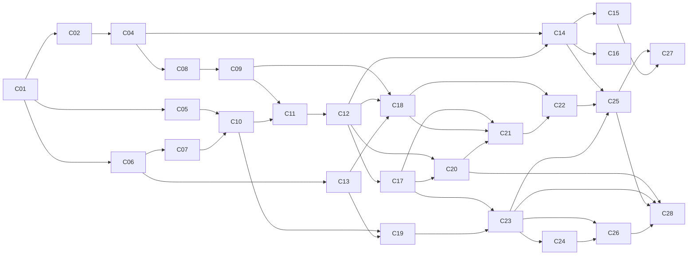

# Proyecto Final — Descomposición en changes OpenSpec

**Documento hermano de:** [proyecto-final-diseno-rag-joiabagur.md](proyecto-final-diseno-rag-joiabagur.md)
**Ventana de ejecución:** 1 de agosto → 3 de septiembre de 2026 — *sin margen asumido*
**Equipo:** **2 desarrolladores** — **Dev A** (IA/Python) · **Dev B** (Backend .NET, frontend, infraestructura)
**Total:** 29 changes · ~3 por persona y semana
**Variante archivada:** [proyecto-final-plan-changes-openspec-3devs.md](proyecto-final-plan-changes-openspec-3devs.md) — 43 changes para 3 personas, **no vigente**

---

## 1. Cómo se usa este documento

Cada entrada es **un change OpenSpec completo**, ejecutable de principio a fin en **una sesión de 2-3 horas**, siguiendo el ciclo del repositorio:

```text
/opsx:propose (proposal.md · design.md · tasks.md · specs/<capability>/spec.md)
  → /opsx:apply  (código + tests)
  → /opsx:verify (build + tests verdes + revisión de alcance)
  → /opsx:archive (openspec/changes/archive/YYYY-MM-DD-<change-id>/)
```

**Definition of Done común a los 29 changes** (no se repite en cada ficha):

- [ ] Artefactos OpenSpec creados y `openspec validate` en verde
- [ ] Código aplicado, `dotnet build` / `uv run pytest` / `npm run build` sin errores
- [ ] **Tests unitarios nuevos, verdes**, con la nomenclatura de la zona (§2)
- [ ] Tests existentes sin regresión
- [ ] Documentación afectada actualizada (`Documentos/`, `docs/`, README del servicio)
- [ ] Change archivado el mismo día

**Reglas transversales de testing:**

- **Ninguna llamada real a un LLM ni a un proveedor de embeddings en tests unitarios.** Fakes inyectados + fixtures grabadas en `ai-service/tests/fixtures/`.
- Tests que necesiten PostgreSQL: Testcontainers (.NET, ya en uso) o contenedor efímero con pgvector (Python).
- Generadores de datos: tests de **propiedades** (invariantes), no de valores concretos — la semilla fija hace el resto.
- Cobertura esperada: la lógica nueva de dominio/servicio, no los DTOs.

**Regla de oro con dos personas:** ningún change puede bloquear a más de dos posteriores. Si uno se alarga más de una sesión, se parte y se entrega la mitad que desbloquea al otro desarrollador.

---

## 2. Convenciones y zonas de código

| Elemento | Convención | Ejemplo |
|---|---|---|
| ID de change | kebab-case, verbo primero | `add-vector-retrieval-endpoint` |
| Etiqueta de orden | `C01`…`C29` (solo en este documento) | `C14` |
| Test .NET | `Method_Scenario_ExpectedResult` | `Search_WithPosFilter_ExcludesUnassigned` |
| Test frontend | `should [behavior] when [condition]` | `should show variant warning when family has siblings` |
| Test Python | `test_<unidad>_<escenario>_<esperado>` | `test_rrf_fuses_ranked_lists_preserving_top_hit` |

Dos changes son **paralelizables** si (a) ninguno es prerequisito del otro y (b) sus zonas no se solapan. Con dos personas, la frontera es casi siempre limpia porque coincide con la frontera del servicio.

| Zona | Ruta | Dueño |
|---|---|---|
| `PY-CORE` | `ai-service/src/jbg_ai/api/`, `config/` | Dev A |
| `PY-DATA` | `ai-service/src/jbg_ai/data/generators/` | Dev A/B |
| `PY-ENRICH` | `ai-service/src/jbg_ai/enrichment/` | Dev A |
| `PY-INDEX` | `ai-service/src/jbg_ai/indexing/` | Dev A |
| `PY-RETR` | `ai-service/src/jbg_ai/retrieval/` | Dev A |
| `PY-ASSIST` | `ai-service/src/jbg_ai/assist/` | Dev A |
| `PY-EVAL` | `ai-service/src/jbg_ai/evals/`, `ai-service/evals/` | Dev A/B |
| `NET-DOM` | `backend/src/JoiabagurPV.Domain/`, `Infrastructure/Data/` | Dev B |
| `NET-APP` | `backend/src/JoiabagurPV.Application/` | Dev B |
| `NET-API` | `backend/src/JoiabagurPV.API/Controllers/` | Dev B |
| `FE` | `frontend/src/` | Dev B |
| `INFRA` | `docker-compose.yml`, `.github/workflows/`, `terraform/` | Dev B |
| `DOCS` | `docs/`, `Documentos/`, `README.md` | ambos |

---

## 3. Tabla maestra (orden cronológico estricto)

| # | Change ID | Zona | Dev | Prerequisitos | Paralelo con |
|---|---|---|---|---|---|
| **C01** | `init-ai-service-skeleton` | PY-CORE, INFRA | A | — | C03 |
| **C02** | `add-ai-service-contracts-and-auth` | PY-CORE | A | C01 | C03 |
| **C03** | `add-product-search-event-tracking` | NET-DOM, NET-API | B | — | C01, C02 |
| **C04** | `add-dotnet-ai-gateway-client` | NET-APP | B | C02 | C05, C06 |
| **C05** | `add-pgvector-schema-foundation` | PY-INDEX, INFRA | A | C01 | C04, C06 |
| **C06** | `add-synthetic-catalog-generator` | PY-DATA | B | C01 | C04, C05 |
| **C07** | `add-catalog-enrichment-pipeline` | PY-ENRICH | A | C06 | C08, C09 |
| **C08** | `add-product-ai-profile-entity` | NET-DOM, NET-APP, NET-API | B | C04 | C07, C10 |
| **C09** | `add-dotnet-index-feed-endpoints` | NET-API, NET-APP | B | C08 | C10 |
| **C10** | `add-source-text-and-embedding-client` | PY-INDEX | A | C05, C07 | C08, C09 |
| **C11** | `add-product-document-indexer` | PY-INDEX | A | C10 | C13 |
| **C12** | `add-vector-retrieval-endpoint` | PY-RETR | A | C11 | C13 |
| **C13** | `add-synthetic-world-simulator` | PY-DATA | B | C06 | C11, C12 |
| **C14** | `add-dotnet-ai-search-endpoint` | NET-API, NET-APP | B | C04, C12 | C16 |
| **C15** | `add-frontend-assisted-search-panel` | FE | B | C14 | C16, C17 |
| **C16** | `add-ai-service-deployment` | INFRA | B | C14 | C17, C18 |
| **C17** | `add-hybrid-search-rrf` | PY-RETR | A | C12 | C15, C16 |
| **C18** | `add-pos-projection-and-hard-filters` | PY-RETR, PY-INDEX | A | C12, C09, C13 | C16, C19 |
| **C19** | `add-knowledge-corpus-and-indexer` | PY-DATA, PY-INDEX | B | C10, C13 | C17, C18 |
| **C20** | `add-eval-harness-golden-set-and-baselines` | PY-EVAL | **A+B** | C12, C17 | — |
| **C21** | `add-business-signals-ranking` | PY-RETR | A | C17, C18, C20 | C22 |
| **C22** | `add-substitutes-retrieval` | PY-RETR | B | C18, C21 | C23 |
| **C23** | `add-assist-generation-with-citations` | PY-ASSIST | A | C17, C19 | C22, C24 |
| **C24** | `add-guardrails-and-intent-router` | PY-ASSIST | A | C23 | C25 |
| **C25** | `add-dotnet-assist-and-substitutes-endpoints` | NET-API, NET-APP | B | C22, C23, C14 | C24, C26 |
| **C26** | `add-sales-assistant-agent-loop` | PY-ASSIST | A | C23, C24 | C25, C27 |
| **C27** | `add-frontend-assist-card` | FE | B | C25, C15 | C26, C28 |
| **C28** | `add-generation-and-agent-evals` | PY-EVAL, NET-APP | A | C20, C23, C25, C26 | C27 |
| **C29** | `finalize-pf-readme-and-evidence` | DOCS | **A+B** | todos | — |

---

## 4. Fichas de los changes

### Ola 0 — Cimientos y contratos (1-3 ago)

---

#### C01 · `init-ai-service-skeleton` — Dev A

**Objetivo.** Crear el servicio Python `jbg-ai` vacío pero ejecutable: estructura con `uv`, FastAPI, configuración por entorno, `GET /health`, contenedor y entrada en `docker-compose`.
**Prerequisitos.** ninguno · **Paralelo.** C03
**Alcance.** `ai-service/` con `pyproject.toml`, `src/jbg_ai/api/main.py`, `config/settings.py` (pydantic-settings), logging estructurado con `trace_id`, `Dockerfile`, servicio en `docker-compose.yml` en red interna sin publicar puerto, `README.md` del servicio.
**Tests.** `test_health_returns_ok_with_version`; `test_settings_fail_fast_when_required_env_missing`; smoke de arranque con `TestClient`.
**Tarea extra obligatoria.** Verificar en la consola de AWS que RDS admite `CREATE EXTENSION vector` y dejarlo anotado. Si no lo admitiera, el plan B (contenedor Postgres+pgvector en la misma EC2) hay que saberlo hoy, no el 25 de agosto.

---

#### C02 · `add-ai-service-contracts-and-auth` — Dev A

**Objetivo.** **Congelar el contrato** de los 5 endpoints con modelos Pydantic, stubs deterministas y la autenticación de servicio. Es el change que permite que las dos personas trabajen sin esperarse durante un mes.
**Prerequisitos.** C01 · **Paralelo.** C03
**Alcance.** Routers `retrieval`, `assist`, `index`, `enrich`; modelos request/response completos (§6.8 del diseño); stubs tras flag `STUB_MODE`; dependencia FastAPI que valida el JWT interno HS256 y extrae `user_id`/`role`/`pos_id`/`trace_id`; OpenAPI exportado a `ai-service/openapi.json` versionado en git.
**Tests.** `test_retrieval_stub_matches_response_schema`; `test_assist_stub_returns_citations_field`; `test_openapi_snapshot_is_stable` (rompe el build si alguien cambia el contrato sin avisar); `test_request_without_token_is_rejected`; `test_pos_id_from_token_overrides_body_value` (**el body no manda**); `test_health_is_public`.

---

#### C03 · `add-product-search-event-tracking` — Dev B

**Objetivo.** Telemetría consulta→selección desde el primer día. Se hace ahora porque no depende de nada y arranca a Dev B sin esperar al contrato.
**Prerequisitos.** ninguno · **Paralelo.** C01, C02
**Alcance.** Entidad `ProductSearchEvent` (consulta, filtros, resultados, seleccionado, rank, duración, POS, usuario), migración EF Core, `POST /api/ai/search-events`, índices por fecha y POS.
**Tests.** `Create_WithValidPayload_PersistsEvent`; `Create_WhenPosNotAssignedToUser_Returns403`; `Create_WithOversizedResultsJson_Truncates`; test de migración con Testcontainers.

---

#### C04 · `add-dotnet-ai-gateway-client` — Dev B

**Objetivo.** Cliente tipado hacia `jbg-ai` con resiliencia desde el primer día, contra los stubs de C02.
**Prerequisitos.** C02 · **Paralelo.** C05, C06
**Alcance.** `IAiGatewayClient` + `AiGatewayClient` (typed `HttpClient`), políticas Polly (0,8 s retrieval / 5 s assist, reintento único, circuit breaker), emisión y firma del JWT interno, propagación de `trace_id`, configuración en `appsettings` + SSM.
**Tests.** `SearchAsync_WhenServiceReturns200_MapsResponse`; `SearchAsync_WhenTimeout_ThrowsAiUnavailable`; `SearchAsync_WhenCircuitOpen_FailsFastWithoutCall`; `BuildToken_IncludesPosAndRoleClaims`. Con `HttpMessageHandler` falso, sin red.

---

### Ola 1 — Datos, esquema y perfil (4-10 ago)

---

#### C05 · `add-pgvector-schema-foundation` — Dev A

**Objetivo.** Persistencia lista: extensión `vector`, esquema `ai`, usuario dedicado, Alembic y tablas vacías con sus índices.
**Prerequisitos.** C01 · **Paralelo.** C04, C06
**Alcance.** `CREATE EXTENSION vector`; esquema `ai`; migración inicial con `ai.product_document`, `ai.knowledge_document`, `ai.knowledge_chunk`, `ai.pos_projection`; índices **HNSW `vector_cosine_ops`**, GIN sobre `tsv` y `metadata`, B-tree sobre `variant_group_key`/`piece_type`/`price_band`; pool acotado a 5 conexiones (restricción del proyecto).
**Tests.** `test_migration_creates_vector_extension_and_ai_schema`; `test_hnsw_index_uses_cosine_operator_class` (consulta a `pg_indexes`; protege del antipatrón que desactiva el índice sin error); `test_upgrade_downgrade_is_reversible`.

---

#### C06 · `add-synthetic-catalog-generator` — Dev B

**Objetivo.** Catálogo sintético (D1) determinista y con el ruido dirigido que hace realista el problema. Lo hace Dev B porque es Python autocontenido, no bloquea a nadie y equilibra la carga de la semana.
**Prerequisitos.** C01 · **Paralelo.** C04, C05
**Alcance.** Generador con semilla → 900-1.200 productos, ~350 familias con variantes S/M/L, 8-12 colecciones, precios 15-450 €; ruido: ~30 % descripciones pobres, 3-4 convenciones de SKU, familias confundibles. Salida a JSONL versionado + carga vía API .NET.
**Tests.** `test_generator_is_deterministic_for_same_seed`; `test_skus_are_unique`; `test_variant_families_share_group_key`; `test_price_distribution_within_expected_bands`; `test_poor_description_ratio_is_within_tolerance`.

---

#### C07 · `add-catalog-enrichment-pipeline` — Dev A

**Objetivo.** Convertir un producto crudo en un perfil IA propuesto: extracción estructurada, vocabularios cerrados, confianza por campo y puertas de calidad de lote.
**Prerequisitos.** C06 · **Paralelo.** C08, C09
**Alcance.** Normalización determinista previa (tallas por regex, unidades); prompt **v1 versionado** en `ai-service/prompts/enrichment/v1.md` + JSON schema estricto a temperatura 0; vocabularios cerrados; confianza **por campo**; validadores de lote (unicidad SKU, cobertura de tags ≥ 90 %, obligatorios); enrutado auto-aprobado / revisión / rechazado; `POST /v1/enrich/products` real.
**Tests.** Con LLM falso y fixtures: `test_extraction_rejects_value_outside_closed_vocabulary`; `test_size_regex_extracts_label_before_llm_call`; `test_low_confidence_field_flags_review`; `test_malformed_llm_json_raises_domain_error_not_crash`; `test_batch_fails_when_tag_coverage_below_threshold`.
**Nota de tamaño.** Es el change más denso de la ola. Si se desborda, se parte: pipeline + prompt en una sesión, puertas de calidad en otra.

---

#### C08 · `add-product-ai-profile-entity` — Dev B

**Objetivo.** Persistir en .NET el perfil IA revisable, con enriquecimiento por lote y revisión por excepción.
**Prerequisitos.** C04 · **Paralelo.** C07, C10
**Alcance.** Entidad `ProductAiProfile` (campos de §4.6 de las specs, recortados), migración EF Core, repositorio, `POST /api/ai/catalog/enrich-batch` (admin), auto-aprobación por umbral y marcado de pendientes de revisión.
**Tests.** `EnrichBatch_AsOperator_Returns403`; `EnrichBatch_WhenGatewayUnavailable_ReturnsServiceUnavailable`; `AutoApprove_WhenConfidenceAboveThreshold_SkipsManualReview`; `Review_WhenApproved_SetsReviewerAndTimestamp`; test de migración.

---

#### C09 · `add-dotnet-index-feed-endpoints` — Dev B

**Objetivo.** Dar a Python su única vía de lectura de datos de negocio: feeds HTTP paginados con cursor.
**Prerequisitos.** C08 · **Paralelo.** C10
**Alcance.** `GET /api/ai/index-feed/catalog?since=` (productos + perfil aprobado) y `GET /api/ai/index-feed/pos-availability?since=` (asignación, `qty_bucket`, ventas 30/90 d); paginación obligatoria (máx. 50); solo autenticación de servicio.
**Tests.** `CatalogFeed_WithSinceCursor_ReturnsOnlyChangedRows`; `CatalogFeed_ExcludesUnapprovedProfiles`; `PosAvailabilityFeed_ReturnsBucketNotExactQuantity`; `Feed_WithUserJwt_Returns403`.

---

#### C10 · `add-source-text-and-embedding-client` — Dev A

**Objetivo.** `SourceText` canónico, `SourceHash` e idempotencia de embeddings. Es lo que hace barato y determinista todo el reindexado posterior.
**Prerequisitos.** C05, C07 · **Paralelo.** C08, C09
**Alcance.** Constructor de `doc_text` con orden de campos fijo; `source_hash` SHA-256; cliente de embeddings con reintento, batching y caché por hash; columnas `embedding_model`/`embedding_version`.
**Tests.** `test_source_text_is_stable_for_same_profile`; `test_hash_changes_when_any_indexed_field_changes`; `test_embedding_not_recomputed_when_hash_unchanged`; `test_batch_client_respects_max_batch_size`.

---

### Ola 2 — Slice vertical desplegado (11-17 ago)

> **Hito de la ola:** el 17 de agosto un operador busca en lenguaje natural desde `pv.joiabagur.com` y ve resultados con stock real. Con dos personas, integrar y desplegar pronto es la única defensa contra una sorpresa de infraestructura en la última semana.

---

#### C11 · `add-product-document-indexer` — Dev A

**Objetivo.** Poblar `ai.product_document` y dejar el índice consultable y observable.
**Prerequisitos.** C10 · **Paralelo.** C13
**Alcance.** Upsert idempotente por `product_id` consumiendo el feed de C09; `tsvector` con configuración `'spanish'`; `POST /v1/index/sync` (cursor `since`) y `GET /v1/index/status` (documentos, vectores, drift, última sincronización).
**Tests.** `test_upsert_is_idempotent_for_same_source_hash`; `test_tsvector_uses_spanish_configuration`; `test_status_reports_drift_when_documents_missing_embedding`; `test_deactivated_product_is_excluded_from_index`.

---

#### C12 · `add-vector-retrieval-endpoint` — Dev A

**Objetivo.** Primera recuperación real: vectorial pura con top-k, umbral y abstención explícita.
**Prerequisitos.** C11 · **Paralelo.** C13
**Alcance.** `POST /v1/retrieval/products` real (retira el stub): embedding de consulta, `<=>` sobre HNSW, `top_k` por defecto 10, umbral configurable, `low_confidence: true` con lista vacía cuando nada lo supera; log estructurado por etapa con `trace_id`.
**Tests.** `test_returns_empty_with_low_confidence_when_all_above_threshold`; `test_respects_top_k_limit`; `test_results_ordered_by_ascending_distance`; `test_trace_id_from_header_appears_in_stage_logs`.

---

#### C13 · `add-synthetic-world-simulator` — Dev B

**Objetivo.** Red de POS, inventario e histórico de ventas (D5, D6, D7), coherentes por construcción con el catálogo.
**Prerequisitos.** C06 · **Paralelo.** C11, C12
**Alcance.** 10-14 POS (1 central + hoteles) con perfil de clientela y estacionalidad; matriz de propensión producto×POS; 5.000-9.000 filas de inventario respetando `Inventory.IsActive`; simulación Poisson con estacionalidad → 15.000-25.000 ventas sobre 14-18 meses; movimientos de inventario derivados.
**Tests.** `test_every_pos_has_assigned_products`; `test_inventory_quantity_never_negative`; `test_no_sale_without_stock_at_that_pos`; `test_seasonality_peaks_match_pos_profile`; `test_simulation_is_deterministic_for_same_seed`.
**Nota de tamaño.** Sesión larga (3 h). Si se desborda: POS+inventario en una, simulación de ventas en otra.

---

#### C14 · `add-dotnet-ai-search-endpoint` — Dev B

**Objetivo.** El endpoint que consume el frontend, con **hidratación** de precio/stock y degradación al buscador léxico existente.
**Prerequisitos.** C04, C12 · **Paralelo.** C16
**Alcance.** `POST /api/ai/search`: llama al gateway, hidrata desde PostgreSQL (precio, stock exacto, foto, permisos), **descarta** candidatos que ya no cumplen, feature flag por POS, `ai_available: false` + resultados léxicos cuando el circuito está abierto.
**Tests.** `Search_HydratesPriceAndStockFromDatabase_NotFromAiResponse`; `Search_WhenAiUnavailable_FallsBackToLexicalSearch`; `Search_DropsCandidateUnassignedToPos`; `Search_WhenFeatureFlagOff_UsesLegacySearch`; integración con Testcontainers.

---

#### C15 · `add-frontend-assisted-search-panel` — Dev B

**Objetivo.** El punto de entrada del operador: panel "Buscar con ayuda" integrado en el flujo de venta.
**Prerequisitos.** C14 · **Paralelo.** C16, C17
**Alcance.** `ai-search.service.ts`; panel con input natural, filtros rápidos, POS preseleccionado; resultados con foto, SKU, nombre, talla, precio, stock y motivo; estados de carga, vacío y degradado (`ai_available: false`); envío de `ProductSearchEvent`; botón "Seleccionar para venta" que prellena el flujo existente (`productId` por state, patrón ya usado en `scan.tsx`).
**Tests (Vitest + MSW).** `should render results with reason when search succeeds`; `should show legacy results banner when ai is unavailable`; `should emit search event when a result is selected`; `should navigate to sale page with productId when selecting`.

---

#### C16 · `add-ai-service-deployment` — Dev B

**Objetivo.** Servicio en producción **el 17 de agosto**, accesible solo desde el backend, con salud visible.
**Prerequisitos.** C14 · **Paralelo.** C17, C18
**Alcance.** Dockerfile de producción, workflow `deploy-ai-service.yml` (OIDC + ECR, patrón existente), secretos en SSM, `CREATE EXTENSION vector` en RDS, red interna sin exposición en nginx, `/health` enriquecido y tarjeta de estado en el dashboard de admin.
**Tests.** Smoke post-deploy automatizado (`/health` con BD y proveedor OK); `Dashboard_ShowsAiServiceHealth`; validación del workflow en rama de prueba.

---

### Ola 3 — Calidad de recuperación y medición (18-24 ago)

---

#### C17 · `add-hybrid-search-rrf` — Dev A

**Objetivo.** Añadir la rama léxica y fusionar con RRF, para que "ERIZO-M" deje de diluirse en el vector. Incluye la extracción de filtros por reglas.
**Prerequisitos.** C12 · **Paralelo.** C15, C16
**Alcance.** Búsqueda `ts_rank` en español sobre `tsv`, *boost* de coincidencia exacta de SKU y nombre, fusión Reciprocal Rank Fusion con `k` configurable, `match_reasons` por resultado; extracción **por reglas** de filtros estructurales de la consulta (`menos de 80`, `talla M`, tipo de pieza) con *fallback* a consulta cruda.
**Tests.** `test_exact_sku_query_ranks_target_first`; `test_rrf_fuses_ranked_lists_preserving_top_hit`; `test_paraphrase_query_recovered_by_vector_branch_only`; `test_extracts_price_ceiling_from_natural_phrase`; `test_never_invents_filter_absent_from_query`.

---

#### C18 · `add-pos-projection-and-hard-filters` — Dev A

**Objetivo.** Aplicar los filtros duros **antes** del ranking (nunca como post-filtro) y mantener la proyección de disponibilidad por POS.
**Prerequisitos.** C12, C09, C13 · **Paralelo.** C16, C19
**Alcance.** Sincronización de `ai.pos_projection` desde el feed de C09 (`qty_bucket`, `sales_30d/90d`, `last_sale_at`); filtro pre-ranking por producto activo + asignado al POS + rol; marca de frescura en la respuesta.
**Tests.** `test_products_not_assigned_to_pos_are_excluded_before_ranking`; `test_inactive_product_never_returned`; `test_projection_stores_bucket_not_exact_quantity`; `test_stale_projection_is_flagged_in_response`.

---

#### C19 · `add-knowledge-corpus-and-indexer` — Dev B

**Objetivo.** Segundo índice: corpus de conocimiento comercial troceado — lo que permite generar con citas verificables — más las fichas estáticas por POS.
**Prerequisitos.** C10, C13 · **Paralelo.** C17, C18
**Alcance.** 40-60 documentos (cuidados, materiales, equivalencias de talla, guiones de venta, políticas, FAQ) generados y curados; **10-14 fichas por POS** derivadas de métricas calculadas sobre D7 (tipos y materiales top, banda de precio frecuente, ticket medio) — sustituyen al argumentario como servicio; chunking por secciones; indexación en `ai.knowledge_chunk` reutilizando el cliente de C10.
**Tests.** `test_chunker_preserves_section_titles_in_metadata`; `test_chunk_size_within_bounds`; `test_every_chunk_has_traceable_document_id`; `test_pos_sheet_only_states_metrics_present_in_sales_data`.
**Conflicto.** Toca `PY-INDEX` como C11/C18: usa `indexing/knowledge.py`, **no** modifica `indexing/products.py` ni `indexing/embeddings.py` (congelado en C10).

---

#### C20 · `add-eval-harness-golden-set-and-baselines` — **Dev A + Dev B**

**Objetivo.** La pieza que convierte "parece que va mejor" en números: golden set etiquetado por los dos, runner, métricas y las dos líneas base.
**Prerequisitos.** C12, C17 · **Paralelo.** — (bloquea a C21 y C28; es el change más crítico del proyecto)
**Alcance.** Tablas `ai.eval_run/case/result`; golden set de **60-70 consultas** en 7 categorías con relevancia graduada 0-2, construido por *pooling* y **etiquetado por separado por ambos con conciliación de discrepancias**; CLI `uv run evals run --config vX`; métricas Recall@5, nDCG@5, MRR, P@3, tasa de abstención, p50/p95, coste; configs `v0-lexico` (replica el buscador .NET actual) y `v0-cag` (catálogo del POS en contexto con *prompt caching*); informe markdown + JSON versionado en `ai-service/evals/results/`.
**Tests.** `test_ndcg_matches_hand_computed_value_on_fixture`; `test_recall_at_k_counts_graded_relevance_correctly`; `test_run_is_reproducible_for_same_config_and_seed`; `test_lexical_baseline_matches_dotnet_search_semantics`; `test_cag_baseline_respects_context_budget`; `test_cost_per_query_is_recorded_for_each_config`.
**Nota de planificación.** Se ejecuta en dos sesiones deliberadamente: una para el runner y las configs (Dev A), otra conjunta para el etiquetado (2 h a cuatro manos). Tope duro de 2 h por persona en etiquetado: antes se recorta a 45 consultas que renunciar al doble etiquetado.

---

#### C21 · `add-business-signals-ranking` — Dev A

**Objetivo.** Incorporar disponibilidad y rotación como reordenación suave, con pesos **calibrados contra el golden set**, no elegidos a ojo.
**Prerequisitos.** C17, C18, C20 · **Paralelo.** C22
**Alcance.** Señales `qty_bucket` y `sales_30d`; penalizaciones por stock cero y variante ambigua; barrido de pesos sobre el golden set y fijación del ganador; re-fijación del umbral de similitud con la distribución empírica observada; producción de la **tabla de ablations v0→v3** para el README.
**Tests.** `test_out_of_stock_product_ranks_below_equivalent_in_stock`; `test_weights_load_from_config_not_hardcoded`; `test_ambiguous_variant_penalty_applies_only_within_family`; `test_calibration_sweep_is_reproducible`.

---

#### C22 · `add-substitutes-retrieval` — Dev B

**Objetivo.** Sustitutos cuando no hay stock, reutilizando el retriever con filtro invertido y señales explicables.
**Prerequisitos.** C18, C21 · **Paralelo.** C23
**Alcance.** `POST /v1/retrieval/substitutes`: similitud sobre el documento del producto origen, misma familia primero, filtro de disponibilidad en el POS destino, banda de precio próxima, `similarity_signals` por candidato.
**Tests.** `test_same_family_variant_ranks_first_when_available`; `test_excludes_out_of_stock_when_flag_enabled`; `test_price_difference_within_configured_band`; `test_source_product_never_returned_as_own_substitute`.
**Primero en la línea de corte** (§6).

---

### Ola 4 — Asistente, agente y evaluación (25-31 ago)

---

#### C23 · `add-assist-generation-with-citations` — Dev A

**Objetivo.** Capa de generación: agrupación por variantes, motivo por candidato, argumentario fundamentado con citas y **placeholders** para toda cifra.
**Prerequisitos.** C17, C19 · **Paralelo.** C22, C24
**Alcance.** `POST /v1/assist/sale` real; agrupación por `variant_group_key` con talla destacada; `pitch` anclado al perfil y a chunks de conocimiento con `citations[]`; `warnings[]`; **prohibición estructural de emitir números de precio/stock** (se emiten `{{price}}` / `{{stock}}`); prompt versionado en `ai-service/prompts/assist/v1.md`.
**Tests.** `test_response_contains_no_literal_price_or_stock_number`; `test_citations_reference_retrieved_chunk_ids_only`; `test_variants_grouped_under_single_family_entry`; `test_returns_clarification_when_query_is_ambiguous`.

---

#### C24 · `add-guardrails-and-intent-router` — Dev A

**Objetivo.** Que el sistema sepa cuándo no debe responder y no se deje instruir por la consulta.
**Prerequisitos.** C23 · **Paralelo.** C25
**Alcance.** Clasificador de intención (catálogo / conocimiento / ambos / fuera de dominio); rechazo cortés sin llamar al retriever; consulta tratada como dato; validación de la salida contra JSON schema con reintento único.
**Tests.** `test_out_of_domain_query_short_circuits_before_retrieval`; `test_prompt_injection_in_query_does_not_change_system_behavior`; `test_invalid_model_output_triggers_single_retry_then_safe_error`; `test_intent_router_sends_care_question_to_knowledge_index`.

---

#### C25 · `add-dotnet-assist-and-substitutes-endpoints` — Dev B

**Objetivo.** Exponer venta asistida y sustitutos con la misma disciplina de hidratación, resolviendo los placeholders.
**Prerequisitos.** C22, C23, C14 · **Paralelo.** C24, C26
**Alcance.** `GET /api/ai/products/{id}/sales-assist` y `GET /api/ai/products/{id}/substitutes?pointOfSaleId=`; **sustitución de `{{price}}` / `{{stock}}`** por valores reales del hidratador; **rechazo de la respuesta si queda algún placeholder sin resolver**.
**Tests.** `SalesAssist_ReplacesPlaceholdersWithRealValues`; `SalesAssist_WhenPlaceholderUnresolved_ReturnsErrorInsteadOfRawTemplate`; `Substitutes_ExcludesProductsWithoutStockAtTargetPos`; `SalesAssist_AsOperatorOfAnotherPos_Returns403`.
**Conflicto.** Mismo controlador que C14 → nunca simultáneos.

---

#### C26 · `add-sales-assistant-agent-loop` — Dev A

**Objetivo.** La capa de decisión: bucle con function calling, tools de solo lectura y presupuesto duro.
**Prerequisitos.** C23, C24 · **Paralelo.** C25, C27
**Alcance.** Tools `buscar_catalogo`, `consultar_disponibilidad`, `listar_variantes`, `buscar_sustitutos`, `consultar_conocimiento`, `pedir_aclaracion`; máximo 5 iteraciones / 6 llamadas; errores como datos; `partial: true` al agotar presupuesto; **ninguna tool escribe**; decorador de trazado que registra decisión, tools, tokens y coste por iteración.
**Tests.** `test_loop_stops_at_iteration_budget_and_flags_partial`; `test_tool_error_is_returned_as_data_not_exception`; `test_out_of_stock_query_triggers_substitutes_tool`; `test_no_registered_tool_performs_writes` (introspección del registro); `test_token_usage_accumulated_across_iterations`.

---

#### C27 · `add-frontend-assist-card` — Dev B

**Objetivo.** Cerrar el flujo visible: card de venta asistida con desambiguación de variantes, citas y sustitutos.
**Prerequisitos.** C25, C15 · **Paralelo.** C26, C28
**Alcance.** Card con argumentario, avisos y citas desplegables; bloque de variantes con talla destacada y **confirmación explícita antes de vender**; bloque de sustitutos cuando `stock = 0`.
**Tests.** `should require size confirmation when family has multiple variants`; `should show substitutes block when selected product is out of stock`; `should render citations when pitch has sources`; `should hide assist card when ai is unavailable`.

---

#### C28 · `add-generation-and-agent-evals` — Dev A

**Objetivo.** Cerrar la evaluación: el validador anti-alucinación (la pieza de mayor retorno del proyecto), RAGAS, escenarios de agente y casos adversarios.
**Prerequisitos.** C20, C23, C25, C26 · **Paralelo.** C27
**Alcance.** (1) **Validador determinista** que extrae toda cifra de precio/stock de la respuesta final y la contrasta con el hidratador, con umbral de **cero fallos**, más su equivalente en .NET antes de responder al cliente; (2) **RAGAS** (faithfulness, answer relevancy, context precision, context recall) sobre el subconjunto con citas; (3) **20-25 escenarios de agente** multi-turno con éxito definido; (4) **20-25 casos adversarios** con criterio de bloqueo por categoría. Todo integrado en el runner e informe de C20.
**Tests.** `test_detects_injected_fake_price_in_response`; `test_passes_when_all_numbers_match_hydrator`; `test_ignores_numbers_that_are_sizes_or_skus`; `test_scenario_runner_replays_multi_turn_conversation`; `test_injection_cases_all_blocked`; .NET: `Response_WithUnverifiedNumber_IsRejected`.
**Nota de tamaño.** Es el change más grande del plan. Orden obligatorio si hay que partirlo: validador → escenarios de agente → adversarios → RAGAS. RAGAS es lo primero que se cae.

---

### Ola 5 — Entrega (1-3 sep)

---

#### C29 · `finalize-pf-readme-and-evidence` — **Dev A + Dev B**

**Objetivo.** Empaquetar la entrega para que un evaluador externo entienda, reproduzca y pruebe el sistema.
**Prerequisitos.** todos · **Paralelo.** —
**Alcance.** README del PF (dominio y problema, diagrama, decisiones justificadas, CAG/RAG/agentes/evaluación/despliegue, arranque local, **los dos integrantes**, limitaciones y próximos pasos); **tabla final de ablations v0→v3**; sección sobre el reranking descartado con su protocolo de medición; progresión de prompts v1→v2 con impacto medido; guion y grabación del vídeo de 2-3 min; usuario demo de solo lectura; `docker compose up` verificado desde cero; rama `finalproject-[INICIALES]` y tag `v1.0-final-[INICIALES]`.
**Reparto.** Dev A: secciones de IA, evaluación y tablas. Dev B: arquitectura, despliegue, arranque local, vídeo.
**Tests.** Ensayo de reproducibilidad en máquina limpia y `openspec validate --all`.

---

## 5. Grafo de dependencias



---

## 6. Calendario y paralelismo real

| Ola | Fechas | Dev A (IA/Python) | Dev B (Producto) |
|---|---|---|---|
| **0** | 1-3 ago | C01 → C02 | C03 → C04 |
| **1** | 4-10 ago | C05 → C07 → C10 | C06 → C08 → C09 |
| **2** | 11-17 ago | C11 → C12 → *(apoyo C14)* | C13 → C14 → C15 → C16 |
| **3** | 18-24 ago | C17 → C18 → **C20** → C21 | C19 → **C20** → C22 |
| **4** | 25-31 ago | C23 → C24 → C26 → C28 | C25 → C27 → *(apoyo C28)* |
| **5** | 1-3 sep | C29 (IA, evals, tablas) | C29 (arquitectura, despliegue, vídeo) |

**Puntos de sincronización obligatorios** (los únicos momentos en que una persona espera a la otra):

| Cuándo | Quién espera a quién | Qué se entrega |
|---|---|---|
| 3 ago | Dev B espera C02 | Contrato + stubs → desbloquea C04 |
| 5-6 ago | Dev A espera C06 | Catálogo sintético → desbloquea C07 |
| ~8 ago | Dev A espera C09 | Feeds → desbloquea C11 |
| 13-14 ago | Dev B espera C12 | Recuperación real → desbloquea C14 |
| ~19 ago | Dev A espera C13 | Mundo simulado → desbloquea C18 |
| 21-22 ago | **ambos** | Sesión conjunta de etiquetado (C20) |
| ~27 ago | Dev B espera C23 | Generación → desbloquea C25 |

### Pares que NO deben ejecutarse en paralelo aunque no haya dependencia lógica

| Par | Motivo |
|---|---|
| C14 ‖ C25 | Mismo controlador `AiController.cs` |
| C15 ‖ C27 | Misma página y servicio del frontend |
| C03 ‖ C08 | Dos migraciones EF Core simultáneas → colisión de orden |
| C11 ‖ C10 | C11 depende del cliente de embeddings congelado en C10 |
| C17 ‖ C21 | Ambos tocan el pipeline de ranking en `retrieval/` |
| C19 ‖ C11 | Zona `PY-INDEX` compartida: separar por fichero (`knowledge.py` vs `products.py`) y no solapar en el tiempo si hay dudas |

**Regla operativa para migraciones EF Core:** solo un change con migración activo a la vez; quien la crea avisa y la mergea antes de que empiece la siguiente. Con dos personas y cuatro migraciones en todo el proyecto (C03, C08), esto es trivial de cumplir.

---

## 7. Líneas de corte

Si el **24 de agosto** el sistema no está desplegado y sin la tabla de ablations hecha, se abandona en este orden exacto:

1. **C22** (sustitutos) → se documenta como próximo paso; el retriever ya lo soportaría
2. **RAGAS dentro de C28** → se conservan validador anti-alucinación y métricas de recuperación
3. **C27** (card de venta asistida) → se fusiona en C15 con una versión simplificada
4. **C19** 40-60 → 20 documentos, manteniendo las citas y las fichas por POS
5. **Golden set de C20** 70 → 45 consultas, sacrificando categorías, **nunca el etiquetado doble**
6. **C24** (guardrails) → mínimo viable (clasificador de intención) dentro de C23

**Nunca se recortan:** C01, C02, C04, C05, C06, C07, C10, C11, C12, C14, C15, C16, C17, C18, C20, C23, C26, C28 (validador), C29. Son el conjunto mínimo que hace evaluable el Proyecto Final: corpus, índice, retriever híbrido con filtros, agente con tools, harness con ablations, validador anti-alucinación, despliegue y README.

### Si apareciera margen (no se planifica con él)

En orden de retorno por hora: (1) `evaluate-cross-encoder-reranking` — cierra el único hueco argumental; (2) `add-pos-sales-profile-service` — argumentario como servicio en vez de fichas estáticas; (3) `add-semantic-response-cache`; (4) `add-langsmith-tracing`; (5) `add-replenishment-agent-batch` + entidad `InventoryRecommendation`; (6) ampliar el golden set y extraer filtros con LLM.

---

## 8. Riesgos específicos de esta descomposición

| Riesgo | Mitigación |
|---|---|
| **Una baja de una semana se lleva el 25 % de la capacidad** | Slice vertical desplegado el 17 ago (C16); a partir de ahí siempre hay algo demostrable. Cortes definidos de antemano, no improvisados |
| C02 se queda corto y el contrato cambia en la ola 4, invalidando C04/C14/C15 | `test_openapi_snapshot_is_stable` (C02): cualquier cambio rompe el build y se negocia entre los dos, en vez de filtrarse |
| C20 (golden set) se retrasa y bloquea C21 y C28 | Runner y configs (Dev A) van por delante; el etiquetado tiene tope de 2 h por persona y recorte definido a 45 consultas |
| C07 (enriquecimiento) y C13 (simulador) son sesiones largas y pueden desbordarse | Punto de partición predefinido en cada ficha; se entrega la mitad que desbloquea al otro desarrollador |
| C28 acumula cuatro suites de evaluación al final | Orden de ejecución obligatorio dentro del change; RAGAS es lo primero que se cae |
| Cada change genera artefactos OpenSpec que consumen tiempo de sesión | `design.md` solo cuando hay decisión con alternativas reales (C02, C10, C17, C20, C26); en el resto, `proposal` + `tasks` + spec delta |
| Los dos desarrolladores acaban tocando `PY-INDEX` (C11, C18, C19) | Separación por fichero declarada en las fichas y `indexing/embeddings.py` congelado tras C10 |
