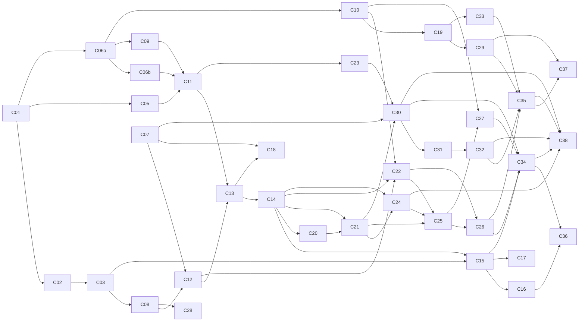

# Proyecto Final — Descomposición en changes OpenSpec

**Versión:** 3 — consenso tras la revisión de la [PR #4](https://github.com/skydr4g0n-it/joiabagur-pv/pull/4) y las [especificaciones funcionales v2](joiabagur-ia-especificaciones-funcionales-v2.md)
**Documento hermano de:** [proyecto-final-diseno-rag-joiabagur.md](proyecto-final-diseno-rag-joiabagur.md)
**Ventana:** 3 de agosto → 3 de septiembre de 2026 — *sin margen asumido*
**Equipo:** **2 desarrolladores sin roles fijos**, ambos trabajan en Python y en .NET/frontend
**Total:** 39 changes (38 de construcción + 1 de entrega) · **~4,4 por persona y semana**

---

## 0. Revisiones posteriores a la versión 3

Este documento se escribió antes de implementar. Cuando una sesión de diseño de un change concreto altera lo que su ficha decía, el cambio se registra aquí con fecha y motivo, y la ficha afectada se corrige en el sitio.

### 2026-08-28 — C15, tras la sesión de exploración previa al proposal

La ficha de C15 se escribió cuando el retriever no existía. Con C13 y C14 archivados se puede leer el SQL real, y tres de las cosas que la ficha da por hechas no se sostienen. El detalle vive en [HU-AIENG-015](../Historias/AI-Eng/HU-AIENG-015.md) y en el ticket del change; aquí queda el resumen y la ficha corregida.

| Qué decía la ficha | Qué es en realidad | Por qué |
|---|---|---|
| «**repide con `top_k` mayor** si quedan pocos» | **Se elimina.** C15 pide `top_k = 20` → `min(20×3, 60) = 60` candidatos, el techo absoluto del contrato, en **una sola llamada** | El SQL de C14 aplica el umbral 0,65 **antes** del `LIMIT`. Si vuelven menos candidatos que el `overfetch`, ató el umbral y no el `LIMIT`: repedir devuelve **exactamente las mismas filas** cobrando un segundo embedding. Sólo aportaría algo con `top_k < 20`, y jamás por encima de 60 |
| «`ai_available: false` + **resultados léxicos**» con el buscador existente | **Buscador degradado nuevo**, acotado al POS de la búsqueda, con `to_tsvector('spanish', …)` calculado en consulta, **semántica OR** y orden por `ts_rank` | [`ProductService.SearchProductsAsync`](../../backend/src/JoiabagurPV.Application/Services/ProductService.cs) hace `Name.Contains(consulta)` sobre la cadena completa: ante *«un anillo de plata para regalar»* devuelve **la lista vacía, siempre**. Y filtra por *todos* los POS asignados, no por el de la búsqueda. Un fallback que nunca encuentra nada es una caída silenciosa con HTTP 200 |
| **Zona:** `API/Controllers/`, `Application/` | Igual, más `Tests/`. **No** `Infrastructure/`: C15 no lleva migración | Ninguna de las decisiones cerradas necesita esquema nuevo, y el plan contabiliza seis migraciones sin ninguna suya |
| Nada sobre `design.md` | **C15 lleva `design.md`** | Hay seis decisiones con alternativas defendibles y coste asimétrico. Tercera vez que la lista del §7 se queda corta, tras C08 y C07 |
| «Mismo controlador `AiController.cs`» (§5, pares que no van en paralelo) | **No existe `AiController.cs`.** El patrón real es un controlador por capacidad: `AiCatalogController`, `AiIndexFeedController`, `AiSearchEventsController`. C15 crea `AiSearchController` en `api/ai/search`, sin versión | El conflicto de zona **C15 ‖ C34 deja de ser el fichero del controlador** y pasa a ser el servicio de búsqueda compartido. Siguen sin poder ir en paralelo, por otro motivo |

**El hallazgo que gobierna el change: el filtro más selectivo del pipeline está al final, a un salto de red, y correlaciona con el ranking.** El §7.6 paso 1 sitúa el `pos_id` como filtro duro **en Python**. Pero C13 no indexó disponibilidad y C14 declara explícitamente que *«the search SQL does not filter by `pos_id`»*, difiriéndolo a C22. C15 vive en la ventana intermedia y sólo puede aplicarlo al hidratar, que es el paso 6.

Medido con el generador de C10 (`n_take = round(coverage × 1200)`, más `inactive_inventory_ratio_live_pos: 0.08`; la suma da 6.720, exactamente el inventario del informe):

| POS | cobertura | activos ≈ | supervivientes de 30 | de 60 |
|---|---|---|---|---|
| CIU-CENTRE (`op-ciutadella`) | 0,78 | 861 | 21,5 | 43 |
| MAO-AIR (`op-aeroport`) | 0,38 | 420 | 10,5 | 21 |
| **FORNELLS (`op-fornells`)** | **0,22** | **243** | **6,1** | **12,1** |

Con 30 candidatos, FORNELLS llena una página de 10 en el **~4 %** de las búsquedas. Y `collection_weights` sesga el surtido (`Tramontana` y `Caliza` a 3,5; `Filigrana` y `Cielo estrellado` a 0,3), así que el descarte **no es un adelgazamiento uniforme del 20 %**: correlaciona con la señal de ranking, y una consulta alineada con una colección que ese POS casi no tiene devuelve 0-2 resultados. Es el fallo que S10 describe como *«el filtro descartó 48 y la consulta entregó 2 sin ningún error visible»*, agravado. **Dos de los tres operadores de demo están en 0,38 o por debajo**, así que esto es el vídeo de la entrega, no un caso borde.

**Se acepta el corte y se mide**, en lugar de adelantar C22 fuera de zona. La tasa de llenado por POS es la línea base «antes» de la ablation de C22 en §11.2, y **se computa con lo que C04 ya persiste**: `% de búsquedas con ResultsCount < página`, agrupado por `PointOfSaleId`. Ninguna columna nueva. Distinguir la **abstención** (la IA no encontró nada) del **sin surtido** (la hidratación lo tiró todo) se resuelve uniendo por `TraceId` con el log `stage=search` de C14, que ya está obligado a emitir `low_confidence` y `candidates` — el cruce que la decisión 6 de HU-014 dejó previsto.

**Dos deudas que C15 anota y no paga.** La primera es de otro servicio: [`api/routers/retrieval.py`](../../ai-service/src/jbg_ai/api/routers/retrieval.py) construye un `LiteLlmEmbeddingClient` **por petición**, así que la caché RAM que C11 congeló nace vacía y muere con la respuesta — en retrieval **no hay ni un acierto en producción**. Tres líneas en `main.py` lo arreglan, y le tocan a **C21 o C22**, que ya trabajan en `retrieval/`; C15 no cruza a Python y mitiga por su lado con una caché de candidatos. La segunda: un índice GIN sobre `public."Products"` sólo tendrá sentido si el catálogo crece un orden de magnitud. Con 1.200 filas ese índice compraría lematización, no velocidad, y la lematización ya se obtiene sin él.

**Obligación heredada por C16.** Los tres «cero resultados» —abstención, sin surtido en este POS, y camino degradado— tienen que decirle cosas distintas al operador. Con un único `results: []` son indistinguibles, y el panel mentiría en dos de los tres casos.

### 2026-08-27 — C14 archivado

Change [`2026-08-27-add-vector-retrieval-endpoint`](../../openspec/changes/archive/2026-08-27-add-vector-retrieval-endpoint/). Spec viva: `vector-retrieval`. `POST /v1/retrieval/products` real (`STUB_MODE=false`); stub C02 si stub mode. Umbral `JPV_RETRIEVAL_DISTANCE_THRESHOLD` 0,65; hybrid/lexical = vector hasta C21. 503 si faltan key/DB/índice compatible. Sin `query_log`, sin regenerar OpenAPI, sin `embeddings.py`, sin `pos_id`.

### 2026-08-26 — C13 archivado

Change [`2026-08-26-add-product-document-indexer`](../../openspec/changes/archive/2026-08-26-add-product-document-indexer/). Spec viva: `product-document-indexer`. `POST /v1/index/sync` y `GET /v1/index/status` reales (`STUB_MODE=false`); stub C02 si stub mode. Keyset OpenAPI `since_id` / `cursor_id`. Mapa `sku_provenance.json` en `src/`. Alembic `text_provenance` + `sync_checkpoint`. Sin POS, sin `embeddings.py`, sin migración EF.

### 2026-08-26 — C12 archivado

Change [`2026-08-26-add-dotnet-index-feed-endpoints`](../../openspec/changes/archive/2026-08-26-add-dotnet-index-feed-endpoints/). Spec viva: `index-feed`. Feeds HTTP de catálogo (50) y POS (200) con API Key; 401 ante JWT de usuario o token C03. Tombstones por `kind`/`reason` (la ficha v3 nombraba `{deleted_at|deactivated_at}` y 403). Sin migración, sin push a `/v1/index/sync`. Runbook AutoBulk escrito, no ejecutado.

### 2026-08-22 — C06a archivado: corpus offline, no generador de servicio

La ficha original de C06a adjudicaba generadores en `ai-service/src/jbg_ai/data/generators/`, cliente LLM y migración Alembic de `text_provenance`. El change archivado [`2026-08-22-add-real-catalog-ingestion-and-text-assist`](../../openspec/changes/archive/2026-08-22-add-real-catalog-ingestion-and-text-assist/) entrega el resultado (JSONL de 436, dos ejes de procedencia, ingesta local de `Description`) por otro camino, documentado en su `design.md`:

| Ficha original | Apply cerrado |
|---|---|
| Zona `jbg_ai.data` + `prompts/` | Pipeline offline en [`scripts/catalog/`](../../scripts/catalog/) (`catalog-pipeline`: lectura, agrupación interna, reparto, redacción, validación, ingesta) |
| Cliente LLM en `ai-service` | Pasada de vendedor `catalog-assist/v2` en `assist.py` (plantillas deterministas, **sin** proveedor); `model: null` en el sidecar |
| Migración `text_provenance` | **C13** — C06a **no** es 🗄️ |
| JSONL on-demand | JSONL **commiteado**: [`data/catalog/real/generated/catalog-real-enriched.jsonl`](../../data/catalog/real/generated/catalog-real-enriched.jsonl) + sidecar `.meta.json` |
| ~10 % «sin descripción» / tier `empty` | Tier **`original`**: se deja la `Description` del xlsx (no se vacía ni se reescribe) |
| Semilla de familias en el JSONL | **No se emite.** Agrupación solo interna para el sorteo. C18 no lee este corpus |
| Ingesta | `UPDATE` local de `Description` por SKU; **0 unmatched**; 436 filas tocadas; identidad intacta |

**Artefactos de traza.** `generator_version` `c06a-assist/v2`, semilla `20260822`. Sidecar: 293 `rich` (67,20 %), 94 `sparse` (21,56 %), 49 `original` (11,24 %) — dentro de 70/20/10 ±3 pp. Procedencia: 387 `ai_assisted` / 49 `merchant`. Agrupación interna (no serializada): **354 grupos**, 44 multi-variante, 310 unarios (la referencia de exploración ~403/~23 era orientativa). Contrato de línea: `sku`, `name`, `description`, `price`, `collection_name`, `data_origin: real`, `text_provenance`, `text_quality_tier`. Tope `Description` 1000 caracteres. Spec viva: `real-catalog-corpus`. Informe: [`informes/c06a-catalog-enrichment-report.md`](informes/c06a-catalog-enrichment-report.md).

**Lo que esto deja escrito para C06b.** La zona `jbg_ai.data` **sigue vacía**: C06a no la inauguró. El JSONL real es el ancla de SKUs y de colecciones a no reutilizar (436 SKUs `SKU01`…, 28 colecciones). La voz v2 es **plantilla** —por eso huele a determinista—; C06b no reutiliza `assist.py`. `text_provenance` sigue sin columna: vive en JSONL hasta C13.

### 2026-08-22 — C06b, tras la sesión de exploración previa al proposal

La ficha v3 de C06b (y la fila de C06b en la tabla del 17 ago) mezclaba tres trabajos y copiaba cifras dimensionadas para un catálogo 100 % sintético. Con C06a archivado y el real en 436 productos / 354 grupos internos, esas cifras ya no significan lo mismo. Decisiones de la exploración:

| Ficha 17 ago | Ahora |
|---|---|
| Zona `jbg_ai.data.generators/` como generador determinista de servicio | Mismo paquete, **CLI** que no se importa desde `jbg_ai.api.main`. Ni FastAPI ni API .NET. C10, cuando llegue, se sienta al lado (mundo numérico, también CLI) |
| Calibrar precio, SKU, materiales y tamaño de familia al real | **No.** SKU lo reserva el código (sin colisión con C06a). Precio y copy los razona un **LLM**. Materiales multi-valor en la **prosa** (~35 %), no como `materials[]` en el JSONL |
| ~350 familias S/M/L y 15 % de huérfanos | **Fuera de C06b.** `Product` no tiene columna de familia; D4 es **C18**. Los sintéticos nacen huérfanos (204). Tallas en el nombre, si el LLM las escribe, son catálogo, no semilla |
| 900-1.200 productos, calibrados | Presupuesto **~1.200 totales** (436 + sintéticos; holgura, no cifra exacta) |
| JSONL versionado | JSONL + sidecar en `data/catalog/synthetic/generated/` **e `INSERT`** local de colecciones nuevas y productos (Docker, no RDS) |
| Tests de distribución de precio y ratio de huérfanos | Caen. Entran unicidad de SKU, ingesta sin tocar reales, tope 1000, LLM fake en pytest, settings sin API key obligatoria al boot |

Colecciones: **solo nuevas**, pensadas como brief de vitrina de hotel, aeropuerto/turista o tienda clásica — no un campo de canal en `Product`. Un par pueden seguir la temática menorquina; el resto divergen del mar saturado del real.

El grafo `C06b → C11` sigue siendo cierto **porque hay ingesta**: sin filas en `public."Products"`, el feed de C12 no ve el sintético.

### 2026-08-22 — C06b, longitud del copy alineada al real

La nota de calibración de la ficha («no se hereda la longitud de descripción») queda acotada: **precio y tamaño de familia siguen sin heredarse**; la **longitud del copy sí** se aproxima a las medias del JSONL C06a (`rich` ~289 / `sparse` ~115 / `original` ~14). El código declara el `text_quality_tier` **antes** del draft (`catalog-synth/v3`), recorta solo frases enteras y deja ~20 % de los `short` vacíos. Sidecar vigente: `c06b-synth/v3`. El JSONL sintético ya está generado (764).

### 2026-08-23 — C09 archivado

Change [`2026-08-23-add-catalog-enrichment-pipeline`](../../openspec/changes/archive/2026-08-23-add-catalog-enrichment-pipeline/). Spec viva: `catalog-enrichment-pipeline`. Extractor real en `jbg_ai.enrichment/` detrás de `POST /v1/enrich/products` cuando `STUB_MODE=false`; prompt `enrichment/v1`; LiteLLM temp 0; puertas de lote en auditor fuera del HTTP. `openapi.json` no se regeneró.

### 2026-08-23 — C06b archivado

Change [`2026-08-23-add-synthetic-catalog-augmentation`](../../openspec/changes/archive/2026-08-23-add-synthetic-catalog-augmentation/). Spec viva: `synthetic-catalog-corpus`. JSONL 764 + sidecar `c06b-synth/v3` / `catalog-synth/v3`. Ingesta local el 2026-08-22: `"Products"` 1200, `"Collections"` 38, `"ProductFamily*"` 0. GET familia sobre SKU440 → 204. `jbg_ai.data` queda inaugurada (CLI; `api.main` no la importa).

### 2026-08-17 — C06, tras la sesión de exploración previa al proposal: el export real sirve por tamaño y no por texto

El export llegó y se importó: **436 productos**. El plan se había preparado para que fuera **pequeño** —§14 pregunta 7 pregunta por su tamaño, §13.5 teme que sea insuficiente— y resultó ser de tamaño razonable (la mitad del objetivo de 900-1.200) pero **textualmente casi vacío**: 38,5 caracteres de media entre nombre y descripción, con 51 productos sin descripción ninguna.

Medido por campo que C09 tiene que extraer, el corpus no es pobre de forma uniforme, es **ciego a las etiquetas comerciales**:

| Campo | Evidencia en los 436 reales | |
|---|---|---|
| `piece_type` | 383 | **88 %** |
| `materials[]` | 384 | **88 %** |
| `size_label` | 66 | 15 % (por regex, como ya diseñaba C09) |
| `stone_type` | 34 | **8 %** |
| tags de color / estilo / ocasión | ~0 | **sin ninguna base** |

Eso destapa **dos contradicciones que ya estaban en el documento** y que nadie podía ver hasta tener el dato:

| # | Contradicción | Resolución |
|---|---|---|
| 1 | **C09 no puede aprobar su propia puerta.** §8.5 exige `cobertura de tags ≥ 90 %` y §7.1 exige «devuelve `[]` si no hay evidencia, nunca inventa». Sobre 38 caracteres sin vocabulario de estilo ni ocasión, ambas a la vez son insatisfacibles | La puerta baja a **70 % global** y se mide además **≥ 90 % sobre el estrato con texto asistido**. Ver la ficha de C09 |
| 2 | **C06 se contradice consigo mismo.** §8.1.1 regla 2 calibra el sintético con lo real «incluida la longitud típica de descripción»; §8.4 exige «~30 % de descripciones pobres». Calibrar sobre 15 caracteres da **100 %** pobres | El reparto de calidad deja de heredarse del real y se **declara**: ~70 % rico, ~20 % escueto, ~10 % sin descripción |

**C06 se parte en dos, y el motivo es de ruta crítica, no de calidad.** C09 se construye y prueba con LLM falso sobre fixtures: necesita *un* corpus, no *el* corpus. Los 900-1.200 sintéticos los necesitan C11, C10 y C24, no C09.

| Change | Alcance | Desbloquea |
|---|---|---|
| **C06a** `add-real-catalog-ingestion-and-text-assist` | Ingesta de los 436; asistencia de redacción; reparto de calidad; JSONL versionado | **C09 y C10** |
| **C06b** `add-synthetic-catalog-augmentation` | Ampliación a ~1.200 totales; colecciones nuevas; LLM+CLI; ingesta INSERT; **sin** familias (C18) | C11, C24 |

Partir no es recortar, así que la lista «nunca se recorta» del §13.4 no lo impide; y Python no tiene la regla de migración única, así que la revisión de Alembic que esto añade es barata.

**Tres decisiones de diseño que salen de la sesión:**

1. **`data_origin` confundía dos ejes independientes** —«¿el producto es real?» y «¿de dónde sale su texto?»— y por eso se rompía al mejorar el corpus. Se separa: `data_origin` sigue significando identidad del producto (SKU, precio y colección son reales y .NET manda sobre ellos) y aparece **`text_provenance`** (`merchant` | `ai_assisted` | `synthetic`). La regla 3 de §8.1.1 se reescribe sobre el eje nuevo.
2. **La unidad del reparto de calidad es la familia de variantes, nunca el producto suelto.** Si dentro de una familia una talla tiene texto rico y otra ninguno, el recuperador puede separarlas por riqueza de texto en vez de por talla — y la desambiguación de variantes son 10 de las 60-70 consultas del golden set, la categoría que §8.4 llama «el caso crítico». Medido: **403 grupos**, de los cuales 23 con variantes (56 productos) y 380 sueltos. Cuidado con leer «familia» como tipo de pieza: hay 37 tipos pero cuatro concentran el 78 %, y sortear por ahí daría *todos* los pendientes ricos y *todos* los colgantes vacíos.
3. **El texto asistido simula un reconocimiento multimodal que no existe y que el diseño excluyó.** §8.1 dice de las fotos «no se usan (el índice visual ya existe y es otro problema)», y se ha verificado que hay **0 fotos y 0 embeddings visuales** en la base. Sin fotos el modelo no puede saber cuántas piedras lleva una joya: expande lo que ya consta y acota por banda de precio lo que no. Esto **entra en §15 como limitación declarada**, no como detalle de implementación.

**Consecuencia sobre el resultado que publica el README.** §15 limitación 1 obliga a publicar la porción real como resultado principal, y §11.2 y C24 aplican ahí el umbral de aceptación. Con el texto real redactado por un LLM, ese número deja de decir lo que decía: la afirmación del proyecto pasa de «funciona sobre un catálogo real de joyería» a «funciona sobre un catálogo realista». Sigue siendo defendible, pero hay que escribirlo. Las métricas de **enriquecimiento** (§11.5, tasa de corrección por campo) sobreviven intactas —miden al extractor, no a la verdad—; las de **recuperación** son las que dejan de hablar del negocio real.

**Puerta que se deja abierta a coste cero.** El corpus original queda archivado (`.xlsx` y volcado `pg_dump` en `data/catalog/real/`, fuera de git). C24 admitirá un segundo `eval_run` sobre él, de modo que el delta «con asistencia − sin asistencia» siga siendo medible más adelante. Es el resultado más fuerte que este proyecto podría enseñar y perderlo era irreversible.

---

### 2026-08-17 — C07, al aplicar: la zona, una reserva para C18 y dos deudas que hereda C12

| Qué decía la ficha | Qué es en realidad | Por qué |
|---|---|---|
| **Zona:** `Domain/`, `Application/`, `API/Controllers/` | **Cinco carpetas:** más `Infrastructure/` (configuración EF y migración) y `Tests/` | Tercera vez que se corrige lo mismo, tras C04 y C08. **Un change 🗄️ siempre toca `Infrastructure/` y `Tests/`**; conviene darlo por supuesto en las tres fichas 🗄️ que quedan (C19, C27, C29) en lugar de volver a anotarlo |
| Nada sobre `design.md` | **C07 lleva `design.md`** | El §7 no se lo asigna, pero hay cinco decisiones con alternativas defendibles y coste asimétrico. Segunda vez que la lista del §7 se queda corta, tras C08 |
| `ProductFamily` (Name, Description) | **Más `Origin`, `ApprovedByUserId` y `ApprovedAt`**, nulables y sin uso en C07 | **C18 no está marcado 🗄️** y el plan cuenta seis migraciones, ninguna suya. Sin esta reserva tendría que abrir una séptima en plena Ola 3, compitiendo por el turno con C19, C27 y C29. Es la misma jugada que C08 hizo para C28, y por el mismo motivo |

**Obligaciones que C07 no puede cerrar y adjudica a C12 por escrito.** Las dos salen de que la pertenencia se declara como lista completa:

1. **Un producto que sale de una familia pierde su fila de miembro**, así que no queda ninguna marca temporal que le diga al feed `?since=` que ese producto debe reindexarse *sin* familia. Su documento conservaría la familia antigua indefinidamente.
2. **Renombrar una familia no toca ninguna fila de miembro**, y el índice denormaliza `family_name`, con lo que C11 se compromete a que el hash cambie.

Ninguna se resuelve dentro de C07: exigiría borrado lógico y una columna más para un mecanismo que el **§6.3 ya diseña en otro sitio** —*«.NET empuja una invalidación cuando se aprueba un perfil o cambia una familia»*—, y ese empujón es de C12. C07 deja preparados los índices sobre `UpdatedAt` de ambas tablas para que el feed pueda unir por familia y no solo por miembro. **C12 debe invalidar los productos que entraron y los que salieron, no solo los miembros actuales.**

**Lo que el apply enseñó y no estaba en ninguna ficha.** El reemplazo declarativo de miembros falla si las altas se declaran añadiéndolas a la colección de navegación de la familia: `BaseEntity` asigna el `Guid` en el constructor, así que EF toma al miembro nuevo por una fila existente y emite un `UPDATE` contra nada. Solo se manifiesta cuando una misma petición borra e inserta a la vez —reordenar variantes, intercambiar dos etiquetas—, nunca cuando solo añade o solo quita. Es un aviso para C18, C19 y C29, que van a mover colecciones hijas por el mismo camino.

---

### 2026-08-16 — C08, al aplicar: la ficha se quedaba corta en dos cosas

| Qué decía la ficha | Qué es en realidad | Por qué |
|---|---|---|
| **Zona:** `Domain/`, `Application/`, `API/Controllers/` | **Seis carpetas:** más `Infrastructure/` (configuración EF y migración), `Tests/` y **`ai-service/`** | Mismo error que la ficha de C04 tuvo que corregir. Un change 🗄️ siempre toca `Infrastructure/`, y este además cruza a Python |
| El contrato de `POST /v1/enrich/products` bastaba tal cual | **C08 lo renegocia** | Sus perfiles propuestos no llevaban `source` (`rule` \| `inferred`). Sin ese campo la decisión 5 —*sensible inferido → revisión; sensible por regla → no*— **no es implementable**, y dos de los cuatro tests `Routing_*` de la propia ficha no tendrían nada que distinguir. Se añaden además `piece_type`, `stone_type`, `size_label`, el desglose de `tags` en `color_tags`/`style_tags`/`occasion_tags` y `prompt_version` |

Renegociar aquí fue barato porque **C08 es el único consumidor que la ruta ha tenido nunca**: romperla no invalidó una sola línea. Hacerlo en C09 habría obligado a construir la entidad y el enrutado sobre una forma que ya se sabía insuficiente. El coste real fueron un snapshot regenerado y dos suites en verde, que es exactamente el mecanismo que C02 montó para este momento.

**Obligación heredada por C09.** El contrato ya declara `source` y `prompt_version`: el pipeline de enriquecimiento debe **producirlos de verdad**, marcando `rule` en la normalización determinista previa (talla por regex) y `inferred` en lo que salga del modelo. Si C09 devolviera todo como `inferred`, la revisión híbrida seguiría compilando y mandaría el catálogo entero a una cola que nadie tiene tiempo de vaciar.

**Consecuencia sobre C28.** No está marcado 🗄️ y el plan cuenta seis migraciones, así que C08 le reserva el almacenamiento de sus dos métricas: `ProposedProfileJson` (propuesta cruda inmutable, de la que sale la tasa de corrección por campo) y `ReviewDurationMs` (que mide el navegador y queda nulo en aprobación masiva). C28 no necesita abrir una séptima migración.

---

### 2026-08-15 — C05, al aplicar: dos lagunas del propio plan

La ficha de C05 se cumplió sin desviaciones, así que no se corrige. Pero implementarla dejó a la vista **dos huecos que no son de ningún change y que, sin registrar aquí, se pierden**:

| Laguna | Estado | Qué se ha hecho |
|---|---|---|
| **`ai.query_log`** aparece en el diseño §7.2 junto a las tablas de evaluación, pero **ninguna ficha la reclama**: las de evaluación son de C24 y esta no es de nadie | Sin adjudicar | C05 **no la crea**, a propósito y con el motivo escrito: no hay regla de migración única en Python, así que una segunda revisión de Alembic es barata, mientras que adivinar hoy sus columnas no lo es. Queda anotada para que no aparezca improvisada dentro de C14 |
| **No existe integración continua para Python.** El repositorio tiene `test-backend.yml` y `test-frontend.yml`; nada ejecuta `uv run pytest` | Sin adjudicar | Condiciona una decisión de C05: los tests de base de datos **se omiten con motivo** cuando Docker no responde, en lugar de fallar. Sin CI, unos rojos permanentes en local solo enseñarían a ignorar el rojo. Si alguien añade el flujo, esa decisión debería revisarse |

Ninguna de las dos bloquea a nadie hoy. Se registran porque el coste de olvidarlas se paga tarde: la primera, cuando C14 necesite registrar consultas y no tenga dónde; la segunda, el día que un cambio rompa la suite de Python y nadie se entere hasta la entrega.

---

### 2026-08-10 — C04, tras la sesión de exploración previa al proposal

Diseñar C04 en detalle movió tres cosas de sitio y añadió obligaciones sobre dos changes posteriores. El detalle completo está en [HU-AIENG-004](../Historias/AI-Eng/HU-AIENG-004.md) y en el ticket del change; aquí queda el resumen y las fichas corregidas.

| Qué cambia | Antes (v3 / specs v2) | Ahora | Por qué |
|---|---|---|---|
| **Quién escribe el evento** | implícito: el frontend envía `ProductSearchEvent` (ficha C16) | el **backend** escribe la mitad de búsqueda desde C15; el cliente solo reporta la selección | Origen, `trace_id`, latencia real y lista realmente devuelta **solo los conoce el servidor**. Es §6.2 y §7.6 aplicados a la telemetría. Efecto buscado: el contrato de C16 —🔴, ola congestionada— se reduce a un `POST` con un campo |
| **Endpoint** | `POST /api/products/search-events` (specs v2 §5.9) | `POST /api/ai/search-events/{id}/selection` | Un evento sin selección y sin resultados no pertenece a ningún producto: anidarlo bajo `/products` miente sobre la propiedad del recurso. `api/ai/*` es el namespace que ya usan C15, C19 y C34 |
| **Enlace venta↔búsqueda** | `ProductSearchEvent.CreatedSaleId` (specs v2 §5.8) | `Sale.SearchEventId`, con `ON DELETE SET NULL` | La atribución la declara el hecho derivado en el mismo `INSERT`, sin llamadas de seguimiento. Con el checkout masivo la diferencia es de N llamadas extra contra N campos opcionales en una petición que ya se envía |
| **Duración** | un campo `SearchDurationMs` (specs v2 §5.8) | `RetrievalMs` + `TotalMs` + `SelectedAt` | El campo original era ambiguo entre latencia de recuperación y tiempo hasta la selección. La diferencia de los dos primeros mide el **coste de la hidratación**, cifra que hoy nadie conoce y que el README querrá defender |
| **Granularidad** | no especificada | una fila por consulta, agrupadas por `SearchSessionId` | Sin agrupar, cada reformulación se contabiliza como un falso «consulta sin resultado» |
| **Búsquedas degradadas** | no contempladas | columna `SearchOrigin` (`Assisted` / `LexicalFallback`) | §6.4 obliga a responder con el buscador léxico si el circuito abre. Sin distinguirlas, una semana de cortacircuitos se lee como «la IA rankea peor». Y da online la comparación v0 vs v3 de §11.2 |
| **Utillaje de migración** | *«test de migración»* en seis fichas, sin más detalle | arnés de dos capas construido en C04 y heredado por C07, C08, C19, C27 y C29 | No existe ningún test de migración en el repositorio. La primera migración paga un coste fijo que las otras cinco no pagan, y debe caer en el change sin dependientes |

**Consecuencia de orden.** Coger C04 antes que C07 contradice la regla 2 (prioridad a la ruta crítica): C07 desbloquea C12 🔴 y C04 no desbloquea nada. Se acepta la inversión **por el coste fijo del arnés**, que conviene pagar fuera de la ruta crítica. Si finalmente se coge C07 primero, el arnés viaja con C07 y C04 lo hereda.

---

## 1. Cómo se trabaja

Cada entrada es **un change OpenSpec completo**, ejecutable de principio a fin en **una sesión de 2-3 horas**:

```text
/opsx:propose (proposal.md · design.md · tasks.md · specs/<capability>/spec.md)
  → /opsx:apply  (código + tests)
  → /opsx:verify (build + tests verdes + revisión de alcance)
  → /opsx:archive (openspec/changes/archive/YYYY-MM-DD-<change-id>/)
```

### Reglas de asignación (sustituyen a los roles)

1. **Se coge el siguiente change desbloqueado**, sea Python o .NET. No hay dueño por zona.
2. **Prioridad absoluta a la ruta crítica.** Si hay un change marcado 🔴 libre, se coge ese antes que cualquier otro. Los 🟢 son relleno: sirven para no quedarse parado, no para adelantar trabajo.
3. **Antes de empezar se anuncia** (issue, tablero o mensaje) para que el otro no coja el mismo.
4. **Una sola migración EF Core activa a la vez** (marcados 🗄️). Quien la abre lo anuncia y la mergea antes de que empiece otra.
5. **Si un change se desborda de la sesión, se parte** y se entrega primero la mitad que desbloquea al otro desarrollador.
6. **C24 (golden set) se hace entre los dos**, etiquetando por separado y conciliando.

### Definition of Done común

- [ ] Artefactos OpenSpec creados y `openspec validate` en verde
- [ ] Código aplicado, `dotnet build` / `uv run pytest` / `npm run build` sin errores
- [ ] **Tests unitarios nuevos, verdes**
- [ ] Tests existentes sin regresión
- [ ] Documentación afectada actualizada
- [ ] Change archivado el mismo día

### Reglas transversales de testing

- **Ninguna llamada real a un LLM ni a embeddings en tests unitarios.** Fakes inyectados + fixtures en `ai-service/tests/fixtures/`.
- PostgreSQL: Testcontainers (.NET) o contenedor efímero con pgvector (Python).
- Generadores: tests de **propiedades** (invariantes), no de valores concretos.
- Nomenclatura: .NET `Method_Scenario_ExpectedResult` · frontend `should [behavior] when [condition]` · Python `test_<unidad>_<escenario>_<esperado>`.

### Leyenda

🔴 ruta crítica · 🟢 paralelizable / relleno · 🗄️ incluye migración EF Core · 👥 se hace entre los dos · ⏳ pendiente de acuerdo con el compañero

---

## 2. Tabla maestra

| # | Change ID | Zona | Prereq. | Ruta | Origen |
|---|---|---|---|---|---|
| **C01** | `init-ai-service-skeleton` | Python, infra | — | 🔴 | — |
| **C02** | `add-ai-service-contracts-and-auth` | Python | C01 | 🔴 | — |
| **C03** | `add-dotnet-ai-gateway-client` | .NET | C02 | 🔴 | — |
| **C04** | `add-product-search-event-tracking` | .NET 🗄️ | — | 🟢 | specs v2 §5.8 |
| **C05** | `add-pgvector-schema-foundation` | Python, infra | C01 | 🔴 | — |
| **C06a** | `add-real-catalog-ingestion-and-text-assist` | scripts/catalog/ | C01 | 🔴 | **rev. 17 ago**, **22 ago · archivado** |
| **C06b** | `add-synthetic-catalog-augmentation` | jbg_ai.data (CLI) | C06a | 🟢 | **23 ago · archivado** |
| **C07** | `add-product-family-entity` | .NET 🗄️ | — | 🟢 | **rev. dec. 2** |
| **C08** | `add-product-ai-profile-entity` | .NET 🗄️ | C03 | 🟢 | rev. dec. 3, 5 |
| **C09** | `add-catalog-enrichment-pipeline` | Python | C06a | 🔴 | rev. dec. 3, 5, **17 ago**, **23 ago · archivado** |
| **C10** | `add-synthetic-world-simulator` | Python | C06a | 🟢 | rev. dec. 8 |
| **C11** | `add-source-text-and-embedding-client` | Python | C05, C09 | 🟢 | **25 ago · archivado** |
| **C12** | `add-dotnet-index-feed-endpoints` | .NET | C07, C08 | 🔴 | **rev. dec. 10**, **26 ago · archivado** |
| **C13** | `add-product-document-indexer` | Python | C11, C12 | 🔴 | **26 ago · archivado** |
| **C14** | `add-vector-retrieval-endpoint` | Python | C13 | 🔴 | **27 ago · archivado** |
| **C15** | `add-dotnet-ai-search-endpoint` | .NET | C03, C14 | 🔴 | **rev. dec. 11** |
| **C16** | `add-frontend-assisted-search-panel` | Frontend | C15 | 🔴 | — |
| **C17** | `add-ai-service-deployment` | Infra | C15 | 🔴 | — |
| **C18** | `add-family-suggestion-and-review` | Python + .NET + FE | C07, C13 | 🟢 | **rev. dec. 2** |
| **C19** | `add-demand-signal-service` | .NET 🗄️ | C10 | 🟢 | **rev. dec. 6** |
| **C20** | `add-synonym-dictionary` ⏳ | Python | C14 | 🟢 | **rev. dec. 4** |
| **C21** | `add-hybrid-search-rrf` | Python | C14, C20 | 🔴 | — |
| **C22** | `add-pos-projection-soft-prefilter` | Python | C10, C12, C14 | 🔴 | **rev. dec. 11** |
| **C23** | `add-knowledge-corpus-and-indexer` | Python | C11 | 🟢 | — |
| **C24** | `add-eval-harness-golden-set-and-baselines` | Python 👥 | C14, C21 | 🔴 | rev. dec. 12 |
| **C25** | `add-business-signals-ranking` | Python | C21, C22, C24 | 🔴 | — |
| **C26** | `add-substitutes-retrieval` | Python | C22, C25 | 🟢 | specs v2 §6.3.2 |
| **C27** | `add-complementary-recommendations` | Python + .NET 🗄️ | C10, C25 | 🟢 | **rev. dec. 8** |
| **C28** | `add-profile-review-ui-and-metrics` | Frontend + .NET | C08 | 🟢 | **rev. dec. 5** |
| **C29** | `add-inventory-recommendation-entity` | .NET 🗄️ | C19 | 🟢 | **rev. dec. 6** |
| **C30** | `add-assist-generation-with-rule-warnings` | Python | C07, C21, C23 | 🔴 | **rev. dec. 4** |
| **C31** | `add-guardrails-and-intent-router` | Python | C30 | 🔴 | — |
| **C32** | `add-sales-assistant-agent-loop` | Python | C30, C31 | 🔴 | — |
| **C33** | `add-pos-sales-profile` | .NET + Python | C19 | 🟢 | **rev. dec. 7** |
| **C34** | `add-dotnet-assist-and-recommendation-endpoints` | .NET | C15, C26, C27, C30 | 🔴 | — |
| **C35** | `add-inventory-agent-proposals` | Python | C26, C29, C32, C33 | 🟢 | **rev. dec. 6** |
| **C36** | `add-frontend-assist-card-and-family-disambiguation` | Frontend | C16, C34 | 🔴 | — |
| **C37** | `add-frontend-inventory-review-and-print` | Frontend | C29, C35 | 🟢 | **rev. dec. 6** |
| **C38** | `add-generation-and-agent-evals` | Python + .NET | C24, C30, C32, C34, C35 | 🔴 | — |
| **C39** | `finalize-pf-readme-and-evidence` | Docs 👥 | todos | 🔴 | — |

**Origen** indica de dónde sale el change: en **negrita**, los que existen por la revisión del compañero.

---

## 3. Fichas

### Ola 0 — Cimientos y contratos (3-5 ago)

---

#### C01 · `init-ai-service-skeleton` 🔴

**Objetivo.** Servicio Python `jbg-ai` vacío pero ejecutable: `uv`, FastAPI, configuración por entorno, `GET /health`, contenedor y entrada en `docker-compose`.
**Prereq.** — · **Zona.** `ai-service/`, `docker-compose.yml`
**Alcance.** `pyproject.toml`, `src/jbg_ai/api/main.py`, `config/settings.py` (pydantic-settings), logging estructurado con `trace_id`, `Dockerfile`, servicio en red interna sin publicar puerto.
**Tests.** `test_health_returns_ok_with_version`; `test_settings_fail_fast_when_required_env_missing`; smoke con `TestClient`.
**Tarea obligatoria fuera de código.** Verificar en la consola de AWS que **RDS admite `CREATE EXTENSION vector`**. Si no, el plan B (contenedor Postgres+pgvector en la misma EC2) hay que saberlo hoy, no el 25 de agosto.

---

#### C02 · `add-ai-service-contracts-and-auth` 🔴

**Objetivo.** **Congelar el contrato** de los endpoints con modelos Pydantic, stubs deterministas y autenticación de servicio. Es lo que permite que las dos personas no se esperen durante un mes.
**Prereq.** C01 · **Zona.** `ai-service/src/jbg_ai/api/`
**Alcance.** Routers `retrieval`, `assist`, `inventory`, `index`, `enrich` y `evals` (este último solo con perfil de desarrollo); modelos request/response completos (§6.8 del diseño), incluidos **`materials[]`**, `family_id`/`variant_label` y **sobre-recuperación** (`top_k` vs `candidates_returned`); stubs tras flag `STUB_MODE`; dependencia FastAPI que valida el JWT interno HS256 y extrae `user_id`/`role`/`pos_id`/`trace_id`; OpenAPI exportado a `ai-service/openapi.json` versionado.
**Entregado.** 8 endpoints `/v1` congelados: `POST /v1/retrieval/products`, `POST /v1/retrieval/substitutes`, `POST /v1/assist/sale`, `POST /v1/inventory/propose`, `POST /v1/enrich/products`, `POST /v1/index/sync`, `GET /v1/index/status` y `GET /v1/evals/runs`, más `GET /health` público. Con `STUB_MODE=false`, la ruta sin lógica real responde 501 nombrando el change que la entregará.
**Tests.** `test_retrieval_stub_matches_response_schema`; `test_openapi_snapshot_is_stable` (rompe el build si alguien cambia el contrato sin avisar); `test_request_without_token_is_rejected`; `test_pos_id_from_token_overrides_body_value` (**el body no manda**); `test_health_is_public`.

---

#### C03 · `add-dotnet-ai-gateway-client` 🔴

**Objetivo.** Cliente tipado hacia `jbg-ai` con resiliencia desde el primer día, contra los stubs de C02.
**Prereq.** C02 · **Zona.** `JoiabagurPV.Application/`
**Alcance.** `IAiGatewayClient` + `AiGatewayClient` (typed `HttpClient`), Polly (0,8 s retrieval / 5 s assist, reintento único, circuit breaker), emisión y firma del JWT interno, propagación de `trace_id`, configuración en `appsettings` + SSM.
**Tests.** `SearchAsync_WhenServiceReturns200_MapsResponse`; `SearchAsync_WhenTimeout_ThrowsAiUnavailable`; `SearchAsync_WhenCircuitOpen_FailsFastWithoutCall`; `BuildToken_IncludesPosAndRoleClaims`. Con `HttpMessageHandler` falso.

---

#### C04 · `add-product-search-event-tracking` 🟢 🗄️

> **Ficha revisada el 2026-08-10** tras la sesión de exploración previa al proposal. Ver [§0](#0-revisiones-posteriores-a-la-versión-3) para el registro de qué cambió y por qué, y [HU-AIENG-004](../Historias/AI-Eng/HU-AIENG-004.md) para el detalle.

**Objetivo.** Telemetría consulta→selección desde el primer día, escrita por quien conoce cada dato. Sin prerrequisitos hacia atrás: es el change que se coge si la ruta crítica está ocupada. **Sí tiene un prerrequisito hacia adelante sobre C15**, que es una propiedad distinta y está nombrada abajo.
**Prereq.** — · **Zona.** `Domain/`, `Infrastructure/`, `Application/`, `API/Controllers/`, `Tests/` (la ficha v3 solo citaba dos de las cinco)
**Alcance.** Entidad `ProductSearchEvent` con `SearchSessionId`, `SearchOrigin`, `TraceId`, `ResultsCount`, `RetrievalMs`, `TotalMs` y `SelectedAt`; columna `Sale.SearchEventId` con `ON DELETE SET NULL`; **una única migración** con las cuatro reglas de borrado declaradas a mano; servicio con dos caminos de escritura (`RecordSearchAsync`, que nunca lanza y devuelve `Guid?`, más el registro de selección); **un solo endpoint**, `POST /api/ai/search-events/{id}/selection` con cuerpo `{ productId }` y respuesta `204`; columnas `jsonb` con truncado por número de entradas; dos índices, `(PointOfSaleId, CreatedAt)` y `(CreatedAt)`; arnés de test de migración reutilizable.
**Fuera de alcance.** **Cero rutas de lectura**: ni `GET`, ni agregación, ni panel. El análisis del entregable se hace con SQL a mano en C39.
**Tests.** `RecordSearch_WithValidScope_PersistsEventWithServerKnownFields`; `RecordSearch_WhenPersistenceFails_DoesNotThrowAndReturnsNull`; `RecordSelection_WithProductInResults_DerivesRankFromStoredList`; `RecordSelection_WhenCallerIsAdminButNotOwner_Returns403`; `RecordSearch_WithMoreResultsThanCap_RecordsTrueDisplayedCount`; `DeletingSearchEvent_NullsSaleAttribution_WithoutDeletingSale`; `Migration_JsonColumnsAreJsonbNotText`; `Model_HasNoPendingMigrationDifferences`.
**Prerrequisito hacia adelante (crítico).** C15 debe invocar `RecordSearchAsync` y devolver `searchEventId`. Es la única obligación cuyo incumplimiento deja el change **sin efecto y sin síntoma**: todo compilaría, todos los tests pasarían y la tabla estaría vacía en septiembre.
**Nota de utillaje.** Construye el arnés de test de esquema que heredan C07, C08, C19, C27 y C29: test de desfase modelo↔migración (sin base de datos) más aserciones sobre `information_schema`/`pg_indexes`. **Guardarraíl:** solo las aserciones que C04 necesita hoy; los cinco changes siguientes extienden la capa común cuando sepan qué les hace falta.
**Punto de partición predefinido.** Si desborda la sesión (regla 5): primero esquema + migración + arnés, que libera el slot de migración y es archivable solo; después servicio + endpoint + tests, que no lleva migración y convive con el C07 del compañero.

---

### Ola 1 — Datos y modelo (6-12 ago)

---

#### C05 · `add-pgvector-schema-foundation` 🔴

**Objetivo.** Persistencia lista: extensión `vector`, esquema `ai`, usuario dedicado, Alembic y tablas vacías con índices.
**Prereq.** C01 · **Zona.** `ai-service/migrations/`
**Alcance.** `CREATE EXTENSION vector`; esquema `ai`; migración inicial con `product_document` (**`materials text[]`**, `family_id`, `variant_label`, **`data_origin`**), `knowledge_document`/`knowledge_chunk`, `pos_projection`, `co_occurrence`, `sync_failure`; índices **HNSW `vector_cosine_ops`**, **GIN sobre `tsv` y sobre `materials`**, B-tree sobre `family_id`/`piece_type`/`price_band`/`data_origin`; pool acotado a 5 conexiones.
**Tests.** `test_migration_creates_vector_extension_and_ai_schema`; `test_hnsw_index_uses_cosine_operator_class` (consulta a `pg_indexes`; protege del antipatrón que desactiva el índice sin dar error); `test_gin_index_exists_on_materials`; `test_upgrade_downgrade_is_reversible`.

---

> **Fichas revisadas el 2026-08-17** tras la sesión de exploración previa al proposal, con el export real ya importado. C06 se parte en dos. Ver [§0](#0-revisiones-posteriores-a-la-versión-3) para el registro de qué cambió y por qué.

#### C06a · `add-real-catalog-ingestion-and-text-assist` 🔴 *(archivado 2026-08-22)*

> **Ficha alineada con el apply.** Change: [`openspec/changes/archive/2026-08-22-add-real-catalog-ingestion-and-text-assist/`](../../openspec/changes/archive/2026-08-22-add-real-catalog-ingestion-and-text-assist/). Spec viva: `real-catalog-corpus`. **No es 🗄️.**

**Objetivo.** Convertir el export real en un corpus sobre el que el enriquecimiento de C09 sea demostrable, sin falsear lo que el corpus es. **Desbloquea C09 y C10 sin esperar al volumen sintético.**
**Prereq.** C01 · **Zona.** `scripts/catalog/` *(no `jbg_ai.data` ni `prompts/`; `text_provenance` en `ai.product_document` queda para C13 — ver [§0](#0-revisiones-posteriores-a-la-versión-3))*
**Alcance entregado.** Corpus JSONL de **436 productos reales** (`data_origin: real`) en `data/catalog/real/generated/catalog-real-enriched.jsonl` + sidecar `c06a-assist/v2` / semilla `20260822` / `model: null`; pipeline `catalog-pipeline` (generate / validate / spike / ingest); **reparto por familia interna** 293 `rich` / 94 `sparse` / 49 `original` (11,24 %; texto del xlsx, no se vacía) **sin** emitir `variant_group_key` / `variant_label` / `family_seed`; agrupación interna 354 / 44 / 310; voz de vendedor en `assist.py`; `text_provenance` solo en JSONL; ingesta local `UPDATE` de `Description` por SKU (**0 unmatched**, 436 filas); informe en `informes/c06a-catalog-enrichment-report.md`.
**Tests.** En `scripts/catalog/tests/`: `test_generator_is_deterministic_for_same_seed`; **`test_variant_family_shares_text_quality`**; `test_jsonl_omits_family_seed_fields`; `test_original_tier_keeps_source_description`; `test_assisted_copy_does_not_mention_photos_or_source_sheet`; **`test_sku_price_name_and_collection_are_never_modified`**; `test_ingest_lists_unmatched_without_insert`; `test_ingest_rolls_back_when_identity_would_change`; más `test_description_over_1000_is_rejected`, `test_jsonl_lines_parse_with_real_origin_and_unique_skus`, ratios y rebalanceo de familias.
**Limitación que hereda §15.** El texto asistido **simula un reconocimiento multimodal que no se ha implementado y que §8.1 excluyó**; no hay fotos en el sistema (verificado: 0 `ProductPhotos`, 0 embeddings visuales). Los atributos no derivables de la evidencia previa son plausibles, no verificados. La voz v2 es **plantilla determinista**, no un LLM: sirve a C09; no es un estilo que C06b deba copiar si busca más inventiva.

---

#### C06b · `add-synthetic-catalog-augmentation` 🟢 *(archivado 2026-08-23)*

> **Ficha revisada el 2026-08-22**; archivada el 2026-08-23. Ver [§0](#0-revisiones-posteriores-a-la-versión-3). Change: `openspec/changes/archive/2026-08-23-add-synthetic-catalog-augmentation/`.

**Objetivo.** Llevar el corpus a **~1.200 productos totales** (holgura, no cifra exacta) con piezas sintéticas que un joyero podría fabricar y vender en tienda clásica, vitrina de hotel o aeropuerto, sin falsear el ancla real. **Desbloquea el volumen de C11 y C24.** No crea familias: eso es C18.
**Prereq.** C06a · **Zona.** `ai-service/src/jbg_ai/data/` — **CLI**, no se importa desde `jbg_ai.api.main`, no hay ruta HTTP, no toca la API .NET. Artefactos en `data/catalog/synthetic/generated/`. Ingesta local Docker (`localhost:5433` / `joiabagur_pv`).
**Alcance.** Orquestador + cliente LLM + prompt versionado: nombres, descripciones y **precios razonados** (pieza, tamaño, materiales, público del brief; **sin** bandas fijas ni canal de venta en `Product`). El código reserva SKUs que no colisionen con el JSONL de C06a ni con `"Products"."SKU"`, sella `data_origin: synthetic` y `text_provenance: synthetic`, valida `Description` ≤ 1000 e **`INSERT`** de colecciones **nuevas** y productos en una transacción. Un par de colecciones pueden seguir la temática menorquina; el resto divergen (hotel, aeropuerto/turista, atelier clásico). ~35 % de las descripciones mencionan dos o más materiales **en la prosa** (sin campo `materials[]` en el JSONL). **No** escribe `ProductFamily` / `ProductFamilyMember` ni emite `family_seed` / `variant_group_key`. Settings `LLM_*` **opcionales** al boot de `/health` (solo las exige el CLI). Sidecar con `generator_version`, `seed`, `model`, `prompt_version`, `generated_at`. El JSONL commiteado es la fuente; regenerar texto exige flag explícito.
**Fuera de alcance.** C09, C10, C18, migración `text_provenance` (C13), `openapi.json`, RDS/producción, reutilizar `scripts/catalog/assist.py`.
**Tests.** Con LLM falso: `test_skus_are_unique_across_real_and_synthetic`; `test_sku_allocator_is_deterministic_for_same_seed`; `test_jsonl_omits_family_seed_fields`; `test_ingest_inserts_new_products_without_touching_real_skus`; `test_ingest_creates_new_collections_with_unique_names`; `test_description_over_1000_is_rejected`; `test_settings_do_not_require_llm_key_to_boot`; `test_unit_suite_makes_no_provider_calls`. «Mismas descripciones a igual semilla» **no aplica** (temperatura > 0).
**Nota sobre calibración.** No se heredan del real la distribución de precios ni el tamaño de familia. El esquema de SKU **sí** se copia (sin reutilizar los 436). La **longitud** del copy se aproxima a las medias del JSONL real (`rich` / `sparse` / `original`); el código declara el 70/20/10 **antes** del draft y recorta por frases enteras (revisión 22 ago, tarde). El agrupamiento es por stem de nombre, no `ProductFamily`.
**Puede correr en paralelo** a C09. C10 no lo necesita. C11 y C24 sí, por volumen **ya ingerido** en .NET.

---

#### C07 · `add-product-family-entity` 🟢 🗄️

**Objetivo.** Familias como **entidad de negocio explícita y editable**, no como clave textual generada. Es la decisión 2 de la revisión.
**Prereq.** — · **Zona.** `Domain/`, `Application/`, `Infrastructure/`, `API/Controllers/`, `Tests/` *(corregida al aplicar)*
**Alcance.** `ProductFamily` (Name, Description, **Origin, ApprovedByUserId, ApprovedAt** reservados para C18) y `ProductFamilyMember` (ProductId, VariantLabel, SortOrder), migración, repositorio, `POST /api/product-families`, `GET /api/product-families/{id}`, `PUT /api/product-families/{id}`, `PUT /api/product-families/{id}/members`, `GET /api/products/{id}/family`. Un producto pertenece como máximo a una familia, por índice único. Miembros **declarativos**: la petición trae la lista completa y el orden sale de su posición. Huérfano (204) distinguible de producto inexistente (404).
**Tests.** `CreateFamily_WithMembers_PersistsOrder`; `AddMember_WhenProductAlreadyInAnotherFamily_ReturnsConflict`; `GetFamily_ReturnsSiblingsOrderedBySortOrder`; `RemoveMember_KeepsFamilyWhenOthersRemain`; **`ReplaceMembers_ReorderingExistingMembers_Succeeds` y `ReplaceMembers_SwappingTwoVariantLabels_Succeeds`** (los que destaparon el fallo de estado `Added`/`Modified`); detectores de esquema.

---

#### C08 · `add-product-ai-profile-entity` 🟢 🗄️

**Objetivo.** Perfil IA revisable en .NET, con `materials[]` y **revisión híbrida por campo** (decisión 5).
**Prereq.** C03 · **Zona.** `Domain/`, `Application/`, `API/Controllers/`
**Alcance.** `ProductAiProfile` con `MaterialsJson`, `PieceType`, `StoneType`, `SizeLabel`, tags, `AiConfidence`, **`FieldConfidenceJson`**, **`FieldSourceJson`** (`rule` \| `inferred`), `ReviewStatus`, `SourceHash`; migración; `POST /api/ai/catalog/enrich-batch`; enrutado híbrido: campos sensibles inferidos → `Pending`, tags con confianza alta → `Approved`, resto → `Pending`. Marca `review_state = auto_bulk` para la vía masiva.
**Tests.** `EnrichBatch_AsOperator_Returns403`; `Routing_WhenSensitiveFieldInferred_MarksPendingReview`; `Routing_WhenSensitiveFieldFromRule_DoesNotRequireReview`; `Routing_WhenTagConfidenceAboveThreshold_AutoApproves`; `Profile_StoresMultipleMaterials`; test de migración.

---

#### C09 · `add-catalog-enrichment-pipeline` 🔴 *(archivado 2026-08-23)*

**Objetivo.** De producto crudo a perfil propuesto: extracción estructurada con **`materials[]`**, vocabulario cerrado, confianza por campo y puertas de calidad de lote.
**Prereq.** C06a · **Zona.** `ai-service/src/jbg_ai/enrichment/`
**Alcance.** Normalización determinista previa (talla por regex → `source: rule`); prompt **v1 versionado** en `ai-service/prompts/enrichment/v1.md`; JSON schema estricto a temperatura 0; **vocabulario cerrado de materiales** con normalización de sinónimos ("plata de ley", "925" → `plata`); `materials` como lista, `[]` si no hay evidencia; confianza **por campo**; puertas de lote (unicidad SKU, **cobertura de tags ≥ 70 % global y ≥ 90 % sobre el estrato `text_provenance: ai_assisted`**, vocabulario respetado); `POST /v1/enrich/products` real.
**Tests.** Con LLM falso: `test_extracts_multiple_materials_from_description`; `test_material_synonym_normalized_to_canonical_term`; `test_rejects_value_outside_closed_vocabulary`; `test_empty_materials_flags_review_not_default_value`; `test_size_regex_marks_field_source_as_rule`; `test_batch_fails_when_tag_coverage_below_threshold`; **`test_tag_coverage_gate_is_evaluated_per_text_provenance`**.
**Por qué la puerta baja de 90 % a 70 %** *(revisado el 2026-08-17)*. Con el reparto de C06a el techo alcanzable es ≈ 77 % —0,70 × 95 % + 0,20 × 40 % + 0,10 × 20 %—, así que un 90 % global es **inalcanzable por construcción** y bloquearía el pipeline siempre. Un umbral solo global tendría además el defecto de **medir en parte nuestra propia política de ruido**: cambiar el reparto a 60/25/15 lo haría saltar sin que el extractor hubiera cambiado. El desglose por estrato conserva el 90 % donde sí significa algo y deja de castigar el ~10 % `original` (texto del comerciante, no reescrito). Es lo que permite aprobar la puerta **sin violar** la regla de §7.1: «devuelve `[]` si no hay evidencia, nunca inventa».
**Si se desborda:** partir en pipeline+prompt / puertas de calidad.

---

#### C10 · `add-synthetic-world-simulator` 🟢

**Objetivo.** POS, inventario, histórico de ventas y **co-ocurrencia**, coherentes por construcción con el catálogo.
**Prereq.** C06a · **Zona.** `ai-service/src/jbg_ai/data/world/`
**Alcance.** 10-14 POS con perfil de clientela, estacionalidad y **marca de origen de suministro**; matriz de propensión producto×POS; 5.000-9.000 filas de inventario respetando `Inventory.IsActive`; simulación Poisson → 15.000-25.000 ventas sobre 14-18 meses; movimientos derivados; **co-ocurrencia por operación de venta** (`BulkOperationId` o mismo POS y día) para complementarios.
**Tests.** `test_no_sale_without_stock_at_that_pos`; `test_seasonality_peaks_match_pos_profile`; `test_inventory_movements_reconcile_with_final_stock`; `test_co_occurrence_only_counts_same_operation`; `test_simulation_is_deterministic_for_same_seed`.
**Si se desborda:** partir en POS+inventario / ventas+co-ocurrencia.

**Hecho (2026-08-23).** CLI en `jbg_ai.data.world` (`world simulate|ingest`), no `generators/`. 12 POS en YAML commiteado; JSONL y dump gitignored. Co-ocurrencia solo `BulkOperationId`, no `ai.*`. Se retira el test de bit-identidad. `is_supply_source` solo YAML (SQL = C19). Informe [`informes/c10-synthetic-world-report.md`](informes/c10-synthetic-world-report.md).

---

#### C11 · `add-source-text-and-embedding-client` 🟢

**Objetivo.** `SourceText` canónico, `SourceHash` e idempotencia. Es lo que hace barato y determinista todo el reindexado.
**Prereq.** C05, C09 · **Zona.** `ai-service/src/jbg_ai/indexing/`
**Alcance.** Constructor de `doc_text` con orden fijo, **incluyendo materiales (ordenados alfabéticamente para estabilidad del hash), familia y variante**; `source_hash` SHA-256; cliente de embeddings con reintento, batching y caché por hash; `embedding_model`/`embedding_version`.
**Tests.** `test_source_text_is_stable_for_same_profile`; `test_material_order_does_not_change_hash`; `test_hash_changes_when_family_changes`; `test_embedding_not_recomputed_when_hash_unchanged`.

**Hecho (2026-08-25).** Biblioteca `jbg_ai.indexing`: plantilla `source-text/v1`, SHA-256 del `doc_text` renderizado, LiteLLM `aembedding` 1536d con caché RAM, batch 64 y backoff 429/5xx. `api.main` no importa el paquete; `/v1/index/*` sigue siendo el stub C13. Spec viva `catalog-source-text`.

---

#### C12 · `add-dotnet-index-feed-endpoints` 🔴 *(archivado 2026-08-26)*

**Objetivo.** La única vía de lectura de Python: feeds HTTP paginados con cursor, **con tombstones** (decisión 10).
**Prereq.** C07, C08 · **Zona.** `API/Controllers/`, `Application/`
**Alcance.** `GET /api/ai/index-feed/catalog?since=` (producto + perfil aprobado + familia) y `GET /api/ai/index-feed/pos-availability?since=` (asignación, `qty_bucket`, ventas 30/90 d); **tombstones** `{product_id, deleted_at|deactivated_at}`; hash agregado para detección de divergencia; paginación obligatoria (máx. 50); solo autenticación de servicio.
**Tests.** `CatalogFeed_WithSinceCursor_ReturnsOnlyChangedRows`; `CatalogFeed_EmitsTombstoneWhenProductDeactivated`; `CatalogFeed_ExcludesUnapprovedProfiles`; `PosAvailabilityFeed_ReturnsBucketNotExactQuantity`; `Feed_WithUserJwt_Returns403`; `Feed_ReturnsAggregateHashForDriftDetection`.

**Hecho (2026-08-26).** `GET /api/ai/index-feed/catalog` (página 50) y `.../pos-availability` (página 200), header `X-Index-Feed-Key`, 401 (no 403) ante JWT/C03/sin key. Tombstones `kind`+`reason` (`deactivated`/`unapproved`/`unassigned`). `price-band/v1`. Hash SHA-256 del conjunto indexable. `ReplaceMembers` sella `Product.UpdatedAt` vía `ExecuteUpdateAsync`. Sin migración; `openapi.json` intacto. Spec viva `index-feed`. Change [`2026-08-26-add-dotnet-index-feed-endpoints`](../../openspec/changes/archive/2026-08-26-add-dotnet-index-feed-endpoints/).

---

### Ola 2 — Slice vertical desplegado (13-19 ago)

> **Hito:** el 19 de agosto un operador busca en lenguaje natural desde `pv.joiabagur.com` y ve resultados con stock real. Con dos personas, integrar y desplegar pronto es la única defensa contra una sorpresa de infraestructura en la última semana.

---

#### C13 · `add-product-document-indexer` 🔴 *(archivado 2026-08-26)*

**Objetivo.** Poblar `ai.product_document` desde el feed y dejar el índice consultable y observable.
**Prereq.** C11, C12 · **Zona.** `ai-service/src/jbg_ai/indexing/`
**Alcance.** Upsert idempotente por `product_id`; **procesamiento de tombstones**; `tsvector` con configuración `'spanish'`; `POST /v1/index/sync` y `GET /v1/index/status` con `drift_count` y `last_full_sync_at`; fallos a `ai.sync_failure` con backoff.
**Tests.** `test_upsert_is_idempotent_for_same_source_hash`; `test_tombstone_removes_document_from_index`; `test_tsvector_uses_spanish_configuration`; `test_status_reports_drift_when_counts_diverge`; `test_failed_batch_recorded_and_does_not_block_others`.

**Hecho (2026-08-26).** Dreno del feed de catálogo con keyset y tope 180 s; skip-embed si `source_hash` coincide; tombstones idempotentes; mapa `sku_provenance.json` en `src/`; Alembic `text_provenance` + `sync_checkpoint`; OpenAPI `since_id` / `cursor_id`; CLI `python -m jbg_ai.indexing sync`; deriva por un GET (`aggregateHash`). 503 nombrado si faltan feed/embed/mapa. Sin POS, sin editar `embeddings.py`. Spec viva `product-document-indexer`. Change [`2026-08-26-add-product-document-indexer`](../../openspec/changes/archive/2026-08-26-add-product-document-indexer/).

---

#### C14 · `add-vector-retrieval-endpoint` 🔴 *(archivado 2026-08-27)*

**Objetivo.** Primera recuperación real: vectorial con top-k, umbral, abstención y **sobre-recuperación**.
**Prereq.** C13 · **Zona.** `ai-service/src/jbg_ai/retrieval/`
**Alcance.** `POST /v1/retrieval/products` real: embedding de consulta, `<=>` sobre HNSW, umbral configurable, `low_confidence: true` con lista vacía; **devuelve `top_k × 3` candidatos (tope 60)** para que .NET tenga margen al hidratar; log estructurado por etapa con `trace_id`.
**Tests.** `test_returns_empty_with_low_confidence_when_all_above_threshold`; `test_returns_overfetched_candidate_count`; `test_results_ordered_by_ascending_distance`; `test_trace_id_appears_in_stage_logs`.

**Hecho (2026-08-27).** `POST /v1/retrieval/products` real cuando `STUB_MODE=false`; stub C02 si stub mode. Embed `max_attempts=1` sin editar `embeddings.py`. `<=>` cosine, umbral 0,65 en SQL, overfetch **después** del umbral (como mucho `min(top_k × 3, 60)` de las filas que pasan el umbral), filtros del body. `mode=hybrid`/`lexical` ejecutan la rama vectorial hasta C21. 503 si faltan `JPV_EMBEDDING_API_KEY` / `DATABASE_URL` / índice compatible; abstención 200 + `low_confidence`. Sin `query_log`, sin OpenAPI, sin filtro `pos_id`. Spec viva `vector-retrieval`. Change [`2026-08-27-add-vector-retrieval-endpoint`](../../openspec/changes/archive/2026-08-27-add-vector-retrieval-endpoint/).

---

#### C15 · `add-dotnet-ai-search-endpoint` 🔴

**Objetivo.** El endpoint del frontend, con **hidratación autoritativa** y degradación. Implementa la decisión 11: la verdad la pone .NET.
**Prereq.** C03, C14 · **Zona.** `API/Controllers/`, `Application/`, `Tests/` *(sin migración: C15 no es 🗄️)* · **Lleva `design.md`**
**Alcance** *(corregido el 2026-08-28; ver [§0](#0-revisiones-posteriores-a-la-versión-3))***.** `POST /api/ai/search` en `AiSearchController`: pide al gateway la **ventana máxima del contrato en una sola llamada** (`top_k = 20` → 60 candidatos), **hidrata desde PostgreSQL** con una consulta conjunta —nunca `ProductService`, cuyo camino son ~120 viajes— descarta lo que no tiene `Inventory` activo **en ese POS** o `Product.IsActive = false`, **conserva el stock 0** y trunca a la página pedida; feature flag por POS en configuración; caché de candidatos de TTL corto y limitación de peticiones por `userId`; `ai_available: false` + **buscador degradado propio** (full-text español en consulta, acotado al POS, semántica OR, orden por `ts_rank`) si el circuito está abierto.
**Tests.** `Search_HydratesPriceAndStockFromDatabase_NotFromAiResponse`; `Search_WhenCandidateNoLongerAssigned_DropsItAfterHydration`; `Search_RequestsTheMaximumCandidateWindowInASingleCall`; `Search_WhenPosCoverageIsLow_ReturnsFewerThanTopK_WithoutASecondCall`; `Search_KeepsAssignedProductWithZeroStock`; `Search_HydratesInASingleQuery`; `Search_WhenAiUnavailable_FallsBackToLexicalSearch`; `Fallback_MatchesAnyQueryTerm_NotTheWholeString`; `Fallback_IsScopedToTheSearchPointOfSale`; `Search_WhenFeatureFlagOff_UsesLegacySearch`; `Search_WhenFeatureFlagOff_RecordsOriginDisabled`; `Search_RepeatedQueryHitsCandidateCache_WithoutSecondEmbedding`; `Search_CacheKeyIncludesPointOfSale`; `Search_AdminMayChooseAnyActivePos`; `Search_OperatorCannotChooseUnassignedPos`; `Search_WhenTelemetryFails_StillReturnsResults`; integración con Testcontainers.

**Obligaciones heredadas de C04** *(añadidas el 2026-08-10; ver [§0](#0-revisiones-posteriores-a-la-versión-3))*

| | |
|---|---|
| **A1 · crítica** | Invocar `RecordSearchAsync` **después** de hidratar y truncar, y devolver `searchEventId` en la respuesta. **Sin esto C04 es código muerto sin síntoma:** compila, los tests pasan y la tabla llega vacía a la entrega |
| **A2** | Pasar filtros efectivos, `SearchOrigin` (`Assisted` o `LexicalFallback` según haya respondido `jbg-ai` o el buscador léxico), `traceId`, `RetrievalMs`, `TotalMs` y el `searchSessionId` que envía el cliente |
| **A3** | El servicio de C04 **no lanza nunca**: devuelve `Guid?`. C15 solo tiene que tolerar el nulo y responder igual — la búsqueda nunca falla por culpa de la telemetría |
| **A4** | Aplicar una política de limitación de peticiones a `POST /api/ai/search`. **Es cuestión de coste antes que de seguridad:** un `debounce` mal ajustado o un dedo apoyado en una tecla genera llamadas de embedding facturables, y §12 se compromete a que el coste esté instrumentado y reportado |

---

#### C16 · `add-frontend-assisted-search-panel` 🔴

**Objetivo.** Punto de entrada del operador: panel "Buscar con ayuda" en el flujo de venta.
**Prereq.** C15 · **Zona.** `frontend/src/`
**Alcance.** `ai-search.service.ts`; panel con input natural, **filtros rápidos incluyendo materiales (multi-selección)**, POS preseleccionado; resultados con foto, SKU, nombre, talla, precio, stock y motivo; estados de carga, vacío y degradado; envío de `ProductSearchEvent`; "Seleccionar para venta" que prellena el flujo existente (`productId` por state, patrón de `scan.tsx`).
**Tests.** `should render results with reason when search succeeds`; `should show legacy results banner when ai is unavailable`; `should allow selecting multiple materials in quick filters`; `should emit search event when a result is selected`.

**Obligaciones heredadas de C04** *(añadidas el 2026-08-10; ver [§0](#0-revisiones-posteriores-a-la-versión-3))*

El envío de `ProductSearchEvent` **ya no consiste en construir el evento**: el backend escribe la mitad de búsqueda. C16 solo reporta la selección, y el cuerpo tiene un único campo.

| | |
|---|---|
| **B1** | Ruta relativa `/ai/search-events`, sin duplicar el prefijo: `VITE_API_BASE_URL` ya trae `/api` |
| **B2** | Generar un `searchSessionId` por episodio al abrir el panel y enviarlo en **todas** las búsquedas de ese episodio. Sin él, cada reformulación cuenta como un falso «consulta sin resultado» |
| **B3** | Renderizar los resultados **en el orden recibido**; nada de `sort()` en cliente. Si se reordena, el rank pasa a medir la UI en lugar de la calidad del retriever, y el KPI `% selección rank 1/3` deja de significar lo que dice |
| **B4** | Enviar la selección **en el instante del clic**, no diferida ni agrupada al cerrar el panel, y sin bloquear la navegación. El servidor sella el instante: si la llamada se retrasa, el KPI mide cuándo se acordó el navegador |
| **B5** | Arrastrar `searchEventId` desde la selección hasta el checkout, **por línea**, y enviarlo en `CreateSaleRequest` / `BulkSaleLineRequest`. Un `searchEventId` desconocido debe degradar la atribución a nula: **nunca hacer fallar la venta** |
| **B6** *(de C15, 2026-08-28)* | Distinguir en pantalla los **tres «cero resultados»**: **abstención** (la IA respondió pero nada superó el umbral → «prueba a reformular»), **sin surtido** (había candidatos y ninguno está en este POS → «nada de esto está en tu tienda»), y **degradado** (`aiAvailable: false` → «búsqueda asistida no disponible»). Con un único `results: []` el panel miente en dos de los tres casos. C15 los expone con `aiAvailable`, `lowConfidence` y los contadores del embudo |

**Lo que C16 ya *no* tiene que hacer** *(y que la ficha v3 daba por suyo)*: emitir un evento al abandonar la búsqueda, calcular y enviar el rank 1-based de la lista mostrada, reportar el origen de los resultados, y medir el tiempo hasta la selección. Las cuatro las cubre el servidor.

---

#### C17 · `add-ai-service-deployment` 🔴

**Objetivo.** Servicio en producción **el 19 de agosto**, alcanzable solo desde el backend.
**Prereq.** C15 · **Zona.** infra
**Alcance.** Dockerfile de producción, workflow `deploy-ai-service.yml` (OIDC + ECR, patrón existente), secretos en SSM, `CREATE EXTENSION vector` en RDS, red interna sin exposición en nginx, `/health` enriquecido y tarjeta de estado en el dashboard de admin.
**Tests.** Smoke post-deploy (`/health` con BD y proveedor OK); `Dashboard_ShowsAiServiceHealth`; validación del workflow en rama de prueba.

---

#### C18 · `add-family-suggestion-and-review` 🟢

**Objetivo.** Flujo mixto de familias: la IA propone, el admin aprueba. Resuelve la decisión abierta 4 de las specs v2 y hace viable la decisión 2 de la revisión.
**Prereq.** C07, C13 · **Zona.** Python + .NET + frontend
**Alcance.** Agrupación de candidatos por similitud de embedding (umbral alto) + mismo `piece_type` + raíz común de nombre; detección de `variant_label`; `POST /v1/families/suggest`; pantalla de revisión por lotes que crea `ProductFamily`/`ProductFamilyMember` reales al aprobar; **alerta de huérfanos** (producto muy similar a una familia sin pertenecer a ella).
**Tests.** `test_suggests_family_for_same_piece_type_and_high_similarity`; `test_does_not_group_across_piece_types`; `test_detects_size_label_from_name`; `test_orphan_detection_lists_unassigned_similar_products`; frontend: `should create family when suggestion is approved`.

---

#### C19 · `add-demand-signal-service` 🟢 🗄️

**Objetivo.** Señales de demanda **en SQL, en .NET**, más el origen de suministro. Base de todo el inventario y señal de ranking para la búsqueda.
**Prereq.** C10 · **Zona.** `Domain/`, `Application/`, `Infrastructure/`
**Alcance.** **Migración: `IsSupplySource bool` en `PointOfSale`** (decidido: existe tienda central) con endpoint de administración para marcarlo. Señales por producto y POS: `sales_7d`, `sales_30d`, `sales_60d`, `current_stock`, `stock_in_other_pos`, `days_since_last_sale`, `avg_daily_sales_30d`, `estimated_days_to_stockout`, `is_top_seller_in_pos`. `GET /api/ai/inventory/demand-signals?pointOfSaleId=`. Sin LLM.
**Tests.** `Signals_ComputeSalesWindowsCorrectly`; `Signals_EstimatedDaysToStockout_HandlesZeroVelocity`; `Signals_StockInOtherPos_ExcludesTargetPos`; `Signals_TopSeller_UsesPosScopedRanking`; `PointOfSale_IsSupplySource_DefaultsToFalse`; test de migración.
**Nota de orden.** C10 genera los POS ya con la marca de origen de suministro; la importación de esos datos a la base debe ejecutarse **después** de esta migración, o repetirse tras ella.

---

### Ola 3 — Calidad, medición y base de inventario (20-26 ago)

---

#### C20 · `add-synonym-dictionary` 🟢 ⏳

**Objetivo.** Sustituir `SearchAliases` sin persistir texto por producto (decisión 4, contrapropuesta **pendiente de acuerdo**). Se implementa **tras flag** precisamente para que la decisión se tome con la medición de C24 y no con argumentos.
**Prereq.** C14 · **Zona.** `ai-service/src/jbg_ai/retrieval/`
**Alcance.** Fichero YAML curado a mano (~40-60 entradas: sortija→anillo, gargantilla→collar, aro→pendiente…), versionado en el repo; expansión **en consulta, nunca en indexación**; flag para activarlo o desactivarlo y poder medir su efecto.
**Tests.** `test_query_with_synonym_matches_canonical_term`; `test_expansion_does_not_modify_indexed_documents`; `test_unknown_term_passes_through_unchanged`; `test_disabled_flag_returns_original_query`.

---

#### C21 · `add-hybrid-search-rrf` 🔴

**Objetivo.** Rama léxica + fusión RRF + filtros estructurales por reglas, incluido el **filtro por solape de materiales**.
**Prereq.** C14, C20 · **Zona.** `ai-service/src/jbg_ai/retrieval/`
**Alcance.** `ts_rank` en español sobre `tsv` con expansión de sinónimos; *boost* de SKU y nombre exacto; fusión RRF con `k` configurable; `match_reasons` por resultado; extracción **por reglas** de filtros (`menos de 80`, `talla M`, materiales del vocabulario); **`materials && ARRAY[...]`** por defecto y **`@>`** cuando la consulta nombra varios.
**Tests.** `test_exact_sku_query_ranks_target_first`; `test_rrf_fuses_ranked_lists_preserving_top_hit`; `test_material_filter_uses_overlap_by_default`; `test_multi_material_query_uses_contains_all`; `test_extracts_price_ceiling_from_natural_phrase`; `test_never_invents_filter_absent_from_query`.

---

#### C22 · `add-pos-projection-soft-prefilter` 🔴

**Objetivo.** La proyección pondera pero **nunca excluye**. Es la decisión 11 de la revisión y la corrección técnica más importante de esta versión.
**Prereq.** C10, C12, C14 · **Zona.** `ai-service/src/jbg_ai/retrieval/`, `indexing/`
**Alcance.** Sincronización de `ai.pos_projection` desde el feed; el único filtro duro es el **`pos_id` del token**; `qty_bucket = 0` y `is_assigned_hint = false` **penalizan el score**, no eliminan; marca de frescura (`projection_age_seconds`) en la respuesta.
**Tests.** `test_unassigned_product_is_penalised_not_removed`; `test_out_of_stock_product_still_present_in_candidates`; `test_pos_scope_from_token_is_hard_filter`; `test_projection_stores_bucket_not_exact_quantity`; `test_response_reports_projection_age`.

---

#### C23 · `add-knowledge-corpus-and-indexer` 🟢

**Objetivo.** Segundo índice: conocimiento comercial **general, no por producto** — lo que permite citas verificables sin violar la decisión 4.
**Prereq.** C11 · **Zona.** `ai-service/src/jbg_ai/data/`, `indexing/`
**Alcance.** 30-45 documentos: **fichas por material** (cuidados, alergias, durabilidad), equivalencias de talla, guiones de venta, política de devoluciones, FAQ; chunking por secciones; indexación en `ai.knowledge_chunk` reutilizando el cliente de C11.
**Tests.** `test_chunker_preserves_section_titles_in_metadata`; `test_every_chunk_has_traceable_document_id`; `test_material_sheet_is_not_product_scoped`; `test_knowledge_search_returns_chunk_with_citation_id`.
**Conflicto de zona.** Usa `indexing/knowledge.py`; no toca `indexing/products.py` ni `indexing/embeddings.py` (congelado en C11).

---

#### C24 · `add-eval-harness-golden-set-and-baselines` 🔴 👥

**Objetivo.** Convertir "parece que va mejor" en números. **Se hace entre los dos.**
**Prereq.** C14, C21 · **Zona.** `ai-service/src/jbg_ai/evals/`
**Alcance.** Tablas `ai.eval_run/case/result`; golden set de **60-70 consultas** en 9 categorías (incluidas **materiales multi-valor** y **sinónimos**), relevancia graduada 0-2, construido por *pooling* y **etiquetado por separado por ambos con conciliación**; **se etiqueta primero sobre productos reales** y solo se completa con sintéticos si no hay material para cubrir las categorías; CLI `uv run evals run --config vX`; métricas Recall@5, nDCG@5, MRR, P@3, abstención, p50/p95, coste, **reportadas por `data_origin` (real / sintético / global)**; configs `v0-lexico` (replica el buscador .NET actual — **es la comparación que pide la decisión 12**) y `v0-cag`; informe versionado en `ai-service/evals/results/`.
**Tests.** `test_ndcg_matches_hand_computed_value_on_fixture`; `test_run_is_reproducible_for_same_config_and_seed`; `test_metrics_reported_per_data_origin`; `test_lexical_baseline_matches_dotnet_search_semantics`; `test_cag_baseline_respects_context_budget`; `test_cost_per_query_recorded_per_config`.
**Planificación.** Dos sesiones: runner y configs (una persona), etiquetado a cuatro manos (2 h). **Tope de 2 h por persona en etiquetado**: antes se recorta a 45 consultas que renunciar al doble etiquetado.
**Criterio de aceptación.** El umbral se aplica a **la porción real**. Si el global cumple y el real no, la conclusión es que el corpus sintético es demasiado fácil.

---

#### C25 · `add-business-signals-ranking` 🔴

**Objetivo.** Disponibilidad, rotación y perfil de POS como reordenación suave, con pesos **calibrados contra el golden set**.
**Prereq.** C21, C22, C24 · **Zona.** `ai-service/src/jbg_ai/retrieval/`
**Alcance.** Señales `qty_bucket`, `sales_30d`; penalizaciones por stock cero y variante ambigua dentro de familia; barrido de pesos y fijación del ganador; re-fijación del umbral con la distribución empírica; producción de la **tabla de ablations v0→v3**.
**Tests.** `test_out_of_stock_product_ranks_below_equivalent_in_stock`; `test_weights_load_from_config_not_hardcoded`; `test_ambiguous_variant_penalty_applies_only_within_family`; `test_calibration_sweep_is_reproducible`.

---

#### C26 · `add-substitutes-retrieval` 🟢

**Objetivo.** Sustitutos por falta de stock, con señales explicables.
**Prereq.** C22, C25 · **Zona.** `ai-service/src/jbg_ai/retrieval/`
**Alcance.** `POST /v1/retrieval/substitutes`: **misma familia primero**, luego similitud sobre el documento; criterios de las specs v2 §6.3.2 (tipo, familia, **materiales coincidentes**, color, banda de precio, disponibilidad en POS destino); `similarity_signals` por candidato.
**Tests.** `test_same_family_variant_ranks_first_when_available`; `test_material_overlap_increases_similarity_score`; `test_excludes_out_of_stock_when_flag_enabled`; `test_source_product_never_returned_as_own_substitute`.

---

#### C27 · `add-complementary-recommendations` 🟢 🗄️

**Objetivo.** Complementarios por reglas + co-ocurrencia, con curación manual. Decisión 8 de la revisión.
**Prereq.** C10, C25 · **Zona.** Python + `Domain/`
**Alcance.** Regla: **distinto `piece_type`**, solape de `color_tags`/`style_tags`, banda de precio compatible, disponible en el POS; señal adicional de **co-ocurrencia** desde `ai.co_occurrence`; entidad `ProductRecommendation` en .NET **solo para pares curados manualmente** (`GeneratedBy: Manual`), que tienen prioridad sobre la regla; `POST /v1/retrieval/complementary`. **Sin upsell ni downsell.**
**Tests.** `test_complementary_never_returns_same_piece_type`; `test_co_occurrence_boosts_pair_score`; `test_manual_pair_overrides_rule_result`; `test_respects_price_band_compatibility`; .NET: test de migración.

---

#### C28 · `add-profile-review-ui-and-metrics` 🟢

**Objetivo.** Que la revisión híbrida (decisión 5) sea real y medible, no una promesa del documento.
**Prereq.** C08 · **Zona.** frontend + `Application/`
**Alcance.** Pantalla de revisión **por lotes** con tabla editable, atajos de teclado y aprobación masiva por campo; muestra confianza y `source` (`rule`/`inferred`) por campo; registra **quién revisó, cuándo y qué cambió**; endpoint de métricas que expone **tasa de corrección por campo** y **tiempo medio de revisión** para el README.
**Tests.** `should highlight inferred sensitive fields pending review`; `should record correction when material list is edited`; `Metrics_CorrectionRate_ComputedPerField`; `Metrics_ExcludesAutoBulkProfiles`.

---

#### C29 · `add-inventory-recommendation-entity` 🟢 🗄️

**Objetivo.** Recomendaciones de inventario como entidad con ciclo de aprobación, **generadas por reglas en .NET**. Base de la decisión 6.
**Prereq.** C19 · **Zona.** `Domain/`, `Application/`, `API/Controllers/`
**Alcance.** `InventoryRecommendation` (tipo `Replenish|Transfer|Substitute|Rotate|Review`, producto, POS origen/destino, cantidad, prioridad, motivo, `SignalsJson`, estado `Proposed|Approved|Rejected|Applied|Expired`, revisor, fechas), migración; **motor de reglas en .NET** para `Replenish`, `Transfer` y `Rotate` (§10.2 del diseño); endpoints `GET`, `approve`, `reject`. Sin LLM.
**Tests.** `Rules_ReplenishWhenStockZeroAndRecentSales`; `Rules_TransferRequiresIdleSourceAndSellingTarget`; `Rules_RotateWhenIdleOverNinetyDays`; `Approve_SetsReviewerAndTimestamp`; `Reject_KeepsSignalsForAudit`; test de migración.
**Dependencia resuelta.** El POS origen de suministro existe y `IsSupplySource` llega en C19, dos olas antes.

---

### Ola 4 — Agentes, inventario asistido y evaluación (27-31 ago)

---

#### C30 · `add-assist-generation-with-rule-warnings` 🔴

**Objetivo.** Capa de generación: agrupación por **familia**, avisos **por reglas**, argumentario **no persistido** con citas. Implementa la decisión 4.
**Prereq.** C07, C21, C23 · **Zona.** `ai-service/src/jbg_ai/assist/`
**Alcance.** `POST /v1/assist/sale`: agrupación por `family_id` con `variant_label` destacado; `reason` construido desde datos; **`warnings[]` calculados por reglas** (existen variantes, falta talla, stock crítico, miembros sin stock) y nunca generados libremente; `pitch` generado en tiempo de consulta desde metadatos aprobados + chunks con `citations[]`, **sin persistir**; **placeholders `{{price}}`/`{{stock}}`** que el modelo no puede rellenar; prompt versionado.
**Tests.** `test_response_contains_no_literal_price_or_stock_number`; `test_warnings_are_rule_derived_not_model_generated`; `test_variants_grouped_by_family_id`; `test_citations_reference_retrieved_chunk_ids_only`; `test_pitch_is_not_persisted_anywhere`.

---

#### C31 · `add-guardrails-and-intent-router` 🔴

**Objetivo.** Que el sistema sepa cuándo no debe responder y no se deje instruir por la consulta.
**Prereq.** C30 · **Zona.** `ai-service/src/jbg_ai/assist/`
**Alcance.** Clasificador de intención (catálogo / conocimiento / ambos / fuera de dominio); rechazo cortés sin llamar al retriever; consulta tratada como dato; validación de salida contra JSON schema con reintento único.
**Tests.** `test_out_of_domain_query_short_circuits_before_retrieval`; `test_prompt_injection_does_not_change_system_behavior`; `test_invalid_model_output_triggers_single_retry_then_safe_error`; `test_care_question_routes_to_knowledge_index`.

---

#### C32 · `add-sales-assistant-agent-loop` 🔴

**Objetivo.** Capa de decisión: bucle con function calling, tools de solo lectura, presupuesto duro.
**Prereq.** C30, C31 · **Zona.** `ai-service/src/jbg_ai/assist/`
**Alcance.** Tools `buscar_catalogo`, `consultar_disponibilidad` (.NET), `listar_familia`, `buscar_sustitutos`, `buscar_complementarios`, `consultar_conocimiento`, `perfil_punto_venta`, `pedir_aclaracion`; máx. 5 iteraciones y 6 llamadas; errores como datos; `partial: true` al agotar presupuesto; **ninguna tool escribe**; decorador de trazado con tokens y coste por iteración.
**Tests.** `test_loop_stops_at_iteration_budget_and_flags_partial`; `test_tool_error_is_returned_as_data_not_exception`; `test_out_of_stock_query_triggers_substitutes_tool`; `test_no_registered_tool_performs_writes` (introspección del registro); `test_token_usage_accumulated_across_iterations`.

---

#### C33 · `add-pos-sales-profile` 🟢

**Objetivo.** Argumentario por POS como **perfil periódico calculado**, no como texto libre. Decisión 7.
**Prereq.** C19 · **Zona.** `Application/` + `ai-service/src/jbg_ai/assist/`
**Alcance.** Cálculo SQL en .NET de `top_piece_types`, `top_materials`, `top_price_ranges`, `top_collections`, `average_ticket`, `best_selling`, `slow_moving`; persistencia estructurada; el LLM **solo redacta el resumen a partir de ese payload**; `GET /api/ai/pos/{id}/sales-profile`; consumo como prior de ranking y por la tool `perfil_punto_venta`.
**Tests.** `Profile_MetricsComputedFromSalesNotLlm`; `test_narrative_mentions_only_metrics_present_in_payload`; `Profile_PosWithoutSales_ProducesEmptyProfileNotHallucination`; `Profile_RegeneratedWhenPeriodChanges`.

---

#### C34 · `add-dotnet-assist-and-recommendation-endpoints` 🔴

**Objetivo.** Exponer venta asistida, sustitutos y complementarios con hidratación y resolución de placeholders.
**Prereq.** C15, C26, C27, C30 · **Zona.** `API/Controllers/`, `Application/`
**Alcance.** `GET /api/ai/products/{id}/sales-assist`, `.../substitutes?pointOfSaleId=`, `.../recommendations?pointOfSaleId=`; **sustitución de `{{price}}`/`{{stock}}`** por valores reales; **rechazo de la respuesta si queda algún placeholder sin resolver**.
**Tests.** `SalesAssist_ReplacesPlaceholdersWithRealValues`; `SalesAssist_WhenPlaceholderUnresolved_ReturnsErrorInsteadOfRawTemplate`; `Substitutes_ExcludeProductsWithoutStockAtTargetPos`; `Recommendations_ManualPairsRankedFirst`; `SalesAssist_AsOperatorOfAnotherPos_Returns403`.
**Conflicto de zona.** Mismo controlador que C15 → nunca simultáneos.

---

#### C35 · `add-inventory-agent-proposals` 🟢

**Objetivo.** Segundo agente: prioriza, elige sustituto y redacta el motivo. **Los números los calcula .NET.**
**Prereq.** C26, C29, C32, C33 · **Zona.** `ai-service/src/jbg_ai/assist/`
**Alcance.** `POST /v1/inventory/propose` batch por POS; tools `senales_demanda` (.NET), `stock_por_pos` (.NET), `buscar_sustitutos`, `perfil_punto_venta`; salida: lista priorizada con motivo redactado y sustituto cuando la reposición no es satisfacible; **todas las propuestas nacen `Proposed`** y se persisten vía .NET.
**Tests.** `test_agent_never_computes_quantities_itself`; `test_unsatisfiable_replenishment_triggers_substitute_tool`; `test_reason_mentions_only_signals_from_payload`; `test_all_proposals_created_in_proposed_state`; `test_budget_exhausted_returns_partial`.
**Degradación planificada.** Si este change no llega, C29 ya genera recomendaciones por reglas puras: se pierde la priorización y la redacción, no la funcionalidad.

---

#### C36 · `add-frontend-assist-card-and-family-disambiguation` 🔴

**Objetivo.** Cerrar el flujo visible de venta: card con desambiguación por familia, citas, sustitutos y complementarios.
**Prereq.** C16, C34 · **Zona.** `frontend/src/`
**Alcance.** Card con argumentario, avisos calculados y citas desplegables; bloque de **variantes de la familia con `variant_label` destacado y confirmación explícita antes de vender**; bloque de sustitutos cuando `stock = 0`; bloque "También puede encajar" con complementarios.
**Tests.** `should require variant confirmation when family has multiple members`; `should show substitutes block when selected product is out of stock`; `should render complementary block when recommendations exist`; `should render citations when pitch has sources`.

---

#### C37 · `add-frontend-inventory-review-and-print` 🟢

**Objetivo.** Aprobación humana de recomendaciones y salida física. Sustituye a la packing list completa.
**Prereq.** C29, C35 · **Zona.** `frontend/src/`
**Alcance.** Pantalla de revisión con filtros por tipo y POS, señales visibles, motivo, y aprobar/rechazar por recomendación; desde las aprobadas, **vista imprimible agrupada por POS destino** (SKU, nombre, foto, cantidad, origen, motivo) usable en móvil. **Sin máquina de estados de packing list.**
**Tests.** `should list proposals grouped by recommendation type`; `should approve recommendation and remove it from pending list`; `should render printable view grouped by destination pos`; `should show substitute origin when recommendation is a substitute`.

---

#### C38 · `add-generation-and-agent-evals` 🔴

**Objetivo.** Cerrar la evaluación: validador anti-alucinación, RAGAS, escenarios de ambos agentes y casos adversarios.
**Prereq.** C24, C30, C32, C34, C35 · **Zona.** `ai-service/src/jbg_ai/evals/` + `Application/`
**Alcance.** (1) **Validador determinista** que extrae toda cifra de precio/stock de la respuesta final y la contrasta con el hidratador, umbral **cero fallos**, más su equivalente en .NET antes de responder; (2) **RAGAS** sobre el subconjunto con citas; (3) **20-25 escenarios de agente de venta + 8-10 de inventario**; (4) **20-25 casos adversarios**; (5) **test de fidelidad del perfil por POS**. Todo integrado en el runner e informe de C24.
**Tests.** `test_detects_injected_fake_price_in_response`; `test_ignores_numbers_that_are_sizes_or_skus`; `test_scenario_runner_replays_multi_turn_conversation`; `test_inventory_scenario_checks_proposal_state_and_reason`; `test_injection_cases_all_blocked`; .NET: `Response_WithUnverifiedNumber_IsRejected`.
**Orden obligatorio si hay que partirlo:** validador → escenarios de venta → adversarios → escenarios de inventario → RAGAS. **RAGAS es lo primero que se cae.**

---

### Ola 5 — Entrega (1-3 sep)

---

#### C39 · `finalize-pf-readme-and-evidence` 🔴 👥

**Objetivo.** Empaquetar la entrega para que un evaluador externo entienda, reproduzca y pruebe el sistema.
**Prereq.** todos · **Zona.** docs
**Alcance.** README del PF (dominio, arquitectura con la frontera .NET/Python justificada, CAG/RAG/agentes/evaluación/despliegue, arranque local, **los dos integrantes**, limitaciones, próximos pasos); **tabla de ablations v0→v3**; **métricas de revisión humana** (tasa de corrección y tiempo medio); sección del reranking descartado con su protocolo; progresión de prompts v1→v2 con impacto medido; **declaración explícita de lo que queda para fase posterior** (packing list, liquidación, upsell, políticas de inventario); vídeo de 2-3 min; usuario demo; `docker compose up` verificado desde cero; rama `finalproject-[INICIALES]` y tag `v1.0-final-[INICIALES]`.
**Tests.** Ensayo de reproducibilidad en máquina limpia y `openspec validate --all`.

---

## 4. Grafo de dependencias



---

## 5. Calendario por olas

| Ola | Fechas | Changes | Ruta crítica de la ola |
|---|---|---|---|
| **O0** | 3-5 ago | C01-C04 (4) | C01 → C02 → C03 |
| **O1** | 6-12 ago | C05-C12 (9, tras partir C06) | C06a → C09 → C11 → C12, con **C06b en paralelo** |
| **O2** | 13-19 ago | C13-C19 (7) | C13 → C14 → C15 → C16, C17 |
| **O3** | 20-26 ago | C20-C29 (10) | C21 → C22 → C24 → C25 |
| **O4** | 27-31 ago | C30-C38 (9) | C30 → C31 → C32, C34 → C36, C38 |
| **O5** | 1-3 sep | C39 (1) | C39 |

**Carga:** 39 changes / 4,4 semanas / 2 personas = **~4,4 por persona y semana**. La ola 3 (10 changes) y la ola 4 (9, con los dos agentes) son las más cargadas; si algo se retrasa, será ahí.

### Pares que NO deben ejecutarse en paralelo

| Par | Motivo |
|---|---|
| C15 ‖ C34 | ~~Mismo controlador `AiController.cs`~~ → **mismo servicio de búsqueda**. `AiController.cs` no existe: el patrón real es un controlador por capacidad *(corregido el 2026-08-28)* |
| C16 ‖ C36 | Misma página y servicio del frontend |
| Cualquier par de 🗄️ (C04, C07, C08, C19, C27, C29) | Dos migraciones EF Core simultáneas colisionan en el orden |
| C13 ‖ C11 | C13 depende del cliente de embeddings congelado en C11 |
| C21 ‖ C22 ‖ C25 | Los tres tocan el pipeline de ranking en `retrieval/` |
| C13 ‖ C23 | Zona `indexing/` compartida: separados por fichero, pero no solapar si hay dudas |

---

## 6. Orden de corte, fijado de antemano

Si el **26 de agosto** (fin de O3) no están la tabla de ablations y el sistema desplegado:

1. **C27** complementarios → fase posterior; los sustitutos ya cubren el caso de venta
2. **Tipo `Rotate` de C29** → el motor queda, se cae la regla de stock parado
3. **RAGAS dentro de C38** → se conservan validador y métricas de recuperación
4. **Tipo `Transfer` de C29** → solo reposición
5. **Vista imprimible de C37** → se aprueba en pantalla y se exporta a CSV
6. **C23** corpus 30-45 → 15 documentos, manteniendo las citas
7. **Golden set de C24** 70 → 45 consultas, **nunca renunciando al doble etiquetado**
8. **C35** agente de inventario → las recomendaciones se generan por reglas puras (C29), sin capa agéntica ni redacción LLM

**Nunca se recortan:** C01, C02, C03, C05, **C06a**, C07, C09, C11, C12, C13, C14, C15, C16, C17, C21, C22, C24, C30, C32, C34, C36, el validador de C38 y C39. **C06b sí admite recorte**: si no llega, el corpus se queda en los 436 reales, todas las métricas se reportan sobre ellos y el README declara que no hubo ampliación sintética. Se pierde volumen y las categorías del golden set que necesiten productos inexistentes, no el sistema.

---

## 7. Riesgos de esta descomposición

| Riesgo | Mitigación |
|---|---|
| **Las olas 3 y 4 concentran 19 de los 39 changes** | C19, C29 y C33 (base de inventario, .NET y sin LLM) están adelantados a O3 precisamente para descargar O4 |
| C02 se queda corto y el contrato cambia en O4, invalidando C03/C15/C16 | `test_openapi_snapshot_is_stable`: cualquier cambio rompe el build y se negocia entre los dos |
| C24 (golden set) bloquea C25 y C38 | El runner y las configs van por delante; el etiquetado tiene tope de 2 h por persona y recorte definido a 45 consultas |
| C09, C10 y C38 son sesiones largas | Punto de partición predefinido en cada ficha; se entrega primero la mitad que desbloquea |
| C29 necesita saber cuál es el POS origen de suministro | **Resuelto:** existe tienda central y `IsSupplySource` se añade en C19, dos olas antes |
| Seis migraciones EF Core (C04, C07, C08, C19, C27, C29) | Regla de migración única activa; están repartidas en cuatro olas distintas |
| Artefactos OpenSpec consumen tiempo de sesión | `design.md` solo cuando hay decisión con alternativas reales (C02, C11, C21, C22, C24, C29, C32); en el resto, `proposal` + `tasks` + spec delta |
