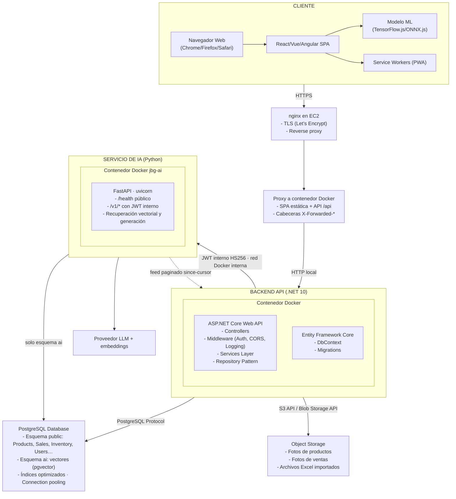
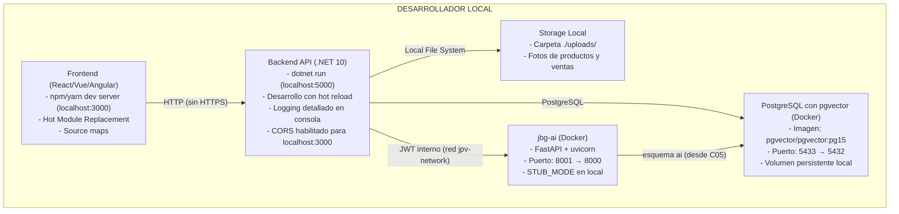
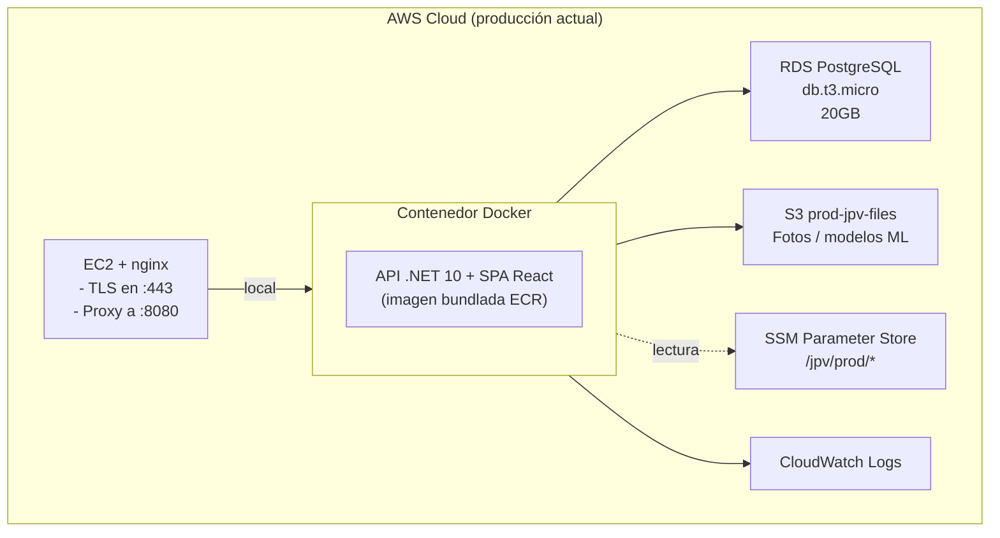
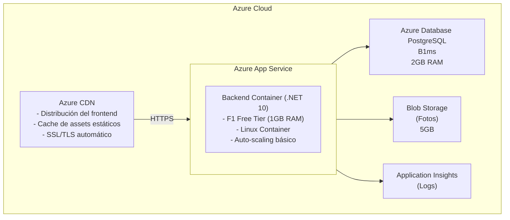
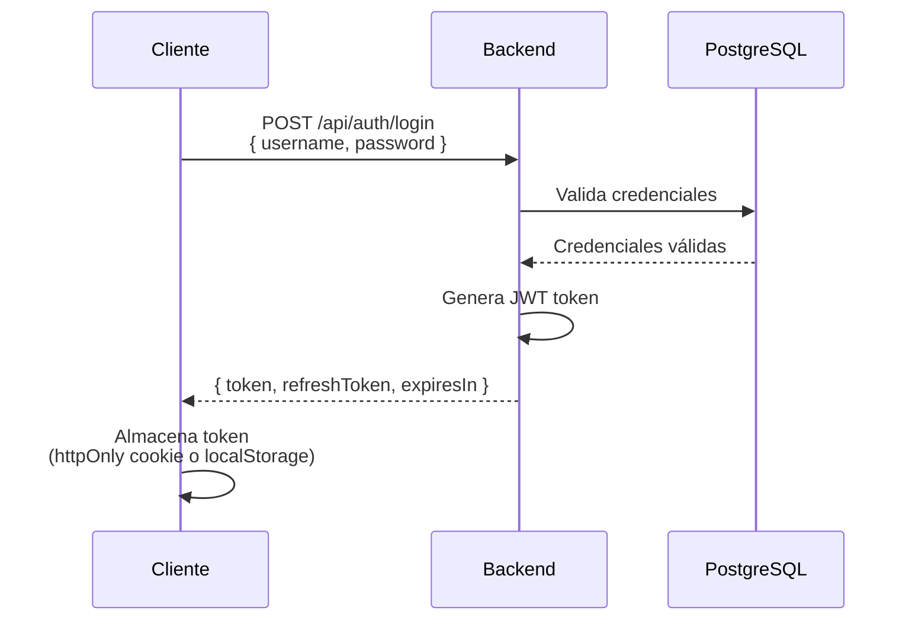
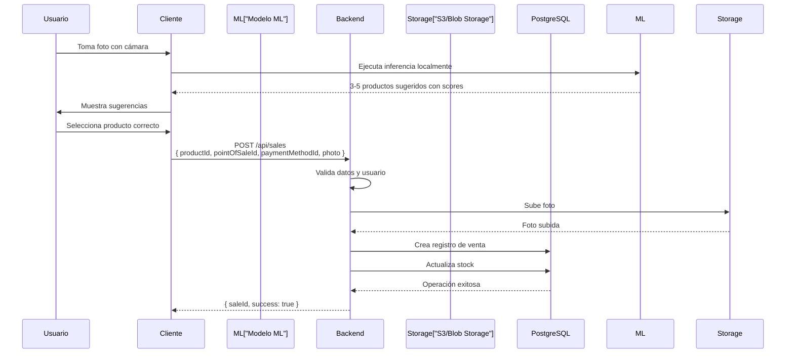
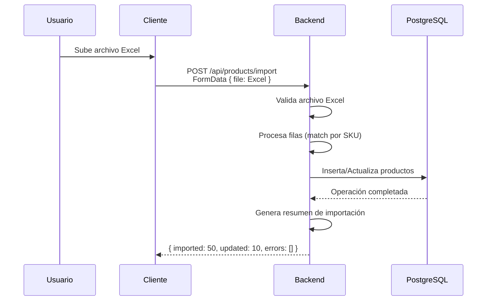

# Arquitectura del Sistema - Monolítica Simple con Contenedores

## Visión General

Arquitectura monolítica simple con backend y frontend separados, desplegados en contenedores Docker sobre servicios gestionados de cloud en free-tier.

---

## Stack Tecnológico

### Backend
- **Framework**: .NET 10 (ASP.NET Core Web API)
- **Lenguaje**: C#
- **ORM**: Entity Framework Core
- **Base de datos**: PostgreSQL 15+
- **Autenticación**: JWT (JSON Web Tokens)
- **Contenedorización**: Docker
- **Logging**: Serilog

### Frontend
- **Framework**: React/Vue/Angular (SPA)
- **Lenguaje**: TypeScript
- **Estado**: Redux/Vuex/NgRx (según framework elegido)
- **HTTP Client**: Axios/Fetch
- **UI Components**: Material-UI / Vuetify / Angular Material
- **ML Framework**: TensorFlow.js / ONNX.js (para reconocimiento de imágenes en cliente)
- **Build Tool**: Vite / Webpack

### Servicio de IA (`jbg-ai`)

Microservicio añadido en el Proyecto Final de IA (changes `init-ai-service-skeleton` / C01, `add-ai-service-contracts-and-auth` / C02 y `add-pgvector-schema-foundation` / C05). Vive en `ai-service/` y es un contenedor independiente del backend .NET.

- **Lenguaje**: Python 3.11
- **Framework**: FastAPI (fábrica `create_app`, `docs_url` deshabilitado)
- **Gestor de dependencias**: `uv` (`pyproject.toml` + `uv.lock`)
- **Configuración**: pydantic-settings con *fail-fast* de variables obligatorias
- **Servidor**: Uvicorn
- **Base de datos**: la misma PostgreSQL, en el esquema `ai` con extensión **pgvector**, ambos creados en C05. Acceso con SQLAlchemy 2 sobre psycopg 3 y **pool acotado a 5 conexiones sin desbordamiento**; migraciones con Alembic, independientes de EF Core y con su tabla de versiones dentro de `ai`. La cadena de conexión es **opcional**: el servicio arranca sin base de datos y el motor se construye en el primer uso
- **Contenedorización**: Docker (`python:3.11-slim-bookworm`)
- **Observabilidad**: logging estructurado con `trace_id` propagado por middleware
- **Autenticación entre servicios**: JWT interno HS256 con `PyJWT`; claims obligatorios `user_id`, `role`, `pos_id` y `trace_id` (C02)
- **Contrato**: 8 endpoints `/v1` congelados en `ai-service/openapi.json`, con test de snapshot; `STUB_MODE` sirve respuestas deterministas mientras la lógica real no existe (C02)

**Frontera de responsabilidad:** Python solo hace cálculo vectorial y generación con LLM; .NET conserva toda la regla de negocio y es la autoridad final sobre precio, stock y permisos. Python **nunca** lee ni escribe el esquema `public` por SQL, y el navegador nunca habla con Python: la SPA llama al backend .NET y este llama a `jbg-ai` con un JWT interno de servicio.

### Infraestructura
- **Contenedores**: Docker
- **Orquestación**: Docker Compose (desarrollo) / Cloud Services (producción)
- **CI/CD**: GitHub Actions
- **Repositorio**: GitHub

---

## Arquitectura Detallada

### Diagrama de Componentes



> El navegador **nunca** habla con `jbg-ai`: el puerto de Python no se publica en nginx. Toda llamada pasa por el backend .NET, que además actúa de *hidratador* — resuelve precio, stock y permisos reales y descarta los candidatos que ya no cumplan las reglas.

---

## Entorno de Desarrollo

### Arquitectura Local



### Configuración de Desarrollo

#### Docker Compose (`backend/docker-compose.yml`)

El fichero real levanta la base de datos, pgAdmin y el servicio de IA. El backend .NET y el frontend se ejecutan fuera del Compose (`dotnet run` y `npm run dev`).

| Servicio | Imagen / origen | Puerto local | Notas |
|---|---|---|---|
| `postgres` | `pgvector/pgvector:pg15` | `5433` → 5432 | Imagen con **pgvector**. El esquema `ai`, la extensión y el rol dedicado los crea `ai-service/migrations/bootstrap.sql`, **una vez y con privilegios de administrador**; levantar Compose no los crea |
| `pgadmin` | `dpage/pgadmin4` | `8080` → 80 | Administración de la BD |
| `jbg-ai` | build de `../ai-service` | `8001` → 8000 | Variables: `APP_ENV`, `SERVICE_VERSION`, `LOG_LEVEL`, `JWT_SECRET` (placeholder local; en producción desde SSM en C17), `STUB_MODE` y `DATABASE_URL` (apunta a `postgres:5432` por nombre de red, no al puerto publicado). Sin `depends_on`: el motor es perezoso y el contenedor arranca aunque la base no esté aprovisionada |

Todos comparten la red `jpv-network`, que es la que permitirá a `jbg-ai` alcanzar Postgres sin exponer puertos adicionales.

**Configuración que el backend .NET necesita para hablar con `jbg-ai` (C03).** Como el backend se ejecuta fuera del Compose, no ve los nombres de contenedor: alcanza el servicio por el puerto publicado. La sección `AiGateway` de `appsettings.json` lo refleja y se valida **en el arranque**, de modo que la API no levanta si falta algo:

| Clave | Desarrollo | Producción |
|---|---|---|
| `AiGateway:BaseUrl` | `http://localhost:8001` (puerto publicado) | `http://jbg-ai:8000`, previsto para C17 |
| `AiGateway:JwtSecret` | Placeholder local, **idéntico** al `JWT_SECRET` del contenedor | Desde SSM en C17 |

> El valor de producción presupone una **red Docker definida por el usuario**, que hoy no existe: el despliegue arranca los contenedores en la red *bridge* por defecto, donde Docker no resuelve nombres de contenedor. Crearla, unir ambos contenedores y dejar el puerto de `jbg-ai` sin publicar es prerrequisito de C17, junto con los parámetros `/jpv/prod/AiGateway__BaseUrl` y `/jpv/prod/AiGateway__JwtSecret`.

> **Aviso al actualizar desde una versión anterior:** el cambio de `postgres:15` a `pgvector/pgvector:pg15` puede exigir recrear el volumen local con `docker compose down -v`, lo que **destruye los datos de desarrollo**.

#### Variables de Entorno - Desarrollo

**Backend (.env.dev)**
```env
ASPNETCORE_ENVIRONMENT=Development
ASPNETCORE_URLS=http://localhost:5000

# Database
ConnectionStrings__DefaultConnection=Host=localhost;Port=5432;Database=joyeria_dev;Username=dev_user;Password=dev_password

# JWT
JWT__SecretKey=dev-secret-key-minimum-32-characters-long
JWT__Issuer=JoyeriaAPI-Dev
JWT__Audience=JoyeriaClient-Dev
JWT__ExpirationMinutes=1440

# Storage
Storage__Type=Local
Storage__LocalPath=./uploads

# CORS
CORS__AllowedOrigins=http://localhost:3000,http://localhost:5173

# Logging
Logging__LogLevel__Default=Debug
Logging__LogLevel__Microsoft=Information
Logging__LogLevel__Microsoft.AspNetCore=Warning
```

**Frontend (.env.development)**
```env
VITE_API_BASE_URL=http://localhost:5000/api
VITE_ENVIRONMENT=development
VITE_ENABLE_DEV_TOOLS=true
```

### Características de Desarrollo

- **Hot Reload**: Cambios en código se reflejan automáticamente
- **Source Maps**: Debugging completo en navegador
- **Logging Detallado**: Logs completos en consola
- **Datos de Prueba**: Seeders para datos iniciales
- **Sin HTTPS**: Desarrollo local sin certificados SSL
- **CORS Permisivo**: Permite requests desde localhost
- **Errores Detallados**: Stack traces completos en respuestas

---

## Entorno de Producción

### Arquitectura en Cloud (Free-tier)

#### Opción AWS



#### Opción Azure



### Configuración de Producción

#### Dockerfile de Producción (Backend)

```dockerfile
# Build stage
FROM mcr.microsoft.com/dotnet/sdk:10.0 AS build
WORKDIR /src

# Copy csproj and restore dependencies
COPY ["Joyeria.API/Joyeria.API.csproj", "Joyeria.API/"]
RUN dotnet restore "Joyeria.API/Joyeria.API.csproj"

# Copy everything else and build
COPY . .
WORKDIR "/src/Joyeria.API"
RUN dotnet build "Joyeria.API.csproj" -c Release -o /app/build

# Publish stage
FROM build AS publish
RUN dotnet publish "Joyeria.API.csproj" -c Release -o /app/publish

# Runtime stage
FROM mcr.microsoft.com/dotnet/aspnet:10.0 AS final
WORKDIR /app

# Install curl for health checks
RUN apt-get update && apt-get install -y curl && rm -rf /var/lib/apt/lists/*

COPY --from=publish /app/publish .

# Create non-root user
RUN groupadd -r appuser && useradd -r -g appuser appuser
RUN chown -R appuser:appuser /app
USER appuser

EXPOSE 8080

ENV ASPNETCORE_URLS=http://+:8080
ENV ASPNETCORE_ENVIRONMENT=Production

ENTRYPOINT ["dotnet", "Joyeria.API.dll"]
```

#### Variables de Entorno - Producción

**Backend (Azure App Service / AWS ECS)**
```env
ASPNETCORE_ENVIRONMENT=Production
ASPNETCORE_URLS=http://+:8080

# Database (desde Azure Key Vault / AWS Secrets Manager)
ConnectionStrings__DefaultConnection=<from-secrets>

# JWT (desde secrets)
JWT__SecretKey=<from-secrets-min-32-chars>
JWT__Issuer=JoyeriaAPI-Prod
JWT__Audience=JoyeriaClient-Prod
JWT__ExpirationMinutes=480

# Storage
Storage__Type=Cloud
Storage__Provider=AWS-S3|Azure-Blob
Storage__BucketName=joyeria-photos-prod
Storage__Region=us-east-1|westeurope

# CORS
CORS__AllowedOrigins=https://joyeria-app.com,https://www.joyeria-app.com

# Logging
Logging__LogLevel__Default=Information
Logging__LogLevel__Microsoft=Warning
Logging__LogLevel__Microsoft.AspNetCore=Warning
```

**Frontend (Build de Producción)**
```env
VITE_API_BASE_URL=https://api.joyeria-app.com/api
VITE_ENVIRONMENT=production
VITE_ENABLE_DEV_TOOLS=false
```

### Características de Producción

- **HTTPS Obligatorio**: Todas las comunicaciones cifradas
- **CORS Restrictivo**: Solo dominios permitidos
- **Logging Estructurado**: Logs a CloudWatch/Application Insights
- **Health Checks**: Endpoints para monitoreo
- **Connection Pooling**: Optimización de conexiones DB
- **Caching**: CDN para assets estáticos
- **Secrets Management**: Credenciales en servicios gestionados
- **Error Handling**: Respuestas genéricas sin detalles internos

---

## Diferencias Clave: Desarrollo vs Producción

| Aspecto | Desarrollo | Producción |
|---------|-----------|------------|
| **Entorno** | Local (Docker Compose) | Cloud (AWS/Azure) |
| **HTTPS** | No (HTTP localhost) | Sí (SSL/TLS) |
| **CORS** | Permisivo (localhost) | Restrictivo (dominios específicos) |
| **Logging** | Consola (Debug) | CloudWatch/App Insights (Info/Warning) |
| **Errores** | Stack traces completos | Mensajes genéricos |
| **Base de Datos** | PostgreSQL local (Docker) | RDS/Azure Database |
| **Storage** | Sistema de archivos local | S3/Blob Storage |
| **Build** | Hot reload | Build optimizado |
| **Secrets** | Archivos .env | Key Vault/Secrets Manager |
| **Monitoreo** | Manual (consola) | Automático (CloudWatch/Insights) |
| **Escalabilidad** | 1 instancia | Auto-scaling (1-2 instancias) |

---

## Estructura del Proyecto

```
joiabagur-pv/
├── backend/
│   ├── src/
│   │   ├── JoiabagurPV.API/             # Controllers, Middleware, Extensions, Program.cs
│   │   ├── JoiabagurPV.Application/     # DTOs, Interfaces, Services, Validators
│   │   ├── JoiabagurPV.Domain/          # Entities, Enums, Exceptions, Interfaces
│   │   ├── JoiabagurPV.Infrastructure/  # Data (DbContext, Migrations), Services
│   │   └── JoiabagurPV.Tests/           # UnitTests, IntegrationTests, TestHelpers
│   ├── api-tests/
│   ├── scripts/ml-training/
│   └── docker-compose.yml               # postgres (pgvector), pgadmin, jbg-ai
├── frontend/
│   ├── src/                             # pages, components, services, hooks, providers, routing, types
│   ├── e2e/                             # Playwright
│   └── package.json
├── ai-service/                          # Microservicio de IA (C01-C02)
│   ├── src/jbg_ai/
│   │   ├── api/                         # main.py (create_app), auth.py, deps.py, middleware.py, routers/, schemas/
│   │   ├── stubs/                       # respuestas deterministas bajo STUB_MODE
│   │   └── config/                      # settings.py (pydantic-settings)
│   ├── openapi.json                     # snapshot versionado del contrato
│   ├── tests/                           # api, config, support — espeja src/jbg_ai
│   ├── pyproject.toml · uv.lock
│   └── Dockerfile
├── terraform/                           # IaC de producción (EC2, RDS, S3, ECR, SSM, IAM)
├── openspec/                            # Contexto, specs vivas y changes
├── Documentos/                          # Documentación funcional y de arquitectura
└── .github/workflows/                   # CI/CD
```

---

## Flujos de Datos Principales

### 1. Flujo de Autenticación



### 2. Flujo de Reconocimiento de Imagen



### 3. Flujo de Importación de Productos



---

## Seguridad

### Autenticación y Autorización

- **JWT Tokens**: Stateless authentication
- **Refresh Tokens**: Renovación automática de sesión
- **Password Hashing**: BCrypt con salt
- **Role-Based Access Control**: Admin vs Operador
- **CORS**: Configurado por origen permitido

### Protección de Datos

- **HTTPS**: Todas las comunicaciones cifradas
- **Secrets Management**: Credenciales en servicios gestionados
- **SQL Injection**: Prevención mediante Entity Framework Core
- **XSS**: Sanitización de inputs
- **CSRF**: Tokens CSRF en formularios

### Almacenamiento Seguro

- **S3/Blob Storage**: Políticas de acceso restringidas
- **Pre-signed URLs**: Para acceso temporal a imágenes
- **Encriptación**: Datos en reposo encriptados

---

## Optimizaciones para Free-tier

### Backend

- **Connection Pooling**: Máximo 5-10 conexiones simultáneas
- **Caching**: Cache en memoria para datos frecuentes (productos)
- **Lazy Loading**: Carga diferida de relaciones
- **Paginación**: Todas las listas paginadas (máx 50 items/página)
- **Compresión**: Respuestas comprimidas (gzip)

### Base de Datos

- **Índices Optimizados**: 
  - SKU (único)
  - PointOfSaleId + ProductId (ventas)
  - CreatedAt (búsquedas por fecha)
- **VACUUM Regular**: Limpieza automática de PostgreSQL
- **Queries Optimizadas**: Evitar N+1 queries

### Frontend

- **Code Splitting**: Carga diferida de módulos
- **Lazy Loading**: Componentes cargados bajo demanda
- **Image Optimization**: Compresión y formatos modernos (WebP)
- **Bundle Size**: Minimizar tamaño del bundle (< 500KB inicial)
- **Service Workers**: Cache de assets estáticos

### Storage

- **Image Compression**: Reducir tamaño antes de subir
- **Lifecycle Policies**: Eliminar imágenes antiguas automáticamente
- **CDN**: Cache agresivo de imágenes

---

## Monitoreo y Logging

### Logging

- **Serilog**: Backend logging estructurado
- **Niveles**: Debug (dev), Information/Warning (prod)
- **Destinos**: 
  - Desarrollo: Consola
  - Producción: CloudWatch Logs / Application Insights

### Health Checks

- **Endpoint**: `/health`
- **Checks**:
  - Database connectivity
  - Storage connectivity
  - Memory usage

### Métricas Clave

- **Request Rate**: Requests por minuto
- **Response Time**: Tiempo promedio de respuesta
- **Error Rate**: Porcentaje de errores
- **Database Connections**: Conexiones activas
- **Storage Usage**: Espacio utilizado

---

## CI/CD Pipeline

### GitHub Actions Workflow

```yaml
name: Build and Deploy

on:
  push:
    branches: [ main, develop ]

jobs:
  build-backend:
    runs-on: ubuntu-latest
    steps:
      - uses: actions/checkout@v3
      - name: Build Docker image
        run: docker build -t joyeria-backend ./backend
      - name: Run tests
        run: docker run joyeria-backend dotnet test
      
  build-frontend:
    runs-on: ubuntu-latest
    steps:
      - uses: actions/checkout@v3
      - name: Build frontend
        run: |
          cd frontend
          npm install
          npm run build
      
  deploy:
    needs: [build-backend, build-frontend]
    runs-on: ubuntu-latest
    if: github.ref == 'refs/heads/main'
    steps:
      - name: Deploy to AWS/Azure
        # Configurar deployment según proveedor
```

---

## Consideraciones de Escalabilidad Futura

### Si el Proyecto Crece

1. **Escalar Verticalmente**: Aumentar recursos de instancia (RAM, CPU)
2. **Escalar Horizontalmente**: Múltiples instancias con load balancer
3. **Read Replicas**: Réplicas de lectura para PostgreSQL
4. **Caching Layer**: Redis para cache distribuido
5. **CDN Ampliado**: Más puntos de presencia
6. **Migración a Microservicios**: Solo si realmente necesario

### Límites de Free-tier

- **AWS**: 
  - RDS: 750 horas/mes (db.t3.micro)
  - ECS: 750 horas/mes
  - S3: 5GB storage, 20,000 GET requests
- **Azure**:
  - App Service: F1 Free (1GB RAM, limitado)
  - Database: B1ms (limitado)
  - Blob Storage: 5GB

**Recomendación**: Monitorear uso y planificar upgrade antes de alcanzar límites.

---

## Checklist de Despliegue

### Pre-despliegue

- [ ] Variables de entorno configuradas
- [ ] Secrets en Key Vault/Secrets Manager
- [ ] Base de datos creada y migraciones aplicadas
- [ ] Storage buckets/containers creados
- [ ] Certificados SSL configurados
- [ ] Dominios DNS configurados
- [ ] Health checks funcionando

### Post-despliegue

- [ ] Verificar conectividad base de datos
- [ ] Verificar acceso a storage
- [ ] Probar autenticación
- [ ] Probar reconocimiento de imágenes
- [ ] Verificar logs en CloudWatch/Insights
- [ ] Probar health checks
- [ ] Verificar CORS
- [ ] Probar en dispositivos móviles

---

## Conclusión

Esta arquitectura monolítica simple con contenedores es ideal para el MVP del sistema de gestión de puntos de venta, proporcionando:

- ✅ Desarrollo rápido y mantenible
- ✅ Costos mínimos en free-tier
- ✅ Escalabilidad futura cuando sea necesario
- ✅ Separación clara entre desarrollo y producción
- ✅ Seguridad adecuada para datos sensibles
- ✅ Optimizaciones específicas para free-tier

La arquitectura puede evolucionar fácilmente a microservicios o serverless si el proyecto crece significativamente en el futuro.

---

## Documentación Relacionada

### Deploy en Producción

Para instrucciones detalladas sobre el deploy en AWS, consultar:

- **[Guía de Deploy AWS](Guias/deploy-aws-production.md)**: Producción en EC2, Terraform, RDS, S3, ECR, OIDC y GitHub Actions.
- **[Migración EC2](Guias/deploy-aws-ec2-migration.md)** y **[Legado App Runner](Guias/deploy-aws-app-runner-legacy.md)**.

- **[Comparación AWS vs Azure](Propuestas/comparacion-aws-azure-deploy.md)**: Análisis detallado de pros y contras de ambas plataformas, costos estimados, y justificación de la elección de AWS.

- **[OpenSpec Proposal](../openspec/changes/archive/2026-01-18-add-aws-production-deployment/proposal.md)**: Propuesta técnica formal para la implementación del deploy en AWS (change archivado).

### Servicio de IA (Proyecto Final AIEng)

- **[Diseño del sistema de IA](Proyecto%20Final%20AIEng/proyecto-final-diseno-rag-joiabagur.md)**: arquitectura RAG, frontera de responsabilidad Python ↔ .NET (§6), diseño del sistema de recuperación (§7) y despliegue (§12).
- **[Plan de changes OpenSpec](Proyecto%20Final%20AIEng/proyecto-final-plan-changes-openspec.md)**: descomposición en 39 changes (C01–C39), olas y grafo de dependencias.
- **[Especificaciones funcionales v2](Proyecto%20Final%20AIEng/joiabagur-ia-especificaciones-funcionales-v2.md)**: funcionalidades priorizadas y criterios de aceptación de negocio.
- **Épicas asociadas**: EP11–EP17 en [epicas.md](epicas.md).

### Decisiones de Arquitectura

| Decisión | Opción Elegida | Justificación |
|----------|----------------|---------------|
| **Cloud Provider** | AWS | Experiencia del equipo, free-tier generoso |
| **Backend + frontend** | EC2 + Docker (imagen bundlada) + nginx | Un solo dominio, TLS en instancia, Terraform |
| **Database** | RDS PostgreSQL | Managed service, backups automáticos (p. ej. 7 días) |
| **File Storage** | S3 `prod-jpv-files` | Fotos y modelos ML; bucket distinto del legado `jpv-files-prod` |
| **Frontend estático** | Incluido en imagen (`wwwroot`) | Sin CloudFront dedicado en la pila nueva |
| **Secrets / config** | SSM Parameter Store | Parámetros leídos por la API en producción |
| **CI/CD** | GitHub Actions | Ya en uso, free-tier generoso, actions oficiales AWS |
| **Servicio de IA** | Microservicio Python separado (`jbg-ai`) | Aísla el ecosistema vectorial/LLM sin contaminar el monolito .NET; se despliega y evoluciona por separado |
| **Base vectorial** | pgvector sobre la misma RDS, esquema `ai` | Una sola base de datos, filtros SQL nativos y cero infraestructura nueva. La decisión no se justifica por escala (~1.500 vectores) sino por operación |
| **Frontera Python ↔ .NET** | JWT interno HS256 sobre red Docker interna | Python nunca lee ni escribe `public`; el navegador nunca habla con Python; .NET es la autoridad final sobre precio, stock y permisos |
| **Moneda** | Euro (EUR, €) | Mercado objetivo español/europeo |
| **Locale** | es-ES | Formato español para números y fechas |

### Localización y Formato de Moneda

El sistema está configurado para el mercado español/europeo:

| Configuración | Valor | Descripción |
|---------------|-------|-------------|
| **Moneda** | EUR (€) | Euro como moneda principal |
| **Locale** | es-ES | Español de España |
| **Formato de Precios** | €X.XX | Símbolo € antes del valor, 2 decimales |
| **Intl.NumberFormat** | `es-ES`, `EUR` | Para formateo automático de moneda |

**Implementación Frontend:**
```typescript
// Formato simple
€{price.toFixed(2)}

// Formato con Intl.NumberFormat
new Intl.NumberFormat('es-ES', {
  style: 'currency',
  currency: 'EUR',
}).format(amount);
```

