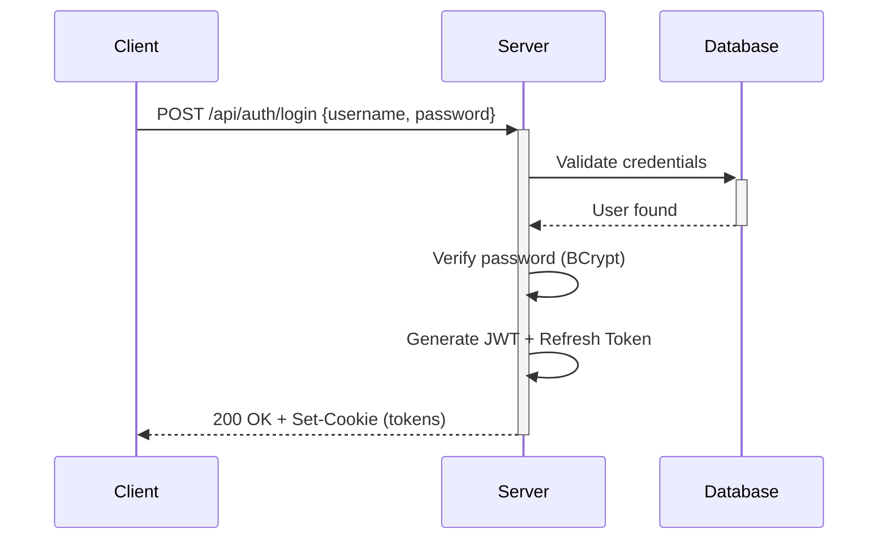

# JoiabagurPV Backend


Backend API for the JoiabagurPV jewelry point of sale management system.

## Stack

| Component | Technology | Version |
|-----------|------------|---------|
| **Framework** | ASP.NET Core | 10.0 |
| **Database** | PostgreSQL | 15+ |
| **ORM** | Entity Framework Core | 10.0 |
| **Logging** | Serilog | Latest |
| **Authentication** | JWT Bearer | Built-in |
| **Validation** | FluentValidation | 11.x |
| **HTTP resilience** | Microsoft.Extensions.Http.Resilience (Polly v8) | 10.8.0 |

## Project Structure

```
backend/
├── src/
│   ├── JoiabagurPV.API/          # Web API layer (controllers, middleware)
│   ├── JoiabagurPV.Application/  # Application layer (services, DTOs)
│   ├── JoiabagurPV.Domain/       # Domain layer (entities, interfaces)
│   ├── JoiabagurPV.Infrastructure/ # Infrastructure layer (EF Core, repositories)
│   └── JoiabagurPV.Tests/        # Unit and integration tests
├── docker-compose.yml            # Development Docker configuration
└── scripts/                      # Database initialization scripts
```

## Prerequisites

- [.NET 10 SDK](https://dotnet.microsoft.com/download/dotnet/10.0)
- [Docker Desktop](https://www.docker.com/products/docker-desktop) (for PostgreSQL)
- IDE: Visual Studio 2022, VS Code, or JetBrains Rider

## Getting Started

### 1. Start the local services

```bash
docker-compose up -d
```

This starts three services: `postgres` (image `pgvector/pgvector:pg15`, published on **5433**), `pgadmin` (8080) and `jbg-ai`, the Python AI microservice (8001) — see [`ai-service/README.md`](../ai-service/README.md). To start only the database, run `docker-compose up -d postgres`.

### 2. Install Dependencies

```bash
cd src/JoiabagurPV.API
dotnet restore
```

### 3. Configure Application

**Nothing to create.** `appsettings.json` already ships working development defaults — database on port 5433, a development JWT key, and the `AiGateway` section pointing at the port Compose publishes for `jbg-ai`. `appsettings.Development.json` also exists and is versioned: it carries the readable console logging profile, so do not overwrite it.

To change something on your own machine, create `appsettings.Local.json` in `src/JoiabagurPV.API/` — it is gitignored — and override only what you need:

```json
{
  "ConnectionStrings": {
    "DefaultConnection": "Host=localhost;Port=5433;Database=joiabagur_pv;Username=postgres;Password=yours"
  }
}
```

For anything genuinely secret, prefer .NET user-secrets (`dotnet user-secrets set`), which stores values in your user profile instead of the working tree. See [Configuration](#configuration).

### 4. Create your launch profile

`Properties/launchSettings.json` is **gitignored**: it pins ports and environment variables to your own machine, so each developer keeps a separate one. Copy the versioned template:

```bash
# Windows PowerShell
Copy-Item src/JoiabagurPV.API/Properties/launchSettings.Example.json `
          src/JoiabagurPV.API/Properties/launchSettings.json

# Linux/Mac
cp src/JoiabagurPV.API/Properties/launchSettings.Example.json \
   src/JoiabagurPV.API/Properties/launchSettings.json
```

**This step is not optional, and skipping it fails in a way that does not point at its cause.** With no launch profile, `ASPNETCORE_ENVIRONMENT` is unset and .NET falls back to `Production`. Under `Production`, `AuthController.SetTokenCookies` issues the session cookie with `SameSite=None` and — since there is no HTTPS locally — `Secure=false`. Every modern browser rejects that combination: `POST /api/auth/login` answers `200`, the cookie is discarded silently, and every authenticated call after it answers `401`. `curl` does not enforce the rule, so a smoke test from the terminal passes while the browser cannot log in at all.

Which one you are getting:

```bash
curl -s -i -X POST http://localhost:5056/api/auth/login \
  -H "Content-Type: application/json" \
  -d '{"username":"admin","password":"Admin123!"}' | grep -i set-cookie
```

`samesite=lax` is correct. `samesite=none` means the profile was not applied.

Two properties of the file itself:

- **It admits no comments.** Unlike `appsettings*.json`, which the configuration binder reads leniently, `launchSettings.json` is parsed as strict JSON by the SDK. A single `//` line rejects the whole file with `'/' is an invalid start of a property name`, and `dotnet run` carries on with no profile — straight back to `Production`, with the cookie symptom above.
- **Port 5056 is not arbitrary.** It is the value [`frontend/.env.development`](../frontend/.env.development) expects in `VITE_API_BASE_URL`. Change it and the SPA stops finding the API.

### 5. Setup HTTPS Certificates (Development)

Only needed for the `https` profile; the `http` profile of step 4 works without it.

```bash
# Windows PowerShell
.\setup-dev-certificates.ps1

# Linux/Mac
./setup-dev-certificates.sh
```

### 6. Run the Application

```bash
cd src/JoiabagurPV.API
dotnet run
```

With no arguments, `dotnet run` picks the **first** profile in `launchSettings.json` — `http`:
- **API**: `http://localhost:5056`
- **Scalar API Reference**: `http://localhost:5056/scalar/v1`
- **OpenAPI document**: `http://localhost:5056/openapi/v1.json`

Over HTTPS (requires step 5), `dotnet run --launch-profile https`:
- **API**: `https://localhost:7169`
- **Scalar API Reference**: `https://localhost:7169/scalar/v1`
- **OpenAPI document**: `https://localhost:7169/openapi/v1.json`

Scalar and the OpenAPI document are mapped only when the environment is `Development`, which is another thing the launch profile of step 4 is what turns on.

## Authentication

### Overview

The system uses JWT-based authentication with HTTP-only cookies for token storage.

```
┌─────────────────┐     ┌─────────────────┐     ┌─────────────────┐
│   Client App    │────▶│   Auth API      │────▶│   Database      │
│                 │     │   (JWT tokens)  │     │   (PostgreSQL)  │
└─────────────────┘     └─────────────────┘     └─────────────────┘
```

### Authentication Flow

#### Login Flow

1. Client sends credentials to `POST /api/auth/login`
2. Server validates username and password (BCrypt)
3. Server generates JWT access token (1 hour) and refresh token (8 hours)
4. Tokens are set as HTTP-only cookies
5. Server returns user information



#### Token Refresh Flow

1. Client calls `POST /api/auth/refresh` (refresh token sent automatically via cookie)
2. Server validates refresh token
3. Server revokes old refresh token and issues new tokens
4. New tokens are set as cookies

#### Logout Flow

1. Client calls `POST /api/auth/logout`
2. Server revokes refresh token in database
3. Cookies are cleared

### Endpoints

| Endpoint | Method | Auth | Description |
|----------|--------|------|-------------|
| `/api/auth/login` | POST | No | Authenticate with username/password |
| `/api/auth/refresh` | POST | No* | Refresh access token |
| `/api/auth/logout` | POST | No | Revoke tokens and clear cookies |
| `/api/auth/me` | GET | Yes | Get current user information |

*Requires valid refresh token cookie

### Token Configuration

| Setting | Default | Description |
|---------|---------|-------------|
| `AccessTokenExpirationMinutes` | 60 | JWT access token validity |
| `RefreshTokenExpirationHours` | 8 | Refresh token validity (work shift) |

### Security Features

- **HTTP-only cookies**: Tokens are stored in HTTP-only cookies, preventing XSS attacks
- **Secure cookies**: Cookies require HTTPS in production
- **SameSite strict**: Prevents CSRF attacks
- **Token rotation**: Refresh tokens are rotated on each use
- **Token revocation**: Refresh tokens can be revoked immediately
- **Rate limiting**: Login endpoint is rate-limited (30 attempts per 10 minutes per IP)

## Authorization

### Role-Based Access Control (RBAC)

The system has two roles:

| Role | Description | Permissions |
|------|-------------|-------------|
| **Admin** | System administrator | Full access to all features |
| **Operator** | Point of sale operator | Access to assigned points of sale only |

### Authorization Matrix

| Endpoint | Admin | Operator |
|----------|-------|----------|
| `GET /api/auth/me` | ✅ | ✅ |
| `GET /api/users` | ✅ | ❌ |
| `POST /api/users` | ✅ | ❌ |
| `PUT /api/users/{id}` | ✅ | ❌ |
| `PUT /api/users/{id}/password` | ✅ | ❌ |
| `GET /api/users/{id}/point-of-sales` | ✅ | ❌ |
| `POST /api/users/{id}/point-of-sales/{posId}` | ✅ | ❌ |
| `DELETE /api/users/{id}/point-of-sales/{posId}` | ✅ | ❌ |
| `GET /api/inventory` | ✅ | ✅* |
| `GET /api/inventory/assigned` | ✅ | ✅* |
| `GET /api/inventory/centralized` | ✅ | ❌ |
| `GET /api/inventory/movements` | ✅ | ✅* |
| `POST /api/inventory/assign` | ✅ | ❌ |
| `POST /api/inventory/unassign` | ✅ | ❌ |
| `POST /api/inventory/import` | ✅ | ❌ |
| `POST /api/inventory/adjustment` | ✅ | ❌ |
| `GET /api/inventory/import-template` | ✅ | ❌ |
| `POST /api/ai/search` | ✅‡ | ✅* |
| `POST /api/ai/search-events/{id}/selection` | ✅** | ✅** |
| `POST /api/ai/catalog/enrich-batch` | ✅ | ❌ |
| `POST /api/ai/catalog/family-suggestions` | ✅ | ❌ |
| `POST /api/ai/catalog/family-suggestions/apply` | ✅ | ❌ |
| `POST /api/ai/catalog/family-audit` | ✅ | ❌ |
| `POST /api/ai/catalog/family-verdicts` | ✅ | ❌ |
| `GET /api/ai/catalog/family-verdicts` | ✅ | ❌ |
| `GET /api/ai/catalog/family-review-metrics` | ✅ | ❌ |
| `GET /api/product-families` | ✅ | ❌ |
| `POST /api/product-families` | ✅ | ❌ |
| `GET /api/product-families/{id}` | ✅ | ✅ |
| `PUT /api/product-families/{id}` | ✅ | ❌ |
| `PUT /api/product-families/{id}/members` | ✅ | ❌ |
| `DELETE /api/product-families/{id}` | ✅ | ❌ |
| `GET /api/products/{id}/family` | ✅ | ✅ |
| `GET /api/ai/index-feed/catalog` | ❌† | ❌† |
| `GET /api/ai/index-feed/pos-availability` | ❌† | ❌† |

*Operators see only their assigned points of sale
† Service API key `X-Index-Feed-Key` only. A user JWT, an `access_token` cookie or a C03 token is **401**.
‡ Assisted search requires a concrete point of sale in the body, for every role. Operators are checked against their assignments; administrators hold none, so they may pick any **active** point of sale — an inactive one is **400** for everyone. The request-rate policy is partitioned by user, not by network address.
**Ownership, not role: only the operator who ran that search may record its selection

### Product families

Variants of one piece — the same ring in sizes S, M and L — grouped as an editable business entity.
Writing is administrator-only, like the rest of catalogue administration. **Reading is open to any
authenticated user and is not filtered by point of sale**: which variants exist is a fact about the
catalogue, not about where stock happens to sit, and applying inventory visibility here would make
the sibling list depend on it.

```jsonc
// PUT /api/product-families/{id}/members — the complete membership, declared
{ "members": [ { "productId": "...", "variantLabel": "S" },
               { "productId": "...", "variantLabel": "M" } ] }
```

Membership is **declarative, not incremental**. Whatever is absent from the list stops being a
member, each member's position comes from its place in the list — so gaps and duplicate positions
cannot be expressed — and an empty list dissolves the family without deleting it. Declaring the list
a family already has writes nothing, which keeps the indexing feed from being handed a change that
did not happen. Products that enter or leave (and stayers on a reorder or label change) get
`Product.UpdatedAt` stamped via `ExecuteUpdateAsync`, so the catalog feed cursor can see them. A
metadata rename stamps the family only.

A product belongs to **at most one family**, enforced by a unique index rather than by a check in
code. Declaring one that belongs elsewhere returns `409` naming the products that clash and the
family holding each of them.

`GET /api/products/{id}/family` distinguishes three answers: `404` when there is no such product,
`204` when the product exists and belongs to no family, and `200` with the family otherwise. The
middle case is ordinary rather than exceptional — a sizeable share of the catalogue is deliberately
unfamilied — and collapsing it into the `404` would leave callers unable to tell a quality incidence
from a bad identifier.

#### Assisted grouping

Families can also be created from a proposal `jbg-ai` computes. The two operations are separate
endpoints because they do different things: `POST /api/ai/catalog/family-suggestions` asks the
service for groupings and **writes nothing at all** — no family, no membership, no watermark — while
`POST /api/ai/catalog/family-suggestions/apply` persists the subset the administrator hands back.
Nothing is stored between the two calls, so there is no proposal store to keep in step with the
catalog.

Applying goes through the same `ProductFamilyService` as the manual endpoints, never by direct SQL,
which is what keeps the indexing feed's watermark coherent, and records `Origin = AiApproved` with
the approving administrator and the instant — the first write of three columns the family schema
reserved and had left empty. A family created through the manual endpoints still records `Manual`.

**A contested product answers `200`, not `409`.** The batch is on the order of a hundred and fifty
families, and one product that meanwhile joined another family must not cost the administrator the
rest of the approvals: that family is skipped whole — never half-created — and named in the response
alongside whoever holds its products, while the others are created. The `409` above stays the answer
of the manual endpoints, which create one family and only one.

### Catalog AI enrichment

`POST /api/ai/catalog/enrich-batch` is administrator-only, and for two reasons rather than one:
it rewrites what the catalog claims about a piece, and it spends money on a model provider.

```jsonc
// Request
{ "productIds": ["..."],                 // 1..50, mirroring the AI contract's own batch limit
  "reviewMode": "Routed" | "AutoBulk",   // Routed by default
  "force": false }                       // true re-enriches even when the inputs are unchanged

// Response 200
{ "requested": 50, "enriched": 47, "skippedUnchanged": 3, "skippedConcurrent": 0, "failed": 0,
  "profiles": [ { "productId": "...", "reviewStatus": "Pending", "fieldsPendingReview": ["piece_type"] } ] }
```

- **`Routed`** applies the hybrid review policy: a sensitive field (piece type, materials, stone,
  size) that a model *inferred* sends the profile to review; the same field produced by a
  deterministic rule does not; commercial tags auto-approve above the configured threshold.
- **`AutoBulk`** approves everything so the catalog can be indexed, and stamps the origin so that
  it stays distinguishable from human review in every metric. The per-field confidence and
  provenance are written in both modes, so it remains answerable afterwards how much of the
  corpus nobody looked at.
- **Idempotent**: a product whose inputs are unchanged is skipped and **no call is made to the AI
  service** for it. That protects both the model bill and any review a person already did.
- **503, never a degraded answer**, when the AI service has no enrichment implementation yet:
  unlike search, which can fall back to the lexical index, producing attributes without the
  extractor would mean inventing catalog data.

Thresholds live under the `ProfileReview` configuration section and are validated at start-up.
They are meant to be recalibrated against the evaluation golden set, which a compiled constant
would prevent.

### Point of Sale Access Control

Operators are assigned to specific points of sale. When accessing data:

1. **Admin**: Access to all points of sale
2. **Operator**: Filtered to assigned points of sale only
3. **Ownership is a separate axis**: the admin bypass covers point-of-sale access, not ownership of a record. Recording the selection on a search event (`POST /api/ai/search-events/{id}/selection`) answers 403 to anyone who does not own that event, administrators included — the row is the record of what one specific person did, and letting anyone else complete it would corrupt the data without leaving a trace.

## User Management

### Endpoints

| Endpoint | Method | Description |
|----------|--------|-------------|
| `/api/users` | GET | List all users |
| `/api/users/{id}` | GET | Get user by ID |
| `/api/users` | POST | Create new user |
| `/api/users/{id}` | PUT | Update user |
| `/api/users/{id}/password` | PUT | Change user password |
| `/api/users/{id}/point-of-sales` | GET | Get user's point of sale assignments |
| `/api/users/{id}/point-of-sales/{posId}` | POST | Assign user to point of sale |
| `/api/users/{id}/point-of-sales/{posId}` | DELETE | Unassign user from point of sale |

## Inventory Management

### Overview

The inventory management system tracks product stock across multiple points of sale with full audit trails.

```
┌─────────────────┐     ┌─────────────────┐     ┌─────────────────┐
│   Point of Sale │────▶│    Inventory    │────▶│   Movements     │
│   (Location)    │     │   (Stock)       │     │   (Audit Trail) │
└─────────────────┘     └─────────────────┘     └─────────────────┘
```

### Key Features

- **Product Assignment**: Assign products to points of sale before stock can be tracked
- **Stock Import**: Bulk import stock from Excel files with validation
- **Manual Adjustments**: Adjust stock quantities with mandatory reason tracking
- **Movement History**: Complete audit trail of all inventory changes
- **Centralized View**: Admin-only aggregated stock view across all locations

### Inventory Endpoints

| Endpoint | Method | Auth | Description |
|----------|--------|------|-------------|
| `/api/inventory` | GET | Yes | Get stock for a point of sale |
| `/api/inventory/assigned` | GET | Yes | Get products assigned to a point of sale |
| `/api/inventory/centralized` | GET | Admin | Get aggregated stock view |
| `/api/inventory/product/{id}` | GET | Yes | Get stock breakdown for a product |
| `/api/inventory/assign` | POST | Admin | Assign product to point of sale |
| `/api/inventory/assign/bulk` | POST | Admin | Bulk assign products |
| `/api/inventory/unassign` | POST | Admin | Unassign product (requires 0 stock) |
| `/api/inventory/import` | POST | Admin | Import stock from Excel |
| `/api/inventory/import/validate` | POST | Admin | Validate Excel file without importing |
| `/api/inventory/import-template` | GET | Admin | Download Excel import template |
| `/api/inventory/adjustment` | POST | Admin | Manual stock adjustment |
| `/api/inventory/movements` | GET | Yes | Get movement history with filters |

### Excel Import Format

The stock import feature uses Excel files with the following format:

| Column | Required | Description |
|--------|----------|-------------|
| `SKU` | Yes | Product SKU (must exist in catalog) |
| `Quantity` | Yes | Quantity to add (≥ 0) |

**Important Notes:**
- Column names must match exactly (case-sensitive)
- Quantities are **added** to existing stock
- Products not assigned to the point of sale will be **automatically assigned**
- Download the template from `GET /api/inventory/import-template`

### Stock Adjustment

Manual adjustments require:
- Product must be assigned to the point of sale
- Reason is mandatory (max 500 characters)
- Resulting stock cannot be negative

### Movement Types

| Type | Description |
|------|-------------|
| `Sale` | Stock decreased by sales (automatic) |
| `Return` | Stock increased by returns (automatic) |
| `Adjustment` | Manual adjustment with reason |
| `Import` | Stock added via Excel import |

### Default Admin User

On first run, a default admin user is created:

- **Username**: `admin`
- **Password**: `Admin123!`

> ⚠️ **Important**: Change the default password immediately after first login!

### Password Requirements

- Minimum 8 characters
- Must contain at least one uppercase letter
- Must contain at least one lowercase letter
- Must contain at least one digit
- Must contain at least one special character

## Testing

### Run All Tests

```bash
cd src/JoiabagurPV.Tests
dotnet test
```

> **The suite comes back red, and it is not you.** Around fifty failures predate any
> given change. They are defects in the tests and dependency drift, not in the
> application — and most went unnoticed for weeks because the integration tree only
> runs when Docker is up, while CI only fires on `main` and `develop`.
>
> Judge a change by the failing test **names** against a stashed baseline
> (`git stash push -u`, run, `git stash pop`), never by the count: a handful of the
> failures are order-dependent, so two runs of identical code disagree.
>
> Inventory, root causes and what it would take to close them: *Estado de la suite:
> fallos conocidos* in [../Documentos/testing-backend.md](../Documentos/testing-backend.md).

### Run with Coverage

```bash
# Run tests with coverage collection
dotnet test --collect:"XPlat Code Coverage" --results-directory ./TestResults

# Generate HTML report (requires ReportGenerator)
dotnet tool install --global dotnet-reportgenerator-globaltool
reportgenerator -reports:"./TestResults/**/coverage.cobertura.xml" -targetdir:"./TestResults/CoverageReport" -reporttypes:Html

# Open the report
start ./TestResults/CoverageReport/index.html  # Windows
open ./TestResults/CoverageReport/index.html   # macOS
xdg-open ./TestResults/CoverageReport/index.html  # Linux
```

### Coverage Requirements

| Metric | Minimum Threshold |
|--------|-------------------|
| Line Coverage | 70% |

The CI pipeline enforces a minimum **70% line coverage**. Pull requests that reduce coverage below this threshold will fail the build.

### Test Structure

```
JoiabagurPV.Tests/
├── UnitTests/
│   ├── Application/           # Service unit tests
│   │   ├── AuthenticationServiceTests.cs
│   │   ├── UserServiceTests.cs
│   │   ├── UserPointOfSaleServiceTests.cs
│   │   └── JwtTokenServiceTests.cs
│   └── Domain/               # Entity unit tests
├── IntegrationTests/         # API integration tests
│   ├── ApiWebApplicationFactory.cs
│   ├── AuthControllerTests.cs
│   ├── UsersControllerTests.cs
│   ├── AuthorizationTests.cs
│   └── RateLimitingTests.cs
└── TestHelpers/
    ├── TestBase.cs
    └── TestDataGenerator.cs
```

### Integration Tests

Integration tests use **Testcontainers** to spin up a real PostgreSQL instance:

```bash
# Requires Docker running
dotnet test --filter "FullyQualifiedName~IntegrationTests"
```

## API Documentation

OpenAPI documentation is served with Scalar (not Swagger UI) at `/scalar/v1` when running in development mode; the raw document is at `/openapi/v1.json`.

### Response Codes

| Code | Description |
|------|-------------|
| 200 | Success |
| 201 | Created |
| 204 | No Content |
| 400 | Bad Request (validation error) |
| 401 | Unauthorized (not authenticated) |
| 403 | Forbidden (not authorized) |
| 404 | Not Found |
| 409 | Conflict (duplicate resource) |
| 429 | Too Many Requests (rate limited) |
| 500 | Internal Server Error |

## Configuration

### Environment Variables

| Variable | Description | Default |
|----------|-------------|---------|
| `ConnectionStrings__DefaultConnection` | PostgreSQL connection string | Required |
| `Jwt__SecretKey` | JWT signing key (min 32 chars) | Required |
| `Jwt__Issuer` | JWT issuer | JoiabagurPV |
| `Jwt__Audience` | JWT audience | JoiabagurPV |
| `Jwt__AccessTokenExpirationMinutes` | Access token expiry | 60 |
| `Jwt__RefreshTokenExpirationHours` | Refresh token expiry | 8 |
| `AiGateway__BaseUrl` | Address of the `jbg-ai` service | Required |
| `AiGateway__JwtSecret` | HS256 secret for the internal service token — must match the service's `JWT_SECRET` literally | Required |
| `AiGateway__RetrievalTimeoutMs` | Time budget for a retrieval call. **Temporarily 2500 rather than the 800 ms the design specifies**: measured against the seeded world, at 800 ms the assisted path degraded on *every* search, because the AI service rebuilds its embedding client per request and so never gets a cache hit. Put back to 800 once that is fixed — see `openspec/DEFERRED_TASKS.md` | 2500 |
| `IndexFeed__ApiKey` | Service key for `GET /api/ai/index-feed/*` (`X-Index-Feed-Key`). Distinct from `Jwt__SecretKey` and `AiGateway__JwtSecret`. Min 32 characters | Required |
| `IndexFeed__ApiKeyPrevious` | Previous key during rotation. Empty = unset | Optional |
| `IndexFeed__SalesAsOf` | Reference instant the POS `sales30d` / `sales90d` windows are counted against, reported on the page as `computedAsOf`. **Must carry a UTC offset** (`2026-08-23T23:59:59Z`); a value without one stops the host rather than being read as local time. Absent = the wall clock, which is the behaviour that predates the setting. Configured at `2026-08-23T23:59:59Z` in `appsettings.json` because the synthetic world's last real sale is that date and, counted against the wall clock, `sales30d` empties to zero within weeks — a ranking sweep would then record "rotation does not improve results" as a finding instead of as an artefact of the calendar. It is also what makes the aggregates reproducible: the same configuration and seed must yield the same figures on different days | Optional |
| `AiSearch__EnabledPointOfSaleIds__0`, `__1`, … | Points of sale where assisted search uses the AI path. Reloaded without a redeploy | Empty |
| `AiSearch__EnabledByDefault` | Whether points of sale absent from that list use the AI path | false |
| `AiSearch__CandidateWindow` | Page size requested from `jbg-ai`, which is the over-retrieval dial. 20 saturates the service's cap of 60 candidates | 20 |
| `AiSearch__RateLimitPermitLimit` / `AiSearch__RateLimitWindowSeconds` | Requests one user may issue per window | 30 / 60 |

`AiGateway` is validated at start-up, not on first use: if the base address is missing or is not an absolute http/https URI, or the secret is absent or shorter than 32 characters, **the API does not start** and the error names the offending key. That is deliberate — a mismatched secret makes `jbg-ai` answer 401 without disclosing why, so the fault is caught at boot instead of during a request. Set `AiGateway__Enabled=false` to skip registering the client altogether.

`IndexFeed:ApiKey` is validated the same way: missing or shorter than 32 characters stops the host. An empty `IndexFeed:ApiKeyPrevious` is unset; a short non-empty previous key also fails at start-up. `IndexFeed:SalesAsOf` is optional, but when present it must declare a UTC offset: configuration binds it through `DateTime`'s type converter, which reads a value with no offset as the host's local time, so an ambiguous instant fails at start-up instead of quietly moving every sales window by a timezone.

`AiSearch` is also validated at start-up, and its list of enabled points of sale is read through `IOptionsMonitor` so a shop can be switched on or off without a redeploy — which is the whole reason the switch lives in configuration instead of in a column on `PointOfSale`. It holds no secret, so nothing of it goes to SSM. The default is **not enabled**: turning assisted search on for a shop is an explicit act.

`POST /api/sales` and each line of `POST /api/sales/bulk` accept an optional `searchEventId`, which attributes the sale to the assisted search it came from and closes the loop that `POST /api/ai/search` opens. The identifier is only stored once the event is verified to exist **and to belong to the user making the sale** — the same ownership rule the selection endpoint applies, and for the same reason. Anything unusable degrades to no attribution: never a validation error, never a failed sale, and nothing else about the sale changes. The check is explicit rather than delegated to the foreign key, whose declared delete behaviour governs deletion of the event and would, on an insert carrying an unknown identifier, abort the whole transaction instead of degrading.

The address differs by environment and neither value is the obvious one: `http://localhost:8001` in development, because the API runs on the host and only sees the port Compose publishes, and `http://jbg-ai:8000` in production, where both containers share a Docker network.

### Configuration files and secrets

| File | Tracked | Purpose |
|------|---------|---------|
| `appsettings.json` | yes | Configuration and development placeholders |
| `appsettings.Development.json` | yes | Readable console logging profile |
| `appsettings.Production.json` | yes | JSON logging profile |
| `appsettings.Local.json`, `appsettings.*.Local.json` | **no** | Your machine-specific overrides |

`appsettings*.json` are **configuration** and belong in version control, development placeholders included. Real secrets never live in the repository: use .NET user-secrets locally, and SSM Parameter Store (`/jpv/prod/*`) in production, where the deploy script injects them as `__`-separated environment variables.

### Rate Limiting

Login endpoint is rate limited to prevent brute force attacks:

- **Limit**: 30 requests per 10 minutes per IP
- **Response**: 429 Too Many Requests

## Database Migrations

### Apply Migrations

```bash
cd src/JoiabagurPV.API
dotnet ef database update --project ../JoiabagurPV.Infrastructure
```

### Add New Migration

```bash
dotnet ef migrations add MigrationName --project ../JoiabagurPV.Infrastructure
```

## Production Deployment

Production does **not** use Docker Compose. The active path is `.github/workflows/deploy-aws-ec2.yml`: it builds the bundled image (API + SPA) from `src/JoiabagurPV.API/Dockerfile.bundled`, pushes it to ECR, and triggers `jpv-deploy.sh` on the EC2 instance through SSM. That script reads configuration from SSM Parameter Store and starts the container with `docker run`, injecting each value as a `__`-separated environment variable. The database is RDS, outside the instance.

```bash
# Deployment is triggered by pushing to main/master, or manually:
gh workflow run deploy-aws-ec2.yml
```

> `docker-compose.prod.yml` is **not** the production deployment: no workflow, terraform template or script invokes it, it builds the wrong Dockerfile, and it declares its own Postgres container where production uses RDS. It survived the move to the bundled-image path and now carries a deprecation header, together with the two image definitions only it and the deprecated App Runner workflow ever built — `src/JoiabagurPV.API/Dockerfile` and `Dockerfile.prod` (C17).

### Demo environment

C17 adds a **second, fully isolated** deployment path, in a different AWS account, for the public demonstration of the AI service. It does not share infrastructure, permissions, workflows or data with the shop's production account, and nothing in it can affect production.

| Piece | File |
|---|---|
| Infrastructure, with its own state | `terraform/demo/` |
| Four-service composition (proxy, API, AI service, database) | `compose.demo.yaml`, at the repository root |
| Reverse proxy configuration and deployment script | `deploy/demo/` |
| Runbook: account set-up, schema provisioning, data path, demo accounts | `deploy/demo/README.md` |
| Image, built with a **relative** API base so it serves under any hostname | `src/JoiabagurPV.API/Dockerfile.demo` |
| Workflow, on the `demo` branch | `.github/workflows/deploy-demo.yml` |

`Dockerfile.bundled` — the production image — is **not** touched by that path, and neither is anything under `terraform/` outside `terraform/demo/`.

### Security Checklist

- [ ] Change default admin password
- [ ] Use strong JWT secret key (32+ characters)
- [ ] Configure HTTPS
- [ ] Set appropriate CORS origins
- [ ] Enable rate limiting
- [ ] Configure proper logging
- [ ] Set up database backups
