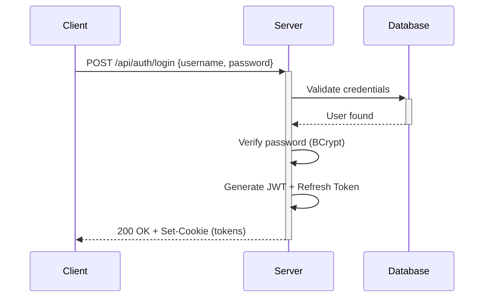

# JoiabagurPV Backend


Backend API for the JoiabagurPV jewelry point of sale management system.

## Stack

| Component | Technology | Version |
|-----------|------------|---------|
| **Framework** | ASP.NET Core | 10.0 |
| **Database** | PostgreSQL | 15+ |
| **ORM** | Entity Framework Core | 10.0 |
| **Logging** | Serilog | Latest |
| **Authentication** | JWT Bearer | Built-in |
| **Validation** | FluentValidation | 11.x |

## Project Structure

```
backend/
├── src/
│   ├── JoiabagurPV.API/          # Web API layer (controllers, middleware)
│   ├── JoiabagurPV.Application/  # Application layer (services, DTOs)
│   ├── JoiabagurPV.Domain/       # Domain layer (entities, interfaces)
│   ├── JoiabagurPV.Infrastructure/ # Infrastructure layer (EF Core, repositories)
│   └── JoiabagurPV.Tests/        # Unit and integration tests
├── docker-compose.yml            # Development Docker configuration
└── scripts/                      # Database initialization scripts
```

## Prerequisites

- [.NET 10 SDK](https://dotnet.microsoft.com/download/dotnet/10.0)
- [Docker Desktop](https://www.docker.com/products/docker-desktop) (for PostgreSQL)
- IDE: Visual Studio 2022, VS Code, or JetBrains Rider

## Getting Started

### 1. Start the local services

```bash
docker-compose up -d
```

This starts three services: `postgres` (image `pgvector/pgvector:pg15`, published on **5433**), `pgadmin` (8080) and `jbg-ai`, the Python AI microservice (8001) — see [`ai-service/README.md`](../ai-service/README.md). To start only the database, run `docker-compose up -d postgres`.

### 2. Install Dependencies

```bash
cd src/JoiabagurPV.API
dotnet restore
```

### 3. Configure Application

Create `appsettings.Development.json` in `src/JoiabagurPV.API/`:

```json
{
  "ConnectionStrings": {
    "DefaultConnection": "Host=localhost;Port=5433;Database=joiabagur_pv;Username=postgres;Password=password"
  },
  "Jwt": {
    "SecretKey": "YourSuperSecretKeyThatIsAtLeast32CharactersLong!",
    "Issuer": "JoiabagurPV",
    "Audience": "JoiabagurPV",
    "AccessTokenExpirationMinutes": "60",
    "RefreshTokenExpirationHours": "8"
  }
}
```

### 4. Setup HTTPS Certificates (Development)

```bash
# Windows PowerShell
.\setup-dev-certificates.ps1

# Linux/Mac
./setup-dev-certificates.sh
```

### 5. Run the Application

```bash
cd src/JoiabagurPV.API
dotnet run --launch-profile https
```

The API will be available at:
- **API**: `https://localhost:7169`
- **Scalar API Reference**: `https://localhost:7169/scalar/v1`
- **OpenAPI document**: `https://localhost:7169/openapi/v1.json`

## Authentication

### Overview

The system uses JWT-based authentication with HTTP-only cookies for token storage.

```
┌─────────────────┐     ┌─────────────────┐     ┌─────────────────┐
│   Client App    │────▶│   Auth API      │────▶│   Database      │
│                 │     │   (JWT tokens)  │     │   (PostgreSQL)  │
└─────────────────┘     └─────────────────┘     └─────────────────┘
```

### Authentication Flow

#### Login Flow

1. Client sends credentials to `POST /api/auth/login`
2. Server validates username and password (BCrypt)
3. Server generates JWT access token (1 hour) and refresh token (8 hours)
4. Tokens are set as HTTP-only cookies
5. Server returns user information



#### Token Refresh Flow

1. Client calls `POST /api/auth/refresh` (refresh token sent automatically via cookie)
2. Server validates refresh token
3. Server revokes old refresh token and issues new tokens
4. New tokens are set as cookies

#### Logout Flow

1. Client calls `POST /api/auth/logout`
2. Server revokes refresh token in database
3. Cookies are cleared

### Endpoints

| Endpoint | Method | Auth | Description |
|----------|--------|------|-------------|
| `/api/auth/login` | POST | No | Authenticate with username/password |
| `/api/auth/refresh` | POST | No* | Refresh access token |
| `/api/auth/logout` | POST | No | Revoke tokens and clear cookies |
| `/api/auth/me` | GET | Yes | Get current user information |

*Requires valid refresh token cookie

### Token Configuration

| Setting | Default | Description |
|---------|---------|-------------|
| `AccessTokenExpirationMinutes` | 60 | JWT access token validity |
| `RefreshTokenExpirationHours` | 8 | Refresh token validity (work shift) |

### Security Features

- **HTTP-only cookies**: Tokens are stored in HTTP-only cookies, preventing XSS attacks
- **Secure cookies**: Cookies require HTTPS in production
- **SameSite strict**: Prevents CSRF attacks
- **Token rotation**: Refresh tokens are rotated on each use
- **Token revocation**: Refresh tokens can be revoked immediately
- **Rate limiting**: Login endpoint is rate-limited (30 attempts per 10 minutes per IP)

## Authorization

### Role-Based Access Control (RBAC)

The system has two roles:

| Role | Description | Permissions |
|------|-------------|-------------|
| **Admin** | System administrator | Full access to all features |
| **Operator** | Point of sale operator | Access to assigned points of sale only |

### Authorization Matrix

| Endpoint | Admin | Operator |
|----------|-------|----------|
| `GET /api/auth/me` | ✅ | ✅ |
| `GET /api/users` | ✅ | ❌ |
| `POST /api/users` | ✅ | ❌ |
| `PUT /api/users/{id}` | ✅ | ❌ |
| `PUT /api/users/{id}/password` | ✅ | ❌ |
| `GET /api/users/{id}/point-of-sales` | ✅ | ❌ |
| `POST /api/users/{id}/point-of-sales/{posId}` | ✅ | ❌ |
| `DELETE /api/users/{id}/point-of-sales/{posId}` | ✅ | ❌ |
| `GET /api/inventory` | ✅ | ✅* |
| `GET /api/inventory/assigned` | ✅ | ✅* |
| `GET /api/inventory/centralized` | ✅ | ❌ |
| `GET /api/inventory/movements` | ✅ | ✅* |
| `POST /api/inventory/assign` | ✅ | ❌ |
| `POST /api/inventory/unassign` | ✅ | ❌ |
| `POST /api/inventory/import` | ✅ | ❌ |
| `POST /api/inventory/adjustment` | ✅ | ❌ |
| `GET /api/inventory/import-template` | ✅ | ❌ |

*Operators see only their assigned points of sale

### Point of Sale Access Control

Operators are assigned to specific points of sale. When accessing data:

1. **Admin**: Access to all points of sale
2. **Operator**: Filtered to assigned points of sale only

## User Management

### Endpoints

| Endpoint | Method | Description |
|----------|--------|-------------|
| `/api/users` | GET | List all users |
| `/api/users/{id}` | GET | Get user by ID |
| `/api/users` | POST | Create new user |
| `/api/users/{id}` | PUT | Update user |
| `/api/users/{id}/password` | PUT | Change user password |
| `/api/users/{id}/point-of-sales` | GET | Get user's point of sale assignments |
| `/api/users/{id}/point-of-sales/{posId}` | POST | Assign user to point of sale |
| `/api/users/{id}/point-of-sales/{posId}` | DELETE | Unassign user from point of sale |

## Inventory Management

### Overview

The inventory management system tracks product stock across multiple points of sale with full audit trails.

```
┌─────────────────┐     ┌─────────────────┐     ┌─────────────────┐
│   Point of Sale │────▶│    Inventory    │────▶│   Movements     │
│   (Location)    │     │   (Stock)       │     │   (Audit Trail) │
└─────────────────┘     └─────────────────┘     └─────────────────┘
```

### Key Features

- **Product Assignment**: Assign products to points of sale before stock can be tracked
- **Stock Import**: Bulk import stock from Excel files with validation
- **Manual Adjustments**: Adjust stock quantities with mandatory reason tracking
- **Movement History**: Complete audit trail of all inventory changes
- **Centralized View**: Admin-only aggregated stock view across all locations

### Inventory Endpoints

| Endpoint | Method | Auth | Description |
|----------|--------|------|-------------|
| `/api/inventory` | GET | Yes | Get stock for a point of sale |
| `/api/inventory/assigned` | GET | Yes | Get products assigned to a point of sale |
| `/api/inventory/centralized` | GET | Admin | Get aggregated stock view |
| `/api/inventory/product/{id}` | GET | Yes | Get stock breakdown for a product |
| `/api/inventory/assign` | POST | Admin | Assign product to point of sale |
| `/api/inventory/assign/bulk` | POST | Admin | Bulk assign products |
| `/api/inventory/unassign` | POST | Admin | Unassign product (requires 0 stock) |
| `/api/inventory/import` | POST | Admin | Import stock from Excel |
| `/api/inventory/import/validate` | POST | Admin | Validate Excel file without importing |
| `/api/inventory/import-template` | GET | Admin | Download Excel import template |
| `/api/inventory/adjustment` | POST | Admin | Manual stock adjustment |
| `/api/inventory/movements` | GET | Yes | Get movement history with filters |

### Excel Import Format

The stock import feature uses Excel files with the following format:

| Column | Required | Description |
|--------|----------|-------------|
| `SKU` | Yes | Product SKU (must exist in catalog) |
| `Quantity` | Yes | Quantity to add (≥ 0) |

**Important Notes:**
- Column names must match exactly (case-sensitive)
- Quantities are **added** to existing stock
- Products not assigned to the point of sale will be **automatically assigned**
- Download the template from `GET /api/inventory/import-template`

### Stock Adjustment

Manual adjustments require:
- Product must be assigned to the point of sale
- Reason is mandatory (max 500 characters)
- Resulting stock cannot be negative

### Movement Types

| Type | Description |
|------|-------------|
| `Sale` | Stock decreased by sales (automatic) |
| `Return` | Stock increased by returns (automatic) |
| `Adjustment` | Manual adjustment with reason |
| `Import` | Stock added via Excel import |

### Default Admin User

On first run, a default admin user is created:

- **Username**: `admin`
- **Password**: `Admin123!`

> ⚠️ **Important**: Change the default password immediately after first login!

### Password Requirements

- Minimum 8 characters
- Must contain at least one uppercase letter
- Must contain at least one lowercase letter
- Must contain at least one digit
- Must contain at least one special character

## Testing

### Run All Tests

```bash
cd src/JoiabagurPV.Tests
dotnet test
```

### Run with Coverage

```bash
# Run tests with coverage collection
dotnet test --collect:"XPlat Code Coverage" --results-directory ./TestResults

# Generate HTML report (requires ReportGenerator)
dotnet tool install --global dotnet-reportgenerator-globaltool
reportgenerator -reports:"./TestResults/**/coverage.cobertura.xml" -targetdir:"./TestResults/CoverageReport" -reporttypes:Html

# Open the report
start ./TestResults/CoverageReport/index.html  # Windows
open ./TestResults/CoverageReport/index.html   # macOS
xdg-open ./TestResults/CoverageReport/index.html  # Linux
```

### Coverage Requirements

| Metric | Minimum Threshold |
|--------|-------------------|
| Line Coverage | 70% |

The CI pipeline enforces a minimum **70% line coverage**. Pull requests that reduce coverage below this threshold will fail the build.

### Test Structure

```
JoiabagurPV.Tests/
├── UnitTests/
│   ├── Application/           # Service unit tests
│   │   ├── AuthenticationServiceTests.cs
│   │   ├── UserServiceTests.cs
│   │   ├── UserPointOfSaleServiceTests.cs
│   │   └── JwtTokenServiceTests.cs
│   └── Domain/               # Entity unit tests
├── IntegrationTests/         # API integration tests
│   ├── ApiWebApplicationFactory.cs
│   ├── AuthControllerTests.cs
│   ├── UsersControllerTests.cs
│   ├── AuthorizationTests.cs
│   └── RateLimitingTests.cs
└── TestHelpers/
    ├── TestBase.cs
    └── TestDataGenerator.cs
```

### Integration Tests

Integration tests use **Testcontainers** to spin up a real PostgreSQL instance:

```bash
# Requires Docker running
dotnet test --filter "FullyQualifiedName~IntegrationTests"
```

## API Documentation

OpenAPI documentation is served with Scalar (not Swagger UI) at `/scalar/v1` when running in development mode; the raw document is at `/openapi/v1.json`.

### Response Codes

| Code | Description |
|------|-------------|
| 200 | Success |
| 201 | Created |
| 204 | No Content |
| 400 | Bad Request (validation error) |
| 401 | Unauthorized (not authenticated) |
| 403 | Forbidden (not authorized) |
| 404 | Not Found |
| 409 | Conflict (duplicate resource) |
| 429 | Too Many Requests (rate limited) |
| 500 | Internal Server Error |

## Configuration

### Environment Variables

| Variable | Description | Default |
|----------|-------------|---------|
| `ConnectionStrings__DefaultConnection` | PostgreSQL connection string | Required |
| `Jwt__SecretKey` | JWT signing key (min 32 chars) | Required |
| `Jwt__Issuer` | JWT issuer | JoiabagurPV |
| `Jwt__Audience` | JWT audience | JoiabagurPV |
| `Jwt__AccessTokenExpirationMinutes` | Access token expiry | 60 |
| `Jwt__RefreshTokenExpirationHours` | Refresh token expiry | 8 |

### Rate Limiting

Login endpoint is rate limited to prevent brute force attacks:

- **Limit**: 30 requests per 10 minutes per IP
- **Response**: 429 Too Many Requests

## Database Migrations

### Apply Migrations

```bash
cd src/JoiabagurPV.API
dotnet ef database update --project ../JoiabagurPV.Infrastructure
```

### Add New Migration

```bash
dotnet ef migrations add MigrationName --project ../JoiabagurPV.Infrastructure
```

## Production Deployment

### Docker

```bash
docker-compose -f docker-compose.prod.yml up -d
```

### Security Checklist

- [ ] Change default admin password
- [ ] Use strong JWT secret key (32+ characters)
- [ ] Configure HTTPS
- [ ] Set appropriate CORS origins
- [ ] Enable rate limiting
- [ ] Configure proper logging
- [ ] Set up database backups
