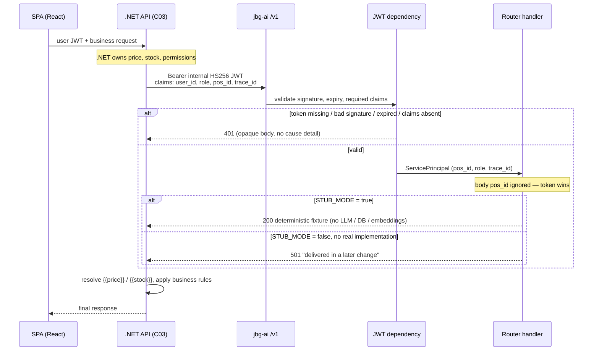

## Context

C01 (`init-ai-service-skeleton`, archived) left `jbg-ai` runnable but empty: `create_app()`, public `GET /health`, `Settings` with `APP_ENV` / `SERVICE_VERSION` fail-fast, `TraceIdMiddleware`, and `docs_url=None`. There are no `/v1` routers, no schemas, no auth and no OpenAPI artifact.

This change is Ola 0 / C02 / HU-AIENG-002 / T-AIENG-002. Its job is to **freeze the Python ↔ .NET boundary** so the typed .NET client (C03) and the vertical slice (C14–C16) can be built against a stable contract while the real retrieval, enrichment and indexing logic is still missing. The boundary rule from design v3 §6.2 is what this contract materializes: *Python computes similarity and writes prose; .NET computes numbers and decides*.

**Contract sources.** The plan's C02 card cites "§6.8" of the design, but design v3 ends at §6.4. The endpoint table lives in the 3devs document §6.8; v3 contributes the deltas: `materials[]`, families with `variant_label`, over-retrieval (§7.6), price/stock placeholders (§7.7) and `inventory/propose`. This change reconstructs the contract from both and declares the committed `openapi.json` plus these specs the authority until the design prose is resynchronized (editorial work, non-blocking).

**Stakeholders:** the two Proyecto Final developers. No end-user surface: the SPA never talks to Python, and the operator sees nothing from this change.

## Goals / Non-Goals

**Goals:**

- Eight frozen `/v1` endpoints with complete Pydantic request/response models, plus the unchanged public `GET /health`
- Internal HS256 service JWT validated as a FastAPI dependency, producing a `ServicePrincipal`; `/v1/*` is 401 without a valid token
- Token-over-body precedence for `pos_id` and `role`, so scope can never be spoofed from a request body
- Deterministic, I/O-free stubs behind `STUB_MODE`, reproducible enough for C03 to write mapping tests against them
- Observable over-retrieval: `top_k` is the page size .NET wants *after* hydration; `candidates_returned` exposes what the retriever actually produced
- Versioned `ai-service/openapi.json` with a strict snapshot test that turns any contract drift into a failing build and an explicit negotiation
- `uv run pytest` green with no LLM, embedding or RDS calls

**Non-Goals:**

- Real retrieval, enrichment, indexing or agentic loops — stubs are replaced route by route in C09, C13, C14, C30…
- JWT issuance/signing and the Polly-wrapped `IAiGatewayClient` on the .NET side (C03)
- `POST /v1/retrieval/complementary` and `POST /v1/families/suggest` — later changes, with explicit OpenAPI negotiation
- Schema `ai`, `CREATE EXTENSION vector`, Alembic, any database access (C05)
- Any SQL read or write against schema `public` — forbidden by design for the Python role
- Production deploy, SSM secrets, nginx exposure and enriched health (C17)

## Decisions

### 1. Freeze the contract now, behind stubs — not after the real logic exists

- **Choice:** Publish complete request/response models for all eight endpoints and back them with deterministic fixtures.
- **Why:** C03 and the slice are on the critical path; waiting for real retrieval serializes two developers for weeks. A contract frozen against a snapshot test is cheaper to negotiate than a contract discovered late.
- **Alternatives discarded:** Ship only `retrieval/products` now and grow the surface per change (every later change reopens the .NET client); mock the whole service in .NET instead (mocks drift from the real service silently).

### 2. Contract width: include optional fields the stubs barely fill

- **Choice:** `debug`, `usage`, `match_reasons`, `similarity_signals`, `low_confidence`, `clarification_question` are part of the frozen models even though stubs fill them minimally.
- **Why:** Adding an optional field in Ola 4 is a snapshot break that ripples into C03, C15 and C16. Paying for the field now costs a model attribute; paying later costs a cross-developer renegotiation.
- **Trade-off:** The published contract is wider than what today's behavior justifies, which can read as speculative. Accepted: the alternative failure mode is more expensive.

### 3. `PyJWT` with HS256, claims frozen in `snake_case`

- **Choice:** `PyJWT`, HS256, shared secret in `JWT_SECRET`; required claims `user_id`, `role`, `pos_id`, `trace_id` written literally in snake_case on the wire.
- **Why:** Symmetric signing fits a hop-to-hop service token on a private Docker network — no key distribution, no JWKS endpoint. The design already writes `pos_id` at the boundary, and both OpenAPI and PyJWT read JSON keys, not C# properties. C03 maps `PointOfSaleId` → `pos_id` when signing; that mapper lives on the .NET side.
- **Alternatives discarded:** `python-jose` (weaker maintenance); RS256 with key rotation (operational cost with no threat-model gain for two containers on one host); accepting both `pos_id` and `pointOfSaleId` aliases (doubles validation and test surface while there is exactly one issuer).

### 4. The token wins; the body's `pos_id` is accepted and ignored

- **Choice:** Handlers read scope only from `ServicePrincipal`. Request models keep an optional `pos_id` for OpenAPI compatibility, and a mismatch against the token is neither an error nor a behavior change.
- **Why:** Scope must not be forgeable from a body, and .NET is the authority on permissions. Rejecting the mismatch with a 4xx would make C03's client fragile for a field that carries no authority anyway.
- **Alternatives discarded:** Reject with 403 on mismatch (turns a harmless duplicate into a wire-level coupling); drop the field from the models (breaks clients that already serialize it and hides the precedence rule from the published contract).

### 5. `trace_id` precedence: JWT claim → `X-Trace-Id` → generated

- **Choice:** Prefer the claim; otherwise keep the C01 `TraceIdMiddleware` behavior unchanged.
- **Why:** The .NET request already owns the correlation id and puts it in the token it signs; preferring the claim keeps a single id across the hop without a second header contract. The middleware stays as the fallback for `/health` and for unauthenticated or malformed requests.
- **Alternatives discarded:** Header only (loses the .NET-side id when the header is dropped by a proxy); claim only (leaves `/health` and 401 responses without correlation).

### 6. Over-retrieval rule `min(top_k × 3, 60)`, surfaced in the response

- **Choice:** The retrieval stub returns `min(top_k × 3, 60)` results and reports that count in `candidates_returned`.
- **Why:** Design v3 §7.6 — the retriever over-fetches so .NET can filter by stock, POS and business rules and still fill a page of `top_k`. Making the number observable lets C03 assert the semantics instead of guessing them, and the 60 cap bounds payloads for the real implementation later.
- **Trade-off:** `results` length equals `candidates_returned`, not `top_k`, which surprises a reader who expects `top_k` items. This is exactly the semantics that must be frozen, so the specs and the two boundary scenarios (5 → 15, 30 → 60) state it explicitly.

### 7. `pitch` emits `{{price}}` and `{{stock}}` placeholders, never numbers

- **Choice:** Generated text carries unresolved placeholders; .NET substitutes real figures.
- **Why:** Design v3 §7.7 and the boundary rule. A price or stock number produced by Python is either stale or invented; both are unacceptable in a POS. Freezing the placeholders now means the LLM prompt in C15 inherits a constraint the contract already enforces.
- **Alternatives discarded:** Pass real figures into Python so it can render final prose (makes Python authoritative on money and requires it to read `public`).

### 8. `STUB_MODE` default `true`; `STUB_MODE=false` without an implementation answers 501

- **Choice:** Stubs are the local and test default. With stubs off, a route whose real logic does not exist yet returns HTTP 501 with a message naming the change that will deliver it.
- **Why:** 501 is honest — the route exists and is contracted, the implementation does not. It gives later changes an unambiguous per-route switch and lets C03 distinguish "not built yet" from "failed".
- **Alternatives discarded:** 503 (implies transient, invites retries — Polly would retry a permanent condition); returning stubs unconditionally (hides which routes are real once implementation starts).

### 9. `/v1/evals/runs` is mounted only under `ENABLE_DEV_ENDPOINTS`; the snapshot uses the development profile

- **Choice:** `ENABLE_DEV_ENDPOINTS` defaults from `APP_ENV` (false for a production profile) and gates router mounting. The committed `openapi.json` is generated with the **canonical development profile**, documented in the README.
- **Why:** Evals is a development tool, not product API. If the route is absent in production it must be absent from the router, not answering a semantically misleading documented 404. Pinning one canonical profile is what makes the snapshot deterministic.
- **Trade-off accepted:** The committed snapshot is not byte-identical to the schema a production deployment would expose (evals is missing there). Deliberate: the snapshot's purpose is to freeze what a caller may legitimately call, and C03 runs against local development. Two tests pin both sides — route present and 200 in dev, absent in prod.

### 10. Snapshot equality test, manual regeneration — no export script in this change

- **Choice:** `test_openapi_snapshot_is_stable` compares the live `create_app(...).openapi()` against the committed file; the README documents a one-liner to regenerate. No `jbg_ai.tools.export_openapi` module. The single shared piece is `canonical_openapi_settings()` in `config/settings.py` — a settings constant both the test and the README one-liner call, so the two can never build the app with different profiles; it is the profile-drift guard this decision asks for, not the tooling it rejects (no entrypoint, no CLI, no file writing).
- **Why:** The value of the snapshot is the CI failure, not the ergonomics of regenerating — which happens only when the contract is deliberately renegotiated. A dedicated script adds an entrypoint to maintain and a real risk that script and test build the app with different profiles, which would silently defeat the whole mechanism.
- **Revisit:** If regeneration becomes frequent in Ola 4, extract the one-liner into a script without touching the contract.

### 11. `JWT_SECRET` required with fail-fast; `JWT_TTL_SECONDS` default `300`

- **Choice:** `JWT_SECRET` joins `APP_ENV` and `SERVICE_VERSION` as required, non-empty settings. `JWT_TTL_SECONDS` defaults to `300`, documented but not enforced by the validator (the issuer is .NET).
- **Why:** A service that mounts authenticated routers without a signing secret would either reject everything or, worse, be misconfigured into accepting nothing meaningfully validated. Failing at settings load keeps the "no half-started service" property from C01. 300 s is ample for one call plus Polly retries on a hop-to-hop token, and production values arrive via SSM in C17.

### 12. Module layout and capability split

- **Choice:** `api/auth.py` (decode + `ServicePrincipal`), `api/deps.py` (FastAPI dependency), `api/routers/<domain>.py`, `api/schemas/` per domain, `stubs/responses.py` for fixtures. Capabilities: new `ai-service-api-contracts` and `ai-service-auth`, deltas on `ai-service-runtime` (settings, `trace_id` precedence) and `ai-service-dev-compose` (new required env in Compose).
- **Why:** Keeping fixtures out of the routers is what lets later changes swap one handler at a time without touching the contract. Splitting auth from contracts keeps the 401 semantics testable independently of any route's payload.

## Request flow

`GET /health` bypasses the dependency entirely and stays public, unchanged from C01.

## Risks / Trade-offs

- **[Risk] The frozen contract is too narrow and must be reopened in Ola 4, breaking C03, C15 and C16** → Mitigation: ship the optional fields of decision 2 now; force any change through the snapshot test so it becomes an explicit negotiation instead of a silent drift.
- **[Risk] Claim naming drifts from .NET (`pos_id` vs `pointOfSaleId`)** → Mitigation: Python freezes snake_case in the specs and in the JWT payload; C03 owns the mapper at signing time. Documented in the ticket as a closed decision.
- **[Risk] Ambiguity between design versions about "§6.8" leads to two different contracts** → Mitigation: `openapi.json` plus these specs are declared the authority; the design prose is resynchronized later as editorial work.
- **[Risk] Missing `JWT_SECRET` in local Compose leaves the stack broken after pulling this branch** → Mitigation: fail-fast with the variable named in the error, a local-only secret in `backend/docker-compose.yml`, and the required-env table in `ai-service/README.md`. That value is a development placeholder and must never reach production, where SSM supplies it (C17).
- **[Risk] The snapshot test becomes noise developers regenerate reflexively** → Mitigation: the README frames regeneration as a contract negotiation with the other developer, not a chore; regeneration stays manual precisely so it takes a deliberate act.
- **[Trade-off] Stubs that are deterministic enough for C03's mapping tests couple C03 to fixture values** → Accepted: C03 should assert shape and mapping, not fixture content; the specs state determinism as a contract property so replacing a fixture with real logic keeps the same schema.
- **[Trade-off] The committed snapshot includes a route production will not serve** → Accepted and pinned by tests (decision 9).
- **[Trade-off] Eight endpoints of stub surface is a large diff with no user-visible behavior** → Accepted: it is the whole point of the change; review effort concentrates on the models, which are the durable artifact.

## Migration Plan

1. Land settings, auth and schemas first, then routers and stubs; generate `openapi.json` last, with the canonical development profile.
2. Run `uv run pytest` from `ai-service/`; the snapshot test must pass without regeneration on a second run.
3. Local Compose: add `JWT_SECRET` and `STUB_MODE` to the `jbg-ai` service before `docker compose up`, otherwise the container fails fast by design.
4. No production deploy, no database migration, no .NET code in this change.
5. Rollback: revert the `ai-service/` additions and the two Compose variables. Nothing to undo in production; no consumer exists yet.

## Open Questions

- None blocking. The four questions the ticket opened are closed there: TTL `300` s, snake_case claims, manual snapshot regeneration, and evals gated by `ENABLE_DEV_ENDPOINTS`.
- Deferred to their own changes: shape of `POST /v1/retrieval/complementary` and `POST /v1/families/suggest`; whether `usage` grows real token accounting once a provider is chosen.
