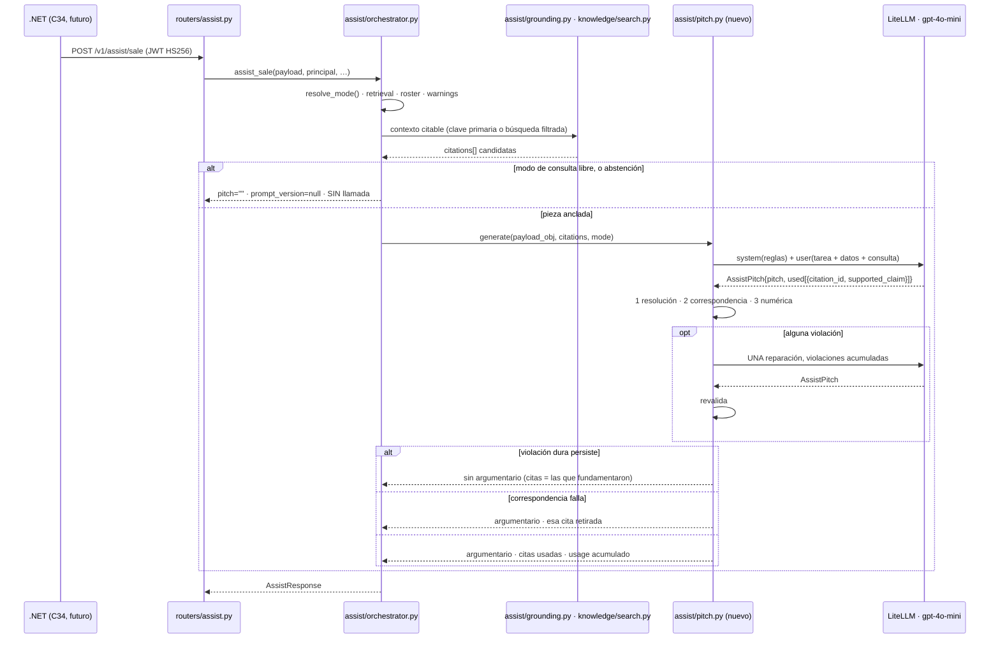

## Context

C30a entregó la mitad estructurada de la venta asistida y se detuvo **en un requisito**: la
capability `assist-generation` prohíbe hoy generar prosa y llamar a un proveedor, con un escenario
que lo comprueba. El paquete `ai-service/src/jbg_ai/assist/` son 786 líneas que resuelven el modo,
agrupan por familia, calculan avisos por reglas, direccionan citas por clave primaria en el modo sin
pregunta y filtran por slug en el modo con pregunta, y devuelven `pitch=""`, `prompt_version=None` y
`usage=Usage()`.

Tres restricciones gobiernan este diseño y ninguna es negociable:

1. **La frontera de responsabilidad.** Python redacta; .NET es la autoridad sobre precio, stock y
   permisos. El mecanismo son los placeholders `{{price}}` / `{{stock}}`, y .NET rechaza la respuesta
   si alguno queda sin resolver. **Ese mecanismo protege un flanco y deja el otro abierto**: un
   argumentario que escriba «39,90 €» literal no deja ningún placeholder y pasa.
2. **El contrato está congelado** y `test_openapi_snapshot_is_stable` lo vigila. La ventana para
   moverlo sigue abierta sólo porque `IAiGatewayClient` no tiene método de assist y C34 no existe.
3. **Ningún test llama a un proveedor real.** Regla transversal del §1 del plan, cumplida con fakes
   inyectados por la misma costura de constructor que usa `LiteLlmEnrichClient`.

La exploración refutó **dos garantías** que la ficha del plan daba por buenas, las dos por medición
estática. Están en [`c30b-exploration-decisions.md`](../../../Documentos/Proyecto%20Final%20AIEng/informes/c30b-exploration-decisions.md)
y son el origen de D1 y D9.

## Goals / Non-Goals

**Goals:**

- Argumentario en prosa para la pieza **con y sin pregunta**, fundado en el contexto que C30a ya
  destila.
- La garantía *«ninguna cifra de precio o stock en el texto»* **en ejecución**, no sólo en
  evaluación.
- Que *«las citas son las que el argumentario usó»* sea una propiedad **verificable en código**, y
  no una afirmación del modelo.
- Que el argumentario **no tenga copia durable en ninguna parte**, log incluido.
- Que cualquier fallo —proveedor, *timeout*, violación dura— produzca **la respuesta de C30a** y
  nunca un 5xx.
- Que la capa sea **medible como ablación** contra C30a, y que su barrido de contexto deje montada la
  excepción de persistencia que C38 necesita.

**Non-Goals:**

- **Generar en el modo de consulta libre.** Se difiere a C31, que es quien clasifica la intención.
- **Clasificar intención y rechazar cortésmente.** C31 entero.
- **Emitir `clarification_question`.** Se declara de C31.
- **Verificar fidelidad semántica en ejecución.** Ningún LLM juez: el §11.3 ya lo decidió y RAGAS es
  C38.
- **Publicar *faithfulness*.** El barrido publica tasa de rechazo y coste.
- **Mover la forma del contrato, migrar, reindexar o recalibrar umbrales.**

## Decisions

### El flujo, de extremo a extremo



### D1 · La puerta numérica es lista blanca **más** una lista negra de una sola cosa

La lista blanca es pertenencia: toda secuencia numérica del argumentario, normalizada, debe estar en
el conjunto de numerales del **objeto de payload** que se entregó. Y la puerta lee **el objeto, no el
prompt renderizado** — si leyera el texto, los números de las propias instrucciones entrarían en la
lista blanca y la puerta se abriría sola.

La lista negra nace de una medición: `material-oro.md` dice *«18 quilates son 750 milésimas, 14
quilates son 585»* y `material-plata.md` habla de *«925 milésimas»*. Con la ficha del oro en
contexto, `750` **pertenece a la lista blanca**, así que «750 €» pasa — el mismo agujero que la
puerta existía para cerrar. Por eso: **adyacencia a un marcador de moneda (`€`, `EUR`, `euro/s`) o de
existencias (`unidades`, `quedan`, `en stock`, `disponible/s`) rechaza siempre**, esté o no el número
en la lista blanca.

| Alternativa | Por qué no |
|---|---|
| Lista blanca pura, como pedía la ficha | Se abre sola con `750` y `585`. Medido, no supuesto |
| Cero dígitos en el argumentario | Verificable en una línea y pierde «plata de ley 925» y «talla 12», frases de venta reales |
| Lista negra sola | D-H la descartó con razón: el dominio está lleno de números legítimos y una lista negra se equivoca en los dos sentidos. Aquí la lista negra se aplica **al contexto del numeral**, no al numeral, y ese conjunto sí es cerrado |
| Rango `min ≤ x ≤ max` (S11) | Allí combinar es legítimo. Aquí una talla interpolada no existe y un precio interpolado es lo prohibido. Pertenencia, no rango |

**El riesgo real es el falso positivo**, no el falso negativo: un rechazo por formato cuesta el
argumentario entero. Se ataca **en el prompt** —prosa corrida, sin listas numeradas— en vez de
perdonando en la puerta, porque una excepción es una lista negra encubierta y deja la puerta con algo
que explicar. Es la división de trabajo que S11 fija: *«prevenir reduce el volumen que llega a la
detección; no intentes resolver en el prompt lo que toca resolver verificando»*.

### D9 · La salida estructurada lleva **tramo de apoyo**, verificado y no publicado

```python
class UsedCitation(BaseModel):
    citation_id: str        # ∈ el conjunto entregado
    supported_claim: str    # el tramo DEL PROPIO argumentario que esta cita sostiene

class AssistPitch(BaseModel):
    pitch: str
    used: list[UsedCitation]
```

D-D escribió que `citations[]` son *«las que el argumentario usó»* y que citar todo lo recuperado
*«no es atribuir, es decorar»*. Con `{pitch, citation_ids[]}` esa regla **no se sostiene**: un modelo
que devuelva los cinco identificadores entregados pasa la integridad referencial de forma **perfecta
y trivial** sin haber usado ninguno. La comprobación verifica que la cita **resuelve**; que se **usó**
queda en palabra del modelo.

El tramo lo convierte en comprobable: declarar cinco citas obliga a señalar cinco fragmentos del
texto que se escribió, y un fragmento inventado no es subcadena de nada. Determinista, sin juez, sin
llamada extra, ~30 tokens de salida. **Y no viaja al cable**: la respuesta conserva `pitch: str` y
`citations[]` con sus diez campos, así que el coste de contrato es cero.

| Alternativa | Por qué no |
|---|---|
| `{pitch, citation_ids[]}` | No prohíbe la decoración que D-D existía para prohibir |
| Por afirmación, `{claims:[{text, ids}]}` | El contrato tiene `pitch: str`, así que el código ensamblaría la prosa desde fragmentos; un argumentario de mostrador necesita continuidad. Y **RAGAS no lo necesita**: toma (pregunta, respuesta, contextos) y descompone por su cuenta |
| Marcadores en línea | **Muerto por medición**: dos títulos de sección llevan dígitos (`que-significa-el-925`, `que-significa-750-y-18k`) y `slugify` los conserva, así que el marcador inyectaría `925`, `750` y `18` en el texto que lee la puerta numérica. Además obligaría a C34 a retirarlos, moviendo la frontera por una decisión de formato |
| El tramo en el cable, en `Citation` | Mismo beneficio y **mueve la forma** del esquema, sin consumidor que lo pida |

### D3 · Una sola reparación, con las violaciones acumuladas

Orden: **resolución** (`issubset` sobre ≤5 elementos) → **correspondencia** (subcadena) → **puerta
numérica** (recorre el texto). Lo barato primero, que es el embudo de S11 aplicado dentro de una
llamada.

Las fichas decían *«un reintento»* en D-D y *«un reintento»* en D-H, y la costura de C09 ya trae su
propio reintento de parseo más *backoff*: sumados sin pensarlo, el techo son **cuatro llamadas** por
petición, frente a los **128,6 ms** que cuesta hoy la recuperación entera. Y las dos puertas fallan
por la misma causa. Una reparación, techo de **dos** llamadas, y el patrón de presupuesto duro queda
puesto para C32.

### D4 y D5 · La degradación es un estado del contrato, no una excepción

| Desenlace | `pitch` | `prompt_version` | `citations[]` |
|---|---|---|---|
| Generó y validó | prosa | `assist/v1` | las que usó |
| Correspondencia falló en una cita | prosa | `assist/v1` | las que usó, **menos ésa** |
| Violación dura persiste | `""` | `assist/v1` | **las que fundamentaron la respuesta** |
| Proveedor caído o *timeout* | `""` | `assist/v1` | las que fundamentaron la respuesta |
| Modo de consulta libre, o abstención | `""` | `null` | las que fundamentaron la respuesta |

Dos decisiones viven en esa tabla. **D4**: al degradar, las citas **no se vacían**; si lo hicieran,
la respuesta degradada tendría *menos* que la de C30a y rompería la ablación del §11.2, que exige
*«mismas citas, con prosa y sin ella»*. **D5**: `prompt_version` pasa a significar **«la capa de
generación corrió»**, lo que distingue *«no redactamos»* de *«lo intentamos y se rechazó»* sin campos
nuevos — la evidencia de que el guardarraíl actúa, visible para C36. Cuesta **una descripción** del
`openapi.json`; la forma no se mueve.

### D6 · Cliente propio, porque la costura de C09 descarta `usage`

`LiteLlmEnrichClient.extract()` devuelve el parseado y tira `response.usage`; `pipeline.py:311`
construye `Usage(model=llm.model_id)` con cero tokens. C30b necesita los tokens en tres sitios —el
campo del contrato, la línea de log que D-I exige, y la columna de coste del §11.2—, así que se
replica la costura (temperatura 0, `num_retries: 0`, *backoff* propio, `complete` inyectable) y no la
clase. Los tokens de la reparación **se suman**: si sustituyeran, el coste mentiría justo en las
peticiones que más cuestan. El tipo acumulable es el que C32 necesitará.

### D7 · La abstención corta antes, y el proveedor caído degrada

Redactar sobre una abstención es el caso de las 180 horas de S16 —*«algo dicho con confianza sobre
nada»*—, así que no se llama. Y un 5xx por un *timeout* de OpenAI tiraría la mitad de la respuesta
que ya está calculada y funciona. El §6 del plan declaraba esa degradación como propiedad del corte;
aquí pasa a ser una regla con test.

### D8 · La consulta es dato delimitado

Viaja en el mensaje de usuario, dentro de un bloque etiquetado, **nunca concatenada al sistema**. Es
la única superficie de inyección nueva: el corpus no lo es, porque C23 decidió **cero documentos
`guion_venta`** precisamente porque *«un fragmento imperativo recuperado a un prompt es
indistinguible de una instrucción»*. Clasificar y rechazar es C31; un mini-router por palabras clave
aquí sería andamio que C31 borra, y el repositorio ya pagó por eso con `C25bis`.

### D2 · Un solo prompt versionado para dos tareas

`prompts/assist/v1.md` con reglas invariantes en el sistema —ninguna cifra fuera de los datos,
placeholders obligatorios, sólo los identificadores entregados declarando su tramo, la consulta es
dato, prosa corrida sin listas numeradas— y un bloque de tarea por modo en el mensaje de usuario. Un
fichero y una constante, porque `prompt_version` es una cadena única en el contrato y el test
fichero↔constante es de uno a uno. Si M3 necesita evolucionar por su cuenta, nace `assist/v2.md` y la
tabla del §11.6 lo registra.

## Risks / Trade-offs

| Riesgo | Mitigación |
|---|---|
| **La puerta numérica se come los argumentarios buenos** y el change no entrega prosa. Es el riesgo mayor: un falso positivo cuesta el argumentario entero | Prosa corrida impuesta en el prompt, que elimina la fuente más probable (enumeraciones). Tasa de rechazo publicada **clasificada por causa** y no como número agregado. La política dura sólo se aplica a violaciones duras |
| **La correspondencia rechaza por paráfrasis o puntuación** y retira citas buenas | Normalización (`casefold` + colapso de espacios) y política **proporcionada**: se retira la cita, no el argumentario. Si el barrido mide >10 % de fallos por puntuación, se añade el plegado de signos — con la cifra delante, no antes |
| **El texto se escapa a un log** al depurar, y el invariante es falso una capa más abajo | `test_pitch_text_is_never_written_to_the_log`, y la no persistencia comprobada con listener `before_cursor_execute` **contando DML**, no mirando importaciones |
| **La alucinación con coartada sobrevive**: cita válida, usada de verdad, que no dice lo que la frase afirma | **Declarada en la spec, no resuelta.** Se mitiga estrechando el contexto (lista blanca de secciones, tope de dos materiales) y se mide con RAGAS en C38. Sin juez en ejecución: duplica latencia y coste donde hay un cliente delante, y es circular |
| **La lista blanca se ensancha con el contexto**: cuantas más secciones entren, más permisiva | Es un argumento para **estrechar el contexto**, no para confiar en la puerta. El barrido lo mide, y la regla de adyacencia no depende del ancho |
| **El golden set no puede evaluar esto**: 72 consultas, ninguna ancla una pieza | Muestra propia, declarada y estratificada por número de materiales. Anotado para que **C38 no lo descubra a mitad** |
| **El barrido se lleva la sesión** | Es la **línea de corte declarada**. Si cae, los valores 2 secciones / 2 materiales quedan como *punto de partida no calibrado* —que es lo que el QA de C30a ya dice que son— y el change sigue entregando la prosa con sus tres garantías |
| **El certificado de esta máquina** tumba cualquier llamada real | `SSL_CERT_FILE` al PEM exportado del almacén de Windows, montado **antes** de la sesión. `--system-certs` arregla a `uv`, no al proceso. Ningún test lo nota |

## Migration Plan

**Ninguna migración de datos**, ni Alembic ni EF Core — y por el motivo inverso al habitual: el
argumentario no se persiste, así que no necesita tabla.

- **Despliegue**: `JPV_RAG_LLM_API_KEY` ya existe desde C09 y no es necesaria para arrancar
  `/health`. Un despliegue **sin** esa credencial sirve exactamente la respuesta de C30a, por D7.
- **Contrato**: `openapi.json` se regenera con `canonical_openapi_settings()` y el diff se verifica
  **campo a campo**. Una sola descripción de diferencia.
- **Rollback**: retirar la llamada deja la capa en el comportamiento de C30a sin tocar esquemas —esa
  es exactamente la propiedad que el desdoble compró.

## Open Questions

**Ninguna. Las seis del ticket se cierran aquí tomando su opción por defecto**, antes de escribir las
specs. Cuatro son ajustables durante la implementación y conviene saber contra qué se comparó.

| # | Decisión | Valor fijado | Motivo |
|---|---|---|---|
| 1 | *Timeout* del proveedor | **3 s**, constante del módulo y **no** ajuste de entorno | Un argumentario que tarda más ya no sirve en un mostrador, y la degradación es barata. Se promueve a `Settings` sólo si el barrido mide que corta generaciones buenas |
| 2 | Normalización del tramo de apoyo | `casefold()` + colapso de espacios | Ablandar sin cifra delante es lo que este proyecto no hace desde C21. Si el barrido mide >10 % de fallos por puntuación, se añade el plegado de signos |
| 3 | Longitud objetivo del argumentario | **3–5 frases**, fijado en el prompt | Es lo que cabe en la tarjeta de C36 sin *scroll*, y tiene precedente propio: C06b alineó la longitud del copy al real en vez de dejarla al modelo. Entra como variable observada del barrido |
| 4 | Marcadores de moneda y existencias | `€`, `EUR`, `euro`, `euros` · `unidades`, `quedan`, `en stock`, `disponible/s` — es-ES | Conjunto cerrado y corto, en una constante del módulo y no en una expresión regular dispersa. Ampliable con una cifra delante |
| 5 | `clarification_question` | **Se declara de C31**, y sigue nula | Está en el contrato desde C30a devolviendo siempre nulo y **ningún change la reclamaba por escrito**. Generar una pregunta de aclaración es enrutado sobre una consulta libre. La tool `pedir_aclaracion` de C32 es otra cosa |
| 6 | El barrido, ¿dentro del change? | **Dentro**, y es la **línea de corte** si la sesión se desborda | Sus cifras acaban en el informe en vez de en una nota suelta, y monta la excepción de persistencia que C38 necesita |
