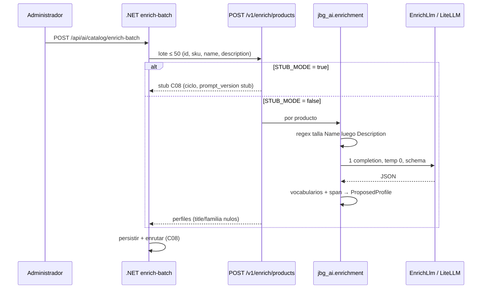
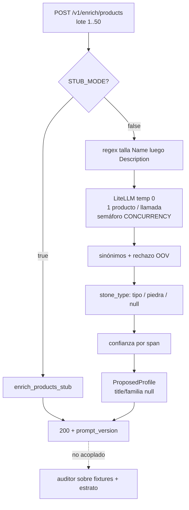

## Context

C08 archivó `ProductAiProfile`, el enrutado híbrido y `POST /api/ai/catalog/enrich-batch`. Ese lote llama a `POST /v1/enrich/products`, que **sigue en stub**: `require_stub_mode` + `enrich_products_stub`. Con `STUB_MODE=false` responde 501 nombrando este change. El stub marca talla `rule` si `index % 4 == 0` y dice que la lee del SKU. En este catálogo la talla está en el **nombre** (`mini`, `S`/`M`/`L`/`XL`).

C06a y C06b dejaron 1.200 productos con texto en `public."Products"`. El JSONL lleva `text_provenance` y `text_quality_tier`; **el HTTP no**. C08 envía `product_id`, `sku`, `name`, `description` — no precio, no colección, no procedencia. Ignora familia. No aplica title/description a `Product`.

Si C09 devolviera todo `inferred`, `Routed` mandaría el catálogo a una cola que nadie vacía. Si inventara materiales para aprobar una puerta de cobertura, violaría §7.1. Las puertas de §8.5 (70 % global / 90 % sobre `ai_assisted`) no pueden ser un 422 del POST de 50: el request no trae el estrato.

**Estado del repositorio al diseñar:**

| Pieza | Estado |
|---|---|
| `ai-service/src/jbg_ai/enrichment/` | Ausente |
| `ai-service/prompts/enrichment/` | Ausente. Existe `prompts/catalog-synth/v3.md` (C06b, no reutilizar) |
| `POST /v1/enrich/products` | `get_catalog_principal` + stub o 501 |
| Contrato `ProposedProfile` | C08: `source` + campos sensibles + tags desglosadas + `prompt_version`. `title`/`description`/`family_id`/`variant_label` opcionales |
| `Settings` | `JPV_CATALOG_LLM_*` opcionales (C06b). `JPV_RAG_LLM_*` nombradas en comentarios; **no** existen como campos |
| `jbg_ai.data.llm.OpenAICatalogLlm` | CLI de generate, temp 0,8, SDK OpenAI. **No** importar desde el router |
| `pyproject.toml` | `openai>=1.68.0`. Sin `litellm`. Sin Instructor |
| `ai-service/openapi.json` | Congelado. Este change no lo regenera |
| `tests/enrichment/` | Reservada en el README; carpeta aún no creada |
| Tests de contrato | Corren contra el stub (`STUB_MODE=true`) |

**Fronteras que se heredan.** §6.2: Python extrae y propone; .NET persiste y decide. C09 no abre conexión a `public`. §6.3: sin feed nuevo; el único consumidor HTTP es `AiGatewayClient.EnrichAsync`.

## Goals / Non-Goals

**Goals:**

- Sustituir el stub por un extractor que **solo afirma lo que el texto permite afirmar**.
- Que `size_label` sea `rule` únicamente cuando una regex dispara sobre `Name` o `Description`. El SKU no participa.
- Vocabularios cerrados en el repo (`text` en PostgreSQL, nunca `ENUM`): valor fuera de lista se descarta, no se persiste.
- `source` y confianza producidos de verdad, para que C08 enrute y no revise el catálogo entero por un `inferred` mentiroso.
- Una llamada de modelo por producto, temperatura 0, semáforo de concurrencia (default 8) dentro del lote de 50.
- Puertas de lote medibles en tests, con estrato, **sin** convertir el POST en un 422.
- `/health` arranca sin `JPV_RAG_LLM_API_KEY`. pytest no abre sockets a proveedores.
- `openapi.json` intacto. Tests de contrato existentes verdes con `STUB_MODE=true`.

**Non-Goals:**

- Ejecutar `enrich-batch` AutoBulk sobre los 1.200 e indexarlos (verificación posterior; C12/C13 no se implementan).
- Persistir perfiles o escribir `Product` (C08 / autoridad .NET).
- `piece_subtype`, hijos en `style_tags`, diccionario de sinónimos de consulta (C20).
- Instructor (S4). Se apila encima de LiteLLM en C30+ si el retry de schema hace falta.
- Migrar C06b a LiteLLM. El CLI de generate sigue en el SDK OpenAI.
- Renegociar el contrato para meter `text_provenance`, `collection_name` o `price`.
- UI, cola, asincronía de negocio, RDS, migración EF Core o Alembic.
- Familias (C18), `SourceText` (C11), feed (C12), revisión humana (C28).
- CLI de auditoría (`python -m jbg_ai.enrichment audit`): función + tests bastan.

## Decisions

### 1 · LiteLLM es el cliente de runtime; C06b no se toca

**Decisión:** el extractor habla con el modelo a través de un puerto `EnrichLlm` implementado con **LiteLLM** (`completion` / `acompletion` + `response_format` al schema Pydantic). `JPV_RAG_LLM_MODEL` lleva prefijo de proveedor (`openai/gpt-4o` hoy). Temperatura 0. `litellm` entra en `pyproject.toml` **con versión fijada** (compromiso PyPI de S3, marzo 2026). Instructor no entra.

`OpenAICatalogLlm` permanece en `jbg_ai.data` para el CLI de generate (temp 0,8, `JPV_CATALOG_LLM_*`). `jbg_ai.api.main` **no** importa `jbg_ai.data`. Dos claves, dos temperaturas, dos schemas.

**Por qué.** S3: el proveedor es config. Cambiar de OpenAI a un proxy / Azure / local es `MODEL` + `BASE_URL`, no un rewrite del router. Reutilizar el cliente de C06b mezclaría la key de generate con el runtime y arrastraría una temperatura pensada para redactar, no para extraer.

**Alternativas descartadas.** *(a) SDK OpenAI directo en el router:* el proveedor queda compilado; contradice el apunte S3 y la reserva de nombres `JPV_RAG_LLM_*` que C06b ya dejó escrita. *(b) Instructor encima de LiteLLM:* S4 es forma/retry de schema; se apila en C30+ si hace falta. Aquí el retry es «si el JSON no parsea, una vez más; si sigue fallando, excepción». *(c) Un solo cliente para generate y enrich:* viola la frontera de claves y de temperatura.

### 2 · Una llamada por producto; semáforo, no un JSON de 50 ni 50 en paralelo

**Decisión:** el modelo ve **un** producto. Dentro de un POST de 50, un semáforo `JPV_RAG_LLM_CONCURRENCY` (default **8**) limita las llamadas **en vuelo**. El handler de `/v1/enrich/products` pasa a `async def` para poder usar `asyncio.Semaphore` + `acompletion`. El stub sigue siendo una función síncrona invocada desde ese handler. Retry **solo** si el parse del schema falla (una vez). Sin reintento HTTP .NET↔Python (eso es C08).

**Por qué.** Secuencial (~75 s a 1,5 s/producto) rompe el presupuesto de la familia `ai-enrich`. 50 a la vez rate-limita. Un solo JSON de 50 ya se descartó: un parse fallido tira el lote entero y el modelo mezcla piezas. 8 es el compromiso: cabe en decenas de segundos y no satura el proveedor.

**Alternativas descartadas.** *(a) Batch JSON de 50:* un producto mal formado invalida a los 49. *(b) ThreadPool sobre `completion` síncrono:* funciona, pero el servicio ya es FastAPI async; el semáforo asyncio es el mecanismo nativo. *(c) Concurrencia compilada:* C24/C25 no podrían recalibrar sin deploy.

El cambio `def` → `async def` **no** regenera OpenAPI: request/response y path no se mueven. Si el snapshot se pone rojo, el change se ha salido de alcance.

### 3 · Vocabularios en YAML del repo; `text` en PostgreSQL, nunca `ENUM`

Los canónicos viven en ficheros versionados bajo `jbg_ai/enrichment/` (YAML). El modelo solo puede proponer valores de esa lista. El código normaliza sinónimos **antes** de persistir la propuesta. Un valor fuera de lista se descarta y el producto lleva `warnings`; no se almacena el string libre.

**`piece_type`** (solo padres): `anillo` · `pendientes` · `collar` · `pulsera` · `colgante` · `tobillera` · `broche` · `cadena`.

Sinónimos de extracción (no se persisten): sortija/alianza → `anillo`; gargantilla → `collar`; brazalete/esclava → `pulsera`; criollas/aro → `pendientes`. `colgante` no se colapsa a `collar`. Los hijos son C20 + el `Name`.

**`materials`:** `plata` · `oro` · `baño de oro` · `hilo` · `latón` · `acero` · `resina` · `cuero` · `perla`.

Sinónimos: plata de ley / 925 / sterling → `plata`; 18k / 18kl → `oro`; hilo encerado → `hilo`. **No** `piedras preciosas`. Ámbar/ónix no son material. `materials: []` si no hay evidencia; nunca un default.

**`stone_type`:** lista **cerrada para el modelo**, YAML **ampliable para el mantenedor** (el campo .NET ya es `text`; no hay migración). Semilla = tipos del corpus + residual **`piedra`**. Sinónimos en el mismo fichero (`ámbar`/`amber` → `ambar`). Criterio de alta: «¿es gema/mineral reconocible?», no umbral ≥ N apariciones.

| Evidencia | `stone_type` |
|---|---|
| Tipo concreto ∈ YAML | ese valor. **No** se escribe también `piedra` |
| El texto afirma gema/engaste y no concreta, o el modelo propone un tipo fuera de lista | `piedra` |
| Sin afirmación de gema («relieve», «brillo») | `null` |

Ámbar/ónix van aquí. `perla`: `stone_type` si es engaste o «collar de perlas»; el metal de la cadena en `materials`. No se duplica.

**`size_label`:** tokens alineados a C06a/C06b (`xxs`…`xxl`, `mini`, `extramini`, S/M/L, mm/cm, anillo 5–48). Canónico persistido en la forma que ya usa el stub cuando aplica (`S`/`M`/`L`/`XL`, `mini`, …).

**Tags comerciales:** listas cerradas **cortas** (color / estilo / ocasión) en el mismo YAML. Estilo **no** es taxonomía de subtipo: `gargantilla` no se esconde en `style_tags`.

**Alternativas descartadas.** *(a) `ENUM` de PostgreSQL:* cada gema nueva es una migración; C08 ya eligió `text`. *(b) Strings libres + filtro a posteriori laxo:* el modelo inventa diamantes. *(c) Umbral ≥ N apariciones para alta de `stone_type`:* deja fuera gemas raras pero reales y no es el criterio del dueño del catálogo.

### 4 · Talla por regex, `Name` > `Description`, nunca SKU

**Decisión:** función pura, **antes** de la llamada al modelo. Primero `Name`; si no hay match, `Description`. Empate o duda → nombre. Acierto → `size_label.source = rule`, confianza `1.0`. El SKU no se inspecciona. Si la regex no dispara, el modelo puede proponer talla (`inferred`) o dejarla ausente.

**Por qué.** El stub miente: `SKU06` no contiene `S`; «Colgante erizo de mar S» sí. C08 decidió honrar `source` y **no** duplicar la regex en .NET. Una sola autoridad (Python) evita dos reglas que divergirían.

Los tokens se reimplementan en `jbg_ai.enrichment` (espejo del conjunto de C06a/C06b). **No** se importa `jbg_ai.data` ni `scripts/catalog/`.

**Alternativas descartadas.** *(a) Dejar la talla al modelo:* pierde `rule` y C08 revisa todo. *(b) Regex también sobre el SKU:* el stub ya demostró que eso es un falso positivo estructural. *(c) Segunda regex en .NET:* dos verdades.

### 5 · Confianza por span en el texto de entrada, no por el número del modelo

| Caso | `confidence` | `source` |
|---|---|---|
| Regex de talla | `1.0` | `rule` |
| Valor con span en name o description | `0.85` | `inferred` |
| Valor sin span | `0.45` | `inferred` |
| Lista mixta (peor miembro) | `0.45` | `inferred` |
| Ausente / `[]` | `0.20` | `inferred` |

El umbral de auto-aprobación de tags de C08 es 0,80: el «con span» pasa; el «sin span» va a revisión en `Routed`. El número que el modelo invente **no se copia**.

Span = el canónico o uno de sus sinónimos aparece, tras normalizar (minúsculas, acentos), en `name` o `description`. Para listas (`materials`, tags), la confianza del campo es la del miembro **peor** evidenciado: una lista mezclada (`plata` con span + `oro` sin span) queda en `0.45` y no se auto-aprueba entera.

**Alternativas descartadas.** *(a) Confiar el `confidence` del LLM:* no es calibrado y C08 lo trataría como verdad. *(b) Un solo 0,70 para todo lo inferido:* no separa evidencia de alucinación y deja los tags justo bajo el umbral o justo sobre él sin motivo.

### 6 · Title, description y familia van `null` en el extractor real

El contrato los permite. Nadie aguas abajo los aplica: C08 no escribe `Product.Name`/`Description`; ignora `family_id`/`variant_label` (C18 es otra autoridad); el índice usa `Product.Name`. Proponerlos sería inventar copy y una familia.

El stub de C08 **sigue rellenándolos** bajo `STUB_MODE=true`. Los tests de contrato existentes no se reescriben.

### 7 · Las puertas de lote viven en un auditor, no en el POST

Función pura sobre una lista de perfiles **más** el estrato (del JSONL o de la fixture). El POST de 50 **nunca** responde 422 por estas cifras: no recibe `text_provenance`.

- Unicidad de SKU (SKU duplicado → fallo nombrado del auditor, no del POST).
- Todo valor ∈ vocabulario.
- `materials` vacío solo si el texto no nombra una sustancia.
- Cobertura de tags = al menos una de las tres listas no vacía:
  - `original` / `short`: tres vacías **válidas**; no entran en el denominador que castiga.
  - `sparse`: ≥ 1 lista.
  - estrato `ai_assisted`: umbral 90 %.
  - global: 70 % **sin** contar `original`/`short` como fallo.

No hay CLI en C09. Si al verificar el lote de 1.200 hace falta un informe, se añade después.

### 8 · `STUB_MODE=true` conserva el stub; `false` exige clave RAG

Compose local y el perfil de tests/snapshot se quedan en `STUB_MODE=true` **hasta que haya clave RAG**. Así no se rompe `/health` ni `test_openapi_snapshot_is_stable` ni los tests de contrato.

Con `false` y sin `JPV_RAG_LLM_API_KEY`: error explícito (4xx/5xx de configuración), **no** perfiles inventados y **no** 501 fingiendo que C09 no ha llegado. El 501 de `require_stub_mode` deja de aplicarse a esta ruta.

`JPV_RAG_LLM_*` son opcionales en `Settings` (igual que `JPV_CATALOG_LLM_*`). Ausencia o string vacío = unset. `CONCURRENCY` default 8. `canonical_openapi_settings` las deja `None` para que el entorno no se cuele en el snapshot.

## Risks / Trade-offs

- **[Riesgo] Inventar tags para «aprobar» la cobertura.** → Mitigación: puertas fuera del HTTP; `[]` si no hay evidencia; tests de `original`/`short` con listas vacías.
- **[Riesgo] Todo `inferred` satura la cola `Routed`.** → Mitigación: talla `rule` por regex; el resto es honesto. AutoBulk (C08) indexa igual y deja huella.
- **[Riesgo] Dos reglas de talla (Python vs un futuro .NET).** → Mitigación: solo Python; C08 ya decidió honrar `source`.
- **[Riesgo] `JPV_RAG_LLM_*` bloquea `/health` o se reutiliza la key de generate.** → Mitigación: opcionales al boot; nombres distintos ya reservados; test dedicado.
- **[Riesgo] LiteLLM sin pin o modelo sin prefijo de proveedor.** → Mitigación: versión fijada; `MODEL` con prefijo.
- **[Riesgo] 50 en paralelo rate-limita; 1 en serie rompe el presupuesto de C08.** → Mitigación: semáforo default 8, configurable.
- **[Riesgo] Romper `test_openapi_snapshot_is_stable`.** → Mitigación: no se toca el contrato; `canonical_openapi_settings` pinna las keys nuevas a `None`.
- **[Riesgo] Los tests de contrato esperan title relleno del stub.** → Mitigación: stub intacto bajo `STUB_MODE=true`.
- **[Riesgo] Importar `jbg_ai.data` desde el router arrastra el CLI al grafo de boot.** → Mitigación: puerto propio; test de que `api.main` no importa `jbg_ai.data`.
- **[Riesgo] El modelo propone un `confidence` alto sin evidencia.** → Mitigación: la heurística de span pisa ese número.
- **[Trade-off] Sin Instructor, el retry de schema es artesanal.** Aceptado: una reintento y excepción. No se apila otra librería en el primer LLM de runtime.
- **[Trade-off] El POST no puede evaluar el 90 % `ai_assisted`.** Aceptado: el HTTP no trae procedencia. El auditor sí.
- **[Trade-off] `async def` en una ruta que era síncrona.** Aceptado: no cambia el contrato; es el precio de un semáforo real.

## Migration Plan

No hay migración de esquema.

1. Añadir `litellm` fijada y los campos `JPV_RAG_LLM_*` opcionales. `uv sync --system-certs`.
2. Implementar vocabularios, regex, puerto fake y auditor. Suite de `tests/enrichment/` verde sin red.
3. Cablear el router: stub si `stub_mode`, pipeline si no. Compose y snapshot se quedan en `STUB_MODE=true`.
4. Documentar `JPV_RAG_LLM_*` en `backend/.env.example` (ya esbozado) y el README de `ai-service`.
5. **Rollback:** `STUB_MODE=true`. La ruta vuelve al stub. No hay filas que revertir: C09 no escribe.
6. **Verificación posterior (no DoD):** un `enrich-batch` AutoBulk local sobre el catálogo Docker, cuando exista clave RAG. Documentar entonces.

Nada contra RDS. C17 inyectará `/jpv/prod/*` más adelante; este change no lo hace.

## Open Questions

Las 1 y 2 de la exploración (forma de `stone_type`, valor del semáforo) **están cerradas**. Residuales con default:

| # | Pregunta | Opción por defecto |
|---|---|---|
| 3 | ¿`perla` es material o `stone_type` cuando es el cuerpo de la pieza? | **`stone_type`** si es engaste o «collar de perlas»; el metal de la cadena sigue en `materials`. No se duplica |
| 4 | ¿El auditor se expone como CLI? | **No en C09.** Función + tests |
| 5 | ¿`STUB_MODE=true` en compose local después de C09? | **Sí, hasta que haya clave RAG** |
| 6 | Versión concreta de `litellm` | La que fije `apply` al resolver PyPI; **pin exacto**, no rango abierto |
| 7 | Semilla de tipos en el YAML de `stone_type` | Tipos atestiguados en el corpus + residual `piedra`. Alta posterior = commit al YAML |
