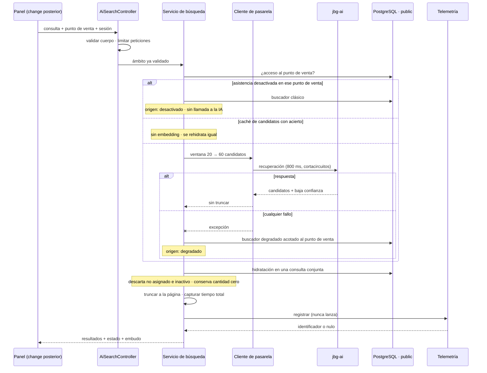

## Context

Tres changes archivados dejaron los extremos listos y el centro vacío:

| Pieza | Estado | Qué aporta |
|---|---|---|
| `IAiGatewayClient.SearchAsync` (C03) | Listo | Contrato tipado, presupuesto de 800 ms, reintento único, cortacircuitos, `AiCallScope`. No trunca la sobre-recuperación **a propósito**: truncar es del que hidrata |
| `IProductSearchEventService.RecordSearchAsync` (C04) | Listo | Persiste el evento, devuelve `Guid?`, **nunca lanza** |
| `POST /v1/retrieval/products` (C14) | Listo | Recuperación vectorial real: umbral de distancia 0,65, sobre-recuperación `min(top_k × 3, 60)`, abstención con `low_confidence` |

Falta el endpoint que los une. Y falta con consecuencias asimétricas: sin él no hay panel de operador (C16) ni despliegue del servicio (C17), y la telemetría de C04 no la invoca nadie —su incumplimiento no tiene síntoma: todo compila, todos los tests pasan y la tabla llega vacía a la entrega—.

Al diseñar sobre el código ya entregado, y no sobre la ficha del plan, aparecen tres hechos que cambian el diseño.

**Primero: el filtro más selectivo del sistema quedó al final del canal.** El diseño §7.6 sitúa el punto de venta como filtro duro en el paso 1, dentro del retriever. Pero el indexador no cargó disponibilidad por punto de venta y el retriever declara explícitamente que su SQL no filtra por punto de venta, difiriéndolo al change de la proyección. Hasta entonces, ese filtro sólo puede aplicarse al hidratar, que es el paso 6, a un salto de red del ranking.

Cuantificado con el generador del mundo sintético (`n_take = round(coverage × 1200)`, más un 8 % de inventario inactivo; la suma reproduce exactamente el inventario del informe):

| Punto de venta | Cobertura | Activos ≈ | Supervivientes de 30 | De 60 |
|---|---|---|---|---|
| Ciutadella Centre | 0,78 | 861 | 21,5 | 43 |
| Aeroport de Menorca | 0,38 | 420 | 10,5 | 21 |
| **Fornells** | **0,22** | **243** | **6,1** | **12,1** |

Con 30 candidatos, Fornells llena una página de 10 en torno al 4 % de las búsquedas. Y el surtido no es una muestra aleatoria: los pesos por colección concentran unas colecciones y vacían otras, de modo que **el descarte correlaciona con la señal de ranking** en lugar de adelgazar uniformemente. Una consulta alineada con una colección que ese punto de venta apenas tiene devuelve cero o dos resultados. Dos de los tres operadores de demostración están en 0,38 o por debajo.

**Segundo: el buscador clásico no sirve como camino degradado.** Casa la cadena completa contra el nombre del producto, así que ante una consulta en lenguaje natural devuelve la lista vacía siempre; y su ámbito son todos los puntos de venta asignados al usuario, no aquel en el que se está buscando.

**Tercero: la sobre-recuperación tiene un techo duro.** El retriever aplica su umbral de distancia **antes** del `LIMIT`, y ese `LIMIT` no pasa nunca de 60.

## Goals / Non-Goals

**Goals:**

- Servir búsqueda en lenguaje natural con la verdad de negocio del punto de venta: precio, cantidad, permisos y estado del producto salen del esquema transaccional, nunca de la respuesta de la IA.
- Que la búsqueda **no falle nunca** por causa del servicio de IA, cualquiera que sea el modo de fallo.
- Obtener el máximo conjunto de candidatos que el contrato congelado permite, al menor coste posible.
- Cumplir la obligación de telemetría de forma verificable por un test, no por disciplina.
- Dejar medida la pérdida de resultados que provoca filtrar por punto de venta al final, para que el change de la proyección tenga contra qué compararse.
- No abrir migración de base de datos.

**Non-Goals:**

- La rama léxica de la búsqueda híbrida, la fusión de listas y el diccionario de sinónimos. Viven en el servicio de IA, sobre el índice de texto completo que ya existe en el esquema vectorial, y llegan en changes posteriores.
- El prefiltro por punto de venta dentro del retriever.
- Cualquier pantalla. El panel del operador es otro change.
- Agrupación por familia, argumentario generado y citas.
- Modificar el buscador clásico existente, que usan otras pantallas.
- Tocar el servicio de IA, incluido el arreglo de su caché de embeddings.

## Decisions

### D1. Pedir la ventana máxima en una llamada, y eliminar la repetición

**Decisión.** Se solicita al retriever una página nominal de 20, que produce 60 candidatos —el tope absoluto de la sobre-recuperación—, y se trunca en el backend a la página que pidió el cliente. **No se emite una segunda llamada cuando la hidratación deja la página corta.**

**Por qué.** El retriever filtra por umbral de distancia y luego ordena y limita. De ahí se sigue, sin ambigüedad:

```
  candidatos_devueltos <  sobre_recuperación(k)   →  ató el UMBRAL, no el LÍMITE
                                                  →  repedir devuelve las MISMAS filas
                                                  →  segundo embedding facturado a cambio de nada

  candidatos_devueltos == sobre_recuperación(k)   →  ató el LÍMITE
       ∧ sobre_recuperación(k) < 60               →  repedir aporta … hasta 60 y ni una más
```

Como `sobre_recuperación(k) = min(k × 3, 60)`, pedir 20 satura el tope. La condición que haría útil una repetición no puede darse. Mantenerla sería un condicional que en producción nunca se evalúa a verdadero, y que en el único caso en que se evaluara duplicaría el coste de embedding precisamente en el punto de venta con peor cobertura: la experiencia degradada sería además la lenta.

**Alternativas consideradas.**

| Alternativa | Por qué no |
|---|---|
| Página nominal honesta más repetición condicionada | Es lo que pedía la ficha del plan. Aritméticamente inerte, y cuando no lo es, más caro que D1 en la llamada y en el reloj |
| Aceptar 30 candidatos y no doblar la ventana | Deja el punto de venta de peor cobertura llenando página en torno al 4 % de las búsquedas, con dos de los tres operadores de demostración afectados |
| Renegociar el contrato para exponer un mando de sobre-recuperación explícito | El contrato está congelado con una prueba que rompe ambos builds. El coste de renegociar no compra nada: 60 seguiría siendo el techo útil dado el umbral |
| Adelantar el prefiltro por punto de venta al servicio de IA | Es la solución de fondo, pero pertenece a otro servicio, a otro change y a otra ola; y este change bloquea a dos que deben entrar en la misma ola |

**Coste asumido y declarado.** La página saldrá corta en los puntos de venta de baja cobertura. Se acepta, se mide y se documenta como limitación conocida.

### D2. La asignación al punto de venta decide; la cantidad cero no

**Decisión.** Un candidato sobrevive si existe inventario **activo** en el punto de venta de la búsqueda y el producto está activo. Una cantidad de cero **no** descarta: el resultado se conserva y se marca como sin existencias. La cantidad devuelta es la de ese punto de venta.

**Por qué.** La asignación de inventario es la regla de visibilidad que ya rige en el resto del sistema, así que respetarla no inventa política nueva. La cantidad, en cambio, es exactamente lo que el diseño manda ponderar y no excluir: «tenemos ese modelo, ahora mismo no queda» es una respuesta que salva ventas, y suprimirla convertiría un dato útil en un hueco mudo.

**Alternativas consideradas.** Exigir existencias positivas simplifica el discurso al operador pero agrava la pérdida de resultados y contradice el diseño. Mostrar productos de otros puntos de venta marcados como no disponibles recuperaría toda la pérdida y habilitaría la conversación de traslado, pero **cambia la política de visibilidad vigente** —hoy un operador sólo ve productos con inventario en su punto de venta— y eso es una decisión de producto, no de endpoint.

### D3. Buscador degradado propio, con texto completo en español calculado en consulta

**Decisión.** El camino degradado usa una consulta de texto completo en español construida al vuelo sobre el catálogo transaccional, acotada a los productos con inventario activo en el punto de venta, con **semántica de alternativa** entre términos y ordenación por relevancia léxica. Sin columna generada y **sin índice**.

**Por qué el buscador clásico no vale.** Casa la cadena completa contra el nombre: ante una consulta en lenguaje natural devuelve lista vacía siempre. Un camino degradado que nunca encuentra nada no es degradación, es una caída silenciosa con respuesta correcta. Y su ámbito son todos los puntos de venta del usuario, lo que rompería la comparabilidad entre orígenes que la telemetría exige y podría enseñar existencias de otra tienda.

**Por qué sin índice.** Con el tamaño real del catálogo, un índice invertido compraría lematización, no velocidad: el recorrido secuencial calculando el vector de texto está en el orden de decenas de milisegundos, y el camino degradado no paga además el salto a la IA. La lematización se obtiene igual sin índice. Cuando el catálogo crezca un orden de magnitud, añadirlo es una migración futura y aislada.

**Por qué no indexar el catálogo transaccional ni leer el índice del esquema vectorial.**

| Alternativa | Por qué no |
|---|---|
| Índice invertido sobre el catálogo transaccional | Sería un **segundo corpus léxico**, más pobre: el índice del esquema vectorial se construye sobre el texto enriquecido —tipo de pieza, materiales normalizados, piedra, talla, familia, variante, colores, estilo y ocasiones—, mientras que el transaccional sólo tiene identificador, nombre y descripción. Una consulta como «anillo de plata azul para regalar» tiene tres de sus cuatro términos de contenido **sólo** en el primero. Además abriría la séptima migración de un plan que contabiliza seis, en un change de la ruta crítica que bloquea a otros dos |
| Leer el índice del esquema vectorial desde el backend | Comparte cuatro eslabones con la cadena que acaba de fallar —índice poblado, indexador al día, canal de alimentación, credencial del proveedor—, así que dejaría de ser un camino alternativo para ser un segundo camino principal. Y acoplaría el backend a migraciones del otro servicio sin ninguna prueba que lo detecte: un renombrado de columna rompería en ejecución, en silencio |
| Reutilizar el buscador clásico tal cual | Coste cero y valor cero, por lo dicho arriba |

**Dos trampas que el diseño fija por escrito.**

1. **Semántica.** La conversión de texto a consulta que conjunta los términos devuelve cero sobre este corpus, con lo que se habría reproducido el fallo del buscador clásico con mejor tecnología. La consulta degradada **debe** usar semántica de alternativa. La relevancia léxica **ordena**; no filtra.
2. **Robustez ante entrada libre** *(añadida tras la verificación de la tarea 1.1)*. Existen dos conversiones de texto a consulta: la estricta y la tolerante. La estricta **lanza excepción** ante sintaxis malformada —un operador booleano o un paréntesis sueltos—, y aquí los términos proceden de texto escrito por el operador: una consulta con un carácter reservado convertiría el camino degradado en un error del servidor, justo en el momento en que ese camino es lo único que queda en pie. Se usa la **tolerante**, que nunca falla ante entrada arbitraria, y se usa **en las dos posiciones** —coincidencia y ordenación—, que además deben compartir la misma consulta de texto para que la relevancia sea coherente con lo que se filtró.

**Verificación previa.** Comprobada antes de construir sobre ella: ambas construcciones se traducen íntegramente a SQL, sin evaluación en cliente y sin materializar el catálogo. El SQL resultante está recogido en *Open Questions*. La caída controlada prevista no ha hecho falta.

### D4. Activación por punto de venta en configuración, y un tercer origen de telemetría

**Decisión.** La lista de puntos de venta con búsqueda asistida vive en configuración recargable en caliente. Una búsqueda servida por el buscador clásico porque la asistencia está desactivada se registra con un **tercer origen**, distinto del asistido y del degradado.

**Por qué en configuración.** Una columna en el punto de venta abriría la séptima migración de un plan que contabiliza seis, en un change que no es de esquema y que está en la ruta crítica. La recarga en caliente cubre la necesidad operativa sin ese coste, y existe ya el precedente de la activación global del cliente de pasarela.

**Por qué un tercer origen.** Con dos valores, la única opción sería registrar estas búsquedas como degradadas, y eso contaminaría exactamente la población que el origen existe para aislar: una semana de asistencia desactivada se leería como una semana de cortacircuitos abiertos. La alternativa de no registrarlas es más barata pero renuncia al brazo de control: con el tercer valor, la activación por punto de venta se convierte en el experimento comparado más limpio que el proyecto va a tener, que es lo que la sección de evaluación quiere medir en línea. El enumerado se persiste como entero, así que ampliarlo **no requiere migración**; sí requiere modificar la capacidad de telemetría, que es una spec ya activa.

### D5. Acotar el coste con caché de candidatos y limitación de peticiones

**Decisión.** Caché en memoria de vida corta que guarda **sólo identificadores y puntuaciones** de la IA, con clave por punto de venta, consulta normalizada, filtros y ventana. La hidratación se rehace en cada petición. Más una política de limitación de peticiones particionada **por usuario**.

**Por qué las dos y no sólo la limitación.** La obligación heredada pedía limitar peticiones, y por sí sola es un techo de gasto que no mejora la latencia y que corta al operador con un error en lugar de servirle. La caché ataca la causa: en el servicio de IA el cliente de embeddings se reconstruye en cada petición, de modo que su caché en memoria nace vacía y muere con la respuesta —en recuperación no acierta nunca en producción—, y cada búsqueda es por tanto un embedding facturado.

Cachear sólo la parte estable respeta la frontera del diseño: lo que se guarda es el parecido, que no cambia entre dos peticiones seguidas; lo que se recalcula es el número, que sí puede cambiar. Nunca se sirve un precio ni una existencia desfasados.

**Por qué la partición es por usuario y no por dirección de origen.** Detrás del proxy inverso, todo un punto de venta comparte dirección. La política existente que sí particiona por dirección lo hace porque se aplica antes de que haya usuario.

**Riesgo que el diseño ata hoy.** La recuperación es hoy independiente del punto de venta, así que la clave podría omitirlo. **Se incluye igualmente desde el principio.** El día que llegue el prefiltro por punto de venta, una clave sin él sería una fuga entre tiendas, y nadie revisaría la clave de una caché al implementar un filtro en otro servicio. El coste de incluirlo hoy es una tasa de acierto menor; el de omitirlo es un incidente de aislamiento.

### D6. El punto de venta es obligatorio, y el administrador elige

**Decisión.** El cuerpo de la petición exige el punto de venta siempre. Al operador se le valida contra sus asignaciones; el administrador puede elegir cualquier punto de venta **activo**.

**Por qué no es realmente una elección.** Dos capacidades ya activas lo imponen: el ámbito de llamada al servicio de IA tiene una única vía de construcción para rutas con punto de venta, rechaza valores comodín y no admite ausencia; y la telemetría exige ese mismo tipo de ámbito, de modo que una búsqueda sin punto de venta **no se podría ni registrar**. Lo único que quedaba por decidir era el administrador, que no tiene asignaciones y para quien la comprobación de acceso no concede excepción: se le concede aquí de forma explícita y acotada a puntos de venta activos, siguiendo el patrón que ya usa el módulo de ventas, porque si no la funcionalidad no se podría demostrar sin crear asignaciones artificiales.

### D7. El embudo se instrumenta en registro, no en columnas

**Decisión.** Los contadores —candidatos recibidos, supervivientes de la hidratación, mostrados— se emiten en registro estructurado correlacionado. **No se añaden columnas.**

**Por qué basta.** La métrica que hace falta para comparar con el prefiltro futuro es la proporción de búsquedas que no llenan página, agrupada por punto de venta, y sale de lo que la telemetría **ya persiste**: el recuento de resultados mostrados y el punto de venta. Separar la abstención del retriever de la ausencia de surtido se resuelve uniendo por el identificador de correlación con el registro de etapa del retriever, que ya está obligado a emitir la marca de baja confianza y el número de candidatos. Ese cruce estaba previsto desde el change del retriever. Añadir columnas costaría una migración para reconstruir un dato que ya existe repartido en dos sitios que comparten clave.

### Flujo



## Risks / Trade-offs

| Riesgo | Mitigación |
|---|---|
| **Página corta en puntos de venta de baja cobertura**, con dos de los tres operadores de demostración afectados | Aceptado por decisión. Se dobla la ventana al máximo del contrato, se distingue en la respuesta de la abstención, y se mide por punto de venta para que el prefiltro futuro tenga línea base. Se declara como limitación conocida |
| **La obligación de telemetría se incumple sin síntoma**: todo compila y todo pasa | Un test verifica que el registro se **invoca**, no sólo que el servicio existe |
| **El proveedor de acceso a datos no traduce las funciones de texto completo** | Prueba corta antes de construir. Caída controlada a alternativa de términos, sin cambiar la forma del resultado ni los tests |
| **La consulta degradada conjunta los términos** y reproduce el fallo que venía a arreglar | Fijado por escrito en el diseño y cubierto por un test que exige casar cualquier término, no la cadena completa |
| **Hidratar reutilizando el servicio de catálogo** introduce un patrón de consulta por elemento: con 60 candidatos son del orden de 120 viajes dentro de un presupuesto de 800 ms | Hidratación en una consulta conjunta propia, con test que lo verifica. Además, la cantidad del servicio de catálogo suma todos los puntos de venta asignados, que es otro dato |
| **La clave de caché se queda sin punto de venta** y se convierte en fuga cuando llegue el prefiltro | El punto de venta entra en la clave desde el principio, con test que lo fija |
| **Ampliar el enumerado de origen** toca una capacidad ya activa | Se declara como modificación de spec y se valida el conjunto completo, no sólo este change |
| **El servicio de IA sigue sin acertar en su caché de embeddings** | Fuera de alcance por frontera de servicio. Anotado como deuda para un change posterior que ya trabaja en esa zona. Mitigado aquí por la caché de candidatos |
| **Un secreto mal configurado** podría dejar la búsqueda sin servicio | Todos los modos de fallo de la pasarela degradan al buscador propio; el de configuración se registra en nivel de error para que no pase inadvertido |

## Migration Plan

No hay migración de base de datos: ni columna, ni índice, ni cambio de esquema. La ampliación del enumerado de origen se persiste sobre una columna entera ya existente, y los valores anteriores conservan su significado.

El despliegue es aditivo: endpoint nuevo, sin consumidores hasta el change del panel. La configuración por defecto deja la asistencia **desactivada** salvo en los puntos de venta que se listen explícitamente, de modo que activar es un cambio de configuración y revertir también, sin redespliegue. La reversión completa es retirar el endpoint: nada más depende de él dentro de este change.

## Open Questions

Ninguna pendiente de producto: las doce decisiones abiertas se cerraron en la sesión de exploración y están recogidas en el ticket y en la revisión fechada del plan.

**Resuelta — traducción de las funciones de texto completo (tarea 1.1).** Verificado sobre el proveedor de acceso a datos del proyecto: ambas construcciones se traducen íntegramente a SQL, sin evaluación en cliente y sin materializar el catálogo.

```sql
-- coincidencia
WHERE to_tsvector('spanish', p."Name" || ' ' || COALESCE(p."Description", ''))
      @@ websearch_to_tsquery('spanish', <términos unidos por OR>)

-- ordenación
ORDER BY ts_rank(to_tsvector('spanish', ...), <misma consulta de texto>) DESC
```

La caída prevista en D3 **no hace falta**.

La verificación añade una restricción que el diseño no había anticipado y que se incorpora a D3: **la conversión a consulta de texto debe ser la tolerante a entrada libre**, no la estricta. La estricta lanza excepción ante sintaxis malformada —un `&`, un `|` o un paréntesis suelto—, y los términos proceden de texto que escribe el operador, así que una consulta con un carácter reservado convertiría el camino degradado en un error del servidor: exactamente el escenario en el que el camino degradado es lo único que queda. La tolerante nunca falla ante entrada arbitraria y se usa **en las dos posiciones**, coincidencia y ordenación, que además deben compartir la misma consulta de texto para que la relevancia sea coherente con lo que se filtró.
