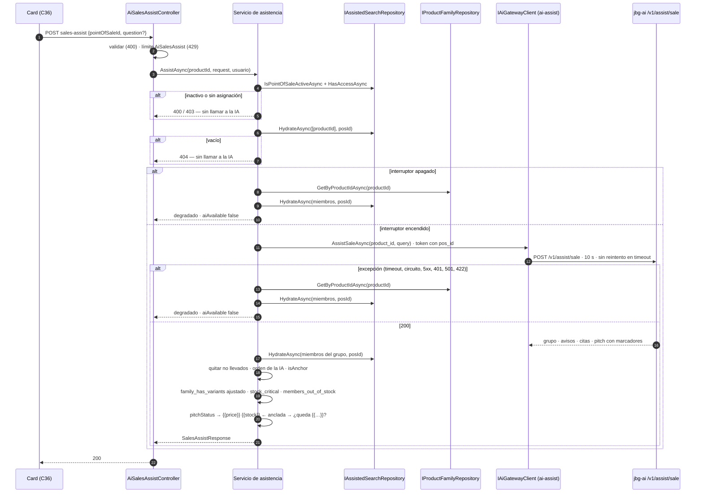
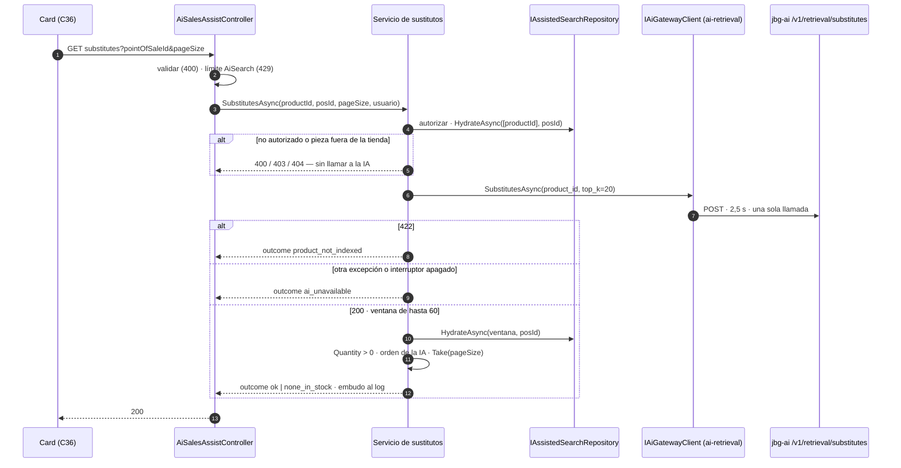

## Context

El lado Python del card de venta está entero y medido; el lado .NET está vacío.

| Pieza | Estado | Qué aporta |
|---|---|---|
| `POST /v1/assist/sale` (C30a · C30b · C31) | Listo | Tres modos. En los dos anclados —M2 pieza, M3 pieza y pregunta— devuelve **un único grupo**: la familia de la pieza o la pieza sola. Avisos estructurales como códigos, citas con `claim_scope`, argumentario con `{{price}}`/`{{stock}}` y una puerta numérica que ya rechaza cifras que no vienen del material |
| `POST /v1/retrieval/substitutes` (C26) | Listo | Devuelve **la ventana entera**, `min(3·top_k, 60)`, ordenada con la disponibilidad como término que degrada y nunca excluye. La exclusión por stock es de .NET por decisión escrita en C26 |
| `AssistedSearchService` y `IAssistedSearchRepository.HydrateAsync` (C15) | Listos | El patrón: autorizar, una llamada, una hidratación por conjunto que conserva la cantidad cero, truncar sin reordenar, degradar |
| `IProductFamilyRepository.GetByProductIdAsync` (C07) | Listo | La familia del catálogo, con `VariantLabel` y `SortOrder` |
| `IAiGatewayClient` (C03) | Sin assist ni sustitutos | Cinco métodos; `AssistTimeoutMs = 5000` reservado y sin usar; un comentario que reserva el sitio del cliente generativo |

Al diseñar contra el árbol y no contra la ficha aparecen cuatro hechos que mueven el diseño. Todos
están medidos, con su SQL o su script, en el
[informe de exploración](../../../Documentos/Proyecto%20Final%20AIEng/informes/c34-exploration-decisions.md).

**Primero: los marcadores no dicen de qué pieza son.** Son dos tokens sin referencia. En M2 y M3 la
referencia es la pieza anclada por construcción. En la consulta libre y en el agente, el argumentario
habla de varias piezas con los mismos tokens, y asignarlos obliga a adivinar. Por eso este change se
queda con el card.

**Segundo: el presupuesto reservado está por debajo del peor caso de Python.** Sobre la pasada de
C30b, en el ancho que se sirve, las llamadas al proveedor suman p50 3,8 s y p95 5,2 s por petición; el
**7,5 %** pasa de 5 s y el **55 %** hace la reparación. El peor caso por construcción es
`MAX_PITCH_PROVIDER_CALLS × PITCH_TIMEOUT_SECONDS = 2 × 4 s` más las lecturas de la pieza, la familia y
el corpus.

**Tercero: hidratar cambia lo que Python afirma.** Python calcula `family_has_variants` sobre la
familia del índice; la tienda puede no llevar todos los miembros. Medido: en las diez tiendas, el
**55,6 %** de las piezas ancladas con familia pierde algún miembro al hidratar, y en el **19,2 %** el
aviso de variantes quedaría falso.

**Cuarto: el filtro por stock es muy selectivo, y la ventana la decide quien llama.** Replicando la
pertenencia a la ventana de `neighbours_of` con el mismo SQL: con `top_k = 5` (ventana de 15), el
**71,1 %** de las piezas de Fornells no llena una página de 5 sustitutos con stock; con `top_k = 20`
(ventana de 60), el **7,1 %**. Para las piezas agotadas en su tienda, que son las que disparan el
bloque de sustitutos, **30,6 %** frente a **3,0 %**.

## Goals / Non-Goals

**Goals:**

- Dos rutas .NET ancladas a pieza que el card de C36 pueda leer sin reinterpretar nada.
- Que **ninguna cifra que el operario lea la haya escrito un modelo**: precio, cantidad y stock crítico
  salen del catálogo y del inventario de esa tienda.
- Que la plantilla cruda del argumentario **no llegue nunca** al cliente ni a un log.
- Que un fallo de la IA **nunca** deje el card vacío ni responda con un error del servidor.
- Que ninguna llamada de pago se haga para una petición que .NET ya sabe que va a rechazar.
- Que los estados que significan cosas distintas —seis del argumentario, cuatro de los sustitutos— se
  distingan en la respuesta.
- La generación encendida en la demo.

**Non-Goals:**

- La consulta libre sin pieza y la ruta del agente. Sus marcadores no tienen pieza a la que referirse.
- Cualquier cambio en `ai-service/`: `openapi.json` debe quedar idéntico byte a byte.
- La pantalla, la tabla de copy de los códigos y la caja de pregunta: son de C36.
- El validador .NET de cifras no verificadas del argumentario: es de C38.
- Caché de respuestas de la IA.
- Migración de EF Core o tabla nueva.
- La política .NET de la ruta del agente y el desglose de su uso por etapa, que siguen diferidos.

## Decisions

La letra entre paréntesis es la de la decisión en el informe de exploración. Las marcadas **(cerrada)**
se tomaron con el desarrollador.

### D1. Sólo las dos rutas del card (D-A, cerrada)

C34 expone M2, M3 y sustitutos. **No** expone M1 ni `/v1/assist/agent`.

*Alternativas descartadas.* **Añadir M1**: cerraría el §15.12, pero por el hecho primero o se retira
casi todo su argumentario o hay que cambiar el prompt y la puerta de Python, y además exige un bloque
nuevo en el panel. **Añadir el agente**: el mismo problema, agravado por los grupos de sustitutos, y
sin pantalla de conversación que lo consuma.

**El arreglo queda identificado para quien lo necesite**, y es de Python: prohibir los marcadores en
las tareas sin pieza anclada —las filas del panel ya enseñan el precio hidratado— y tratarlos como
violación en la puerta numérica.

### D2. `POST` con la pregunta en el cuerpo; `GET` para los sustitutos (D-B, cerrada)

```text
POST /api/ai/products/{productId}/sales-assist     body { pointOfSaleId, question? }
GET  /api/ai/products/{productId}/substitutes      ?pointOfSaleId=&pageSize=
```

Un controlador propio, `AiSalesAssistController`, con `[Route("api/ai/products")]`: es el patrón de un
controlador por capacidad bajo `api/ai/*`, sin versión, y la ruta está libre.

*Por qué `POST`.* La pregunta es texto libre del cliente, y en una URL acaba en el log de acceso del
proxy, en el historial del navegador y en cualquier caché intermedia: exactamente lo que D-I de C30 y el
§15.11 del diseño evitan. Un `GET` además es seguro y cacheable por definición, así que una precarga
podría disparar una llamada de pago. Y C15 ya eligió *«a write-free POST under the AI namespace»*.
*Coste aceptado:* la semántica REST pura de una lectura.

*Por qué dos rutas y no una.* Los sustitutos tardan menos de un segundo y el argumentario unos cuatro.
Separadas, el card los pide en paralelo y pinta los sustitutos mientras llega el argumentario.

### D3. Autorizar y comprobar la pieza antes de la llamada

Orden fijo: validar → autorizar el punto de venta → comprobar la pieza → y sólo entonces llamar.

- La autorización **reutiliza la lógica de `AuthoriseAsync`** de C15. Inactivo → 400 para cualquier
  rol; operario sin asignación → 403; administrador → cualquiera activo.
- La comprobación de la pieza es un `HydrateAsync([productId], posId)`. Vacío → **404**. La fila que
  devuelve se guarda como pieza anclada.

*Por qué 404 igual para todos los roles.* El ámbito de la petición es un punto de venta concreto, y la
regla de hidratación de C15 es que *«inventory assignment is what determines that a product belongs to
a point of sale»*. Para un operario coincide además con access-control, que no le deja ver piezas de
fuera de sus tiendas.

*Alternativa descartada:* llamar primero y descubrir después que la pieza no está en la tienda. Cuesta
una llamada de pago para dar un 404.

### D4. El grupo es el de la IA, hidratado, y el aviso de variantes se ajusta a la tienda (D-G)

Se hidrata el grupo con **una** `HydrateAsync(memberIds, posId)`:

- se quitan los miembros que la tienda no lleva y los identificadores que no son GUID;
- **se conserva el orden de la IA**, sin reordenar;
- si el SKU del índice difiere del de catálogo, manda el catálogo y se registra la divergencia;
- la pieza anclada va marcada con `isAnchor`;
- `family_has_variants` se conserva sólo si sobreviven **dos o más** miembros. .NET **nunca lo
  añade** en este camino: sólo puede quitarlo.

*Alternativa descartada:* construir siempre el grupo desde `ProductFamily`. Tendría una sola autoridad
sobre las familias y ningún desfase de sincronización, pero desaprovecha el agrupado que C30a construyó
para este consumidor y duplica en .NET una regla que Python ya tiene. Se usa sólo en la degradación
(D11), donde no hay alternativa.

### D5. Los marcadores se resuelven contra la pieza anclada (D-C)

| Token | Valor |
|---|---|
| `{{price}}` | `Product.Price` con `ToString("C2", es-ES)`: «39,90 €» |
| `{{stock}}` | La cantidad en ese punto de venta, como entero en cultura invariante |

Sólo se sustituyen **los dos tokens exactos**. Después se busca cualquier `{{` o `}}` restante, y si
queda alguno el argumento se retira (D6). El resolvedor, **llamado sin pieza anclada, retira siempre**:
C34 siempre ancla, pero el primer consumidor de M1 o del agente heredaría el hecho primero y así lo
encuentra cerrado.

*Por qué un entero para `{{stock}}`.* En 213 argumentarios de C30b, 188 (**88,3 %**) lo escriben como
número —«y tenemos {{stock}} en tienda», «stock de {{stock}}»—. «N unidades» rompe además los 4 que ya
van seguidos de «unidades»; una etiqueta como «disponible» rompe los 188. El **11,7 %** restante («y en
{{stock}}») no encaja con ninguna sustitución de una sola forma, y se acepta y se declara.

### D6. Un marcador sin resolver retira el argumentario y no la respuesta (D-D)

El estado del argumentario se decide en este orden, y el primero que aplica gana:

| # | Condición | `pitchStatus` |
|---|---|---|
| 1 | Camino degradado | `ai_unavailable` |
| 2 | La IA no ejecutó la generación (`prompt_version` nulo) | `not_generated` |
| 3 | La IA la ejecutó y la retiró (`pitch` vacío con versión) | `withheld_by_ai` |
| 4 | M2 y la pieza anclada tiene 0 unidades (D7) | `withheld_out_of_stock` |
| 5 | Tras sustituir queda algún `{{` o `}}` | `withheld_unresolved` |
| 6 | Resto | `generated` |

En los estados 1 a 5 el campo del argumento va nulo. Los grupos, los avisos y las citas **se sirven
siempre**.

*Por qué no rechazar la respuesta entera*, que es lo que leía la ficha. Las puertas de C30b ya degradan
así ante un fallo del mismo tipo, y un rechazo en .NET que tirase también grupos y citas sería más
severo que el de Python. La S4 del máster pide que cada guardarraíl declare su política; ésta es
«degradar la parte». Lo que el invariante protege —que la plantilla cruda no llegue al cliente— se
cumple igual.

*Por qué un enumerado y no los dos campos de C30b.* C30b codificó el estado en `prompt_version` y en el
`pitch` vacío porque un campo nuevo movía el contrato congelado. Este contrato hacia el frontend no está
congelado y se despliega con su cliente, así que la opción limpia es gratis, y los dos estados nuevos
(4 y 5) tienen dónde vivir.

*Limitación declarada.* Cuando es Python quien retira el argumentario, las citas vuelven a ser todas las
que fundamentaron la respuesta. Cuando lo retira .NET (estados 4 y 5), sólo tiene las que el
argumentario usó, y no puede reconstruir el resto.

### D7. Pieza anclada agotada: sin pregunta se retira, con pregunta se conserva (D-E, cerrada)

En 147 de 213 argumentarios el modelo escribe «disponible por {{price}}» **antes de saber el stock**,
porque no lo sabe. Con 0 unidades, en M2 eso es el argumento de venta de algo que no se puede vender, y
el card enseña en su lugar el bloque de sustitutos. En M3 la respuesta a la pregunta vale igual: el
cliente puede preguntar por una pieza que ya tiene. Pasa en el **6,5 %** de las piezas ancladas de las
tiendas.

### D8. Los avisos de stock los calcula .NET (D-H)

| Código | Regla |
|---|---|
| `stock_critical` | La pieza anclada tiene entre **1 y `StockCriticalThreshold`** unidades (2 por defecto) |
| `family_members_out_of_stock` | **Otro** miembro del grupo hidratado tiene 0 unidades |

El orden de la lista es el de los códigos de Python ajustados (D4), seguidos de estos dos. Un código que
.NET no conoce **pasa igual**: el vocabulario es cerrado pero versionado, y la etiqueta neutra para lo
desconocido es de C36.

*Por qué 2.* Es el *bucket* `1-2` que C32a traduce como `ultimas_unidades` y el valor por defecto del
panel de stock bajo del dashboard. Salta en el **4,2 %** de las filas con stock de las tiendas, frente al
**14,4 %** de `≤ 5`, sobre una mediana de 12 unidades. La regla `max(10 %, 5)` de ventas mide otra
cosa: lo que queda **después** de vender.

*Por qué el 0 no es un aviso.* Es un estado del miembro (`hasStock = false`) con consecuencias propias:
dispara D7 y el bloque de sustitutos. Llamarlo «stock crítico» mezclaría dos situaciones que el card
trata distinto.

### D9. Sustitutos: ventana máxima, exclusión por stock y cuatro resultados (D-I)

- Siempre `top_k = SubstitutesCandidateWindow` (**20**, que da la ventana de 60), en **una sola
  llamada** y nunca repetida. Es la regla de C15.
- Una `HydrateAsync` sobre la ventana; se queda lo que tiene `Quantity > 0`; se conserva el orden;
  `Take(pageSize)`.
- `reason` viaja sólo como dato para el log de Python: `"sin_stock"` cuando la pieza anclada tiene 0.

| `outcome` | Significa |
|---|---|
| `ok` | Hay al menos un sustituto con stock |
| `none_in_stock` | La IA contestó y ningún candidato tiene stock en la tienda |
| `product_not_indexed` | La IA respondió 422: la pieza no está en su índice |
| `ai_unavailable` | La IA no respondió, o el interruptor está apagado |

*Por qué excluir aquí lo que la búsqueda conserva.* C15 conserva la cantidad cero porque en una búsqueda
«la tienda la tiene y se le ha acabado» es información que salva una venta. Un sustituto se pide para
vender **ahora** en lugar de la pieza que no se puede vender: ofrecer otra agotada no salva nada. La
exclusión está escrita en la ficha desde que C26 la retiró de Python, precisamente para que viviera
aquí.

### D10. El cliente del gateway: una ruta generativa con su propio presupuesto (D-F)

| | Asistencia de venta | Sustitutos |
|---|---|---|
| Cliente con nombre | **`ai-assist`**, nuevo, en el hueco reservado | `ai-retrieval`, el existente |
| Presupuesto | **10.000 ms**, con **suelo de 8.000 validado al arranque** | 2.500 ms, sin cambios |
| Reintento | **Ninguno en timeout.** Uno sólo si la conexión no llegó a abrirse | Sin cambios |
| Circuito | **Estado propio** | El de recuperación |
| 422 | **`AiRequestRejectedException`** | **`AiRequestRejectedException`** |

*Por qué 10 s.* El presupuesto de fuera tiene que ser **mayor o igual que el peor caso declarado
dentro**. Si no, .NET tira respuestas que Python iba a entregar, ya degradadas pero útiles, y cae a su
propia degradación, que tiene menos cosas. 2 × 4 s más las lecturas son unos 8,5 s; 10 s deja margen de
red. El suelo de 8 s convierte esa relación en algo que el arranque comprueba, en vez de algo que
alguien tiene que recordar.

| Opción | Cuánto corta | Espera máxima | Por qué no |
|---|---|---|---|
| 5 s, lo reservado | 7,5 % en el ancho servido | 5 s | Tira trabajo hecho |
| **10 s** ★ | ~0 %: Python se acota solo | ~9-10 s | — |
| 5 s y pasar el plazo a Python | 0 % desperdiciado | 5 s | Cambio en Python y en el contrato |
| Asíncrono con consulta periódica | — | — | Desproporcionado; S15: *«síncrono hasta que duela»* |

*Por qué no reintentar un timeout.* Serían 20 s de espera y **dos llamadas de pago** por petición. El
requisito vivo de reintento sí reintenta timeouts, así que esto es un `MODIFIED`, acotado a la ruta
generativa. La excepción que se conserva —reintentar si `HttpRequestException.HttpRequestError ==
ConnectionError`— es la única en la que se sabe que **la petición no salió**, y por tanto no se gastó
ninguna llamada al proveedor.

*Por qué los sustitutos en `ai-retrieval`.* Son `/v1/retrieval`, no llaman al proveedor —el *embedding*
de origen ya está almacenado— y comparten dominio de fallo con la búsqueda: si falla uno, falla el otro
por la misma causa.

*Por qué el 422 sólo en estas dos operaciones.* Las dos rutas de Python lo usan para una pieza que no
pueden procesar, y leerlo como «IA no disponible» haría aparecer como caída una pieza dada de alta antes
de la última sincronización. La traducción de estados es compartida por todo el cliente, y el requisito
del *audit* de familias dice expresamente que estrecharla no le toca. Así que **sólo estas dos
operaciones** traducen el 422, y las demás siguen igual.

*Un fallo que no abre el circuito, y está bien así.* Cuando cae el proveedor del LLM, Python responde 200
sin argumentario. El circuito de .NET no lo ve, y es correcto: quien degrada es Python, y el circuito
protege de que Python no responda.

### D11. Degradación: la pieza, su familia del catálogo y los avisos de stock (D-J)

Con el interruptor apagado o cualquier excepción del gateway, 200 con `aiAvailable: false`:

- la familia se lee con `GetByProductIdAsync` y se hidrata con la misma `HydrateAsync`, en `SortOrder` y
  con el `VariantLabel` del catálogo;
- los avisos de stock y `family_has_variants` los calcula .NET;
- sin argumentario, sin citas y sin `size_label_missing`, que es un dato del índice.

La confirmación de la variante antes de vender es lógica de negocio, no de IA, y las familias son de
.NET (§6.2). Cuesta una consulta y reutiliza la hidratación.

| Excepción | Nivel de log |
|---|---|
| `AiUnavailableException` | Warning |
| `AiRequestRejectedException` | Warning, con `reason=product_not_indexed` |
| `AiGatewayConfigurationException` | **Error**: es configuración, no una caída |
| `AiNotImplementedException` | Error |

**En el cuerpo de `/sales-assist` el 422 no se distingue de la caída**: los dos dan `aiAvailable: false`
y `pitchStatus: ai_unavailable`, y el log los distingue. Si C36 necesita decir «esta pieza aún no está
preparada», se añade un campo sin romper nada.

### D12. Configuración, activación y límite de peticiones (D-M)

```text
AiSalesAssist (IOptionsMonitor, validadas al arranque)
  EnabledByDefault              false    // como AiSearch; la demo lo enciende
  EnabledPointOfSaleIds         []
  StockCriticalThreshold        2
  SubstitutesCandidateWindow    20       // tope 50, el del contrato
  SubstitutesDefaultPageSize    5
  SubstitutesMaxPageSize        20
  RateLimitPermitLimit          10
  RateLimitWindowSeconds        60

AiGateway:AssistTimeoutMs       10000    // suelo 8000
```

- **El interruptor apaga las dos rutas**, porque el card es uno. El log distingue «interruptor» de
  «caída».
- `RateLimitPolicies.AiSalesAssist`, ventana fija **particionada por usuario** —detrás del proxy toda
  una tienda comparte dirección—, con límite alto en test salvo que el test lo fije, como en C15.
- **Los sustitutos usan la política `AiSearch`**: no llaman al LLM.
- **Sin caché.** 0,00077 USD por petición (C30b) no la justifican, y D-I de C30 no se decidió por coste
  sino porque la verdad del argumentario caduca.

### D13. La política de logs

| Línea | Campos | Nunca |
|---|---|---|
| `stage=sales_assist` | `trace_id`, `pos_id`, `product_id`, modo, `ai_available`, `pitch_status`, `pitch_len`, `citation_ids`, `warnings`, `members_returned`, `members_carried`, `ai_ms`, `total_ms`, `prompt_version`, `model`, `prompt_tokens`, `completion_tokens` | el argumentario, resuelto o no |
| `stage=substitutes` | `trace_id`, `pos_id`, `product_id`, `outcome`, `candidates_returned`, `carried`, `in_stock`, `returned`, `ai_ms` | — |
| pregunta del operario | sólo a nivel `Debug`, como la consulta de C15 | por encima de `Debug` |

El texto resuelto lleva el precio real, que es lo único que el mecanismo de marcadores existe para
mantener fuera del texto generado. El uso de tokens se **loguea** para el coste y **no** se expone al
frontend.

### D14. Dobles de test: una clase base, y la integración que llega al gateway (D-L)

- `IAiGatewayClient` se **extiende**. La interfaz lo pide por escrito: *«each contracted endpoint is
  added by the change that first calls it»*.
- Los siete dobles escritos a mano heredan de una base de test, `ThrowingAiGatewayClient`, con todos los
  métodos lanzando. El próximo método no los vuelve a romper.
- **Los tests de integración usan un doble del gateway y encienden el interruptor de forma explícita.**
  Los de C15 no llegan nunca al gateway, porque sin sección de configuración el interruptor vale
  `false`; copiar ese patrón daría verde sin hidratar nunca una respuesta de la IA.
- Los DTO nuevos entran en `AiContractSnapshotTests.ModelToSchema`.

*Alternativa descartada:* una interfaz segregada nueva. No tocaría los siete dobles, pero parte en dos
la capability «typed gateway client» y contradice la regla escrita de la interfaz.

### D15. La demo, como última tarea (D-N, cerrada)

Los cuatro pasos de *«C30b — la demo no genera argumentario»* de `DEFERRED_TASKS.md` —parámetro
`/jbg-demo/ASSIST_LLM_API_KEY` creado a mano, lectura en `deploy.sh` sin `:?`, credencial y modelo en
`jbg-demo-ai`, runbook—, **más** `AiGateway__AssistTimeoutMs: "10000"` y
`AiSalesAssist__EnabledByDefault: "true"` en la API de la demo, sin los que el card no se vería.
Terraform no se toca.

### Flujo de `/sales-assist`



### Flujo de `/substitutes`



## Risks / Trade-offs

- **[El presupuesto de 10 s queda largo o corto en el despliegue real]** → La cifra de C30b es una cota
  superior, tomada a través de un interceptor TLS. Se mide la latencia de extremo a extremo en Docker
  Compose durante la implementación, y se puede bajar **sin cruzar el suelo de 8 s**, que el arranque
  comprueba.
- **[El 11,7 % de los argumentarios escribe `{{stock}}` donde no encaja un número]** → Se acepta y se
  declara. Arreglarlo exige que el prompt sepa qué tipo de sustitución recibirá, que es un cambio en
  Python con su pasada de medición.
- **[Cuando .NET retira el argumentario, se entregan menos citas que cuando lo retira Python]** → Se
  declara en la capability. .NET no puede reconstruir las citas que fundamentaron la respuesta y el
  argumentario no usó.
- **[Una familia editada tarda en verse hasta la siguiente sincronización]** → El camino nominal usa el
  grupo del índice; el degradado lee el catálogo. El desfase es de minutos y el hueco se declara.
- **[Tests de integración que dan verde sin llegar al gateway]** → D14: doble del gateway que se
  comprueba invocado, e interruptor encendido de forma explícita.
- **[La cuota de tokens por minuto de la demo]** → Varios operarios a la vez chocan con ella antes que
  con el coste. Se comprueba al encender la demo y se declara.
- **[La memoria del `t3.small` con una ruta generativa]** → Se vuelve a medir `jbg-demo-ai` contra su
  tope de 512 MiB (estaba al 45 % sin generación).
- **[`IAiGatewayClient` crece]** → No afecta a producción. Los dobles de test se resuelven con la clase
  base de D14.

## Migration Plan

1. **Sin migración de datos ni de esquema.** Todo es código y configuración.
2. **Despliegue por fases**: el interruptor `AiSalesAssist:EnabledByDefault` vale `false`, así que las
   rutas nacen apagadas salvo en los puntos de venta listados. La demo lo enciende.
3. **Demo**, como última tarea: crear a mano el parámetro de la credencial, desplegar y verificar la
   línea `stage=assist_client … credential=assist` en el log, una asistencia real con `pitchStatus:
   generated` y la memoria de `jbg-demo-ai`.
4. **Rollback**: apagar el interruptor devuelve el card al camino degradado sin desplegar; quitar la
   credencial de la demo devuelve `jbg-ai` a servir sin argumentario (`not_generated`); revertir el
   change no deja residuos, porque no hay migración.

## Open Questions

Ninguna bloqueante. Las ocho del ticket se cierran con su opción por defecto:

| # | Pregunta | Decisión |
|---|---|---|
| 1 | ¿Una capability o dos? | **Una**, `ai-sales-assist` |
| 2 | ¿El interruptor apaga las dos rutas? | **Sí**; el log distingue interruptor de caída |
| 3 | ¿Sustitutos con el límite de la búsqueda? | **Sí**; el argumentario tiene el suyo |
| 4 | ¿Suelo de `AssistTimeoutMs`? | **8.000 ms**, citando las constantes de Python en el mensaje |
| 5 | ¿Qué fallo de transporte se reintenta en `ai-assist`? | Sólo `HttpRequestError.ConnectionError` |
| 6 | ¿El 422 se distingue en el cuerpo de `/sales-assist`? | **No**; `ai_unavailable` en el cuerpo y el motivo en el log |
| 7 | ¿Se reordena el grupo? | **No**; orden de la IA y `isAnchor` |
| 8 | ¿Se expone `usage` al frontend? | **No**; se loguea con el modelo |
