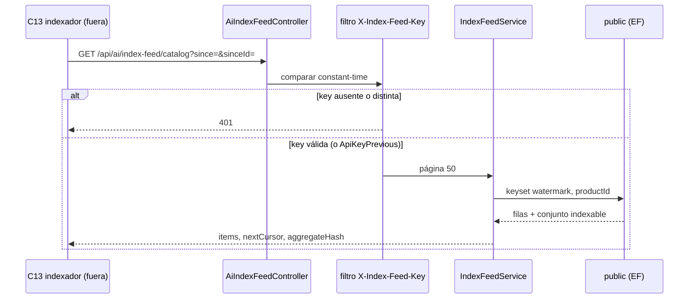

## Context

C05 materializó la frontera: el rol `jbg_ai` no tiene `SELECT` sobre `public`. C11 construye `doc_text` a partir de `ProductSourceText`, un DTO que **aún nadie serializa**. C13 tiene que tirar (`pull`) de un feed HTTP; sin este change el indexador o bien viola el §6.3 o bien nace con `ai.product_document` vacío.

C07 adjudicó por escrito dos fallos mudos: un producto que **sale** de una familia pierde el miembro y el cursor no lo ve; un rename de familia no toca miembros. C08 dejó el predicado (`ReviewStatus = Approved`) y advirtió que su `SourceHash` no es el del índice. El §6.3 habla de *pull* y de *push*; el *push* HTTP hacia el stub C13 es teatro. La invalidación es ensuciar `UpdatedAt`.

Auth: reutilizar `AiGateway:JwtSecret` haría válidos los tokens C03 que Python ya posee. S9, en este camino (un consumidor, cero identidad), pide API Key.

**Estado del repositorio al diseñar (verificado 2026-08-25):**

| Pieza | Estado |
|---|---|
| `GET /api/ai/index-feed/*` | Ausente |
| Auth API | Un solo `AddJwtBearer` con `Jwt:SecretKey`; cookie `access_token` en `OnMessageReceived`. Sin `FallbackPolicy`. `AiGateway:JwtSecret` solo **firma** hacia Python |
| `IAiGatewayClient` | Retrieval + enrich. Python será el cliente del feed, en C13 |
| `Product` | `SKU`, `Name`, `Description`, `Price`, `CollectionId`, `IsActive`. Sin `DataOrigin` |
| `ProductAiProfile` | Un perfil por producto; `ReviewStatus` / `ReviewOrigin` ortogonales; materiales y tags en `jsonb` |
| `ProductFamily` / `ProductFamilyMember` | Índices `UpdatedAt` listos. `ReplaceMembersAsync` borra e inserta; **no** toca `Product.UpdatedAt` |
| `SaveChangesAsync` | Sella `UpdatedAt` en entidades `Modified`. Un delete de miembro no modifica `Product` |
| `Inventory` | `Quantity`, `IsActive`, `LastUpdatedAt` (+ `UpdatedAt` de `BaseEntity`) |
| `Sale.Quantity` / `SaleDate` | Histórico C10 ingerido. `Return` existe y **no** se resta |
| `PaginationConstants.MaxPageSize` | **1000**. Listados de productos: default 50, max 100. **No** usar esa constante |
| `AiEnrichRequest.MaxBatchSize` | **50** — tope de `enrich-batch`, no del feed POS |
| `"Products"` Docker | **1.200**. Perfiles / familias: **0** / **0** |
| `POST /v1/index/sync` | Stub C13. **No se toca** |
| `ai-service/openapi.json` | **No debe cambiar** |
| `ProductSourceText` (C11) | Contrato de prosa/perfil/familia-nombre que el feed debe poder mapear |

**Fronteras que se heredan.** §6.3: *pull*; Python no lee `public` por SQL. §6.2: `price` y `price_band` los calcula .NET. S9: API Key en este sentido; JWT donde hay claims de persona/POS. C05: `data_origin` NOT NULL en `ai.product_document` lo rellena C13, no este JSON. C11: el feed es **superset** de `ProductSourceText`; C13 mapea y hashea.



```
SPA ──Jwt:SecretKey──► .NET ──AiGateway:JwtSecret──► jbg-ai   (C03, identidad)
                         ▲
                         │  X-Index-Feed-Key
                         └── feed pull ──────────────────────  (C13 será el cliente)
```

## Goals / Non-Goals

**Goals:**

- `GET /api/ai/index-feed/catalog` y `.../pos-availability` autenticados solo por `X-Index-Feed-Key`.
- Cursor keyset `(watermark, id)`; catálogo ≤ 50; POS ≤ 200; el cliente **no** elige `pageSize`.
- Tombstones `deactivated` / `unapproved` / `unassigned`. Un producto nunca aprobado no aparece.
- `price-band/v1` como función pura, cubierta por tests sin contenedor.
- Hash agregado SHA-256 del conjunto indexable **global**, idéntico en cada página de una lectura.
- `ReplaceMembersAsync` sella `Product.UpdatedAt` de altas y bajas; lista idéntica no escribe, incluido Product.
- Fail-fast al arranque si `IndexFeed:ApiKey` falta o mide menos de 32 caracteres.
- *Runbook* AutoBulk escrito. `Model_HasNoPendingMigrationDifferences` verde.
- Tests nuevos verdes; 401 con cliente HTTP fresco; no «arreglar» rojos preexistentes.

**Non-Goals:**

- Ejecutar AutoBulk sobre los 1.200 → **después de archivar C12, antes del apply de C13**.
- `POST /v1/index/sync`, upsert, embeddings, `ai.product_document`, `ai.pos_projection`, `drift_count` → **C13** / **C22**.
- HTTP *push* .NET → Python.
- Migración EF Core o Alembic. Columna `DataOrigin` en `Product`. Tabla outbox.
- Regenerar `ai-service/openapi.json`. Tocar `jbg_ai.api.main`. Firmar JWT en Python.
- UI, frontend, listados de administración.
- Revisión humana de perfiles (C28) y propuesta de familias (C18).
- Un segundo `JwtBearer`. Reutilizar `Jwt:SecretKey` o `AiGateway:JwtSecret`.
- Neteear `Return` en `sales30d` / `sales90d` (C19 es la autoridad de demanda).
- Copiar el tope 200 a `PaginationConstants` o a listados de operador.

## Decisions

### 1 · API Key, no JWT de servicio

**Decisión:** header `X-Index-Feed-Key`. Options `IndexFeed:ApiKey` (obligatoria) y `IndexFeed:ApiKeyPrevious` (opcional, rotación). Comparación `CryptographicOperations.FixedTimeEquals` sobre UTF-8. Si las longitudes difieren, se ejecuta igual una comparación dummy y se responde 401: no hay camino corto que filtre por `Length`. Aceptar `ApiKey` o, si está configurada y no vacía, `ApiKeyPrevious`.

El controlador **no** lleva `[Authorize]`. Un Bearer de usuario, una cookie `access_token` o un JWT C03 **no** cuentan. Sin key / key mala → **401**, no 403: el middleware no identifica al usuario; un JWT humano no es una credencial de este esquema. La ficha nombraba 403; la HU y el ticket desvían a 401 a propósito.

Fail-fast al arranque, mismo umbral que `AiGatewayOptions.MinimumSecretLength` (32). La key **no** se loguea. Distinta de `Jwt:SecretKey` y de `AiGateway:JwtSecret`. Producción: SSM `/jpv/prod/*` en **C17**, no aquí. Local: placeholder en `backend/.env.example` y `appsettings*.json`.

Implementación: `IEndpointFilter` o `IAsyncActionFilter` registrado en el controlador (o en un `[IndexFeedKey]` attribute). **No** un segundo `AddJwtBearer`. `AddAuthorization()` sigue sin `FallbackPolicy`; el resto de controladores opt-in con `[Authorize]` no se toca.

Python **no** envía nada en este change. C13 añadirá el header. Los tests .NET lo mandan a mano. El 401 de JWT humano usa un `HttpClient` **fresco** (trampa de `CLAUDE.md`: el cliente compartido de login conserva cookies).

**Por qué.** Un solo consumidor interno, cero identidad de persona → API Key (S9). Reutilizar el secreto C03 haría válidos los tokens que Python ya recibe en cada búsqueda. Tercer secreto, blast radius aislado.

**Alternativas descartadas.** *(a) JWT de servicio con `AiGateway:JwtSecret`:* Python ya tiene tokens firmados con esa clave. *(b) JWT con `Jwt:SecretKey`:* un admin logado leería el índice; contradice el espíritu de la ficha. *(c) Segundo `JwtBearer` con audience propio:* añade esquema, claims inventados y rotación más cara, para un secreto estático de un consumidor. *(d) 403 cuando llega un JWT de usuario:* implicaría que el usuario está autenticado en *este* esquema; no lo está. *(e) Mutual TLS:* no hay PKI en Compose ni en el EC2 de C17.

### 2 · Pull; invalidación = watermark; sin outbox y sin push

**Decisión:** C13 tira. No hay HTTP push hacia `POST /v1/index/sync`. No hay tabla outbox. No hay migración. La invalidación es ensuciar el cursor:

- Catálogo: `watermark = greatest(Product.UpdatedAt, Profile.UpdatedAt, Family.UpdatedAt)` del producto. Familia solo si hay miembro **actual** (LEFT JOIN a `ProductFamilyMember` + `ProductFamily`).
- POS: `watermark = greatest(Inventory.LastUpdatedAt, Inventory.UpdatedAt)`.

Cursor keyset `(since, sinceId)`, no un ISO-8601 suelto:

```
WHERE (watermark > since) OR (watermark = since AND id > sinceId)
ORDER BY watermark, id
LIMIT pageSize
```

`since` / `sinceId` ausentes = primera página (sync completo). `pageSize` **no** se acepta del cliente: constante de servidor.

Catálogo: `sinceId` = `Product.Id`. POS: `sinceId` = `Inventory.Id` (la fila de asignación es la unidad del feed disperso). `nextCursor` nulo cuando no hay más.

El sync nocturno completo es cinturón de **C13**, no de este ticket.

**Por qué.** El §6.3 ya diseña el mecanismo en el watermark, no en una cola. Una outbox exigiría migración (turno 🗄️ ocupable por C19/C27/C29) para un catálogo de 1.200 filas que se pagina entero en un minuto. El push al stub C13 no indexa nada.

**Alternativas descartadas.** *(a) Outbox / eventos:* migración y consumidor Python que este change no puede tocar. *(b) Push HTTP a `/v1/index/sync`:* el stub sigue en C13; sería teatro y acoplaría el merge. *(c) Cursor de un solo timestamp:* dos productos con el mismo `UpdatedAt` se pierden o se duplican. *(d) Offset/limit:* inestable si hay escrituras entre páginas. *(e) `pageSize` query param:* el tope 200 del POS no debe ser negociable ni copiarse a UI.

### 3 · Tombstones por `kind` + `reason`; nunca-aprobado ausente

**Decisión:** cada ítem lleva `kind`: `upsert` | `tombstone`.

Catálogo:

```
indexable = Product.IsActive AND existe perfil AND Profile.ReviewStatus = Approved
            (ReviewOrigin no se mira)
kind      = upsert si indexable
            tombstone si el watermark entra en el cursor, existe perfil, y ya no es indexable
```

Un producto **sin perfil** no aparece, aunque `Product.UpdatedAt` haya cambiado. C13 no tiene documento que borrar. `reason`: `deactivated` si `!IsActive`; si no, `unapproved`. Cuerpo tombstone: `{ kind, productId, reason, at }`. `at` = watermark.

POS:

- `Inventory.IsActive = true` → upsert.
- `Inventory.IsActive = false` cuyo watermark entra en el cursor → tombstone `{ kind, pointOfSaleId, productId, reason: unassigned, at }`.
- Ausencia de fila = no asignado (C22 penaliza; este feed no inventa ceros).

**Residual sin historial.** Un perfil que nació `Pending` y nunca fue `Approved`, si después se edita el producto, puede emitir un tombstone de un documento que no existe. No hay columna `EverIndexed` (sería migración). C13 **debe** tratar el tombstone como idempotente (DELETE de una fila ausente = no-op). No se abre esquema para cerrar ese falso positivo.

**Por qué `kind` + `reason` y no `{deleted_at|deactivated_at}`.** La ficha original cabía en un timestamp; la exploración (decisión 12 de la HU) necesita que C13 distinga «se desactivó» de «dejó de estar aprobado» de «se desasignó del POS» sin inferirlo del nombre del campo.

**Alternativas descartadas.** *(a) Solo upserts, sync completo borra el resto:* un producto desactivado vive en el índice hasta el job nocturno de C13. *(b) Columna `EverApproved` / tabla de historial:* migración. *(c) Tombstone para productos sin perfil:* C13 borraría lo que nunca indexó y ensuciaría `drift_count`. *(d) Discriminar por `ReviewOrigin`:* el predicado de C08 es el status, a propósito.

### 4 · Página 50 / 200; constantes propias; no `PaginationConstants`

**Decisión:** catálogo = **50** (cabe en el lote de embeddings C11/C13, default batch 64). POS = **200**, excepción escrita de servicio, **no copiable** a listados de operador ni a `PaginationConstants.MaxPageSize` (hoy 1000). Constantes en el propio feed (`IndexFeedPageSizes.Catalog = 50`, `PosAvailability = 200` o equivalente). El query string no acepta `pageSize`; si llega, se ignora o se rechaza 400 — default: **ignorar**, opción más estrecha.

1.200 productos → 24 páginas de catálogo. ~6.720 inventarios → ~34 páginas de POS a 200, contra ~135 a 50.

**Por qué 200 en POS.** El feed no es una tabla de UI; no hay operador esperando. Reducir round-trips del sync C22. El tope 50 de producto es de listados humanos.

**Alternativas descartadas.** *(a) Reutilizar `PaginationConstants.MaxPageSize` (1000):* una página de 1.000 inventarios con agregados de ventas no es el presupuesto de este proceso, y el número se colaría en UI el día que alguien «unifique». *(b) 50 también en POS:* ~135 round-trips por sync. *(c) 1000 en POS:* una sola página gigante; el keyset perdería su razón. *(d) Parametrizar por config:* el tope pasaría a ser negociable.

### 5 · Payload de catálogo = superset de `ProductSourceText`; sin procedencia

**Decisión:** camelCase (el JSON de la API ya usa `PropertyNamingPolicy.CamelCase`). Un `upsert` de catálogo lleva:

| Campo | Origen |
|---|---|
| `kind` | `upsert` |
| `productId` | `Product.Id` |
| `sku`, `name`, `description` | `Product` |
| `collectionName` | `Collection.Name` (null si no hay colección) |
| `pieceType`, `stoneType`, `sizeLabel` | perfil |
| `materials`, `colorTags`, `styleTags`, `occasionTags` | arrays JSON deserializados del `*Json` persistido; **no** el string `jsonb` |
| `familyId` | uuid o null |
| `familyName` | `ProductFamily.Name` o null |
| `variantLabel` | `ProductFamilyMember.VariantLabel` o null |
| `price` | `Product.Price` |
| `priceBand` | `PriceBand.From(price)` |
| `isActive` | `Product.IsActive` |
| `watermark` | el greatest del join |

**Fuera del JSON:** `dataOrigin`, `textProvenance`, `source`, `confidence`, `reviewOrigin`, `reviewStatus` (el predicado ya filtró), `sourceHash` del perfil (no es el del índice).

C13 mapea este JSON a `ProductSourceText` (campos de prosa) y calcula `source_hash` / `doc_text` con C11. `data_origin` lo resuelve C13 contra el JSONL real (436 SKU).

**Por qué no `data_origin` aquí.** `ai.product_document.data_origin` es NOT NULL, pero el valor sale de cruzar SKU con el corpus, no de `public`. Inventarlo en .NET sería mentir. **Por qué no `source`/`confidence`.** Reembeberían al cambiar un metadato de revisión (C11 ya los dejó fuera del DTO).

**Alternativas descartadas.** *(a) Emitir el `*Json` crudo:* C13 tendría que parsear un string que .NET ya tiene tipado. *(b) Esperar a que Python lea SQL:* viola C05. *(c) Incluir `ReviewStatus`:* el feed ya filtró; C13 no decide indexabilidad.

### 6 · `price-band/v1` en .NET, clase pura

**Decisión:** clase estática (o equivalente) sin HTTP ni EF. Constante `PriceBandVersion = "price-band/v1"`. Cortes cerrados:

| Banda | Precio (EUR) |
|---|---|
| `lt-30` | &lt; 30 |
| `30-80` | [30, 80) |
| `80-150` | [80, 150) |
| `150-300` | [150, 300) |
| `gte-300` | ≥ 300 |

`Price < 0` → `ArgumentOutOfRangeException` (ruidoso; `Product.IsPriceValid` exige `> 0`, pero un test o un import no debe silenciarlo). `0` cae en `lt-30`. Cambiar cortes = `price-band/v2` = re-sync C13 **sin** reembeber (la banda no entra en `doc_text`).

**Por qué en C12 y no en C13.** §6.2: el precio es autoridad .NET. Python no inventa bandas. C21 filtrará por techo sobre este valor.

**Alternativas descartadas.** *(a) Python calcula la banda del `price` del feed:* duplica cortes y los desincroniza. *(b) Incluir la banda en `doc_text`:* cada cambio de PVP reembebe; C11 lo prohibió. *(c) Tratar negativo como `lt-30`:* oculta un invariante de dominio.

### 7 · Hash agregado de conjunto, no de página

**Decisión:** SHA-256 UTF-8, hex minúsculas 64 chars, **una vez por request** sobre el conjunto **global** indexable, no sobre la página.

- Catálogo: concatenar los `productId` indexables (uuid canónico, p. ej. `D` format) **ordenados**. El hash es independiente del orden de llegada de la query.
- POS: analogía sobre pares `(posId, productId)` de filas **asignadas activas**, ordenados por `(posId, productId)`.

El mismo valor viaja en **todas** las páginas de esa lectura. Cambia si un producto (o un par POS) entra o sale del conjunto. Detecta *set drift*; el *content drift* es el `source_hash` de C11/C13.

1.200 uuids es barato. No se cachea entre requests (una escritura concurrente haría mentir al hash; C13 compara contra `ai.product_document` en el status, no contra este valor persistido).

**Por qué no hashear la página.** Dos páginas de un mismo sync reportarían hashes distintos y C13 no podría usarlo como `drift_count` de conjunto.

**Alternativas descartadas.** *(a) Hash de la página:* inútil para deriva. *(b) Hash del contenido (precio, nombre):* eso es `source_hash`, y lo calcula Python. *(c) Persistir el hash en .NET:* otra tabla, otra migración. *(d) COUNT(*) en lugar de hash:* no detecta sustitución (sale A, entra B, el recuento coincide).

### 8 · `ReplaceMembers` sella altas y bajas; rename no amplifica

**Decisión:** en `ReplaceMembersAsync`, **después** de calcular altas y bajas y **antes** o junto al `SaveChanges` de miembros:

1. Productos que **salen**: sellar `Product.UpdatedAt`.
2. Productos que **entran**: igual, por si su `UpdatedAt` de catálogo es más antiguo que el cursor de C13.
3. Cortocircuito `AlreadyMatches`: **cero** escrituras, incluido Product. El comentario actual ya dice que reescribir miembros entregaría al feed un cambio que no ocurrió; ahora el mismo argumento cubre Product.
4. Reorder / cambio de `variantLabel` (mismos `productId`, distinta lista): las altas/bajas de id pueden ser vacías, pero los miembros **sí** se reescriben. Marcar los productos de la lista declarada: su `variantLabel` denormalizado en el índice cambió.
5. Rename de metadatos (`Update` de nombre/descripción): sellar `Family.UpdatedAt`; el feed une por ahí. **No** marcar miembros.

Un `DELETE` de `ProductFamilyMember` **no** toca `Product` por sí solo. Hay que cargar y marcar. No hay navegación `Product → Members`; el servicio ya tiene los ids de la lista anterior y de la declarada.

**Cómo se sella.** `UpdatedAt` está mapeado con `ValueGeneratedOnAddOrUpdate()`, así que un `UPDATE` del change tracker **omite** la columna aunque el interceptor de `SaveChangesAsync` asigne `UtcNow` en memoria. Marcar `EntityState.Modified` no basta y cambiar el mapping abriría diferencia de modelo (fuera de alcance). El sello es `ExecuteUpdateAsync` (`IProductRepository.StampUpdatedAtAsync` / `IProductFamilyRepository.StampUpdatedAtAsync`): equivalente a esta decisión, sin migración. El rename llama al sello de familia por la misma razón.

**Por qué no outbox.** C07 dejó los índices `UpdatedAt` precisamente para este join. El §6.3 ya eligió el watermark.

**Alternativas descartadas.** *(a) Soft-delete del miembro:* cambiaría el modelo de C07 (pertenencia = presencia de fila) y abriría migración. *(b) Marcar solo los que salen:* un producto que entra con `UpdatedAt` antiguo no aparece en el cursor incremental. *(c) Marcar miembros en un rename:* reescribe  N productos para un cambio que el JOIN de familia ya ve. *(d) Trigger SQL:* fuera del patrón EF del monolito, y este change no abre migración.

### 9 · POS disperso; buckets; ventas brutas

**Decisión:** el feed POS **no** es el catálogo cruzado por todos los POS. Emite filas de `Inventory` cuyo watermark entra en el cursor.

Upsert:

- `pointOfSaleId`, `productId`, `kind`
- `qtyBucket`: `0` si `Quantity <= 0`; `1-2` si 1 o 2; `3+` si ≥ 3
- `isAssignedHint` = `Inventory.IsActive` (en upsert, siempre true)
- `sales30d` / `sales90d`: `SUM(Sale.Quantity)` por `(ProductId, PointOfSaleId)` con `SaleDate` en `[now-30d, now]` y `[now-90d, now]` (UTC, igual que el resto de `SaveChanges`)
- `lastSaleAt`: `MAX(SaleDate)` o null
- **Prohibido** serializar `quantity`

**Sin** restar `Return`. C19 es la autoridad de demanda. Este feed da a C22 una pista de velocidad, no una cuenta neta contable.

Agregados de ventas: subquery agrupada (o `GroupJoin`) sobre los pares de la página, no N+1. Ventanas relativas a `DateTime.UtcNow` (inyectar `TimeProvider` para tests).

**Por qué buckets.** El retriever no debe ver stock exacto; la hidratación autoritativa es C15. Un dump de `quantity` en un feed que vive en la API pública (nginx no expone Python, pero esta ruta **sí** vive en .NET) sería un leak de inventario.

**Alternativas descartadas.** *(a) Denso: un upsert por producto × POS, con `qtyBucket = 0` y `isAssignedHint = false` para no asignados:* ~1.200 × N POS por sync; C22 ya penaliza ausencia. *(b) Neteear devoluciones:* duplica C19 y mezcla «se vendió» con «se devolvió». *(c) `qtyBucket` con la cantidad exacta en otro campo «por si acaso»:* contradice el DoD.

### 10 · Observabilidad estrecha; tests; runbook sí, corrida no

**Decisión:** log estructurado de página (`item_count`, `has_more`, `aggregate_hash` truncado a 8–12 chars, `trace_id` si llega). **No** dump de descripciones, SKU ni de la API Key a Information. Serilog ya está; propiedades nombradas, no interpoladas en la frase (spec `backend`).

Tests:

- Unitarios de `PriceBand` y del hash (conjunto ordenado, estable, cambia al entrar/salir).
- Integración de ambos feeds (cursor, tombstones, buckets sin `quantity`, página 50/200).
- `Feed_WithUserJwt_Returns401` con cliente **fresco**.
- `ReplaceMembers` sella altas y bajas; lista idéntica no escribe Product; rename no reescribe miembros.
- `Model_HasNoPendingMigrationDifferences` sigue verde.
- Baseline: no «arreglar» rojos preexistentes; comparar **nombres** de fallos (`CLAUDE.md`).

Runbook `Documentos/Proyecto Final AIEng/informes/c12-catalog-autobulk-runbook.md` al **final** del apply: procedimiento (condiciones, comandos PowerShell, tiempo 15–40 min, coste ≈ 6–12 USD a gpt-4o), **no** acta. La corrida de los 1.200 **no** es criterio de merge. Enlazar HU-AIENG-012 en `Documentos/epicas.md` (EP14). Mencionar el feed como lector en `modelo-de-datos.md`, sin entidad nueva.

**Por qué el runbook entra y la corrida no.** Sin 1.200 `Approved`, el primer sync de C13 deja el índice a 0 (fallo mudo de S11). Eso es ops **después** de archivar C12, no un lado de este código. Documentarlo aquí evita que C13 se diagnostique como «el indexador está roto».

## Risks / Trade-offs

- **[Riesgo] Un JWT de usuario o un token C03 abre el feed.** → Mitigación: el controlador no usa `[Authorize]`; el filtro exige `X-Index-Feed-Key`; test de 401 con cliente fresco; fail-fast si la key es corta o falta; tercer secreto, no `AiGateway:JwtSecret`.
- **[Riesgo] La API Key se loguea o se cuela en Scalar.** → Mitigación: no loguear el header; placeholder local distinto de producción; C17 la pone en SSM.
- **[Riesgo] Producto que sale de una familia no reindexa.** → Mitigación: `StampUpdatedAtAsync` (`ExecuteUpdate`) de altas y bajas; test dedicado de escritura y GET de catálogo. C07 lo dejó escrito.
- **[Riesgo] Rename de familia no reindexa a los que quedan.** → Mitigación: el JOIN usa `Family.UpdatedAt`; no hace falta tocar miembros.
- **[Riesgo] Lista idéntica ensucia watermarks y C13 reembebe de balde.** → Mitigación: cortocircuito ya existente, extendido a Product.
- **[Riesgo] Cursor de un solo timestamp pierde empates.** → Mitigación: keyset `(watermark, id)`.
- **[Riesgo] `PaginationConstants.MaxPageSize` (1000) se usa en el POS.** → Mitigación: constantes propias; test de tope 200; el 50 de catálogo no cambia.
- **[Riesgo] El JSON lleva `quantity`.** → Mitigación: DTO sin la propiedad; test que el payload no la contiene.
- **[Riesgo] Tombstone de un Pending-de-nacimiento.** → Mitigación: sin perfil → no se emite; con perfil nunca aprobado el DELETE de C13 es idempotente; no hay migración `EverIndexed`.
- **[Riesgo] Tests de 401 verdes con el `HttpClient` de login (cookie colada).** → Mitigación: cliente fresco; documentado en HU y en `testing-backend.md`.
- **[Riesgo] Se abre migración «por si acaso» (`DataOrigin`, outbox).** → Mitigación: DoD explícito; `Model_HasNoPendingMigrationDifferences` verde; default del apply = la opción más estrecha.
- **[Riesgo] Se regenera `openapi.json` o se toca `/v1/index/sync`.** → Mitigación: fuera de alcance; `git diff` vacío; el stub sigue siendo C13.
- **[Riesgo] AutoBulk de 1.200 se corre «para dejar Docker listo» y se toma por DoD.** → Mitigación: el *runbook* dice cuándo (después de archivar, antes de C13) y que no es criterio de merge.
- **[Riesgo] `sales30d` resta devoluciones y C19 diverge.** → Mitigación: solo `Sale.Quantity`; spec y test lo dicen.
- **[Trade-off] Hash global por request en lugar de cacheado.** Aceptado: 1.200 uuids; un cache entre requests mentiría si hay una escritura concurrente.
- **[Trade-off] Página POS 200, excepción frente al tope 50 de UI.** Aceptado por escrito; no se copia.
- **[Trade-off] 401 en lugar del 403 de la ficha.** Aceptado: el espíritu (un admin logado no lee el índice) se cubre; el código de estado describe el esquema.
- **[Trade-off] Feed en la API pública, defendido solo con la key.** Aceptado: nginx no va a exponer Python, y esta ruta vive donde vive el resto de .NET. C17 no la publica como página de operador.

## Migration Plan

No hay migración de esquema.

1. `IndexFeedOptions` + validación al arranque + filtro de API Key + `appsettings` / `.env.example`.
2. `PriceBand` + tests unitarios.
3. Consultas keyset de catálogo (joins, tombstones, hash) + controlador sin `[Authorize]` de roles.
4. Consultas keyset de POS (disperso, buckets, ventas, página 200).
5. `ReplaceMembersAsync`: `UpdatedAt` de altas y bajas; test dedicado.
6. Tests de integración (incl. 401 con cliente fresco) y de esquema.
7. *Runbook* AutoBulk + enlace HU en `epicas.md` + mención del feed en `modelo-de-datos.md`.
8. `openspec validate --all --strict` → `0 failed`. `git diff ai-service/openapi.json` vacío.

**Rollback:** revertir el controlador, el filtro, las options y el sello de `ReplaceMembers`. No hay filas nuevas que revertir. Los perfiles, familias e inventarios no se han migrado. C13 no ha empezado a tirar.

**Verificación posterior (no DoD):** una persona corre el *runbook* AutoBulk en local (y más adelante en demo) **después de archivar C12 y antes de aplicar C13**. Smoke: `GET /api/ai/index-feed/catalog` con la key de `.env.example` debe devolver upserts cuando haya 1.200 `Approved`.

Nada contra RDS. C17 inyectará `/jpv/prod/IndexFeed:ApiKey` más adelante.

## Open Questions

Ninguna pendiente. Cerradas en exploración (2026-08-25), incluida **B — API Key**.

| # | Pregunta | Decisión |
|---|---|---|
| 1 | ¿C12 abre migración? | **No** |
| 2 | ¿HTTP push a Python? | **No** |
| 3 | ¿`data_origin` en el JSON? | **No** |
| 4 | ¿Quién define `price_band`? | **C12**, `price-band/v1`, cortes de la HU |
| 5 | ¿Tope POS? | **200**, no copiable a UI |
| 6 | ¿Auth? | **API Key** `X-Index-Feed-Key` |
| 7 | ¿Ventas netean devoluciones? | **No** |
| 8 | ¿Actor HU? | Desarrollador; AutoBulk fuera, *runbook* dentro |
| 9 | ¿Partir catálogo / POS? | **No**; ambos en este change |
| 10 | ¿`text_provenance`? | **No** |
| 11 | ¿401 o 403 con JWT de usuario? | **401** (desviación explícita de la ficha) |
| 12 | ¿Tombstone de Pending-de-nacimiento? | Se emite si hay perfil y no es indexable; C13 idempotente. Sin migración |
| 13 | ¿`pageSize` query param? | **Ignorar** si llega |
| 14 | ¿`sinceId` del POS? | `Inventory.Id` |

Default si el apply descubre un detalle menor no listado: la opción más estrecha que no abra migración ni toque Python.
