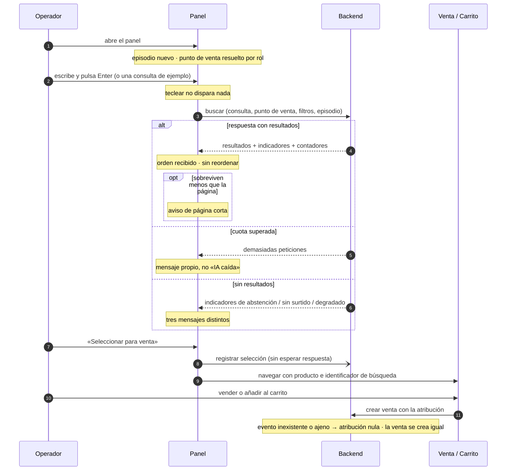

## Context

C15 dejó el endpoint completo y sin consumidores. El panel es lo único que falta para que la cadena entera —corpus, enriquecimiento, índice vectorial, recuperación, hidratación autoritativa— tenga a alguien delante.

Al diseñar sobre el código entregado, y no sobre la ficha del plan, aparecen cuatro hechos que cambian el diseño.

**Primero: la obligación de arrastrar el identificador de búsqueda hasta la caja no es implementable desde el navegador.** La capacidad de telemetría declara —con escenario, y archivada como cumplida— que la venta lleva la búsqueda que la originó, y la columna existe con índice y clave foránea desde entonces. Pero ningún objeto de transferencia de creación de venta acepta el campo, y ningún servicio lo asigna: el único sitio del repositorio que lo escribe es una prueba de integración que toca la entidad a mano. Es la misma clase de defecto que la obligación de invocar la telemetría en C15 —compila, las pruebas pasan, la validación da verde y la columna llega vacía a la entrega—, agravada porque aquí hay una especificación afirmando lo contrario.

**Segundo: en este panel cada pulsación cuesta dinero.** El listado de catálogo existente usa un disparo con retardo y copiarlo sería el camino natural. La clave de la caché de candidatos incluye la cadena de consulta completa, de modo que ningún prefijo acierta: una consulta de treinta caracteres genera entre tres y seis peticiones con un retardo de 400 ms, cada una factura un embedding que nadie llegó a leer, y el límite de treinta peticiones por minuto y usuario se agota en cinco o seis consultas.

**Tercero: los filtros duros se apilan, y ninguno de los dos es del panel.** El filtro de materiales se aplica en el recuperador como un solapamiento de conjuntos **antes** del umbral de distancia y del límite de filas; la hidratación por punto de venta corta después. Con las coberturas del mundo sintético, un material poco frecuente combinado con el punto de venta de menor cobertura vacía la página casi con seguridad.

**Cuarto: dos de las tres cosas que la ficha manda enseñar en cada fila no existen todavía.** El motivo de la coincidencia es una cadena literal fijada en el recuperador hasta que llegue la rama léxica, y la etiqueta de variante —que es la talla— la puebla el change de familias, que no se ha ejecutado.

## Goals / Non-Goals

**Goals:**

- Que un operador encuentre una pieza describiéndola con sus palabras, y vea el precio y las existencias reales de **su** tienda.
- Que la interfaz nunca mienta: los cuatro modos de «no hay resultados» dicen cosas distintas, y la página corta se declara en lugar de disimularse.
- Que el coste por búsqueda esté acotado por diseño de interacción, no por confianza en el operador.
- Que la venta quede atribuida a la búsqueda que la originó, cerrando un requisito que hoy no se puede cumplir.
- Que una atribución imposible nunca haga fallar una venta.
- Dejar la fila de resultado aislada para que el change del argumentario la amplíe en vez de reescribirla.
- No abrir migración de base de datos.

**Non-Goals:**

- Argumentario generado, citas y desambiguación por familia: son del change posterior. Este deja el hueco, no lo llena.
- La rama léxica del híbrido y el diccionario de sinónimos, que viven en el servicio de IA.
- Un motivo de coincidencia real y una talla real, que dependen de dos changes que aún no han corrido.
- Un endpoint que exponga el vocabulario de materiales o los materiales presentes en el surtido de un punto de venta.
- Sustituir el buscador por identificador de artículo de la venta manual, que sigue siendo el camino rápido de quien ya sabe qué quiere.
- Búsqueda asistida desde catálogo, devoluciones o inventario.
- Persistir preferencias del panel o historial de consultas.

## Decisions

### D1. Ruta propia y tarjeta en el hub, no un modo dentro de la venta manual

**Decisión.** El panel vive en una ruta propia bajo el árbol de ventas y se alcanza desde una tercera tarjeta del hub. La entrega al flujo de venta se hace por estado de navegación, exactamente como hacen el escaneo de códigos y el reconocimiento de imagen.

**Por qué.** La página de venta manual ya supera las setecientas líneas y gestiona punto de venta, método de pago, cantidad, precio manual, existencias y diálogo de confirmación; añadirle un segundo buscador la convertiría en el peor fichero de la aplicación justo antes de que el change del argumentario vuelva a tocarla. La ruta propia reproduce un patrón que dos páginas ya validaron, mantiene la arquitectura de información del hub —donde el operador elige *cómo* entra a una venta— y aísla el fichero que va a crecer.

**Alternativas consideradas.**

| Alternativa | Por qué no |
|---|---|
| Modo alternativo dentro de la venta manual | Sin navegación ni estado que propagar, pero deja un fichero de novecientas líneas con dos buscadores que compiten, y hunde la funcionalidad detrás de un conmutador que nadie descubre desde el hub |
| Panel lateral sobre la venta manual | Hereda punto de venta y método de pago ya elegidos —una decisión menos— y el episodio sobrevive a varias selecciones. Pero no es enlazable, no aparece en el hub, y el operador tiene que aterrizar antes en la venta manual para poder buscar |
| Página independiente fuera del árbol de ventas | Rompe la continuidad con el flujo que la propia ficha pide prellenar |

**Coste asumido.** El panel tiene que pedir el punto de venta, que el panel lateral heredaría. Es pequeño: el servicio de puntos de venta ya devuelve los asignados al operador y todos al administrador.

### D2. Envío explícito, y prohibición expresa del disparo con retardo

**Decisión.** La búsqueda se lanza con Enter o con el botón. Nunca al teclear. Se acompaña de tres a cinco consultas de ejemplo que rellenan la caja **y** lanzan la búsqueda en un solo gesto.

**Por qué.** La aritmética es la que decide:

```
  clave de caché  =  (punto de venta, consulta completa, filtros, ventana)
                  →  ningún prefijo acierta jamás

  consulta de ~30 caracteres, retardo de 400 ms
                  →  3-6 peticiones · 3-6 embeddings facturados · 1 leída

  límite del endpoint  =  30 peticiones / 60 s / usuario
                  →  cuota agotada en 5-6 consultas
```

Y no se renuncia a nada: el presupuesto de recuperación es de 800 ms más hidratación, así que «resultados mientras escribo» nunca estuvo disponible. Las consultas de ejemplo hacen además el trabajo que el operador no tiene por qué hacer —saber qué se le puede pedir al sistema y cómo—, que es la diferencia entre una caja de texto desnuda y una interfaz de producto.

**Alternativas consideradas.**

| Alternativa | Por qué no |
|---|---|
| Disparo con retardo, como el listado de catálogo | Coherencia superficial con una pantalla cuyo coste por consulta es una consulta a la base de datos, no un embedding facturado. Agota la cuota en cinco consultas y desperdicia entre dos y cinco de cada seis peticiones |
| Retardo largo, de 1.500 ms | Reduce el desperdicio sin eliminarlo, y añade a cambio una latencia que hace la interfaz peor que el botón: el operador espera sin saber si ya está buscando |
| Envío explícito sin consultas de ejemplo | Mismo control de coste y menos ayuda. Las consultas de ejemplo cuestan cinco líneas y son lo que hace la funcionalidad comprensible sin narración |

**Corolario que se fija por escrito.** Los filtros rápidos **no disparan búsqueda por sí solos**: cada conmutación cambia la clave de caché y compraría un embedding, de modo que marcar tres materiales costaría tres búsquedas. Y cambiar de punto de venta **limpia los resultados y no relanza**, porque la clave de caché incluye el punto de venta y la misma consulta en otra tienda vuelve a pagar.

### D3. El tramo de servidor entra en este change

**Decisión.** Los objetos de transferencia de creación de venta —individual y de cada línea de la masiva— aceptan una referencia opcional a la búsqueda, y el servicio de ventas la asigna tras comprobar que el evento **existe y pertenece a quien vende**. Un identificador desconocido o ajeno deja la atribución nula y **no altera nada más** de la venta.

**Por qué la comprobación de propiedad y no sólo de existencia.** El endpoint que registra la selección exige propiedad del evento sin excepción de administrador, porque un evento de búsqueda es el registro de lo que hizo una persona concreta. Si la atribución sólo comprobara existencia, un cliente podría colgar su venta de la búsqueda de un compañero y el indicador de conversión se ensuciaría sin dejar rastro.

**Por qué comprobación explícita y no confiar en la clave foránea.** La clave declara borrado con puesta a nulo, que gobierna el **borrado** del evento; en una **inserción** con un identificador inexistente, la violación abortaría la transacción de la venta. Degradar exige comprobar antes.

**Alternativas consideradas.**

| Alternativa | Por qué no |
|---|---|
| Enviar el campo y que el servidor lo ignore hasta un change posterior | Es exactamente el patrón «código muerto sin síntoma» que este plan ya pagó una vez: compila, las pruebas pasan y la columna llega vacía. Además el change que tocaría esa zona está dos olas más tarde |
| Change hermano sólo de servidor, en la misma ola | Respeta la regla de una zona por change, a cambio de dos ciclos completos de artefactos para dos campos y un condicional |
| Renunciar a la atribución y quedarse con la selección | Se pierde el embudo de búsqueda a venta, que es el número del informe final, y queda un requisito vivo sin implementación posible |
| Rechazar la venta si el identificador es inválido | Convierte un dato analítico en un bloqueo de caja. Inaceptable en el punto de venta |

**Coste asumido y declarado.** El change deja de ser de una sola zona. Se acepta porque la alternativa es entregar una interfaz que envía un campo al vacío.

### D4. El motivo se construye con lo que hay, y se declara lo que no hay

**Decisión.** La fila muestra una **insignia de origen** derivada del indicador de disponibilidad de la asistencia, más **chips con los materiales** que el recuperador reconoció. Para ello, el resultado devuelto al cliente pasa a llevar esos materiales, que hoy llegan al backend desde el recuperador y se descartan al construir el resultado. El motivo crudo del recuperador **no se pinta**, y la talla se pinta **sólo si existe**.

**Por qué.** El motivo del recuperador es una cadena literal idéntica en todos los resultados hasta que llegue la rama léxica: enseñarla sería mostrarle al operador una palabra de ingeniería, y enseñar una insignia idéntica en las diez filas es ruido. Los materiales, en cambio, cierran el bucle con el filtro —el operador filtra por plata y ve que la pieza es de plata—, son ciertos, y ya viajan hasta el backend. La talla es la etiqueta de variante, que otro change poblará: renderizarla condicionalmente hace que aparezca sola el día que ese change entre, sin tocar el panel.

**Por qué no hidratar la talla desde el perfil de IA.** Existe en el esquema transaccional y sería tentador. Pero eso es rehacer la consulta conjunta de hidratación que C15 fijó y probó, dentro de un change que ya cruza tres zonas, para adelantar un dato que otro change entrega por su cuenta.

**Alternativas consideradas.**

| Alternativa | Por qué no |
|---|---|
| Pintar el motivo crudo del recuperador | Muestra `vector` en todas las filas: vocabulario de ingeniería y cero información |
| Sólo insignia de origen, sin materiales | Coste cero de servidor y valor casi cero: la misma etiqueta en las diez filas |
| Esperar a la rama léxica para tener motivo | Deja el panel sin ninguna explicación durante toda la ola, y la ficha promete explicación |
| Inventar un motivo en el cliente a partir de la puntuación | Presentaría como explicación algo que el sistema no ha afirmado |

### D5. Cuatro estados vacíos, y un quinto que no está vacío

**Decisión.** El panel distingue cuatro situaciones sin resultados y una más con resultados insuficientes:

| Señal | Estado | Qué se dice |
|---|---|---|
| asistencia disponible · confianza baja · sin resultados | **abstención** | no hay nada que encaje; sugerir reformular |
| asistencia disponible · confianza normal · hubo candidatos · sin resultados | **sin surtido** | hay piezas parecidas, ninguna en esta tienda; **quitar filtros** como primer remedio |
| asistencia no disponible | **degradado o desactivado** | la búsqueda asistida no está sirviendo; lo mostrado viene de la búsqueda por texto |
| cuota de peticiones superada | **cuota agotada** | demasiadas búsquedas seguidas; esperar unos segundos |
| resultados por debajo de la página pedida | **página corta** | cuántos hay en esta tienda y cuántos candidatos se consideraron |

**Por qué cuatro y no tres.** La ficha enumeraba tres. La especificación del endpoint exige explícitamente que superar el límite de peticiones **no** se comunique como indisponibilidad del servicio de IA: son causas distintas, con remedios distintos y con implicaciones operativas opuestas —una es una avería, la otra es el sistema protegiéndose.

**Por qué la página corta se declara.** Es el caso frecuente en los dos puntos de venta de menor cobertura, que son dos de los tres operadores de la demostración. Callarlo hace que el sistema parezca incapaz de buscar cuando lo que ocurre es que la tienda no tiene el surtido; declararlo convierte una limitación conocida en información, y es la línea base «antes» de la ablación del prefiltro por punto de venta dicha al operador en una frase.

**Por qué el remedio del «sin surtido» es quitar filtros y no reformular.** Porque los dos filtros duros se apilan: el de materiales recorta antes del umbral, y el de punto de venta después. Cuando la lista se vacía habiendo candidatos, el filtro es la causa mucho más probable que la redacción de la consulta.

**Lo que no se puede distinguir, y se acepta.** La respuesta expone el mismo indicador cuando el circuito está abierto y cuando la asistencia está desactivada para ese punto de venta. La telemetría **sí** los separa, con dos orígenes distintos; la interfaz no puede. Para el operador el mensaje es el mismo —la búsqueda asistida no está sirviendo—, así que se deja como decisión escrita en lugar de pedir un discriminador que sólo cambiaría el texto de un aviso.

### D6. El vocabulario de materiales se replica en el cliente, con prueba que lo fija

**Decisión.** Los nueve términos del vocabulario cerrado viven en una constante del cliente, con etiqueta mostrada y término canónico enviado, y una prueba que congela la lista.

**Por qué.** Es un vocabulario **cerrado** que sólo cambia cuando cambia el fichero del servicio de IA, en otro repositorio lógico y por acto deliberado. Un endpoint que lo devolviera duplicaría igualmente la lista, ahora en configuración del backend, y añadiría un viaje de red al abrir el panel.

**El riesgo real, y su mitigación.** La deriva no da error: un término desalineado con el índice devuelve cero resultados, silenciosamente. Por eso la constante lleva prueba de fijación y una referencia explícita al fichero de origen.

**Alternativas consideradas.**

| Alternativa | Por qué no |
|---|---|
| Endpoint que devuelva el vocabulario | Duplica la lista igual, en otro sitio, y añade latencia al abrir el panel |
| Endpoint que agregue los materiales **presentes en el surtido de ese punto de venta** | **Es mejor producto** —nunca ofrecería un filtro que devuelve cero— y por eso se anota para el change de revisión de perfiles. Aquí costaría una consulta sobre documento JSON cruzada con inventario, en un change que ya cruza tres zonas, y quedaría vacía si los perfiles no están poblados en el mundo sembrado |
| No ofrecer filtro de materiales | Recorta un entregable explícito de la ficha y deja al operador sin la única restricción dura que el recuperador sabe aplicar |

### D7. El episodio dura lo que dura la visita al panel

**Decisión.** El identificador de episodio se genera al montar el panel y acompaña a todas las búsquedas de esa visita. Cambiar de punto de venta no lo cambia. Volver a abrir el panel genera uno nuevo.

**Por qué.** El episodio existe para que las **reformulaciones** no se cuenten como consultas abandonadas, y las reformulaciones ocurren dentro de una visita. Dos visitas que terminan cada una en una selección son dos episodios legítimos, no dos falsos abandonos: no hay nada que agrupar entre ellas.

### D8. El embudo se enseña, pero sólo a quien puede interpretarlo

**Decisión.** Un bloque plegable, colapsado por defecto y visible únicamente con rol de administrador, muestra el identificador de correlación y los tres contadores del embudo que la respuesta ya trae.

**Por qué.** Al operador no le sirve y le distrae. Al administrador le permite cruzar una búsqueda concreta con los registros de ambos servicios, y es evidencia directa para la sección de evaluación y para el checklist de entrega, a coste casi nulo porque los tres números ya viajan en la respuesta.

## Flujo



## Risks / Trade-offs

| Riesgo | Mitigación |
|---|---|
| **La página sale corta a menudo** en los dos puntos de venta de menor cobertura, que son dos de los tres operadores de la demostración | Aceptado por decisión previa. Se declara en pantalla con los contadores que ya llegan, en lugar de disimularse, y queda como línea base del prefiltro futuro |
| **Los filtros duros se apilan** y un material poco frecuente vacía la página | El estado «sin surtido» ofrece **quitar filtros** como primer remedio, no reformular, porque el filtro es la causa más probable |
| **El change cruza tres zonas** y rompe la regla de una zona por change | Aceptado y escrito. El tramo de servidor es de dos campos y un condicional, sin migración, y sin él la interfaz enviaría un campo al vacío |
| **Deriva del vocabulario replicado**: un término desalineado devuelve cero, sin error | Prueba de fijación de la lista y referencia explícita al fichero de origen. El endpoint que lo resolvería de raíz queda anotado |
| **El motivo y la talla no existen todavía** y podrían tentar a inventarlos | Fijado por diseño: el motivo se sustituye por origen más materiales, la talla se renderiza condicionalmente. Ninguno se simula |
| **Respuestas fuera de orden** al cambiar de punto de venta y volver a buscar | Guardia de petición vigente: la respuesta de una petición que ya no es la última se descarta |
| **Una atribución inválida podría bloquear una venta** | Comprobación explícita antes de asignar, nunca delegando en la clave foránea; y prueba que fija que la venta se crea igual con atribución nula |
| **Una prueba puede pasar sin probar nada**: el simulador de red avisa en vez de fallar ante una petición sin manejador | Manejadores declarados explícitamente para las dos rutas del panel, y comprobación en la definición de hecho |
| **Reportar la selección podría bloquear la navegación** | Se emite sin esperar respuesta y sin mostrar error; con identificador de evento nulo, se omite en silencio |
| **El change del argumentario reescribirá esta pantalla** | La fila de resultado es un componente propio desde el primer día, para que se amplíe en vez de sustituirse |

## Migration Plan

No hay migración de base de datos: la columna de atribución, su índice y su clave foránea existen desde la capacidad de telemetría, y los dos campos nuevos son opcionales sobre objetos de transferencia.

El despliegue es aditivo y compatible hacia atrás: una ruta nueva del cliente, una tarjeta más en el hub, dos campos opcionales en peticiones existentes y un campo más en una respuesta. Los clientes que no envíen la atribución siguen creando ventas idénticas a las de hoy.

La reversión es retirar la tarjeta y la ruta: los dos campos opcionales quedarían sin emisor y sin efecto, y ninguna venta existente cambia de significado.

## Open Questions

Ninguna pendiente de producto: las decisiones se cerraron en la sesión de exploración previa y están recogidas en el ticket del change y en la revisión fechada del plan.

Dos cuestiones quedan **anotadas y asignadas a otros changes**, no abiertas aquí:

1. **Materiales del surtido real de un punto de venta.** Ofrecer sólo los materiales que esa tienda tiene evitaría por construcción el filtro que devuelve cero. Corresponde al change de revisión de perfiles, que ya trabaja sobre los datos que haría falta agregar.
2. **Motivo de coincidencia real.** Depende de la rama léxica del híbrido. El mapa de insignias de este panel está construido para aceptar valores nuevos sin tocar la pantalla.
