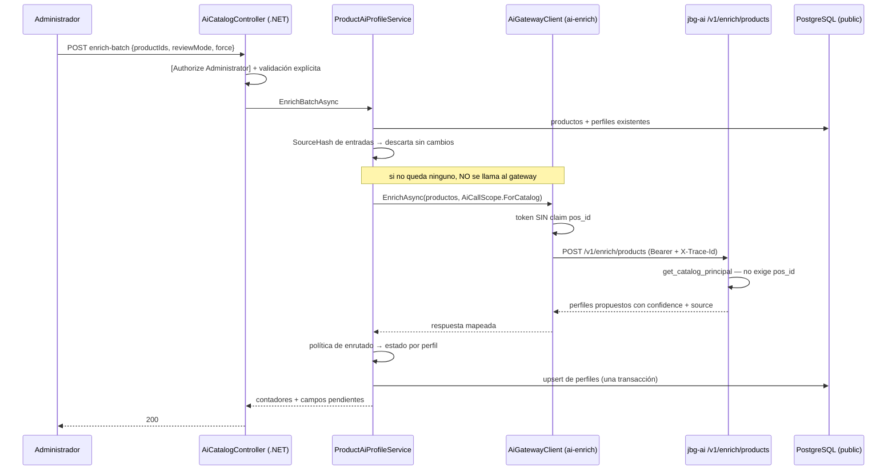

## Context

C08 crea el primer dato de catálogo producido por un modelo que el negocio va a usar para vender. Eso lo separa de todo lo anterior: `ProductSearchEvent` (C04) registra lo que pasó y nadie decide sobre ello; `ai.product_document` (C05) es un índice derivado y desechable. Un perfil IA, en cambio, **afirma cosas sobre una pieza** —que es de plata, que es un anillo, que la talla es la M— y esas afirmaciones llegan a una operadora que las usa delante de un cliente.

De ahí que la pregunta de diseño no sea *cómo guardo los campos*, sino **cómo queda escrito de quién es cada afirmación**. El diseño RAG §7.8 ya fijó la política: revisión humana obligatoria en los campos sensibles cuando el valor es inferido, innecesaria cuando viene de una regla determinista, y auto-aprobación por umbral en las etiquetas comerciales. Este documento decide cómo se materializa esa política sin que su atajo operativo —imposible revisar mil fichas antes del 3 de septiembre— acabe disolviéndola.

**Estado del que se parte:**

- `Product` no tiene ningún atributo estructurado. Todo `piece_type`, `materials`, `stone_type` y `size_label` nace aquí.
- `POST /v1/enrich/products` está congelado desde C02 y **nunca ha sido llamado**. Devuelve confianza por valor pero **no devuelve el origen del valor**.
- `AiCallScope` sólo se construye con un punto de venta concreto, y `decode_service_token` exige `pos_id` en todas las rutas `/v1`. El enriquecimiento del catálogo no tiene punto de venta.
- `IAiGatewayClient` expone una sola operación, y el registro de clientes deja escrito que cada familia de ruta lleva su propio cortacircuitos.
- El arnés de aserciones de esquema de C04 existe y sabe preguntar por tipo, nulabilidad, longitud, columnas de un índice y regla de borrado. **No sabe preguntar si un índice es único.**

**Dependientes que condicionan el diseño:** C12 filtra su feed por estado de aprobación; C28 necesita medir la corrección del extractor y **no tiene turno de migración**.

## Goals / Non-Goals

**Goals:**

- Que cada campo del perfil lleve escrito **de dónde sale** y **con cuánta confianza**, de modo que la decisión de revisarlo la tome el sistema y no el criterio del día.
- Que la vía masiva sea posible —sin ella no hay corpus indexado ni demo— pero **imposible de confundir** con revisión humana en cualquier métrica posterior.
- Que C12 tenga un predicado de aprobación inequívoco y que C28 tenga dónde leer sin abrir una séptima migración.
- Que reejecutar el enriquecimiento sea barato y **no destruya trabajo humano**.
- Que el scope sin punto de venta que este change necesita no abra un agujero en el aislamiento entre puntos de venta.

**Non-Goals:**

- El extractor real: prompt versionado, vocabularios cerrados, normalización de sinónimos y puertas de calidad de lote son **C09**. Aquí se consume el stub determinista.
- Cualquier superficie de lectura, aprobación o métrica → **C28**. El feed → **C12**.
- Familias de producto: el contrato seguirá devolviendo `family_id` y `variant_label`, y se **ignoran** deliberadamente.
- Asincronía en cualquier forma: sin cola, sin trabajo en segundo plano, sin reanudación.
- Historial de revisiones múltiples sobre un mismo perfil.

## Decisions

### 1 · El contrato de enriquecimiento se renegocia aquí, no en C09

La regla central del §7.8 es *«revisión obligatoria si el valor es **inferido**; si viene de una regla determinista, `source: rule` y no requiere revisión»*. El contrato congelado no transporta ese `source`. Sin él, dos de los cuatro tests de enrutado de la ficha no tienen nada que distinguir y la decisión 5 queda como intención escrita en un documento.

Se añade `source` a cada valor propuesto, más `piece_type`, `stone_type` y `size_label`, y se desglosa el `tags` plano en `color_tags` / `style_tags` / `occasion_tags`.

**Alternativas consideradas.** *(a) Que C09 renegocie*: obliga a construir hoy la entidad y el enrutado sobre una forma que ya se sabe insuficiente, y a rehacerlos en dos semanas. *(b) Que .NET derive el origen por su cuenta*: sólo podría hacerlo para la talla, con una expresión regular propia, creando **dos reglas de talla** —la suya y la de C09— que divergirían sin que nadie lo note. *(c) Aceptar `tags` plano y partirlo en .NET*: el criterio de partición sería inventado aquí y contradicho por el vocabulario que C09 cierre.

**Por qué es barato ahora y caro después:** la ruta no tiene hoy **ningún otro consumidor**. Romperla no invalida una sola línea de código existente. El precio es un snapshot regenerado y dos suites en verde, y el mecanismo para que eso no pase inadvertido —`test_openapi_snapshot_is_stable`— es exactamente el que C02 construyó para este momento.

### 2 · Estado y origen de revisión son dos columnas, no una

El §7.8 exige que los perfiles de la vía masiva **se indexen**; C12 promete excluir del feed los perfiles no aprobados; C28 promete métricas que no mezclen ambas vías. Las tres cosas sólo son ciertas a la vez si *en qué punto está* y *quién lo puso ahí* son datos distintos.

```
                  ReviewOrigin = AutoBulk        ReviewOrigin = Human
ReviewStatus
  Pending         propuesto, nadie lo vio        —
  Approved        auto-aprobado → SE INDEXA      revisado de verdad → métrica C28
  Rejected        —                              descartado por una persona
```

`C12: WHERE ReviewStatus = Approved` (sin mirar el origen) · `C28: WHERE ReviewOrigin = Human`.

**Alternativa considerada:** un cuarto valor `AutoApproved` en el estado. Se descarta porque convierte todo `== Approved` escrito de memoria en cualquier change futuro en un filtro que **deja fuera medio corpus sin dar ningún error**. Dos columnas hacen ese olvido imposible de cometer.

### 3 · La vía masiva es un modo de la petición, y deja huella

El enrutado aplicado a ~1.000 productos con `piece_type` inferido produce ~1.000 perfiles pendientes, un feed vacío y ninguna demo. El §7.8 nombra el problema y declara la salida. El riesgo de esa salida es que degenere en *«aprobamos todo y no lo contamos»*.

`reviewMode: Routed | AutoBulk`. En `AutoBulk` todo sale aprobado con origen de aprobación masiva, **pero `FieldConfidenceJson` y `FieldSourceJson` siguen registrando lo que el enrutado habría decidido**. El atajo existe, está declarado, y queda escrito en el dato en lugar de disolverse en él: después se puede responder «de los perfiles auto-aprobados, el X % tenía al menos un campo sensible inferido».

**Alternativa considerada:** que la aprobación masiva fuese una acción humana posterior, en la pantalla de C28. Se descarta porque entonces su origen sería `Human` y la métrica de revisión humana quedaría inflada por clics de aprobación en bloque — justo lo que §7.8 se compromete a no hacer.

### 4 · La política de enrutado es una clase pura

| Campo | `source = rule` | `inferred`, conf ≥ umbral | `inferred`, conf < umbral |
|---|---|---|---|
| `piece_type`, `materials`, `stone_type`, `size_label` | no requiere revisión | **requiere revisión** | requiere revisión |
| `color_tags`, `style_tags`, `occasion_tags` | no requiere revisión | **auto-aprueba** | requiere revisión |

Sin base de datos, sin HTTP, sin reloj. Los cuatro tests `Routing_*` deben correr en milisegundos y sin contenedor; dentro del servicio que persiste, no pueden. Los umbrales van en **opciones tipadas validadas al arranque**, no en constantes: C24 y C25 los recalibrarán contra el golden set, y un umbral compilado es un umbral que no se recalibra.

**La pertenencia a familia queda fuera** de los campos sensibles aunque §7.8 la liste: la familia es entidad de negocio de C07 y su propuesta es de C18. Sostener aquí una segunda autoridad sobre lo mismo crearía dos verdades.

### 5 · `SourceHash` hashea las entradas, no la salida

SHA-256 sobre SKU + nombre + descripción + colección, en orden fijo. **No es** el `source_hash` de C11, que Python calculará sobre el `doc_text` canónico del perfil aprobado para decidir si recalcula el embedding. Dos hashes, dos propósitos, nombre casi idéntico — y por eso conviene que esté dicho aquí y en la HU.

Sirve para dos cosas que valen lo mismo: **no volver a pagar el modelo** por un producto que no ha cambiado, y **no machacar en silencio** una ficha que alguien ya revisó. Al cambiar el hash hay propuesta nueva: el perfil vuelve al resultado del enrutado, el origen vuelve a masivo y los campos de revisión se limpian, con traza en el log. Versionar perfiles sería más fino y no cabe en la sesión.

### 6 · Scope de catálogo con dos cierres independientes

`AiCallScope` gana `ForCatalog(userId, role)` y `PointOfSaleId` pasa a nulable. Es el camino que C03 dejó anotado en el propio tipo. Lo que **no** se hace es enviar un `pos_id` centinela: desde C22 ese claim es el único filtro duro del recuperador, y un valor comodín llegando ahí es una fuga entre puntos de venta disfrazada de parámetro de conveniencia.



Dos cierres, no uno: **el cliente .NET rechaza un scope de catálogo en recuperación** y **`jbg-ai` sigue exigiendo `pos_id` en sus rutas de recuperación**. Que uno se relaje por descuido no abre la puerta. El documento OpenAPI no cambia por este apartado —la autenticación no se describe ahí— y `EnrichResponse` hereda de `TracedResponse` y no de `ScopedResponse`, así que un principal sin punto de venta no altera ninguna respuesta.

### 7 · Familia de ruta propia para el enriquecimiento

Cliente con nombre `ai-enrich`, presupuesto de decenas de segundos, **cortacircuitos aislado** y **sin reintento automático**.

El aislamiento es la parte que importa: una extracción lenta **no puede** abrir el circuito de recuperación y empujar la búsqueda del operador a su vía léxica degradada por un servicio que está respondiendo correctamente. Es la misma razón que el registro de C03 dejó escrita para el cliente generativo de C34.

El reintento se omite porque un segundo intento sobre una extracción es coste de modelo duplicado sin ninguna razón para esperar un resultado distinto. El 501 del contrato se traduce a **503 nombrando C09**: aquí no hay degradación posible, el enriquecimiento ocurre o no ocurre, y fingir lo contrario sería inventar datos.

### 8 · C08 reserva el almacenamiento de las métricas de C28

C28 no está marcado con migración y el plan cuenta seis. Se reservan dos columnas:

- **`ProposedProfileJson`** — la propuesta cruda, inmutable. La tasa de corrección por campo sale de comparar el valor vigente con el propuesto, sobre los perfiles de origen humano. Es una comparación de estado, no un registro de eventos: no puede desincronizarse del dato.
- **`ReviewDurationMs`** — nulable. Lo mide el navegador en C28, porque el servidor no puede observar cuánto tiempo mira alguien una ficha. **Nulo en aprobación masiva por campo**, donde el número mentiría: así la media mide sólo las fichas que alguien miró de una en una.

**Alternativa considerada:** una entidad `ProductAiProfileReview` con una fila por acción de revisión. Da historial y atribución exacta, y cuesta tabla, repositorio, dos claves foráneas y una transacción compuesta — pero sobre todo **fija la forma de la auditoría de C28 antes de haber diseñado C28**, que es el guardarraíl que C04 escribió para su propio arnés. Para una campaña de 120-150 fichas revisadas una vez antes del 3 de septiembre, ese historial no lo lee nadie.

### 9 · Lo que se declara a mano porque falla en silencio

| Declaración | Qué pasa si se deja al valor por defecto |
|---|---|
| Columnas `jsonb`, no `text` | El documento se guarda igual, no se puede agregar en SQL, y un truncado a bytes deja JSON inválido almacenado |
| **Índice único** sobre `ProductId` | Dos perfiles del mismo producto conviven sin error y C12 indexa documentos duplicados |
| `RESTRICT` en las dos claves foráneas | El valor por defecto para relación requerida es `CASCADE`: borrar un producto borraría el trabajo de revisión |
| Vocabularios como `text` + validación, nunca `ENUM` | Un tipo `ENUM` sobrevive al borrado de la tabla y rompe la siguiente migración semanas después — lección de C05 |

El arnés de C04 se extiende con **una sola pregunta nueva**: si un índice es único. Nada más, siguiendo el guardarraíl que ese change se puso a sí mismo.

## Risks / Trade-offs

| Riesgo | Mitigación |
|---|---|
| El scope de catálogo alcanza una ruta de recuperación → fuga entre puntos de venta | **Dos cierres independientes**, uno por lado, ambos con test dedicado |
| Un segundo perfil del mismo producto pasa desapercibido y C12 indexa duplicados | Índice único afirmado contra el catálogo de PostgreSQL, no confianza aplicativa |
| Reejecutar el lote machaca revisiones humanas | Idempotencia por `SourceHash` + `force` explícito, con test que verifica **cero llamadas** al gateway |
| `AutoBulk` degenera en aprobar todo sin contarlo | El modo queda en el dato y la procedencia por campo sigue registrando lo que el enrutado habría dicho |
| Los umbrales quedan compilados y C24/C25 no pueden recalibrarlos | Opciones tipadas con validación al arranque |
| Renegociar el contrato desborda la sesión | Línea de corte: la primera mitad (entidad + migración + detectores) es archivable sola |
| C09 descubre que el contrato necesita otro ajuste | **Aceptado.** Una segunda renegociación cuesta un snapshot y dos suites; construir la entidad sobre una forma insuficiente cuesta rehacerla |
| La suite de .NET viene con rojos previos y se lee como regresión | Línea base medida con `git stash` antes de empezar, comparando **nombres**, no recuentos |
| El lote síncrono de 50 obliga a 20 llamadas para el catálogo completo | **Trade-off aceptado y declarado** en el README: sin cola ni reanudación, aceptable a esta escala e inaceptable a escala real |

## Migration Plan

1. **Turno de migración.** Anunciar la apertura antes de empezar: el slot de EF Core es único y lo comparten C07, C19, C27 y C29. Mergear antes de que otro lo abra.
2. **Orden de despliegue.** La migración es puramente aditiva —una tabla nueva y ninguna columna en tablas existentes—, así que puede aplicarse antes que el código sin romper nada en marcha.
3. **Contrato.** El servicio Python y el backend .NET deben desplegarse juntos: un `jbg-ai` con el contrato antiguo devolvería perfiles sin `source` y el enrutado los trataría como inferidos. En desarrollo esto no se nota porque ambos suben con `docker compose`.
4. **Rollback.** La migración revierte borrando una sola tabla, sin objetos huérfanos porque no hay tipos `ENUM`. El contrato revierte restaurando el snapshot anterior. Ningún dato de negocio se pierde: el perfil es derivado y se puede regenerar ejecutando el lote de nuevo.
5. **Puesta en marcha del corpus.** Enriquecer el catálogo completo son ~20 llamadas en modo masivo. No forma parte del despliegue: es una operación de administración posterior, y hasta C09 sólo produce datos de stub.

## Open Questions

| # | Pregunta | Opción por defecto si no hay respuesta antes del apply |
|---|---|---|
| 1 | ¿Calcula .NET la talla con una expresión regular propia, marcándola `source: rule`? | **No.** El §7.1 coloca esa normalización en el pipeline de Python; duplicarla crearía dos reglas de talla que divergirían. C08 se limita a honrar el `source` que reciba |
| 2 | Valor del umbral de auto-aprobación de etiquetas | **0,80** como punto de partida documentado, en configuración. Provisional por definición: C24 lo recalibra contra el golden set |
| 3 | ¿Conserva el reenriquecimiento la revisión humana anterior? | **No, la limpia**, con traza en el log. El texto del producto cambió: la revisión anterior es sobre otro texto, y conservarla haría figurar como revisada por alguien que nunca vio ese contenido |
| 4 | ¿`AiConfidence` agregada es media simple o ponderada hacia los campos sensibles? | **Media simple** de los campos presentes. La ponderada exige justificar pesos que nadie tiene, y C28 sólo la usa para ordenar su cola |
| 5 | ¿Entra `prompt_version` en el contrato ahora? | **Sí.** Cuesta un campo, la renegociación ya está abierta, y sin él la progresión de prompts v1→v2 que C39 promete no se reconstruye a posteriori |
| 6 | ¿Se expone algún recuento de perfiles por estado para el panel de administración? | **No.** Toda lectura es de C28. Añadir «sólo un contador» es la vía por la que un change sin superficie de lectura acaba con tres |
