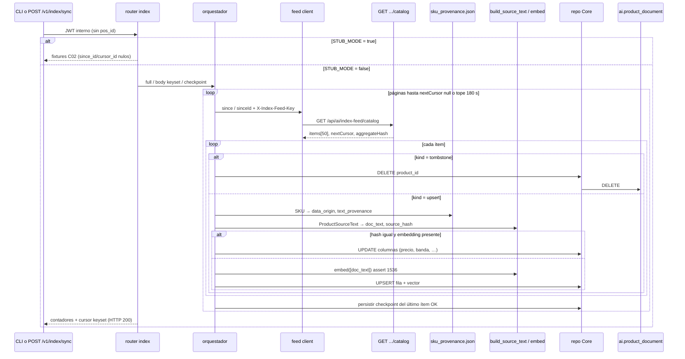

## Context

C11 congeló `source-text/v1` y el cliente de embeddings 1536d; C12 congeló `GET /api/ai/index-feed/catalog` (página 50, keyset, tombstones, `aggregateHash`). AutoBulk de los 1.200 ya está corrido (2026-08-26). El escritor del índice **aún no existe**: `/v1/index/sync` y `/v1/index/status` son el stub C02; con `STUB_MODE=false` responden 501 nombrando este change. El router usa `get_service_principal` (exige `pos_id`), contra `ai-service-auth` y el comentario de `deps.py`.

C12 no emite `data_origin` ni `text_provenance`. `ai.product_document.data_origin` es NOT NULL. C06a adjudicó la columna `text_provenance` a C13. El `Dockerfile` copia `src/`, no `data/catalog/`: la procedencia no se lee de los JSONL en runtime.

El contrato C02 describe el cursor de sync como un `datetime`. El feed pagina con keyset `(watermark, sinceId)`. Un solo instante pierde empates. Nadie en .NET llama estas rutas hoy (`IAiGatewayClient` no tiene operación de índice): se renegocia OpenAPI ahora, mismo precedente que C08.

**Estado del repositorio al diseñar (verificado 2026-08-26):**

| Pieza | Estado |
|---|---|
| `jbg_ai.indexing/` | C11: `source_text.py`, `embeddings.py` (congelado; LiteLLM se importa **dentro** de `_embed_chunk`), `constants.py`, `errors.py`. `__init__` no exporta HTTP ni SQL |
| `jbg_ai.api.main` | **No** menciona `indexing` (tests de C11 leen el fuente). El factory monta `DOMAIN_ROUTERS`, que incluye `index` |
| `api/routers/index.py` | Stub; `DELIVERED_BY = "C13 (...)"`; `get_service_principal`; `require_stub_mode` |
| `api/schemas/index.py` | `since: datetime \| None`, `full`, `batch_size` default 100. **Sin** `since_id` / `cursor_id` |
| `openapi.json` | Congelado. Este change **sí** lo regenera |
| `Settings` | `JPV_EMBEDDING_*` opcionales al boot. **Sin** `JPV_INDEX_FEED_*` |
| `get_catalog_principal` | Existe; enrich C09 ya lo usa. Index **no** |
| Alembic | Una revisión: `f46c55c056e2`. `product_document` **sin** `text_provenance`; `sync_failure` sin `since_id` / `product_id`; **sin** `sync_checkpoint` |
| `ai.product_document` | `data_origin` CHECK `real\|synthetic`; `embedding` NULABLE a nivel de esquema (C05); `tsv` generada `spanish` |
| Dockerfile | Copia `src`, `migrations`, `prompts`. **No** `data/` |
| JSONL | 436 real + 764 synthetic = 1.200. Hueco `SKU437`–`SKU439` |
| Feed .NET | Catálogo pág. 50, `X-Index-Feed-Key`. POS pág. 200 **existe**; C13 no lo drena |
| Compose `jbg-ai` | `STUB_MODE=true`. Backend **no** es servicio Compose (`dotnet run` en `:5056`) |
| `httpx` | Ya en `pyproject.toml` (≥0.28.1) |
| Spec `embedding-management` | Visual 1280d. **No se toca** |

**Fronteras que se heredan.** §6.3: Python tira por HTTP; no lee `public`. C05: frontera `ai`/`public`; CHECK no ENUM; pool 5 sin overflow. C11: skip-embed por hash; `embeddings.py` congelado para C23. C12: API Key y tombstones `kind`+`reason`. C09: stub vs real en el handler.



## Goals / Non-Goals

**Goals:**

- Sustituir el stub de `/v1/index/*` por un pipeline real cuando `STUB_MODE=false`, con el mismo patrón que C09.
- Drenar el feed de catálogo (no el POS) con keyset, upsert por `product_id`, tombstones y aislamiento por ítem.
- No reembeber cuando `source_hash` coincide y hay vector 1536; sí actualizar columnas (un PVP nuevo no cambia el hash y **sí** actualiza `price` / `price_band`).
- Sellar procedencia desde un mapa en `src/`; sin mapa no se escribe; SKU huérfano falla ruidoso y el resto sigue.
- Cero fila visible sin embedding 1536. El esquema C05 sigue permitiendo NULL; el escritor no lo usa.
- Persistencia de checkpoint keyset; tope de tiempo (default 180 s) que recorta con HTTP 200 y cursor reanudable.
- `GET /status` reporta deriva de conjunto con **un** GET de feed, no 24 páginas.
- Renegociar OpenAPI (`since_id` / `cursor_id`); regenerar snapshot; tests de contrato verdes **después**.
- Auth de catálogo (`get_catalog_principal`). CLI sobre la misma función. pytest sin sockets a OpenAI ni al API .NET.

**Non-Goals:**

- Escribir `ai.pos_projection` ni llamar al feed POS → **C22**.
- Scheduler cada 5–10 min → **C22**.
- HTTP *push* .NET → Python, outbox, migración EF Core, columna `DataOrigin` en `Product`.
- `POST /v1/retrieval/products` real → **C14**.
- Editar `indexing/embeddings.py`.
- `ai.query_log`, chunking de catálogo, diccionario de sinónimos (C20), embeddings visuales 1280d.
- Regenerar el corpus JSONL. Reejecutar AutoBulk.
- UI, frontend, cliente .NET hacia `/v1/index/sync`, RDS / SSM (C17).
- Un pytest que exija 1.200 filas reales contra Docker/OpenAI. El smoke `indexed_documents = 1200` / `drift_count = 0` es verificación **posterior**.

## Decisions

### 1 · Stub vs real en el handler, como C09

**Decisión:** `index.py` deja de llamar a `require_stub_mode`. Si `settings.stub_mode`: devolver `index_sync_stub` / `index_status_stub`. Si no: pipeline real. Dependencia `get_catalog_principal`. El orquestador se importa desde el **router** (no desde `api.main`), para que los tests C11 que leen el fuente de `main.py` (`test_main_does_not_import_indexing`) sigan verdes. LiteLLM ya es lazy dentro de `embeddings._embed_chunk`; un import del paquete `indexing` no arrastra el proveedor.

Falta de `JPV_INDEX_FEED_API_KEY`, `JPV_INDEX_FEED_BASE_URL`, `JPV_EMBEDDING_API_KEY` o del mapa → **503** con `detail` que nombra la setting, no 501 ni 200 con ceros. `/health` no las exige. Puertos inyectables en `request.app.state` (feed, embed, repo), gemelos de `app.state.enrich_llm`.

El stub, **después** de regenerar el snapshot, rellena `since_id` / `cursor_id` nulos (o deterministas) para que los tests de contrato sigan validando el response model. `sample_requests.py` y `V1_RESPONSES` documentan 503 en las rutas de índice.

**Por qué.** C09 ya demostró que el 501 es un guardrail de *aún no existe*, no un modo de operación. Mentir un 501 cuando el código está escrito haría opaco un misconfig (sin key de feed).

**Alternativas descartadas.** *(a) Seguir con `require_stub_mode` y un flag interno:* duplica el patrón y deja 501 para un change que sí entrega. *(b) Importar el orquestador desde `create_app`:* rompe el test de C11 y acopla el boot a SQL/HTTP. *(c) 500 genérico si falta la key:* no nombra la setting; Compose local se diagnostica peor.

`test_index_routes_still_name_c13` se actualiza o se retira: la ruta ya no es un placeholder 501.

### 2 · OpenAPI keyset (opción B, BREAKING aditivo)

**Decisión:** ampliar, no sustituir, el contrato C02.

`IndexSyncRequest`:

| Campo | Tipo | Notas |
|---|---|---|
| `since` | datetime \| null | Watermark del keyset |
| `since_id` | uuid \| null | Segunda componente. Ausente + `since` ausente = checkpoint o full |
| `full` | bool default false | Ignora checkpoint y body cursor |
| `batch_size` | int 1–1000 default 100 | **Ignorado.** `logger.warning` una vez por proceso. Página = 50 de C12 |

`IndexSyncResponse`: contadores + `since` / `since_id` (de dónde arrancó) + `cursor` / `cursor_id` (dónde quedó). `skipped` = ítems cuyo embed se omitió.

`IndexStatusResponse` no cambia de forma: `indexed_documents`, `drift_count`, `last_full_sync_at`, `last_incremental_sync_at`.

Regenerar `openapi.json` con `canonical_openapi_settings`. `test_openapi_snapshot_is_stable` verde **después**. Nadie en .NET llama estas rutas: el breaking no cruza la frontera del gateway.

**Por qué.** Un `datetime` suelto pierde empates de watermark (C12 pagina por `(since, sinceId)`). Añadir campos opcionales mantiene los fixtures actuales válidos.

**Alternativas descartadas.** *(a) Embeber el cursor en un string opaco:* el CLI y el checkpoint tendrían que parsearlo; el feed ya expone dos campos. *(b) No tocar OpenAPI y mandar `since_id` por header:* el snapshot no lo vería y el stub de contrato mentiría. *(c) Honrar `batch_size` contra el feed:* C12 ignora `pageSize`; mentir un 100 rompería el keyset.

### 3 · Precedencia `full` > body keyset > checkpoint

**Decisión:**

1. `full=true` → GET catálogo **sin** cursor; ignora body y checkpoint.
2. Body completo `(since, since_id)` → esos ganan; el checkpoint no se lee para esa tirada (sí se **escribe** al acabar).
3. Incremental sin body → partir del checkpoint. Checkpoint ausente ≡ full.

Al cortar por `JPV_INDEX_SYNC_TIME_BUDGET_SECONDS` (default **180**): persistir checkpoint del último ítem **procesado con éxito**; response con cursor y contadores parciales; HTTP 200. El caller (CLI o segundo POST) reanuda. El tope se consulta **después de cada ítem**, no al final de la página: una página de 50 embeds no debe pasarse 180 s y tirar el progreso.

CLI: `python -m jbg_ai.indexing sync [--full]`. Misma función que el router. Sin cron. Sin segundo engine.

**Por qué.** Tres capas de cursor (query C12, body OpenAPI, fila `sync_checkpoint`) sin una regla total producen dobles lecturas o huecos. El tope evita un HTTP colgado en free-tier; 1.200 × `text-embedding-3-small` + 24 GET caben en decenas de segundos.

**Alternativas descartadas.** *(a) Un POST = una página:* 24 round-trips HTTP de operador para el primer sync; el ticket lo cierra. *(b) Cortar por número de páginas:* el coste está en el embed, no en el GET. *(c) 500 al agotar el tope:* el caller no puede reanudar sin leer logs. *(d) Usar `sync_failure` como bookmark:* mezcla errores con progreso; C05 ya dijo que esa tabla es cola de reintento.

### 4 · Cliente de feed reutilizable; C13 solo drena catálogo

**Decisión:** puerto `IndexFeedClient` (async) con:

- Base URL + header `X-Index-Feed-Key` (se **envía**; Python no compara).
- `fetch_catalog_page(since, since_id) -> CatalogFeedPage`. Primera página: omitir ambos query params.
- Método/path POS en el cliente (`fetch_pos_page`); C13 **no** lo invoca.
- Parseo de `kind` `upsert` \| `tombstone`. Mapear camelCase → `ProductSourceText` (C11) + `product_id`, `family_id`, `price`, `price_band`, `is_active`, `watermark`. Tombstone: `{ kind, productId, reason, at }`.
- Adapter `httpx.AsyncClient`. Timeout acotado. Tests inyectan el puerto; **cero** sockets a `:5056`.

C22 importará este cliente. No vive bajo `api/`.

**Por qué.** El feed es el único camino de lectura (§6.3). Meter el HTTP dentro del orquestador obligaría a C22 a copiarlo o a depender del upsert de catálogo.

**Alternativas descartadas.** *(a) httpx directo en el orquestador:* C22 reimplementa parseo y header. *(b) Drenar POS «ya que estamos»:* viola el corte C13/C22 y escribe `pos_projection` sin diseño. *(c) SDK generado del OpenAPI .NET:* no hay snapshot OpenAPI del API .NET en este repo para el feed; el DTO C12 es pequeño y estable.

### 5 · Mapa de procedencia en `src/` (A3 + B4)

**Decisión:** generar **una vez** (script documentado en tasks, corrido en el apply) desde:

- `data/catalog/real/generated/catalog-real-enriched.jsonl`
- `data/catalog/synthetic/generated/catalog-synthetic.jsonl`

Escribir `ai-service/src/jbg_ai/indexing/sku_provenance.json`:

```json
{ "SKU01": { "data_origin": "real", "text_provenance": "ai_assisted" } }
```

Runtime: solo ese JSON. El `Dockerfile` ya copia `src/`.

Invariantes de test (pytest en el repo, lee `data/`): 1.200 claves; 436 `real` / 764 `synthetic`; 387 `ai_assisted` / 49 `merchant` / 764 `synthetic`; cero solapes; toda clave de JSONL presente.

- **A3:** mapa ausente o ilegible → 503, **cero** filas escritas.
- **B4:** SKU del feed ∉ mapa → `sync_failure`, `failed += 1`, el resto sigue.
- **Prohibido** default `synthetic` o heurística `SKU01`–`SKU436` (el sintético empieza en `SKU440`; hay hueco `SKU437`–`SKU439`).
- No persistir `text_quality_tier`.

**Por qué.** C12 no trae procedencia. Adivinarla miente las métricas de §8.1.1. Leer JSONL en runtime rompe el contenedor (no hay `data/`).

**Alternativas descartadas.** *(a) Columna `DataOrigin` en `Product` + migración EF:* el ticket lo cierra; C12 no la abrió. *(b) Heurística por rango de SKU:* el hueco 437–439 la hace falsa. *(c) Default `synthetic`:* un SKU real huérfano contaminaría el desglose. *(d) Copiar `data/` al Docker:* infla la imagen y acopla el runtime al corpus.

### 6 · Alembic a mano: `text_provenance`, `sync_checkpoint`, `sync_failure`

**Decisión:** una revisión nueva, padre `f46c55c056e2`. **No** `alembic revision --autogenerate` (C05: mapped class no es fuente de autogen). Sin ENUM.

1. `ai.product_document.text_provenance text NOT NULL` + CHECK `IN ('merchant','ai_assisted','synthetic')` + índice B-tree `ix_product_document_text_provenance`. Tabla vacía hoy → sin backfill.
2. `ai.sync_checkpoint`: PK `feed` (texto, valor `catalog`). Columnas: `watermark timestamptz`, `since_id uuid`, `last_full_sync_at`, `last_incremental_sync_at`, `last_aggregate_hash char(64)`, `indexed_count int`.
3. `ai.sync_failure`: `cursor_since_id uuid` nullable, `product_id uuid` nullable. No usar esta tabla como bookmark.

Downgrade: drop columnas/tablas nuevas; no tocar las seis tablas de C05 más allá de `text_provenance`. Tests de esquema en contenedor pgvector; omitir (no fallar) si Docker no responde.

**Por qué.** C06a dejó la columna para este change. El checkpoint no cabe en `sync_failure` (cola de error ≠ progreso). CHECK replica la decisión 6 de C05.

**Alternativas descartadas.** *(a) Autogen desde un modelo ORM:* C05 lo prohibió porque el autogen reescribe HNSW/GIN. *(b) ENUM PostgreSQL:* sobrevive al `drop_table` y rompe el siguiente `upgrade`. *(c) Backfill dummy `synthetic`:* no hay filas; un default mentiroso sobreviviría al primer bug de mapa.

### 7 · Upsert: skip-embed ≠ skip-fila; cero vector NULL visible

**Decisión:**

```
tombstone → DELETE WHERE product_id = :id
            deleted += rowcount  (0 = no-op, no cuenta)

upsert    → build_source_text / hash_source_text (C11)
            lookup procedencia (B4/A3)
            si stored.hash == new.hash y embedding presente:
                 UPDATE columnas (precio, price_band, family_*, tags,
                                  is_active, data_origin, text_provenance,
                                  indexed_at, doc_text, source_hash)
                 skipped += 1
            si no:
                 embed([doc_text])  # C11, assert 1536
                 UPSERT atómico fila + vector
                 upserted += 1
```

`doc_text` se escribe siempre (NOT NULL; el `tsv` se genera). Un PVP nuevo no cambia el hash y **sí** actualiza `price` / `price_band` — si se ignorara la fila, C21 filtraría por una banda obsoleta.

`embedding_model` / `embedding_version` = `document_version_key` de C11 (`{model}:1536:source-text/v1`).

Si el embed falla o la dimensión ≠ 1536: **no** pisar fila previa; `sync_failure`; continuar. No hay `INSERT` con `embedding IS NULL`. El esquema C05 sigue permitiendo NULL (una fila *puede* preceder al cálculo); el escritor de C13 no deja esa ventana visible.

Aislamiento por **ítem**, no por página: un SKU huérfano o un embed caído no aborta los otros 49.

**Por qué.** Idempotencia cara = el proveedor de embeddings, no el UPSERT. Un rename de `family_name` cambia el hash (C07/C11) y reembebe; un cambio de PVP no.

**Alternativas descartadas.** *(a) Skip de fila completa si el hash coincide:* banda/precio obsoletos; fallo mudo de C21. *(b) Insertar con embedding NULL y rellenar después:* C14 recuperaría filas sin vector o las filtraría de forma opaca. *(c) Abortar la página al primer fallo:* un SKU mal mapeado bloquearía el dreno. *(d) Reusar `ProductAiProfile.SourceHash`:* pregunta «¿reextraer?», no «¿reembeber?».

### 8 · `drift_count` por hash de conjunto, un GET

**Decisión:** `GET /status` (modo real):

1. SHA-256 de los `product_id` en `ai.product_document`, **mismo algoritmo** que C12 (`IndexFeedAggregateHash.OfProductIds`): UUID canónico formato `D` (8-4-4-4-12, hex minúsculas), ordenados, concatenados UTF-8, hex minúsculas 64 chars. Sin separador (ancho fijo).
2. `GET` **solo** la primera página del feed catálogo → `aggregateHash`.
3. Iguales → `drift_count = 0`. Distintos → `drift_count = max(1, abs(indexed_documents − checkpoint.indexed_count))`.

Content drift (texto/precio) ≠ set drift. El primero lo cubre el incremental + `source_hash`. Status **no** pagina 24 veces. Si el feed no responde: error explícito (503), no `drift_count = 0` silencioso.

El hash de conjunto es una función pura testeable sin HTTP (`test_status_reports_drift_when_counts_diverge` usa un fake de feed y cuenta **un** GET).

**Por qué.** Paginar el catálogo en cada health-check de índice duplica el dreno y mete 24 round-trips en un GET. C12 ya publica el digest global en cada página.

**Alternativas descartadas.** *(a) `abs(count_ai − count_feed)` paginando:* 24 GET; no detecta sustitución 1-por-1. *(b) Comparar `last_aggregate_hash` del checkpoint sin GET:* no ve altas .NET posteriores al último sync. *(c) Devolver el delta de ids:* payload grande; el contrato solo pide un entero.

### 9 · Repositorio async + SQLAlchemy Core; un solo pool

**Decisión:** puerto de persistencia inyectable (upsert, delete, get-by-product_id, list-ids-for-hash, get/put checkpoint, insert sync_failure, count). Implementación SQLAlchemy **Core** (tabla `Table(...)` o `text()`), no mapped class como fuente de autogen. Fake en tests.

`session_scope` / engine existentes (`db/engine.py`): pool 5, `max_overflow=0`, lazy. **No** abrir un segundo engine. El CLI reutiliza el mismo.

Python **no** hace `SELECT`/`INSERT` en `public`.

**Por qué.** C05 dejó el engine vacío a propósito. Un ORM mapeado tentaría `alembic revision --autogenerate` y pisaría HNSW. Un segundo pool rompería el presupuesto 5–10 compartido con .NET.

**Alternativas descartadas.** *(a) SQL crudo con `psycopg` al margen del engine:* dos pools. *(b) Mapped class «solo para leer»:* el autogen no distingue. *(c) Escribir desde el orquestador con strings interpolados:* sin puerto, los tests de upsert abrirían Docker.

### 10 · Settings de feed; tercer secreto; pin del snapshot

**Decisión:** `JPV_INDEX_FEED_BASE_URL`, `JPV_INDEX_FEED_API_KEY`, `JPV_INDEX_SYNC_TIME_BUDGET_SECONDS` (default 180) opcionales al boot; string vacío = unset, igual que `JPV_EMBEDDING_*`. `canonical_openapi_settings` las pinna a ausentes / 180. Completar `backend/.env.example` y Compose (contenedor → `http://host.docker.internal:5056`; placeholder de key ≠ `JWT_SECRET`).

Tres secretos distintos: `JWT_SECRET` (token hacia Python) ≠ `JPV_INDEX_FEED_API_KEY` (Python → .NET, header `X-Index-Feed-Key`) ≠ `JPV_EMBEDDING_API_KEY`. La key de feed **no** se loguea. Prohibido caer a `JWT_SECRET`. Producción: SSM en **C17**.

**Por qué.** El mismo patrón C06b/C09/C11: el proceso arranca; el fallo es al *usar*. Si el snapshot lee el entorno, `test_openapi_snapshot_is_stable` se pone rojo por una key local.

**Alternativas descartadas.** *(a) Exigir la key al boot:* Compose `STUB_MODE=true` no levantaría `/health`. *(b) Reusar `JWT_SECRET` como API Key del feed:* un token de retrieval serviría para leer el catálogo por el feed y viceversa. *(c) Inyectar SSM aquí:* C17 es el change de producción.

## Risks / Trade-offs

- **[Riesgo] Importar `indexing` desde `api.main` rompe los tests C11 y arrastra SQL al boot.** → Mitigación: import solo desde el router; `main.py` no menciona el paquete. LiteLLM sigue lazy en `_embed_chunk`.
- **[Riesgo] El snapshot OpenAPI se regenera y el contrato de stub queda incoherente.** → Mitigación: stub rellena `since_id`/`cursor_id`; `sample_requests` y tests de contrato se alinean **en el mismo change**.
- **[Riesgo] Heurística de SKU o default `synthetic` miente la procedencia.** → Mitigación: mapa cerrado; tests de invariante contra JSONL; A3/B4; hueco 437–439 documentado.
- **[Riesgo] Fila visible sin vector; C14 recupera basura o nada.** → Mitigación: embed antes del UPSERT; fallo de embed → `sync_failure`, no UPDATE a NULL.
- **[Riesgo] `batch_size` del body se interpreta como página del feed.** → Mitigación: ignorar + warning una vez; test dedicado; página = 50 de C12.
- **[Riesgo] Status pagina 24 veces o reporta `drift_count = 0` si el feed cae.** → Mitigación: un GET; 503 si el feed no responde; hash de conjunto testeable en puro.
- **[Riesgo] Hash de conjunto Python ≠ C# (`D` format, orden, encoding).** → Mitigación: copiar el algoritmo al pie de la letra; test de vector conocido alineado con `IndexFeedAggregateHashTests`.
- **[Riesgo] Tope 180 s a mitad de página pierde ítems ya embebidios.** → Mitigación: checkpoint **por ítem** procesado con éxito.
- **[Riesgo] Autogen Alembic pisa HNSW/GIN.** → Mitigación: revisión a mano; Core sin mapped class.
- **[Riesgo] Drenar el POS «para probar el cliente».** → Mitigación: el orquestador C13 solo llama `fetch_catalog_page`; test de que POS no se invoca.
- **[Riesgo] Editar `embeddings.py` «un poco» para el upsert.** → Mitigación: fuera de alcance explícito; review del diff; C23 depende del freeze.
- **[Riesgo] Token de índice con `pos_id` inventado (wildcard).** → Mitigación: `get_catalog_principal`; test gemelo de enrich.
- **[Riesgo] `host.docker.internal:5056` no resuelve en Linux CI.** → Mitigación: pytest no abre ese socket; smoke local es verificación posterior. Documentar el extra-host de Compose.
- **[Trade-off] OpenAPI breaking vs cursor opaco.** Aceptado: nadie consume el contrato; el keyset explícito es el del feed.
- **[Trade-off] `drift_count` es una cota, no el cardinal del delta.** Aceptado: el contrato pide un entero; el set hash ya dice *si* hay deriva.
- **[Trade-off] Mapa congelado a 1.200 SKU; un alta a mano en .NET falla ruidoso (B4).** Aceptado: no hay altas a mano en el corpus del proyecto.
- **[Trade-off] Esquema C05 sigue permitiendo `embedding` NULL.** Aceptado: no reabrir C05; el invariante es del escritor.

## Migration Plan

1. Settings `JPV_INDEX_FEED_*` + tope 180 s; pin en `canonical_openapi_settings`; `.env.example` y Compose (placeholder, `host.docker.internal:5056`).
2. Alembic: `text_provenance` + CHECK + índice; `sync_checkpoint`; columnas de `sync_failure`. Tests de esquema en pgvector (skip si no hay Docker).
3. Generar y commitear `sku_provenance.json`; test de invariante contra los JSONL.
4. Cliente HTTP del feed (puerto + adapter httpx); fake en tests; método POS presente y no llamado.
5. Repositorio Core + orquestador (dreno, skip-embed, tombstone, aislamiento, tope, checkpoint).
6. Router: `get_catalog_principal`, stub vs real, 503 si faltan secretos/mapa. Inyección `app.state`.
7. Pydantic keyset; regenerar `openapi.json`; alinear stub y `sample_requests`.
8. CLI `python -m jbg_ai.indexing sync`.
9. Tests (`tests/indexing/`, `tests/api/`, `tests/migrations/`). Actualizar `test_index_routes_still_name_c13`. Enlazar HU-AIENG-013 en `epicas.md` (EP14). Mencionar `text_provenance` / checkpoint / deriva en `modelo-de-datos.md`.
10. `openspec validate --all --strict` → 0 failed.
11. **Rollback:** revertir la revisión Alembic (downgrade drop de lo nuevo); revertir el paquete/router/snapshot. Las filas de `product_document` desaparecen con un `DELETE` o con el downgrade si se droppea la columna NOT NULL sobre tabla aún vacía en el primer deploy; si ya hay corpus indexado, el downgrade de `text_provenance NOT NULL` exige borrar filas o la columna — documentado: este change asume índice vacío al aplicar.
12. **Verificación posterior (no DoD de merge):** `POST /v1/index/sync {"full": true}` local y `GET /status` con `indexed_documents = 1200` y `drift_count = 0`, AutoBulk ya corrido y claves presentes.

Nada contra RDS. C17 inyectará `/jpv/prod/*`.

## Open Questions

Ninguna pendiente de producto. Cerradas en exploración (2026-08-26), incluida **B4+A3**.

| # | Pregunta | Decisión |
|---|---|---|
| 1 | ¿OpenAPI? | **Renegociar** (`since_id` / `cursor_id`) |
| 2 | ¿Idempotencia? | Skip embed; UPSERT de columnas siempre |
| 3 | ¿Procedencia? | Mapa en `src/` + Alembic. A3 + B4 |
| 4 | ¿POS / scheduler? | **No.** Cliente sí; dreno no |
| 5 | ¿Un POST drena? | **Sí**, con tope 180 s, checkpoint por ítem |
| 6 | ¿Aislamiento? | Por ítem |
| 7 | ¿Fila sin embedding? | **No** visible |
| 8 | ¿Checkpoint? | Tabla propia; no `sync_failure` |
| 9 | ¿`drift_count`? | Hash de conjunto, 1 GET |
| 10 | ¿DoD 1.200 en pytest? | **No.** Smoke posterior |
| 11 | ¿CLI? | **Sí**, misma función que el HTTP |
| 12 | ¿Altas a mano? | **No.** Mapa = 1.200 |
| 13 | ¿Body vs checkpoint? | `full` > body keyset > checkpoint |

Default si el apply descubre un detalle menor no listado: la opción más estrecha que **no** drene el POS, **no** edite `embeddings.py` y **no** abra migración EF.
