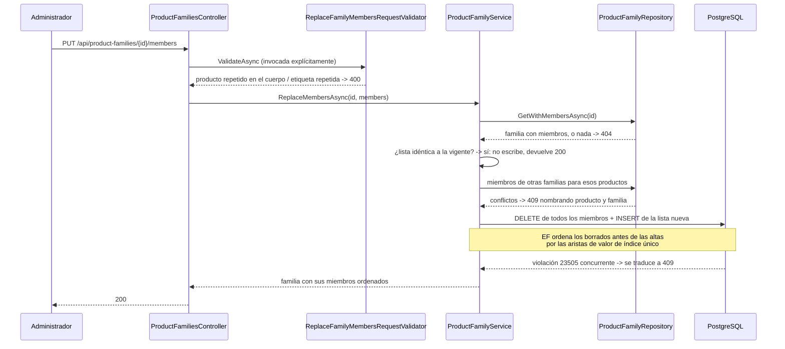

## Context

- **No existe nada de familias en el backend.** `Product` tiene `SKU`, `Name`, `Description`, `Price`, `CollectionId`, `IsActive` y `Photos`. El grep de `family|familia|variant|sibling` sobre `backend/` solo devuelve falsos positivos.
- **La única agrupación existente es `Collection`**: 1‑N opcional con `OnDelete(SetNull)`, criterio editorial, pertenencia no excluyente. Es un eje distinto y la confusión entre ambos es el error de lectura más probable de este change.
- **El esquema `ai` ya reserva la familia** desde C05: `family_id uuid` nullable **sin clave foránea**, `family_name text`, `variant_label text` y un B‑tree sobre `family_id`. El índice está hecho; falta producir el dato del lado .NET.
- **El contrato de `jbg-ai` ya transporta familia y variante** desde C02, en recuperación, asistencia, inventario y enriquecimiento. Este change no lo toca.
- **C08 dejó el terreno libre a propósito**: ignora `family_id` y `variant_label` del contrato y lo declara en su spec viva, para no sostener dos autoridades sobre lo mismo.
- **El arnés de test de esquema está montado** desde C04 y ampliado por C08 con `IndexIsUniqueAsync`. Cubre las siete aserciones que este change necesita: no hay que extenderlo.
- **El turno único de migración de EF Core está libre**: la última es `20260816113455_AddProductAiProfile` y C08 se mergeó.

**Dependientes que condicionan el diseño:**

| Change | Qué necesita | Consecuencia sobre este diseño |
|---|---|---|
| **C12** 🔴 | Emitir familia, nombre y etiqueta de variante en el feed `?since=` | Índices sobre `UpdatedAt` en ambas tablas; y dos huecos que este change adjudica por escrito en vez de resolver |
| **C18** | Crear familias reales al aprobar sugerencias, y registrar que hubo aprobación humana | **No está marcado 🗄️**: si no se reserva ahora, abre una séptima migración en la Ola 3 |
| **C30** 🔴 / **C36** 🔴 | Agrupar candidatos por familia y exigir confirmación de variante | La etiqueta debe ser legible por miembro y el orden determinista |
| **C11** | `test_hash_changes_when_family_changes` | Renombrar una familia debe ser detectable aguas abajo |

## Goals / Non-Goals

**Goals:**

- Familias como entidad de negocio **explícita y editable**, no como clave textual derivada de un perfil de IA.
- El invariante *un producto pertenece como máximo a una familia* garantizado por la base de datos.
- Edición de miembros **idempotente** y con orden determinista.
- Reservar hoy, al coste de tres columnas, lo que C18 no podrá crearse a sí mismo.
- Una sola migración, con todo lo que falla en silencio declarado a mano y verificado con detectores.

**Non-Goals:**

- Proponer familias, detectar etiquetas o listar huérfanos: es C18, y hacerlo aquí crearía dos autoridades sobre lo mismo.
- Cualquier interfaz de usuario.
- Cualquier lectura agregada: listado paginado, recuentos o métricas.
- Tocar `Product`, el esquema `ai` o el contrato de `jbg-ai`.
- Historial de pertenencia a familia.

## Decisions

### 1 · La familia es una entidad, no una clave; y no es una colección

La decisión 2 de la revisión sustituye `VariantGroupKey` por dos entidades con tres argumentos que son tres requisitos: una clave textual **se rompe** por un guion y deja de agrupar justo donde importaba; **no la puede corregir un administrador**, y si la corrige el siguiente enriquecimiento la machaca; y sin identidad propia **no hay contra qué comparar** para detectar huérfanos.

La distinción frente a `Collection` es igual de importante y debe quedar escrita en `modelo-de-datos.md`, no solo aquí:

| | `Collection` | `ProductFamily` |
|---|---|---|
| Qué agrupa | Criterio editorial («Verano 2024») | La misma pieza en varias variantes |
| Cardinalidad | Un producto, 0..1 colección; muchas colecciones coexisten sin relación | Un producto, **0..1 familia**, excluyente |
| Quién la mantiene | El catálogo, desde siempre | C07 a mano, C18 asistido |
| Para qué sirve aguas abajo | Filtro y agrupación comercial | **Desambiguación de variantes en la venta** |

**Alternativas consideradas.** *(a) Reutilizar `Collection` con un discriminador*: barato hoy, y convierte dos conceptos con cardinalidades distintas en una tabla con una columna que cambia su significado — exactamente el tipo de sobrecarga que produce consultas que mienten. *(b) Un campo `FamilyId` en `Product`*: elimina una tabla, pero deja la familia sin nombre, sin descripción y sin sitio donde poner la etiqueta de variante ni el orden, que son datos de la **relación**, no del producto.

### 2 · Un producto, una familia — en la base, no en el servicio

```
Product ──0..1── ProductFamilyMember ──N..1── ProductFamily
              UNIQUE(ProductId)
```

Un índice único sobre `ProductFamilyMember.ProductId`. Una comprobación aplicativa deja abierta la carrera entre dos administradores y, peor, **un segundo miembro no produce ningún error en ninguna parte**: se manifiesta cuando el feed de C12 emite dos familias para el mismo producto y el indexador de C13 construye documentos incoherentes.

El servicio comprueba igualmente **antes** de escribir, no para garantizar el invariante sino para producir un mensaje accionable: un 409 que solo dice «conflicto» obliga a la pantalla de C18 a adivinar cuál de veinte miembros del lote falló. La violación de la base se traduce como red de seguridad, leyendo `DbException.SqlState == "23505"` —de la biblioteca base, no `PostgresException`— para que `Application` no referencie el driver de PostgreSQL. Es el patrón que C08 ya escribió en `ProductAiProfileService`.

### 3 · El reemplazo de miembros es declarativo

`PUT /api/product-families/{id}/members` recibe la lista completa: lo que no aparece se quita, lo nuevo se añade y **el orden sale de la posición en el array**. Es lo que `PUT` promete —idempotencia— y hace imposibles por construcción los huecos y los órdenes duplicados.

**Alternativas consideradas.** *(a) `POST` y `DELETE` de miembros sueltos*: más literal frente a los nombres `AddMember`/`RemoveMember` de la ficha, pero alta y baja son la misma operación —*así queda la familia*— y partirlas obliga al cliente a orquestar el orden a mano en dos llamadas que pueden quedar a medias. *(b) Orden explícito en el cuerpo*: da control fino al frontend de C18 a cambio de tener que validar unicidad y contigüidad que la posición del array ya garantiza.

### 4 · Ese reemplazo se escribe borrando e insertando, no actualizando en sitio

Es la decisión menos evidente del change y la que más se paga si se elige mal.

Con tres índices únicos —producto global, orden por familia, etiqueta por familia—, reordenar dos hermanos significa mover dos filas a valores que la otra ocupa. Casar por producto y **actualizar en su sitio**, que suena a lo cuidadoso, es justo lo que rompe: EF construye un grafo de dependencias entre comandos y añade aristas por valor de índice único, de modo que quien libera un valor precede a quien lo ocupa. Un intercambio produce un ciclo que no puede deshacer, porque **no puede partir un `UPDATE` en borrado más alta**.

```
borrar + insertar                          actualizar en sitio
  DELETE m1 (orden 0) ──┐                    UPDATE m1: 0 -> 1  ──┐
  DELETE m2 (orden 1) ──┼──> INSERT (0)      UPDATE m2: 1 -> 0  <─┘  y viceversa
                        └──> INSERT (1)
  grafo ACÍCLICO: se resuelve solo           CICLO: ningún UPDATE puede ir primero
```

Preservar la identidad de la fila es lo que **crea** el problema, y esa identidad no vale nada: ni `ai.product_document` —que indexa por producto—, ni el feed —que emite por producto—, ni ninguna clave foránea del esquema referencian el `Id` de un miembro.

Se añade un **cortocircuito de no-operación**: si la lista pedida es idéntica a la vigente, no se escribe nada. Hace el `PUT` idempotente también en el almacenamiento y evita que cada llamada ensucie el cursor `since` de C12 con trabajo de reindexado inventado. Es el mismo `skippedUnchanged` que C08 implementó por hash.

**Alternativas consideradas.** *(c) Renunciar al índice único de orden* y confiar en que la posición del array lo garantiza: la más simple, y casi gana. Se descarta porque C18 va a crear ~350 familias por lotes y, si alguna vez inserta sin pasar por este servicio, un orden duplicado no da ningún error y produce una lista de hermanos distinta entre recargas. *(d) Zona de aparcamiento* —actualizar todos a órdenes negativos y luego a su valor final— rescata la opción de actualizar en sitio a costa de dos escrituras extra y un truco que nadie más usa en el repositorio. *(e) Huecos u orden fraccional* (10, 20, 30…) abarata el reordenado incremental, que aquí no existe.

**Coste declarado.** `ProductFamilyMember.CreatedAt` deja de significar «cuándo entró el producto en la familia» y pasa a ser «cuándo se escribió la lista por última vez». Debe decirse en `modelo-de-datos.md`. Si el proyecto llega a querer historial de pertenencia, es una tabla de auditoría, no un retoque de esta.

**Seguro previsto.** Si los tests de reordenado e intercambio de etiquetas fallaran, se escalona la escritura en una transacción explícita con `IUnitOfWork.BeginTransactionAsync()`: borrar y guardar, insertar y guardar, confirmar. **Lo decide el test, no la suposición**; meter la transacción de forma preventiva es complejidad sin evidencia.

> **Lo que pasó al implementarlo (2026-08-17).** Los tests de reordenado fallaron, se escalonó la escritura — y **siguieron fallando**, porque el culpable era otro. Una vez corregido (ver más abajo), se midieron las dos variantes: escalonada y de un solo `SaveChanges`, **ambas en verde**. El escalonado se retiró por no comprar nada. La predicción de arriba sobre el orden de comandos era correcta.
>
> **El fallo real, que esta decisión no anticipaba.** `BaseEntity` asigna el `Guid` en el constructor. Un miembro nuevo **añadido a la colección de navegación** de una familia rastreada llega al change tracker con clave no vacía, se toma por una fila que ya existe, y la escritura sale como `UPDATE` contra nada: `DbUpdateConcurrencyException`, *«se esperaba afectar a 1 fila, se afectaron 0»*. Solo se manifiesta cuando una misma petición **borra e inserta a la vez** —reordenar, intercambiar etiquetas—; añadir o quitar por separado funciona, que es lo que lo hace tan fácil de no ver.
>
> **La corrección** es declarar altas y bajas **explícitamente** por el repositorio (`AddMembersAsync` / `RemoveMembersAsync`) en lugar de mutar `family.Members`. Y hay un segundo fallo de la misma familia, corregido por el camino: ordenar los miembros cargados y **reasignar** la propiedad de navegación de una entidad rastreada la desengancha del change tracker — la ordenación va dentro del `Include`.
>
> **Aviso para C18, C19 y C29**, que van a mover colecciones hijas por el mismo camino: con claves asignadas en cliente, *«añadir a la colección»* no significa *«insertar»*. Queda también en el §0 del plan de changes.

### 5 · La etiqueta de variante es opcional y única dentro de la familia

Un miembro sin etiqueta todavía es un estado real: el §7.4 contempla el aviso *«falta la talla»* y `ai.product_document.variant_label` es nulable. Dos «M» en la misma familia, en cambio, son un defecto. En PostgreSQL los `NULL` **no colisionan entre sí**, así que un único índice `UNIQUE (ProductFamilyId, VariantLabel)` da las dos cosas sin necesidad de filtro parcial.

Vocabulario **texto acotado en longitud, nunca `ENUM` nativo de PostgreSQL**: un tipo enumerado sobrevive al `DROP TABLE` y rompe la siguiente migración — misma decisión y mismo motivo que C05 y C08.

### 6 · El nombre de la familia no es único

Dos familias pueden llamarse igual legítimamente en colecciones distintas. Forzar unicidad obligaría a C18 a **inventar sufijos desambiguadores** al aprobar ~350 familias por lotes, que es exactamente el fallo de la clave textual generada que la decisión 2 vino a eliminar. Se indexa sin unicidad, para el listado y la búsqueda que C18 pintará.

**Alternativa considerada.** Índice único sobre el nombre normalizado: convertiría en ruidosa una duplicación por acento o mayúscula, a cambio de que una aprobación masiva pueda reventar a mitad sin que esté decidido qué hace C18 con la colisión.

### 7 · Se reserva ahora el almacenamiento de aprobación de C18

`ProductFamily` nace con `Origin` (`Manual` | `AiApproved`), `ApprovedByUserId` y `ApprovedAt`, las tres sin uso en este change. C07 escribe siempre `Manual` y deja las otras dos nulas.

**Por qué es barato ahora y caro después:** C18 no está marcado 🗄️ y el plan cuenta seis migraciones de EF Core, ninguna suya. Sin esta reserva tendría que abrir una séptima en plena Ola 3, compitiendo por el turno único con C19, C27 y C29. Tres columnas nulables hoy cuestan cero, y son la evidencia de intervención humana sobre familias que el README del máster va a querer enseñar.

**Alternativa considerada.** Reservar además origen y confianza **por miembro**, lo que aterrizaría literalmente el §7.8 (*pertenencia inferida → revisión*). Se descarta porque fija la forma de la revisión de C18 antes de haber diseñado C18 — el mismo argumento con el que C08 descartó su entidad de auditoría de revisión.

### 8 · Autorización asimétrica: escritura de administrador, lectura de cualquiera

Las cuatro rutas de escritura son solo Administrador, como el resto de la administración de catálogo. `GET /api/products/{id}/family` y `GET /api/product-families/{id}` quedan abiertas a cualquier usuario autenticado **y sin filtrado por punto de venta**.

La pertenencia a familia es un hecho del catálogo, no del inventario. Filtrar los hermanos por los puntos de venta asignados metería lógica de stock dentro de un change de dominio y haría que el test de orden dependiera de la existencia; ese filtrado pertenece a la venta asistida de C30/C34, que ya tiene su propio contexto de inventario.

### 9 · Huérfano y no-existe son respuestas distintas

`GET /api/products/{id}/family` responde **404** si el producto no existe, **204** si existe y no tiene familia, y **200** con cuerpo si la tiene. El generador de C06 introduce un **15 % de huérfanos a propósito**: es uno de cada siete productos. C18 necesita distinguirlos para su alerta y C36 para decidir si pinta el bloque de variantes; un 404 para ambos casos les obliga a adivinar.

### 10 · Lo que se declara a mano porque falla en silencio

| Declaración | Qué pasa si se deja al valor por defecto |
|---|---|
| `UNIQUE (ProductId)` | Dos familias por producto **sin ningún error**; el feed emite ambas y el índice guarda documentos incoherentes |
| `UNIQUE (ProductFamilyId, SortOrder)` | Orden de hermanos **no determinista entre recargas** en la pantalla de desambiguación |
| `UNIQUE (ProductFamilyId, VariantLabel)` | Dos «M» en la misma familia: la desambiguación deja de desambiguar |
| `OnDelete(Restrict)` hacia `Product` y hacia `User` | El valor por defecto para una relación requerida es `CASCADE`: borrar un producto destruiría la curación, y `Product` además se desactiva con `IsActive` en vez de borrarse |
| `OnDelete(Cascade)` de familia a miembros | Aquí la cascada **sí** es lo correcto: los miembros no tienen vida propia. Es el mismo reparto que `ComponentTemplate` ya usa (`Cascade` padre→hijos, `Restrict` hijo→entidad referenciada) |
| `HasConversion<int>()` en `Origin` | Un `ENUM` nativo de PostgreSQL sobrevive al `DROP TABLE` y rompe la migración siguiente |
| Índices sobre `UpdatedAt` | Añadirlos después cuesta uno de los seis turnos de migración; tenerlos no cuesta nada con ~350 familias |

### 11 · Flujo del reemplazo declarativo



## Risks / Trade-offs

| Riesgo | Mitigación |
|---|---|
| Un producto acaba en dos familias y el índice guarda documentos incoherentes | Índice único en la base, afirmado contra el catálogo de PostgreSQL, más comprobación previa para el mensaje accionable y traducción del `23505` concurrente |
| Reordenar choca contra la unicidad de orden o de etiqueta durante la escritura | **Riesgo no materializado.** El change tracker ordena los borrados por delante de las altas que reutilizan una posición o una etiqueta, y se midió: un solo `SaveChanges` basta. El escalonado en transacción se implementó y se retiró |
| Las altas de miembros salen como `UPDATE` contra filas inexistentes | **Riesgo real, encontrado al implementar** y no previsto aquí. Con la clave asignada en el constructor, un miembro añadido por la colección de navegación se toma por una fila existente. Mitigado declarando altas y bajas explícitamente por el repositorio, y cubierto por los dos tests de reordenado e intercambio |
| La fecha de creación de un miembro se lee como fecha de alta en la familia | Se declara en `modelo-de-datos.md` y en el ticket. El historial de pertenencia sería una tabla de auditoría, fuera de alcance |
| C18 descubre que necesita una columna y abre una séptima migración en la Ola 3 | Reserva de `Origin`, `ApprovedByUserId` y `ApprovedAt` |
| **Un producto que sale de una familia nunca se reindexa** y conserva la familia antigua en el índice para siempre | **No se mitiga aquí, a propósito.** Requeriría borrado lógico y una columna más para un mecanismo que el §6.3 ya diseña en otro sitio: la invalidación que .NET empuja cuando cambia una familia. **Queda adjudicado a C12 por escrito** en el §0 del plan |
| Renombrar una familia no toca ninguna fila de miembro y el feed no lo ve | `IX_ProductFamilies_UpdatedAt` entra en esta migración; C12 tendrá que unir por familia y no solo por miembro. Amplificar escrituras hoy para servir a un lector que aún no existe sería acoplarse a un diseño no escrito |
| El borrado en cascada se queda con el valor por defecto y tocar el catálogo destruye la curación | Reglas declaradas a mano y dos detectores de esquema, cada uno verificado rompiendo a propósito lo que vigila |
| La superficie mínima se queda corta cuando C18 pinte su pantalla | **Riesgo aceptado.** Añadir una ruta de lectura no cuesta migración; inventar hoy la forma del listado sin saber qué columnas se pintan sí cuesta rehacerla. Cuando llegue, le será exigible el máximo de 50 ítems por página |
| Se confunde familia con colección al leer el modelo | Tabla comparativa en `modelo-de-datos.md`, junto a las entidades nuevas |
| La suite de .NET viene con decenas de rojos previos y se lee como regresión | Línea base medida antes de escribir nada, comparando **nombres** de tests fallidos y nunca recuentos |
