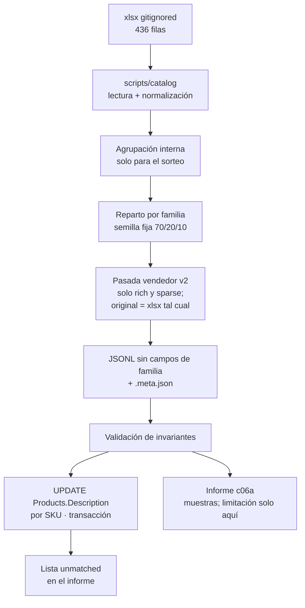

## Context

La ficha C06a del plan pide tres cosas a la vez: ingestar los 436 productos reales, asistir su redacción sin falsear identidad, y dejar un JSONL versionado que C09 y C10 puedan consumir **antes** de que existan los 900–1.200 sintéticos de C06b. El export llegó el 2026-08-17 con tamaño suficiente y texto casi nulo (~38 caracteres de media, 51 sin descripción, 0 fotos). Sobre ese input, las puertas de cobertura de tags de C09 son indemostrables.

El estado del repositorio al diseñar:

| Pieza | Estado |
|---|---|
| `data/catalog/real/product-JoiaBagur.xlsx` | Presente en local, **gitignored**. Columnas `SKU`, `Name`, `Description`, `Price`, `Collection` — las mismas que `ExcelImportService` |
| `data/catalog/real/backup-2026-08-17-catalogo-corregido.sql` | Solo esquema, sin `COPY` de filas |
| `data/catalog/real/generated/` | **Ausente** al abrir el change. `.gitignore` ignora todo `data/catalog/real/*` salvo `.gitkeep` |
| `scripts/catalog/` | Pipeline offline (C06a) |
| `ai-service/src/jbg_ai/data/` | **Ausente** (zona que la ficha original adjudicaba) |
| `ai.product_document.data_origin` | Existe (C05). **`text_provenance` no** |
| `public."Products"` | Sin columna de procedencia. `Description` es `varchar(1000)` |
| Postgres Docker | `jpv-pv-postgres`, host **5433**, BD `joiabagur_pv` |
| `ai-service/openapi.json` | Congelado. Si el snapshot se pone rojo, el change se ha salido de alcance |
| C01 | Archivado. Único prerrequisito |

**Desviación acordada (2026-08-22)** respecto a la ficha del plan. La ficha incluye cliente LLM embebido, migración Alembic de `text_provenance` y tests de generador con LLM fake. El resultado exigido —corpus realista, dos ejes de procedencia, reparto §8.4, invariantes de identidad— se obtiene por otro camino, documentado aquí como decisión, no como olvido:

| Ficha original | Este change |
|---|---|
| Cliente LLM en `ai-service`, `prompts/`, settings `LLM_*` | Pasada asistida **offline**; criterios versionados en el informe (`catalog-assist/v2`); cero llamadas en runtime/tests |
| Generadores en `ai-service/src/jbg_ai/data/generators/` | Scripts en `scripts/catalog/` |
| Migración `text_provenance` en `ai.product_document` | **C13** |
| Tests con LLM fake | Tests de scripts deterministas + validación del JSONL |
| Solo JSONL | JSONL **commiteado** + sidecar + informe + **ingesta local** en `public."Products"` |
| Semilla de familias en el JSONL | **No se emite.** Agrupación solo interna para el sorteo de calidad |

**Revisión 2026-08-22 (pasada v2).** La primera redacción (`catalog-assist/v1`) parafraseaba la ficha y declaraba en el propio texto lo que no se sabía («la ficha de origen indica…», «no se cuentan piedras», «el catálogo no incluye fotografías»). Eso no sirve a C09: no es una descripción de producto. v2 escribe **como un vendedor con la pieza delante**.

**Dependientes que condicionan el diseño:**

| Change | Qué necesita | Consecuencia |
|---|---|---|
| **C09** 🔴 | Texto de catálogo utilizable y un estrato `ai_assisted` | El ~10 % `original` (texto del comerciante, sin reescribir) es **a propósito**; el JSONL no debe llevar metadatos de familia |
| **C10** | SKUs reales con precio y colección intactos | La asistencia no toca identidad |
| **C13** | Ambos ejes de procedencia al indexar | C06a los deja en JSONL; C13 los materializa en `ai.*` |
| **C18** | Semilla de agrupación de variantes | **Fuera de este JSONL.** C18 no lee `family_seed` de C06a |
| **C06b** | Distribuciones del real (precio, SKU), **excepto** longitud de descripción | El JSONL es el ancla de calibración; el reparto 70/20/10 se **declara**, no se hereda |



## Goals / Non-Goals

**Goals:**

- Un corpus de **436 líneas** con `data_origin: real`, SKU único, e identidad (SKU, nombre, precio, colección) idéntica al xlsx.
- Reparto de calidad **por familia de variantes** (interno), determinista, dentro de ~70 `rich` / ~20 `sparse` / ~10 `original` ±3 pp por producto.
- Texto asistido **de vendedor**: natural, como si se viera la pieza; conservando Name/Description originales; sin inventar piedras ni accesorios; sin mencionar fotos ni lagunas.
- JSONL **sin** `variant_group_key`, `variant_label` ni `family_seed`.
- Ingesta local que deja el catálogo .NET con descripciones nuevas **sin** mutar identidad.
- Trazabilidad: misma `seed` + misma `generator_version` → mismos tiers; el JSONL commiteado es la fuente de las descripciones.
- Documentar en este fichero por qué no se siguió la ficha literal.

**Non-Goals:**

- Cliente LLM, `prompts/` como servicio, settings `LLM_*`, o cualquier dependencia nueva en `ai-service/pyproject.toml`.
- Migración Alembic / columna `text_provenance` en `ai.product_document` (C13) o en `Product` .NET.
- C06b, C08, C09, C10, C18. Este change **no** emite semilla de familias.
- API, frontend, OpenAPI, RDS, producción.
- Perfiles IA estructurados (`piece_type`, `materials[]`): eso es extracción (C09) y persistencia (C08).
- Publicar en el JSONL conteos o claves de agrupación.

## Decisions

### 1 · La ficha se desvía a propósito: el resultado es el contrato, el runtime LLM no

**Decisión:** producir el texto en **una pasada asistida** (agente de implementación + criterios `catalog-assist/v2`), versionar el JSONL, y no añadir ningún cliente LLM al servicio.

**Por qué.** El valor de C06a para la ruta crítica es el **corpus**, no un generador reejecutable contra un proveedor. Meter LLM en `ai-service` ahora obliga a settings, prompts, fakes de pytest y una superficie que C09 va a volver a tocar. El diseño §8.2 ya separa «LLM → lo textual» de «código con semilla → lo relacional»; esa separación se respeta **en el producto del change**, no en un servicio que nadie llama en runtime.

**Alternativas descartadas.** *(a) Seguir la ficha al pie:* cliente en `jbg_ai`, migración Alembic y tests con fake. Equivalente en resultado, más superficie, y adelanta a C13 una columna que solo cobra sentido al indexar. *(b) No asistir y dejar el texto del comerciante:* C09 construye el extractor sobre 38 caracteres y la puerta del estrato `ai_assisted` no tiene estrato.

### 2 · `text_provenance` vive en el JSONL (y el informe) hasta C13

Los dos ejes del §8.1.1 son independientes: un producto `real` puede llevar texto `merchant` o `ai_assisted`. En C06a esa distinción es **metadato de corpus**, no columna de `public."Products"` ni de `ai.product_document`.

| Capa | Cuándo |
|---|---|
| JSONL / `.meta.json` / informe | **C06a** |
| `public."Products"` | **Nunca** — .NET no es autoridad de procedencia de texto |
| `ai.product_document` | **C13**, al indexar |

**Por qué no ahora.** La frontera §6.3 (`public.*` es de .NET; `ai.*` es de Python) se rompe si Python escribe una columna de evaluación en `Products`, y se adelanta trabajo de C13 si se abre una migración Alembic solo para un campo que nadie lee todavía. El indexador es quien **copia** procedencia al esquema `ai`; hasta entonces el JSONL es la fuente.

### 3 · Scripts en `scripts/catalog/`, no en `jbg-ai`

**Decisión:** pipeline offline en la raíz del repo. Lectura xlsx, agrupación interna, reparto, validación e ingesta SQL. Dependencias mínimas (`openpyxl`, `psycopg`, `pytest`) en un `pyproject.toml` local de esa carpeta, **sin** contaminar `ai-service/pyproject.toml`.

**Por qué.** La zona de la ficha (`ai-service/src/jbg_ai/data/generators/`) existe para C06b, que sí es un generador de producto del servicio. C06a no arranca ningún proceso de `jbg-ai`. Meterlo ahí mezclaría un lote de datos con el runtime y haría que `uv sync` del servicio arrastrara `openpyxl` para siempre.

**C06b puede reutilizar** las funciones de agrupación y de ratios si le sirven; la copia, si ocurre, es de C06b.

### 4 · El JSONL se versiona; el xlsx no

El repositorio es público. El xlsx trae SKU, nombres y **precios reales**. El JSONL es el mismo derivado anonimizado que el plan ya autorizaba a publicar como `data_origin: real`.

Hoy `.gitignore` oculta todo `data/catalog/real/*`. Hay que **abrir una excepción** para `data/catalog/real/generated/` (JSONL + sidecar) sin levantar el xlsx ni el backup SQL.

**Por qué commitear.** C09 y C10 no pueden depender de un fichero que no está en git y de una pasada asistida que no es un comando puro. El artefacto commiteado **es** el corpus; los scripts sirven para regenerar tiers y para re-ingerir.

**Alternativa descartada:** generar on-demand en cada máquina. Exige el xlsx local y rehacer la pasada asistida; rompe determinismo de descripciones entre clones.

### 5 · La agrupación es interna; el JSONL no lleva semilla de familias

**Decisión:** la heurística de stem + sufijos de talla (y material solo si acompaña a una talla) sigue existiendo **solo** para que el sorteo de calidad sea por familia. El JSONL **prohíbe** `variant_group_key`, `variant_label` y `family_seed`.

**Por qué no emitirla.** C09 extrae sobre el texto. Un campo de agrupación en cada línea es una señal paralela que el pipeline posterior puede tratar como verdad de negocio o como feature. El usuario lo descartó porque contamina fases siguientes. C18 tiene su propio change; C07 ya tiene la entidad.

**Por qué no agrupar por `piece_type`.** El §8.4 lo prohíbe: cuatro tipos concentran el 78 % del catálogo; el sorteo de calidad sesgaría por tipo de pieza.

El sidecar **puede** anotar conteos de agrupación como traza del pipeline. Eso no entra en cada línea de producto.

### 6 · El sorteo de calidad es por familia, con semilla; `original` no borra texto

Los tres valores de `text_quality_tier` son **cómo se obtiene el texto**, no «cuán vacío queda el campo»:

| Tier | ~% | `text_provenance` | Qué se escribe en `description` |
|---|---|---|---|
| `rich` | 70 | `ai_assisted` | Pasada de vendedor, 3–5 frases, más inventiva |
| `sparse` | 20 | `ai_assisted` | Pasada de vendedor, 1–2 frases, más contenida |
| `original` | 10 | `merchant` | **La `Description` del xlsx, sin tocar.** Si venía vacía, sigue vacía; si decía «plata de ley», sigue diciendo «plata de ley». |

`empty` era el nombre anterior y **confundía**: se interpretó como «poner la descripción a `""`», y eso **borra** texto de comerciante que sí existía. Ese comportamiento queda **prohibido**. El grupo de control de C09 es «texto del comerciante, no reescrito», no «campo anulado».

```
hash(stem interno, seed) → bucket
  [0.00, 0.70)  rich      text_provenance = ai_assisted
  [0.70, 0.90)  sparse    text_provenance = ai_assisted
  [0.90, 1.00)  original  text_provenance = merchant
```

Todos los miembros del grupo interno heredan el **tier**. En `original`, cada SKU conserva **su propia** descripción de origen (no se copia la de un hermano ni se unifica a vacío). Los ratios se miden **por producto** y deben caer en ±3 pp respecto de 70/20/10. Semilla por defecto: `20260822`. `generator_version`: `c06a-assist/v2`.

Si el hash por familia deja los ratios de producto fuera de ventana, un rebalanceo determinista mueve familias enteras (las más pequeñas primero) hasta entrar. Sigue sin mezclar tiers dentro de un grupo.

**Por qué por familia.** Si una talla tiene texto rico y su hermana el original de tres palabras, el recuperador las separa por riqueza de texto, no por talla.

**Por qué el 10 % no se reescribe.** La puerta de C09 es ≥ 90 % de tags **sobre `ai_assisted`**. Meter asistencia también en ese estrato mediría la política de relleno, no el extractor. Dejar el texto del xlsx (corto, irregular, a veces en blanco) es el control honesto. **No** se «arregla» vaciándolo.

### 7 · La redacción es de vendedor, no de ficha técnica (`catalog-assist/v2`)

El agente se **imagina** la pieza como si la tuviera delante (un vendedor de joyería con el producto en la bandeja) y escribe lo que «ve». El texto resultante es una descripción de catálogo, no un comentario sobre el export. **Esto aplica solo a `rich` y `sparse`.** El tier `original` no pasa por esta redacción.

Criterios, publicados en el informe (no en un servicio):

1. **Voz.** Natural, de producto. Describe la pieza: tipo, motivo, metal, tamaño si consta, cómo se lleva o cómo se presenta. Nunca en segunda persona meta («si tuvieras la foto…»).
2. **Prohibido en el texto asistido.** Mencionar fotografía, foto, imagen, ficha de origen, export, que algo «no consta», que no se certifican acabados, que no se cuentan piedras, que el catálogo no incluye fotografías, o cualquier alusión a imaginar o a la ausencia de evidencia.
3. **No perder información (rich/sparse).** Todo lo que está en `Name` o en `Description` original debe reaparecer en el texto asistido, con redacción natural.
4. **No inventar piedras ni accesorios.** Si el nombre o la ficha no hablan de diamantes, perlas, cadenas añadidas, cierres, estuches o piedras concretas, el texto no los introduce. Un «erizo de mar» o una «caracola» **sí** se describen como forma de la pieza: eso ya está en el nombre.
5. **Inventiva permitida (sin contradecir 3–4).** Silueta, volumen, cómo cae o sienta, brillo del metal que ya consta, uso (oreja, dedo, cuello, muñeca) derivado del tipo de pieza. La banda de precio **modula el registro** pero no se escribe como etiqueta.
6. **Tiers.** `rich`: 3–5 frases, más inventiva. `sparse`: 1–2 frases. `original`: copia idéntica de la `Description` del xlsx; **no** se genera y **no** se vacía.
7. **Tope duro: 1000 caracteres** en cualquier línea (el original del xlsx ya cabe; el asistido también debe caber). El validador rechaza cualquier línea que lo rebase **antes** de ingerir.

La pasada se hace **una vez** (o con `--regenerate-text` al cambiar de v1 a v2). El JSONL commiteado es la fuente.

### 8 · La ingesta toca solo `Description`, por SKU, en transacción

```text
Host: localhost:5433
Database: joiabagur_pv
Match: "SKU" = jsonl.sku
SET:   "Description" = jsonl.description, "UpdatedAt" = now()
NEVER: "Id", "SKU", "Name", "Price", "CollectionId"
```

Flujo:

1. Snapshot previo recomendado (CSV `SKU, Name, Description` o `pg_dump` parcial de `"Products"`).
2. Cargar JSONL. Validar invariantes contra el xlsx (si está) o contra el propio JSONL vs. filas actuales de BD para `Name`/`Price`/`SKU`.
3. `BEGIN`. Para cada SKU coincidente, `UPDATE` de `Description` + `UpdatedAt`. Relación de filas afectadas ≠ 1 → abortar.
4. Releer `Price`, `CollectionId`, `Name`, `SKU`, `Id` de las filas tocadas. Cualquier diferencia respecto al snapshot previo (salvo `Description`/`UpdatedAt`) → `ROLLBACK`.
5. `COMMIT`. SKUs del JSONL sin fila → lista *unmatched* en el informe, **sin** insertar productos.

Credenciales **solo** por entorno (`JPV_PGHOST`, `JPV_PGPORT`, `JPV_PGDATABASE`, `JPV_PGUSER`, `JPV_PGPASSWORD`), nunca en el repo. El compose local usa `postgres` / `password`; eso no se commitea en scripts.

Python escribe en `public` **desde un script de desarrollo**, no desde `jbg-ai`. La frontera §6.3 sigue intacta para el servicio: el rol de `jbg-ai` no gana `UPDATE` sobre `"Products"`.

```mermaid
sequenceDiagram
  participant Op as Operador
  participant S as scripts/catalog
  participant X as xlsx local
  participant J as JSONL git
  participant PG as Postgres :5433

  Op->>S: generar tiers + pasada vendedor
  S->>X: leer 436 filas
  S->>S: grupos internos + hash(seed)
  Op->>S: redactar rich/sparse; original = Description del xlsx
  S->>J: escribir JSONL (sin familia) + .meta.json
  Op->>S: ingerir
  S->>J: leer corpus
  S->>PG: BEGIN
  S->>PG: UPDATE Description por SKU
  S->>PG: releer invariantes
  alt invariante roto
    S->>PG: ROLLBACK
  else ok
    S->>PG: COMMIT
    S->>Op: unmatched + informe
  end
```

### 9 · Tests sin el xlsx real y sin red

El xlsx no está en git; CI y un clon fresco no lo tienen. Los tests de `scripts/catalog/` usan **fixtures** (xlsx o CSV mínimo: una familia de 3 tallas, unarios, un SKU unmatched, una descripción de 1001 caracteres). Afirman:

- unicidad de SKU y `data_origin: real`
- inmutabilidad de identidad
- el JSONL **no** contiene `variant_group_key`, `variant_label` ni `family_seed`
- internamente, un grupo de variantes no mezcla tiers
- `rich`/`sparse` → `ai_assisted` y texto generado; `original` → `merchant` y `description` **igual** a la del export
- `rich`/`sparse` no mencionan foto/ficha/laguna; conservan material/motivo del original
- determinismo de tiers a semilla fija
- el UPDATE de fixture no altera `Price`/`Name`/`CollectionId`
- rechazo de descripción &gt; 1000 caracteres
- **cero** sockets a proveedores (mismo espíritu que la regla transversal del plan §1)

Los tests del JSONL **real** (436 líneas, ratios ±3 pp, muestras de vendedor) son validadores de apply cuando el xlsx está presente.

### 10 · El informe declara la limitación; el producto no

`Documentos/Proyecto Final AIEng/informes/c06a-catalog-enrichment-report.md` incluye, como mínimo: ratios por tier y por `text_provenance`, SKUs unmatched, muestras (5 `rich`, 3 `sparse` y 2 `original`) **antes/después**. En `original`, antes y después deben coincidir con el xlsx. Un párrafo **solo en el informe**: no hay fotos de producto; el texto `rich`/`sparse` se redactó como lo haría un vendedor con la pieza delante; lo visual no verificable es plausible, no certificado.

Las muestras del informe deben ser descripciones de producto, no el estilo v1 (meta-comentario sobre la ficha).

## Risks / Trade-offs

- **[Riesgo] La inventiva visual se pasa de rosca e inventa piedras o accesorios.** → Mitigación: criterio 4 de v2; validador que rechaza tokens de piedra/accesorio no presentes en name+description original; revisión de muestras en el informe.
- **[Riesgo] El texto sigue oliendo a plantilla** (v1). → Mitigación: voz de vendedor; prohibición explícita de las frases v1; `rich` vs `sparse` por inventiva, no por disclaimers.
- **[Riesgo] Descripción rica > 1000 caracteres revienta la ingesta con `22001`.** → Mitigación: validador previo al `UPDATE`; test de fixture a 1001 caracteres.
- **[Riesgo] La BD local no tiene los 436 SKUs.** → Mitigación: unmatched en informe; la ingesta no inserta; el JSONL sigue siendo válido para C09.
- **[Riesgo] Re-ejecutar la pasada produce texto distinto y ensucia el diff.** → Mitigación: el JSONL commiteado es la fuente; regenerar descripciones exige `--regenerate-text`.
- **[Riesgo] Alguien commitea el xlsx al abrir la excepción de `generated/`.** → Mitigación: excepción **solo** de `data/catalog/real/generated/`; revisar `git status` antes del commit del corpus.
- **[Trade-off] Sin cliente LLM no hay `model` en el sidecar.** Se emite `model: null` y `generator_version: c06a-assist/v2`.
- **[Trade-off] Python de desarrollo escribe en `public."Products"`.** Aceptable porque no es el proceso `jbg-ai`.
- **[Trade-off] El ~10 % `original` deja el texto del comerciante (a menudo pobre) visible en local.** Es el control que C09 necesita. No se vacía ni se reescribe en un follow-up de C06a.
- **[Trade-off] C18 no recibe semilla de este JSONL.** Aceptado: contaminaba C09. C18 agrupará por su lado.

## Migration Plan

No hay migración de esquema. El plan es de **datos locales**:

1. Asegurar Postgres Docker en 5433 y que `"Products"` tenga filas (import Excel .NET si hace falta).
2. Generar JSONL v2 + sidecar; validar invariantes, tope de 1000, ausencia de campos de familia, voz de vendedor en `rich`/`sparse`, y `original` idéntico al xlsx.
3. Snapshot de `"Products"` (`SKU, Name, Description, Price, CollectionId`) si aún no existe.
4. Ingesta en una transacción. Rollback si invariante roto.
5. Commitear `generated/` e informe. El xlsx no entra.
6. **Rollback de datos:** restaurar el snapshot. El JSONL se queda; es el corpus, no el estado de la BD.
7. **Nada contra RDS.**

## Open Questions

Ninguna bloqueante.

| # | Tema residual | Opción por defecto |
|---|---|---|
| 1 | Valor concreto de `seed` | `20260822` |
| 2 | ¿Copiar utilidades de agrupación a `jbg_ai.data` en C06b? | **No en C06a.** Lo decide C06b |
| 3 | ¿Rellenar `product_id` en el JSONL durante la ingesta? | **Opcional.** El JSONL es válido sin el campo |
| 4 | `generator_version` | `c06a-assist/v2` (rompe el contrato de voz de v1) |
