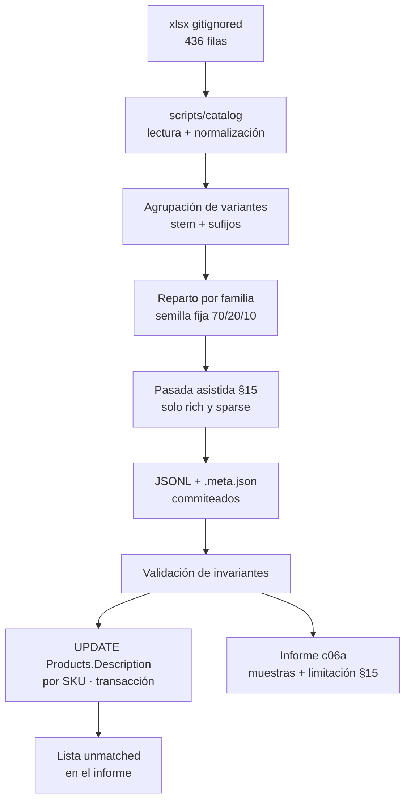
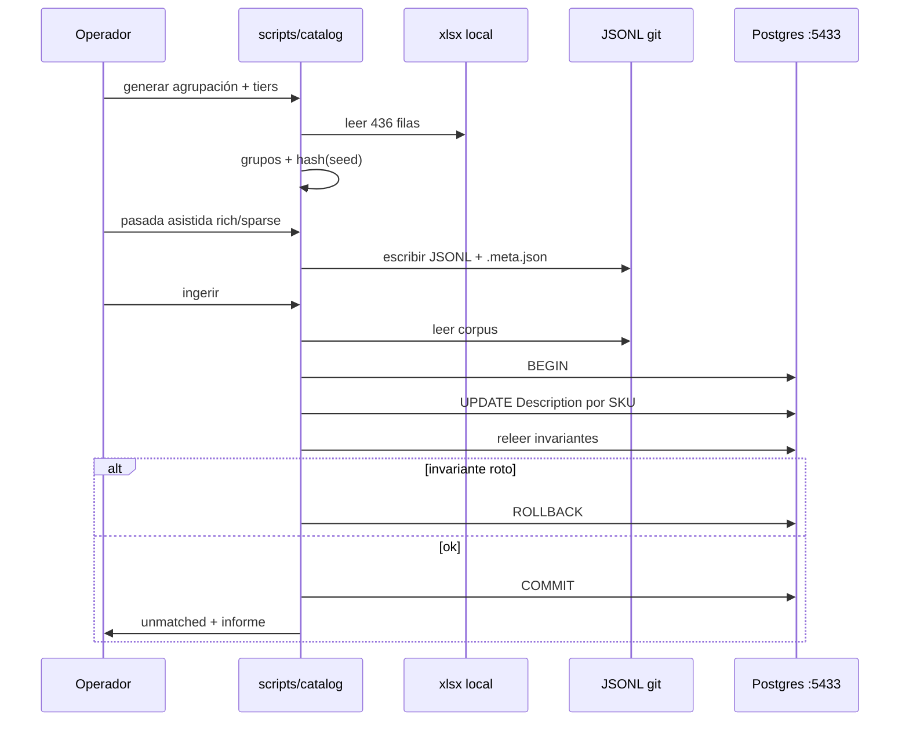

## Context

La ficha C06a del plan pide tres cosas a la vez: ingestar los 436 productos reales, asistir su redacción sin falsear identidad, y dejar un JSONL versionado que C09 y C10 puedan consumir **antes** de que existan los 900–1.200 sintéticos de C06b. El export llegó el 2026-08-17 con tamaño suficiente y texto casi nulo (~38 caracteres de media, 51 sin descripción, 0 fotos). Sobre ese input, las puertas de cobertura de tags de C09 son indemostrables.

El estado del repositorio al diseñar:

| Pieza | Estado |
|---|---|
| `data/catalog/real/product-JoiaBagur.xlsx` | Presente en local, **gitignored**. Columnas `SKU`, `Name`, `Description`, `Price`, `Collection` — las mismas que `ExcelImportService` |
| `data/catalog/real/backup-2026-08-17-catalogo-corregido.sql` | Solo esquema, sin `COPY` de filas |
| `data/catalog/real/generated/` | **Ausente**. `.gitignore` ignora todo `data/catalog/real/*` salvo `.gitkeep` |
| `scripts/catalog/` | **Ausente** |
| `ai-service/src/jbg_ai/data/` | **Ausente** (zona que la ficha original adjudicaba) |
| `ai.product_document.data_origin` | Existe (C05). **`text_provenance` no** |
| `public."Products"` | Sin columna de procedencia. `Description` es `varchar(1000)` |
| Postgres Docker | `jpv-pv-postgres`, host **5433**, BD `joiabagur_pv` |
| `ai-service/openapi.json` | Congelado. Si el snapshot se pone rojo, el change se ha salido de alcance |
| C01 | Archivado. Único prerrequisito |

**Desviación acordada (2026-08-22)** respecto a la ficha del plan. La ficha incluye cliente LLM embebido, migración Alembic de `text_provenance` y tests de generador con LLM fake. El resultado exigido —corpus realista, dos ejes de procedencia, reparto §8.4, invariantes de identidad— se obtiene por otro camino, documentado aquí como decisión, no como olvido:

| Ficha original | Este change |
|---|---|
| Cliente LLM en `ai-service`, `prompts/`, settings `LLM_*` | Pasada asistida **offline**; criterios versionados en el informe (`catalog-assist/v1`); cero llamadas en runtime/tests |
| Generadores en `ai-service/src/jbg_ai/data/generators/` | Scripts en `scripts/catalog/` |
| Migración `text_provenance` en `ai.product_document` | **C13** |
| Tests con LLM fake | Tests de scripts deterministas + validación del JSONL |
| Solo JSONL | JSONL **commiteado** + sidecar + informe + **ingesta local** en `public."Products"` |

**Dependientes que condicionan el diseño:**

| Change | Qué necesita | Consecuencia |
|---|---|---|
| **C09** 🔴 | Texto utilizable y un estrato `ai_assisted` sobre el que la puerta ≥ 90 % de tags sea alcanzable | El ~10 % vacío es **a propósito**; no se puede «arreglar» llenándolo |
| **C10** | SKUs reales con precio y colección intactos | La asistencia no toca identidad |
| **C13** | Ambos ejes de procedencia al indexar | C06a los deja en JSONL; C13 los materializa en `ai.*` |
| **C18** | Semilla de agrupación de variantes | JSONL emite `family_seed`; no crea filas `ProductFamily` |
| **C06b** | Distribuciones del real (precio, SKU, familias), **excepto** longitud de descripción | El JSONL es el ancla de calibración; el reparto 70/20/10 se **declara**, no se hereda |



## Goals / Non-Goals

**Goals:**

- Un corpus de **436 líneas** con `data_origin: real`, SKU único, e identidad (SKU, nombre, precio, colección) idéntica al xlsx.
- Reparto de calidad **por familia de variantes**, determinista, dentro de ~70/20/10 ±3 pp por producto.
- Texto asistido que C09 pueda extraer, sin afirmar lo que las fotos no pueden verificar.
- Ingesta local que deja el catálogo .NET con descripciones nuevas **sin** mutar identidad.
- Trazabilidad regenerable: misma `seed` + misma `generator_version` → mismos grupos y tiers; el JSONL commiteado es la fuente de las descripciones.
- Documentar en este fichero, de forma que sobreviva al archive, por qué no se siguió la ficha literal.

**Non-Goals:**

- Cliente LLM, `prompts/` como servicio, settings `LLM_*`, o cualquier dependencia nueva en `ai-service/pyproject.toml`.
- Migración Alembic / columna `text_provenance` en `ai.product_document` (C13) o en `Product` .NET.
- C06b, C08, C09, C10, C18. Este change **emite** la semilla de familias; no las persiste.
- API, frontend, OpenAPI, RDS, producción.
- Perfiles IA estructurados (`piece_type`, `materials[]`): eso es extracción (C09) y persistencia (C08).
- Cifra exacta de grupos de variantes: ~403/~23 es referencia de exploración, no un test de igualdad.

## Decisions

### 1 · La ficha se desvía a propósito: el resultado es el contrato, el runtime LLM no

**Decisión:** producir el texto en **una pasada asistida** (agente de implementación + reglas deterministas + criterios §15), versionar el JSONL, y no añadir ningún cliente LLM al servicio.

**Por qué.** El valor de C06a para la ruta crítica es el **corpus**, no un generador reejecutable contra un proveedor. Meter LLM en `ai-service` ahora obliga a settings, prompts, fakes de pytest y una superficie que C09 va a volver a tocar. El diseño §8.2 ya separa «LLM → lo textual» de «código con semilla → lo relacional»; esa separación se respeta **en el producto del change**, no en un servicio que nadie llama en runtime.

**Alternativas descartadas.** *(a) Seguir la ficha al pie:* cliente en `jbg_ai`, migración Alembic y tests con fake. Equivalente en resultado, más superficie, y adelanta a C13 una columna que solo cobra sentido al indexar. *(b) No asistir y dejar el texto del comerciante:* C09 construye el extractor sobre 38 caracteres y la puerta del estrato `ai_assisted` no tiene estrato.

### 2 · `text_provenance` vive en el JSONL (y el informe) hasta C13

Los dos ejes del §8.1.1 son independientes: un producto `real` puede llevar texto `merchant` o `ai_assisted`. En C06a esa distinción es **metadato de corpus**, no columna de `public."Products"` ni de `ai.product_document`.

| Capa | Cuándo |
|---|---|
| JSONL / `.meta.json` / informe | **C06a** |
| `public."Products"` | **Nunca** — .NET no es autoridad de procedencia de texto |
| `ai.product_document` | **C13**, al indexar |

**Por qué no ahora.** La frontera §6.3 (`public.*` es de .NET; `ai.*` es de Python) se rompe si Python escribe una columna de evaluación en `Products`, y se adelanta trabajo de C13 si se abre una migración Alembic solo para un campo que nadie lee todavía. El indexador es quien **copia** procedencia al esquema `ai`; hasta entonces el JSONL es la fuente.

### 3 · Scripts en `scripts/catalog/`, no en `jbg-ai`

**Decisión:** pipeline offline en la raíz del repo. Lectura xlsx, agrupación, reparto, validación e ingesta SQL. Dependencias mínimas (`openpyxl`, `psycopg`, `pytest`) en un `pyproject.toml` local de esa carpeta, **sin** contaminar `ai-service/pyproject.toml`.

**Por qué.** La zona de la ficha (`ai-service/src/jbg_ai/data/generators/`) existe para C06b, que sí es un generador de producto del servicio. C06a no arranca ningún proceso de `jbg-ai`. Meterlo ahí mezclaría un lote de datos con el runtime y haría que `uv sync` del servicio arrastrara `openpyxl` para siempre.

**C06b puede reutilizar** las funciones de agrupación y de ratios si le sirven; la copia, si ocurre, es de C06b.

### 4 · El JSONL se versiona; el xlsx no

El repositorio es público. El xlsx trae SKU, nombres y **precios reales**. El JSONL es el mismo derivado anonimizado que el plan ya autorizaba a publicar como `data_origin: real`.

Hoy `.gitignore` oculta todo `data/catalog/real/*`. Hay que **abrir una excepción** para `data/catalog/real/generated/` (JSONL + sidecar) sin levantar el xlsx ni el backup SQL.

**Por qué commitear.** C09 y C10 no pueden depender de un fichero que no está en git y de una pasada asistida que no es un comando puro. El artefacto commiteado **es** el corpus; los scripts sirven para regenerar agrupación/tiers y para re-ingerir.

**Alternativa descartada:** generar on-demand en cada máquina. Exige el xlsx local y rehacer la pasada asistida; rompe determinismo de descripciones entre clones.

### 5 · Agrupación por stem de nombre, con tolerancia de conteo

**Decisión:** heurística determinista, no modelo:

1. Normalizar nombre (minúsculas, sin acentos, espacios colapsados).
2. Extraer sufijo de variante si existe: tallas (`s`/`m`/`l`/`xl`, numéricas, `mm`) y tokens finales de material/color habituales.
3. El resto es el `variant_group_key` (slug). Productos con el mismo stem forman familia.
4. `variant_label` es el sufijo extraído, o nulo si el producto es unario.
5. `family_seed.member_skus` lista los SKUs del grupo, ordenados.

La exploración dio ~403 grupos y ~23 multi-variante. **No es un umbral de test.** El informe publica los conteos reales. Si el spike de apply produce un resultado **patológicamente** distinto —p. ej. un solo grupo, o casi 436 grupos con 0 multi-variante cuando la inspección manual ve tallas— se ajusta la heurística antes de commitear, no se fuerza el número.

**Por qué no crear `ProductFamily`.** C07 ya tiene la entidad. C18 es quien aprueba sugerencias. Escribir filas ahora crearía una segunda autoridad y mezclaría semilla con dato de negocio.

**Por qué no agrupar por `piece_type`.** El §8.4 lo prohíbe: cuatro tipos concentran el 78 % del catálogo; el sorteo de calidad sesgaría por tipo de pieza, no por familia confundible.

### 6 · El sorteo de calidad es por familia, con semilla, y el 10 % vacío es ruido dirigido

```
hash(variant_group_key, seed) → bucket
  [0.00, 0.70)  rich    text_provenance = ai_assisted   3–5 frases
  [0.70, 0.90)  sparse  text_provenance = ai_assisted   1–2 frases
  [0.90, 1.00)  empty   text_provenance = merchant      descripción vacía
```

Todos los miembros del grupo heredan el bucket. Los ratios se miden **por producto** (no por familia) y deben caer en ±3 pp respecto de 70/20/10. Semilla por defecto: `20260822`. `generator_version`: `c06a-assist/v1`.

**Por qué por familia.** Si una talla tiene texto rico y su hermana ninguno, el recuperador las separa por riqueza de texto, no por talla: exactamente lo que la categoría crítica del golden set pretende medir, contaminada.

**Por qué el 10 % se vacía de verdad.** La puerta de C09 es ≥ 90 % de tags **sobre `ai_assisted`**. Llenar el vacío subiría el techo global y mediría la política de ruido, no el extractor. `merchant` + descripción vacía es el grupo de control honesto que el README debe declarar.

### 7 · La redacción asistida está acotada por evidencia y por `varchar(1000)`

Criterios equivalentes al prompt `catalog-assist/v1`, publicados en el informe (no en un servicio):

- Expandir solo lo que consta en nombre, descripción original o material **implícito en el nombre**.
- No afirmar conteos de piedras, acabados verificados ni detalles que exijan foto.
- Acotar el registro por **banda de precio operativa** (no es el vocabulario de C09): *entrada* &lt; 80 €, *media* 80–250 €, *alta* &gt; 250 €. Sin evidencia, no se escribe «diamante» en un producto de 40 €.
- Tiers: rich = 3–5 frases; sparse = 1–2; empty = `null` o `""`.
- **Tope duro: 1000 caracteres.** `Product.Description` es `varchar(1000)`. El validador del JSONL rechaza cualquier línea que lo rebase **antes** de ingerir. Es el mismo 22001 que `CLAUDE.md` documenta para teléfonos: aquí el riesgo es una descripción rica que no cabe.

La pasada se hace **una vez**. El JSONL commiteado es la fuente. Re-ejecutar agrupación/tiers con la misma semilla no reescribe descripciones ya asistidas salvo que el operador lo pida explícitamente (flag de regeneración).

### 8 · La ingesta toca solo `Description`, por SKU, en transacción

```text
Host: localhost:5433
Database: joiabagur_pv
Match: "SKU" = jsonl.sku
SET:   "Description" = jsonl.description, "UpdatedAt" = now()
NEVER: "Id", "SKU", "Name", "Price", "CollectionId"
```

Flujo:

1. Snapshot previo recomendado (CSV `SKU, Name, Description` o `pg_dump` parcial de `"Products"`).
2. Cargar JSONL. Validar invariantes contra el xlsx (si está) o contra el propio JSONL vs. filas actuales de BD para `Name`/`Price`/`SKU`.
3. `BEGIN`. Para cada SKU coincidente, `UPDATE` de `Description` + `UpdatedAt`. Relación de filas afectadas ≠ 1 → abortar.
4. Releer `Price`, `CollectionId`, `Name`, `SKU`, `Id` de las filas tocadas. Cualquier diferencia respecto al snapshot previo (salvo `Description`/`UpdatedAt`) → `ROLLBACK`.
5. `COMMIT`. SKUs del JSONL sin fila → lista *unmatched* en el informe, **sin** insertar productos.

Credenciales **solo** por entorno (`JPV_PGHOST`, `JPV_PGPORT`, `JPV_PGDATABASE`, `JPV_PGUSER`, `JPV_PGPASSWORD`), nunca en el repo. El compose local usa `postgres` / `password`; eso no se commitea en scripts.

Python escribe en `public` **desde un script de desarrollo**, no desde `jbg-ai`. La frontera §6.3 sigue intacta para el servicio: el rol de `jbg-ai` no gana `UPDATE` sobre `"Products"`.



### 9 · Tests sin el xlsx real y sin red

El xlsx no está en git; CI y un clon fresco no lo tienen. Los tests de `scripts/catalog/` usan **fixtures** (xlsx o CSV mínimo: una familia de 3 tallas, unarios, un SKU unmatched, una descripción de 1001 caracteres). Afirman:

- unicidad de SKU y `data_origin: real`
- inmutabilidad de identidad
- un `variant_group_key` no mezcla tiers
- `rich`/`sparse` → `ai_assisted`; `empty` → `merchant` y texto vacío
- determinismo de agrupación y tiers a semilla fija
- el UPDATE de fixture no altera `Price`/`Name`/`CollectionId`
- rechazo de descripción &gt; 1000 caracteres
- **cero** sockets a proveedores (mismo espíritu que la regla transversal del plan §1)

Los tests del JSONL **real** (436 líneas, ratios ±3 pp, muestras §15) son validadores que se ejecutan en apply cuando el xlsx está presente; no son la suite que tiene que pasar en un árbol sin datos.

### 10 · El informe es el sitio donde se declara la limitación §15

`Documentos/Proyecto Final AIEng/informes/c06a-catalog-enrichment-report.md` incluye, como mínimo: conteos de agrupación, ratios por tier y por `text_provenance`, SKUs unmatched, muestras (5 rich, 3 sparse, 2 empty) **antes/después**, y un párrafo explícito: el texto **simula** un reconocimiento multimodal que no existe; 0 fotos; atributos no derivables son plausibles, no verificados; la afirmación defendible es «catálogo **realista**», no «real tal cual».

Sin ese párrafo, C24 no puede medir el delta «con asistencia − sin asistencia» y el README del proyecto miente.

## Risks / Trade-offs

- **[Riesgo] La heurística de agrupación parte familias reales o fusiona piezas distintas.** → Mitigación: tolerancia de conteo + inspección de las ~23 multi-variante en el informe; ajuste de sufijos en el spike de apply **antes** de commitear. C18 puede corregir familias; este change no las persiste.
- **[Riesgo] Descripción rica > 1000 caracteres revienta la ingesta con `22001`.** → Mitigación: validador previo al `UPDATE`; criterio de redacción con tope; test de fixture a 1001 caracteres.
- **[Riesgo] La BD local no tiene los 436 SKUs** (backup solo esquema; hay que haber importado el xlsx vía .NET). → Mitigación: unmatched en informe; la ingesta no inserta; el JSONL sigue siendo válido para C09 aunque la BD esté vacía.
- **[Riesgo] Re-ejecutar la pasada asistida produce texto distinto y ensucia el diff.** → Mitigación: el JSONL commiteado es la fuente; regenerar descripciones exige flag explícito; agrupación/tiers sí son reproducibles por semilla.
- **[Riesgo] Alguien commitea el xlsx al abrir la excepción de `generated/`.** → Mitigación: excepción **solo** de `data/catalog/real/generated/`; el patrón `data/catalog/real/*` sigue ocultando el resto; revisar `git status` antes del commit del corpus.
- **[Trade-off] Sin cliente LLM no hay `model` en el sidecar.** El §8.5 pide `generator_version`, `seed`, `model`, `generated_at`. Se emite `model: null` (o se omite) y se declara `generator_version: c06a-assist/v1`. Honesto frente a fingir un modelo.
- **[Trade-off] Python de desarrollo escribe en `public."Products"`.** Aceptable porque no es el proceso `jbg-ai` ni su rol de BD. El servicio sigue sin SELECT/UPDATE sobre `public`.
- **[Trade-off] El 10 % vacío «empeora» el catálogo visible en local.** Es el ruido que C09 y el golden set necesitan. No se «arregla» en un follow-up de C06a.

## Migration Plan

No hay migración de esquema. El plan es de **datos locales**:

1. Asegurar Postgres Docker en 5433 y que `"Products"` tenga filas (import Excel .NET si hace falta).
2. Generar JSONL + sidecar; validar invariantes y tope de 1000.
3. Snapshot de `"Products"` (`SKU, Name, Description, Price, CollectionId`).
4. Ingesta en una transacción. Rollback si invariante roto.
5. Commitear `generated/` e informe. El xlsx no entra.
6. **Rollback de datos:** restaurar el snapshot. El JSONL se queda; es el corpus, no el estado de la BD.
7. **Nada contra RDS.**

## Open Questions

Ninguna bloqueante: las seis del ticket están cerradas (tolerancia de agrupación, JSONL en git, migración en C13, solo `Description`, scripts en `scripts/catalog/`, `product_id` por lookup de SKU).

| # | Tema residual | Opción por defecto |
|---|---|---|
| 1 | Valor concreto de `seed` | `20260822` |
| 2 | ¿Copiar utilidades de agrupación a `jbg_ai.data` en C06b? | **No en C06a.** Lo decide C06b |
| 3 | ¿Rellenar `product_id` en el JSONL durante la ingesta? | **Opcional.** El lookup es de la ingesta; el campo puede añadirse en una segunda escritura del JSONL si resulta útil a C09, sin ser requisito de aceptación |
