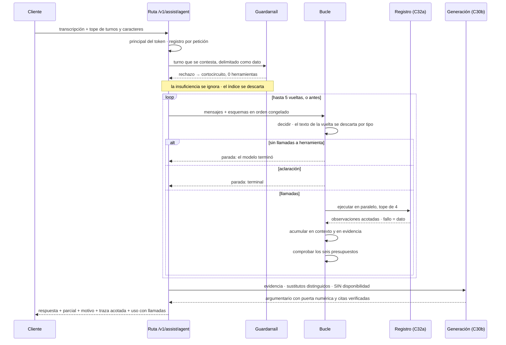

## Context

`ai-service/src/jbg_ai/assist/` llega a este change con **el instrumento completo y sin nadie que
decida**. C30a puso la estructura y los avisos por reglas; C30b el argumentario con su puerta
numérica, su verificación de citas y su reparación única; C31 el enrutador de intención con dos
rechazos distintos y la repregunta determinista; y C32a las seis herramientas, su registro, los
esquemas de *function calling* y el invariante de solo-lectura comprobado por introspección.

Éste es el change de la **capa de decisión**, la mitad cara del corte del 2026-09-20. De las cuatro
cosas que el Proyecto Final evalúa de una capa agéntica —**el bucle, el presupuesto duro, el
invariante de solo-lectura y el `partial: true`**— C32a entregó la tercera. Aquí van las otras tres.

**El punto de partida verificado contra el árbol** es que el bucle tiene dónde apoyarse y a la vez
le falta la pieza que nadie contó: `build_registry()`, `registry.schemas()` en orden congelado,
`registry.invoke()` que no lanza nunca y `registry.embedding_calls` existen y están en verde, pero
**no existe ningún puerto de *function calling***. `AssistLlm.generate()` está fijado a
`response_format=AssistPitch` y `RouterLlm.classify()` a `RouteDecision`: los dos producen un objeto
declarado, y un bucle necesita lo contrario, llamadas a herramienta sobre un `tools` abierto.

Cinco restricciones gobiernan el resto:

- **El §6.4 declara 5 s para `/v1/assist`**, y el peor caso de un bucle de cinco vueltas es
  **15-20 s**. Los dos no caben en la misma ruta.
- **El §11.4 pide la ablación** *pipeline contra agente, mismo golden set, mismas tools*. Desaparece
  si el bucle sustituye al pipeline en vez de convivir con él.
- **El §9.2 descarta LangGraph por escrito**: *«no hay ramificación con estado ni reanudación que lo
  justifique»*. El punto de migración queda identificado.
- **La propiedad «nada se persiste»** que C30b y C31 dejaron con test, que un almacén de sesión
  rompería de frente.
- **El pool de conexiones es 5 sin overflow**, y `SqlAlchemyProductSearch` abre un `session_scope`
  por método. El paralelismo de una vuelta se mide contra eso.

## Goals / Non-Goals

**Goals:**

- Que el bucle sea **una pieza de control de flujo legible**, con cada punto de decisión explícito y
  testeable por separado: cuántos pasos, qué se hace cuando una tool falla, qué se devuelve cuando no
  converge.
- Que **los seis presupuestos sean observables y aserciones en ejecución**, no intenciones, y que los
  dos que no pueden fijarse por juicio se fijen **por medición**.
- Que `/v1/assist/sale` siga siendo **la fila determinista de la ablación**, idéntica campo a campo y
  techo a techo.
- Que el multi-turno funcione **sin que el servicio guarde nada**, y que cada turno —incluidos los
  que el cliente atribuye al asistente— viaje como **dato delimitado** y no como instrucción.
- Que la **evaluación del agente nazca limpia**: ningún prompt de este change se itera contra el
  golden set ni contra escenarios de evaluación.
- Que el **sobrecoste de la autonomía se publique medido y relativo al pipeline**, no afirmado.

**Non-Goals:**

- **No** se evalúa la calidad del agente. Los 20-25 escenarios multi-turno, los adversarios y los de
  inyección sistemáticos son del change de evaluación.
- **No** hay consumidor .NET ni pantalla. La política de *timeout* y de circuito de la ruta nueva
  queda identificada y no hecha.
- **No** hay *streaming* ni respuesta en dos fases. Los 15-20 s síncronos se declaran como
  limitación.
- **No** hay almacén de sesión, *checkpointer* ni framework de orquestación.
- **No** se compacta ni se resume el contexto acumulado: se **mide** su crecimiento y se declara si
  hace falta doblarlo.
- **No** se construye el endpoint .NET de disponibilidad puntual, que sigue acotado y no hecho.

## Decisions

### D-1 · Ruta propia, y por medición

`POST /v1/assist/agent`. `/v1/assist/sale` **no se toca**.

**Alternativa descartada: un *flag* en la ruta existente.** Pondría un camino de 15-20 s en la misma
ruta que el change de la API .NET va a llamar síncrona desde el mostrador, y obligaría a meter
`partial`, el motivo de parada y la traza en la respuesta que ese change y el de frontend leen. El
movimiento de contrato es **adición pura** y se verifica hoja a hoja, como ya hizo C31.

**Y es la palanca de coste número uno aplicada por construcción.** Los apuntes de S12 ponen *«enruta:
no mandes al agente lo que un pipeline resuelve»* como la primera palanca, y la ruta separada **es**
ese enrutado: se paga la autonomía sólo cuando alguien la pide explícitamente.

### D-2 · El bucle reúne evidencia; redacta la capa de generación

**Alternativa descartada: que la última vuelta escriba la prosa.** Esquivaría de golpe la puerta
numérica por lista blanca, la integridad referencial de las citas y la reparación única, las tres de
C30b. Además mantiene «nada se persiste» sin esfuerzo, porque el razonamiento intermedio no sale del
proceso.

### D-3 · El multi-turno viaja en la petición y el servicio no guarda nada

**Alternativa descartada: un almacén de sesión.** Chocaría de frente con la propiedad que C30b y C31
dejaron con test. Dos consecuencias que hay que pagar y que tienen test propio: el delimitado se
aplica a **cada turno** —una inyección se esconde en el turno 3— y **los turnos del asistente son
falsificables por el cliente**, así que se tratan como dato igual que la consulta y con topes,
porque el contexto acumulado es el factor dominante del coste y ahora lo controla el cliente.

### D-4 · El clasificador es guardarraíl, no enrutador

Una clasificación por petición, **sobre el turno que se contesta**. El rechazo cortocircuita en
cualquier turno; el veredicto de insuficiencia **se ignora**; el veredicto de índice **se descarta**.

| Alternativa | Pro | Contra | Veredicto |
|---|---|---|---|
| Clasificar sólo el primer turno | La más barata; el turno 1 es la frase completa sobre la que se midió la matriz | La deriva del turno 5 queda sin guardarraíl, y es justo la categoría adversaria que el §11.4 exige medir | **Descartada** |
| Clasificar todos los turnos, todos cortocircuitan | Coherente de enunciar | Con contrato sin estado son **N clasificaciones en la petición N**: 15 llamadas en una conversación de cinco turnos en vez de 5, y **el techo de ocho roto desde el turno 8**. Y compra dos veces la misma respuesta a temperatura cero, que es lo que C31 rechazó al negar el reintento | **Descartada** |
| Clasificar el último turno con los anteriores como contexto | Resuelve la elipsis | **Cambia la distribución de entrada sobre la que se midió la matriz publicada** (119 casos, consultas sueltas). Exigiría re-medirla con transcripciones sintéticas: un change entero | **Descartada** |
| **Último turno, sólo rechazo, repregunta al bucle** | Una llamada; matriz intacta; la repregunta la toma quien tiene contexto; da una fila de ablación limpia — *el pipeline repregunta por regla, el agente por decisión* | Un rechazo mal emitido sobre una elipsis corta una conversación legítima | **Adoptada**, con el riesgo declarado y medible |

**La razón de fondo de descartar el veredicto de índice** es que decidir qué índice consultar **es la
decisión que el bucle existe para tomar**. Dejarla fuera del bucle sería tener un agente al que se le
dice de antemano dónde buscar.

**Y la razón de mover la repregunta** es que un turno de seguimiento es **elíptico**: `«¿y en
dorado?»` clasificado en solitario da insuficiente, y el sistema preguntaría al operario por un eje
que la conversación acaba de responder. La herramienta de aclaración sí ve la transcripción entera.

### D-5 · El puerto del agente no tiene campo de texto

```
  Opción 1   AgentStep(tool_calls, text, usage)      el invariante es disciplina
  Opción 2   AgentStep(tool_calls, usage, finish)    el invariante es el TIPO     ← adoptada
```

*«El contenido textual de las vueltas se descarta»* pasa de regla que alguien debe respetar a verdad
del tipo. Es el mismo criterio con el que C32a comprobó el invariante de solo-lectura **por
introspección** en vez de con un `writes: bool`: un campo que alguien no debe leer es un campo que
alguien acabará leyendo.

**Coste declarado:** se pierde el razonamiento del modelo como instrumento de depuración, que los
apuntes de S12 señalan como valioso. Mitigación: el adaptador registra **longitud y digest**, nunca
el texto — la misma regla que C30b aplicó al argumentario.

**Se replica, no se hereda.** El cliente del agente no deriva del cliente del argumentario: aquél
fija `response_format` y éste no debe poder hacerlo. Es el criterio con el que C31 replicó la costura
en vez de reutilizar la clase.

### D-6 · `gpt-4o` para el bucle, con los dos brazos medidos

Credencial y variable propias, con cadena de respaldo `agente → argumentario → enriquecimiento`, y el
eslabón ganador registrado una vez por proceso. **Nunca hereda** el modelo del argumentario ni el del
clasificador: son llamadas de forma distinta y compartir variable haría falsa cualquier comparación
de coste, que es el argumento literal que C30b y C31 ya escribieron.

**Por qué `gpt-4o` y no `gpt-4o-mini`:** elegir *qué herramienta* es más difícil que elegir *qué
etiqueta*, y C31 midió que `gpt-4o-mini` silenciaba 3 consultas contestables de 119 donde `gpt-4o`
silenciaba 0 **sin tocar el prompt**.

**Por qué los dos brazos igualmente:** la aritmética del coste, derivada de cifras medidas en este
repositorio, dice que el sobrecoste **no es el que predicen los apuntes**:

```
 pipeline   clasificador 0,00205 + argumentario 0,00077  ≈  0,0028 USD/petición
 agente     clasificador + bucle gpt-4o (≈18.500 in, ~500 out) + argumentario
                                                          ≈  0,054  USD/petición   ≈ 19×
   ├── ×5   multiplicador de TOKENS   ~3.700 → ~19.000    estructural, el 5× de S12
   └── ×4   multiplicador de MODELO   mini → 4o           ELECCIÓN, separable y reversible
```

El ×4 es una variable de entorno. Medirlo es barato (~1,40 USD el brazo) y convierte la decisión en
una medición en vez de una preferencia, que es exactamente lo que compró tener la variable separada.

**Y el histórico dice que esta estimación es baja:** C30b estimó `0,0004 USD` y midió `0,00077` —
**1,9×**. Se declara como estimación a refutar por la pasada, no como presupuesto.

### D-7 · Seis presupuestos, no cuatro

| Presupuesto | Cómo se hace cumplir | Origen |
|---|---|---|
| Iteraciones | guarda del bucle con rama de agotamiento explícita | ficha |
| Llamadas a tool | contador acumulado entre vueltas, con recorte por orden de emisión | ficha |
| Llamadas al proveedor | **derivado de las constantes de sus tres tramos**, nunca escrito como dígito; aserción al cierre al modo de C31 | ficha |
| Tokens | **post-hoc**: se acumula el consumo y se corta tras la vuelta que lo excede | ficha |
| **Contexto en caracteres** | **pre-vuelo y determinista**, evaluado antes de llamar | 🆕 |
| **Reloj de pared** | *deadline* de la petición entera | 🆕 |

**Por qué el de tokens es post-hoc y no pre-vuelo.** Hacerlo cumplir antes de la llamada exigiría un
tokenizador como **dependencia nueva**, que `openspec/project.md` no documenta. La pareja
«caracteres antes, tokens después» da una cota determinista evaluable de antemano más un corte que
puede pasarse por una vuelta como mucho — y esa vuelta está acotada por los otros cinco.

**Por qué el de reloj es nuevo y necesario.** Es el único que un mostrador siente. Sin *deadline*, el
peor caso real es cinco vueltas al *timeout* del proveedor más las herramientas más el argumentario,
que se va bastante por encima de los 15-20 s declarados.

**Los *embeddings* van aparte.** `registry.embedding_calls` es el contador de C32a y `usage.calls`
sigue significando *llamadas de chat de una petición*, que es lo que C31 publicó y lo que un test
pincha.

### D-8 · Paralelismo por vuelta, con tope

Las llamadas de una misma vuelta se ejecutan concurrentemente. Los apuntes de S12 avisan de que
asumir una sola es *«un bug clásico que se manifiesta con la primera transcripción compleja»*, y cada
observación se empareja con el identificador de su llamada.

**El tope es 4 y sale del árbol, no del gusto:** el pool es de **5 sin overflow** y cada método del
puerto de búsqueda abre su propia sesión. Seis herramientas concurrentes se encolan contra sí mismas
y la última espera el *timeout* del pool, que se leería como «la base de datos está caída».

### D-9 · Lo que no cabe en el presupuesto vuelve como observación

Se ejecutan las que caben **en el orden en que el modelo las emitió**; el resto vuelve como
observación fallida con una **quinta causa**, y **ninguna llega a tocar un puerto**. El bucle termina
tras esa vuelta marcando la respuesta como parcial.

**Alternativa descartada: no ejecutar ninguna.** Desperdicia una vuelta ya pagada y deja al modelo
sin saber por qué.

**Coste declarado:** el vocabulario de causas es **cerrado y tiene requisito vivo**, así que este
change **modifica** la capability de las herramientas. No es de sólo `## ADDED`.

### D-10 · La herramienta de aclaración es terminal

Pedir aclaración y seguir buscando es incoherente: se está afirmando que falta información para
buscar. Y le da a la ablación una fila limpia — *el pipeline repregunta por regla, el agente por
decisión*.

### D-11 · Ninguna etiqueta de disponibilidad llega al argumentario

La etiqueta gobierna **la decisión del bucle**, nunca la prosa. Cuatro razones que se acumulan: la
autoridad sobre el stock es de .NET (§6.2); la proyección se desfasa minutos y por eso declara su
frescura; el marcador que .NET resuelve es la única expresión de existencias que el contrato admite;
y **la etiqueta de disponible es literalmente miembro del vocabulario de marcadores de stock** que la
puerta numérica vigila.

### D-12 · Los sustitutos entran como grupo distinguido, y eso obliga a versión nueva de prompt

El *payload* de la generación gana un campo de vocabulario cerrado que separa una coincidencia de un
sustituto, así que el prompt tiene que explicar qué es. **La versión anterior del prompt del
argumentario se queda intacta en disco**, por el precedente de C31: las 120 generaciones medidas
contra ella tienen que seguir siendo interpretables.

**Y el número de piezas distintas que llegan al *payload* va acotado**, por la regla de C30b: cada
campo nuevo ensancha la lista blanca de numerales, y la puerta midió cero violaciones sobre un
*payload* que llevaba **un** SKU.

### D-13 · Dos prompts versionados, no uno

La ficha nombraba sólo el del argumentario. **El mensaje de sistema del bucle no tenía casa**: es
otra llamada, con otra salida y otro modelo, exactamente el criterio por el que el prompt del
clasificador vive aparte del del argumentario. La respuesta publica **las dos versiones**, y la del
argumentario conserva el significado que el campo existente ya tiene.

### D-14 · Acumulación íntegra con cota; la compactación se mide y no se hace

**Alternativa descartada: resumir las observaciones antiguas.** Suena bien y destruye en silencio la
capacidad del modelo de razonar sobre lo que ya vio. Adoptarla sin medición sería el error de la fila
de señales de C25 al revés: primero se publica la **curva de crecimiento por vuelta**, después se
decide si hay que doblarla. Queda **identificada y no hecha**.

### D-15 · La respuesta extiende la del pipeline

**Alternativa descartada: un modelo independiente.** Desacopla, pero obliga al arnés a traducir. La
ablación es *pipeline contra agente sobre el mismo conjunto*: que la comparación sea un **diff de
campos** es el valor entero del corte.

El objeto de uso del agente publica **el recuento de llamadas**, que el del pipeline no publica: sin
él, «techo observable desde el mismo objeto que el consumidor lee» no sería cierto. Se añade **en el
modelo del agente y no en el compartido**, para que el esquema de la ruta existente quede idéntico.

### D-16 · Dos trazas

| Forma | Contenido | Por qué |
|---|---|---|
| **En el cable** | por iteración: nombres de herramienta, éxito, causa, tokens, latencia | Un consumidor .NET **loguea la respuesta**, y la regla viva es que el texto del operario no entra en almacenamiento durable. Para *«herramientas invocadas contra esperadas»* **los nombres bastan** |
| **En proceso** | lo anterior más argumentos y observaciones | La lee el arnés sin pasar por HTTP, como ya hacen todos los evaluadores |

### D-17 · La abstención del agente

Cierta **sólo si** corrió al menos una búsqueda de catálogo, **todas** abstuvieron y no se reunió
ninguna cita. Reutiliza la costura que la herramienta de búsqueda ya usa. Colapsarla con «no
encontré nada» diría lo contrario de la verdad, que es la refutación que C32a midió sobre la señal de
confianza baja.

### D-18 · Dos instrumentos de medición y un muro de contaminación

| Instrumento | Tamaño | Mide | Contaminación |
|---|---|---|---|
| Set de carga, **sintético generado** | ~60-100 | p50/p95 de tokens y de reloj, curva de crecimiento, coste por brazo | Ninguna: mide acumulación, no calidad |
| Set de calibración, **a mano con herramienta esperada por turno** | ~15-20 | granularidad de las seis, tasa de pivote por etiqueta, iteración del prompt del bucle | **Declarado *calibration-only***; el change de evaluación escribe los suyos con comprobación de no solape |
| **Golden set** | 48 consultas | — | **NO SE TOCA** |

**Por qué dos tamaños tan distintos, que es lo que no se ve a simple vista:** a temperatura cero y
con registro determinista, **repetir un escenario devuelve casi lo mismo**, así que las repeticiones
no compran resolución de p95. Un p95 necesita **variedad de transcripciones**; la verdad de terreno
necesita lo contrario, pocas y anotadas.

**Por qué el muro.** El §11.4 pide la ablación sobre el **mismo golden set**. Iterar el prompt del
agente contra él lo inhabilitaría como árbitro, y la regla ya está escrita como requisito vivo desde
C31: *«el prompt del clasificador se deriva del vocabulario del catálogo y nunca de los conjuntos de
evaluación»*.

**Lo que la calibración responde, todo leído de la traza y sin instrumento nuevo:**

```
 granularidad   herramienta nunca elegida        → herramienta muerta
                causa de argumento recurrente    → esquema confuso
                NOMBRE DE HERRAMIENTA INVENTADO  → el dato más informativo: cuál falta
                dos llamadas casi idénticas      → granularidad demasiado gruesa

 etiqueta       sin existencias  → debería pivotar  · fallo = infra-pivote
                últimas unidades → NO debería       · fallo = SOBRE-pivote, el caro
                disponible       → NO debería
                sin ámbito       → NO debería       · fallo = el colapso que C32a prohíbe
```

Hay datos reales para ejercerlo: C25 midió **411 candidatos agotados de 3.774**, y en el punto de
venta del aeropuerto **13 de 48** consultas enseñaban una pieza agotada en el top-5.

### Las ocho preguntas del ticket, resueltas por su opción por defecto

| # | Resolución |
|---|---|
| Q-1 | **Capability propia** para el agente, más la modificación de la de herramientas. La de generación pasa de 40 requisitos y describe otra ruta |
| Q-2 | La traza del cable es **siempre presente y acotada**. Un campo opcional crea dos formas de respuesta que hay que probar por separado |
| Q-3 | El set de carga se genera con **guion propio** sembrado del vocabulario real del catálogo, no con el simulador de mundo sintético, que arrastraría su modelo de mundo a un instrumento que sólo mide acumulación |
| Q-4 | El tope de contexto es **por sección y además global**, para que una transcripción larga no se coma el presupuesto de observaciones, que es donde está la evidencia |
| Q-5 | La pasada corre contra **la base de datos de desarrollo**, con procedencia registrada, como la de C30b. Una copia congelada es más limpia y no existe |
| Q-6 | **Motivo de parada explícito** de vocabulario cerrado, no deducido del recuento: sin más herramientas, presupuesto de iteraciones, de herramientas, de tokens, de reloj, y aclaración |
| Q-7 | El brazo barato corre **sobre los dos conjuntos**: si sostiene el coste pero no la selección de herramienta, hay que verlo donde hay verdad de terreno |
| Q-8 | La ruta **sí** declara comportamiento con stubs. Toda ruta del contrato lo tiene, y ésta no debe ser la única excepción |

## Flujo

Una petición completa, con las tres capas que atraviesa:



Y la frontera que el change **no** mueve:

```
   ┌─────────────────────────────────────────────────────────────────┐
   │  POST /v1/assist/sale      pipeline · techo 3 · 5 s · INTACTA   │
   │  POST /v1/assist/agent     bucle    · techo 8 · 15-20 s · nueva │
   └─────────────────────────────────────────────────────────────────┘
       misma evidencia posible · mismas herramientas · misma generación
                    ↑ eso es lo que hace comparable la ablación
```

## Risks / Trade-offs

| Riesgo | Mitigación |
|---|---|
| **Contaminación de la evaluación**: si un prompt se itera contra el golden set o contra escenarios de evaluación, la cifra del §11.4 nace inservible | D-18: dos instrumentos propios declarados por lo que son, golden set intacto, y un escenario de aceptación que lo comprueba |
| **La pasada falla por TLS** y se pierden 40 minutos en el minuto 38: el cliente del proveedor sale por el bundle de `certifi` y no por el almacén del sistema | Variable de entorno de certificados apuntando a un bundle que incluya la raíz del interceptor, **prueba de humo de tres transcripciones** antes de la pasada larga, y el modo de ensayo que imprime procedencia y tamaño sin ejecutar nada |
| **El coste sale muy por encima de lo estimado**: el precedente de C30b midió **1,9×** su propia estimación, así que ~0,10 USD/petición y ~36× es un desenlace posible | Los ×4 de modelo son reversibles con una variable, y el brazo barato se mide en la misma pasada. La cifra se publica como medición, no como presupuesto |
| **El paralelismo se come el pool de 5** y el *timeout* del pool se lee como base de datos caída | D-8: tope de 4 concurrentes, declarado y con la razón escrita |
| **El rechazo del clasificador sobre un turno elíptico** corta una conversación legítima | **Declarado y no cerrado.** Es medible en el change de evaluación, y el coste de la alternativa —re-medir 119 casos con transcripciones— es un change entero |
| **El p95 no converge** con ~60-100 transcripciones | Se publica el intervalo y se declara; ampliar el set es barato, y la decisión de ampliarlo se toma con el dato delante |
| **Los 15-20 s síncronos** son mucho en un mostrador | **Declarado y no mitigado.** La ruta separada evita que contamine el camino de 5 s; sin *streaming* ni respuesta en dos fases, que son alcance de otro change |
| **El invariante de solo-lectura sigue cazando lo que puede cazar**, con los cuatro límites que C32a declaró | No se estrechan aquí. El bucle inyecta los mismos puertos y la comprobación corre en la construcción, así que un puerto que escribiera **falla al construir** y no en la vuelta tres |

**Trade-off principal, dicho sin adornos.** Este change paga **~19× el coste del pipeline** para
comprar una capacidad que el pipeline no tiene: reformular tras ver un resultado pobre, pivotar a
sustitutos al descubrir que la pieza está agotada, y preguntar cuando falta información. Los apuntes
de S12 lo enuncian bien: *«la pregunta no es si el agente funciona, sino si el valor que aporta
justifica el multiplicador que acabas de medir»*. La decisión de este change **no es afirmar que sí**:
es **dejar las dos filas medidas sobre el mismo conjunto** para que la respuesta sea un dato.

## Migration Plan

1. **Puerta de entrada.** Línea base de la suite **por nombres de test** y no por recuento;
   validación de specs en su forma completa; y el digest del contrato guardado **antes** de empezar.
2. **Biblioteca primero, ruta después.** El puerto, el bucle y la transcripción se entregan y prueban
   sin tocar la capa HTTP, que es lo que permite montarlos contra dobles sin abrir un socket.
3. **El contrato se mueve una sola vez**, al final del tramo de biblioteca, y se verifica hoja a
   hoja con la forma de la respuesta existente pinchada como conjunto.
4. **La pasada se ejecuta en último lugar**, con prueba de humo previa, y sus cifras se incorporan a
   las constantes en el mismo commit que el informe que las publica.

**Rollback.** Tres niveles, del más barato al más caro, y **ninguno toca el pipeline**:

- **Quitar la credencial del agente**: la ruta deja de construir cliente y degrada. Es también la
  ablación.
- **Apuntar la variable de modelo al brazo barato**: revierte los ×4 de coste sin tocar código.
- **Retirar la ruta**: el contrato vuelve al anterior, y como el movimiento fue adición pura ningún
  consumidor existente se entera. No hay ninguno.

## Open Questions

Las ocho del ticket quedan **resueltas por su opción por defecto** en la tabla de arriba. Lo que
sigue abierto es lo que **sólo la medición puede cerrar**, y por eso son salidas del change y no
entradas:

| # | Pregunta | Quién la cierra |
|---|---|---|
| **O-1** | El valor del presupuesto de tokens, del de contexto y del de reloj | La pasada, con p50 y p95 y no con la media |
| **O-2** | Si la granularidad de seis herramientas es la correcta | El set de calibración, leyendo herramientas muertas, causas de argumento y **nombres inventados** |
| **O-3** | Si la etiqueta cualitativa de disponibilidad se queda corta para decidir el pivote | El set de calibración, con la tasa de pivote por etiqueta y el sobre-pivote separado del infra-pivote |
| **O-4** | Si el brazo barato sostiene la selección de herramienta | Los dos brazos sobre los dos conjuntos |
| **O-5** | Si la curva de crecimiento del contexto obliga a compactar | La curva publicada; la decisión, un change posterior |

Y una que este change deja anotada para el siguiente y **no** intenta responder: **quién consume la
ruta**. Hoy nadie. Su política de *timeout* y de circuito en la capa .NET queda identificada y no
hecha, con el mismo criterio con el que C32a dejó el endpoint de disponibilidad puntual.
