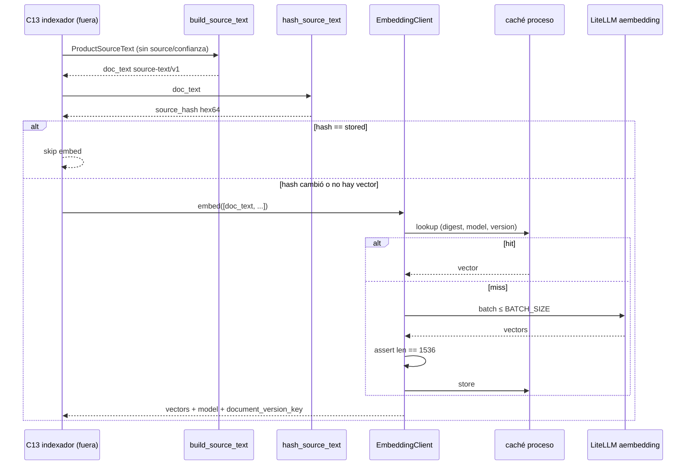

## Context

C05 dejó `ai.product_document` con `doc_text` NOT NULL, `source_hash CHAR(64)`, `embedding vector(1536)` nulable y metadatos de modelo, **vacía**. C09 extrae perfiles reales. C08 persiste `ProductAiProfile` y ya advierte que su `SourceHash` **no** es el del índice. Lo que falta es la pieza que el plan llama *«lo que hace barato y determinista todo el reindexado»*: un texto canónico estable y un cliente que no vuelva a pagar el modelo si el hash no cambió.

Esta biblioteca **no indexa el catálogo**. En Docker local (2026-08-25) hay 1.200 productos y **0** `ProductAiProfiles`; el esquema `ai` **no está** en ese volumen. El primer sync real es C13, después de C12 y de un AutoBulk que **no** es de este change.

**Estado del repositorio al diseñar:**

| Pieza | Estado |
|---|---|
| `ai-service/src/jbg_ai/indexing/` | Ausente |
| `POST /v1/index/sync` · `GET /v1/index/status` | Stub C02; `DELIVERED_BY = "C13 (...)"`. Con `STUB_MODE=false` → 501 |
| `ai-service/openapi.json` | Congelado. Este change **no** lo regenera |
| `Settings` | `JPV_RAG_LLM_*` y `JPV_CATALOG_LLM_*` opcionales al boot. **Sin** campos `JPV_EMBEDDING_*` (sí esbozados en `.env.example`) |
| `backend/.env.example` | Reserva `JPV_EMBEDDING_API_KEY` / `MODEL`. Falta `BASE_URL` y `BATCH_SIZE` |
| `jbg_ai.enrichment.llm.LiteLlmEnrichClient` | Runtime C09, `acompletion`, temp 0. **No** sirve para embeddings |
| `jbg_ai.data.llm.OpenAICatalogLlm` | CLI C06b. `api.main` no importa `jbg_ai.data`. **No** reutilizar |
| `pyproject.toml` | `litellm==1.98.0`. No hace falta dependencia nueva |
| Spec viva `embedding-management` | Reconocimiento **visual** 1280d. **No se toca** |
| `tests/indexing/` | Nombre **reservado** en `tests/README.md`; carpeta aún no creada |

**Fronteras que se heredan.** §6.2: Python calcula parecidos; C11 solo produce texto y vectores. §6.3: Python no lee `public` por SQL; el DTO lo rellenará C13 desde el feed C12. C05 decisión 11 («el acceso tipado nace en C11/C13») se lee como permiso, no como obligación de este change: **sin ORM**.



## Goals / Non-Goals

**Goals:**

- Congelar un constructor de `doc_text` `source-text/v1` cuyo hash sea una función pura del texto renderizado.
- Que materiales y tags ordenados de distinta forma produzcan el mismo hash; que un rename de familia lo cambie; que un cambio de PVP no lo haga.
- Puerto `EmbeddingClient` inyectable, adapter LiteLLM `aembedding`, assert 1536, *batch* 64, backoff 429/5xx, caché RAM.
- Settings `JPV_EMBEDDING_*` opcionales en `/health`; embeber sin clave propia falla; no se usa la clave RAG LLM.
- `jbg_ai.api.main` no importa `indexing`. `/v1/index/*` sigue siendo C13. `openapi.json` intacto.
- pytest de `tests/indexing/` verde **sin** sockets a proveedores ni RDS.

**Non-Goals:**

- `POST /v1/index/sync`, *upsert*, *tombstones*, `drift_count`, `ai.sync_failure` → **C13**.
- Feed HTTP .NET → **C12** (después de este change; el plan permite C11 ‖ C12 pero C12 va **después**).
- Ejecutar AutoBulk sobre los 1.200; escribir filas en `ai.product_document`; provisionar el esquema `ai`.
- Modelos ORM / SQLAlchemy de las tablas C05.
- `price` / `price_band` en el texto. Bandas = C12 o C13.
- Redis, tabla `ai.embedding_cache`, caché semántica de consultas, renormalización L2.
- Índice sombra / *blue/green* de cambio de modelo (C11 solo escribe las etiquetas).
- Embeddings visuales (`ProductPhotoEmbeddings`, 1280d, spec `embedding-management`).
- Chunking de catálogo. Diccionario de sinónimos (C20).
- Regenerar `openapi.json`, UI, migración EF/Alembic, Instructor, RDS.

## Decisions

### 1 · Biblioteca pura; el HTTP no se entera

**Decisión:** C11 no monta rutas. No hay `STUB_MODE` que conmutar: no hay HTTP. Los tests inyectan el puerto. `create_app` sigue sin importar `indexing`. El paquete vive en `jbg_ai/indexing/` (`source_text.py` + `embeddings.py`). C23 reutilizará el cliente y **no tocará** `embeddings.py`.

**Por qué.** El plan congela el cliente aquí precisamente para que C13 no lo invente junto al *upsert* y C14/C23 no lo copien. Meterlo detrás de `/v1/index/sync` mezclaría texto canónico con tombstones y el feed.

**Alternativas descartadas.** *(a) Implementar el constructor dentro del indexador C13:* el sitio peor, y el plan lo prohíbe (C11 ‖ C13). *(b) Exponer un endpoint interno de embed:* añade superficie HTTP y OpenAPI que este change no debe tocar. *(c) Un módulo bajo `enrichment/`:* otra clave, otro modelo, otro contrato; C09 ya tiene su puerto.

### 2 · DTO propio, no `ProposedProfile`

**Decisión:** entrada `ProductSourceText` (o equivalente) con campos del lado Python, **sin** `source`/`confidence`:

| Campo | Obligatorio | Notas |
|---|---|---|
| `sku` | sí | Entra en `doc_text` (rama léxica / `tsv`) |
| `name` | sí | Prosa de `Product.Name`, no de `ProposedProfile.title` |
| `description` | no | Omitir línea si vacío |
| `collection_name` | no | |
| `piece_type` | no | Vocabulario C09, ya canónico |
| `materials` | sí (lista, puede `[]`) | Ordenar; omitir línea si vacía |
| `stone_type` | no | |
| `size_label` | no | |
| `family_name` | no | **Nombre**, no UUID |
| `variant_label` | no | |
| `color_tags` / `style_tags` / `occasion_tags` | sí (listas, pueden `[]`) | Ordenar; omitir línea si vacía |

**Fuera del DTO:** `product_id`, `family_id`, `price`, `price_band`, `data_origin`, `text_provenance`, `ReviewStatus`.

**Por qué.** `ProposedProfile` viaja con `source` y confianza; meterlos en el texto reembebería al cambiar un metadato de revisión. El JSON de C12 aún no existe; este DTO **es** el contrato que C13 mapeará.

**Alternativas descartadas.** *(a) Reutilizar `ProposedProfile`:* reembed por revisión. *(b) Esperar el JSON de C12:* acopla C11 a C12; el plan pone C12 **después**. *(c) Incluir `price` / `price_band`:* cada cambio de PVP reembebe; el filtro de techo es de C21 y la autoridad es .NET.

SKU entra aunque semánticamente no aporte: el `tsv` de C05 se genera de `doc_text`; sin SKU la rama léxica de C21 no lo ve.

### 3 · Plantilla `source-text/v1`; hash del texto renderizado

**Decisión:** constante `SOURCE_TEXT_VERSION = "source-text/v1"` en código (no fichero en `prompts/`). Orden y etiquetas en español, alineados al ejemplo v2 §4.7. Separador `\n`, UTF-8, sin `\r`. Campos ausentes o listas vacías: **se omite la línea** (no sentinela `ninguna` / `n/a`). Materiales y tags **ordenados alfabéticamente** antes de unir.

```text
SKU: {sku}
Nombre: {name}
Descripción: {description}
Colección: {collection_name}
Tipo: {piece_type}
Materiales: {materials unidos por ", ", orden alfabético}
Piedra: {stone_type}
Talla: {size_label}
Familia: {family_name}
Variante: {variant_label}
Colores: {color_tags, orden alfabético}
Estilo: {style_tags, orden alfabético}
Ocasiones: {occasion_tags, orden alfabético}
```

`source_hash = sha256(doc_text.encode("utf-8")).hexdigest()` — minúsculas, 64 chars. **No** una tupla paralela. Cambiar etiquetas u orden = `source-text/v2` = reembed de corpus.

El constructor debe ser correcto con `family_name` nulo (Docker tiene 0 familias; C18 no ha pasado) **y** cambiar el hash el día que exista o se renombre. Eso cubre la obligación heredada de C07.

**Por qué.** Hashear el texto renderizado hace que cualquier deriva de serialización (orden, sentinela, `\r\n`) sea visible. Hashear una tupla dejaría pasar un `doc_text` distinto con el mismo digest.

**Alternativas descartadas.** *(a) Hash de campos sueltos:* dos serializaciones distintas compartirían hash. *(b) Sentinela `Piedra: ninguna`:* contamina el espacio semántico y fija un embedding para «ausencia». *(c) Markdown en `prompts/`:* no es un prompt; versionar una constante evita un fichero que nadie renderiza.

Hay **dos SHA-256** con nombre casi idéntico y no se unifican: C08 `ProductAiProfile.SourceHash` (entradas del extractor, `U+001F`) pregunta «¿hay que volver a extraer?»; C11 `source_hash` pregunta «¿hay que volver a embeber?». No se reutiliza el código C#.

### 4 · Caché RAM por `(digest, model, version)`; sin Redis ni tabla

**Decisión:** dict de proceso, sin TTL. Sirve intra-lote y reintentos. Al reiniciar se pierde: el hash es una función pura y se recalcula gratis; lo caro es el vector, y eso lo persiste **C13** en `ai.product_document`.

**Por qué.** C11 no es un job reanudable de indexación: no hay feed ni perfiles aprobados. Una tabla Alembic o Redis anticiparía persistencia que C13 ya tiene que hacer.

**Alternativas descartadas.** *(a) Tabla `ai.embedding_cache`:* duplica `product_document.embedding` y abre Alembic en un change que no escribe. *(b) Redis:* otro servicio para ~1.200 vectores que viven en Postgres. *(c) Sin caché:* un retry 429 reembebe el mismo texto en el mismo proceso; el test `test_embedding_not_recomputed_when_hash_unchanged` no tendría dónde clavar el fake.

### 5 · LiteLLM `aembedding`; clave propia; assert 1536

**Decisión:** puerto `EmbeddingClient` con `async embed(texts) -> EmbedResult`. Adapter sobre `litellm.aembedding` (o equivalente estable en `1.98.0`). Default `openai/text-embedding-3-small`. **No** el SDK OpenAI directo. **No** `LiteLlmEnrichClient`. **No** `OpenAICatalogLlm`.

```text
protocol EmbeddingClient
  model_id: str
  document_version_key: str   # "{model}:1536:source-text/v1" — C13 persiste
  model_version_key: str      # "{model}:1536" — C14 compara; no persiste la query

  async embed(texts: list[str]) -> EmbedResult
```

`EmbedResult`: `vectors`, `embedding_model`, `embedding_version` (= `document_version_key` para documentos), `cache_hits`.

Tras cada respuesta: `len(v) == 1536` o excepción identificable. Un 384/3072 no debe llegar a C13: insertarlo en `vector(1536)` rompería HNSW en silencio (primo del operator class mal alineado de C05).

Batch: trocear en bloques de `JPV_EMBEDDING_BATCH_SIZE` (default **64**). Retry con backoff en 429 y 5xx; **no** reintentar 4xx de validación. **No** L2 extra: 3-small ya normaliza; C05 eligió coseno para no depender de esa precondición.

`JPV_EMBEDDING_API_KEY` **no** hace fallback a `JPV_RAG_LLM_API_KEY`. Fallo sin clave al llamar: excepción de dominio explícita, no silencio. S3: proveedor = config. Fallback a otro modelo de **otra dimensión** = mezcla de espacios; prohibido.

**Por qué `async`.** C09 ya es `acompletion`; C13 será async. El mismo método embebe la consulta de C14: la clave de caché es el texto exacto; no hay plantilla que renderizar.

**Por qué dos version keys.** En `product_document.embedding_version` se persiste `document_version_key` porque es el preproceso **del documento**. C14 no persiste la query: basta `model_version_key` para no mezclar modelos. Incluir `source-text/v1` en la query sería mentir: la query no pasa por esa plantilla.

**Alternativas descartadas.** *(a) SDK OpenAI directo:* el proveedor queda compilado; contradice S3 y la reserva `JPV_EMBEDDING_*`. *(b) Reutilizar `EnrichLlm`:* otra clave, temp 0, schema de extracción. *(c) Fallback a la clave RAG:* un deploy sin `JPV_EMBEDDING_*` facturaría embeddings con la key de chat y haría opaco el coste. *(d) `embed()` síncrono:* rompe el patrón async de C09/C13. *(e) Batch 128:* más payload por llamada; 64 cabe en el lote de C13 (páginas de 50 del feed) con holgura. *(f) Constante de batch compilada:* C13/C23 no podrían recalibrar sin deploy.

### 6 · Settings opcionales al boot; pin del snapshot

**Decisión:** `JPV_EMBEDDING_API_KEY` / `MODEL` / `BASE_URL` / `BATCH_SIZE` opcionales en `Settings`. String vacío = unset, igual que `JPV_RAG_LLM_*`. `BATCH_SIZE` default 64; blank → 64. `canonical_openapi_settings` fija key/model/base URL a `None` y batch a 64. Completar `backend/.env.example`.

`/health` no las exige. Compose y C17 no inyectan la clave de embeddings en todos los perfiles.

**Por qué.** El mismo patrón que C06b (`JPV_CATALOG_LLM_*`) y C09 (`JPV_RAG_LLM_*`): el proceso arranca; el fallo es al *usar*. Si el snapshot lee el entorno, `test_openapi_snapshot_is_stable` se pone rojo sin haber tocado el contrato.

**Alternativas descartadas.** *(a) Exigir la key al boot:* Compose local sin clave no levantaría `/health`. *(b) Un solo prefijo `JPV_LLM_*`:* mezcla generate, enrich y embed.

## Risks / Trade-offs

- **[Riesgo] C13 inserta un vector de dimensión distinta y HNSW se degrada en silencio.** → Mitigación: assert `len == 1536` en el adapter, antes de devolver. Test `test_vector_dimension_mismatch_is_rejected`.
- **[Riesgo] Reutilizar `ProductAiProfile.SourceHash` como hash del índice.** → Mitigación: documentado en la entidad .NET y en este design; tests hashean el `doc_text`, no las entradas. No se importa código C#.
- **[Riesgo] `JPV_EMBEDDING_*` bloquea `/health` o cae a la clave RAG.** → Mitigación: opcionales al boot; test dedicado; fallo explícito al embeber sin clave propia.
- **[Riesgo] El entorno se cuela en `openapi.json`.** → Mitigación: pin en `canonical_openapi_settings`; no se regenera el snapshot.
- **[Riesgo] Importar `indexing` desde `api.main` arrastra LiteLLM de embeddings al grafo de boot.** → Mitigación: el HTTP no importa el paquete; test de import.
- **[Riesgo] Sentinela o reorder de `materials` reembebe el catálogo.** → Mitigación: omitir ausentes; orden alfabético; tests de estabilidad.
- **[Riesgo] Meter `price` en el texto.** → Mitigación: fuera del DTO; test `test_price_is_not_in_source_text`.
- **[Riesgo] Mezclar 1280d visual con 1536d semántico.** → Mitigación: spec `embedding-management` intacta; dimensión infalsificable en el adapter.
- **[Riesgo] Caché RAM «pierde los hashes» al reiniciar y parece un bug.** → Mitigación: el hash se recalcula; los vectores duraderos los escribe C13. C11 no es un job reanudable.
- **[Riesgo] Índice vacío en C13 se diagnostica como fallo del indexador.** → Mitigación: 0 perfiles en Docker hasta AutoBulk; documentado como verificación **posterior**, no DoD de C11.
- **[Trade-off] Sin Redis/tabla, un restart reembebe textos no persistidos.** Aceptado: no hay sync que reanudar.
- **[Trade-off] SKU en el embedding no aporta semántica.** Aceptado: el `tsv` lo necesita.
- **[Trade-off] `family_name` nulo hoy, hash distinto el día de C18.** Aceptado: es exactamente la obligación de C07.

## Migration Plan

No hay migración de esquema.

1. Añadir campos `JPV_EMBEDDING_*` opcionales y pinarlos en `canonical_openapi_settings`. Completar `backend/.env.example`.
2. Implementar DTO + `build_source_text` / `hash_source_text`. Suite de estabilidad verde sin red.
3. Puerto `EmbeddingClient`, fake inyectable, adapter LiteLLM con batch/backoff/assert 1536/caché. Tests de skip de recompute y de dimensión.
4. Confirmar que `api.main` no importa `indexing` y que `test_openapi_snapshot_is_stable` sigue verde **sin** regenerar.
5. Enlazar HU-AIENG-011 en `Documentos/epicas.md` (EP12).
6. **Rollback:** revertir el paquete y las settings. No hay filas que revertir: C11 no escribe. Las rutas `/v1/index/*` no se han tocado.
7. **Verificación posterior (no DoD):** AutoBulk de C08/C09 sobre los 1.200 **después de C12**, luego primer sync C13.

Nada contra RDS. C17 inyectará `/jpv/prod/*` más adelante; este change no lo hace.

## Open Questions

Ninguna pendiente. Las de la exploración y las cuatro del ticket **están cerradas** (2026-08-25):

| # | Pregunta | Decisión |
|---|---|---|
| 1 | ¿`embedding_version` de un *query embed* (C14) incluye `source-text/v1`? | **Documentos sí** (`document_version_key`). C14 no persiste la query; compara con `model_version_key` |
| 2 | ¿Default de batch 64 o 128? | **64** |
| 3 | ¿`JPV_EMBEDDING_BATCH_SIZE` en settings o constante? | **Settings opcional**, default 64 |
| 4 | ¿`embed()` síncrono o `async`? | **`async`** |
