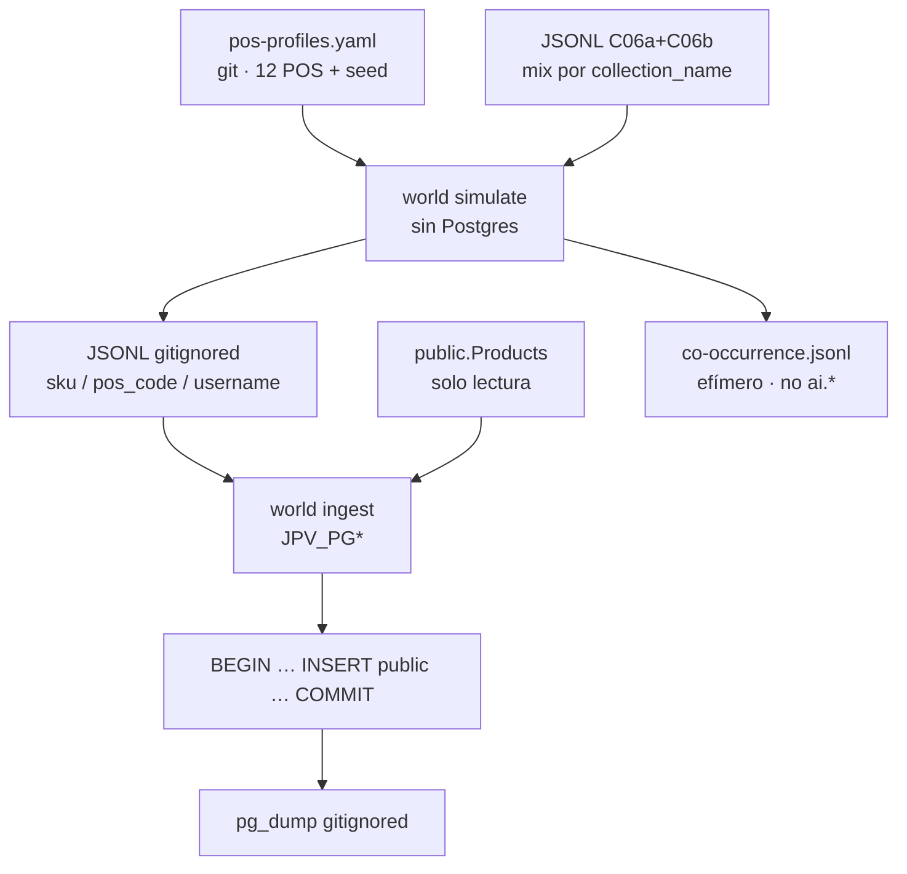
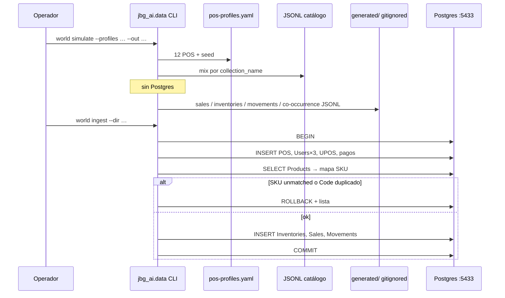

## Context

C06a+C06b archivaron un catálogo híbrido de 1.200 productos y 38 colecciones en Docker (`jpv-pv-postgres`, `:5433`, `joiabagur_pv`). El RAG de inventario y el ranking con proyección POS no pueden demostrarse sobre un mundo vacío: `"PointOfSales"`, `"Inventories"`, `"Sales"`, `"InventoryMovements"`, `"UserPointOfSales"` y `"PointOfSalePaymentMethods"` están a **cero**. `"Users"` tiene un `admin`; `"PaymentMethods"` tiene los 6 del seeder.

La ficha v3 de C10 pedía un generador en `jbg_ai.data.generators/` (10–14 POS, 5k–9k inventario, 15k–25k ventas, co-ocurrencia, test de determinismo) como pieza de datos. La exploración del 2026-08-23 lo sustituye: **C10 no es un servicio de Joiabagur**. Aproximación **C3**: empaquetado C06b (CLI en `jbg_ai.data`, sin HTTP) + alma C06a (sin LLM, artefactos curados) + POS escritos a mano.

Estado del repositorio al diseñar:

| Pieza | Estado |
|---|---|
| Change OpenSpec `add-synthetic-world-simulator` | Scaffold + ticket + HU; proposal escrito en este FF |
| `ai-service/src/jbg_ai/data/` | **Existe** (C06b): `generate`/`ingest` de catálogo, `briefs.py`, LLM OpenAI. `cli.py` solo esos dos subcomandos. `api.main` no importa el paquete |
| `jbg_ai.data.world` | **Ausente** |
| `ai-service/openapi.json` | Congelado. Si el snapshot se pone rojo, el change se ha salido de alcance |
| Schema `ai` en Docker local | **No existe** (C05 bootstrap no corrido en este volumen) |
| `"Products"` | 1.200 (433 en rango SKU 1–436, 767 ≥437; faltan `SKU135`, `SKU400`, `SKU418`). Todos `IsActive` |
| `"Collections"` | 38 |
| `PointOfSale` | Name 100, **Code 20 unique**, Phone **20**, **sin** `IsSupplySource`. `AllowManualPriceEdit` bool |
| `Sale` | `UserId` NOT NULL; `BulkOperationId` nullable; `SearchEventId` nullable; `Price` snapshot `numeric(18,2)` |
| `InventoryMovement` | `SaleId` unique; `MovementType` 1=Sale, 3=Adjustment, 4=Import; `UserId` NOT NULL |
| `User.Role` | Persistido como **string** EF (`Operator` / `Administrator`) |
| Postgres Docker | `jpv-pv-postgres`, host **5433**, BD `joiabagur_pv`, `JPV_PG*` |
| `.gitignore` | Cubre `data/catalog/*`; **no** `data/world/` todavía |
| `pyyaml` | Ya en `ai-service/pyproject.toml`. **`bcrypt` ausente** |

**Desviación acordada (2026-08-23)** respecto a la ficha v3:

| Ficha 17 ago | Este change |
|---|---|
| Generador en `jbg_ai.data.generators/` como pieza de servicio | Módulo **nuevo** `jbg_ai.data.world`; CLI; `api.main` **no** lo importa |
| JSONL 20k commiteado + `test_simulation_is_deterministic_for_same_seed` | YAML+semilla en git. JSONL y `pg_dump` **gitignored**. Se retira el test de bit-identidad |
| Escribir `ai.co_occurrence` | JSONL efímero derivado; ingest `ai` = **C22/C27**. Verdad = `Sales.BulkOperationId` |
| POS con columna `IsSupplySource` | Marca en YAML. Columna SQL = **C19**. Este change **no** es 🗄️ |
| 10–14 POS genéricos | **12** del censo cerrado (HU). Hotel Artrutx cerrado en lugar de pop-up de Navidad |
| Co-ocurrencia por `BulkOperationId` **o mismo POS y día** | **Solo** `BulkOperationId` (el “o día” de la ficha se descarta) |
| Partir POS+stock / ventas si se desborda | **No.** Un change (D8) |

**Dependientes que condicionan el diseño:**

| Change | Qué necesita | Consecuencia |
|---|---|---|
| **C19** | Filas Sales+Inventory+POS. Marca supply | YAML lleva `is_supply_source`. **No** migración |
| **C22** | Inventario sesgado, POS, qty 0 vs no asignado | Cobertura no cartesiana; `Inventory.IsActive` real |
| **C27** | `BulkOperationId` + pares | JSONL derivado; C27 recomputa desde `Sales` |
| **C12** | POS e inventario para el feed (cuando exista) | No hay endpoints aquí |
| **C16/C36** | 3 operadores para demo | Login local `Operator123!` |
| **C17** | `GET /health` sin claves de proveedor | Este change **no** añade settings de boot |



## Goals / Non-Goals

**Goals:**

- YAML de 12 POS + seed + `generator_version` commiteado; cada `Code` ≤ 20 y único; teléfono `600123456`.
- `MAO-TALLER` único `is_supply_source: true`; `HT-ARTRUTX` `is_active: false` con ventana de ventas que corta tras verano 2025.
- CLI `python -m jbg_ai.data world simulate|ingest` sin alterar `generate`/`ingest` de catálogo.
- Simulate **sin** Postgres: claves `SKU` / `Code` / `username`. Ingest resuelve UUID contra Docker.
- Poisson 16 meses; inventario **6.500–8.000**; ventas **15.000–25.000**; stock nunca negativo.
- Matriz intención ≠ evolución en pesos de colección del YAML (C06b no escribió el canal en `Collection.Name`).
- ~15 % de operaciones con `BulkOperationId` y 2–3 líneas de distinto stem / colección.
- Tres operadores (`Role = Operator`, BCrypt cost 12) en Ciutadella / Fornells / aeropuerto; resto de ventas → `admin`.
- `PointOfSalePaymentMethods`: 6 métodos × 11 POS activas; ninguno en Artrutx.
- Co-ocurrencia JSONL canónica (`sku_a < sku_b`); **cero** escrituras a `ai`.
- `jbg_ai.api.main` no importa `jbg_ai.data`; `openapi.json` quieto; tests de invariantes sin LLM y **sin** test de bit-identidad.
- Informe C10 + README con `pg_dump` / restore.

**Non-Goals:**

- C19 (migración `IsSupplySource`, señales SQL).
- C22 (`ai.pos_projection`).
- C27 (persistir `ai.co_occurrence`).
- Ruta HTTP en FastAPI o en la API .NET. Regenerar `openapi.json`.
- Seeder `DatabaseSeeder`. RDS / producción. Migración EF Core o Alembic.
- LLM. Reutilizar `scripts/catalog/assist.py` o extender `generate.py` / `ingest.py` de catálogo.
- Tocar `"Products"`, `"Collections"`, `"ProductFamilies"`, `"ProductFamilyMembers"`, `"ProductAiProfiles"`.
- Devoluciones, fotos, componentes, `ProductSearchEvents`, `SalePhotos` (D9).
- Un operador por cada POS. PII de cliente.
- Partir el change (D8).
- Commitear el JSONL de ventas o exigir identidad bit a bit a igual semilla.

## Decisions

### 1 · Módulo nuevo `jbg_ai.data.world`, no `generators/` ni seeder .NET

**Decisión:** el simulador vive en `ai-service/src/jbg_ai/data/world/` y se invoca como `python -m jbg_ai.data world simulate|ingest`. `create_app` **no** importa `jbg_ai.data`. No hay router nuevo. No se extiende `generate.py` / `ingest.py` de catálogo. No se toca `DatabaseSeeder`.

**Por qué.** C06b dejó el paquete `jbg_ai.data` a propósito para que C10 se sentara al lado. Meter el mundo en el generate de catálogo mezclaría LLM+JSONL de productos con Poisson+stock. Un seeder .NET arrancaría con la API y no reproduce 16 meses de `SaleDate` en el pasado (el `POST /api/sales` sella `SaleDate≈now` y exige operador asignado).

**Alternativas descartadas.** *(a) `jbg_ai.data.generators/` como la ficha:* nombre de “pieza de servicio”; C06b ya eligió CLI. *(b) `scripts/` como C06a:* aísla dependencias pero duplica `envload` / `JPV_PG*` y deja el mundo fuera del paquete que C06b inauguró. *(c) Router FastAPI:* viola el alcance y el boot de C17. *(d) `POST /api/sales`:* no cabe un histórico de 20k filas ni fechas pasadas.



Parser: `world` es un subparser anidado. `generate` e `ingest` de catálogo **no cambian** de flags ni de comportamiento.

### 2 · YAML+semilla en git; JSONL y dump gitignored

**Decisión:** se commitea `data/world/pos-profiles.yaml` (censo, pesos, estacionalidad, `seed`, `generator_version`). El JSONL de ventas/inventario/co-ocurrencia y `data/world/backups/*.sql` van en `.gitignore`. Se retira `test_simulation_is_deterministic_for_same_seed`.

**Por qué.** 15k–25k líneas no son un corpus textual que C09 vaya a releer: son un medio para llenar Docker. El seed documenta intención; los tests de *invariantes* son el contrato; el `pg_dump` local cubre el accidente del volumen.

**Alternativas descartadas.** *(a) JSONL commiteado como C06b:* el catálogo sintético *es* el artefacto (temperatura > 0, una pasada). El mundo es numérico y se puede regenerar. *(b) Test de bit-identidad:* un refactor del Poisson movería Fornells y el test rojo no diría si el mundo sigue siendo coherente.

`.gitignore`: ignorar `data/world/generated/` y `data/world/backups/`; exceptuar el YAML (y `.gitkeep`). Simétrico inverso a C06b.

### 3 · Simulate sin Postgres; ingest autoriza contra `"Products"`

**Decisión:** generate trabaja con `SKU` / `Code` / `username`. Lee **ambos JSONL de catálogo** para sesgar el mix por `collection_name`. El universo de SKU excluye los huecos conocidos del ancla (`SKU135`, `SKU400`, `SKU418`, lista en YAML). Ingest hace `SELECT Id, SKU, Price FROM "Products"` y **inner-join**: unmatched → `ROLLBACK` + lista. El YAML **no** lleva UUID.

**Por qué.** D7: el simulador tiene que poder correr en CI sin Docker. La BD es la autoridad del catálogo ingerido, no el JSONL (los tres huecos lo demuestran). Fallar en rojo evita un mundo a medias.

**Alternativas descartadas.** *(a) Simulate contra BD:* viola D7 y acopla la unidad al volumen. *(b) Ingest que silencie unmatched:* HU: «falla en rojo, no a medias». *(c) UUIDs en el YAML:* se pudren al recrear el volumen.

`Sale.Price` se sella en el ingest con el `Price` actual de `"Products"` (snapshot). `PriceWasOverridden=false`. `SearchEventId=null`. `Notes=null`.

### 4 · Poisson, cobertura sesgada y matriz intención ≠ evolución

**Decisión:** horizonte por defecto **16** meses (banda 14–18); extremo reciente = «hoy» del apply (UTC); extremo lejano = hoy−16 meses. `HT-ARTRUTX` corta al cierre (fin de verano 2025, p. ej. `2025-09-30` en YAML). Poisson por POS×día con `λ` del perfil × multiplicador mensual × propensión SKU.

Inventario **no** materializa 1.200×12. Objetivo **6.500–8.000** filas:

| POS | Cobertura (orden de magnitud) |
|---|---|
| `MAO-TALLER` | ≈ catálogo entero, qty alta; λ retail ~0 |
| `CIU-CENTRE` / `PALMA-JAIME3` | ~60–70 % |
| Aeropuerto / puertos / hoteles vivos | ~25–40 % sesgado al mix |
| `FORNELLS` | poco surtido + idle a propósito |
| `HT-ARTRUTX` | un puñado, **todo** `IsActive=false` |

~**8 %** de las filas de inventario en POS **vivas** también `IsActive=false` (D10), además del 100 % de Artrutx.

Los pesos `collection_weights` del YAML implementan la matriz de la HU (El Jaleo se cuela en Ciutadella; Cielo estrellado casi nunca en aeropuerto; etc.). Simulate **no** copia los briefs C06b a ciegas: una colección no es un canal.

Ventas **15.000–25.000**. Qty típica 1; alguna línea >1. **~15 %** de las *operaciones* (no de las líneas) llevan `BulkOperationId` y 2–3 líneas de distinto stem / colección (C27 necesitará distinto `piece_type` más adelante; aquí no hay esa columna — sesgar por colección/nombre basta para que existan pares).

Stock nunca negativo. Invariante: no hay venta sin fila **activa** con qty suficiente **antes** de la venta.

`MovementType.Import=4` para el alta inicial de stock (`UserId` = `admin`). `MovementType.Sale=1` 1:1 con `SaleId` unique. **No** se genera `Return=2`. Ajuste puntual (`Adjustment=3`) no es necesario si el Import deja el stock inicial y las ventas descuentan; se omite salvo que un test de reconciliación lo pida como ruido D10 — **defecto: no**.

### 5 · Fechas escritas, no `DEFAULT NOW()` (D11)

**Decisión:** `SaleDate`, `MovementDate`, `CreatedAt`, `UpdatedAt` y `LastUpdatedAt` se **escriben** con el instante simulado (timestamptz UTC). La pareja venta↔movimiento comparte fecha y `UserId`.

**Por qué.** Si se deja el default, las ventanas 7/30/60d que usen `CreatedAt` mienten. C19 usará `SaleDate`; igual hay que alinear el resto.

### 6 · Operadores, `Sale.UserId` y pagos (D4–D6)

**Decisión:** tres usuarios nuevos, no un operador por POS.

| Username | Nombre | POS | Password |
|---|---|---|---|
| `op-ciutadella` | Catalina Pons | `CIU-CENTRE` | `Operator123!` |
| `op-fornells` | Joan Marí | `FORNELLS` | `Operator123!` |
| `op-aeroport` | Marta Soler | `MAO-AIR` | `Operator123!` |

- `Role` literal `"Operator"` (conversión string de EF).
- Hash BCrypt **work factor 12**, igual que `DatabaseSeeder`. Dependencia `bcrypt` en `ai-service/pyproject.toml`.
- Email `NULL` (el unique filtra `IS NOT NULL`).
- `UserPointOfSales.IsActive=true` solo en esa POS. Taller y Artrutx **sin** operador.
- Ventas de esas 3 POS → ese `UserId`. Resto de POS activas → `admin` existente. Movimientos `Sale` copian el `UserId` de la venta; `Import` → `admin`.
- El chequeo «operador asignado» es de la **API**, no de la tabla; el CLI hace `INSERT`.

**Por qué no un UserId por POS.** `Sale.UserId` es NOT NULL, no unique por POS. El RAG (C19/C22/C25/C27/C33) agrega producto×POS, no operador. Tres logins bastan para demo de C16.

Pagos: los 6 códigos del seeder (`CASH`, `BIZUM`, `TRANSFER`, `CARD_OWN`, `CARD_POS`, `PAYPAL`) en las **11** POS activas. Artrutx **sin** filas `PointOfSalePaymentMethods`. Las ventas históricas de Artrutx (ventana viva) apuntan igual a `"PaymentMethods"` (FK de `Sale` es al método, no a la asignación POS).

Precio manual `true`: `MAO-AIR`, `HT-GALDANA`, `HT-SONBOU`, `EIV-MARINA`, `HT-ALCUDIA`. Taller `false`.

Teléfono de todos los POS: `600123456` (varchar 20; el object mother de tests .NET ya tropezó aquí).

### 7 · Ingesta: transacción única, frontera §6.3, sin columna nueva

```text
Host: localhost:5433
Database: joiabagur_pv
Schema: public
1. INSERT "PointOfSales"          (Id DEFAULT; Code unique; Phone pinado)
2. INSERT "Users" ×3              (BCrypt cost 12; Role = 'Operator')
3. INSERT "UserPointOfSales" ×3
4. INSERT "PointOfSalePaymentMethods"  (11 × 6; no Artrutx)
5. SELECT Id, SKU, Price FROM "Products" → mapa
6. unmatched SKUs → ROLLBACK + lista
7. INSERT "Inventories"
8. INSERT "Sales"                 (UserId resuelto; Price del mapa)
9. INSERT "InventoryMovements"    (SaleId 1:1 para tipo Sale)
NEVER: UPDATE/INSERT Products, Collections, ProductFamily*, ai.*
NEVER: columna IsSupplySource
NEVER: RDS
```

Credenciales **solo** `JPV_PG*` vía `envload` (mismo patrón C06a/C06b). **No** `JPV_CATALOG_LLM_*`. Simulate no las exige.

Ingest masivo: `COPY` o `executemany` / insert batch; **no** 20k roundtrips. Una transacción. El rol de runtime de `jbg-ai` **no** gana `INSERT` sobre `public`.

Idempotencia: si ya hay filas de mundo (p. ej. re-ejecutar ingest), abortar con error claro **antes** de insertar — no upsert silencioso, no borrar POS ajenos. Rehydrate = restore del dump, no “ingest otra vez encima”.

### 8 · Co-ocurrencia derivada, no persistida

**Decisión:** después de asignar `BulkOperationId`, escribir JSONL efímero `{product_sku_a, product_sku_b, co_sales_count, last_seen_at}` con `sku_a < sku_b`. Un par **solo** cuenta si comparte `BulkOperationId` (no basta el mismo POS y día). **No** hay `INSERT` a `ai.co_occurrence`. El schema `ai` ni siquiera está en este volumen.

**Por qué.** D2: C27 podrá recomputar desde `Sales`. Escribir `ai` ahora exigiría bootstrap C05 y mezclaría responsabilidades.

### 9 · Tests de invariantes; cero LLM; árbol `tests/data/world/`

El árbol de tests de `ai-service` espeja `src/jbg_ai`. Los tests de este change viven en `ai-service/tests/data/world/` y **no** abren sockets a proveedores. Nomenclatura `test_<unidad>_<escenario>_<esperado>`. Simulate puro = unitario en memoria. Ingest = testcontainers Postgres **o** fake de store (mismo puerto que C06b `CatalogStore`).

**Sí:**

- `test_no_sale_without_stock_at_that_pos`
- `test_seasonality_peaks_match_pos_profile` (Artrutx sin ventas post-cierre; taller ~0)
- `test_inventory_movements_reconcile_with_final_stock`
- `test_co_occurrence_only_counts_same_bulk_operation`
- `test_sale_and_movement_share_date_and_user`
- `test_ingest_rolls_back_on_unmatched_sku`
- `test_ingest_does_not_touch_products_or_collections`
- `test_artrutx_is_inactive_without_active_payments`
- `test_operator_sales_only_on_assigned_pos`
- `test_api_main_does_not_import_data_package` (ya existe en `tests/data/test_scope.py`; no romperlo)
- `test_phone_is_pinned_and_code_fits_varchar20`
- `test_yaml_census_has_twelve_codes`
- `test_world_cli_does_not_change_catalog_generate_ingest_flags`

**No:** `test_simulation_is_deterministic_for_same_seed`.

Docker solo en tests de ingest (o Testcontainers); skip si Docker no está, igual que el resto de `ai-service`.

### 10 · Sidecar, informe, backup

Sidecar local (gitignored, o recuentos en el informe): `seed`, `generator_version` (`c10-world/v1`), `generated_at`, recuentos de POS / inventario / ventas / movimientos / pares, horizonte.

Informe `Documentos/Proyecto Final AIEng/informes/c10-synthetic-world-report.md`: censo, recuentos, operadores (password de demo, mismo criterio que `Admin123!`), nota de backup.

Backup (README del módulo; **no** commitear):

```powershell
docker exec jpv-pv-postgres pg_dump -U postgres joiabagur_pv > data/world/backups/c10-world.sql
```

Restore documentado en el mismo README.

### 11 · Forma del YAML (contrato de perfiles)

Campos mínimos por POS: `code`, `name`, `address`, `island`, `is_supply_source`, `is_active`, `allow_manual_price_edit`, `lambda_retail`, `coverage` (o equivalente numérico), `seasonality` (12 multiplicadores o perfil nombrado), `collection_weights`, `operator` (username o null), `closed_after` (null salvo Artrutx). Cabecera: `generator_version`, `seed`, `horizon_months`, `phone`, `inactive_inventory_ratio_live_pos`, `bulk_checkout_ratio`, `catalog_sku_holes`.

Códigos **obligatorios** (exactos): `MAO-TALLER`, `CIU-CENTRE`, `MAO-AIR`, `FORNELLS`, `BINIBECA`, `HT-GALDANA`, `HT-SONBOU`, `PORT-MAO`, `PALMA-JAIME3`, `EIV-MARINA`, `HT-ALCUDIA`, `HT-ARTRUTX`.

## Risks / Trade-offs

- **[Riesgo] Simulate emite un SKU de los huecos 135/400/418 y el ingest revienta.** → Mitigación: `catalog_sku_holes` en YAML; ingest sigue siendo la red de seguridad (ROLLBACK + lista).
- **[Riesgo] `Phone` > 20 o `Code` > 20 (`22001`).** → Mitigación: teléfono pinado; test de longitud; validador de perfiles antes de simular.
- **[Riesgo] Hash BCrypt incompatible con BCrypt.Net.** → Mitigación: work factor 12; verificar login local `Operator123!` en el informe / smoke; no usar un prefijo `$2b$` si el .NET de este repo no lo verifica — comprobar contra `AuthenticationService` (BCrypt.Net verifica `$2a$`/`$2b$` en la práctica; si no, fijar `$2a$`).
- **[Riesgo] Re-ejecutar ingest duplica POS (`Code` unique).** → Mitigación: abortar si el mundo ya está presente; rehydrate = restore del dump.
- **[Riesgo] 20k INSERT lentos o timeout.** → Mitigación: batch/`COPY` en una transacción; irrelevante en runtime del servicio.
- **[Riesgo] Alguien apunta el CLI a RDS.** → Mitigación: documentar host 5433; no hay perfil de producción; credenciales solo por entorno.
- **[Riesgo] `api.main` importa `jbg_ai.data` y C17 arranca el grafo de mundo.** → Mitigación: test existente de alcance; subcomandos anidados no cambian `create_app`.
- **[Riesgo] Poisson uniforme que no distingue Fornells de Ciutadella.** → Mitigación: `test_seasonality_peaks_match_pos_profile` sobre agregados mensuales; λ y seasonality en YAML.
- **[Riesgo] Co-ocurrencia por “mismo POS y día” (ficha v3) infla pares falsos.** → Mitigación: solo `BulkOperationId`; test dedicado.
- **[Riesgo] Columna `IsSupplySource` se cuela en el INSERT y falla contra el esquema actual.** → Mitigación: el INSERT de POS usa solo columnas existentes; C19 llega después; YAML conserva la marca.
- **[Trade-off] Sin test de bit-identidad** un refactor del generador no se ve en git. Aceptado: pytest de propiedades + dump local.
- **[Trade-off] Python de desarrollo escribe en `public`.** Aceptable porque no es el proceso `jbg-ai` (misma excepción C06a/C06b).
- **[Trade-off] Bandas 6,5k–8k y 15k–25k son holgura**, no umbrales exactos. El sidecar documenta el recuento.
- **[Trade-off] `Sale.UserId` casi no calibra el RAG.** Aceptado: cosmética coherente + demo de login.

## Migration Plan

No hay migración de esquema. El plan es de **datos locales**:

1. Asegurar Postgres Docker en 5433 y que `"Products"` tenga ~1.200 filas (C06a+C06b ingeridos).
2. Abrir `.gitignore` para `data/world/generated/` y `data/world/backups/`; commitear YAML + `.gitkeep`.
3. Implementar `jbg_ai.data.world` + subcomandos anidados; `uv sync --system-certs`; añadir `bcrypt`.
4. Tests de invariantes en memoria (simulate) y store fake / testcontainers (ingest).
5. `world simulate` → JSONL local gitignored.
6. Snapshot / dump previo opcional. `world ingest` en una transacción. Verificar recuentos y que `"Products"` no cambió.
7. `pg_dump` a `data/world/backups/` (gitignored). Informe C10.
8. **Rollback de datos:** restaurar el dump previo al ingest. El YAML se queda.
9. **Nada contra RDS.**

## Open Questions

Ninguna bloqueante. Residuales con default (ticket Q1–Q6):

| # | Tema residual | Opción por defecto |
|---|---|---|
| 1 | Librería BCrypt en Python | `bcrypt` work factor 12. Prefijo `$2a$` si hace falta compatibilidad BCrypt.Net |
| 2 | % `Inventory.IsActive=false` en POS vivas | **~8 %** de las filas de asignación, además del 100 % de Artrutx |
| 3 | Meses exactos | **16** |
| 4 | % checkouts multi-línea | **~15 %** de las operaciones, 2–3 líneas |
| 5 | Universo de SKU en simulate | Ambos JSONL de catálogo **menos** `catalog_sku_holes`; ingest autoriza contra `"Products"` |
| 6 | Nombres de operadores | Los de la tabla (Catalina Pons, Joan Marí, Marta Soler) |
| 7 | `generator_version` / `seed` | `c10-world/v1` / `20260823` |
| 8 | Re-ingest | Abortar si ya hay POS del censo; no upsert |
