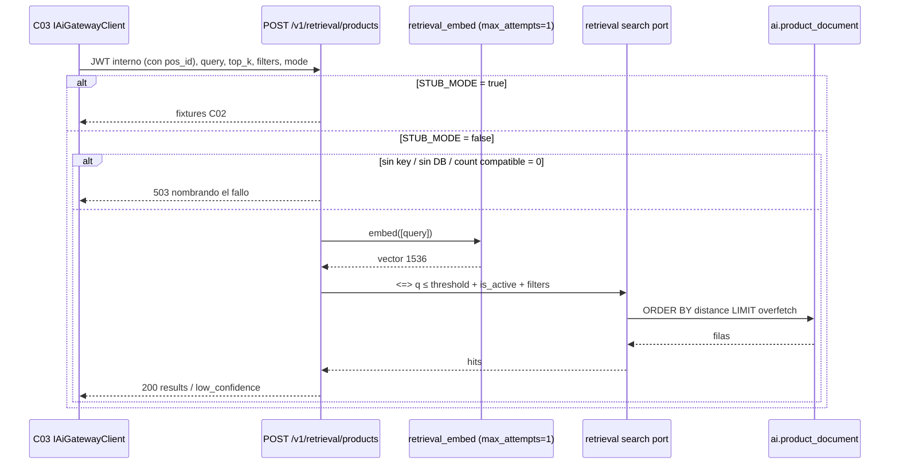

## Context

C13 pobló `ai.product_document` (1.200 filas, embedding 1536-d, HNSW `vector_cosine_ops`, GIN `materials`). C02 congeló `POST /v1/retrieval/products`. C03 ya mapea el body con timeout **800 ms** y no trunca el overfetch. C15 hidratará precio/stock/permisos desde `public` y truncará a `top_k`.

Hoy `api/routers/retrieval.py` es el stub C02: `STUB_MODE=true` → fixtures; `false` → **501** (`PRODUCTS_DELIVERED_BY = "C14 (add-vector-retrieval-endpoint)"`). El handler es **sync**. `get_service_principal` exige `pos_id`. `payload.pos_id` se ignora. `jbg_ai/retrieval/` **no existe**. `indexing/repository.py` es el escritor C13; no tiene `ORDER BY embedding <=>`. `openapi.json` está congelado y este change **no** lo regenera. El default OpenAPI de `mode` es `hybrid`; C14 solo sabe vector.

Índice local verificado 2026-08-27: **1.200 / 1.200 / 1536**. Smoke posterior, no pytest.

**Estado del repositorio al diseñar (verificado 2026-08-27):**

| Pieza | Estado |
|---|---|
| `api/routers/retrieval.py` | Stub; `require_stub_mode` en `/products` y `/substitutes`; handler sync |
| `api/schemas/retrieval.py` | `query` 1–500, `top_k` 1–50 default 10, `filters`, `mode` default hybrid, `pos_id` opcional ignorado. Score `ge=0, le=1`. **No se toca** |
| `RetrievalFilters` | `materials[]`, `category`, `family_id` (str), `exclude_product_ids[]` |
| `stubs/responses.py` | `over_retrieval_count = min(top_k × 3, 60)`. Reutilizar |
| `indexing/embeddings.py` | Congelado (C11). `LiteLlmEmbeddingClient.max_attempts` default 3. Comentario: *C14 compares `model_version_key`* (`{model}:1536`) |
| `indexing/repository.py` | Escritor C13. C14 no lo hincha |
| `Settings` | `JPV_EMBEDDING_*` opcionales al boot. **Sin** umbral de retrieval |
| `db/engine.py` | Async, pool 5, lazy, `session_scope`. Sin `DATABASE_URL` falla al pedir sesión |
| Alembic | Head C13. C14 **no** añade revisión |
| Compose `jbg-ai` | `STUB_MODE=true`. No inyecta `JPV_EMBEDDING_*` |
| `IAiGatewayClient` / C03 | `RetrievalTimeoutMs = 800`. Sin cambios |

**Fronteras que se heredan.** §6.2: Python = parecido, .NET = números. C02 contrato. C03 800 ms. C05 HNSW cosine + GIN materials; Python no lee `public`. C11 cliente y `model_version_key`. C13 índice poblado. C09 stub vs real. C05 no creó `ai.query_log`.



## Goals / Non-Goals

**Goals:**

- Sustituir el 501 de `/v1/retrieval/products` por la rama vectorial cuando `STUB_MODE=false`, con el patrón stub/real de C09/C13.
- Embeber la query una vez (cliente C11, `max_attempts=1`) y buscar con `<=>` cosine sobre HNSW.
- Umbral sobre **distancia** en SQL (`JPV_RETRIEVAL_DISTANCE_THRESHOLD`, default 0,65). Sin relajación. Overfetch **después** del umbral.
- Score de contrato `clamp(1 − distance, 0, 1)`. `match_reasons` mínimo `["vector"]`.
- Honrar filtros del body: `materials` (`&&`), `category` → `piece_type`, `family_id`, `exclude_product_ids`.
- `mode=hybrid` y `lexical` corren vector hasta C21, con nota `vector_only_until_c21` en `debug`.
- Distinguir abstención (200 + `low_confidence`) de índice caído / dependencia ausente (503).
- Logs `stage=embed|search` con `trace_id`. Handler async. Auth `get_service_principal`. Snapshot OpenAPI intacto. Tests con fakes, cero sockets.

**Non-Goals:**

- Léxico, RRF, diccionario de sinónimos → **C20 / C21**. Extraer filtros desde el texto → **C21**.
- Proyección POS (`ai.pos_projection`) → **C22**.
- `POST /v1/retrieval/substitutes` real → **C26**.
- Hidratación, truncado a `top_k`, feature flag, fallback léxico .NET → **C15**. Cliente gateway → **C03**.
- `ai.query_log`. Telemetría de producto = `ProductSearchEvent` (C04) **después** de hidratar.
- Editar `indexing/embeddings.py`. Regenerar `openapi.json`. Alembic. Migración EF. Frontend. UI.
- Reformulación LLM de la query. Relajar el umbral si hay pocos hits. Filtrar precio, stock o `pos_id` en Python.
- Un pytest que exija 1.200 filas reales. El smoke contra el índice local es verificación **posterior**.

## Decisions

### 1 · Stub vs real en el handler, como C09/C13

**Decisión:** `retrieval.py` deja de llamar a `require_stub_mode` **solo** en `/products`. Si `settings.stub_mode`: devolver `retrieval_products_stub`, cero I/O. Si no: rama real. Substitutes sigue con `require_stub_mode` y `SUBSTITUTES_DELIVERED_BY` (C26).

El handler de products pasa a **`async def`**. Substitutes puede seguir sync. Auth: `get_service_principal` (token sin `pos_id` → 401). `effective_pos_id` = claim; `payload.pos_id` se ignora.

El orquestador vive en `jbg_ai/retrieval/` e se importa **desde el router**, no desde `api.main` (mismo corte C11/C13: `main.py` no menciona el paquete). Puertos inyectables en `request.app.state.retrieval_embed` y `request.app.state.retrieval_search` (nombres tentativos). No reutilizar `index_embed` si ese cliente lleva `max_attempts=3`.

Falta de `JPV_EMBEDDING_API_KEY` (y sin fake inyectado), de `DATABASE_URL`, o de bootstrap / extensión `vector` / esquema `ai` → **503** con `detail` que nombra el fallo, no 501 ni 200 con `low_confidence`. `/health` no las exige. Si hay fake inyectado, no se exige la key (tests).

**503 no se declara** en el diccionario `responses` del router. Declararlo alteraría `openapi.json`. C09 ya lanza 503 sin documentarlo; C13 lo documentó porque regeneraba el snapshot. `test_openapi_snapshot_is_stable` debe seguir verde **sin** regenerar.

`test_*_still_name_c14` (si existe un aserto de 501 en products) se actualiza o se retira: la ruta ya no es un placeholder.

**Por qué.** El 501 es un guardrail de *aún no existe*, no un modo de operación. Mentirlo cuando el código está escrito haría opaco un misconfig (sin key). El default `mode=hybrid` del schema no puede 501: C03/C15 encenderían real mode y se encontrarían un not-implemented.

**Alternativas descartadas.** *(a) Seguir con `require_stub_mode` y un flag interno:* duplica el patrón. *(b) 501 en `mode=hybrid` hasta C21:* rompe el primer encendido real. *(c) Declarar 503 en OpenAPI:* obliga a regenerar el snapshot, fuera de alcance. *(d) Importar `retrieval` desde `create_app`:* acopla el boot a SQL/embed.

### 2 · Embed de la query: misma clase C11, `max_attempts=1`

**Decisión:** instanciar `LiteLlmEmbeddingClient(..., max_attempts=1)` para retrieval. El indexador no se reconfigura (sigue en 3). Un texto, un vector. `require_embedding_dimension` ya vive en el cliente. Fallo de proveedor o dimensión ≠ 1536 → 503 (o el error HTTP que ya use C13 para embed; no 200 vacío).

Caché RAM por texto exacto de C11: beneficio colateral, no requisito de producto. `cache_hits` viaja al log `stage=embed`.

Preferir instancia inyectada `app.state.retrieval_embed`. Construirla en el router si no hay fake, igual que `build_enrich_llm` / `_run_with_ports` de índice. **No** editar `embeddings.py`.

**Por qué.** C03 corta a 800 ms. Un retry de LiteLLM (backoff 2^n) comería el presupuesto y dejaría a C15 en timeout. El indexador batch puede permitirse 3 intentos; el path de query no.

**Alternativas descartadas.** *(a) Reusar `index_embed` del process:* ese cliente se construye con el default 3. *(b) Copiar un cliente nuevo en `retrieval/`:* viola el freeze C11 y duplica LiteLLM. *(c) Editar el default de `max_attempts` en `embeddings.py`:* C23 depende del freeze; el indexador perdería retries. *(d) `max_attempts=2` «por si acaso»:* el segundo intento sigue peleando con 800 ms.

### 3 · Compatibilidad de modelo: `model_version_key`, no `document_version_key`

**Decisión:** C13 persiste `embedding_version = document_version_key` (`{model}:1536:source-text/v1`) y `embedding_model = model_id`. C14 compara **`model_version_key`** (`{model}:1536`): una fila es compatible si `embedding_version` empieza por `model_version_key` **o** `embedding_model` iguala el `model_id` del cliente vivo, y `embedding IS NOT NULL`.

Count de filas compatibles = 0 → **503**, no abstención. Un índice de otra dimensión/modelo no debe degradar a «no hay nada parecido». C23 puede cambiar `source-text/v1` sin invalidar el espacio vectorial; por eso no se exige igualdad del `document_version_key` completo.

**Por qué.** El comentario congelado en `embeddings.py` lo reserva a este change. Abstenerse sobre un índice ajeno mentiría recall 0.

**Alternativas descartadas.** *(a) Igualdad de `document_version_key`:* un bump de `source-text` en C23 503-aría el índice entero hasta reembeber, aunque el modelo/dim no hayan cambiado. *(b) No filtrar y mezclar modelos:* cosine entre espacios distintos es ruido. *(c) 200 + `low_confidence` si count = 0:* indistinguible de una query absurda.

### 4 · Umbral sobre distancia en SQL; score en el handler

**Decisión:** predicado `embedding <=> :q <= :threshold` con `JPV_RETRIEVAL_DISTANCE_THRESHOLD` (float, default **0,65**). Operador cosine; **no** mezclar L2. El umbral vive en SQL; la conversión a score es del handler:

```
score = clamp(1.0 - distance, 0.0, 1.0)
```

El schema Pydantic rechaza fuera de `[0, 1]`. Default 0,65 ≈ score 0,35. Sin relajación. Sin segundo round-trip. Calibración en C24.

Setting opcional al boot; string vacío → 0,65; rango `0 < x ≤ 2` (dominio de cosine distance). Pin a 0,65 en `canonical_openapi_settings`. `/health` no la exige.

Overfetch **después** del umbral: `LIMIT :overfetch` con `overfetch = over_retrieval_count(top_k)` = `min(top_k × 3, 60)`, reutilizando la función del stub. `ORDER BY embedding <=> :q ASC`. `candidates_returned` = `len(results)`, no el teórico `top_k × 3`.

**Por qué.** Si se sobre-recuperara *antes* del umbral, el top-60 podría estar lleno de vecinos peores que 0,65 y C15 hidrataría basura. Filtrar por score en Python obligaría a traer más filas y perdería el índice en el predicado.

**Alternativas descartadas.** *(a) Umbral sobre score en Python:* no empuja el corte a HNSW. *(b) Relajar si hay < N hits:* C24 calibra; C14 no adivina el recall del estrato `real`. *(c) Devolver siempre `top_k × 3` rellenando con peores:* viola el umbral. *(d) Mover el umbral a .NET:* Python es quien ve la distancia cruda; el contrato publica score 0–1.

### 5 · Filtros del body en SQL; `family_id` 422; exclusiones tolerantes

**Decisión:** predicados fijos siempre: `embedding IS NOT NULL`, `is_active IS TRUE`, compatibilidad de modelo, distancia ≤ umbral.

Predicados del body, si vienen:

| Filtro | Columna | Semántica |
|---|---|---|
| `materials` no vacío | `materials` | solape `&&` (GIN) |
| `category` no nulo | `piece_type` | igualdad |
| `family_id` no nulo | `family_id` | igualdad UUID |
| `exclude_product_ids` | `product_id` | `<> ALL` |

`family_id` que no parsea como UUID → **HTTP 422** desde el handler (`HTTPException`), **sin** cambiar el tipo Pydantic (el schema sigue siendo `str`; cambiarlo a UUID regeneraría OpenAPI). `exclude_product_ids` malformados se ignoran y se anotan en log Debug; no tumban la query.

**No** filtrar `pos_id`. **No** precio. **No** stock. **No** extraer filtros desde el texto de `query` (C21).

**Por qué.** C05 ya indexó `materials` (GIN), `piece_type` y `family_id` (B-tree) porque se iban a filtrar aquí. Dejarlos para C21 duplicaría el SQL y C15 recibiría candidatos que el operador ya recortó en el body.

**Alternativas descartadas.** *(a) Ignorar filtros hasta C21:* el contrato ya los acepta; ignorarlos es un bug silencioso. *(b) Cambiar `family_id` a UUID en Pydantic:* drift de snapshot. *(c) 422 también en exclusiones malformadas:* un id sucio del caller no debe tumbar la búsqueda; el ticket lo cierra. *(d) Filtrar por POS «ya que el token lo trae»:* C22 + hidratación C15.

### 6 · `mode`: hybrid y lexical ejecutan vector hasta C21

**Decisión:** cualquier `mode` (`hybrid` default, `lexical`, `vector`) ejecuta la **misma** rama vectorial. `match_reasons` contiene `"vector"`; no se inventa `"lexical"`.

`debug` se rellena en el camino real: `vector_score = score`; `lexical_score` / `rerank_score` quedan null. Cuando `mode` es `hybrid` o `lexical`, `notes` incluye `vector_only_until_c21`. `mode=vector` no necesita esa nota.

**Por qué.** Mentir 501 en hybrid rompería a C03/C15 el día que enciendan `STUB_MODE=false`. La nota deja rastro para C21.

**Alternativas descartadas.** *(a) 501 en hybrid/lexical:* el default del schema es hybrid. *(b) Devolver fixtures en hybrid y vector real en `mode=vector`:* dos semánticas para el mismo contrato. *(c) Poner `"lexical"` en `match_reasons` «porque el modo lo pidió»:* C21 no podría distinguir mentira de RRF real.

### 7 · Abstención 200 vs índice caído 503

**Decisión:**

| Situación | HTTP | Body |
|---|---|---|
| Stub on | 200 | fixtures C02 |
| Índice con compatibles; 0 hits tras umbral/filtros | **200** | `results=[]`, `candidates_returned=0`, `low_confidence=true` |
| Hay ≥1 hit | 200 | `low_confidence=false` |
| Count compatible = 0, o sin bootstrap / sin `DATABASE_URL` / sin key / embed no recuperable | **503** | `detail` nombra el fallo; no `low_confidence` |

`DatabaseNotConfiguredError` (engine C05) se traduce a 503 nombrando `DATABASE_URL`. `GET /health` sigue en 200.

**Por qué.** Abstención es un resultado de búsqueda. Índice vacío es un fallo de plataforma. Confundirlos deja a C15 grabando `low_confidence` sobre un sync que nunca corrió.

**Alternativas descartadas.** *(a) 200 vacío también si count = 0:* fallo mudo de S11, exactamente lo que C13 existió para evitar. *(b) 501 si falta la key:* el código **sí** existe. *(c) Relajar y reintentar:* fuera de alcance.

### 8 · Query de búsqueda propia en `retrieval/`; no hinchar el repo C13

**Decisión:** puerto inyectable (p.ej. `ProductSearchPort`) con `count_compatible(...)` y `search(...)` → lista de hits (`product_id`, `sku`, `distance`, `materials`, `family_id`, `variant_label`). Implementación SQLAlchemy **Core** async sobre `session_scope` / engine existentes. **No** mapped class. **No** segundo engine. **No** añadir `ORDER BY embedding <=>` a `indexing/repository.py`.

Python **no** hace `SELECT` en `public`. Fake en tests: lista de filas con distancia. Cero sockets.

**Por qué.** El escritor C13 y el lector C14 tienen invariantes distintos (upsert/tombstone vs k-NN). Mezclarlos acopla C23/C22 al SQL de retrieval. Core evita que un autogen futuro pise HNSW.

**Alternativas descartadas.** *(a) Métodos nuevos en `ProductDocumentRepo`:* C21/C22 hincharían el mismo archivo. *(b) SQL crudo con `psycopg` al margen del engine:* dos pools. *(c) Tests contra 1.200 filas Docker:* el ticket lo cierra; smoke posterior.

### 9 · Observabilidad: logs de etapa, no `query_log`

**Decisión:** logs estructurados, dos etapas:

- `stage=embed` — `trace_id`, `latency_ms`, `model`, `cache_hits`
- `stage=search` — `trace_id`, `latency_ms`, `distance_min` (null si 0 hits), `candidates`, `low_confidence`, `mode`, `threshold`

Query del operador: **solo Debug** (precedente C03/C04). No dump del vector a Information. La key no se loguea.

**No** `INSERT` en `ai.query_log`. C04 (`ProductSearchEvent`) cubre el lado .NET **después** de hidratar; el cruce es `trace_id`.

**Por qué.** C05 no creó la tabla a propósito. Improvisar columnas en C14 es el anti-patrón que el plan §0 evitó. Los logs cubren el DoD de etapa; C24 puede abrir un change propio si hace falta persistir queries.

**Alternativas descartadas.** *(a) Alembic de `query_log` «ya que estamos»:* sin contrato de columnas. *(b) Loguear el vector o la query a INFO:* fuga y ruido. *(c) No loguear `trace_id`:* C03/C04 no pueden cruzar.

## Risks / Trade-offs

- **[Riesgo] Regenerar OpenAPI «para documentar 503» o al pasar el handler a async.** → Mitigación: no añadir 503 al `responses` del router; el snapshot se valida **sin** regenerar; si `test_openapi_snapshot_is_stable` se pone rojo, el change se ha salido de alcance.
- **[Riesgo] Editar `embeddings.py` «un poco» para `max_attempts`.** → Mitigación: instancia con el kwarg; `git diff` de ese fichero vacío; C23 depende del freeze.
- **[Riesgo] Reusar `index_embed` (3 intentos) y pelear con 800 ms.** → Mitigación: `app.state.retrieval_embed` distinto; test `test_retrieval_embed_client_uses_max_attempts_one`.
- **[Riesgo] Índice de otro modelo degradado a abstención.** → Mitigación: count compatible = 0 → 503; comparar `model_version_key`.
- **[Riesgo] Overfetch *antes* del umbral llena C15 de vecinos basura.** → Mitigación: `WHERE distance <= threshold` y *después* `LIMIT overfetch`.
- **[Riesgo] `mode=hybrid` 501 en el primer encendido.** → Mitigación: misma rama vectorial; nota en `debug`; test dedicado.
- **[Riesgo] Cambiar `family_id` a UUID en Pydantic.** → Mitigación: parseo en el handler; 422; schema intacto.
- **[Riesgo] Filtrar por POS «porque el token lo trae».** → Mitigación: fuera de alcance explícito; test de que `pos_id` no entra en el SQL.
- **[Riesgo] Crear `ai.query_log`.** → Mitigación: logs + `trace_id`; C05 lo dejó sin dueño a propósito.
- **[Riesgo] Hinchar `indexing/repository.py` con el SELECT de k-NN.** → Mitigación: puerto propio en `retrieval/`.
- **[Riesgo] Compose local en real mode sin `JPV_EMBEDDING_*`.** → Mitigación: 503 nombrando la setting; C14 no añade `envload` al boot HTTP (mismo corte C13).
- **[Riesgo] Tests que exigen 1.200 filas o sockets a OpenAI.** → Mitigación: fakes; pgvector opcional y *skip* si Docker no responde; smoke posterior.
- **[Trade-off] Default 0,65 no está calibrado sobre el estrato `real`.** Aceptado: C24 calibra; un umbral fijo y ruidoso es peor que uno explícito y documentado.
- **[Trade-off] 503 no aparece en el snapshot OpenAPI.** Aceptado: C03 ya mapea 5xx ≠ 501 a unavailability; declarar el código rompería el freeze.
- **[Trade-off] hybrid/lexical mienten el modo hasta C21.** Aceptado: la alternativa (501) bloquea C15; la nota en `debug` es el rastro.

## Migration Plan

1. Setting `JPV_RETRIEVAL_DISTANCE_THRESHOLD` (default 0,65; blank → 0,65; rango `(0, 2]`); pin en `canonical_openapi_settings`.
2. Puerto `ProductSearchPort` + implementación Core (`count_compatible`, `search` con `<=>`, umbral, filtros, `ORDER BY` + `LIMIT`). Fake para tests.
3. Orquestador en `jbg_ai/retrieval/`: embed `max_attempts=1`, score, overfetch, `low_confidence`, mapeo de resultados, logs de etapa.
4. Router: `async def` en `/products`; stub vs real; 503 de dependencias; inyección `app.state`; substitutes intacto.
5. Tests en `tests/retrieval/`, `tests/api/`, `tests/config/` (nombres de la ficha + los que cierran las decisiones).
6. Enlazar HU-AIENG-014 en `Documentos/epicas.md` (EP14).
7. `openspec validate --all --strict` → 0 failed.
8. **Rollback:** revertir paquete/router/setting. No hay Alembic ni snapshot que revertir. `STUB_MODE=true` (Compose) no cambia de comportamiento.
9. **Verificación posterior (no DoD de merge):** `POST /v1/retrieval/products` local con `STUB_MODE=false` contra los 1.200: query obvia («anillo plata») → 200 con candidatos; query absurda → 200 + `low_confidence`.

Nada contra RDS. C17 inyectará `/jpv/prod/*`.

## Open Questions

Ninguna pendiente de producto. Cerradas en exploración (2026-08-27).

| # | Pregunta | Decisión |
|---|---|---|
| 1 | ¿`mode=hybrid` 501 hasta C21? | **No.** Vector + nota `vector_only_until_c21` |
| 2 | ¿Umbral sobre score o distancia? | **Distancia** en SQL. Score = `clamp(1 − d, 0, 1)`. Default **0,65** |
| 3 | ¿Filtros del body? | **Honrarlos** en C14. Extracción desde texto = C21 |
| 4 | ¿Reintentos de embed? | Retrieval `max_attempts=1`. No editar `embeddings.py` |
| 5 | ¿Índice vacío 200 o 503? | **503**. Abstención real = 200 + `low_confidence` |
| 6 | ¿`ai.query_log`? | **No.** Logs + `trace_id`. C04 cubre post-hidratación |
| 7 | ¿OpenAPI? | **No** regenerar. 503 se lanza, no se declara |
| 8 | ¿`family_id` inválido? | **422** en el handler. `exclude_product_ids` malformados se ignoran |
| 9 | ¿Filtrar por POS? | **No** (C22 + C15) |
| 10 | ¿DoD 1.200 en pytest? | **No.** Smoke posterior |
| 11 | ¿`design.md`? | **Sí** (este documento) |

Default si el apply descubre un detalle menor no listado: la opción más estrecha que **no** edite `embeddings.py`, **no** regenere OpenAPI, **no** cree `query_log` y **no** filtre por POS.
