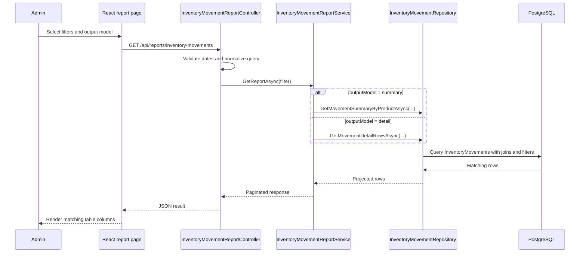

## Context

The existing inventory movement report is an administrator-only report at `/reports/inventory-movement-summary`. It calls `GET /api/reports/inventory-movements` and receives paginated rows aggregated by product, with Excel export generated by `GET /api/reports/inventory-movements/export`.

The domain already stores transaction-level audit data in `InventoryMovement`, including movement type, quantity before/after, movement date, reason, user, optional sale/return references, and inventory links to product and point of sale. The report can therefore add a detailed output model without changing the database schema.

## Goals / Non-Goals

**Goals:**

- Preserve the current summary report as the default output model.
- Add a filter selector that switches between `Resumen` and `Detalle`.
- Return detail rows for individual inventory movements using the same date and POS filters.
- Add a product text filter that matches product name or SKU in both output models.
- Export the selected output model to Excel with matching columns.
- Keep administrator-only authorization and mandatory date filters.

**Non-Goals:**

- No database schema migration.
- No operator access changes.
- No new report route.
- No interactive sorting for detail mode.
- No links or modals for sale/return detail navigation beyond exposing `saleId` and `returnId`.

## Decisions

### Use one report endpoint with an output model query parameter

The existing endpoints will accept `outputModel=summary|detail`, defaulting to `summary`.

Alternatives considered:

- Add separate detail endpoints. This would avoid union-style response handling, but duplicates authorization, date normalization, export limit handling, and frontend service methods.
- Create a separate page. This adds navigation and maintenance overhead for a mode that shares the same filters and export workflow.

Rationale: one endpoint keeps the feature cohesive and backwards compatible. Existing clients that omit `outputModel` keep receiving the current summary response.

### Use separate typed row models under a shared paginated response shape

The backend should model summary rows and detail rows separately, while the frontend should switch table columns based on the selected output model. The shared pagination metadata remains `items`, `totalCount`, `page`, `pageSize`, and `totalPages`.

Rationale: summary and detail rows have different columns. Keeping separate DTOs avoids nullable summary/detail fields on every row and keeps TypeScript rendering explicit.

### Add a repository projection for detail report rows

The repository should add a detail query/projection that includes inventory, product, point of sale, and user data, plus movement `SaleId` and `ReturnId`. It should filter by mandatory date range, optional POS, and optional product name/SKU search.

Rationale: the existing movement history query is close, but the report needs admin report semantics, the same date normalization as the summary report, product search by name or SKU, export support, and sale/return reference fields.

### Product search applies before aggregation

For summary mode, `productSearch` filters movement rows by product name or SKU before grouping by product.

Rationale: this makes summary and detail modes consistent and lets administrators search for a product once, then choose whether to inspect totals or individual transactions.

### Detail mode default order is newest movement first

Detail rows should be ordered by `MovementDate` descending, then by movement ID for deterministic pagination. Detail mode will ignore interactive sort parameters even if present.

Rationale: transaction audit views are most useful with the latest operations first, and this matches the existing inventory movement history page behavior.

### Excel export mirrors the selected output model

Summary export keeps the current sheet and columns. Detail export uses a detail-specific sheet and columns matching the detail table.

Rationale: the export button should represent what the administrator is currently viewing.

## Flow

## Risks / Trade-offs

- Detail exports can contain more rows than summary exports for the same date range -> Keep the existing 50,000-row export limit and return 409 when exceeded.
- A product text search using `Contains`/`ILIKE` can become slower as inventory movement history grows -> Apply date/POS filters first in the query and rely on the MVP data volume; revisit indexes or full-text search if data grows beyond current constraints.
- A shared endpoint can complicate frontend types -> Use a discriminated `outputModel` value in request/response types and branch table definitions explicitly.
- Existing summary sorting parameters may be confusing in detail mode -> Preserve summary sorting and ignore sorting for detail mode; the UI should only expose sortable headers in summary mode.

## Migration Plan

No database migration is required.

1. Deploy backend changes with `outputModel` defaulting to summary.
2. Deploy frontend selector and product search field.
3. Existing bookmarked report URLs continue to load summary mode.

Rollback: revert the frontend selector and backend detail/product search changes. Summary behavior remains the compatibility baseline.

## Open Questions

None.
