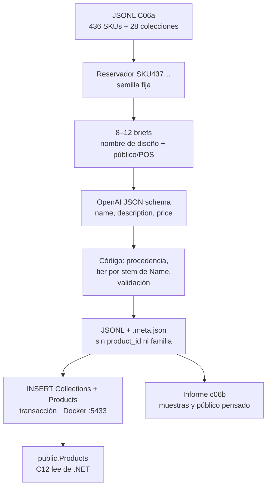

## Context

C06a archivó 436 productos reales (`data_origin: real`) con texto asistido e ingesta `UPDATE` de `Description`. Eso desbloquea C09. C11 y C24 necesitan **volumen en `.NET`**: el índice nace del feed C12, no del JSONL. Un corpus sintético que no se inserta no llega al índice; el grafo `C06b → C11` mentiría.

La ficha v3 de C06b pedía un generador determinista que calibrara precio, SKU y ~350 familias S/M/L al real, con 15 % de huérfanos. La exploración del 2026-08-22 lo sustituye: el real ya tiene 354 grupos internos; prellenar `ProductFamily` chivaría C18; el copy y el precio los razona **OpenAI**; las colecciones son altas nuevas **con nombre de diseño**, no de canal.

Estado del repositorio al diseñar:

| Pieza | Estado |
|---|---|
| Change OpenSpec `add-synthetic-catalog-augmentation` | Scaffold + ticket + HU; proposal escrito en este FF |
| `ai-service/src/jbg_ai/data/` | **Ausente** (C06a no la inauguró) |
| Cliente LLM / `prompts/` / settings `LLM_*` | **Ausentes.** `Settings` exige `APP_ENV` / `SERVICE_VERSION` / `JWT_SECRET`; `database_url` es opcional |
| `ai-service/pyproject.toml` | FastAPI, SQLAlchemy, psycopg, Alembic, PyJWT — **sin** SDK OpenAI |
| `ai-service/openapi.json` | Congelado. Si el snapshot se pone rojo, el change se ha salido de alcance |
| `scripts/catalog/` | Pipeline C06a (`catalog-assist/v2`, plantillas). **No reutilizar `assist.py`** |
| JSONL real | 436 líneas; SKUs `SKU01`…`SKU436`; 28 `collection_name` (p. ej. «Colección Biniacolla») |
| `public."Products"` | `SKU` unique varchar(50), `Name` 200, `Description` 1000, `Price` decimal(18,2), `CollectionId` nullable, `IsActive`. **Sin** familia ni procedencia. `Id` UUID generado por la BD |
| `Collection.Name` | Unique varchar(100) |
| `ProductFamily` / miembros | Existen (C07). C06a no escribió filas. C06b **tampoco** |
| Postgres Docker | `jpv-pv-postgres`, host **5433**, BD `joiabagur_pv` |
| `.gitignore` | Exceptúa `data/catalog/real/generated/`; **no** `synthetic/generated/` |

**Desviación acordada (2026-08-22)** respecto a la ficha v3:

| Ficha 17 ago | Este change |
|---|---|
| Generador determinista en `jbg_ai.data.generators/` como pieza de servicio | **CLI** en `jbg_ai.data`; `api.main` **no** lo importa |
| Calibrar precio, SKU, materiales, tamaño de familia al real | Código reserva SKU con el **esquema del real**; OpenAI razona nombre, descripción y precio; ~35 % multi-material **en la prosa** |
| ~350 familias y 15 % de huérfanos | **No** se escribe `ProductFamily`. Todos huérfanos. Tallas en el `Name`; el tier se sortea por ese stem |
| 900–1.200 calibrados | Presupuesto **~1.200 totales** (holgura) |
| Colecciones genéricas / de canal | 8–12 nombres de **pieza**. Hotel/aeropuerto/turista/atelier = brief de POS, no `Collection.Name` |
| Solo JSONL | JSONL commiteado **+ INSERT** colecciones y productos en Docker |

**Dependientes que condicionan el diseño:**

| Change | Qué necesita | Consecuencia |
|---|---|---|
| **C09** | Texto de catálogo, sin pista léxica de «sintético» en el SKU, sin `materials[]` | SKU con esquema del real; mix de materiales solo en la prosa |
| **C11 / C24** | Filas en `public."Products"` | La ingesta es parte del contrato, no un extra |
| **C13** | Ambos ejes de procedencia al indexar | C06b los deja en JSONL; C13 los materializa en `ai.*` |
| **C18** | Propuesta de familias | **Fuera.** Todos los sintéticos nacen huérfanos (GET familia → 204) |
| **C10** | Mundo numérico (POS, ventas) | **No** espera este change. El brief hotel/aeropuerto **no** crea puntos de venta |
| **C17** | `GET /health` sin claves de proveedor | `LLM_*` opcionales en `Settings` |



## Goals / Non-Goals

**Goals:**

- Corpus sintético que, junto a los 436 reales, acerca el total a **~1.200** productos (holgura documentada en el sidecar).
- SKUs `SKU437`… con el esquema del real; únicos vs JSONL C06a y vs `"Products"."SKU"`; sin prefijo que delate origen.
- 8–12 colecciones **nuevas** de diseño; ningún sintético apunta a una colección real.
- Texto y precio razonados por OpenAI; procedencia y SKU sellados por código.
- Tiers ~70 / ~20 / ~10 por **stem del `Name`**; `text_provenance` siempre `synthetic`.
- Ingesta `INSERT` local transaccional que no toca filas reales ni tablas de familia.
- CLI documentado; `jbg_ai.api.main` no importa `jbg_ai.data`; `/health` arranca sin clave OpenAI.
- JSONL commiteado + sidecar + informe; regenerar texto exige flag.

**Non-Goals:**

- C09 (extractor, vocabularios, `POST /v1/enrich/products`).
- C10 (POS, inventario, ventas, co-ocurrencia).
- C18 (propuesta/aprobación de `ProductFamily`; semilla `family_seed` / `variant_group_key` / `variant_label`).
- C13 (columna `text_provenance` en `ai.product_document`).
- Reutilizar `scripts/catalog/assist.py`.
- Ruta HTTP en FastAPI o en la API .NET. Regenerar `openapi.json`.
- RDS / producción. Migración EF Core o Alembic. Columna de procedencia o de canal en `Product`.
- Colecciones llamadas «Hotel», «Aeropuerto», «Turista», «Atelier» o equivalentes de canal/POS.
- Papelería, portes, cursos u otros no-joyería.
- Cliente LLM **obligatorio** para que `GET /health` arranque.
- Reescribir `product_id` en el JSONL tras el INSERT.
- Calibrar precio, tamaño de familia o longitud de descripción al real.

## Decisions

### 1 · CLI en `jbg_ai.data`, no pieza de runtime ni `scripts/catalog/`

**Decisión:** el generador y la ingesta viven en `ai-service/src/jbg_ai/data/` y se invocan como módulo (`python -m jbg_ai.data generate|ingest`). `create_app` **no** importa ese paquete. No hay router nuevo.

**Por qué.** C06a dejó la zona vacía a propósito: un lote xlsx no debía contaminar `uv sync` del servicio. C06b **sí** inaugura el paquete porque C09 (cliente OpenAI) y C10 (mundo numérico) se sentarán al lado. Eso no convierte el generador en proceso FastAPI: el valor es un CLI de desarrollo, no un endpoint.

**Alternativas descartadas.** *(a) Seguir en `scripts/catalog/`:* aísla dependencias, pero duplica el futuro cliente OpenAI y deja `jbg_ai.data` vacía otra vez. *(b) Router FastAPI:* viola el alcance (sin HTTP) y obligaría a claves en el boot. *(c) Generador como servicio importado por `api.main`:* C17 arrancaría el grafo de datos sin necesidad.

```mermaid
sequenceDiagram
  participant Op as Operador
  participant CLI as jbg_ai.data CLI
  participant OA as OpenAI
  participant J as JSONL git
  participant PG as Postgres :5433

  Op->>CLI: generate --seed …
  CLI->>CLI: leer JSONL C06a; reservar SKU437…
  CLI->>CLI: 8–12 briefs diseño + público
  CLI->>OA: JSON schema name/description/price
  OA-->>CLI: piezas
  CLI->>CLI: sellar procedencia; tier por stem; validar
  CLI->>J: JSONL + .meta.json
  Op->>CLI: ingest
  CLI->>J: leer corpus
  CLI->>PG: BEGIN
  CLI->>PG: INSERT Collections (nombres nuevos)
  CLI->>PG: INSERT Products (Id DEFAULT)
  alt colisión SKU o Collection.Name
    CLI->>PG: ROLLBACK
  else ok
    CLI->>PG: COMMIT
    Note over J: JSONL no se reescribe
  end
```

### 2 · OpenAI razona texto y precio; el código reserva SKU y sella procedencia

**Decisión:** el modelo propone `name`, `description` y `price` (JSON schema, temperatura > 0). El código asigna `sku`, `data_origin: synthetic`, `text_provenance: synthetic` y `text_quality_tier`. El LLM **no** inventa SKUs.

**Por qué.** El diseño §8.2 separa «LLM → lo textual» de «código con semilla → lo relacional». El SKU es identidad que C09 verá; un prefijo `SYN-` o un SKU inventado por el modelo es una pista o una colisión. El precio no se hereda del real ni se recorta a bandas de canal: el brief (pieza, tamaño, materiales, público) es suficiente para razonarlo.

**Alternativas descartadas.** *(a) Generador 100 % determinista (ficha v3):* produce el olor a plantilla de `assist.py` y calibra familias que C18 no debe heredar. *(b) El modelo también elige SKU:* no es determinista y puede chocar con el real. *(c) Bandas de precio por canal:* reintroduce el canal como dato de producto.

Dependencia: paquete `openai` (u HTTP equivalente) en `ai-service/pyproject.toml`. Tests unitarios inyectan un **fake**; cero sockets a proveedores (regla §1 del plan).

### 3 · SKU con el esquema del real, desde 437

**Decisión:** literal `SKU` + 2 dígitos si n < 100 (`SKU01`…`SKU99`), 3 si n < 1000, 4 a partir de 1000. El barrido empieza en **437** y **salta** los SKU ya ocupados. El JSONL C06a tiene 436 productos pero el número más alto es **439**, así que el primer libre es `SKU440`. Unique vs JSONL C06a y vs `"Products"."SKU"` (máx. 50). Sin `SYN-`, `JB-S-` ni otra marca.

**Por qué.** C09 extrae sobre texto y SKU. Un prefijo «synthetic» es una feature gratuita que el extractor (o un evaluador despistado) puede tratar como verdad. Copiar el esquema del real **es** deliberado; copiar precios o tamaños de familia **no**.

Misma `seed` → mismos SKUs reservados. El reservador es una función pura.

### 4 · Colección = diseño; canal = brief

Dos capas que el prompt y el informe deben separar:

| Capa | Qué es | Ejemplo | ¿Va a `"Collections"."Name"`? |
|---|---|---|---|
| Nombre editorial | Identidad de la línea, inspirada en las piezas | «El Jaleo», «Fuego», «Cielo estrellado», «La Pomada» | **Sí** |
| Público / POS pensado | Para quién o en qué vitrina se imagina | hotel, aeropuerto, turista, atelier clásico | **No** — brief e informe |

8–12 colecciones nuevas. Un par pueden ser de diseño menorquín/marino; el resto divergen. Prohibido llamarlas Hotel, Aeropuerto, Turista, Atelier o sinónimos de canal. Unique vs las 28 del JSONL C06a y vs filas ya presentes en `"Collections"`. Ningún producto sintético apunta a una colección real.

**Reparto v2:** el código **no** parte en partes iguales. ~20 % ±5 pp de los sintéticos van **sin colección** (`collection_name` vacío → `CollectionId` NULL). El resto se reparte con pesos estrictamente desiguales (cuadrados  n²…1², permutados por semilla). «El Jaleo» es el **jaleo de cavalls de Menorca**, no flamenco.

**Por qué no reutilizar Biniacolla / Melia / Composturas.** Mezclaría el ancla real con piezas inventadas y falsearía la línea editorial que C12 indexará como colección .NET.

### 5 · Familias fuera; el stem del `Name` solo sirve al tier

**Decisión:** no se escribe `"ProductFamilies"` ni `"ProductFamilyMembers"`. El JSONL **prohíbe** `variant_group_key`, `variant_label`, `family_seed`, `materials` y `product_id`. El sorteo 70/20/10 agrupa por **stem del `Name`** (tallas: «Colgante erizo S» / «Colgante erizo M»): un grupo no mezcla `text_quality_tier`.

**Familias léxicas (v2):** el LLM redacta una **pieza base** (nombre sin talla). El código expande ~40 % de los sintéticos a hermanos S/M/L/XL. De esos miembros, ~60 % ±5 pp pertenecen a una familia **completa** (las cuatro tallas) y ~40 % a una **incompleta** (2 o 3 tallas). Dentro de un grupo: misma `description` y misma `collection_name` (o todas vacías); solo cambian el sufijo de talla y el precio (factores 1.00 / 1.15 / 1.30 / 1.50). C18 sigue siendo quien escribe `ProductFamily*`. GET familia sobre un sintético ingerido: 204.

**Por qué no preasignar ProductFamily.** `Product` no tiene columna de familia. D4 es C18. El real ya tiene 354 grupos internos; ~350 familias sintéticas + 15 % de huérfanos era una cifra de un catálogo 100 % sintético. Todos los sintéticos nacen huérfanos de entidad (GET familia → 204, no 404).

**Por qué no importar `scripts/catalog/`.** La heurística C06a (stem + talla + material si acompaña) existía para no contaminar el JSONL real. C06b reimplementa un stem mínimo en `jbg_ai.data` —no copia el paquete de scripts— porque el runtime de `jbg-ai` no debe depender de `openpyxl`.

El tercer bucket **no** se llama `original` (no hay texto de comerciante) ni `empty` (C06a demostró que se lee como «vaciar»). Se llama **`short`**: copy corto o vacío, ~10 %. `text_provenance` es **siempre** `synthetic` en los tres tiers.

```
hash(stem de Name, seed) → bucket
  [0.00, 0.70)  rich
  [0.70, 0.90)  sparse
  [0.90, 1.00)  short
```

Ratios **por producto** 70/20/10 (`rich` / `sparse` / `short`), tolerancia ±5 pp. El código asigna el tier **antes** del draft (un slot/familia, un bucket) y se lo pasa al LLM. Después recorta **solo por frases enteras** (nunca a mitad de oración) para acercarse a las medias del JSONL real (`ai_enriched`): `rich` ≥150 (media real ~289; el sintético no inventa texto), `sparse` objetivo ≤115 (media real ~115; una frase entera puede llegar a 140), `short` techo 32 (media real original ~14). Si la primera frase no cabe en el techo, la descripción queda vacía; si tras el recorte el copy no casa con el tier, `generate` pide un redraft de esa pieza. ~20 % de los productos `short` quedan con `description` vacía (stem entero, para no romper familias). Semilla por defecto: `20260822`. `generator_version`: `c06b-synth/v3`.

### 6 · Contrato JSONL y por qué no hay `product_id`

```json
{
  "sku": "SKU437",
  "name": "...",
  "description": "...",
  "price": "89.00",
  "collection_name": "El Jaleo",
  "data_origin": "synthetic",
  "text_provenance": "synthetic",
  "text_quality_tier": "rich"
}
```

En C06a `product_id` era un lookup opcional (el xlsx no trae UUID). Aquí el producto **no existía**; el `INSERT` crea `Products.Id`. C09 extrae del texto. C12/C13 leen el Guid **desde .NET**. Reescribir el JSONL tras ingerir ensucia el diff y no tiene consumidor. **Se omite.**

`price` es string decimal como C06a. Validador: `> 0`, cabe en `decimal(18,2)`, **`< 50000`**. `description` ≤ 1000. `name` ≤ 200.

### 7 · Prompt versionado; no es `assist.py`

**Decisión:** prompt versionado en `ai-service/prompts/catalog-synth/` (`v1` y `v2` conservados; la pasada vigente es **`v3`**). Distingue nombre de colección vs público/POS vs tema de línea. El Jaleo = cavalls de Menorca. Pide pieza base **sin talla**, el `text_quality_tier` del lote y ~35 % multi-material **en la prosa**. Voz de joyero imaginativo. Prohibido el molde C06a («El anillo con X, en talla Y, en plata de ley…»).

La pasada real se hace **una vez**. Sin `--regenerate-text`, el CLI no reescribe el JSONL commiteado. El artefacto en git es la fuente; OpenAI no es determinista.

**Por qué no reutilizar `assist.py`.** Esa voz es plantilla determinista sobre un ancla real (no inventar piedras). C06b necesita lo contrario.

### 8 · Ingesta INSERT, transacción, frontera §6.3

```text
Host: localhost:5433
Database: joiabagur_pv
Schema: public
1. INSERT "Collections" (Name unique vs existentes; nombre de diseño)
2. INSERT "Products" (SKU, Name, Description, Price, CollectionId, IsActive=true)
   Id = DEFAULT (uuid generado por la BD / BaseEntity)
NEVER: UPDATE de filas cuyo SKU está en el JSONL C06a
NEVER: "ProductFamilies", "ProductFamilyMembers"
NEVER: reescribir el JSONL con product_id
NEVER: RDS
```

Transacción única. Si un SKU sintético ya existe o un nombre de colección colisiona → `ROLLBACK`. Snapshot previo recomendado (no se commitea).

Credenciales **solo** por `JPV_PGHOST` / `JPV_PGPORT` / `JPV_PGDATABASE` / `JPV_PGUSER` / `JPV_PGPASSWORD`, mismo patrón que C06a.

El rol de runtime de `jbg-ai` **no** gana `INSERT` sobre `public`. El CLI de desarrollo es la misma excepción documentada que C06a.

### 9 · `LLM_*` opcionales; OpenAPI quieto

**Decisión:** clave de generate = `JPV_CATALOG_LLM_API_KEY` (y `JPV_CATALOG_LLM_MODEL`), **distinta** de `JPV_RAG_LLM_API_KEY` (C09, contenedor + SSM). Viven en `backend/.env` (plantilla `.env.example`, junto al compose). El CLI las carga; `jbg-ai` **no** recibe `env_file: .env` entero. Ausencia **no** impide `GET /health`. `openapi.json` **no cambia**.

**Por qué no `Field(...)` requerido.** C17 arranca `jbg-ai` sin claves de proveedor. Convertir la API key en requerida rompería el boot y el test de settings mínimas.

### 10 · Tests con LLM falso; árbol `tests/data/`

El árbol de tests de `ai-service` espeja `src/jbg_ai`. Los tests de este change viven en `ai-service/tests/data/` y usan un cliente OpenAI **fake**. Afirman, entre otros:

- `test_skus_are_unique_across_real_and_synthetic`
- `test_sku_allocator_is_deterministic_for_same_seed`
- `test_sku_follows_real_magnitude_scheme`
- `test_jsonl_omits_family_seed_fields` (también `materials` y `product_id`)
- `test_name_stem_siblings_share_text_quality_tier`
- `test_ingest_inserts_new_products_without_touching_real_skus`
- `test_ingest_creates_new_collections_with_unique_names`
- `test_ingest_rolls_back_on_sku_or_collection_collision`
- `test_description_over_1000_is_rejected`
- `test_price_at_or_above_50000_is_rejected`
- `test_settings_do_not_require_llm_key_to_boot`
- `test_api_main_does_not_import_jbg_ai_data`
- `test_unit_suite_makes_no_provider_calls`
- `test_fit_description_matches_declared_tier`
- `test_fit_does_not_leave_half_a_sentence`
- `test_about_one_fifth_of_short_descriptions_are_emptied`

«Mismas descripciones a igual semilla» **no aplica**. Tests de ingesta: testcontainers Postgres **o** fake de conexión; no requieren Docker para la unidad del reservador/validador.

### 11 · Sidecar, informe y `.gitignore`

Sidecar `.meta.json`: `generator_version`, `seed`, `model` (proveedor + id), `prompt_version`, `generated_at`, `product_count`, ratios por tier, `empty_short_count` / `empty_short_ratio_of_short`, holgura respecto a ~1.200 totales, mix de colecciones sin asignar y de familias léxicas. Opcional: mapa colección → público/POS pensado (metadato de generación; no es columna .NET).

Informe `Documentos/Proyecto Final AIEng/informes/c06b-synthetic-catalog-report.md`: recuentos, nombres de colección **separados** del público pensado, muestras por tier, nota de honestidad (§15: el sintético lo escribe un LLM; las métricas de C24 se desglosan por `data_origin`; el umbral de aceptación sigue siendo la porción real).

`.gitignore`: excepción simétrica a `real/generated/` para `data/catalog/synthetic/generated/` **sin** des-ignorar basura bajo `data/catalog/synthetic/`.

## Risks / Trade-offs

- **[Riesgo] El LLM clona el real o nombra colecciones de canal.** → Mitigación: el prompt lista las 28 colecciones reales como prohibidas; validador rechaza nombres de canal y colisiones; el informe muestra nombre vs público por separado.
- **[Riesgo] Prefijo o formato de SKU que chiva C09.** → Mitigación: reservador único; tests de esquema y de unicidad vs JSONL C06a.
- **[Riesgo] Descripción > 1000 o precio ≥ 50.000 revienta el INSERT (`22001` / invariante de precio).** → Mitigación: validador previo; rechazo y (si es un lote) reintento acotado o fallo de la pasada generate **antes** de ingerir.
- **[Riesgo] Re-ejecutar generate ensucia el diff** (temperatura > 0). → Mitigación: el JSONL commiteado es la fuente; `--regenerate-text` obligatorio para reescribir.
- **[Riesgo] INSERT parcial deja colecciones huérfanas o SKUs a medias.** → Mitigación: transacción única; rollback si colisiona SKU o `Collection.Name`.
- **[Riesgo] Alguien apunta el CLI a RDS.** → Mitigación: documentar host 5433; no hay perfil de producción; credenciales solo por entorno. El change no incluye target remoto.
- **[Riesgo] `Settings` exige la API key y rompe C17.** → Mitigación: campos opcionales; test de boot sin clave; `api.main` no importa `jbg_ai.data`.
- **[Riesgo] El stem de `Name` agrupa mal y mezcla tiers.** → Mitigación: misma idea que C06a (sufijo de talla); test de hermanos S/M; rebalanceo mueve stems enteros.
- **[Riesgo] Recortar por caracteres deja el copy a medias.** → Mitigación: el recorte solo conserva frases enteras; un muñón (p. ej. «Una pulsera que.») no valida; si la primera frase no cabe, la descripción queda vacía o se redrafta.
- **[Trade-off] ±5 pp en ratios** (no ±3). El censo de hermanos lo decide el modelo; un umbral más estrecho fallaría por composición, no por el sorteo.
- **[Trade-off] Python de desarrollo escribe en `public`.** Aceptable porque no es el proceso `jbg-ai` (misma excepción que C06a).
- **[Trade-off] Volumen ~1.200 es holgura, no umbral de aceptación exacto.** El sidecar documenta el recuento; no se rechaza un generate por 1.187 vs 1.213.
- **[Trade-off] C18 no recibe semilla.** Aceptado: contaminaba C09. Los sintéticos quedan huérfanos a propósito.

## Migration Plan

No hay migración de esquema. El plan es de **datos locales**:

1. Asegurar Postgres Docker en 5433 y que `"Products"` tenga los 436 reales de C06a.
2. Abrir la excepción de `.gitignore` para `data/catalog/synthetic/generated/`.
3. Implementar CLI + fake de tests; `uv sync --system-certs` en `ai-service/`.
4. Pasada `generate` (clave OpenAI solo aquí). Validar invariantes, tope 1000, techo de precio, omisión de familia/`product_id`, esquema de SKU.
5. Snapshot de `"Products"` y `"Collections"` si aún no existe (no se commitea).
6. `ingest` en una transacción. Rollback si colisión. Verificar que los 436 reales no cambiaron (SKU/precio/nombre/recuento).
7. Commitear JSONL, sidecar e informe. No reescribir UUIDs en el JSONL.
8. **Rollback de datos:** restaurar el snapshot. El JSONL se queda; es el corpus, no el estado de la BD.
9. **Nada contra RDS.**

## Open Questions

Ninguna bloqueante. Residuales con default:

| # | Tema residual | Opción por defecto |
|---|---|---|
| 1 | Valor concreto de `seed` | `20260822` |
| 2 | `generator_version` / `prompt_version` | `c06b-synth/v3` / `catalog-synth/v3` (`v1` y `v2` se conservan) |
| 3 | Modelo OpenAI por defecto | `gpt-4o` (`JPV_CATALOG_LLM_MODEL`); el sidecar registra `openai:<id>` |
| 4 | ¿Copiar la heurística C06a desde `scripts/catalog/`? | **No.** Stem mínimo reimplementado en `jbg_ai.data` |
| 5 | Nombre del tercer tier | `short` (corto o vacío); nunca `empty` ni `original` |
